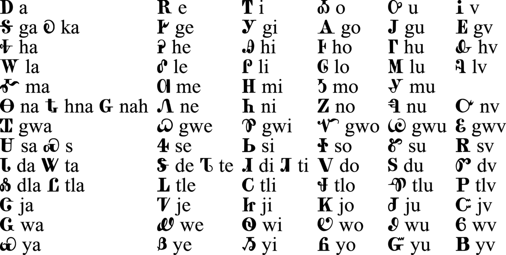

+++
draft=false
date = 2020-04-04T10:26:09Z
title = "Cherokee Language Grammar - Cherokee Messenger - 1844-1846"
weight = 1586010369

[taxonomies]

authors = ["Michael Conrad"]
categories = ["Grammar"]
tags = []

[extra]

featured_image="content/Cherokee-Language-Grammar---Cherokee-Messenger-1844-1846/syllabary-chart.jpg"

+++
## Cherokee Language Grammar

*Please take note:*

  - The following is from the *Brief Specimens of
    Cherokee Grammatical Forms* as printed in the *The
    Cherokee Messenger (ᏣᎳᎩ ᎠᏥᏅᏏᏛ)* in the years 1844 to
    1846\.

  - The original text used ’ds’ for the soft ’ts’ sound. These have been
    replaced with ’ts’ to be consistent with the entirety of the dictionary.
    Additionally “qu” has been replaced with “kw” to be consistent
    with the usage of “gw” in the rest of the text.

  - The following description of Cherokee grammar is for 1840’s Cherokee
    and not today’s Cherokee. While most differences between the two are
    minor, *there are differences*. The material is very useful when
    working with the Cherokee New Testament, the Cherokee translation
    of Genesis, the Cherokee translation of Pilgrim’s Progress, and so
    forth.

  - The English text is also from the 1840’s and has not been “modernized”.
    It is important to understand that “thee” and “thou” are
    used to indicate “you one” and that “ye” and “you”
    are used to indicate “you two or more”.

  - Some re-arrangment of text, tables, and minor changes of wording have
    happened to facilitate e-book creation.
<!-- more -->
## Syllabary

### Characters as arranged by the inventor.

**Ꭱ Ꭰ Ꮃ Ꮵ Ꮐ Ꮽ Ꮺ Ꮅ Ꮑ Ꮌ Ꭹ Ᏹ Ꮟ Ꮲ Ꭳ Ꮇ Ꮄ Ꭽ Ꮼ Ꮰ Ꮤ Ᏼ Ꮈ Ꭿ Ꮝ Ᏺ
Ꮁ Ꭺ Ꮷ Ꮍ Ꮞ Ꮠ Ꮯ Ꮘ Ꮗ Ꮜ Ꮖ Ꮓ Ꭷ Ꮸ Ꮢ Ꮒ Ꭶ Ꮩ Ꭸ Ꮣ Ꭼ Ꮻ Ꭲ Ꭴ Ᏸ Ꮂ Ꮫ Ꭻ Ꮶ Ꮙ Ꮔ Ꮎ Ꮆ
Ᏻ Ꮴ Ꮧ Ꮾ Ꮪ Ꮥ Ꮳ Ꭵ Ꮕ Ꮦ Ꮉ Ꮡ Ꮱ Ꭾ Ꮀ Ꮋ Ꮭ Ꮿ Ꮹ Ꮨ Ꮮ Ꮏ Ꮚ Ꮬ Ꮊ Ꮛ.**

### Characters systematically arranged with the sounds.

### Sounds represented by vowels.

<table>
<tbody>
<tr class="odd">
<td style="text-align: left;">a    </td>
<td style="text-align: left;">as <em>a</em> in <em>father</em>, or short as <em>a</em> in <em>rival</em>,</td>
</tr>
<tr class="even">
<td style="text-align: left;">e    </td>
<td style="text-align: left;">as <em>a</em> in <em>hate</em>, or short as <em>e</em> in <em>met</em>,</td>
</tr>
<tr class="odd">
<td style="text-align: left;">i    </td>
<td style="text-align: left;">as <em>i</em> in <em>pique</em>, or short as <em>i</em> in <em>pin</em>,</td>
</tr>
<tr class="even">
<td style="text-align: left;">o    </td>
<td style="text-align: left;">as <em>o</em> in <em>note</em>, but approaching to <em>aw</em>, in <em>law</em>,</td>
</tr>
<tr class="odd">
<td style="text-align: left;">u    </td>
<td style="text-align: left;">as <em>oo</em> in <em>moon</em>, or short as <em>u</em> in <em>pull</em>,</td>
</tr>
<tr class="even">
<td style="text-align: left;">v    </td>
<td style="text-align: left;">as <em>u</em> in <em>but</em>, nasalized.</td>
</tr>
</tbody>
</table>

### Consonant Sounds.

g is sounded hard, approaching to k; sometimes before e, i, o, u and
v its sound is k. d has a sound between the English d and t; sometimes
before o, u, and v, its sound is t, when written before l and s the
same analogy prevails.

All other letters as in English.

Syllables beginning with g, except ga, have sometimes the power of
k; syllables written with hl, except tla, sometimes vary to dl; la,
le, li, lo, lu, lv, are sometimes sounded hla, hle, hli, hlo, hlu,
hlv.

## Pronouns

The Cherokee language has but two separable personal pronouns, viz.:
First person singular and plural, *A-yv* (ᎠᏴ), “I and we.”
Second person singular and plural, *ni-hi* (ᏂᎯ), “thou and
you.” The third person is indicated by *na* (Ꮎ) or *na-ski*
(ᎾᏍᎩ), “that,” or *hi-ya* (ᎯᏯ) or *hi-a* (ᎯᎠ) “this,”
or by a verb expressing some attribute or condition of the person
spoken of, as:—

<table>
<tbody>
<tr class="odd">
<td style="text-align: left;">ᏥᎦᏙᎦ,</td>
<td style="text-align: left;">tsi-ga-do-ga,</td>
<td style="text-align: left;"><em>the one who is standing</em>,</td>
</tr>
<tr class="even">
<td style="text-align: left;">ᏤᏙᎠ,</td>
<td style="text-align: left;">tse-do-a,</td>
<td style="text-align: left;"><em>the one who is moving about</em>,</td>
</tr>
<tr class="odd">
<td style="text-align: left;">ᏧᏬᎳ,</td>
<td style="text-align: left;">tsu-wo-hla,</td>
<td style="text-align: left;"><em>the one who is sitting down</em>,</td>
</tr>
<tr class="even">
<td style="text-align: left;">ᏥᎦᏅᎦ,</td>
<td style="text-align: left;">tsi-ga-nv-ga,</td>
<td style="text-align: left;"><em>the one who is lying down</em>,</td>
</tr>
<tr class="odd">
<td style="text-align: left;">ᏨᏓᏯᎢ,</td>
<td style="text-align: left;">tsv-da-ya-i,</td>
<td style="text-align: left;"><em>the one who is coming</em>,</td>
</tr>
<tr class="even">
<td style="text-align: left;">ᏥᏩᎢ,</td>
<td style="text-align: left;">tsi-wa-i,</td>
<td style="text-align: left;"><em>the one who is going</em>,</td>
</tr>
<tr class="odd">
<td style="text-align: left;">ᏥᏲᎱᏒ,</td>
<td style="text-align: left;">tsi-yo-hu-sv,</td>
<td style="text-align: left;"><em>the one who is dead</em>,</td>
</tr>
<tr class="even">
<td style="text-align: left;">ᏤᎭ,</td>
<td style="text-align: left;">tse-ha,</td>
<td style="text-align: left;"><em>the one who is living</em>,</td>
</tr>
<tr class="odd">
<td style="text-align: left;">ᏧᏢᎦ,</td>
<td style="text-align: left;">tsu-tlv-ga,</td>
<td style="text-align: left;"><em>the one who is sick</em>,</td>
</tr>
</tbody>
</table>

The Cherokee language has a form of personal pronouns, which may be
termed *reflexive*; in which all the distinctions of person are
indicated. This form has the sense of myself, thyself, \&c., as the
following will exhibit.

<table>
<tbody>
<tr class="odd">
<td style="text-align: left;"></td>
<td style="text-align: left;"></td>
<td style="text-align: left;"></td>
<td style="text-align: left;"></td>
</tr>
<tr class="even">
<td style="text-align: left;">1st person</td>
<td style="text-align: left;">ᎠᏋᏒ</td>
<td style="text-align: left;">a-gwv-sv</td>
<td style="text-align: left;"><em>myself,</em></td>
</tr>
<tr class="odd">
<td style="text-align: left;">2nd person</td>
<td style="text-align: left;">ᏨᏒ</td>
<td style="text-align: left;">tsv-sv</td>
<td style="text-align: left;"><em>thyself,</em></td>
</tr>
<tr class="even">
<td style="text-align: left;">3rd person</td>
<td style="text-align: left;">ᎤᏩᏒ</td>
<td style="text-align: left;">u-wa-sv</td>
<td style="text-align: left;"><em>himself,</em></td>
</tr>
</tbody>
</table>

<table>
<tbody>
<tr class="odd">
<td style="text-align: left;"></td>
<td style="text-align: left;"></td>
<td style="text-align: left;"></td>
<td style="text-align: left;"></td>
</tr>
<tr class="even">
<td style="text-align: left;">1st and 2nd person</td>
<td style="text-align: left;">ᎩᏅᏒ</td>
<td style="text-align: left;">gi-nv-sv</td>
<td style="text-align: left;"><em>ourselves, (thyself and myself)</em></td>
</tr>
<tr class="odd">
<td style="text-align: left;">1st and 3rd person</td>
<td style="text-align: left;">ᎣᎩᏅᏒ</td>
<td style="text-align: left;">o-gi-nv-sv</td>
<td style="text-align: left;"><em>ourselves, (himself and myself)</em></td>
</tr>
<tr class="even">
<td style="text-align: left;">2nd person</td>
<td style="text-align: left;">ᏍᏛᏒ</td>
<td style="text-align: left;">sdv-sv</td>
<td style="text-align: left;"><em>yourselves, (two)</em></td>
</tr>
</tbody>
</table>

<table>
<tbody>
<tr class="odd">
<td style="text-align: left;"></td>
<td style="text-align: left;"></td>
<td style="text-align: left;"></td>
<td style="text-align: left;"></td>
</tr>
<tr class="even">
<td style="text-align: left;">1st and 2nd person</td>
<td style="text-align: left;">ᎢᎬᏒ</td>
<td style="text-align: left;">i-gv-sv</td>
<td style="text-align: left;"><em>ourselves, (yourselves and myself)</em></td>
</tr>
<tr class="odd">
<td style="text-align: left;">1st and 3rd person</td>
<td style="text-align: left;">ᎣᎬᏒ</td>
<td style="text-align: left;">o-gv-sv</td>
<td style="text-align: left;"><em>ourselves, (themselves and myself)</em></td>
</tr>
<tr class="even">
<td style="text-align: left;">2nd person</td>
<td style="text-align: left;">ᎢᏨᏒ</td>
<td style="text-align: left;">i-tsv-sv</td>
<td style="text-align: left;"><em>yourselves, (three or more)</em></td>
</tr>
<tr class="odd">
<td style="text-align: left;">3rd person</td>
<td style="text-align: left;">ᎤᏅᏒ</td>
<td style="text-align: left;">u-nv-sv</td>
<td style="text-align: left;"><em>themselves</em></td>
</tr>
</tbody>
</table>

The following table exhibits the possessive pronouns; the object possessed
being singular.

<table>
<tbody>
<tr class="odd">
<td style="text-align: left;"></td>
<td style="text-align: left;"></td>
<td style="text-align: left;"></td>
<td style="text-align: left;"></td>
</tr>
<tr class="even">
<td style="text-align: left;">1st person</td>
<td style="text-align: left;">ᎠᏆᏤᎵ</td>
<td style="text-align: left;">a-kwa-tse-li</td>
<td style="text-align: left;"><em>mine,</em></td>
</tr>
<tr class="odd">
<td style="text-align: left;">2nd person</td>
<td style="text-align: left;">ᏣᏤᎵ</td>
<td style="text-align: left;">tsa-tse-li</td>
<td style="text-align: left;"><em>thine,</em></td>
</tr>
<tr class="even">
<td style="text-align: left;">3rd person</td>
<td style="text-align: left;">ᎤᏤᎵ</td>
<td style="text-align: left;">u-tse-li</td>
<td style="text-align: left;"><em>his,</em></td>
</tr>
</tbody>
</table>

<table>
<tbody>
<tr class="odd">
<td style="text-align: left;"></td>
<td style="text-align: left;"></td>
<td style="text-align: left;"></td>
<td style="text-align: left;"></td>
</tr>
<tr class="even">
<td style="text-align: left;">1st and 2nd person</td>
<td style="text-align: left;">ᎩᎾᏤᎵ</td>
<td style="text-align: left;">gi-na-tse-li</td>
<td style="text-align: left;"><em>ours, (mine and thine)</em></td>
</tr>
<tr class="odd">
<td style="text-align: left;">1st and 3rd person</td>
<td style="text-align: left;">ᎣᎩᎾᏤᎵ</td>
<td style="text-align: left;">o-gi-na-tse-li</td>
<td style="text-align: left;"><em>ours, (his and mine)</em></td>
</tr>
<tr class="even">
<td style="text-align: left;">2nd person</td>
<td style="text-align: left;">ᏍᏓᏤᎵ</td>
<td style="text-align: left;">sda-tse-li</td>
<td style="text-align: left;"><em>yours, (two)</em></td>
</tr>
</tbody>
</table>

<table>
<tbody>
<tr class="odd">
<td style="text-align: left;"></td>
<td style="text-align: left;"></td>
<td style="text-align: left;"></td>
<td style="text-align: left;"></td>
</tr>
<tr class="even">
<td style="text-align: left;">1st and 2nd person</td>
<td style="text-align: left;">ᎢᎦᏤᎵ</td>
<td style="text-align: left;">i-ga-tse-li</td>
<td style="text-align: left;"><em>ours, (yours and mine)</em></td>
</tr>
<tr class="odd">
<td style="text-align: left;">1st and 3rd person</td>
<td style="text-align: left;">ᎣᎦᏤᎵ</td>
<td style="text-align: left;">o-ga-tse-li</td>
<td style="text-align: left;"><em>ours, (theirs and mine)</em></td>
</tr>
<tr class="even">
<td style="text-align: left;">2nd person</td>
<td style="text-align: left;">ᎢᏣᏤᎵ</td>
<td style="text-align: left;">i-tsa-tse-li</td>
<td style="text-align: left;"><em>yours, (three or more)</em></td>
</tr>
<tr class="odd">
<td style="text-align: left;">3rd person</td>
<td style="text-align: left;">ᎤᎾᏤᎵ</td>
<td style="text-align: left;">u-na-tse-li</td>
<td style="text-align: left;"><em>theirs.</em></td>
</tr>
</tbody>
</table>

Two degrees of intensity are denoted by adding *ga* (Ꭶ) and *gaya*
(ᎦᏯ), as *akwatseliga* (ᎠᏆᏤᎵᎦ), “mine” (positively); *akwatseligaya*
(ᎠᏆᏤᎵᎦᏯ), “mine” (really): i.e. “I alone am the real owner.”

When the posession of more than one object is to be denoted, the prefixes
are varied thus:—

<table>
<tbody>
<tr class="odd">
<td style="text-align: left;"></td>
<td style="text-align: left;"></td>
<td style="text-align: left;"></td>
<td style="text-align: left;"></td>
<td style="text-align: left;"></td>
<td style="text-align: left;"></td>
</tr>
<tr class="even">
<td style="text-align: left;">1st person</td>
<td style="text-align: left;">ᏗᏆ</td>
<td style="text-align: left;">di-gwa</td>
<td style="text-align: left;">ᏗᏆᏤᎵ</td>
<td style="text-align: left;">di-gwa-tse-li</td>
<td style="text-align: left;"><em>mine,</em></td>
</tr>
<tr class="odd">
<td style="text-align: left;">2nd person</td>
<td style="text-align: left;">ᏗᏣ</td>
<td style="text-align: left;">di-tsa</td>
<td style="text-align: left;">ᏗᏣᏤᎵ</td>
<td style="text-align: left;">di-tsa-tse-li</td>
<td style="text-align: left;"><em>thine,</em></td>
</tr>
<tr class="even">
<td style="text-align: left;">3rd person</td>
<td style="text-align: left;">Ꮷ</td>
<td style="text-align: left;">tsu</td>
<td style="text-align: left;">ᏧᏤᎵ</td>
<td style="text-align: left;">tsu-tse-li</td>
<td style="text-align: left;"><em>his,</em></td>
</tr>
</tbody>
</table>

<table>
<tbody>
<tr class="odd">
<td style="text-align: left;"></td>
<td style="text-align: left;"></td>
<td style="text-align: left;"></td>
<td style="text-align: left;"></td>
<td style="text-align: left;"></td>
<td style="text-align: left;"></td>
</tr>
<tr class="even">
<td style="text-align: left;">1st and 2nd</td>
<td style="text-align: left;">ᏗᎩᎾ</td>
<td style="text-align: left;">di-gi-na</td>
<td style="text-align: left;">ᏗᎩᎾᏤᎵ</td>
<td style="text-align: left;">di-gi-na-tse-li</td>
<td style="text-align: left;"><em>ours, (mine and thine)</em></td>
</tr>
<tr class="odd">
<td style="text-align: left;">1st and 3rd</td>
<td style="text-align: left;">ᏦᎩᎾ</td>
<td style="text-align: left;">tso-gi-na</td>
<td style="text-align: left;">ᏦᎩᎾᏤᎵ</td>
<td style="text-align: left;">tso-gi-na-tse-li</td>
<td style="text-align: left;"><em>ours, (his and mine)</em></td>
</tr>
<tr class="even">
<td style="text-align: left;">2nd person</td>
<td style="text-align: left;">ᏗᏍᏓ</td>
<td style="text-align: left;">di-sda</td>
<td style="text-align: left;">ᏗᏍᏓᏤᎵ</td>
<td style="text-align: left;">di-sda-tse-li</td>
<td style="text-align: left;"><em>yours, (two)</em></td>
</tr>
</tbody>
</table>

<table>
<tbody>
<tr class="odd">
<td style="text-align: left;"></td>
<td style="text-align: left;"></td>
<td style="text-align: left;"></td>
<td style="text-align: left;"></td>
<td style="text-align: left;"></td>
<td style="text-align: left;"></td>
</tr>
<tr class="even">
<td style="text-align: left;">1st and 2nd</td>
<td style="text-align: left;">ᏗᎦ</td>
<td style="text-align: left;">di-ga</td>
<td style="text-align: left;">ᏗᎦᏤᎵ</td>
<td style="text-align: left;">di-ga-tse-li</td>
<td style="text-align: left;"><em>ours, (yours and mine)</em></td>
</tr>
<tr class="odd">
<td style="text-align: left;">1st and 3rd</td>
<td style="text-align: left;">ᏦᎦ</td>
<td style="text-align: left;">tso-ga</td>
<td style="text-align: left;">ᏦᎦᏤᎵ</td>
<td style="text-align: left;">tso-ga-tse-li</td>
<td style="text-align: left;"><em>ours, (theirs and mine)</em></td>
</tr>
<tr class="even">
<td style="text-align: left;">2nd person</td>
<td style="text-align: left;">ᏗᏣ</td>
<td style="text-align: left;">di-tsa</td>
<td style="text-align: left;">ᏗᏣᏤᎵ</td>
<td style="text-align: left;">di-tsa-tse-li</td>
<td style="text-align: left;"><em>yours, (three or more)</em></td>
</tr>
<tr class="odd">
<td style="text-align: left;">3rd person</td>
<td style="text-align: left;">ᏧᎾ</td>
<td style="text-align: left;">tsu-na</td>
<td style="text-align: left;">ᏧᎾᏤᎵ</td>
<td style="text-align: left;">tsu-na-tse-li</td>
<td style="text-align: left;"><em>theirs.</em></td>
</tr>
</tbody>
</table>

In the congugation of verbs the person is indicated by inseparable
prefixes, as:—

<table>
<tbody>
<tr class="odd">
<td style="text-align: left;"></td>
<td style="text-align: left;"></td>
<td style="text-align: left;"></td>
<td style="text-align: left;"></td>
<td style="text-align: left;"></td>
<td style="text-align: left;"></td>
</tr>
<tr class="even">
<td style="text-align: left;">1st person</td>
<td style="text-align: left;">Ꮵ</td>
<td style="text-align: left;">tsi</td>
<td style="text-align: left;">ᏥᏁᎦ</td>
<td style="text-align: left;">tsi-ne-ga</td>
<td style="text-align: left;"><em>I speak,</em></td>
</tr>
<tr class="odd">
<td style="text-align: left;">2nd person</td>
<td style="text-align: left;">Ꭿ</td>
<td style="text-align: left;">hi</td>
<td style="text-align: left;">ᎯᏁᎦ</td>
<td style="text-align: left;">hi-ne-ga</td>
<td style="text-align: left;"><em>thou speakest,</em></td>
</tr>
<tr class="even">
<td style="text-align: left;">3rd person</td>
<td style="text-align: left;">Ꭷ</td>
<td style="text-align: left;">ka</td>
<td style="text-align: left;">ᎧᏁᎦ</td>
<td style="text-align: left;">ka-ne-ga</td>
<td style="text-align: left;"><em>he speaks,</em></td>
</tr>
</tbody>
</table>

<table>
<tbody>
<tr class="odd">
<td style="text-align: left;"></td>
<td style="text-align: left;"></td>
<td style="text-align: left;"></td>
<td style="text-align: left;"></td>
<td style="text-align: left;"></td>
<td style="text-align: left;"></td>
</tr>
<tr class="even">
<td style="text-align: left;">1st and 2nd</td>
<td style="text-align: left;">ᎢᏂ</td>
<td style="text-align: left;">i-ni</td>
<td style="text-align: left;">ᎢᏂᏁᎦ</td>
<td style="text-align: left;">i-ni-ne-ga</td>
<td style="text-align: left;"><em>we (thou and I) speak,</em></td>
</tr>
<tr class="odd">
<td style="text-align: left;">1st and 3rd</td>
<td style="text-align: left;">ᎣᏍᏗ</td>
<td style="text-align: left;">o-sdi</td>
<td style="text-align: left;">ᎣᏍᏗᏁᎦ</td>
<td style="text-align: left;">o-sdi-ne-ga</td>
<td style="text-align: left;"><em>we (he and I) speak,</em></td>
</tr>
<tr class="even">
<td style="text-align: left;">2nd person</td>
<td style="text-align: left;">ᏍᏗ</td>
<td style="text-align: left;">sdi</td>
<td style="text-align: left;">ᏍᏗᏁᎦ</td>
<td style="text-align: left;">sdi-ne-ga</td>
<td style="text-align: left;"><em>you (two) speak,</em></td>
</tr>
</tbody>
</table>

<table>
<tbody>
<tr class="odd">
<td style="text-align: left;"></td>
<td style="text-align: left;"></td>
<td style="text-align: left;"></td>
<td style="text-align: left;"></td>
<td style="text-align: left;"></td>
<td style="text-align: left;"></td>
</tr>
<tr class="even">
<td style="text-align: left;">1st and 2nd</td>
<td style="text-align: left;">ᎢᏗ</td>
<td style="text-align: left;">i-di</td>
<td style="text-align: left;">ᎢᏗᏁᎦ</td>
<td style="text-align: left;">i-di-ne-ga</td>
<td style="text-align: left;"><em>we (you and I) speak,</em></td>
</tr>
<tr class="odd">
<td style="text-align: left;">1st and 3rd</td>
<td style="text-align: left;">ᎣᏥ</td>
<td style="text-align: left;">o-tsi</td>
<td style="text-align: left;">ᎣᏥᏁᎦ</td>
<td style="text-align: left;">o-tsi-ne-ga</td>
<td style="text-align: left;"><em>we (they and I) speak,</em></td>
</tr>
<tr class="even">
<td style="text-align: left;">2nd person</td>
<td style="text-align: left;">ᎢᏥ</td>
<td style="text-align: left;">i-tsi</td>
<td style="text-align: left;">ᎢᏥᏁᎦ</td>
<td style="text-align: left;">i-tsi-ne-ga</td>
<td style="text-align: left;"><em>you (three or more) speak,</em></td>
</tr>
<tr class="odd">
<td style="text-align: left;">3rd person</td>
<td style="text-align: left;">ᎠᏂ</td>
<td style="text-align: left;">a-ni</td>
<td style="text-align: left;">ᎠᏂᏁᎦ</td>
<td style="text-align: left;">a-ni-ne-ga</td>
<td style="text-align: left;"><em>they speak.</em></td>
</tr>
</tbody>
</table>

In some tenses the personal prefixes take the following form, as:—

<table>
<tbody>
<tr class="odd">
<td style="text-align: left;"></td>
<td style="text-align: left;"></td>
<td style="text-align: left;"></td>
<td style="text-align: left;"></td>
<td style="text-align: left;"></td>
<td style="text-align: left;"></td>
</tr>
<tr class="even">
<td style="text-align: left;">1st person</td>
<td style="text-align: left;">Ꮵ</td>
<td style="text-align: left;">tsi</td>
<td style="text-align: left;">ᏥᏁᎦ</td>
<td style="text-align: left;">tsi-ne-ga</td>
<td style="text-align: left;"><em>I speak,</em></td>
</tr>
<tr class="odd">
<td style="text-align: left;">2nd person</td>
<td style="text-align: left;">Ꭿ</td>
<td style="text-align: left;">hi</td>
<td style="text-align: left;">ᎯᏁᎦ</td>
<td style="text-align: left;">hi-ne-ga</td>
<td style="text-align: left;"><em>thou speakest,</em></td>
</tr>
<tr class="even">
<td style="text-align: left;">3rd person</td>
<td style="text-align: left;">Ꭷ</td>
<td style="text-align: left;">ka</td>
<td style="text-align: left;">ᎧᏁᎦ</td>
<td style="text-align: left;">ka-ne-ga</td>
<td style="text-align: left;"><em>he speaks,</em></td>
</tr>
</tbody>
</table>

<table>
<tbody>
<tr class="odd">
<td style="text-align: left;"></td>
<td style="text-align: left;"></td>
<td style="text-align: left;"></td>
<td style="text-align: left;"></td>
<td style="text-align: left;"></td>
<td style="text-align: left;"></td>
</tr>
<tr class="even">
<td style="text-align: left;">1st and 2nd</td>
<td style="text-align: left;">ᎢᏂ</td>
<td style="text-align: left;">i-ni</td>
<td style="text-align: left;">ᎢᏂᏁᎦ</td>
<td style="text-align: left;">i-ni-ne-ga</td>
<td style="text-align: left;"><em>we (thou and I) speak,</em></td>
</tr>
<tr class="odd">
<td style="text-align: left;">1st and 3rd</td>
<td style="text-align: left;">ᎣᏍᏗ</td>
<td style="text-align: left;">o-sdi</td>
<td style="text-align: left;">ᎣᏍᏗᏁᎦ</td>
<td style="text-align: left;">o-sdi-ne-ga</td>
<td style="text-align: left;"><em>we (he and I) speak,</em></td>
</tr>
<tr class="even">
<td style="text-align: left;">2nd person</td>
<td style="text-align: left;">ᏍᏗ</td>
<td style="text-align: left;">sdi</td>
<td style="text-align: left;">ᏍᏗᏁᎦ</td>
<td style="text-align: left;">sdi-ne-ga</td>
<td style="text-align: left;"><em>you (two) speak,</em></td>
</tr>
</tbody>
</table>

<table>
<tbody>
<tr class="odd">
<td style="text-align: left;"></td>
<td style="text-align: left;"></td>
<td style="text-align: left;"></td>
<td style="text-align: left;"></td>
<td style="text-align: left;"></td>
<td style="text-align: left;"></td>
</tr>
<tr class="even">
<td style="text-align: left;">1st and 2nd</td>
<td style="text-align: left;">ᎢᏗ</td>
<td style="text-align: left;">i-di</td>
<td style="text-align: left;">ᎢᏗᏁᎦ</td>
<td style="text-align: left;">i-di-ne-ga</td>
<td style="text-align: left;"><em>we (you and I) speak,</em></td>
</tr>
<tr class="odd">
<td style="text-align: left;">1st and 3rd</td>
<td style="text-align: left;">ᎣᏥ</td>
<td style="text-align: left;">o-tsi</td>
<td style="text-align: left;">ᎣᏥᏁᎦ</td>
<td style="text-align: left;">o-tsi-ne-ga</td>
<td style="text-align: left;"><em>we (they and I) speak,</em></td>
</tr>
<tr class="even">
<td style="text-align: left;">2nd person</td>
<td style="text-align: left;">ᎢᏥ</td>
<td style="text-align: left;">i-tsi</td>
<td style="text-align: left;">ᎢᏥᏁᎦ</td>
<td style="text-align: left;">i-tsi-ne-ga</td>
<td style="text-align: left;"><em>you (three or more) speak,</em></td>
</tr>
<tr class="odd">
<td style="text-align: left;">3rd person</td>
<td style="text-align: left;">ᎠᏂ</td>
<td style="text-align: left;">a-ni</td>
<td style="text-align: left;">ᎠᏂᏁᎦ</td>
<td style="text-align: left;">a-ni-ne-ga</td>
<td style="text-align: left;"><em>they speak.</em></td>
</tr>
</tbody>
</table>

In some tenses the personal prefixes take the following, as:—

<table>
<tbody>
<tr class="odd">
<td style="text-align: left;"></td>
<td style="text-align: left;"></td>
<td style="text-align: left;"></td>
<td style="text-align: left;"></td>
<td style="text-align: left;"></td>
<td style="text-align: left;"></td>
</tr>
<tr class="even">
<td style="text-align: left;">1st person</td>
<td style="text-align: left;">ᎠᎩ</td>
<td style="text-align: left;">a-gi</td>
<td style="text-align: left;">ᎠᎩᏁᏨ</td>
<td style="text-align: left;">a-gi-ne-tsv</td>
<td style="text-align: left;"><em>I have spoken,</em></td>
</tr>
<tr class="odd">
<td style="text-align: left;">2nd person</td>
<td style="text-align: left;">Ꮳ</td>
<td style="text-align: left;">tsa</td>
<td style="text-align: left;">ᏣᏁᏨ</td>
<td style="text-align: left;">tsa-ne-tsv</td>
<td style="text-align: left;"><em>thou hast spoken,</em></td>
</tr>
<tr class="even">
<td style="text-align: left;">3rd person</td>
<td style="text-align: left;">Ꭴ</td>
<td style="text-align: left;">u</td>
<td style="text-align: left;">ᎤᏁᏨ</td>
<td style="text-align: left;">u-ne-tsv</td>
<td style="text-align: left;"><em>he hast spoken,</em></td>
</tr>
</tbody>
</table>

<table>
<tbody>
<tr class="odd">
<td style="text-align: left;"></td>
<td style="text-align: left;"></td>
<td style="text-align: left;"></td>
<td style="text-align: left;"></td>
<td style="text-align: left;"></td>
<td style="text-align: left;"></td>
</tr>
<tr class="even">
<td style="text-align: left;">1st and 2nd</td>
<td style="text-align: left;">ᎩᏂ</td>
<td style="text-align: left;">gi-ni</td>
<td style="text-align: left;">ᎩᏂᏁᏨ</td>
<td style="text-align: left;">gi-ni-ne-tsv</td>
<td style="text-align: left;"><em>we (thou and I) have spoken,</em></td>
</tr>
<tr class="odd">
<td style="text-align: left;">1st and 3rd</td>
<td style="text-align: left;">ᎣᎩᏂ</td>
<td style="text-align: left;">o-gi-ni</td>
<td style="text-align: left;">ᎣᎩᏂᏁᏨ</td>
<td style="text-align: left;">o-gi-ni-ne-tsv</td>
<td style="text-align: left;"><em>we (he and I) have spoken,</em></td>
</tr>
<tr class="even">
<td style="text-align: left;">2nd person</td>
<td style="text-align: left;">ᏍᏗ</td>
<td style="text-align: left;">sdi</td>
<td style="text-align: left;">ᏍᏗᏁᏨ</td>
<td style="text-align: left;">sdi-ne-tsv</td>
<td style="text-align: left;"><em>you (two) have spoken,</em></td>
</tr>
</tbody>
</table>

<table>
<tbody>
<tr class="odd">
<td style="text-align: left;"></td>
<td style="text-align: left;"></td>
<td style="text-align: left;"></td>
<td style="text-align: left;"></td>
<td style="text-align: left;"></td>
<td style="text-align: left;"></td>
</tr>
<tr class="even">
<td style="text-align: left;">1st and 2nd</td>
<td style="text-align: left;">ᎢᎩ</td>
<td style="text-align: left;">i-gi</td>
<td style="text-align: left;">ᎢᎩᏁᏨ</td>
<td style="text-align: left;">i-gi-ne-tsv</td>
<td style="text-align: left;"><em>we (you and I) have spoken,</em></td>
</tr>
<tr class="odd">
<td style="text-align: left;">1st and 3rd</td>
<td style="text-align: left;">ᎣᎩ</td>
<td style="text-align: left;">o-gi</td>
<td style="text-align: left;">ᎣᎩᏁᏨ</td>
<td style="text-align: left;">o-gi-ne-tsv</td>
<td style="text-align: left;"><em>we (they and I) have spoken,</em></td>
</tr>
<tr class="even">
<td style="text-align: left;">2nd person</td>
<td style="text-align: left;">ᎢᏥ</td>
<td style="text-align: left;">i-tsi</td>
<td style="text-align: left;">ᎢᏥᏁᏨ</td>
<td style="text-align: left;">i-tsi-ne-tsv</td>
<td style="text-align: left;"><em>you (three or more) have spoken,</em></td>
</tr>
<tr class="odd">
<td style="text-align: left;">3rd person</td>
<td style="text-align: left;">ᎤᏂ</td>
<td style="text-align: left;">u-ni</td>
<td style="text-align: left;">ᎤᏂᏁᏨ</td>
<td style="text-align: left;">u-ni-ne-tsv</td>
<td style="text-align: left;"><em>they have spoken.</em></td>
</tr>
</tbody>
</table>

## Overview of Verbs

The simplest form in which we find being and tense, indicated in Cherokee,
is in the Impersonal Substantive Verb *ge-sv-i* (ᎨᏒᎢ), “being,”
and *i-gi* (ᎢᎩ), “is.”

### Indicative Mood

<table>
<tbody>
<tr class="odd">
<td style="text-align: left;">Verbal noun,</td>
<td style="text-align: left;">ᎨᏒᎢ</td>
<td style="text-align: left;">ge-sv-i</td>
<td style="text-align: left;"><em>being</em></td>
</tr>
<tr class="even">
<td style="text-align: left;">Conditional or habitual,</td>
<td style="text-align: left;">ᎨᏐᎢ</td>
<td style="text-align: left;">ge-so-i</td>
<td style="text-align: left;"><em>is, (usually, habitually, or on certain occasions,)</em></td>
</tr>
<tr class="odd">
<td style="text-align: left;">Imperfect - conscious,</td>
<td style="text-align: left;">ᎨᏒᎩ</td>
<td style="text-align: left;">ge-sv-gi</td>
<td style="text-align: left;"><em>was, (with personal knowlege, or consciousness,)</em></td>
</tr>
<tr class="even">
<td style="text-align: left;">Imperfect - unconscious,</td>
<td style="text-align: left;">ᎨᏎᎢ</td>
<td style="text-align: left;">ge-se-i</td>
<td style="text-align: left;"><em>was, (without personal knowlege, or consciousness,)</em></td>
</tr>
<tr class="odd">
<td style="text-align: left;">Future tense,</td>
<td style="text-align: left;">ᎨᏎᏍᏗ</td>
<td style="text-align: left;">ge-se-sdi</td>
<td style="text-align: left;"><em>will be.</em></td>
</tr>
</tbody>
</table>

The distinctions indicated by the inflections of this verb, are combined
with several of the simple tenses of regular verbs, forming compounds
by which many very minute divisions of time, are marked with great
precision.

The *ge-so-i* (ᎨᏐᎢ) inflection modifies the principal tense,
so, as to indicate the usual, customary or habitual prevalence of
what is affirmed, in quantity, quality or frequency: or under certain
circumstances or conditions.

> Note: The terms which, in this material, are given to the conjugations,
> moods, tenses, and other distinctions, indicated by the inflections
> of the Cherokee verb, are only used provisionally; such terms vary
> widely in other materials.

### Conjugations

The regular Cherokee verb has nine conjugations, viz:

<table>
<tbody>
<tr class="odd">
<td style="text-align: left;">Radical</td>
<td style="text-align: left;">ᏥᏁᎦ</td>
<td style="text-align: left;">tsi-ne-ga</td>
<td style="text-align: left;"><em>I speak, or I am speaking.</em></td>
</tr>
<tr class="even">
<td style="text-align: left;">Instrumental</td>
<td style="text-align: left;">ᏥᏁᎢᏍᏗᎭ</td>
<td style="text-align: left;">tsi-ne-i-sdi-ha</td>
<td style="text-align: left;"><em>I speak with it, &amp;c.</em></td>
</tr>
<tr class="odd">
<td style="text-align: left;">Dative</td>
<td style="text-align: left;">ᏥᏁᏤᎭ</td>
<td style="text-align: left;">tsi-ne-tse-ha</td>
<td style="text-align: left;"><em>I speak to or for him, &amp;c.</em></td>
</tr>
<tr class="even">
<td style="text-align: left;">Departing</td>
<td style="text-align: left;">ᏥᏁᏤᎦ</td>
<td style="text-align: left;">tsi-ne-tse-ga</td>
<td style="text-align: left;"><em>I go (to some place) to speak,</em></td>
</tr>
<tr class="odd">
<td style="text-align: left;">Approaching</td>
<td style="text-align: left;">ᏥᏁᏥᎯᎭ</td>
<td style="text-align: left;">tsi-ne-tsi-hi-ha</td>
<td style="text-align: left;"><em>I come (to some place) to speak,</em></td>
</tr>
<tr class="even">
<td style="text-align: left;">Ambulant</td>
<td style="text-align: left;">ᏥᏁᏥᏙᎭ</td>
<td style="text-align: left;">tsi-ne-tsi-do-ha</td>
<td style="text-align: left;"><em>I speak about in various places,</em></td>
</tr>
<tr class="odd">
<td style="text-align: left;">Frequentative</td>
<td style="text-align: left;">ᏥᏁᏥᎶᎭ</td>
<td style="text-align: left;">tsi-ne-tsi-lo-ha</td>
<td style="text-align: left;"><em>I speak repeatedly,</em></td>
</tr>
<tr class="even">
<td style="text-align: left;">Perfective or Intensive</td>
<td style="text-align: left;">ᏥᏁᏥᏏᎭ</td>
<td style="text-align: left;">tsi-ne-tsi-si-ha</td>
<td style="text-align: left;"><em>I speak confirming, or adding force to what has been spoken,</em></td>
</tr>
<tr class="odd">
<td style="text-align: left;">Completive or Finishing</td>
<td style="text-align: left;">ᏥᏁᏦᎲᏍᎦ</td>
<td style="text-align: left;">tsi-ne-tso-hv-sga</td>
<td style="text-align: left;"><em>I speak all, or finish speaking.</em></td>
</tr>
</tbody>
</table>

## The Radical Conjugation

### Indicative Mood

#### Present Tense and its Modifications.

<table>
<tbody>
<tr class="odd">
<td style="text-align: left;">ᎧᏁᎦ</td>
<td style="text-align: left;">ka-ne-ga</td>
<td style="text-align: left;"><em>he is speaking,</em></td>
</tr>
<tr class="even">
<td style="text-align: left;">ᎧᏁᎪᎢ</td>
<td style="text-align: left;">ka-ne-go-i</td>
<td style="text-align: left;"><em>he is peaking habitually, or on certain occasions,</em></td>
</tr>
<tr class="odd">
<td style="text-align: left;">ᎧᏁᎬᎩ</td>
<td style="text-align: left;">ka-ne-gv-gi</td>
<td style="text-align: left;"><em>he was speaking with my personal knowledge,</em></td>
</tr>
<tr class="even">
<td style="text-align: left;">ᎧᏁᎨᎢ</td>
<td style="text-align: left;">ka-ne-ge-i</td>
<td style="text-align: left;"><em>he was speaking without my personal knowledge,</em></td>
</tr>
<tr class="odd">
<td style="text-align: left;">ᎧᏁᎨᏍᏗ</td>
<td style="text-align: left;">ka-ne-ge-sdi</td>
<td style="text-align: left;"><em>he will be speaking,</em></td>
</tr>
<tr class="even">
<td style="text-align: left;">ᎧᏁᎬᎢ</td>
<td style="text-align: left;">ka-ne-gv-i</td>
<td style="text-align: left;"><em>his speaking, or his word.</em></td>
</tr>
</tbody>
</table>

Of these forms, *ka-ne-gv-gi* (ᎧᏁᎬᎩ), indicates the presence
or personal knowledge of the person who relates the fact: *ka-ne-ge-i*
(ᎧᏁᎨᎢ), the absence of personal knowledge.

#### The Present Tense, showing the distinctions of person, and the modifications of tense.

*Distinctions of Person:*

<table>
<tbody>
<tr class="odd">
<td style="text-align: left;"></td>
<td style="text-align: left;"></td>
<td style="text-align: left;"></td>
</tr>
<tr class="even">
<td style="text-align: left;">1st person</td>
<td style="text-align: left;">ᏥᏁ-</td>
<td style="text-align: left;">tsi-ne-</td>
</tr>
<tr class="odd">
<td style="text-align: left;">2nd person</td>
<td style="text-align: left;">ᎯᏁ-</td>
<td style="text-align: left;">hi-ne-</td>
</tr>
<tr class="even">
<td style="text-align: left;">3rd person</td>
<td style="text-align: left;">ᎧᏁ-</td>
<td style="text-align: left;">ka-ne-</td>
</tr>
</tbody>
</table>

<table>
<tbody>
<tr class="odd">
<td style="text-align: left;"></td>
<td style="text-align: left;"></td>
<td style="text-align: left;"></td>
</tr>
<tr class="even">
<td style="text-align: left;">1st and 2nd</td>
<td style="text-align: left;">ᎢᏂᏁ-</td>
<td style="text-align: left;">i-ni-ne-</td>
</tr>
<tr class="odd">
<td style="text-align: left;">1st and 3rd</td>
<td style="text-align: left;">ᎣᏍᏗᏁ-</td>
<td style="text-align: left;">o-sdi-ne-</td>
</tr>
<tr class="even">
<td style="text-align: left;">2nd person</td>
<td style="text-align: left;">ᏍᏗᏁ-</td>
<td style="text-align: left;">sdi-ne-</td>
</tr>
</tbody>
</table>

<table>
<tbody>
<tr class="odd">
<td style="text-align: left;"></td>
<td style="text-align: left;"></td>
<td style="text-align: left;"></td>
</tr>
<tr class="even">
<td style="text-align: left;">1st and 2nd</td>
<td style="text-align: left;">ᎢᏗᏁ-</td>
<td style="text-align: left;">i-di-ne-</td>
</tr>
<tr class="odd">
<td style="text-align: left;">1st and 3rd</td>
<td style="text-align: left;">ᎣᏥᏁ-</td>
<td style="text-align: left;">o-tsi-ne-</td>
</tr>
<tr class="even">
<td style="text-align: left;">2nd person</td>
<td style="text-align: left;">ᎢᏥᏁ-</td>
<td style="text-align: left;">i-tsi-ne-</td>
</tr>
<tr class="odd">
<td style="text-align: left;">3rd person</td>
<td style="text-align: left;">ᎠᏂᏁ-</td>
<td style="text-align: left;">a-ni-ne-</td>
</tr>
</tbody>
</table>

*Modifications of Tense:*

<table>
<tbody>
<tr class="odd">
<td style="text-align: left;">-Ꭶ</td>
<td style="text-align: left;">-ga</td>
<td style="text-align: left;"><em>I am, thou art, &amp;c. speaking.</em></td>
</tr>
<tr class="even">
<td style="text-align: left;">-ᎪᎢ</td>
<td style="text-align: left;">-go-i</td>
<td style="text-align: left;"><em>I am, &amp;c. speaking habitually or on certain occasions.</em></td>
</tr>
<tr class="odd">
<td style="text-align: left;">-ᎬᎩ</td>
<td style="text-align: left;">-gv-gi</td>
<td style="text-align: left;"><em>I &amp;c. was speaking, with my personal knowledge.</em></td>
</tr>
<tr class="even">
<td style="text-align: left;">-ᎨᎢ</td>
<td style="text-align: left;">-ge-i</td>
<td style="text-align: left;"><em>I &amp;c. was speaking, without my personal knowledge.</em></td>
</tr>
<tr class="odd">
<td style="text-align: left;">-ᎨᏍᏗ</td>
<td style="text-align: left;">-ge-sdi</td>
<td style="text-align: left;"><em>I &amp;c. will be speaking.</em></td>
</tr>
<tr class="even">
<td style="text-align: left;">-ᎬᎢ</td>
<td style="text-align: left;">-gv-i</td>
<td style="text-align: left;"><em>My, thy, his, &amp;c. speaking, or word.</em></td>
</tr>
</tbody>
</table>

By connecting each of these terminations with each of the persons
of the verb, all the modications of this tense will be expressed in
each person, thus, *tsi-ne-ga* (ᏥᏁᎦ), “I am speaking,”
*hi-ne-ga* (ᎯᏁᎦ), “thou art speaking,” \&c.

If the English affixed to each modification of this tense, varied
to suit the person, be affixed to the verb, with the corresponding
termination as in the tables, all the variations of person and tense
will be expressed. This remark is applicable to the other tenses which
admit of similar variations.

#### The Immediate Past Tense.

<table>
<tbody>
<tr class="odd">
<td style="text-align: left;"></td>
<td style="text-align: left;"></td>
<td style="text-align: left;"></td>
<td style="text-align: left;"></td>
</tr>
<tr class="even">
<td style="text-align: left;">1st person</td>
<td style="text-align: left;">ᎥᏥᏁᎩ</td>
<td style="text-align: left;">v-tsi-ne-gi</td>
<td style="text-align: left;"><em>I have just spoken,</em></td>
</tr>
<tr class="odd">
<td style="text-align: left;">2nd person</td>
<td style="text-align: left;">ᎥᎯᏁᎩ</td>
<td style="text-align: left;">v-hi-ne-gi</td>
<td style="text-align: left;"><em>thou hast just spoken,</em></td>
</tr>
<tr class="even">
<td style="text-align: left;">3rd person</td>
<td style="text-align: left;">ᎥᎧᏁᎩ</td>
<td style="text-align: left;">v-ka-ne-gi</td>
<td style="text-align: left;"><em>he hast just spoken,</em></td>
</tr>
</tbody>
</table>

<table>
<tbody>
<tr class="odd">
<td style="text-align: left;"></td>
<td style="text-align: left;"></td>
<td style="text-align: left;"></td>
<td style="text-align: left;"></td>
</tr>
<tr class="even">
<td style="text-align: left;">1st and 2nd</td>
<td style="text-align: left;">ᎥᏂᏁᎩ</td>
<td style="text-align: left;">v-ni-ne-gi</td>
<td style="text-align: left;"><em>we (thou and I) have just spoken,</em></td>
</tr>
<tr class="odd">
<td style="text-align: left;">1st and 3rd</td>
<td style="text-align: left;">ᎣᏍᏗᏁᎩ</td>
<td style="text-align: left;">o-sdi-ne-gi</td>
<td style="text-align: left;"><em>we (he and I) have just spoken,</em></td>
</tr>
<tr class="even">
<td style="text-align: left;">2nd person</td>
<td style="text-align: left;">ᎥᏍᏗᏁᎩ</td>
<td style="text-align: left;">v-sdi-ne-gi</td>
<td style="text-align: left;"><em>you (two) have just spoken,</em></td>
</tr>
</tbody>
</table>

<table>
<tbody>
<tr class="odd">
<td style="text-align: left;"></td>
<td style="text-align: left;"></td>
<td style="text-align: left;"></td>
<td style="text-align: left;"></td>
</tr>
<tr class="even">
<td style="text-align: left;">1st and 2nd</td>
<td style="text-align: left;">ᎥᏗᏁᎩ</td>
<td style="text-align: left;">v-di-ne-gi</td>
<td style="text-align: left;"><em>we (you and I) have just spoken,</em></td>
</tr>
<tr class="odd">
<td style="text-align: left;">1st and 3rd</td>
<td style="text-align: left;">ᎣᏥᏁᎩ</td>
<td style="text-align: left;">o-tsi-ne-gi</td>
<td style="text-align: left;"><em>we (they and I) have just spoken,</em></td>
</tr>
<tr class="even">
<td style="text-align: left;">2nd person</td>
<td style="text-align: left;">ᎥᏥᏁᎩ</td>
<td style="text-align: left;">v-tsi-ne-gi</td>
<td style="text-align: left;"><em>you (three or more) have just spoken,</em></td>
</tr>
<tr class="odd">
<td style="text-align: left;">3rd person</td>
<td style="text-align: left;">ᎥᎠᏂᏁᎩ</td>
<td style="text-align: left;">v-an-ni-ne-gi</td>
<td style="text-align: left;"><em>they have just spoken.</em></td>
</tr>
</tbody>
</table>

The Immediate Past Tense does not admit of being modified like the
present, perfect and future tenses.

#### Modifications of the Perfect Tense.

<table>
<tbody>
<tr class="odd">
<td style="text-align: left;">Simple Perfect</td>
<td style="text-align: left;">ᎤᏁᏨ</td>
<td style="text-align: left;">u-ne-tsv</td>
<td style="text-align: left;"><em>he has spoken.</em></td>
</tr>
<tr class="even">
<td style="text-align: left;">Conditional Perfect</td>
<td style="text-align: left;">ᎤᏁᏦᎢ</td>
<td style="text-align: left;">u-ne-tso-i</td>
<td style="text-align: left;"><em>he has spoken, (whenever certain circumstances have taken place.)</em></td>
</tr>
<tr class="odd">
<td style="text-align: left;">Imperfect of the Perfect</td>
<td style="text-align: left;">ᎤᏁᏨᎩ</td>
<td style="text-align: left;">u-ne-tsv-gi</td>
<td style="text-align: left;"><em>he spoke, with my personal knowledge.</em></td>
</tr>
<tr class="even">
<td style="text-align: left;">Imperfect of the Perfect</td>
<td style="text-align: left;">ᎤᏁᏤᎢ</td>
<td style="text-align: left;">u-ne-tse-i</td>
<td style="text-align: left;"><em>he spoke, without my personal knowledge.</em></td>
</tr>
<tr class="odd">
<td style="text-align: left;">Future of the Perfect</td>
<td style="text-align: left;">ᎤᏁᏤᏍᏗ</td>
<td style="text-align: left;">u-ne-tse-sdi</td>
<td style="text-align: left;"><em>he will have spoken.</em></td>
</tr>
<tr class="even">
<td style="text-align: left;">Verbal Noun</td>
<td style="text-align: left;">ᎤᏁᏨᎢ</td>
<td style="text-align: left;">u-ne-tsv-i</td>
<td style="text-align: left;"><em>his having spoken, or his word (already spoken.)</em></td>
</tr>
</tbody>
</table>

#### The Perfect Tense, exhibiting the distinctions of person and modifications of tense.

*Distinctions of Person:*

<table>
<tbody>
<tr class="odd">
<td style="text-align: left;"></td>
<td style="text-align: left;"></td>
<td style="text-align: left;"></td>
</tr>
<tr class="even">
<td style="text-align: left;">1st person</td>
<td style="text-align: left;">ᎠᎩᏁ-</td>
<td style="text-align: left;">a-gi-ne-</td>
</tr>
<tr class="odd">
<td style="text-align: left;">2nd person</td>
<td style="text-align: left;">ᏣᏁ-</td>
<td style="text-align: left;">tsa-ne-</td>
</tr>
<tr class="even">
<td style="text-align: left;">3rd person</td>
<td style="text-align: left;">ᎤᏁ-</td>
<td style="text-align: left;">u-ne-</td>
</tr>
</tbody>
</table>

<table>
<tbody>
<tr class="odd">
<td style="text-align: left;"></td>
<td style="text-align: left;"></td>
<td style="text-align: left;"></td>
</tr>
<tr class="even">
<td style="text-align: left;">1st and 2nd</td>
<td style="text-align: left;">ᎩᏂᏁ-</td>
<td style="text-align: left;">gi-ni-ne-</td>
</tr>
<tr class="odd">
<td style="text-align: left;">1st and 3rd</td>
<td style="text-align: left;">ᎣᎩᏂᏁ-</td>
<td style="text-align: left;">o-gi-ni-ne-</td>
</tr>
<tr class="even">
<td style="text-align: left;">2nd person</td>
<td style="text-align: left;">ᏍᏗᏁ-</td>
<td style="text-align: left;">sdi-ne-</td>
</tr>
</tbody>
</table>

<table>
<tbody>
<tr class="odd">
<td style="text-align: left;"></td>
<td style="text-align: left;"></td>
<td style="text-align: left;"></td>
</tr>
<tr class="even">
<td style="text-align: left;">1st and 2nd</td>
<td style="text-align: left;">ᎢᎩᏁ-</td>
<td style="text-align: left;">i-gi-ne-</td>
</tr>
<tr class="odd">
<td style="text-align: left;">1st and 3rd</td>
<td style="text-align: left;">ᎣᎩᏁ-</td>
<td style="text-align: left;">o-gi-ne-</td>
</tr>
<tr class="even">
<td style="text-align: left;">2nd person</td>
<td style="text-align: left;">ᎢᏥᏁ-</td>
<td style="text-align: left;">i-tsi-ne-</td>
</tr>
<tr class="odd">
<td style="text-align: left;">3rd person</td>
<td style="text-align: left;">ᎤᏂᏁ-</td>
<td style="text-align: left;">u-ni-ne-</td>
</tr>
</tbody>
</table>

*Modifications of Tense:*

<table>
<tbody>
<tr class="odd">
<td style="text-align: left;">-Ꮸ</td>
<td style="text-align: left;">-tsv</td>
<td style="text-align: left;">The Perfect Tense.</td>
</tr>
<tr class="even">
<td style="text-align: left;">-ᏦᎢ</td>
<td style="text-align: left;">-tso-i</td>
<td style="text-align: left;">The Conditional Perfect.</td>
</tr>
<tr class="odd">
<td style="text-align: left;">-ᏨᎩ</td>
<td style="text-align: left;">-tsv-gi</td>
<td style="text-align: left;">Imperfect of the Perfect. <em>(With my personal knowledge.)</em></td>
</tr>
<tr class="even">
<td style="text-align: left;">-ᏤᎢ</td>
<td style="text-align: left;">-tse-i</td>
<td style="text-align: left;">Imperfect of the Perfect. <em>(Without my personal knowledge.)</em></td>
</tr>
<tr class="odd">
<td style="text-align: left;">-ᏤᏍᏗ</td>
<td style="text-align: left;">-tse-sdi</td>
<td style="text-align: left;">Future Perfect.</td>
</tr>
<tr class="even">
<td style="text-align: left;">-ᏨᎢ</td>
<td style="text-align: left;">-tsv-i</td>
<td style="text-align: left;">Verbal Noun.</td>
</tr>
</tbody>
</table>

If each of these terminations be connected with each person of the
verb, as in the present tense, all the modifications of the tense
will be expressed, in each person.

#### Future Tense, shewing the distinctions of person.

<table>
<tbody>
<tr class="odd">
<td style="text-align: left;"></td>
<td style="text-align: left;"></td>
<td style="text-align: left;"></td>
<td style="text-align: left;"></td>
</tr>
<tr class="even">
<td style="text-align: left;">1st person</td>
<td style="text-align: left;">ᏓᏥᏁᏥ</td>
<td style="text-align: left;">da-tsi-ne-tsi</td>
<td style="text-align: left;"><em>I will speak,</em></td>
</tr>
<tr class="odd">
<td style="text-align: left;">2nd person</td>
<td style="text-align: left;">ᏘᏁᏥ</td>
<td style="text-align: left;">ti-ne-tsi</td>
<td style="text-align: left;"><em>thou wilt speak,</em></td>
</tr>
<tr class="even">
<td style="text-align: left;">3rd person</td>
<td style="text-align: left;">ᏓᎧᏁᏥ</td>
<td style="text-align: left;">da-ka-ne-tsi</td>
<td style="text-align: left;"><em>he will speak,</em></td>
</tr>
</tbody>
</table>

<table>
<tbody>
<tr class="odd">
<td style="text-align: left;"></td>
<td style="text-align: left;"></td>
<td style="text-align: left;"></td>
<td style="text-align: left;"></td>
</tr>
<tr class="even">
<td style="text-align: left;">1st and 2nd</td>
<td style="text-align: left;">ᏓᏂᏁᏥ</td>
<td style="text-align: left;">da-ni-ne-tsi</td>
<td style="text-align: left;"><em>we (thou and I) will speak,</em></td>
</tr>
<tr class="odd">
<td style="text-align: left;">1st and 3rd</td>
<td style="text-align: left;">ᏓᏲᏍᏗᏁᏥ</td>
<td style="text-align: left;">da-yo-sdi-ne-tsi</td>
<td style="text-align: left;"><em>we (he and I) will speak,</em></td>
</tr>
<tr class="even">
<td style="text-align: left;">2nd person</td>
<td style="text-align: left;">ᏓᏍᏗᏁᏥ</td>
<td style="text-align: left;">da-sdi-ne-tsi</td>
<td style="text-align: left;"><em>you (two) will speak,</em></td>
</tr>
</tbody>
</table>

<table>
<tbody>
<tr class="odd">
<td style="text-align: left;"></td>
<td style="text-align: left;"></td>
<td style="text-align: left;"></td>
<td style="text-align: left;"></td>
</tr>
<tr class="even">
<td style="text-align: left;">1st and 2nd</td>
<td style="text-align: left;">ᏓᏗᏁᏥ</td>
<td style="text-align: left;">da-di-ne-tsi</td>
<td style="text-align: left;"><em>we (you and I) will speak,</em></td>
</tr>
<tr class="odd">
<td style="text-align: left;">1st and 3rd</td>
<td style="text-align: left;">ᏓᏲᏥᏁᏥ</td>
<td style="text-align: left;">da-yo-tsi-ne</td>
<td style="text-align: left;"><em>we (they and I) will speak,</em></td>
</tr>
<tr class="even">
<td style="text-align: left;">2nd person</td>
<td style="text-align: left;">ᏓᏥᏁᏥ</td>
<td style="text-align: left;">da-tsi-ne-tsi</td>
<td style="text-align: left;"><em>you (three or more) will speak,</em></td>
</tr>
<tr class="odd">
<td style="text-align: left;">3rd person</td>
<td style="text-align: left;">ᏛᏂᏁᏥ</td>
<td style="text-align: left;">da-ni-ne-tsi</td>
<td style="text-align: left;"><em>they will speak.</em></td>
</tr>
</tbody>
</table>

#### Imperfect of the Future Tense

*(with my personal knowledge)*

<table>
<tbody>
<tr class="odd">
<td style="text-align: left;"></td>
<td style="text-align: left;"></td>
<td style="text-align: left;"></td>
<td style="text-align: left;"></td>
</tr>
<tr class="even">
<td style="text-align: left;">1st person</td>
<td style="text-align: left;">ᏓᏥᏁᏥᏒᎩ</td>
<td style="text-align: left;">da-tsi-ne-tsi-sv-gi</td>
<td style="text-align: left;"><em>I did will or intend to speak.</em></td>
</tr>
<tr class="odd">
<td style="text-align: left;">2nd person</td>
<td style="text-align: left;">ᏘᏁᏥᏒᎩ</td>
<td style="text-align: left;">ti-ne-tsi-sv-gi</td>
<td style="text-align: left;"><em>thou didst will or intend to speak.</em></td>
</tr>
<tr class="even">
<td style="text-align: left;">3rd person</td>
<td style="text-align: left;">ᏓᎧᏁᏥᏒᎩ</td>
<td style="text-align: left;">da-ka-ne-tsi-sv-gi</td>
<td style="text-align: left;"><em>he did will or intend to speak.</em></td>
</tr>
</tbody>
</table>

<table>
<tbody>
<tr class="odd">
<td style="text-align: left;"></td>
<td style="text-align: left;"></td>
<td style="text-align: left;"></td>
<td style="text-align: left;"></td>
</tr>
<tr class="even">
<td style="text-align: left;">1st and 2nd</td>
<td style="text-align: left;">ᏓᏂᏁᏥᏒᎩ</td>
<td style="text-align: left;">da-ni-ne-tsi-sv-gi</td>
<td style="text-align: left;"><em>we (thou and I) did will or intend to speak.</em></td>
</tr>
<tr class="odd">
<td style="text-align: left;">1st and 3rd</td>
<td style="text-align: left;">ᏓᏲᏍᏗᏁᏥᏒᎩ</td>
<td style="text-align: left;">da-yo-sdi-ne-tsi-sv-gi</td>
<td style="text-align: left;"><em>we (he and I) did will or intend to speak.</em></td>
</tr>
<tr class="even">
<td style="text-align: left;">2nd person</td>
<td style="text-align: left;">ᏓᏍᏗᏁᏥᏒᎩ</td>
<td style="text-align: left;">da-sdi-ne-tsi-sv-gi</td>
<td style="text-align: left;"><em>you (two) did will or intend to speak.</em></td>
</tr>
</tbody>
</table>

<table>
<tbody>
<tr class="odd">
<td style="text-align: left;"></td>
<td style="text-align: left;"></td>
<td style="text-align: left;"></td>
<td style="text-align: left;"></td>
</tr>
<tr class="even">
<td style="text-align: left;">1st and 2nd</td>
<td style="text-align: left;">ᏓᏗᏁᏥᏒᎩ</td>
<td style="text-align: left;">da-di-ne-tsi-sv-gi</td>
<td style="text-align: left;"><em>we (you and I) did will or intend to speak.</em></td>
</tr>
<tr class="odd">
<td style="text-align: left;">1st and 3rd</td>
<td style="text-align: left;">ᏓᏲᏥᏁᏥᏒᎩ</td>
<td style="text-align: left;">da-yo-tsi-ne-tsi-sv-gi</td>
<td style="text-align: left;"><em>we (they and I) did will or intend to speak.</em></td>
</tr>
<tr class="even">
<td style="text-align: left;">2nd person</td>
<td style="text-align: left;">ᏓᏥᏁᏥᏒᎩ</td>
<td style="text-align: left;">da-tsi-ne-tsi-sv-gi</td>
<td style="text-align: left;"><em>you (three or more) did will or intend to speak.</em></td>
</tr>
<tr class="odd">
<td style="text-align: left;">3rd person</td>
<td style="text-align: left;">ᏓᏂᏁᏥᏒᎩ</td>
<td style="text-align: left;">da-ni-ne-tsi-sv-gi</td>
<td style="text-align: left;"><em>they did will or intend to speak.</em></td>
</tr>
</tbody>
</table>

*Distinctions of Person:*

<table>
<tbody>
<tr class="odd">
<td style="text-align: left;"></td>
<td style="text-align: left;"></td>
<td style="text-align: left;"></td>
</tr>
<tr class="even">
<td style="text-align: left;">1st person</td>
<td style="text-align: left;">ᏗᏥᏁᏥ-</td>
<td style="text-align: left;">di-tsi-ne-tsi</td>
</tr>
<tr class="odd">
<td style="text-align: left;">2nd person</td>
<td style="text-align: left;">ᏘᏁᏥ-</td>
<td style="text-align: left;">ti-ne-tsi</td>
</tr>
<tr class="even">
<td style="text-align: left;">3rd person</td>
<td style="text-align: left;">ᏗᎧᏁᏥ-</td>
<td style="text-align: left;">di-ka-ne-tsi</td>
</tr>
</tbody>
</table>

<table>
<tbody>
<tr class="odd">
<td style="text-align: left;"></td>
<td style="text-align: left;"></td>
<td style="text-align: left;"></td>
</tr>
<tr class="even">
<td style="text-align: left;">1st and 2nd</td>
<td style="text-align: left;">ᏗᏂᏁᏥ-</td>
<td style="text-align: left;">di-ni-ne-tsi</td>
</tr>
<tr class="odd">
<td style="text-align: left;">1st and 3rd</td>
<td style="text-align: left;">ᏗᏲᏍᏗᏁᏥ-</td>
<td style="text-align: left;">di-yo-sdi-ne-tsi</td>
</tr>
<tr class="even">
<td style="text-align: left;">2nd person</td>
<td style="text-align: left;">ᏗᏍᏗᏁᏥ-</td>
<td style="text-align: left;">di-sdi-ne-tsi</td>
</tr>
</tbody>
</table>

<table>
<tbody>
<tr class="odd">
<td style="text-align: left;"></td>
<td style="text-align: left;"></td>
<td style="text-align: left;"></td>
</tr>
<tr class="even">
<td style="text-align: left;">1st and 2nd</td>
<td style="text-align: left;">ᏗᏗᏁᏥ-</td>
<td style="text-align: left;">di-di-ne-tsi</td>
</tr>
<tr class="odd">
<td style="text-align: left;">1st and 3rd</td>
<td style="text-align: left;">ᏗᏲᏥᏁᏥ-</td>
<td style="text-align: left;">di-yo-tsi-ne-tsi</td>
</tr>
<tr class="even">
<td style="text-align: left;">2nd person</td>
<td style="text-align: left;">ᏗᏥᏁᏥ-</td>
<td style="text-align: left;">di-tsi-ne-tsi</td>
</tr>
<tr class="odd">
<td style="text-align: left;">3rd person</td>
<td style="text-align: left;">ᏗᏂᏁᏥ-</td>
<td style="text-align: left;">di-ni-ne-tsi</td>
</tr>
</tbody>
</table>

#### Modifications of Tense:

<table>
<tbody>
<tr class="odd">
<td style="text-align: left;">-ᏐᎢ</td>
<td style="text-align: left;">-so-i</td>
<td style="text-align: left;">Conditional Future. <em>(shall will, or intend to, whenever certain things occur.)</em></td>
</tr>
<tr class="even">
<td style="text-align: left;">-ᏎᎢ</td>
<td style="text-align: left;">-se-i</td>
<td style="text-align: left;">Imperfect of the Future. <em>(did will, or intend to)</em></td>
</tr>
<tr class="odd">
<td style="text-align: left;">-ᏎᏍᏗ</td>
<td style="text-align: left;">-se-sdi</td>
<td style="text-align: left;">Double Future <em>(shall at some future time be willing or intend to)</em></td>
</tr>
<tr class="even">
<td style="text-align: left;">-ᏒᎢ</td>
<td style="text-align: left;">-sv-i</td>
<td style="text-align: left;">Verbal Noun <em>(willing to speak)</em></td>
</tr>
</tbody>
</table>

The terminations *gv-gi* (ᎬᎩ), *tsv-gi* (ᏨᎩ), *sv-gi*
(ᏒᎩ), in addition to marking the tense, indicate personal knowledge
of the speaker. And the terminations *ge-i* (ᎨᎢ), *tse-i*
(ᏤᎢ), *se-i* (ᏎᎢ), denote the absence of personal knowledge.

#### Immediate Future Tense.

<table>
<tbody>
<tr class="odd">
<td style="text-align: left;"></td>
<td style="text-align: left;"></td>
<td style="text-align: left;"></td>
<td style="text-align: left;"></td>
</tr>
<tr class="even">
<td style="text-align: left;">1st person</td>
<td style="text-align: left;">ᎠᎩᏁᏥᏗ</td>
<td style="text-align: left;">a-ki-ne-tsi-di</td>
<td style="text-align: left;"><em>I am just about to speak,</em></td>
</tr>
<tr class="odd">
<td style="text-align: left;">2nd person</td>
<td style="text-align: left;">ᏣᏁᏥᏗ</td>
<td style="text-align: left;">tsa-ne-tsi-di</td>
<td style="text-align: left;"><em>thou art just about to speak,</em></td>
</tr>
<tr class="even">
<td style="text-align: left;">3rd person</td>
<td style="text-align: left;">ᎤᏁᏥᏗ</td>
<td style="text-align: left;">u-ne-tsi-di</td>
<td style="text-align: left;"><em>he is just about to speak,</em></td>
</tr>
</tbody>
</table>

<table>
<tbody>
<tr class="odd">
<td style="text-align: left;"></td>
<td style="text-align: left;"></td>
<td style="text-align: left;"></td>
<td style="text-align: left;"></td>
</tr>
<tr class="even">
<td style="text-align: left;">1st and 2nd</td>
<td style="text-align: left;">ᎩᏂᏁᏥᏗ</td>
<td style="text-align: left;">gi-ni-ne-tsi-di</td>
<td style="text-align: left;"><em>we (thou and I) are just about to speak,</em></td>
</tr>
<tr class="odd">
<td style="text-align: left;">1st and 3rd</td>
<td style="text-align: left;">ᎣᎩᏂᏁᏥᏗ</td>
<td style="text-align: left;">o-gi-ni-ne-dsi-di</td>
<td style="text-align: left;"><em>we (he and I) are just about to speak,</em></td>
</tr>
<tr class="even">
<td style="text-align: left;">2nd person</td>
<td style="text-align: left;">ᏍᏗᏁᏥᏗ</td>
<td style="text-align: left;">o-gi-ni-ne-tsi-di</td>
<td style="text-align: left;"><em>you (two) are just about to speak,</em></td>
</tr>
</tbody>
</table>

<table>
<tbody>
<tr class="odd">
<td style="text-align: left;"></td>
<td style="text-align: left;"></td>
<td style="text-align: left;"></td>
<td style="text-align: left;"></td>
</tr>
<tr class="even">
<td style="text-align: left;">1st and 2nd</td>
<td style="text-align: left;">ᎢᎩᏁᏥᏗ</td>
<td style="text-align: left;">i-gi-ne-tsi-di</td>
<td style="text-align: left;"><em>we (you and I) are just about to speak,</em></td>
</tr>
<tr class="odd">
<td style="text-align: left;">1st and 3rd</td>
<td style="text-align: left;">ᎣᎩᏁᏥᏗ</td>
<td style="text-align: left;">o-gi-ne-tsi-di</td>
<td style="text-align: left;"><em>we (they and I) are just about to speak,</em></td>
</tr>
<tr class="even">
<td style="text-align: left;">2nd person</td>
<td style="text-align: left;">ᎢᏥᏁᏥᏗ</td>
<td style="text-align: left;">i-tsi-ne-tsi-di</td>
<td style="text-align: left;"><em>you (three or more) are just about to speak,</em></td>
</tr>
<tr class="odd">
<td style="text-align: left;">3rd person</td>
<td style="text-align: left;">ᎤᏂᏁᏥᏗ</td>
<td style="text-align: left;">u-ni-ne-tsi-di</td>
<td style="text-align: left;"><em>they are just about to speak,</em></td>
</tr>
</tbody>
</table>

This tense admits of modifications similar to those of the present,
perfect and future tenses, as will be seen from the following. The
personal prefixes the same as the foregoing.

<table>
<tbody>
<tr class="odd">
<td style="text-align: left;">ᎤᏁᏥᏗ</td>
<td style="text-align: left;">u-ne-tsi-di</td>
<td style="text-align: left;"><em>he is just about to speak,</em></td>
</tr>
<tr class="even">
<td style="text-align: left;">ᎤᏁᏥᏗ<em>ᏒᎩ</em></td>
<td style="text-align: left;">u-ne-tsi-di-<em>sv-gi</em></td>
<td style="text-align: left;"><em>he was (to my knowledge) just about to speak,</em></td>
</tr>
<tr class="odd">
<td style="text-align: left;">ᎤᏁᏥᏗ<em>ᏎᎢ</em></td>
<td style="text-align: left;">u-ne-tsi-di-<em>se-i</em></td>
<td style="text-align: left;"><em>he was (without my knowledge) just about to speak,</em></td>
</tr>
<tr class="even">
<td style="text-align: left;">ᎤᏁᏥᏗ<em>ᏐᎢ</em></td>
<td style="text-align: left;">u-ne-tsi-di-<em>so-i</em></td>
<td style="text-align: left;"><em>he is about to speak whenever some vent occurs,</em></td>
</tr>
<tr class="odd">
<td style="text-align: left;">ᎤᏁᏥᏗ<em>ᏎᏍᏗ</em></td>
<td style="text-align: left;">u-ne-tsi-di-<em>se-sdi</em></td>
<td style="text-align: left;"><em>he will be about to speak,</em></td>
</tr>
<tr class="even">
<td style="text-align: left;">ᎤᏁᏥᏗ<em>ᏒᎢ</em></td>
<td style="text-align: left;">u-ne-tsi-di-<em>sv-i</em></td>
<td style="text-align: left;"><em>his being about to speak.</em></td>
</tr>
</tbody>
</table>

The following form marks the time just before the action of the verb,
or the event referred to:

<table>
<tbody>
<tr class="odd">
<td style="text-align: left;">ᎤᏁᏥᏕᎾ</td>
<td style="text-align: left;">u-ne-tsi-de-na</td>
<td style="text-align: left;"><em>just before he spoke,</em></td>
</tr>
<tr class="even">
<td style="text-align: left;">ᎤᎷᏥᏕᎾ</td>
<td style="text-align: left;">u-lu-tsi-de-na</td>
<td style="text-align: left;"><em>just before he came,</em></td>
</tr>
<tr class="odd">
<td style="text-align: left;">ᎤᏃᎱᎦᏂᏕᎾ</td>
<td style="text-align: left;">u-no-hu-ga-ni-de-na</td>
<td style="text-align: left;"><em>just before the flood,</em></td>
</tr>
<tr class="even">
<td style="text-align: left;">ᎤᎾᏙᏓᏈᏕᎾ</td>
<td style="text-align: left;">u-na-to-da-kwi-de-na</td>
<td style="text-align: left;"><em>just before the Sabbath;</em> i.e. Saturday.</td>
</tr>
<tr class="odd">
<td style="text-align: left;">ᎤᎩᏨᏂᏕᎾ</td>
<td style="text-align: left;">u-gi-tsv-ni-de-na</td>
<td style="text-align: left;"><em>just before day light.</em></td>
</tr>
</tbody>
</table>

The personal prefixes are the same as in *a-ki-ne-tsi-di* (ᎠᎩᏁᏥᏗ)
and its modifications.

#### Conditional Future Tense

The following form may be used as a conditional future tense of the
Indicative Mood, or as a mild expression of the Imperative Mood.

<table>
<tbody>
<tr class="odd">
<td style="text-align: left;"></td>
<td style="text-align: left;"></td>
<td style="text-align: left;"></td>
<td style="text-align: left;"></td>
</tr>
<tr class="even">
<td style="text-align: left;">1st person</td>
<td style="text-align: left;">ᏥᏁᏨᎭ</td>
<td style="text-align: left;">tsi-ne-tsv-ha</td>
<td style="text-align: left;"><em>I will or shall speak,</em></td>
</tr>
<tr class="odd">
<td style="text-align: left;">2nd person</td>
<td style="text-align: left;">ᎯᏁᏨᎭ</td>
<td style="text-align: left;">hi-ne-tsv-ha</td>
<td style="text-align: left;"><em>thou wilt or shalt speak,</em></td>
</tr>
<tr class="even">
<td style="text-align: left;">3rd person</td>
<td style="text-align: left;">ᎧᏁᏨᎭ</td>
<td style="text-align: left;">ka-ne-tsv-ha</td>
<td style="text-align: left;"><em>he will or shall speak,</em></td>
</tr>
</tbody>
</table>

<table>
<tbody>
<tr class="odd">
<td style="text-align: left;"></td>
<td style="text-align: left;"></td>
<td style="text-align: left;"></td>
<td style="text-align: left;"></td>
</tr>
<tr class="even">
<td style="text-align: left;">1st and 2nd</td>
<td style="text-align: left;">ᎢᏂᏁᏨᎭ</td>
<td style="text-align: left;">i-ni-ne-tsv-ha</td>
<td style="text-align: left;"><em>we (thou and I) will or shall speak,</em></td>
</tr>
<tr class="odd">
<td style="text-align: left;">1st and 3rd</td>
<td style="text-align: left;">ᎣᏍᏗᏁᏨᎭ</td>
<td style="text-align: left;">o-sdi-ne-tsv-ha</td>
<td style="text-align: left;"><em>we (he and I) will or shall speak,</em></td>
</tr>
<tr class="even">
<td style="text-align: left;">2nd person</td>
<td style="text-align: left;">ᏍᏗᏁᏨᎭ</td>
<td style="text-align: left;">sdi-ne-tsv-ha</td>
<td style="text-align: left;"><em>you (two) will or shall speak,</em></td>
</tr>
</tbody>
</table>

<table>
<tbody>
<tr class="odd">
<td style="text-align: left;"></td>
<td style="text-align: left;"></td>
<td style="text-align: left;"></td>
<td style="text-align: left;"></td>
</tr>
<tr class="even">
<td style="text-align: left;">1st and 2nd</td>
<td style="text-align: left;">ᎢᏗᏁᏨᎭ</td>
<td style="text-align: left;">i-di-ne-tsv-ha</td>
<td style="text-align: left;"><em>we (you and I) will or shall speak,</em></td>
</tr>
<tr class="odd">
<td style="text-align: left;">1st and 3rd</td>
<td style="text-align: left;">ᎣᏥᏁᏨᎭ</td>
<td style="text-align: left;">o-tsi-ne-tsv-ha</td>
<td style="text-align: left;"><em>we (they and I) will or shall speak,</em></td>
</tr>
<tr class="even">
<td style="text-align: left;">2nd person</td>
<td style="text-align: left;">ᎢᏥᏁᏨᎭ</td>
<td style="text-align: left;">i-tsi-ne-tsv-ha</td>
<td style="text-align: left;"><em>you (three or more) will or shall speak,</em></td>
</tr>
<tr class="odd">
<td style="text-align: left;">3rd person</td>
<td style="text-align: left;">ᎠᏂᏁᏨᎭ</td>
<td style="text-align: left;">a-ni-ne-tsv-ha</td>
<td style="text-align: left;"><em>they will or shall speak,</em></td>
</tr>
</tbody>
</table>

#### Aptness

Adjective indicating an aptness to the action of the Verbs.

<table>
<tbody>
<tr class="odd">
<td style="text-align: left;"></td>
<td style="text-align: left;"></td>
<td style="text-align: left;"></td>
<td style="text-align: left;"></td>
</tr>
<tr class="even">
<td style="text-align: left;">1st person</td>
<td style="text-align: left;">ᎠᎩᏁᏣᏔ</td>
<td style="text-align: left;">a-ki-ne-tsa-ta</td>
<td style="text-align: left;"><em>I am apt to speak,</em></td>
</tr>
<tr class="odd">
<td style="text-align: left;">2nd person</td>
<td style="text-align: left;">ᏣᏁᏣᏔ</td>
<td style="text-align: left;">tsa-ne-tsa-ta</td>
<td style="text-align: left;"><em>thou art apt to speak,</em></td>
</tr>
<tr class="even">
<td style="text-align: left;">3rd person</td>
<td style="text-align: left;">ᎤᏁᏣᏔ</td>
<td style="text-align: left;">u-ne-tsa-ta</td>
<td style="text-align: left;"><em>he is apt to speak,</em></td>
</tr>
</tbody>
</table>

<table>
<tbody>
<tr class="odd">
<td style="text-align: left;"></td>
<td style="text-align: left;"></td>
<td style="text-align: left;"></td>
<td style="text-align: left;"></td>
</tr>
<tr class="even">
<td style="text-align: left;">1st and 2nd</td>
<td style="text-align: left;">ᎩᏂᏁᏣᏔ</td>
<td style="text-align: left;">gi-ni-ne-tsa-ta</td>
<td style="text-align: left;"><em>we (thou and I) are apt to speak,</em></td>
</tr>
<tr class="odd">
<td style="text-align: left;">1st and 3rd</td>
<td style="text-align: left;">ᎣᎩᏂᏁᏣᏔ</td>
<td style="text-align: left;">o-gi-ni-ne-tsa-ta</td>
<td style="text-align: left;"><em>we (he and I) are apt to speak,</em></td>
</tr>
<tr class="even">
<td style="text-align: left;">2nd person</td>
<td style="text-align: left;">ᏍᏗᏁᏣᏔ</td>
<td style="text-align: left;">sdi-ne-tsa-ta</td>
<td style="text-align: left;"><em>you (two) are apt to speak,</em></td>
</tr>
</tbody>
</table>

<table>
<tbody>
<tr class="odd">
<td style="text-align: left;"></td>
<td style="text-align: left;"></td>
<td style="text-align: left;"></td>
<td style="text-align: left;"></td>
</tr>
<tr class="even">
<td style="text-align: left;">1st and 2nd</td>
<td style="text-align: left;">ᎢᎩᏁᏣᏔ</td>
<td style="text-align: left;">i-gi-ne-tsa-ta</td>
<td style="text-align: left;"><em>we (you and I) are apt to speak,</em></td>
</tr>
<tr class="odd">
<td style="text-align: left;">1st and 3rd</td>
<td style="text-align: left;">ᎣᎩᏁᏣᏔ</td>
<td style="text-align: left;">o-gi-ne-tsa-ta</td>
<td style="text-align: left;"><em>we (they and I) are apt to speak,</em></td>
</tr>
<tr class="even">
<td style="text-align: left;">2nd person</td>
<td style="text-align: left;">ᎢᏥᏁᏣᏔ</td>
<td style="text-align: left;">i-tsi-ne-tsa-ta</td>
<td style="text-align: left;"><em>you (three or more) are apt to speak,</em></td>
</tr>
<tr class="odd">
<td style="text-align: left;">3rd person</td>
<td style="text-align: left;">ᎤᏂᏁᏣᏔ</td>
<td style="text-align: left;">u-ni-ne-tsa-ta</td>
<td style="text-align: left;"><em>they are apt to speak,</em></td>
</tr>
</tbody>
</table>

This form admits of modifications of tense similar to those of the
present. The personal prefixes are the same throughout.

<table>
<tbody>
<tr class="odd">
<td style="text-align: left;">ᎠᎩᏁᏣᏔ</td>
<td style="text-align: left;">a-ki-ne-tsa-ta</td>
<td style="text-align: left;"><em>I am apt to speak,</em></td>
</tr>
<tr class="even">
<td style="text-align: left;">ᎠᎩᏁᏣᏛᎩ</td>
<td style="text-align: left;">a-ki-ne-tsa-tv-gi</td>
<td style="text-align: left;"><em>I was (knowingly) apt to speak,</em></td>
</tr>
<tr class="odd">
<td style="text-align: left;">ᎠᎩᏁᏣᏖᎢ</td>
<td style="text-align: left;">a-ki-ne-tsa-te-i</td>
<td style="text-align: left;"><em>I was (unconsciously) apt to speak,</em></td>
</tr>
<tr class="even">
<td style="text-align: left;">ᎠᎩᏁᏣᏙᎢ</td>
<td style="text-align: left;">a-ki-ne-tsa-to-i</td>
<td style="text-align: left;"><em>I am apt to speak whenever certain events occur,</em></td>
</tr>
<tr class="odd">
<td style="text-align: left;">ᎠᎩᏁᏣᏖᏍᏗ</td>
<td style="text-align: left;">a-ki-ne-tsa-tes-di</td>
<td style="text-align: left;"><em>I shall be apt to speak,</em></td>
</tr>
<tr class="even">
<td style="text-align: left;">ᎠᎩᏁᏣᏛᎢ</td>
<td style="text-align: left;">a-ki-ne-tsa-tv-i</td>
<td style="text-align: left;"><em>my being apt apt to speak, my aptness to speak.</em></td>
</tr>
</tbody>
</table>

### Potential Mood.

<table>
<tbody>
<tr class="odd">
<td style="text-align: left;"></td>
<td style="text-align: left;"></td>
<td style="text-align: left;"></td>
<td style="text-align: left;"></td>
</tr>
<tr class="even">
<td style="text-align: left;">1st person</td>
<td style="text-align: left;">ᎬᎩᏁᎢᏍᏗ</td>
<td style="text-align: left;">gv-ki-ne-is-di</td>
<td style="text-align: left;"><em>I can speak,</em></td>
</tr>
<tr class="odd">
<td style="text-align: left;">2nd person</td>
<td style="text-align: left;">ᎨᏣᏁᎢᏍᏗ</td>
<td style="text-align: left;">ge-tsa-ne-is-di</td>
<td style="text-align: left;"><em>thou canst speak,</em></td>
</tr>
<tr class="even">
<td style="text-align: left;">3rd person</td>
<td style="text-align: left;">ᎬᏩᏁᎢᏍᏗ</td>
<td style="text-align: left;">gv-wa-ne-is-di</td>
<td style="text-align: left;"><em>he can speak,</em></td>
</tr>
</tbody>
</table>

<table>
<tbody>
<tr class="odd">
<td style="text-align: left;"></td>
<td style="text-align: left;"></td>
<td style="text-align: left;"></td>
<td style="text-align: left;"></td>
</tr>
<tr class="even">
<td style="text-align: left;">1st and 2nd</td>
<td style="text-align: left;">ᎨᎩᏂᏁᎢᏍᏗ</td>
<td style="text-align: left;">ge-gi-ni-ne-is-di</td>
<td style="text-align: left;"><em>we (thou and I) can speak,</em></td>
</tr>
<tr class="odd">
<td style="text-align: left;">1st and 3rd</td>
<td style="text-align: left;">ᎦᏲᎩᏂᏁᎢᏍᏗ</td>
<td style="text-align: left;">ga-yo-gi-ni-ne-is-di</td>
<td style="text-align: left;"><em>we (he and I) can speak,</em></td>
</tr>
<tr class="even">
<td style="text-align: left;">2nd person</td>
<td style="text-align: left;">ᎨᏍᏗᏁᎢᏍᏗ</td>
<td style="text-align: left;">ge-sdi-ne-is-di</td>
<td style="text-align: left;"><em>you (two) can speak,</em></td>
</tr>
</tbody>
</table>

<table>
<tbody>
<tr class="odd">
<td style="text-align: left;"></td>
<td style="text-align: left;"></td>
<td style="text-align: left;"></td>
<td style="text-align: left;"></td>
</tr>
<tr class="even">
<td style="text-align: left;">1st and 2nd</td>
<td style="text-align: left;">ᎨᎩᏁᎢᏍᏗ</td>
<td style="text-align: left;">ge-gi-ne-is-di</td>
<td style="text-align: left;"><em>we (you and I) can speak,</em></td>
</tr>
<tr class="odd">
<td style="text-align: left;">1st and 3rd</td>
<td style="text-align: left;">ᎦᏲᎩᏁᎢᏍᏗ</td>
<td style="text-align: left;">ga-yo-gi-ne-is-di</td>
<td style="text-align: left;"><em>we (they and I) can speak,</em></td>
</tr>
<tr class="even">
<td style="text-align: left;">2nd person</td>
<td style="text-align: left;">ᎨᏥᏁᎢᏍᏗ</td>
<td style="text-align: left;">ge-tsi-ne-is-di</td>
<td style="text-align: left;"><em>you (three or more) can speak,</em></td>
</tr>
<tr class="odd">
<td style="text-align: left;">3rd person</td>
<td style="text-align: left;">ᎬᏩᏂᏁᎢᏍᏗ</td>
<td style="text-align: left;">gv-wa-ni-ne-is-di</td>
<td style="text-align: left;"><em>they can speak,</em></td>
</tr>
</tbody>
</table>

#### Conditional Potential Mood.

<table>
<tbody>
<tr class="odd">
<td style="text-align: left;"></td>
<td style="text-align: left;"></td>
<td style="text-align: left;"></td>
<td style="text-align: left;"></td>
</tr>
<tr class="even">
<td style="text-align: left;">1st person</td>
<td style="text-align: left;">ᏴᏥᏁᎩ</td>
<td style="text-align: left;">yv-tsi-ne-gi</td>
<td style="text-align: left;"><em>I can speak if …,</em></td>
</tr>
<tr class="odd">
<td style="text-align: left;">2nd person</td>
<td style="text-align: left;">ᏴᎯᏁᎩ</td>
<td style="text-align: left;">yv-hi-ne-gi</td>
<td style="text-align: left;"><em>thou canst speak if …,</em></td>
</tr>
<tr class="even">
<td style="text-align: left;">3rd person</td>
<td style="text-align: left;">ᏴᎧᏁᎩ</td>
<td style="text-align: left;">yv-ka-ne-gi</td>
<td style="text-align: left;"><em>he can speak if …,</em></td>
</tr>
</tbody>
</table>

<table>
<tbody>
<tr class="odd">
<td style="text-align: left;"></td>
<td style="text-align: left;"></td>
<td style="text-align: left;"></td>
<td style="text-align: left;"></td>
</tr>
<tr class="even">
<td style="text-align: left;">1st and 2nd</td>
<td style="text-align: left;">ᏴᏂᏁᎩ</td>
<td style="text-align: left;">yv-ni-ne-gi</td>
<td style="text-align: left;"><em>we (thou and I) can speak if …,</em></td>
</tr>
<tr class="odd">
<td style="text-align: left;">1st and 3rd</td>
<td style="text-align: left;">ᏲᏍᏗᏁᎩ</td>
<td style="text-align: left;">yo-sdi-ne-gi</td>
<td style="text-align: left;"><em>we (he and I) can speak if …,</em></td>
</tr>
<tr class="even">
<td style="text-align: left;">2nd person</td>
<td style="text-align: left;">ᏴᏍᏗᏁᎩ</td>
<td style="text-align: left;">yv-sdi-ne-gi</td>
<td style="text-align: left;"><em>you (two) can speak if …,</em></td>
</tr>
</tbody>
</table>

<table>
<tbody>
<tr class="odd">
<td style="text-align: left;"></td>
<td style="text-align: left;"></td>
<td style="text-align: left;"></td>
<td style="text-align: left;"></td>
</tr>
<tr class="even">
<td style="text-align: left;">1st and 2nd</td>
<td style="text-align: left;">ᏴᏗᏁᎩ</td>
<td style="text-align: left;">yv-di-ne-gi</td>
<td style="text-align: left;"><em>we (you and I) can speak if …,</em></td>
</tr>
<tr class="odd">
<td style="text-align: left;">1st and 3rd</td>
<td style="text-align: left;">ᏲᏥᏁᎩ</td>
<td style="text-align: left;">yo-tsi-ne-gi</td>
<td style="text-align: left;"><em>we (they and I) can speak if …,</em></td>
</tr>
<tr class="even">
<td style="text-align: left;">2nd person</td>
<td style="text-align: left;">ᏴᏥᏁᎩ</td>
<td style="text-align: left;">yv-tsi-ne-gi</td>
<td style="text-align: left;"><em>you (three or more) can speak if …,</em></td>
</tr>
<tr class="odd">
<td style="text-align: left;">3rd person</td>
<td style="text-align: left;">ᏴᎠᏂᏁᎩ</td>
<td style="text-align: left;">yv-a-ni-ne-gi</td>
<td style="text-align: left;"><em>they can speak if …,</em></td>
</tr>
</tbody>
</table>

#### The Negative of the Conditional Potential Mood.

<table>
<tbody>
<tr class="odd">
<td style="text-align: left;"></td>
<td style="text-align: left;"></td>
<td style="text-align: left;"></td>
<td style="text-align: left;"></td>
</tr>
<tr class="even">
<td style="text-align: left;">1st person</td>
<td style="text-align: left;">ᏴᎦᏥᏁᎩ</td>
<td style="text-align: left;">yv-ga-tsi-ne-gi</td>
<td style="text-align: left;"><em>I cannot speak,</em></td>
</tr>
<tr class="odd">
<td style="text-align: left;">2nd person</td>
<td style="text-align: left;">ᏴᎦᎯᏁᎩ</td>
<td style="text-align: left;">yv-ga-hi-ne-gi</td>
<td style="text-align: left;"><em>thou canst not speak,</em></td>
</tr>
<tr class="even">
<td style="text-align: left;">3rd person</td>
<td style="text-align: left;">ᏴᎦᎧᏁᎩ</td>
<td style="text-align: left;">yv-ga-ka-ne-gi</td>
<td style="text-align: left;"><em>he cannot speak,</em></td>
</tr>
</tbody>
</table>

<table>
<tbody>
<tr class="odd">
<td style="text-align: left;"></td>
<td style="text-align: left;"></td>
<td style="text-align: left;"></td>
<td style="text-align: left;"></td>
</tr>
<tr class="even">
<td style="text-align: left;">1st and 2nd</td>
<td style="text-align: left;">ᏴᎦᏂᏁᎩ</td>
<td style="text-align: left;">yv-ga-ni-ne-gi</td>
<td style="text-align: left;"><em>we (thou and I) cannot speak,</em></td>
</tr>
<tr class="odd">
<td style="text-align: left;">1st and 3rd</td>
<td style="text-align: left;">ᏴᎦᏲᏍᏗᏁᎩ</td>
<td style="text-align: left;">yv-ga-yo-sdi-ne-gi</td>
<td style="text-align: left;"><em>we (he and I) cannot speak,</em></td>
</tr>
<tr class="even">
<td style="text-align: left;">2nd person</td>
<td style="text-align: left;">ᏴᎦᏍᏗᏁᎩ</td>
<td style="text-align: left;">yv-ga-yo-sdi-ne-gi</td>
<td style="text-align: left;"><em>you (two) cannot speak,</em></td>
</tr>
</tbody>
</table>

<table>
<tbody>
<tr class="odd">
<td style="text-align: left;"></td>
<td style="text-align: left;"></td>
<td style="text-align: left;"></td>
<td style="text-align: left;"></td>
</tr>
<tr class="even">
<td style="text-align: left;">1st and 2nd</td>
<td style="text-align: left;">ᏴᎦᏗᏁᎩ</td>
<td style="text-align: left;">yv-ga-di-ne-gi</td>
<td style="text-align: left;"><em>we (you and I) cannot speak,</em></td>
</tr>
<tr class="odd">
<td style="text-align: left;">1st and 3rd</td>
<td style="text-align: left;">ᏴᎦᏲᏥᏁᎩ</td>
<td style="text-align: left;">yv-ga-yo-tsi-ne-gi</td>
<td style="text-align: left;"><em>we (they and I) cannot speak,</em></td>
</tr>
<tr class="even">
<td style="text-align: left;">2nd person</td>
<td style="text-align: left;">ᏴᎨᏥᏁᎩ</td>
<td style="text-align: left;">yv-ge-tsi-ne-gi</td>
<td style="text-align: left;"><em>you (three or more) cannot speak,</em></td>
</tr>
<tr class="odd">
<td style="text-align: left;">3rd person</td>
<td style="text-align: left;">ᏴᎬᏂᏁᎩ</td>
<td style="text-align: left;">yv-gv-ni-ne-gi</td>
<td style="text-align: left;"><em>they cannot speak,</em></td>
</tr>
</tbody>
</table>

To this form is often prefixed the negative particle *tla* (Ꮭ),
as *tla yv-ga-tsi-ne-gi* (Ꮭ ᏴᎦᏥᏁᎩ), (I cannot speak.)

### The Subjunctive Mood.

The same modifications are made in the tenses of the Subjunctive Mood
as in those of the Indicative: except that the forms which end in
*gv-gi* (ᎬᎩ) and *gv-i* (ᎬᎢ), and which imply certainty
and personal knowledge in the speaker, are wanting in this mood.

<table>
<tbody>
<tr class="odd">
<td style="text-align: left;"></td>
<td style="text-align: left;"></td>
<td style="text-align: left;"></td>
<td style="text-align: left;"></td>
</tr>
<tr class="even">
<td style="text-align: left;">1st person</td>
<td style="text-align: left;">ᏱᏥᏁᎦ</td>
<td style="text-align: left;">yi-dsi-ne-ga</td>
<td style="text-align: left;"><em>if I speak,</em></td>
</tr>
<tr class="odd">
<td style="text-align: left;">2nd person</td>
<td style="text-align: left;">ᏱᏁᎦ</td>
<td style="text-align: left;">hyi-ne-ga</td>
<td style="text-align: left;"><em>if thou speak,</em></td>
</tr>
<tr class="even">
<td style="text-align: left;">3rd person</td>
<td style="text-align: left;">ᏱᎧᏁᎦ</td>
<td style="text-align: left;">yi-ka-ne-ga</td>
<td style="text-align: left;"><em>if he speaks,</em></td>
</tr>
</tbody>
</table>

<table>
<tbody>
<tr class="odd">
<td style="text-align: left;"></td>
<td style="text-align: left;"></td>
<td style="text-align: left;"></td>
<td style="text-align: left;"></td>
</tr>
<tr class="even">
<td style="text-align: left;">1st and 2nd</td>
<td style="text-align: left;">ᏱᏂᏁᎦ</td>
<td style="text-align: left;">yi-ni-ne-ga</td>
<td style="text-align: left;"><em>if we (thou and I) speak,</em></td>
</tr>
<tr class="odd">
<td style="text-align: left;">1st and 3rd</td>
<td style="text-align: left;">ᏲᏍᏗᏁᎦ</td>
<td style="text-align: left;">yo-sdi-ne-ga</td>
<td style="text-align: left;"><em>if we (he and I) speak,</em></td>
</tr>
<tr class="even">
<td style="text-align: left;">2nd person</td>
<td style="text-align: left;">ᏱᏍᏗᏁᎦ</td>
<td style="text-align: left;">yi-sdi-ne-ga</td>
<td style="text-align: left;"><em>if you (two) speak,</em></td>
</tr>
</tbody>
</table>

<table>
<tbody>
<tr class="odd">
<td style="text-align: left;"></td>
<td style="text-align: left;"></td>
<td style="text-align: left;"></td>
<td style="text-align: left;"></td>
</tr>
<tr class="even">
<td style="text-align: left;">1st and 2nd</td>
<td style="text-align: left;">ᏱᏗᏁᎦ</td>
<td style="text-align: left;">yi-di-ne-ga</td>
<td style="text-align: left;"><em>if we (you and I) speak,</em></td>
</tr>
<tr class="odd">
<td style="text-align: left;">1st and 3rd</td>
<td style="text-align: left;">ᏲᏥᏁᎦ</td>
<td style="text-align: left;">yo-tsi-ne-ga</td>
<td style="text-align: left;"><em>if we (they and I) speak,</em></td>
</tr>
<tr class="even">
<td style="text-align: left;">2nd person</td>
<td style="text-align: left;">ᏱᏥᏁᎦ</td>
<td style="text-align: left;">yi-tsi-ne-ga</td>
<td style="text-align: left;"><em>if you (three or more) speak,</em></td>
</tr>
<tr class="odd">
<td style="text-align: left;">3rd person</td>
<td style="text-align: left;">ᏯᏂᏁᎦ</td>
<td style="text-align: left;">ya-ni-ne-ga</td>
<td style="text-align: left;"><em>if they speak,</em></td>
</tr>
</tbody>
</table>

*tla* (Ꮭ) prefixed to any tense in this mood makes it a negative;
as *tla yi-tsi-ne-ga* (Ꮭ ᏱᏥᏁᎦ), (I do not speak.)

#### Modifications of the Present Tense of the Subjunctive Mood

The following are modifications of the Present Tense of the Subjunctive
Mood. The personal prefixes the same as the Simple Present.

<table>
<tbody>
<tr class="odd">
<td style="text-align: left;">ᏱᏥᏁᎪᎢ</td>
<td style="text-align: left;">yi-tsi-ne-go-i</td>
<td style="text-align: left;"><em>If I speak habitually or contingently,</em></td>
</tr>
<tr class="even">
<td style="text-align: left;">ᏱᏥᏁᎨᎢ</td>
<td style="text-align: left;">yi-tsi-ne-ge-i</td>
<td style="text-align: left;"><em>If I was speaking unconsciously,</em></td>
</tr>
<tr class="odd">
<td style="text-align: left;">ᏱᏥᏁᎨᏍᏗ</td>
<td style="text-align: left;">yi-tsi-ne-ges-di</td>
<td style="text-align: left;"><em>If I shall be speaking,</em></td>
</tr>
</tbody>
</table>

#### Future Tense, Simple Form

<table>
<tbody>
<tr class="odd">
<td style="text-align: left;"></td>
<td style="text-align: left;"></td>
<td style="text-align: left;"></td>
<td style="text-align: left;"></td>
</tr>
<tr class="even">
<td style="text-align: left;">1st person</td>
<td style="text-align: left;">ᏴᏓᏥᏁᏥ</td>
<td style="text-align: left;">yv-da-tsi-ne-tsi</td>
<td style="text-align: left;"><em>if, at some future time, I should speak,</em></td>
</tr>
<tr class="odd">
<td style="text-align: left;">2nd person</td>
<td style="text-align: left;">ᏴᏘᏁᏥ</td>
<td style="text-align: left;">yv-ti-ne-tsi</td>
<td style="text-align: left;"><em>if, at some future time, thou shouldest speak,</em></td>
</tr>
<tr class="even">
<td style="text-align: left;">3rd person</td>
<td style="text-align: left;">ᏴᏓᎧᏁᏥ</td>
<td style="text-align: left;">yv-da-ka-ne-tsi</td>
<td style="text-align: left;"><em>if, at some future time, he should speak,</em></td>
</tr>
</tbody>
</table>

<table>
<tbody>
<tr class="odd">
<td style="text-align: left;"></td>
<td style="text-align: left;"></td>
<td style="text-align: left;"></td>
<td style="text-align: left;"></td>
</tr>
<tr class="even">
<td style="text-align: left;">1st and 2nd</td>
<td style="text-align: left;">ᏴᏓᏂᏁᏥ</td>
<td style="text-align: left;">yv-da-ni-ne-tsi</td>
<td style="text-align: left;"><em>if, at some future time, we (thou and I) should speak,</em></td>
</tr>
<tr class="odd">
<td style="text-align: left;">1st and 3rd</td>
<td style="text-align: left;">ᏴᏓᏲᏍᏗᏁᏥ</td>
<td style="text-align: left;">yv-da-yo-sdi-ne-tsi</td>
<td style="text-align: left;"><em>if, at some future time, we (he and I) should speak,</em></td>
</tr>
<tr class="even">
<td style="text-align: left;">2nd person</td>
<td style="text-align: left;">ᏴᏓᏍᏗᏁᏥ</td>
<td style="text-align: left;">yv-da-sdi-ne-tsi</td>
<td style="text-align: left;"><em>if, at some future time, you (two) should speak,</em></td>
</tr>
</tbody>
</table>

<table>
<tbody>
<tr class="odd">
<td style="text-align: left;"></td>
<td style="text-align: left;"></td>
<td style="text-align: left;"></td>
<td style="text-align: left;"></td>
</tr>
<tr class="even">
<td style="text-align: left;">1st and 2nd</td>
<td style="text-align: left;">ᏴᏓᏗᏁᏥ</td>
<td style="text-align: left;">yv-da-di-ne-tsi</td>
<td style="text-align: left;"><em>if, at some future time, we (you and I) should speak,</em></td>
</tr>
<tr class="odd">
<td style="text-align: left;">1st and 3rd</td>
<td style="text-align: left;">ᏴᏓᏲᏥᏁᏥ</td>
<td style="text-align: left;">yv-da-yo-tsi-ne-tsi</td>
<td style="text-align: left;"><em>if, at some future time, we (they and I) should speak,</em></td>
</tr>
<tr class="even">
<td style="text-align: left;">2nd person</td>
<td style="text-align: left;">ᏴᏓᏥᏁᏥ</td>
<td style="text-align: left;">yv-da-tsi-ne-tsi</td>
<td style="text-align: left;"><em>if, at some future time, you (three or more) should speak,</em></td>
</tr>
<tr class="odd">
<td style="text-align: left;">3rd person</td>
<td style="text-align: left;">ᏴᏛᏂᏁᏥ</td>
<td style="text-align: left;">yv-da-ni-ne-tsi</td>
<td style="text-align: left;"><em>if, at some future time, they should speak,</em></td>
</tr>
</tbody>
</table>

#### Conditional or Contingent Future.

*Modifications of the Future Tense.*

<table>
<tbody>
<tr class="odd">
<td style="text-align: left;"></td>
<td style="text-align: left;"></td>
<td style="text-align: left;"></td>
<td style="text-align: left;"></td>
</tr>
<tr class="even">
<td style="text-align: left;">1st person</td>
<td style="text-align: left;">ᏴᏓᏥᏁᏥ</td>
<td style="text-align: left;">yv-da-tsi-ne-tsi</td>
<td style="text-align: left;"><em>if, on certain contingencies, I should intend to speak,</em></td>
</tr>
<tr class="odd">
<td style="text-align: left;">2nd person</td>
<td style="text-align: left;">ᏴᏘᏁᏥ</td>
<td style="text-align: left;">yv-ti-ne-tsi</td>
<td style="text-align: left;"><em>if, on certain contingencies, thou shouldest intend to speak,</em></td>
</tr>
<tr class="even">
<td style="text-align: left;">3rd person</td>
<td style="text-align: left;">ᏴᏓᎧᏁᏥ</td>
<td style="text-align: left;">yv-da-ka-ne-tsi</td>
<td style="text-align: left;"><em>if, on certain contingencies, he should intend to speak,</em></td>
</tr>
</tbody>
</table>

<table>
<tbody>
<tr class="odd">
<td style="text-align: left;"></td>
<td style="text-align: left;"></td>
<td style="text-align: left;"></td>
<td style="text-align: left;"></td>
</tr>
<tr class="even">
<td style="text-align: left;">1st and 2nd</td>
<td style="text-align: left;">ᏴᏓᏂᏁᏥ</td>
<td style="text-align: left;">yv-da-ni-ne-tsi</td>
<td style="text-align: left;"><em>if, on certain contingencies, we (thou and I) should intend to speak,</em></td>
</tr>
<tr class="odd">
<td style="text-align: left;">1st and 3rd</td>
<td style="text-align: left;">ᏴᏓᏲᏍᏗᏁᏥ</td>
<td style="text-align: left;">yv-da-yo-sdi-ne-tsi</td>
<td style="text-align: left;"><em>if, on certain contingencies, we (he and I) should intend to speak,</em></td>
</tr>
<tr class="even">
<td style="text-align: left;">2nd person</td>
<td style="text-align: left;">ᏴᏓᏍᏗᏁᏥ</td>
<td style="text-align: left;">yv-da-sdi-ne-tsi</td>
<td style="text-align: left;"><em>if, on certain contingencies, you (two) should intend to speak,</em></td>
</tr>
</tbody>
</table>

<table>
<tbody>
<tr class="odd">
<td style="text-align: left;"></td>
<td style="text-align: left;"></td>
<td style="text-align: left;"></td>
<td style="text-align: left;"></td>
</tr>
<tr class="even">
<td style="text-align: left;">1st and 2nd</td>
<td style="text-align: left;">ᏴᏓᏗᏁᏥ</td>
<td style="text-align: left;">yv-da-di-ne-tsi</td>
<td style="text-align: left;"><em>if, on certain contingencies, we (you and I) should intend to speak,</em></td>
</tr>
<tr class="odd">
<td style="text-align: left;">1st and 3rd</td>
<td style="text-align: left;">ᏴᏓᏲᏥᏁᏥ</td>
<td style="text-align: left;">yv-da-yo-tsi-ne-tsi</td>
<td style="text-align: left;"><em>if, on certain contingencies, we (they and I) should intend to speak,</em></td>
</tr>
<tr class="even">
<td style="text-align: left;">2nd person</td>
<td style="text-align: left;">ᏴᏓᏥᏁᏥ</td>
<td style="text-align: left;">yv-da-tsi-ne-tsi</td>
<td style="text-align: left;"><em>if, on certain contingencies, you (three or more) should intend to speak,</em></td>
</tr>
<tr class="odd">
<td style="text-align: left;">3rd person</td>
<td style="text-align: left;">ᏴᏛᏂᏁᏥ</td>
<td style="text-align: left;">yv-da-ni-ne-tsi</td>
<td style="text-align: left;"><em>if, on certain contingencies, they should intend speak,</em></td>
</tr>
</tbody>
</table>

In the following modifications of the Future Tense the personal prefixes
are the same as in the foregoing conditional or contingent form.

#### The Imperfect of the Future.

<table>
<tbody>
<tr class="odd">
<td style="text-align: left;">ᏱᏗᏥᏁᏥᏎᎢ</td>
<td style="text-align: left;">yi-di-tsi-ne-tsi-se-i</td>
<td style="text-align: left;"><em>if I willed or intended to speak.</em></td>
</tr>
</tbody>
</table>

#### The Double Future, or Future of the Future.

<table>
<tbody>
<tr class="odd">
<td style="text-align: left;">ᏱᏗᏥᏁᏥᏎᏍᏗ</td>
<td style="text-align: left;">yi-di-tsi-ne-tsi-ses-di</td>
<td style="text-align: left;"><em>if I shall, will, or intend to speak.</em></td>
</tr>
</tbody>
</table>

#### The Immediate Future Tense

<table>
<tbody>
<tr class="odd">
<td style="text-align: left;"></td>
<td style="text-align: left;"></td>
<td style="text-align: left;"></td>
<td style="text-align: left;"></td>
</tr>
<tr class="even">
<td style="text-align: left;">1st person</td>
<td style="text-align: left;">ᏯᎩᏁᏥᏗ</td>
<td style="text-align: left;">yv-ki-ne-tsi-di</td>
<td style="text-align: left;"><em>if I am about to speak,</em></td>
</tr>
<tr class="odd">
<td style="text-align: left;">2nd person</td>
<td style="text-align: left;">ᏱᏣᏁᏥᏗ</td>
<td style="text-align: left;">yi-tsa-ne-tsi-di</td>
<td style="text-align: left;"><em>if thou are about to speak,</em></td>
</tr>
<tr class="even">
<td style="text-align: left;">3rd person</td>
<td style="text-align: left;">ᏳᏁᏥᏗ</td>
<td style="text-align: left;">yu-ne-tsi-di</td>
<td style="text-align: left;"><em>if he is about to speak,</em></td>
</tr>
</tbody>
</table>

<table>
<tbody>
<tr class="odd">
<td style="text-align: left;"></td>
<td style="text-align: left;"></td>
<td style="text-align: left;"></td>
<td style="text-align: left;"></td>
</tr>
<tr class="even">
<td style="text-align: left;">1st and 2nd</td>
<td style="text-align: left;">ᏱᎩᏂᏁᏥᏗ</td>
<td style="text-align: left;">yi-gi-ni-ne-tsi-di</td>
<td style="text-align: left;"><em>if we (thou and I) are about to speak,</em></td>
</tr>
<tr class="odd">
<td style="text-align: left;">1st and 3rd</td>
<td style="text-align: left;">ᏲᎩᏂᏁᏥᏗ</td>
<td style="text-align: left;">yo-gi-ni-ne-tsi-di</td>
<td style="text-align: left;"><em>if we (he and I) are about to speak,</em></td>
</tr>
<tr class="even">
<td style="text-align: left;">2nd person</td>
<td style="text-align: left;">ᏱᏍᏗᏁᏥᏗ</td>
<td style="text-align: left;">yi-sdi-ne-tsi-di</td>
<td style="text-align: left;"><em>if you (two) are about to speak,</em></td>
</tr>
</tbody>
</table>

<table>
<tbody>
<tr class="odd">
<td style="text-align: left;"></td>
<td style="text-align: left;"></td>
<td style="text-align: left;"></td>
<td style="text-align: left;"></td>
</tr>
<tr class="even">
<td style="text-align: left;">1st and 2nd</td>
<td style="text-align: left;">ᏱᎩᏁᏥᏗ</td>
<td style="text-align: left;">yi-gi-ne-tsi-di</td>
<td style="text-align: left;"><em>if we (you and I) are about to speak,</em></td>
</tr>
<tr class="odd">
<td style="text-align: left;">1st and 3rd</td>
<td style="text-align: left;">ᏲᎩᏁᏥᏗ</td>
<td style="text-align: left;">yo-gi-ne-tsi-di</td>
<td style="text-align: left;"><em>if we (they and I) are about to speak,</em></td>
</tr>
<tr class="even">
<td style="text-align: left;">2nd person</td>
<td style="text-align: left;">ᏱᏥᏁᏥᏗ</td>
<td style="text-align: left;">yi-tsi-ne-tsi-di</td>
<td style="text-align: left;"><em>if you (three or more) are about to speak,</em></td>
</tr>
<tr class="odd">
<td style="text-align: left;">3rd person</td>
<td style="text-align: left;">ᏳᏂᏁᏥᏗ</td>
<td style="text-align: left;">yu-ni-ne-tsi-di</td>
<td style="text-align: left;"><em>if they are about to speak,</em></td>
</tr>
</tbody>
</table>

#### Perfect Tense

<table>
<tbody>
<tr class="odd">
<td style="text-align: left;"></td>
<td style="text-align: left;"></td>
<td style="text-align: left;"></td>
<td style="text-align: left;"></td>
</tr>
<tr class="even">
<td style="text-align: left;">1st person</td>
<td style="text-align: left;">ᏯᎩᏁᏨ</td>
<td style="text-align: left;">ya-ki-ne-tsv</td>
<td style="text-align: left;"><em>if I have spoken,</em></td>
</tr>
<tr class="odd">
<td style="text-align: left;">2nd person</td>
<td style="text-align: left;">ᏱᏣᏁᏨ</td>
<td style="text-align: left;">yi-tsa-ne-tsv</td>
<td style="text-align: left;"><em>if thou hast spoken,</em></td>
</tr>
<tr class="even">
<td style="text-align: left;">3rd person</td>
<td style="text-align: left;">ᏳᏁᏨ</td>
<td style="text-align: left;">yu-ne-tsv</td>
<td style="text-align: left;"><em>if he has spoken,</em></td>
</tr>
</tbody>
</table>

<table>
<tbody>
<tr class="odd">
<td style="text-align: left;"></td>
<td style="text-align: left;"></td>
<td style="text-align: left;"></td>
<td style="text-align: left;"></td>
</tr>
<tr class="even">
<td style="text-align: left;">1st and 2nd</td>
<td style="text-align: left;">ᏱᎩᏂᏁᏨ</td>
<td style="text-align: left;">yi-gi-ni-ne-tsv</td>
<td style="text-align: left;"><em>if we (thou and I) have spoken,</em></td>
</tr>
<tr class="odd">
<td style="text-align: left;">1st and 3rd</td>
<td style="text-align: left;">ᏲᎩᏂᏁᏨ</td>
<td style="text-align: left;">yo-gi-ni-ne-tsv</td>
<td style="text-align: left;"><em>if we (he and I) have spoken,</em></td>
</tr>
<tr class="even">
<td style="text-align: left;">2nd person</td>
<td style="text-align: left;">ᏱᏍᏗᏁᏨ</td>
<td style="text-align: left;">yi-sdi-ne-tsv</td>
<td style="text-align: left;"><em>if you (two) have spoken,</em></td>
</tr>
</tbody>
</table>

<table>
<tbody>
<tr class="odd">
<td style="text-align: left;"></td>
<td style="text-align: left;"></td>
<td style="text-align: left;"></td>
<td style="text-align: left;"></td>
</tr>
<tr class="even">
<td style="text-align: left;">1st and 2nd</td>
<td style="text-align: left;">ᏱᎩᏁᏨ</td>
<td style="text-align: left;">yi-gi-ne-tsv</td>
<td style="text-align: left;"><em>if we (you and I) have spoken,</em></td>
</tr>
<tr class="odd">
<td style="text-align: left;">1st and 3rd</td>
<td style="text-align: left;">ᏲᎩᏁᏨ</td>
<td style="text-align: left;">yo-gi-ne-tsv</td>
<td style="text-align: left;"><em>if we (they and I) have spoken,</em></td>
</tr>
<tr class="even">
<td style="text-align: left;">2nd person</td>
<td style="text-align: left;">ᏱᏥᏁᏨ</td>
<td style="text-align: left;">yi-tsi-ne-tsv</td>
<td style="text-align: left;"><em>if you (three or more) have spoken,</em></td>
</tr>
<tr class="odd">
<td style="text-align: left;">3rd person</td>
<td style="text-align: left;">ᏳᏂᏁᏨ</td>
<td style="text-align: left;">yu-ni-ne-tsv</td>
<td style="text-align: left;"><em>if they have spoken,</em></td>
</tr>
</tbody>
</table>

#### Modifications of the Perfect Tense.

<table>
<tbody>
<tr class="odd">
<td style="text-align: left;">Ꮭ ᏳᏁᏨ</td>
<td style="text-align: left;">tla yu-ne-tsv</td>
<td style="text-align: left;"><em>he has not spoken,</em></td>
</tr>
<tr class="even">
<td style="text-align: left;">Ꮭ ᏳᏁᏦᎢ</td>
<td style="text-align: left;">tla yu-ne-tso-i</td>
<td style="text-align: left;"><em>he has not been in the habit of speaking,</em></td>
</tr>
<tr class="odd">
<td style="text-align: left;">Ꮭ ᏳᏁᏤᎢ</td>
<td style="text-align: left;">tla yu-ne-tse-i</td>
<td style="text-align: left;"><em>he did not speak.</em></td>
</tr>
<tr class="even">
<td style="text-align: left;">Ꮭ ᏳᏁᏤᏍᏗ</td>
<td style="text-align: left;">tla yu-ne-tses-di</td>
<td style="text-align: left;"><em>he will not have spoken.</em></td>
</tr>
</tbody>
</table>

These modifications of the perfect tense are not often used without
the negative *tla* (Ꮭ): with which prefixed, the word becomes
negative instead of hypothetical. The particle *tla* (Ꮭ) has
a similar effect before all other tenses in this mood.

### Imperative Mood.

<table>
<tbody>
<tr class="odd">
<td style="text-align: left;"></td>
<td style="text-align: left;"></td>
<td style="text-align: left;"></td>
<td style="text-align: left;"></td>
</tr>
<tr class="even">
<td style="text-align: left;">1st person</td>
<td style="text-align: left;">ᏫᏥᏁᎩ</td>
<td style="text-align: left;">wi-tsi-ne-gi</td>
<td style="text-align: left;"><em>let me speak,</em></td>
</tr>
<tr class="odd">
<td style="text-align: left;">2nd person</td>
<td style="text-align: left;">ᎯᏁᎩ</td>
<td style="text-align: left;">hi-ne-gi</td>
<td style="text-align: left;"><em>speak thou,</em></td>
</tr>
<tr class="even">
<td style="text-align: left;">3rd person</td>
<td style="text-align: left;">ᏫᎧᏁᎩ</td>
<td style="text-align: left;">wi-ka-ne-gi</td>
<td style="text-align: left;"><em>let him speak,</em></td>
</tr>
</tbody>
</table>

<table>
<tbody>
<tr class="odd">
<td style="text-align: left;"></td>
<td style="text-align: left;"></td>
<td style="text-align: left;"></td>
<td style="text-align: left;"></td>
</tr>
<tr class="even">
<td style="text-align: left;">1st and 2nd</td>
<td style="text-align: left;">ᎢᏂᏁᎩ</td>
<td style="text-align: left;">i-ni-ne-gi</td>
<td style="text-align: left;"><em>let us, (thou and I) speak,</em></td>
</tr>
<tr class="odd">
<td style="text-align: left;">1st and 3rd</td>
<td style="text-align: left;">ᏬᏍᏗᏁᎩ</td>
<td style="text-align: left;">wo-sdi-ne-gi</td>
<td style="text-align: left;"><em>let us (he and I) speak,</em></td>
</tr>
<tr class="even">
<td style="text-align: left;">2nd person</td>
<td style="text-align: left;">ᏍᏗᏁᎩ</td>
<td style="text-align: left;">sdi-ne-gi</td>
<td style="text-align: left;"><em>speak ye (two),</em></td>
</tr>
</tbody>
</table>

<table>
<tbody>
<tr class="odd">
<td style="text-align: left;"></td>
<td style="text-align: left;"></td>
<td style="text-align: left;"></td>
<td style="text-align: left;"></td>
</tr>
<tr class="even">
<td style="text-align: left;">1st and 2nd</td>
<td style="text-align: left;">ᎢᏗᏁᎩ</td>
<td style="text-align: left;">i-di-ne-gi</td>
<td style="text-align: left;"><em>let us (you and I) speak,</em></td>
</tr>
<tr class="odd">
<td style="text-align: left;">1st and 3rd</td>
<td style="text-align: left;">ᏬᏥᏁᎩ</td>
<td style="text-align: left;">wo-tsi-ne-gi</td>
<td style="text-align: left;"><em>let us (they and I) speak,</em></td>
</tr>
<tr class="even">
<td style="text-align: left;">2nd person</td>
<td style="text-align: left;">ᎢᏥᏁᎩ</td>
<td style="text-align: left;">i-tsi-ne-gi</td>
<td style="text-align: left;"><em>speak ye (three or more),</em></td>
</tr>
<tr class="odd">
<td style="text-align: left;">3rd person</td>
<td style="text-align: left;">ᏩᏂᏁᎩ</td>
<td style="text-align: left;">wa-ni-ne-gi</td>
<td style="text-align: left;"><em>let them speak,</em></td>
</tr>
</tbody>
</table>

### Infinitive Mood.

<table>
<tbody>
<tr class="odd">
<td style="text-align: left;"></td>
<td style="text-align: left;"></td>
<td style="text-align: left;"></td>
<td style="text-align: left;"></td>
</tr>
<tr class="even">
<td style="text-align: left;">1st person</td>
<td style="text-align: left;">ᎠᎩᏁᎢᏍᏗ</td>
<td style="text-align: left;">a-ki-ne-is-di</td>
<td style="text-align: left;"><em>I to speak,</em></td>
</tr>
<tr class="odd">
<td style="text-align: left;">2nd person</td>
<td style="text-align: left;">ᏣᏁᎢᏍᏗ</td>
<td style="text-align: left;">tsa-ne-is-di</td>
<td style="text-align: left;"><em>thou to speak,</em></td>
</tr>
<tr class="even">
<td style="text-align: left;">3rd person</td>
<td style="text-align: left;">ᎤᏁᎢᏍᏗ</td>
<td style="text-align: left;">u-ne-is-di</td>
<td style="text-align: left;"><em>he to speak,</em></td>
</tr>
</tbody>
</table>

<table>
<tbody>
<tr class="odd">
<td style="text-align: left;"></td>
<td style="text-align: left;"></td>
<td style="text-align: left;"></td>
<td style="text-align: left;"></td>
</tr>
<tr class="even">
<td style="text-align: left;">1st and 2nd</td>
<td style="text-align: left;">ᎩᏂᏁᎢᏍᏗ</td>
<td style="text-align: left;">gi-ni-ne-is-di</td>
<td style="text-align: left;"><em>we, (thou and I) to speak,</em></td>
</tr>
<tr class="odd">
<td style="text-align: left;">1st and 3rd</td>
<td style="text-align: left;">ᎣᎩᏂᏁᎢᏍᏗ</td>
<td style="text-align: left;">o-gi-ni-ne-is-di</td>
<td style="text-align: left;"><em>we, (he and I) to speak,</em></td>
</tr>
<tr class="even">
<td style="text-align: left;">2nd person</td>
<td style="text-align: left;">ᏍᏗᏁᎢᏍᏗ</td>
<td style="text-align: left;">sdi-ne-is-di</td>
<td style="text-align: left;"><em>you, (two) to speak,</em></td>
</tr>
</tbody>
</table>

<table>
<tbody>
<tr class="odd">
<td style="text-align: left;"></td>
<td style="text-align: left;"></td>
<td style="text-align: left;"></td>
<td style="text-align: left;"></td>
</tr>
<tr class="even">
<td style="text-align: left;">1st and 2nd</td>
<td style="text-align: left;">ᎢᎩᏁᎢᏍᏗ</td>
<td style="text-align: left;">i-gi-ne-is-di</td>
<td style="text-align: left;"><em>we, (you and I) to speak,</em></td>
</tr>
<tr class="odd">
<td style="text-align: left;">1st and 3rd</td>
<td style="text-align: left;">ᎣᎩᏁᎢᏍᏗ</td>
<td style="text-align: left;">o-gi-ne-is-di</td>
<td style="text-align: left;"><em>we, (they and I) to speak,</em></td>
</tr>
<tr class="even">
<td style="text-align: left;">2nd person</td>
<td style="text-align: left;">ᎢᏥᏁᎢᏍᏗ</td>
<td style="text-align: left;">i-tsi-ne-is-di</td>
<td style="text-align: left;"><em>we, (three or more) to speak,</em></td>
</tr>
<tr class="odd">
<td style="text-align: left;">3rd person</td>
<td style="text-align: left;">ᎤᏂᏁᎢᏍᏗ</td>
<td style="text-align: left;">u-ni-ne-is-di</td>
<td style="text-align: left;"><em>they to speak,</em></td>
</tr>
</tbody>
</table>

## The Dative Conjugation

### Indicative Mood.

#### Present Tense. Active Voice. \[To him.\]

<table>
<tbody>
<tr class="odd">
<td style="text-align: left;"></td>
<td style="text-align: left;"></td>
<td style="text-align: left;"></td>
<td style="text-align: left;"></td>
</tr>
<tr class="even">
<td style="text-align: left;">1st person</td>
<td style="text-align: left;">ᏥᏁᏤᎭ</td>
<td style="text-align: left;">tsi-ne-tse-ha</td>
<td style="text-align: left;"><em>I speak to him,</em></td>
</tr>
<tr class="odd">
<td style="text-align: left;">2nd person</td>
<td style="text-align: left;">ᎯᏁᏤᎭ</td>
<td style="text-align: left;">hi-ne-tse-ha</td>
<td style="text-align: left;"><em>thou speakest to him,</em></td>
</tr>
<tr class="even">
<td style="text-align: left;">3rd person</td>
<td style="text-align: left;">ᎧᏁᏤᎭ</td>
<td style="text-align: left;">ka-ne-tse-ha</td>
<td style="text-align: left;"><em>he speaks to him,</em></td>
</tr>
</tbody>
</table>

<table>
<tbody>
<tr class="odd">
<td style="text-align: left;"></td>
<td style="text-align: left;"></td>
<td style="text-align: left;"></td>
<td style="text-align: left;"></td>
</tr>
<tr class="even">
<td style="text-align: left;">1st and 2nd</td>
<td style="text-align: left;">ᎡᏂᏁᏤᎭ</td>
<td style="text-align: left;">e-ni-ne-tse-ha</td>
<td style="text-align: left;"><em>we, (thou and I) speak to him,</em></td>
</tr>
<tr class="odd">
<td style="text-align: left;">1st and 3rd</td>
<td style="text-align: left;">ᎣᏍᏗᏁᏤᎭ</td>
<td style="text-align: left;">o-sdi-ne-tse-ha</td>
<td style="text-align: left;"><em>we, (he and I) speak to him,</em></td>
</tr>
<tr class="even">
<td style="text-align: left;">2nd person</td>
<td style="text-align: left;">ᎡᏍᏗᏁᏤᎭ</td>
<td style="text-align: left;">e-sdi-ne-tse-ha</td>
<td style="text-align: left;"><em>you, (two) speak to him,</em></td>
</tr>
</tbody>
</table>

<table>
<tbody>
<tr class="odd">
<td style="text-align: left;"></td>
<td style="text-align: left;"></td>
<td style="text-align: left;"></td>
<td style="text-align: left;"></td>
</tr>
<tr class="even">
<td style="text-align: left;">1st and 2nd</td>
<td style="text-align: left;">ᎡᏗᏁᏤᎭ</td>
<td style="text-align: left;">e-di-ne-tse-ha</td>
<td style="text-align: left;"><em>we, (you and I) speak to him,</em></td>
</tr>
<tr class="odd">
<td style="text-align: left;">1st and 3rd</td>
<td style="text-align: left;">ᎣᏥᏁᏤᎭ</td>
<td style="text-align: left;">o-tsi-ne-tse-ha</td>
<td style="text-align: left;"><em>we, (they and I) speak to him,</em></td>
</tr>
<tr class="even">
<td style="text-align: left;">2nd person</td>
<td style="text-align: left;">ᎡᏥᏁᏤᎭ</td>
<td style="text-align: left;">e-tsi-ne-tse-ha</td>
<td style="text-align: left;"><em>we, (three or more) speak to him,</em></td>
</tr>
<tr class="odd">
<td style="text-align: left;">3rd person</td>
<td style="text-align: left;">ᎠᏂᏁᏤᎭ</td>
<td style="text-align: left;">a-ni-ne-tse-ha</td>
<td style="text-align: left;"><em>they speak to him,</em></td>
</tr>
</tbody>
</table>

#### Present Tense. Active Voice. \[To them.\]

<table>
<tbody>
<tr class="odd">
<td style="text-align: left;"></td>
<td style="text-align: left;"></td>
<td style="text-align: left;"></td>
<td style="text-align: left;"></td>
</tr>
<tr class="even">
<td style="text-align: left;">1st person</td>
<td style="text-align: left;">ᎦᏥᏁᏤᎭ</td>
<td style="text-align: left;">ga-tsi-ne-tse-ha</td>
<td style="text-align: left;"><em>I speak to them,</em></td>
</tr>
<tr class="odd">
<td style="text-align: left;">2nd person</td>
<td style="text-align: left;">ᎨᎯᏁᏤᎭ</td>
<td style="text-align: left;">ge-hi-ne-tse-ha</td>
<td style="text-align: left;"><em>thou speakest to them,</em></td>
</tr>
<tr class="even">
<td style="text-align: left;">3rd person</td>
<td style="text-align: left;">ᏕᎧᏁᏤᎭ</td>
<td style="text-align: left;">de-ka-ne-tse-ha</td>
<td style="text-align: left;"><em>he speaks to them,</em></td>
</tr>
</tbody>
</table>

<table>
<tbody>
<tr class="odd">
<td style="text-align: left;"></td>
<td style="text-align: left;"></td>
<td style="text-align: left;"></td>
<td style="text-align: left;"></td>
</tr>
<tr class="even">
<td style="text-align: left;">1st and 2nd</td>
<td style="text-align: left;">ᎨᏂᏁᏤᎭ</td>
<td style="text-align: left;">ge-ni-ne-tse-ha</td>
<td style="text-align: left;"><em>we, (thou and I) speak to them,</em></td>
</tr>
<tr class="odd">
<td style="text-align: left;">1st and 3rd</td>
<td style="text-align: left;">ᏙᏍᏗᏁᏤᎭ</td>
<td style="text-align: left;">do-sdi-ne-tse-ha</td>
<td style="text-align: left;"><em>we, (he and I) speak to them,</em></td>
</tr>
<tr class="even">
<td style="text-align: left;">2nd person</td>
<td style="text-align: left;">ᏕᏍᏗᏁᏤᎭ</td>
<td style="text-align: left;">ge-sdi-ne-tse-ha</td>
<td style="text-align: left;"><em>you, (two) speak to them,</em></td>
</tr>
</tbody>
</table>

<table>
<tbody>
<tr class="odd">
<td style="text-align: left;"></td>
<td style="text-align: left;"></td>
<td style="text-align: left;"></td>
<td style="text-align: left;"></td>
</tr>
<tr class="even">
<td style="text-align: left;">1st and 2nd</td>
<td style="text-align: left;">ᎨᏗᏁᏤᎭ</td>
<td style="text-align: left;">ge-di-ne-tse-ha</td>
<td style="text-align: left;"><em>we, (you and I) speak to them,</em></td>
</tr>
<tr class="odd">
<td style="text-align: left;">1st and 3rd</td>
<td style="text-align: left;">ᏙᏥᏁᏤᎭ</td>
<td style="text-align: left;">do-tsi-ne-tse-ha</td>
<td style="text-align: left;"><em>we, (they and I) speak to them,</em></td>
</tr>
<tr class="even">
<td style="text-align: left;">2nd person</td>
<td style="text-align: left;">ᏕᏥᏁᏤᎭ</td>
<td style="text-align: left;">de-tsi-ne-tse-ha</td>
<td style="text-align: left;"><em>we, (three or more) speak to them,</em></td>
</tr>
<tr class="odd">
<td style="text-align: left;">3rd person</td>
<td style="text-align: left;">ᏓᏂᏁᏤᎭ</td>
<td style="text-align: left;">da-ni-ne-tse-ha</td>
<td style="text-align: left;"><em>they speak to them,</em></td>
</tr>
</tbody>
</table>

#### Present Tense. Active Voice. \[To thee.\]

<table>
<tbody>
<tr class="odd">
<td style="text-align: left;"><em>Singular.</em> 1st</td>
<td style="text-align: left;">ᎬᏁᏤᎭ</td>
<td style="text-align: left;">gv-ne-tse-ha</td>
<td style="text-align: left;"><em>I speak to thee,</em></td>
</tr>
<tr class="even">
<td style="text-align: left;"><em>Dual.</em> 1st and 3rd</td>
<td style="text-align: left;">ᏍᏛᏁᏤᎭ</td>
<td style="text-align: left;">sdv-ne-tse-ha</td>
<td style="text-align: left;"><em>we, (he and I) speak to thee,</em></td>
</tr>
<tr class="odd">
<td style="text-align: left;"><em>Plural.</em> 3rd</td>
<td style="text-align: left;">ᎢᏨᏁᏤᎭ</td>
<td style="text-align: left;">i-tsv-ne-tse-ha</td>
<td style="text-align: left;"><em>we, (they and I) speak to thee,</em></td>
</tr>
</tbody>
</table>

#### Present Tense. Active Voice. \[To you (two).\]

<table>
<tbody>
<tr class="odd">
<td style="text-align: left;"><em>Singular.</em> 1st</td>
<td style="text-align: left;">ᏍᏛᏁᏤᎭ</td>
<td style="text-align: left;">sdv-ne-tse-ha</td>
<td style="text-align: left;"><em>I speak to you (two),</em></td>
</tr>
<tr class="even">
<td style="text-align: left;"><em>Dual.</em> 1st and 3rd</td>
<td style="text-align: left;">ᏍᏛᏁᏤᎭ</td>
<td style="text-align: left;">sdv-ne-tse-ha</td>
<td style="text-align: left;"><em>we, (he and I) speak to you (two),</em></td>
</tr>
<tr class="odd">
<td style="text-align: left;"><em>Plural.</em> 3rd</td>
<td style="text-align: left;">ᎢᏨᏁᏤᎭ</td>
<td style="text-align: left;">i-tsv-ne-tse-ha</td>
<td style="text-align: left;"><em>we, (they and I) speak to you (two),</em></td>
</tr>
</tbody>
</table>

#### Present Tense. Active Voice. \[To you (three or more).\]

<table>
<tbody>
<tr class="odd">
<td style="text-align: left;"><em>Singular.</em> 1st</td>
<td style="text-align: left;">ᎢᏨᏁᏤᎭ</td>
<td style="text-align: left;">i-tsv-ne-tse-ha</td>
<td style="text-align: left;"><em>I speak to you (three or more),</em></td>
</tr>
<tr class="even">
<td style="text-align: left;"><em>Dual.</em> 1st and 3rd</td>
<td style="text-align: left;">ᎢᏨᏁᏤᎭ</td>
<td style="text-align: left;">i-tsv-ne-tse-ha</td>
<td style="text-align: left;"><em>we, (he and I) speak to you (three or more),</em></td>
</tr>
<tr class="odd">
<td style="text-align: left;"><em>Plural.</em> 3rd</td>
<td style="text-align: left;">ᎢᏨᏁᏤᎭ</td>
<td style="text-align: left;">i-tsv-ne-tse-ha</td>
<td style="text-align: left;"><em>we, (they and I) speak to you (three or more),</em></td>
</tr>
</tbody>
</table>

#### Present Tense. Passive Voice. \[Spoken to by him.\]

<table>
<tbody>
<tr class="odd">
<td style="text-align: left;"></td>
<td style="text-align: left;"></td>
<td style="text-align: left;"></td>
<td style="text-align: left;"></td>
</tr>
<tr class="even">
<td style="text-align: left;">1st person</td>
<td style="text-align: left;">ᎠᎩᏁᏤᎭ</td>
<td style="text-align: left;">a-ki-ne-tse-ha</td>
<td style="text-align: left;"><em>I spoken to by him,</em></td>
</tr>
<tr class="odd">
<td style="text-align: left;">2nd person</td>
<td style="text-align: left;">ᏣᎩᏁᏤᎭ</td>
<td style="text-align: left;">tsa-ne-tse-ha</td>
<td style="text-align: left;"><em>thou art spoken to by him,</em></td>
</tr>
<tr class="even">
<td style="text-align: left;">3rd person</td>
<td style="text-align: left;">ᎤᏁᏤᎭ</td>
<td style="text-align: left;">u-ne-tse-ha</td>
<td style="text-align: left;"><em>he is spoken to by him,</em></td>
</tr>
</tbody>
</table>

<table>
<tbody>
<tr class="odd">
<td style="text-align: left;"></td>
<td style="text-align: left;"></td>
<td style="text-align: left;"></td>
<td style="text-align: left;"></td>
</tr>
<tr class="even">
<td style="text-align: left;">1st and 2nd</td>
<td style="text-align: left;">ᎩᏂᏁᏤᎭ</td>
<td style="text-align: left;">gi-ni-ne-tse-ha</td>
<td style="text-align: left;"><em>we, (thou and I) are spoken to by him,</em></td>
</tr>
<tr class="odd">
<td style="text-align: left;">1st and 3rd</td>
<td style="text-align: left;">ᎣᎩᏂᏁᏤᎭ</td>
<td style="text-align: left;">o-gi-ni-ne-tse-ha</td>
<td style="text-align: left;"><em>we, (he and I) are spoken to by him,</em></td>
</tr>
<tr class="even">
<td style="text-align: left;">2nd person</td>
<td style="text-align: left;">ᏍᏗᏁᏤᎭ</td>
<td style="text-align: left;">sdi-ne-tse-ha</td>
<td style="text-align: left;"><em>you, (two) are spoken to by him,</em></td>
</tr>
</tbody>
</table>

<table>
<tbody>
<tr class="odd">
<td style="text-align: left;"></td>
<td style="text-align: left;"></td>
<td style="text-align: left;"></td>
<td style="text-align: left;"></td>
</tr>
<tr class="even">
<td style="text-align: left;">1st and 2nd</td>
<td style="text-align: left;">ᎢᎩᏁᏤᎭ</td>
<td style="text-align: left;">i-gi-ne-tse-ha</td>
<td style="text-align: left;"><em>we, (you and I) are spoken to by him,</em></td>
</tr>
<tr class="odd">
<td style="text-align: left;">1st and 3rd</td>
<td style="text-align: left;">ᎣᏥᏁᏤᎭ</td>
<td style="text-align: left;">o-tsi-ne-tse-ha</td>
<td style="text-align: left;"><em>we, (they and I) are spoken to by him,</em></td>
</tr>
<tr class="even">
<td style="text-align: left;">2nd person</td>
<td style="text-align: left;">ᎢᏥᏁᏤᎭ</td>
<td style="text-align: left;">i-tsi-ne-tse-ha</td>
<td style="text-align: left;"><em>we, (three or more) are spoken to by him,</em></td>
</tr>
<tr class="odd">
<td style="text-align: left;">3rd person</td>
<td style="text-align: left;">ᎤᏂᏁᏤᎭ</td>
<td style="text-align: left;">u-ni-ne-tse-ha</td>
<td style="text-align: left;"><em>they are spoken to by him,</em></td>
</tr>
</tbody>
</table>

#### Present Tense. Passive Voice. \[Spoken to by them.\]

<table>
<tbody>
<tr class="odd">
<td style="text-align: left;"></td>
<td style="text-align: left;"></td>
<td style="text-align: left;"></td>
<td style="text-align: left;"></td>
</tr>
<tr class="even">
<td style="text-align: left;">1st person</td>
<td style="text-align: left;">ᎬᎩᏁᏤᎭ</td>
<td style="text-align: left;">gv-ki-ne-tse-ha</td>
<td style="text-align: left;"><em>I spoken to by them,</em></td>
</tr>
<tr class="odd">
<td style="text-align: left;">2nd person</td>
<td style="text-align: left;">ᎨᏣᎩᏁᏤᎭ</td>
<td style="text-align: left;">ge-tsa-ne-tse-ha</td>
<td style="text-align: left;"><em>thou art spoken to by them,</em></td>
</tr>
<tr class="even">
<td style="text-align: left;">3rd person</td>
<td style="text-align: left;">ᎬᏩᏁᏤᎭ</td>
<td style="text-align: left;">gv-wa-ne-tse-ha</td>
<td style="text-align: left;"><em>he is spoken to by them,</em></td>
</tr>
</tbody>
</table>

<table>
<tbody>
<tr class="odd">
<td style="text-align: left;"></td>
<td style="text-align: left;"></td>
<td style="text-align: left;"></td>
<td style="text-align: left;"></td>
</tr>
<tr class="even">
<td style="text-align: left;">1st and 2nd</td>
<td style="text-align: left;">ᎨᎩᏂᏁᏤᎭ</td>
<td style="text-align: left;">ge-gi-ni-ne-tse-ha</td>
<td style="text-align: left;"><em>we, (thou and I) are spoken to by them,</em></td>
</tr>
<tr class="odd">
<td style="text-align: left;">1st and 3rd</td>
<td style="text-align: left;">ᎪᎩᏂᏁᏤᎭ</td>
<td style="text-align: left;">go-gi-ni-ne-tse-ha</td>
<td style="text-align: left;"><em>we, (he and I) are spoken to by them,</em></td>
</tr>
<tr class="even">
<td style="text-align: left;">2nd person</td>
<td style="text-align: left;">ᎨᏍᏗᏁᏤᎭ</td>
<td style="text-align: left;">ge-sdi-ne-tse-ha</td>
<td style="text-align: left;"><em>you, (two) are spoken to by them,</em></td>
</tr>
</tbody>
</table>

<table>
<tbody>
<tr class="odd">
<td style="text-align: left;"></td>
<td style="text-align: left;"></td>
<td style="text-align: left;"></td>
<td style="text-align: left;"></td>
</tr>
<tr class="even">
<td style="text-align: left;">1st and 2nd</td>
<td style="text-align: left;">ᎨᎩᏁᏤᎭ</td>
<td style="text-align: left;">ge-gi-ne-tse-ha</td>
<td style="text-align: left;"><em>we, (you and I) are spoken to by them,</em></td>
</tr>
<tr class="odd">
<td style="text-align: left;">1st and 3rd</td>
<td style="text-align: left;">ᎪᏥᏁᏤᎭ</td>
<td style="text-align: left;">go-tsi-ne-tse-ha</td>
<td style="text-align: left;"><em>we, (they and I) are spoken to by them,</em></td>
</tr>
<tr class="even">
<td style="text-align: left;">2nd person</td>
<td style="text-align: left;">ᎨᏥᏁᏤᎭ</td>
<td style="text-align: left;">ge-tsi-ne-tse-ha</td>
<td style="text-align: left;"><em>we, (three or more) are spoken to by them,</em></td>
</tr>
<tr class="odd">
<td style="text-align: left;">3rd person</td>
<td style="text-align: left;">ᎬᏩᏂᏁᏤᎭ</td>
<td style="text-align: left;">gv-wa-ni-ne-tse-ha</td>
<td style="text-align: left;"><em>they are spoken to by them,</em></td>
</tr>
</tbody>
</table>

#### Present Tense. Passive Voice. \[Spoken to by thee.\]

<table>
<tbody>
<tr class="odd">
<td style="text-align: left;"><em>Singular.</em> 1st</td>
<td style="text-align: left;">ᏍᎩᏁᏤᎭ</td>
<td style="text-align: left;">ski-ne-tse-ha</td>
<td style="text-align: left;"><em>I am spoken to by thee,</em></td>
</tr>
<tr class="even">
<td style="text-align: left;"><em>Dual.</em> 1st and 3rd</td>
<td style="text-align: left;">ᏍᎩᏂᏁᏤᎭ</td>
<td style="text-align: left;">ski-ni-ne-tse-ha</td>
<td style="text-align: left;"><em>we, (he and I) are spoken to by thee,</em></td>
</tr>
<tr class="odd">
<td style="text-align: left;"><em>Plural.</em> 3rd</td>
<td style="text-align: left;">ᏍᎩᏁᏤᎭ</td>
<td style="text-align: left;">ski-ne-tse-ha</td>
<td style="text-align: left;"><em>we, (they and I) are spoken to by thee,</em></td>
</tr>
</tbody>
</table>

#### Present Tense. Passive Voice. \[Spoken to by you, (two).\]

<table>
<tbody>
<tr class="odd">
<td style="text-align: left;"><em>Singular.</em> 1st</td>
<td style="text-align: left;">ᏍᎩᏂᏁᏤᎭ</td>
<td style="text-align: left;">ski-ni-ne-tse-ha</td>
<td style="text-align: left;"><em>I am spoken to by you (two),</em></td>
</tr>
<tr class="even">
<td style="text-align: left;"><em>Dual.</em> 1st and 3rd</td>
<td style="text-align: left;">ᏍᎩᏂᏁᏤᎭ</td>
<td style="text-align: left;">ski-ni-ne-tse-ha</td>
<td style="text-align: left;"><em>we, (he and I) are spoken to by you (two),</em></td>
</tr>
<tr class="odd">
<td style="text-align: left;"><em>Plural.</em> 3rd</td>
<td style="text-align: left;">ᏍᎩᏁᏤᎭ</td>
<td style="text-align: left;">ski-ne-tse-ha</td>
<td style="text-align: left;"><em>we, (they and I) are spoken to by you (two),</em></td>
</tr>
</tbody>
</table>

#### Present Tense. Passive Voice. \[Spoken to by you, (three or more).\]

<table>
<tbody>
<tr class="odd">
<td style="text-align: left;"><em>Singular.</em> 1st</td>
<td style="text-align: left;">ᏍᎩᏁᏤᎭ</td>
<td style="text-align: left;">ski-ne-tse-ha</td>
<td style="text-align: left;"><em>I am spoken to by you (three or more),</em></td>
</tr>
<tr class="even">
<td style="text-align: left;"><em>Dual.</em> 1st and 3rd</td>
<td style="text-align: left;">ᏍᎩᏁᏤᎭ</td>
<td style="text-align: left;">ski-ne-tse-ha</td>
<td style="text-align: left;"><em>we, (he and I) are spoken to by you (three or more),</em></td>
</tr>
<tr class="odd">
<td style="text-align: left;"><em>Plural.</em> 3rd</td>
<td style="text-align: left;">ᏍᎩᏁᏤᎭ</td>
<td style="text-align: left;">ski-ne-tse-ha</td>
<td style="text-align: left;"><em>we, (they and I) are spoken to by you (three or more),</em></td>
</tr>
</tbody>
</table>
