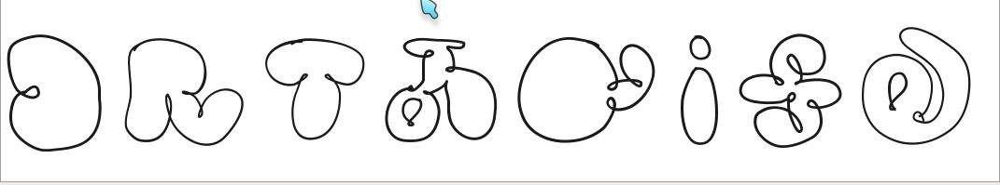
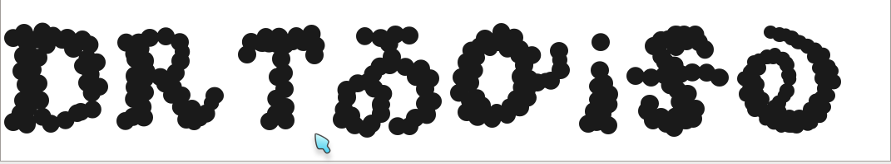

+++
draft = false
date = 2023-05-01T13:17:05Z
title = "Cherokee Language Fonts"
weight = 1682947020

[taxonomies]
authors = ["Michael Conrad"]
categories = ["Fonts"]
tags = ["Fonts", "Chung-deh Tien", "Joseph Erb", "GNU FreeFont"]

[extra]

featured_image = "content/cherokee-language-fonts/featured-image.png"

+++

Chung-deh Tien and Joseph Erb created many fantastic fonts for typesetting Cherokee Syllabary. As these fonts
are very hard to find via Google search they have been collected here together in one place for ease of access.
A download link has been provided for each font followed by a picture showing the font's appearance.

Another set of fonts to consider using are the GNU FreeFonts as they properly include italic and bold forms for
each of the letters in fonts more suitable for book and ebook typesetting and also general documents.
Most of the educational materials I've created (not including comics) are typeset in FreeSerif.

<!-- more -->

* [GNU FreeFonts](https://savannah.gnu.org/projects/freefont/).

Download the zips.

### Chung-deh Tien

* [Chung-deh_Tien/ALEWISDODI.ttf](Chung-deh_Tien/ALEWISDODI.ttf)

---

* [Chung-deh_Tien/ATUYASDODI.ttf](Chung-deh_Tien/ATUYASDODI.ttf)

---

* [Chung-deh_Tien/DANISVDANVSGV.ttf](Chung-deh_Tien/DANISVDANVSGV.ttf)

---

* [Chung-deh_Tien/GADAQUALI.ttf](Chung-deh_Tien/GADAQUALI.ttf)

---

* [Chung-deh_Tien/Gageda.ttf](Chung-deh_Tien/Gageda.ttf)

---

* [Chung-deh_Tien/GOLAUNOLE.ttf](Chung-deh_Tien/GOLAUNOLE.ttf)

---

* [Chung-deh_Tien/Nikwasi.ttf](Chung-deh_Tien/Nikwasi.ttf)

---

* [Chung-deh_Tien/TSISQUILISDA.ttf](Chung-deh_Tien/TSISQUILISDA.ttf)

---

* [Chung-deh_Tien/WilmaMankillerold-LtSmCn.ttf](Chung-deh_Tien/WilmaMankillerold-LtSmCn.ttf)

### Joseph Erb

* [Joseph_Erb/Cherokeangles.ttf](Joseph_Erb/Cherokeangles.ttf)

---

* [Joseph_Erb/Cherokeeblockstyle.ttf](Joseph_Erb/Cherokeeblockstyle.ttf)

---

* [Joseph_Erb/Cherokeebubble.ttf](Joseph_Erb/Cherokeebubble.ttf)

---

* [Joseph_Erb/Cherokeecloud.ttf](Joseph_Erb/Cherokeecloud.ttf)

---

* [Joseph_Erb/Cherokeedots.ttf](Joseph_Erb/Cherokeedots.ttf)

---

* [Joseph_Erb/Cherokeedouble.ttf](Joseph_Erb/Cherokeedouble.ttf)

---

* [Joseph_Erb/Cherokeeflowers.ttf](Joseph_Erb/Cherokeeflowers.ttf)

---

* [Joseph_Erb/Cherokeefun.ttf](Joseph_Erb/Cherokeefun.ttf)

---

* [Joseph_Erb/Cherokeehalf.ttf](Joseph_Erb/Cherokeehalf.ttf)

---

* [Joseph_Erb/Cherokeehandlines.ttf](Joseph_Erb/Cherokeehandlines.ttf)

---

* [Joseph_Erb/CherokeeHandoneB.ttf](Joseph_Erb/CherokeeHandoneB.ttf)

---

* [Joseph_Erb/Cherokeehandthinline.ttf](Joseph_Erb/Cherokeehandthinline.ttf)

---

* [Joseph_Erb/Cherokeehandwhole.ttf](Joseph_Erb/Cherokeehandwhole.ttf)

---

* [Joseph_Erb/CherokeeOldEnglish.ttf](Joseph_Erb/CherokeeOldEnglish.ttf)

---

* [Joseph_Erb/Cherokeepaws.ttf](Joseph_Erb/Cherokeepaws.ttf)

---

* [Joseph_Erb/Cherokeeslick.ttf](Joseph_Erb/Cherokeeslick.ttf)

---

* [Joseph_Erb/CherokeeStrip.ttf](Joseph_Erb/CherokeeStrip.ttf)

---

