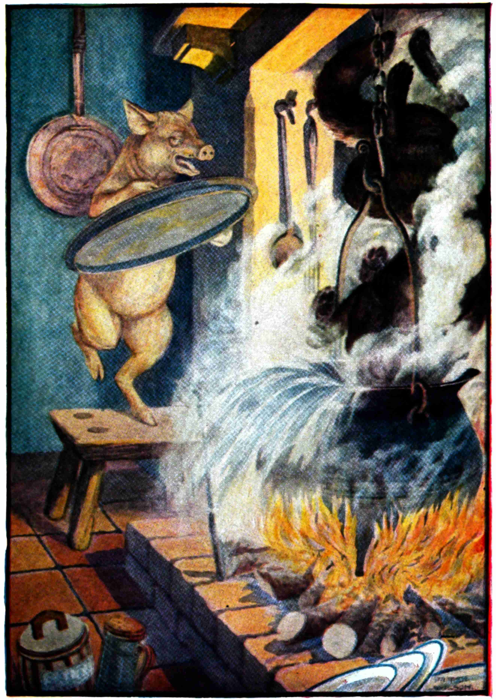

+++
draft = false
date = 2020-04-05T23:16:39Z
title = "ᎠᏂᏦᎢ ᏧᎾᏍᏗ ᏏᏆ - The Three Little Pigs"
weight = 1586128590

[taxonomies]
authors = ["Michael Conrad"]
categories = ["Books"]
tags = []

[extra]
zulma_title="Online Books"
featured_image = "html-books/ᎠᏂᏦᎢ-ᏧᎾᏍᏗ-ᏏᏆ---the-three-little-pigs/004.jpg"
#featured_image = "html-books/The-Three-Bears.jpeg"

+++

#### Online Book

# ᎠᏂᏦᎢ ᏧᎾᏍᏗ ᏏᏆ

ᏧᏟᎢᎸᏔᏅ ᎠᏂᏦᎢ ᏧᎾᏍᏗ ᏏᏆ ᎨᏎ. ᏧᎬᏩᎶᏗ ᎤᏂᏯᎸᏎ. ᎢᎬᏱ ᏏᏆ ᎠᎴ ᎠᏍᎦᏯ ᏚᎾᏠᏎ. ᎢᎦᏓ ᏂᏕᎦᏛᎥ ᎧᏁᏍᎦ
ᏚᎾᎡ Ꮎ ᎠᏍᎦᏯ ᎠᎴ ᏏᏆ ᎤᏛᏁ:—

“ᎰᏍᏓ ᎠᏍᎦᏯ, ᎢᎦᏓ ᎧᏁᏍᎦ ᏗᏍᎬᏏ ᎦᎵᏦᏕ ᎠᏆᏁᏍᎨᏗ ᎠᏆᏚᎵ.”

ᎢᏳᏍᏗ ᎠᏍᎦᏯ ᏄᏛᏁᎴ ᎠᎴ Ꮎ ᎤᏍᏗ ᏏᏆ ᎤᏤᎵ ᎦᎵᏦᏕ ᎤᏁᏍᎨᎮ ᎬᏗ ᎧᏁᏍᎦ. ᎩᎳᏊ ᏩᎭᏯ ᎤᎷᏤ ᎤᎿ. ᎦᎶᎯᏍᏗ
ᎤᏩᏂᎴ ᎠᎴ ᎤᏛᏁ:—

“ᎤᏍᏗ ᏏᏆ, ᎤᏍᏗ ᏏᏆ, ᏥᏴᎭ\!”
<!-- more -->
Ꮎ ᎤᏍᏗ ᏏᏆ ᎤᏬᎯᎵᏴᏎ:—

“ᎥᏝ\! ᎥᏝ\! ᏣᏲ ᏩᎭᏯ\! ᎬᏚᎢᏍᏗᎮ ᎥᏝ\!”

ᎾᎯᏳᏃ ᏩᎭᏯ ᎤᏬᎯᎵᏴᏎ:—

“ᎥᏍᎩᏅᏳᏍᏗ, ᏛᏦᏔᎯ ᎠᎴ ᏛᏦᏔᎯ\! ᎾᎯᏳ ᏣᏤᎵ ᎦᎵᏦᏕ ᏓᏲᏥ\!”

ᎾᎯᏳᏃ ᎤᏦᏔᎮ ᎠᎴ ᎤᏦᏔᎮ ᎠᎴ ᎦᎵᏦᏕ ᎤᏲᏤ ᏃᏊᎴ ᏩᎭᏯ ᎢᎬᏱ ᏏᏆ ᎤᏩᏯᎡᎾ.

Ꮎ ᏔᎵᏁ ᎤᏍᏗ ᏏᏆ ᎠᎨᏯ ᏚᎾᏠᏎ. ᎢᎦᏓ ᎠᏓ ᏚᏩᏰ ᎠᎴ ᏏᏆ ᎤᏛᏁ:—

“ᎰᏍᏓ ᎠᎨᏯ, ᎢᎦᏓ ᎠᏓ ᏗᏍᎩᎥᏏ ᎦᎵᏦᏕ ᎠᏆᏁᏍᎨᏗ ᎠᏆᏚᎵ.”

ᎢᏳᏍᏗ ᎠᎨᏯ ᏄᏛᏁᎴ ᎠᎴ Ꮎ ᎤᏍᏗ ᏏᏆ ᎤᏤᎵ ᎦᎵᏦᏕ ᎤᏁᏍᎨᎮ. ᎾᎯᏳ ᏩᎭᏯ ᎤᎷᏤ ᎤᎿ ᎠᎴ ᎤᏛᏁ:—

“ᎤᏍᏗ ᏏᏆ, ᎤᏍᏗ ᏏᏆ, ᏥᏴᎭ\!”

“ᎥᏝ\! ᎥᏝ\! ᏣᏲ ᏩᎭᏯ\! ᎬᏚᎢᏍᏗᎮ ᎥᏝ\!”

“ᎥᏍᎩᏅᏳᏍᏗ, ᏛᏦᏔᎯ\! ᏛᏦᏔᎯ\! ᎠᎴ ᏣᏤᎵ ᎦᎵᏦᏕ ᏓᏲᏥ ᎢᏳᏍᏗ ᏛᏦᏔᎯ\!”

ᎾᎯᏳ ᎤᏦᏔᎮ ᎠᎴ ᎤᏦᏔᎮ ᏃᏊᎴ ᎤᏦᏔᎮ ᎠᎴ ᎤᏦᏔᎮ ᎾᎯᏳ ᎦᎵᏦᏕ ᎤᏲᏤ ᎠᎴ ᏩᎭᏯ ᏔᎵᏁ ᏏᏆ ᎤᏩᏯᎡ.

Ꮎ ᏦᎢᏁ ᎤᏍᏗ ᏏᏆ ᎠᏍᎦᏯ ᏚᎾᏠᏎ. ᎢᎦᏓ ᏅᏯ ᏗᏛᏓᏅ ᏥᏚᎮ. ᎤᏍᏗ ᏏᏆ ᎤᏛᏁ:—

“ᎰᏍᏓ ᎠᏍᎦᏯ, ᎢᎦᏓ ᏅᏯ ᏗᏛᏓᏅ ᏍᎩᎥᏏ ᎢᏳᏍᏗ ᎦᎵᏦᏕ ᎠᏆᏁᏍᎨᏗ ᎠᏆᏚᎵ.”

ᎢᏳᏍᏗ ᎠᏍᎦᏯ ᎤᏍᏗ ᏏᏆ ᏚᏁᎴ ᎢᎦᏓ ᏅᏯ ᏗᏛᏓᏅ ᎠᎴ ᏏᏆ ᎤᏤᎵ ᎦᎵᏦᏕ ᎤᏁᏍᎨᎮ ᎬᏗ ᎥᏍᎩᎾ. ᎾᎯᏳ ᏩᏯᎭ
ᎤᎷᏤ ᎤᎿ ᎢᏳᏍᏗ ᏥᏂᏚᏛᏁᎴ ᎠᎴ ᎤᏛᏁ:—

“ᎤᏍᏗ ᏏᏆ, ᎤᏍᏗ ᏏᏆ, ᏥᏴᎭ\!”

“ᎥᏝ\! ᎥᏝ\! ᏣᏲ ᏩᎭᏯ\! ᎬᏚᎢᏍᏗᎮ ᎥᏝ\!”

“ᎥᏍᎩᏅᏳᏍᏗ, ᏛᏦᏔᎯ\! ᏛᏦᏔᎯ\! ᎠᎴ ᏣᏤᎵ ᎦᎵᏦᏕ ᏓᏲᏥ ᎢᏳᏍᏗ ᏛᏦᏔᎯ\!”

ᎾᎯᏳ ᎤᏦᏔᎮ ᎠᎴ ᎤᏦᏔᎮ ᎠᏎᏃ ᎥᏝ ᎦᎵᏦᏕ ᏳᏲᏤ ᏍᎩᏅᏳᏍᏗ ᏏᏊ ᎤᏦᏔᎮ ᎠᎴ ᎤᏦᏔᎮ ᎠᏎᏃ Ꮟ ᎥᏝ ᎦᎵᏦᏕ
ᏳᏲᏤ. ᎾᎯᏳ ᎤᏬᎵᏤ ᎥᏍᎩᎾ ᎥᏝ ᎦᎵᏦᏕ ᏱᏛᏲᏥ ᎠᎴ ᎤᏛᏁ:—

“ᎤᏍᏗ ᏏᏆ, ᎾᎿ ᎠᏆᏅᏔ ᎣᏍᏓ ᏕᏈᏌᏂ ᏠᎨᏏ.”

“ᎭᏢ?” ᎤᏛᏁ Ꮎ ᎤᏍᏗ ᏏᏆ.

“Ꭳ, ᎠᎨ ᏥᏍᏚ ᎤᏤᎵ ᏠᎨᏏ, ᎠᎴ ᏑᎾᎴ ᏱᏔᏛᏅᎢᏍᏔᏂ ᎠᎭᏂ ᏓᏥᎷᏥ ᎠᎴ ᎢᎦᏓ ᏙᏓᏂᎩᏎᏏ.”

“ᎰᏩᏊ,” ᎤᏛᏁ Ꮎ ᎤᏍᏗ ᏏᏆ, “ᏓᎦᏛᏅᎢᏍᏔᏂ. ᎯᎳ ᎠᏟᎢᎵ ᎩᏂᏅᏍᏗ ᏣᏚᎵ?”

“Ꭳ, ᏑᏓᎵ ᎢᏳᏩᏂᎸ.”

ᎾᎯᏳᏃ ᎨᏎ Ꮎ ᎤᏍᏗ ᏏᏆ ᎯᏍᎩ ᏑᎾᎴ ᎤᏗᏛᎮ ᎠᎴ ᏕᏈᏌᏂ ᏫᏚᎩᏎᎾ ᎢᎬᏱ ᏩᎭᏯ ᎤᎷᏤ (Ꮲ ᏑᏓᎵ ᏧᎷᏤ) ᎠᎴ
ᏧᏛᏁ:—

“ᎤᏍᏗ ᏏᏆ, ᏣᏛᏅᎢᏍᏔᏁᏍ?”

Ꮎ ᎤᏍᏗ ᏏᏆ ᎤᏛᏁ: “ᎠᏆᏛᏅᎢᏍᏔᏁᏍ? ᎦᏳᎳ ᏫᏓᎩᏎᎾ. ᎤᏔᎾ ᎧᎵ ᏧᎳᏍᎩ\! ᎣᏍᏓ ᏓᎦᎵᏍᏓᏴᏂ\!”

Ꮎ ᏩᎭᏯ ᎤᎿᎸᏤ ᎠᏎᏃ ᎤᏓᏅᏖᏞ, “Ꮟ ᏓᏥᎶᎾᏍᏔᏂ”, ᎾᎯᏳ ᎤᏛᏁ:—

“ᎤᏍᏗ ᏏᏆ, ᎾᎿ ᎠᏆᏅᏔ ᎣᏍᏓ ᏒᎦᏔ ᏡᎬ.”

“ᎭᏢ?” ᎤᏛᏁ Ꮎ ᏏᏆ.

“ᏌᎶᎵ ᎤᏤᎵ ᏠᎨᏏ,” ᏩᎭᏯ ᎤᏁᏤ, “ᎠᎴ ᎥᏝ ᏱᏓᏍᎩᎶᎾᏍᏔᏂ ᎾᎯᏳ ᎠᎭᏂ ᏓᎦᎷᏥ ᎯᏍᎩ ᏑᎾᎴ ᎠᎴ ᎢᎦᏓ ᏒᎦᏔ
ᏙᏓᏂᎩᏎᏏ.”

ᎢᏳᏍᏗ ᏅᎩ ᏑᎾᎴ Ꮎ ᎤᏍᏗ ᏏᏆ ᎤᏗᏛᎮ ᎢᎬᏱ ᏩᎭᏯ ᎤᎷᎯᏍᏗ ᏧᎩᏍᏗ ᎤᏚᎵᎮ Ꮎ ᏏᏆ ᏍᎩᏅᏳᏍᏗ ᎦᏯᏄᎵ ᏒᎦᏔ
ᏚᎩᏒᏎ ᎠᏎᏃ ᎢᏂᎨᎢ ᎨᏎ ᎠᎴ ᎠᏎ ᏡᎬ ᎤᎸᏍᏗ ᎨᏎ. ᎥᏍᎩᎾ ᎢᏴ ᎡᎳᏗ ᎤᎷᏎ ᏩᎭᏯ ᎦᎷᎨ ᎤᎪᎮ.
ᎤᏍᎦᎴ. ᏩᎭᏯ ᎤᎷᏤ ᎤᏛᏁᏃ:—

“ᎤᏍᏗ ᏏᏆ, ᎦᏙ\!?\! ᏂᎯᏧ ᏣᎷᏤ ᎢᎬᏱ ᎠᏴ? ᎠᏃᏍᏓᏍ ᏒᎦᏔ?”

“ᎥᎥ, ᎠᏃᏍᏓᏒᎢ,” ᎤᏛᏁ ᎤᏍᏗ ᏏᏆ. “ᎡᎳᏗ ᏌᏊ ᏓᎬᏗᏅᏎᎵ.”

ᎾᎯᏳᏃ ᎢᎾᏒᎢ ᎤᏗᏅᏎ. ᏩᎭᏯ ᎠᎩᏍᎨ Ꮎ ᎤᏍᏗ ᏏᏆ ᏧᏪᏅᏒᎢ ᏗᏜ ᎤᎵᏘᏎ. ᏐᎢ ᎢᎦ Ꮎ ᏩᎭᏯ ᎤᎷᏤ ᎤᏛᏁᏃ:—

“ᎤᏍᏗ ᏏᏆ, ᏛᎾᏓᏟᏌᏂ ᎦᏚᎲ ᏒᎯᏰᏱ ᏗᏜ; ᏫᏖᏅᏏᏍ?”

“Ꭳ, Ꭵ,” ᎤᏛᏁ Ꮎ ᏏᏆ, “ᏫᏓᎨᏅᏏ; ᎯᎳ ᎠᏟᎢᎵ ᏔᏛᏅᎢᏍᏔᏂ?”

“Ꮶ ᎠᏟᎢᎵ,” ᎤᏛᏁ ᏩᎭᏯ. ᎢᏳᏍᏗ ᎤᏍᏗ ᏏᏆ ᎤᏪᏅᏎ ᎢᎬᏱ ᏩᎭᏯ ᎠᎴ ᏗᎦᏚᎲ ᎤᎷᏤ. ᎾᎯᏳ ᎠᏓᎾᏁᏒᎲᏍᎨ ᎠᎴ
ᏒᏙᏂ ᎤᏩᏎ. ᎾᎯᏳ ᏏᏆ ᏩᎭᏯ ᎤᎪᎮ. “Ꭳ\! ᎦᏙ ᏓᎦᏛᏁᎵ?” ᎤᏓᏅᏖᏞ. ᎦᏯᏄᎵ ᏒᏙᏂ ᏧᏣᏁ ᎾᎯᏳᏃ ᎤᏰᎶᎢᏍᏗ
ᏒᏙᏂ ᎤᏅᏤ ᎠᎴ ᎡᎳᏗ ᎦᏚᏏ Ꮎ ᏏᏆ ᎠᎴ Ꮎ ᏒᏙᏂ ᎤᏁᏅᏎ ᎠᎾᏗᏆᎸᏕᏲᎮ. ᏩᎭᏯ ᎤᎪᎮ ᎠᎴ ᎤᏍᎦᎴ. ᎾᎯᏳ
ᏧᏪᏅᏒᎢ ᏧᎵᏘᏎ. ᎩᎳᏊ ᎢᏴ ᏏᏆ ᏧᏪᏅᏒᎢ ᎤᏪᏅᏎ Ꮎ ᏩᎭᏯ ᎠᎴ ᎤᏃᎮᏞ ᎥᏍᎩᎾ ᎡᏆ ᎠᏗᏆᎸᏕᏲᎯ
ᎨᏒ ᎠᎴ ᏩᎭᏯ ᎠᏍᎦᎯ ᎨᏎ ᎠᎴ ᎥᏍᎩᎾ ᎤᎵᏘᏎ. ᎾᎯᏳ ᎤᏍᏗ ᏏᏆ ᎤᏛᏁ:—

“Ꭽ\! ᎯᏍᎦᎯ\! ᎠᏴ ᎬᏍᎦᎸᏍᏓᏅ. ᏒᏙᏂ ᎠᏆᏒ ᎾᎯᏳ ᎬᎪᎲ ᎠᎴ ᏒᏙᏂ ᎠᏆᏣᏅ ᎩᎳᏊ ᎢᏴ ᏒᏙᏂ ᎦᏅᎩ ᎨᏒ ᎠᎴ
ᎠᎦᏐᏍᎬᎢ ᎡᎩ ᎨᏒ. ᎦᏣᎥᏍᎩ ᎨᏒ ᎠᎴ ᏂᎯ ᎠᎩᎶᏒ\!”

ᎾᎯᏳᏃ Ꮎ ᏩᎭᏯ ᎤᏔᎾ ᎤᎿᎸᏤ ᎠᎴ ᏏᏆ ᏧᏬᏎᎴ, “ᏣᏲᏒᎢ ᏏᏆ\! ᏓᎬᏯᏯᎢ\! ᎡᎳᏗ ᎠᎱᏣᏬᎳᏛᎢ ᏓᏥᎸᏏ\!”

ᏃᏊ Ꮎ ᏏᏆ ᏓᏈᏌᏂ ᏧᎳᏍᎩ ᏚᏩᏂᏍᏔᏁ ᎤᎿ ᏗᎪᏛᏙᏗ. ᎦᏯᏄᎵ ᏧᎳᏍᎩ ᎤᏍᏚᎢᏎ ᎠᎴ ᏩᎭᏯ ᏧᎳᏍᎩᎢ ᎤᎶᏎ\!
ᎦᏯᏄᎵ ᏧᎳᏍᎩ ᎤᏭᏢᏁ ᏩᎭᏯ ᎤᏣᎢ ᎨᏎ. Ꮎ ᎤᏍᏗ ᏏᏆ ᏩᎭᏯ ᎤᏩᏂᏍᏔᏁ ᎠᎴ ᏧᏩᏯᎡ.

