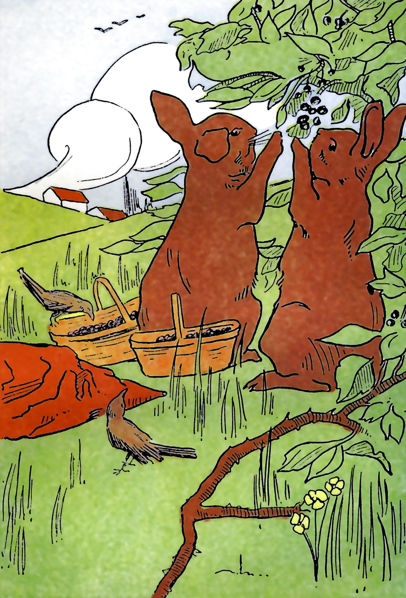
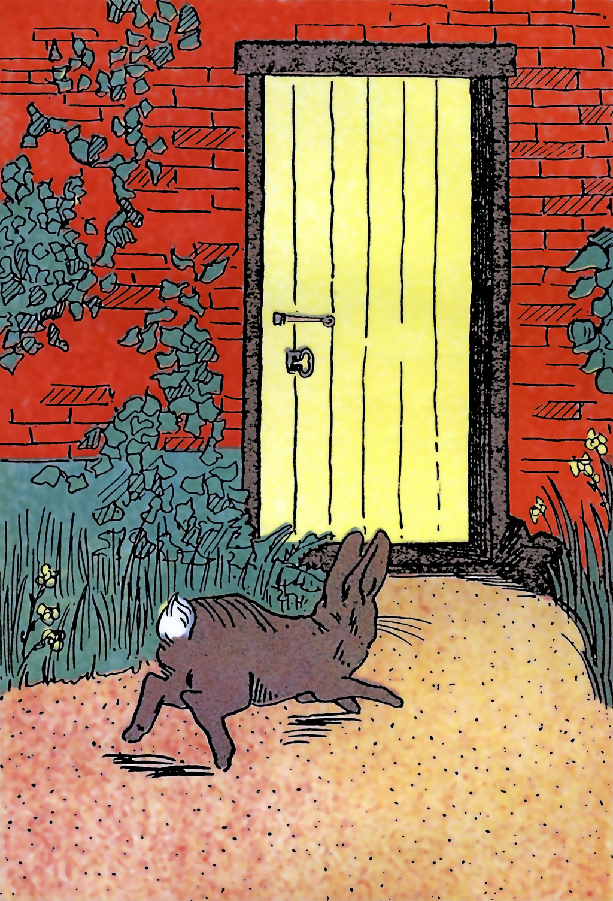

+++
draft = false
date = 2020-03-27T12:26:05Z
title = "Ꮎ ᎧᏃᎮᏓ ᏈᏘ ᏥᏍᏚ / The Tale of Peter Rabbit"
weight = 1585311960

[taxonomies]
authors = ["Lawrence Panther", "Beatrix Potter", "Michael Conrad"]
categories = ["Lessons", "Grammar"]
tags = []

[extra]
zulma_title="Cherokee Language Lessons 1"
featured_image = "html-books/Ꮎ-ᎧᏃᎮᏓ-ᏈᏘ-ᏥᏍᏚ---The-Tale-of-Peter-Rabbit/Na_Kanoheda_Kwiti_Jisdu-frontcover.png"

+++
### [Show your support! Purchase a copy and leave a five star review!](@/books/_index.md)

<!-- more -->

Ꮎ ᎧᏃᎮᏓ ᏈᏘ ᏥᏍᏚ

The Tale of Peter Rabbit

Copyright 2016, Michael Conrad

ISBN: 978-1-365-08907-7

$Revision: 1.12 $

$Date: 2020/01/29 00:00:29 $ UTC

Creative Commons
Attribution-Share Alike 3.0 United States License.

 

ᏈᏘ ᏥᏍᏚ ᎯᏩᏔ

ᏌᏊ ᎢᏳᏩᎦᏗ, ᏅᎩ ᎾᏂᎢ ᏧᏂᏍᏗ ᏥᏍᏚ, ᎠᎴ ᎯᎠ ᏚᎾᏙᎡᎢ

ᎦᏅᏥᏙᎯ,

ᎬᎾᎦᎵᏙᎯ,

ᎠᏥᎸ-ᎦᏂᏓᏓ,

ᎠᎴᏃ ᏈᏘ.

ᏂᎦᏓ ᎠᎴ ᎤᏂᏥ ᎠᏁᎮ ᎥᎿ ᏃᏱ ᎦᏝᏛ, ᎭᏫᎾᏗᏜ ᎤᎾᏍᏓᎥ ᎤᏔᎾ ᎢᏤ ᎠᏓ.

ᏌᏊ ᏌᎾᎴ ᎯᎠ ᏂᏚᏪᏎᎴ ᎠᏂᏥᏍᏚ, “ᏃᏊᏍ ᎬᏧᎸᏉᏗ, ᎡᎷᏊᏍ ᏱᏤᎾ Ꮎ ᏠᎨᏏ ᏗᏜ ᎠᎴ ᏫᏗᎦᎸᏅᏛᎢ, ᎠᏎᎾ Ꮭ
ᏫᏛᏥᏴᏟ Ꮎ ᎠᏍᎦᏯ ᎹᏞᎪ ᎤᏫᏒᏅᎢ.”

ᎦᏅᏥᏙᎯ ᎯᏩᏔ

ᎢᏥᏙᏓ ᎪᎱᏍᏗ ᏥᏄᎵᏍᏓᏁᎸ ᎥᎿᎢ, ᎠᎨᏯ ᎹᏞᎪ ᎨᎵᏍᏗ ᏣᎪᏢᏅᏓᏅᎢ Ꮎ ᎢᏥᏙᏓ.

ᎠᎨᏯ ᎹᏞᎪ ᎯᏩᏔ

ᎭᏩᏆᏃ ᏫᏓᏣᏁᎶᎸᎦ, ᎠᎴ ᏞᏍᏗ ᏤᏥᏍᎦᏅᏣ, ᏞᎦ ᏗᎦᏁᎳᏓ.

ᎠᏓᏫᏛᏍᏗ ᎯᏩᏔ

Ꮓ ᎠᎨᏯ ᏥᏍᏚ ᎤᏫᏛᎲ ᏔᎷᏣ ᎠᎴ ᎠᏓᏫᏛᏍᏗ ᏚᏫᏛᎮᎢ ᎠᎴ ᎢᎾᎨ ᏗᏜ ᏭᎶᏒ ᎠᎴ ᎦᏚᎲᏍᏗ ᏗᏜ. ᎤᏬᏗᎨ ᎦᏚ
ᎤᏩᏒ ᎠᎴ ᎯᏍᎩ ᏗᎦᏔᏅ ᎦᏚ.

ᎦᏓᎲᏍᎩ ᎯᏩᏔ

ᎦᏅᏥᏙᎯ, ᎦᏅᎦᎵᏗᎯ ᎠᎴ ᎠᏥᎸ ᎦᏂᏓᏓ, Ꮎ ᎤᎾᏓᎾᏓ ᏧᏂᏍᏗ ᏥᏍᏚ ᎨᏒ ᏂᎦᏓ ᏫᎦᎵᏅᏛ ᏭᏂᎶᏒᎢ. ᎧᏄᎦᏟ
ᎤᎾᏕᏒᏒᎢ.

ᎠᏥᎸ-ᎦᏂᏓᏓ ᎯᏩᏔ

ᎠᏎᏃ Ꮎ ᏈᏘ ᎦᎾᎵ ᎨᏒᎢ, ᏥᏳᎩᏗ Ꮎ ᎠᏍᎦᏯ ᎹᏞᎪ ᏥᏫᏒᏅ ᏗᏜ ᏭᎶᏒ.

ᎠᏍᎦᏯ ᎹᏞᎪ ᎯᏩᏔ

ᎭᏫᎾᏗᏜ ᎤᏚᏄᏴᏢ ᎠᏍᏚᏗᎢ\!

ᎠᏍᎦᏯ ᎯᏩᏔ

ᎠᎬᏱ ᎨᏒ, ᎦᏲᏟ ᎢᎪᏍᏗ ᎠᎩᏍᏗ ᎤᎬ, ᏃᎴ ᎦᏲᏟ ᎠᏂᎦᎸᏥ ᏚᏯ ᏃᎴ ᎦᏲᏟ ᎦᎳᏗᏍᎩ ᏚᎬᎢ;

ᎠᏧᏣ ᎯᏩᏔ

ᏃᎴ, ᎤᏢᏍᏗᏍᎬᎢ ᏄᎵᏓᏁᎲᎢ, ᏗᎪᎯᏍᏙᏗ ᏚᏴᎸᏒᎢ.

ᏬᏱ ᎯᏩᏔ

ᎠᏎᏃ Ꮎ ᎾᎥᏁᎨᏍᏗ ᎨᏒ ᎦᎦᎹ ᏓᏫᏒ, ᎧᎲᏃ ᏚᎾᏠᏒᎢ, Ꮎ ᎠᏍᎦᏯ ᎹᏞᎪ\!

ᏩᎧ ᎯᏩᏔ

ᎠᏍᎦᏯ ᎹᏞᎪ ᏚᏟᏆᏅᏛᎢ, ᏓᏫᏍᎬᎢ ᏧᎦᏅᏕᎾ, ᎠᏎᏃ ᎤᏟᏍᏗ ᏚᎴᏅ, ᎠᎴ ᎠᏥᎨᎲᏒ ᏈᏘ, ᎦᏟᏐᏙᏗ ᎠᏐᎸᏗᏍᎩ,
“ᎭᎴᏫᏍᏓ ᎭᏓᏅᏨᎲᏍᎦ” ᎤᏪᏡᎬ.

ᎩᏟ ᎯᏩᏔ

ᏈᏘ ᏙᏳ ᎤᏍᎦᏍᏓᏁᎸᎢ; ᏂᎬᏢ ᎤᏟᏙᎸ ᏠᎨᏏ, ᎤᏮᎨᏫᏒ ᏭᎶᎯᏍᏗ ᎠᏍᏚᏗ ᏗᏜ.

ᏌᏊ ᎤᎳᏑᎶ ᎤᏲᏎᎸ Ꮲ ᏧᎦᏅᏕᎾ ᏓᏫᏒᏅᎢ, ᏐᎢᏃ ᏄᎾ ᏓᏫᏒᏅᎢ.

ᎠᏍᎦᏯ ᎯᏩᏔ

ᎾᎯᏳᏃ ᎢᏧᎳ ᏚᏲᏎᎳ, Ꮓ ᏅᎩ ᏧᎳᏍᎩ ᎦᏳᏄᎵ ᎤᏓᎾᏍᏓᏅᎢ. ᎠᏓᏅᏖᎲ, ᎡᎷᏊ ᏱᏓᏩᏓᎩᏰ, ᎠᏎᏃ Ꮎ ᏖᎳᏂ ᎠᏏᎳᏛ
ᏱᏫᎾᎩᎸᏨᎾ, ᏃᎴ Ꮎ ᎤᏔᎾ ᎤᏛᏛ ᎤᏂᏴᏎᎴ ᎥᎿ ᎤᏌᎴᎾ. ᏌᎪᏂᎨ ᎨᏎ ᎦᏌᎴᎾ, ᏣᏱ ᏗᎦᏛᎢ, ᏃᎴ ᎠᏤ ᎢᎨᏎᎢ.

ᎩᏟ ᎠᏓ ᎯᏩᏔ

ᏈᏘ ᏚᏓᏲᏎᎢ, ᏃᎴ ᎤᎴᏅᎮ ᏍᏓᏯ ᎠᏠᏱᎲᎢ; ᎠᏎᏃ ᎤᎾᏓᎾᏔ ᎠᏂᏥᏆᏯ ᎤᏅᏛᎦᏁ ᎠᏠᏱᎲᎢ ᏭᏂᏃᎯᎶᏒ ᎠᎴ
ᎠᏂᏍᏗᏗᏰᏍᎨ ᎤᎵᏘᎵᏗᎢ.

ᏥᏍᏆᏯ ᎯᏩᏔ

ᎠᏍᎦᏯ ᎹᏞᎪ ᎠᏑᏰᏍᏙᏗ ᎠᏰᎲ, ᎠᏥᏍᏆᎸᏂᏍᏙᏗ ᎤᏰᎸ ᏈᏘ, ᎠᏎᏃ ᏈᏘ ᎡᎷᏊ ᎤᏖᎵᏅᏙᎸ ᏚᏓᎩᏰᎢ, ᎦᏌᎴᎾ
ᎤᎯᏰ.

ᏌᏌ ᎯᏩᏔ

ᏗᎦᎸᏫᏍᏓᏁᏙᏗ ᏗᎾᎥ ᏭᎶᏒ ᎠᎴ ᏔᎸᎩᏍᏗ ᏭᏣᏅ. ᎤᏙᎯᏳᎠ ᎣᏍᏓ ᏱᎨᏎ ᎠᏗᏍᎦᎸᏗ ᎥᎿᎢ, ᎠᏎᏃ ᎤᎵᏍᏈᏍᏓ ᎠᎹ
ᎠᏟᏍᏛ.

ᎬᎾ ᎯᏩᏔ

ᎠᏍᎦᏯ ᎹᏞᎪ ᎤᏙᎯᏳ ᎡᎵᏍᎬ Ꮲ ᎠᏯᎥ ᏈᏘ ᎥᎿ ᏗᎦᎶᏫᏍᏓᏁᏗ ᎠᏅᎢ, ᎾᎨ ᎠᏥᎸᏍᎩ ᎦᎸᏗ ᏥᎦᎦᎭ ᎭᏫᎾᏗᏜ
ᎤᏗᏍᎦᏝ ᎡᎵᏍᎬᎢ. Ꮓ ᎤᎴᏅᎲ ᏂᎦᏓ ᏙᎢ ᏌᏊᎭ ᏓᎵᏆᏕᏍᎬᎢ.

Ꮓ ᏚᏴᏍᏙᏒ ᏈᏘ, “ᎠᏧ”. Ꮓ ᎠᏍᎦᏯ ᎹᏞᎪ ᎤᏟᏍᏗᏊ ᎤᎨᎯᏒ,

ᏐᏈᎵ ᎯᏩᏔ

ᎤᏁᎵᏓᏅ ᎠᎦᎳᏍᏙᏗ ᏈᏘ, Ꮓ ᏦᎳᏂ ᏭᎯᎶᏒ, ᏦᏱᎦ ᏗᏥᎸᏍᎩ ᏚᏩᎧᏬᏅᏓᏅᎢ. ᎤᏍᏗᎩ ᏦᎳᎾ ᎨᏒ ᏭᏓᏄhᏍᏗ ᎠᏍᎦᏯ
ᎹᏞᎪ, ᎠᎴ ᏚᏯᏪᎬ ᎠᏥᎨᎯᏙᎲ ᏈᏘ. ᏚᎶᏫᏍᏓᏁᎸᏒᏊ.

ᎧᏬᏄ ᎯᏩᏔ

ᏈᏘ ᎤᎵᏍᏚᏝᏅᎢ, ᏚᏴᏪᎬ, ᏍᏓᏯ ᎧᏬᎸᏕᏍᎬ ᎠᎴ ᎤᏍᎦᏍᏓᏁᎸ ᎤᏩᎾᏫᏍᎬᎢ, Ꮭ ᏳᏩᎾᏖᎢ ᎭᏢ ᏗᏜ ᏭᎶᎯᏍᏗᎢ.
ᏃᎴ ᎢᎦᏓᏁ ᎥᎨᎥ Ꮎ ᏔᎷᎩᏍᏗ ᎤᏣᏅ.

ᎤᏃᏕᎾ ᎯᏩᏔ

ᏞᎩᏃ ᎤᏓᏅᏏᏙᎸᎢᏄᏛᏁᏗ, ᎵᏈᏘ—, ᎵᏈᏘ—, ᎠᏎᏃ Ꮭ ᎦᏳᏄᎵ ᎾᏛᏁᎮ ᎠᎴ ᏂᎦᎥ ᎠᎦᏖᏂᎵᏙᎮᎢ.

ᎠᏍᏚᏗ ᎤᏩᏛᎲᎢ ᎥᎿ ᎠᏐᏴ; ᎠᏎᏃ ᏍᏓᏯ ᎠᏍᏚᎥ, ᎠᎴ Ꮭ ᏳᏝᏅᏕ ᎦᎵᏦᎯᏓ ᏥᏍᏚ ᎭᏫᎾᏗᏜ ᎤᏓᏳᏅᏍᏗᎢ.

ᎠᎨᏳᏣ ᎯᏩᏔ

ᎠᎬᏴᎵ ᏥᏍᏕᏥ ᎠᏟᏙᎮᎢ, ᎠᏴᏍᏗᎲ ᎠᎴ ᎥᎬᏃᎪᏥᏙᎮ ᏅᏲ ᎠᎳᏏᏂᏗᎢ, ᏚᏯ ᎠᎴ ᏧᎾᏍᏗ ᏚᏯ ᏓᏴᏍᏗᎲᎢ, ᏏᏓᏁᎸ
ᏗᏁᎲ ᎠᏙ ᏫᏓᎲᏍᎬᎢ. ᏈᏘ ᎤᏓᏛᏛᏁ ᎭᏢ ᏗᏜ ᎠᏍᏚᏗ ᎨᏒᎢ, ᎠᏎᏃ ᎤᏔᏂ ᎤᏅᏍᎦᎸ ᎤᏍᏗ ᏚᏯ , ᎤᏄᎸᏅ
ᎤᏓᏁᏍᏙᏗᎢ, ᎠᏥᎵᏍᏆᏓᏁᎸᏊ. ᏈᏘ ᎤᎴᏅᎲ ᎠᏠᏱᎲᎢ.

ᎠᏁᏟᏗ ᎯᏩᏔ

ᏃᎴ ᏚᏂᏗᏒ ᏠᎨᏏ, ᎠᏎᏃ ᎤᎪᏓ ᎤᎵᏓᏍᏓᏂᏙᎲᎢ. ᎥᏓᎵ ᏭᎷᏤ, ᎥᎿ ᎠᏍᎦᏯ ᎹᏞᎪ ᎠᎹ ᏧᏟᏍᏙᏗ ᏔᎷᎩᏍᏗ. ᎤᏁᎦ
ᏪᏌ ᏚᎦᏙᏍᏕ ᏓᎶᏂᎨ ᎠᏂᏣᏓ; ᏙᎢ ᎤᏬᏢᎢ, ᎠᏎᏃ ᏳᏓᎭ ᎦᏂᏓᏛ ᎠᏖᎸᎲᏍᏗᎲ. ᏓᏤᏝ ᏯᏩᏂᎩᏌ ᎤᏪᎵᏎ ᏈᏘ,
ᏄᎵᏃᎮᏓ ᏓᏅᎾ ᏪᏌ. ᎪᎱᏍᏗ ᎤᏮᎾ ᏈᏂᏣᎹᏂ ᎤᏃᏎᎸ ᎨᏒ ᏄᎾᏍᏛ ᎠᏂᏪᏌ.

ᏪᏌ ᎠᏓ ᎯᏩᏔ

ᏃᎴ ᏭᎶᏎ ᏗᎦᎶᏫᏍᏓᏁᏗ-ᎠᏓᏁᎸᎢ, ᎠᏎᏃ, ᎾᎥ ᎤᏛᎦᏁ ᏗᎦᎶᎩᏍᏙᏗ ᎤᏃᏴᎬᎢ. (ᏍᎵᏗᏥ, ᏍᎳᏔᏥ, ᏍᎳᏔᏥ,
ᏍᎵᏘᏥ). ᏈᏘ ᎭᏫᎾᏗᏜ ᎤᏓᏯᏢ ᏭᏕᎵᏨ, Ꮭ ᎪᎱᏍᏗ ᏱᏂᎦᎵᏍᏗᎮᎢ, ᏚᎠᏅᏃᎪᏧᎢ, ᏭᎸᏍᏛᏅ
ᎦᏍᏙᏱᏓᏍᏗ, ᎠᎴ ᏭᎦᏔᏁᎢ. ᎠᎬᏱ ᏩᏥᎪᎥ ᎠᏍᎦᏯ ᎹᏞᎪ ᏕᎦᎴᏴᏍᎬ ᏒᎩ. ᎠᏗᏜ ᏭᎦᏛ,
ᎠᎴ ᎬᏂᎨᏒ ᎨᏒ ᎠᏍᏚᏗ\!

ᏔᎷᏣ ᎯᏩᏔ

ᏈᏘᏃ ᏙᎢ ᎤᏠᏒ ᎦᏍᏙᏱᏓᏍᏗ ᎠᎴ ᎤᏟᏍᏗ ᎤᏓᎾᏍᏓᏅᎢ, ᏥᏳᎦᏗ ᎦᎶᎯᏍᏗ ᎣᏂᏗᏢ ᏗᎬᏂᎨ ᏗᎦᏔᏅ ᏚᏓᏯᏢᎢ.

ᎠᏍᎦᏯ ᎹᏞᎪ ᎠᏥᎪᏩᏛᏓᏁᎢ (ᏈᏘ), ᎠᏎᎾ ᏈᏘ ᏝᎪᎱᏍᏗ ᏰᎵᏍᎨᏃ. ᎭᏫᎾᏗᏜ ᎤᏓᏄᏴᏢ ᎠᏍᏚᏗ ᎠᎴ ᏂᎦᏂᏰᎬᎾ
ᏭᎶᏒ ᎢᎾᎨᏃ ᏗᏜ, ᎤᏅᎪᏨ ᎨᏒ ᏠᎨᏏ.

ᏏᏆ ᎯᏩᏔ

ᎠᏍᎦᏯ ᎹᏞᎪ ᏚᏛᏅ Ꮎ ᎤᏍᏗ ᎦᏌᎴᎾ ᎠᎴ ᏗᎳᏑᎶ ᎥᎿ ᎪᎦ ᏗᏍᎦᏓᏁᏙᏗᎢ, ᏃᎴ ᏗᏍᎦᏍᏓᏁ ᎠᏂᎬᎿᎨ ᏥᏍᏆ.

ᏥᏍᏆ ᎯᏩᏔ

ᏈᏘ ᏝᏃ ᏳᎴᏫᏍᏓᏁ ᎠᏟᏒ ᎠᎴ ᏳᎦᏔᎲᏎᎢ, ᎬᏂᎩᎳ ᏧᏪᏅᏒ ᏭᎷᏣ, ᎥᎿ ᎤᏔᎾ ᎢᏤ-ᎠᏓ ᏧᏪᏅᏒᎢ.

ᏌᎶᎵ ᎯᏩᏔ

ᎤᏙᎯᏳᏃ ᏚᏴᏪᎨᎢ, ᎤᎵᏥᏅ ᎥᎿ ᏩᎾ ᏃᏱ ᎤᏂᏔᎴᏒᎢ, ᎠᎴ ᏚᎦᏔᏍᏓᏅᎢ. ᎤᏥ Ꮓ ᎠᏓᏍᏓᏴᎲᏍᎨ; ᎦᏙᏃ ᎡᎵᏍᎬ
ᏂᏚᏮᏁᎸ ᏧᎾᏬᎯ. ᎥᏍᎩᎾᏃ ᏔᎵ ᏒᎾᏙᏓᏩᏍᎩ ᎤᏍᏗ ᎤᏌᎴᎾ ᎠᎴ ᏧᎳᏑᎶ ᏧᏲᏎᎸᎢ.

ᏧᎳᏍᎩ ᎯᏩᏔ

ᏝᏃ ᎣᏍᏓ ᏳᏓᏅᏖ ᏈᏘ ᎾᎯᏳ ᎤᏒᏗᏜ.

ᏩᏥᏂᏏᏅ ᎠᎴ ᎤᎦᎶᎩ ᎠᎦᏅ ᎤᏬᏢᏅ; ᎦᏲᏟ ᎠᏥᏅᏁᎸ ᏈᏘ\!

“ᏌᏊ ᎧᎵ ᏗᏙᏗ ᎠᏗᏔᏍᏗ ᏱᏣᏢᏁᏌ.”

ᎬᎾᎦᎵᏙᎯ ᎯᏩᏔ

ᎠᏎᏃ ᎦᏅᏥᏙᎯ, ᎦᏅᎦᎵᏙᎯ ᎠᎴ ᎠᏥᎸ-ᎦᏂᏓᏓ, ᎦᏚ ᎠᎴ ᎤᏅᏗ ᏃᎴ ᎧᏄᎦᏟ ᎤᏂᎬ ᏒᎯᏰᏱ ᎠᎵᏍᏓᏴᏗ.

ᎤᏂᏥ ᏥᏍᏚ ᎯᏩᏔ

