+++
draft = false
date = 2020-04-09T12:11:32Z
title = "ᏧᏁᎶᏗ ᏚᏂᎩᏒᏒᎢ - ᏣᎳᎩ-ᏲᏁᎦ / Pilgrim's Progress - Cherokee-English"
weight = 1586434290

[taxonomies]
authors = ["Michael Conrad"]
categories = ["Books"]
tags = []

[extra]
zulma_title="Online Books"
featured_image = "html-books/ᏧᏁᎶᏗ-ᏚᏂᎩᏒᏒᎢ---pilgrim-s-progress/epub-cover.png"
#featured_image = "html-books/The-Three-Bears.jpeg"

+++

### [Also available in paperbook and eBook formats](@/books/ᏧᏁᎶᏗ-ᏚᏂᎩᏒᏒᎢ---ᏣᎳᎩ-ᏲᏁᎦ---pilgrim-s-progress---cherokee-english/index.md)

# ᎢᎬᏱᎢ ᎠᎾᏁᏟᏗᏍᎩ

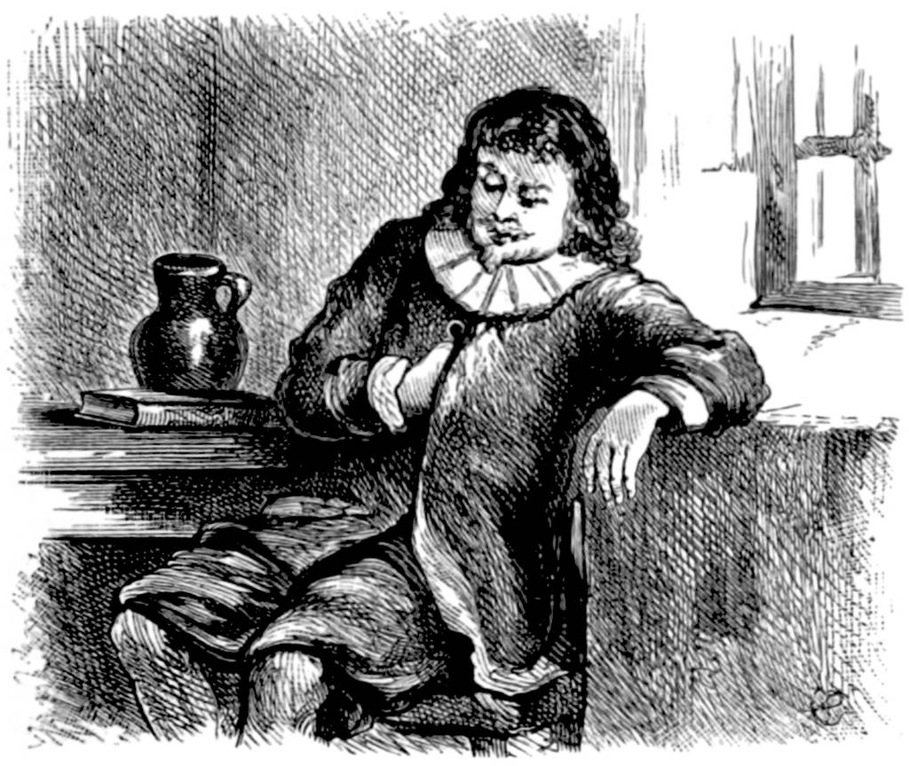

ᎢᏳᏃ ᎢᏗᎪᎵᏯ ᎤᏍᏆᏂᎪᏗ ᎧᏃᎮᏍᎩ ᎪᏪᎵ, ᎠᏏ ᎤᏟ ᏂᎧᏁᏉᎪ ᎤᏍᏆᏂᎪᏗ ᎢᏗᏰᎸᏍᎬ ᎢᏳᏃ ᏱᏗᎦᏔᎭ ᎾᏍᎩ
ᎤᏬᏪᎳᏅᎯ ᎨᏒ ᎠᎴ ᏄᎵᏍᏓᏁᎵᏙᎸᎢ, ᎠᎴ ᏄᏍᏛ ᎠᏕᏅᎢ. ᎬᏂᏳ ᎿᏉ ᎠᏂᏣᎳᎩ ᎾᏍᎩ ᎤᏍᏆᏂᎪᏗᏳ
ᎠᏰᎸᏗ ᎠᎴ ᎣᏍᏛ ᎠᏓᏕᏲᎲᏍᎩ ᎩᎳ ᎾᎨᏎᏍᏗ ᏛᏂᎪᎵᏰᎢ, ᎾᏍᎩ ᏂᎦᎵᏍᏙᏓ ᎣᏣᏓᏅᏛᎵ ᎢᎸᏍᎩ ᎢᎧᏁᏨᎯ ᎬᏂᎨᏒ
ᎢᏲᎬᏁᏗᏱ ᏄᏍᏛ ᎤᏕᏅ ᎠᎴ ᏭᏓᏁᏟᏴᎡᎵᎸ ᎤᏓᏅᏙ ᎢᏯᏍᏗ ᎾᏍᎩ ᎯᎠ ᎤᏬᏪᎳᏅᎯ.

ᎯᎠ ᎾᏍᎩ ᎤᏬᏪᎳᏅᎯ ᏣᏂ ᏆᏂ ᏚᏙᎡᎢ. ᎠᏂᎩᎵᏏᏱ ᎤᏕᏁ ᎤᏕᏘᏴᏌᏗᏒ 1628. ᎤᏙᏓ ᎤᏲᏉ ᎢᏳᏛᎿᏕᎩ ᎨᏎᎢ,
ᎠᏎᏃ ᎣᏏᏳ ᎠᎦᏓᏅᏖᏗᏱ ᎨᏎᎢ, ᎠᎴ ᎤᏪᏥ ᏣᏂ ᎪᏪᎵ ᏧᏕᎶᏆᏍᏗᏱ ᎤᎵᏂᎬᏁᎴᎢ. ᎠᏎᏃ ᎤᏛᏏᏗᏒ ᎧᏁᏉᏥᏎᏉ
ᎤᏁᎫᎯᏳ ᏂᎦᎵᏍᏗᏍᎬᎢ, ᎠᎴ ᎤᏩᎨᏫᏎᏉ ᏄᏍᏛ ᎠᎨᏲᏅ ᎠᏧᏣ ᏅᏧᎵᏍᏔᏅᎢ.
<!-- more -->
ᎿᏉᏃ ᎢᎸᏍᎩ ᏄᏕᏘᏴᎲ ᎠᏍᎦᏂ ᎠᎴ ᏗᎦᏘᎴᎩᏉ ᎨᏒ ᎤᏁᎳᏅᎯ ᎡᎲᎢ, ᎩᎳ ᎤᏁᎳᏅᎯ ᎤᏓᏅᏙ ᎤᏓᏅᏖᏗ ᏄᏩᏁᎴ
ᏄᏍᏛᏉ, ᎠᎴ ᎤᎾᏰᎯᏍᏗᏳ ᎨᏒ ᏄᏛᎿᏕᎬᎢ, ᎠᎴ ᏫᏚᎧᏃᏗᏱ ᎦᎶᏁᏛ ᎤᏪᏙᎵᏍᏗᏱ ᎤᏍᎦᏅᏨ ᏄᏩᏁᎴᎢ.
ᎦᎵᏉᎩᏦᏁᏃ ᎢᏳᏕᏘᏴᏛ ᎨᏎ ᎠᎦᏬᎥ, ᎾᏍᎩᏃ ᎢᏳᏓᎴᏅᏛ ᎾᏍᎦᏅᎾᏉ ᎠᎴ ᎤᏓᏅᏘᏳᏉ ᎡᎮᎢ.

ᏄᏬᎯᏨᎾᏉᏃ ᎠᎦᏬᎥᎯ ᎿᏉ ᎤᎴᏅᎮ ᎣᏍᏛ ᎧᏃᎮᏛ ᎤᎵᏣᏙᏁᎢ. ᎠᎴ ᎤᎬᏫᏳᎯ ᏚᎧᎿᏩᏗᏙᎮᏉ ᎠᎵᏣᏙᎲᏍᎬᎢ, ᎠᎴ
ᏧᎾᏓᏁᏟᏴᎡᏗ ᏂᏕᎬᏁᎮ ᏴᏫ ᏚᎾᏓᏅᏛᎢ. ᎠᎴ ᏄᏓᎾᏰᎯᏍᏛᎾ ᎠᎴ ᎤᎵᏨᏯᏍᏗᏳ ᎨᏒ ᎠᏍᎦᏯ, ᎿᏉ ᎪᎱᏍᏗ
ᎠᎪᏎᎯ ᏄᎵᏍᏔᏁ ᎠᎴ ᎠᏥᎩᎸᏍᎨᎢ, ᏂᎦᎵᏍᏙᏗᏍᎨ ᎾᏑᎵᎪᎬᎾ ᎠᎵᏣᏙᎲᏍᎬᎢ. ᎠᎴ ᎤᏂᏁᎫᏥᏛ ᎠᏂᏍᎦᏯ ᎬᏩᏂᏴᎮ
ᎠᎴ ᏗᏓᏍᏚᏗᏱ ᎬᏩᏍᏚᏁᎢ, ᎠᎴ ᏔᎳᏚ ᏧᏕᏘᏴᏛ ᎬᏩᏍᏚᏁᎢ. ᎠᏎᏃᎾ ᏗᏓᏍᏚᏗᏱ ᎠᏏᏉ ᎯᎠ ᎤᏓᏅᏘ ᎠᏍᎦᏯ ᎣᏍᏛ
ᏚᎸᏫᏍᏓᏁᎮ, ᎠᎴ ᏓᎵᏣᏙᏁᎮ ᎢᏧᎳᎭ ᏗᎨᏥᏍᏚᎯ. ᎠᎴ ᎾᎯᏳ ᎠᏥᏍᏚᎲᎢ, ᎤᏤᎵᏉ ᎤᏓᏅᏖᎵᏓᏍᏗ ᎠᏍᏓᏩᏗᏒ
ᎤᏍᏛᏗᏍᎬᎢ, ᎠᏂ ᎤᎯᏐᏛ ᎠᏐᏱ ᎠᏥᏍᏚᎲ ᎤᏬᏪᎳᏁ “ᏧᏁᎶᏗ ᏚᏂᎩᏒᏒᎢ”, ᎠᏗᎾ ᎢᎸᏍᎩ ᎢᎦᎢ ᎪᏪᎵ
ᏚᏬᏢᏁᎢ.

ᎠᎴ ᎢᏳ ᎠᏥᏄᎪᏫᏒ, ᎠᏏᏉ ᎠᎵᏣᏙᎲᏍᎨᎢ, ᎠᎴ ᏗᎦᏘᏯ ᏄᎵᏍᏔᏁ ᎠᏂᎦᏲᎵᏉ ᎤᎾᏓᏡᎬ ᎤᎾᎵᎪᎯ. ᏑᏓᎳᏍᎪᎯ
ᎢᏳᏕᏘᏴᏛ ᎨᏎ ᎤᏲᎱᏎᎢ.

ᎯᎠᏍᎩᏂ “ᏧᏁᎶᏗ ᏚᏂᎩᏒᏒᎢ” ᏓᏟᎶᏍᏗ ᏧᏁᎶᏗ ᎢᎪᎯᏛ ᎤᏕᏗ ᎨᏒ ᎠᏂ ᎡᎶᎯ, ᏗᎴᏂ ᎢᎬᏱᏱᏉ ᎠᎪᏩᏛ ᎤᏁᎳᏅᎯ
ᎤᏍᎦᏅᏤᎸᎯ ᎨᏒᎢ, ᎠᎴ ᎤᏁᎳᏅᎯᏉ ᎤᏔᎳᏬᎯᏍᏗ ᎤᏓᏄᏴᏗᏕᎬᎢ, ᎬᏂ ᎠᏂ ᎡᎶᎯ ᎠᏥᏯᏅᎰᎯᏍᏗ ᏂᎦᎵᏍᏔᏂᎦ,
ᎠᎴ ᎦᎸᎳᏗ ᏦᏒ ᏭᎷᎯᏍᏗ ᏫᏂᎦᎵᏍᏔᏂᎯᎲᎢ.

ᎾᏍᎩᏃ ᎯᎠ ᎢᎸᏍᎩ ᎢᎧᏁᏨᎯ ᏦᎪᏏᏐᏗ ᏥᏂᎦᎵᏍᏔᏂᎦ ᎤᏟᎧ ᎤᏍᏆᏂᎪᏗᏳ ᎠᏰᎸᏗ ᎠᎴ ᎠᎯᏗᏳ ᎪᎵᏍᏗ ᎨᏎᏍᏗ
ᎣᏤᎵᎭ ᎯᎠ ᏣᎳᎩ ᏗᏂᎪᎵᏰᏍᎩ ᏓᏂᎪᎵᏰᏍᎬᎢ.

ᏍᎨᏆ.

# ᎠᏆᏍᎩᏓᏒᎩ

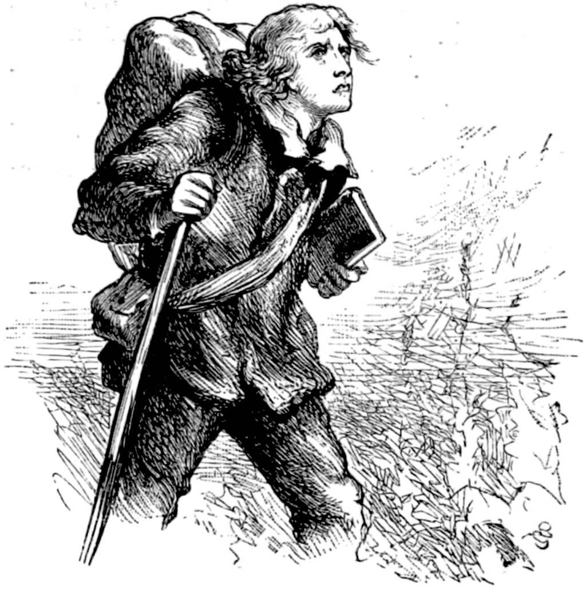

ᎦᎢᏒᏃ ᎢᎾᎨ ᎠᏂ ᎡᎶᎯ, ᎢᎸᎯᏢ ᎤᏍᏓᎦᎸ ᎠᎩᎷᏨᎩ, ᎾᎿᏃ ᎠᏆᏂᏏᏅᎩ, ᎠᎴ ᎠᎩᎸᏅᎩ, ᎠᎩᎸᏅᏃ ᎠᏆᏍᎩᏓᏒᎩ.
ᎦᏍᎩᏓᏍᎬᏃ ᏥᎪᎥ ᎠᏍᎦᏯ ᏧᏲ ᏧᏄᏩᎢ ᎦᏙᎬ ᎢᎸᎯᏢᎢ, ᎦᏁᎸᏃ ᎨᏒ ᎤᏣᏘᏂ ᎢᏗᏢ ᏭᎦᏛᎩ, ᎪᏪᎵ ᎤᏒᎦᎸᎩ,
ᎤᏣᏘᏃ ᎡᏉᎯᏳ ᎠᎵᏎᎲᎩ. ᏕᏥᏯᎦᎿᏅᏃ, ᎿᏉ ᎤᏍᏚᎢᏒ ᎪᏇᎵ, ᎠᎴ ᎤᎪᎵᏰᎥᎩ; ᎤᎪᎵᏰᎥᏃ ᎿᏉ ᏚᏠᏱᎸ ᎠᎴ
ᎤᏪᎾᏮᎩ; ᎤᏗᏢᏃ ᎢᎪᎯᏛ ᎬᏩᏛᏂᏗᏍᏗ ᏂᎨᏒᎾ ᏄᎵᏍᏔᏅ, ᎿᏉ ᎡᎯᏍᏗ ᎠᎴ ᎠᏍᏓᏯ ᎤᏁᏨᎩ, ᎯᎠ ᏄᏪᏒᎩ,
“ᎦᏙᏃ ᏓᎦᏛᏁᎵ?”

As I walk’d through the wilderness of this world, I lighted on a certain
place where was a Den, and I laid me down in that place to sleep; and as
I slept, I dreamed a Dream. I dreamed, and behold I saw a Man cloathed
with Rags, standing in a certain place, with his face from his own
house, a Book in his hand, and a great Burden upon his back. I looked,
and saw him open the Book, and read therein; and as he read, he wept and
trembled; and not being able longer to contain, he brake out with a
lamentable cry, saying “What shall I do?”

ᎯᎠ ᏄᏍᏛ ᎤᏓᏅᏛᎩ, ᎿᏉ ᎤᏪᏅᏒ ᏧᏪᏅᏒᎢ, ᏂᎪᎯᎸᏃ ᎬᏩᏛᏂᏗᏍᏗ ᎨᏒ ᎤᏛᏂᎣᎢ, ᏞᏍᏗ ᎤᎾᏙᎴᎰᏒ ᎠᏆᏓᎵᎢ ᎠᎴ
ᏗᏇᏥ ᏂᎦᎥ ᎡᎯᏍᏗ ᎠᏆᏓᏅᏛ ᎡᎵᏍᎪᎢ; ᎠᏎᏃ ᎥᏝ ᎪᎯᏛ ᎡᎳᏪ ᎬᏩᏗ ᏱᎨᏎᎢ, ᏂᎦᎵᏍᏙᏗᏍᎬᏰᏃ ᎧᏁᏉᏥᏒᏉ ᎤᏲ
ᎤᏓᏅᏛᎢ. ᎿᏉ ᏂᎦᎥ ᎬᏂᎨᏒᏉᏃ ᏂᏚᏩᏁᎸ ᎤᏓᎵᎢ ᎠᎴ ᏧᏪᏥ, ᎿᏉᏃ ᎤᎴᏅᎲ ᎯᎠ ᏂᏚᏪᏎᎸ ᏚᎵᏃᎮᏔᏅ;
“ᎢᏨᎨᏨᎢ ᎠᏆᏓᎵᎢ ᎠᎴ ᏗᏇᏥ, ᎤᏣᏘ ᎢᏨᎨᏳᎢᏳ, ᎠᏎᏃ ᎿᏉ ᎤᏲᏉᏃ ᎾᏆᎵᏍᏓᏁᎵᎦ ᎠᏴ,
ᏂᎦᎵᏍᏙᏗ ᎯᎠ ᎠᏍᏓᏱᏳ ᏥᎦᎵᏎᎭ. ᎠᎴ ᎾᏍᏉ ᎠᏴ ᎥᎩᏃᏁᎸ, ᎯᎠ ᎢᎩᏚᎲᎢ ᎠᏥᎸ ᎦᎸᎳᏗ
ᏅᏓᏳᎶᏒᎯ ᏛᎾᎪᎲᏍᏙᏔᏂ; ᎾᏍᎩ ᎯᎠ ᎤᏍᎦᏎᏗ ᏥᏅᏓᎦᎵᏍᏔᏂ, ᏂᎦᏗ ᏂᎯ ᎠᏆᏓᎵᎢ ᎠᎴ ᏂᎯ
ᎢᏨᎨᏳᎢ ᏗᏇᏥ ᎤᏲ ᏅᏓᎦᎵᏍᏓᏁᎵ, ᎬᏂ ᎪᎱᏍᏗ ᏳᎵᏍᏙᏔᏅ ᎢᎦᏚᏓᎴᏍᏙᏗ ᎬᏩᏛᏗ ᏱᎩ, ᎠᏎᏃ ᎥᏝ
ᎠᏏ ᎠᏴ ᏱᏥᎪᏩᏘᎭ.”

In this plight therefore he went home, and refrained himself as long as
he could, that his Wife and Children should not perceive his distress,
but he could not be silent long, because that his trouble increased:
Wherefore at length he brake his mind to his Wife and Children; and thus
he began to talk to them: *O my dear Wife,* said he, *and you the
Children of my bowels, I your dear friend, am in myself undone by reason
of a Burden that lieth hard upon me; moreover, I am for certain informed
that this our City (this World) will be burned with fire from Heaven; in
which fearful overthrow, both myself, with thee my Wife, and you my
sweet Babes, shall miserably come to ruine, except (the which yet I see
not) some way of escape can be found, whereby we may be delivered.*

ᎾᏍᎩᏃ ᎯᎠ ᏂᏚᏪᏎᎸ ᎪᎱᏍᏗ ᏧᏩᎿ ᎤᏂᏍᏆᏂᎪᏒᎩ, ᎥᏝ ᎠᏗᎾ ᎠᏃᎯᏳᎲᏍᎬ ᏱᏂᎦᎵᏍᏙᏗᏍᎨ ᏄᏍᏛ ᏚᏃᎮᎮᎸᎢ,
ᎪᎱᏍᏗᏉᏍᎩᏂ ᎤᎵᏍᏓᏏ ᎤᏓᏅᏛ ᎠᏁᎵᏍᎬᎩ; ᎾᏍᎩᏃ ᎢᏳᏍᏗ, ᎿᏉ ᎤᏒ ᏄᎵᏍᏔᏅ, ᎠᏎ ᎦᎸᏅᏉ ᎣᏏ
ᏅᏛᎤᎵᏍᏓᏁᎵ ᎠᏁᎵᏍᎬᎩ; ᎾᏍᎩᏃ ᎢᏳᏍᏗ ᎢᎦᎵᎨᏉ ᏫᎬᏩᏂᏏᏅᎩ. ᎠᏎᏃ ᏒᏃᏱ ᏄᎸᏅᎾᏉ ᎨᏒᎩ,
ᎤᏨᏓᏇᏉ ᎤᏲ ᎠᎴ ᎡᎯᏍᏗᏉ ᎤᏓᏅᏛᎢ. ᏑᎾᎴᏃ ᏄᎵᏍᏔᏅ ᎬᏩᏛᏛᏅ ᏄᏍᏛ ᎤᏓᏅᏛᎢ;

At this his Relations were sore amazed; not for that they believed that
what he had said to them as yet was true, but because they thought that
some frenzy distemper had got into his head; therefore, it drawing
towards night, and they hoping that sleep might settle his brains, with
all haste they got him to bed: But the night was as troublesome to him
as the day; wherefore, instead of sleeping, he spent it in sighs and
tears. So, when the morning was come, they would know how he did;

ᎯᎠᏃ ᏂᏚᏪᏎᎸᎩ, “ᎤᏗᏢᏉ ᎤᏲ ᏄᏍᏗᏆᏓᏅᏛᎢ,” ᎠᎴ ᎿᏉ ᎤᎴᏅᎲ ᏚᏬᏁᏔᏅᎩ; ᎠᏎᏃ ᎥᎬᏩᎳᏏᏛᎲᏉ. ᎿᏉᏃ
ᏱᎬᏍᎦᎢᏍᏗᏉ ᎠᎴ ᎾᎦᏌᏯᏍᏛᎾᏉ ᏱᎩ ᏳᏗᏫᏉ ᏥᏄᏍᏗ ᏧᏓᏅᏔ ᎬᏪᎵᏎᎸᎩ. ᎢᏴᏛᎭᏃ ᎬᏩᏐᏢᎢᏍᏗᏍᎬ
Ꭹ, ᎠᎴ ᎢᏴᏛᎭ ᎥᎬᏩᏍᎦᎬᎩ, ᎠᎴ ᏂᎬᏩᎦᏌᏯᏍᏛᎾᏉ ᎥᎨᏒᎩ. ᎾᏍᎩᏃ ᎿᏉ ᎤᎴᏅᎲ ᎤᏩᏒ ᎨᏒ ᎧᏅᏑᎸ
ᏓᏓᏙᎵᏍᏓᏁᎲ ᎠᎴ ᏕᎦᏙᎵᎬᎩ, ᎠᎴ ᎤᏩᏒ ᎤᏓᏅᏖᏗᏍᎬ ᏄᏛᎿᏕᎬᏉ. ᎠᎴ ᎢᎾᎨ ᏫᎦᎶᏍᎬᎩ,
ᎢᏴᏛᎭ ᎪᏪᎵ ᎠᎪᎵᏰᏍᎬᎩ, ᎠᎴ ᎢᏴᏛᎭ ᎠᏓᏙᎵᏍᏗᏍᎬᎩ; ᎾᏍᎩ ᎯᎠ ᏄᏍᏛ ᏚᎸᏫᏍᏓᏁᎲ ᎢᎸᏍᎩ
ᏄᏬᎯᏨᎩ.

He told them, *Worse and worse:* he also set to talking to them again,
but they began to be hardened: they also thought to drive away his
distemper by harsh and surly carriages to him; sometimes they would
deride, sometimes they would chide, and sometimes they would quite
neglect him: Wherefore he began to retire himself to his chamber, to
pray for and pity them, and also to condole his own misery; he would
also walk solitarily in the fields, sometimes reading, and sometimes
praying: and thus for some days he spent his time.

# ᎠᎵᏣᏙᏂᏙᎯ

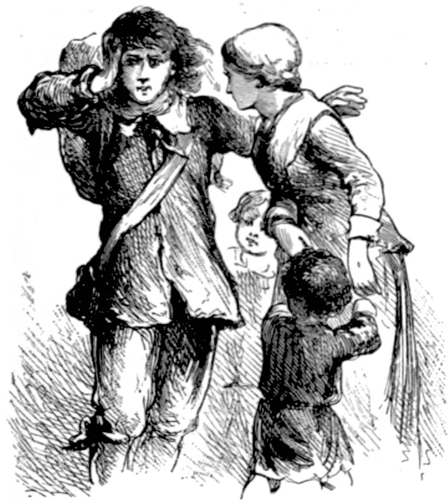

ᎾᏍᎩᏃ ᎢᎸᏍᎩ ᏄᏬᎯᏨ ᎥᏥᎪᎥ ᎢᎾᎨ ᎠᎢᏒᎩ, ᎪᏪᎵ ᎠᎪᎵᏰᏍᎬ, ᎠᎴ ᎤᏣᏘ ᎡᎯᏍᏗ ᎤᏓᏅᏛᎩ; ᎾᏍᎩᏃ ᎪᏪᎵ
ᎠᎪᎵᏰᏍᎬ ᎤᏪᎷᏅᏉ ᎠᏍᏓᏱᏳ ᎯᎠ ᏄᏪᏒᎩ, “ᎦᏙᏃ ᏓᎦᏛᏁᎵ ᏰᎵ ᎦᏴᎩᏍᏕᎸᏗ ᏅᏓᎦᎵᏍᏔᏂ?”

Now, I saw upon a time, when he was walking in the fields, that he was,
as he was wont, reading in his Book, and greatly distressed in his mind;
and as he read, he burst out, as he had done before, crying, “What shall
I do to be saved?”

ᎠᎴ ᎦᏕᎶᎣᏍᎬ ᎠᎦᏖᏃᎲ ᎠᏂᏗᏢ ᏫᏓᎧᏂᏍᎪᎢ, ᎿᏉ ᎠᎴ ᎠᏂᏗᏢ ᏫᏙᎠᏓᎧᏂᏍᎪᎢ, ᎩᎳᏉ ᎢᏴᏛ ᏗᎬᏩᏍᏆᎸᏙᏗ
ᏅᏩᏍᏙᎢ; ᎠᏎᏃ ᎦᏙᎪᏉ, ᏂᎦᎵᏍᏙᏗᏍᎪ ᎥᏝ ᏱᎦᏔᎰ ᎾᎿ ᏭᎶᎯᏍᏗᏱ. ᎿᏉ ᎠᎴ ᏫᏙᎠᏆᎧᎿᏅ, ᎿᏉ
ᏥᎪᎥ ᎠᏍᎦᏯ ᏓᏯᎢᏒᎩ ᎠᎵᏣᏙᏂᏙᎯ ᏧᏙᎢᏛ, ᎿᏉ ᎤᏛᏛᏅᎩ, “ᎦᏙᏃ ᎢᎭᏠᏱᎭᏉ ᎤᏬᏎᎸᎩ?”

I saw also that he looked this way and that way, as if he would run; yet
he stood still, because, as I perceived, he could not tell which way to
go. I looked then, and saw a man named Evangelist, coming to him, and
asked, “Wherefore dost thou cry?”

ᎯᎠᏃ ᏄᏪᏒᎩ, Ꭷ, ᎰᏩᏉ, ᎦᏕᎶᎣᏍᎦᏍᎩᏂ ᎠᏂ ᎪᏪᎵ ᏣᏆᏒᎦᏔ, ᎦᏳᎳ ᏧᏚᎪᏔᏅᎯ ᎨᏒ ᎠᎩᏲᎱᎯᏍᏗᏱ, ᎿᏉ ᎠᎴ
ᏗᎫᎪᏗᏍᎩᏱ ᏣᎩᎷᎯᏍᏗᏱ, ᎾᏍᎩᏃ ᎥᏝ ᏯᏆᏛᏅᎢᏍᏗ ᎠᎩᏲᎱᎯᏍᏗᏱ, ᎠᎴ Ꮭ ᏰᎵ ᏱᏂᏥᏍᏓᏴ ᏗᎫᎪᏗᏍᎩᏱ
ᏩᎩᎷᎯᏍᏗᏱ.

He answered, Sir, I perceive by the Book in my hand, that I am condemned
to die, and after that to come to Judgment, and I find that I am not
willing to do the first, nor able to do the second.

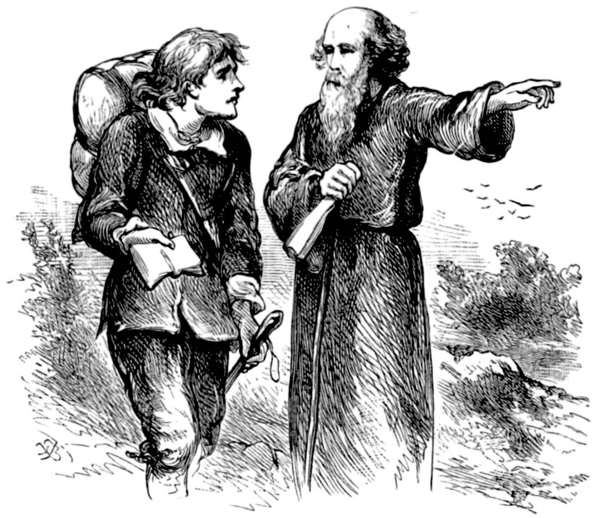

ᎿᏉᏃ ᎯᎠ ᏄᏪᏒ ᎠᎵᏣᏙᏂᏙᎯ. “ᎦᏙᏃ Ꮭ ᏱᏣᏛᏅᎢᏍᏗ ᏣᏲᎱᎯᏍᏗᏱ, ᏂᎦᎥᏃ ᎤᏲᏉ ᎠᎦᏙᎥᏏᏓᏍᏗ ᎠᏂ ᏥᏕᎭ?”
ᎯᎠᏃ ᏄᏪᏒ ᎠᏍᎦᏯ, “ᎯᎠᏍᎩᏂ ᎦᎨᏛ ᏥᎦᎵᏎ ᏂᎦᎵᏍᏙᏗ ᏥᎾᏰᏍᎦ, ᎥᏝ ᏗᏓᏂᏐᏗᏱᏉ ᎤᏩᏒ ᏴᏓᏥᏃᏴᏥ,
ᏨᏍᎩᏃᎢᏍᎩᏂ ᎢᏴᏛ ᏛᎩᏃᏴᏘᏍᏔᏂ. ᎠᎴᏃᎾ ᎾᏆᏛᏅᎢᏍᏛᎾ ᏱᎩ ᏗᏓᏍᏚᏗᏱᏉ ᏩᎩᎷᎯᏍᏗᏱ, ᎥᏝᏍᎩᏂ
ᏯᏆᏛᏅᎢᏍᏗ ᏗᎫᎪᏗᏍᎩᏱ ᎠᎴ ᎠᎩᎵᏲᎢᏍᏗᏱ ᏩᎩᎷᎯᏍᏗᏱ; ᎯᎠᏍᎩᏂ ᏂᎦᎵᏍᏙᏗ ᏥᎦᏠᏱᎭ.”

Then said Evangelist, “Why not willing to die, since this life is
attended with so many evils?” The Man answered, “Because I fear that
this burden that is upon my back will sink me lower than the Grave, and
I shall fall into Tophet. And, Sir, if I be not fit to go to Prison, I
am not fit to go to Judgment, and from thence to Execution; and the
thoughts of these things make me cry.”

ᎿᏉᏃ ᎯᎠ ᏄᏪᏒ ᎠᎵᏣᏙᏂᏙᎯ, “ᎠᏗᏃᏅ ᎾᏍᎩ ᏱᏄᏍᏗ ᎮᎲᎢ, ᎦᏙᏃ ᎠᏏᏉ ᎠᏂ ᎢᎯᏙᎦ?” ᎯᎠᏃ ᏄᏪᏒᎩ,
“ᏝᏗᏃᎾ ᏱᏥᎦᏔᎭ ᎾᎿ ᏩᎩᎶᎯᏍᏗᏱ.” ᎿᏉᏃ ᎤᏅᏁᎸ ᎦᏐᏛᎯ ᎪᏪᎵ, ᎾᎿᏃ ᎭᏫᏂᏗᏢ ᎪᏪᎸᎩ.
“ᎯᏯᎵᏗᏏ ᎤᏔᎳᏬᎯᏍᏗ ᎤᎷᎯᏍᏗ ᏥᎩ.”

Then said Evangelist, “If this be thy condition, why Conviction standest
thou still?” He answered, “Because I know not whither to go.” Then he
gave him a *Parchment-roll*, and there was written within, *Fly from the
wrath to come.*

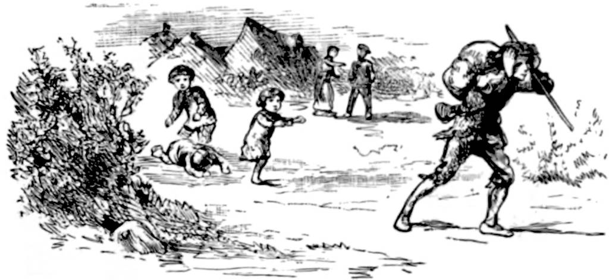

ᎿᏉᏃ ᎤᎪᎵᏰᎥ, ᎤᎵᏏᎾᎯᏍᏗ ᏚᎧᎿᏅ ᎠᎵᏣᏙᏂᏙᎯ, ᎯᎠ ᏄᏪᏒᎩ “ᎭᏢᏃ ᏮᏓᎦᏗᏢᏍᏔᏂ?” ᎯᎠᏃ ᏄᏪᏒ
ᎠᎵᏣᏙᏂᏙᎯ. (ᏭᏐᏅ Ꭰ ᎢᎾᎨᎢ) “ᏫᎪᏩᏘᏍᎪ Ꮎ ᎬᎾᏙᎵ ᎦᎶᎯᏍᏗ ᏨᏗᎪᏢᎭ?” ᎠᏍᎦᏯᏃ
ᎯᎠ ᏄᏪᏒᎩ, “ᎥᏝ”, ᏐᎢᏃ ᎯᎠ ᏄᏪᏒᎩ, “ᏫᎪᏩᏘᎨ Ꮎ ᎢᎦ ᏨᏗᎦᏔ?” ᎯᎠᏃ ᏄᏪᏒᎩ, “ᏥᎪᏩᏘ
ᎠᎩᏰᎸᎭ;” ᎠᎵᏣᏙᏂᏙᎯᏃ ᎯᎠ ᏄᏪᏒᎩ, “ᎾᏍᎩ ᎢᎦᎦᏛ ᏕᎯᎧᎿᏩᏗᏎᏍᏗ, ᎠᎴ ᎾᎿ ᏫᏚᎪᏓ, ᎾᎿᏃ
ᏘᎪᎯ ᎦᎶᎯᏍᏗᏱ; ᎠᎴ ᏓᏰᏣᏃᏁᎵ ᎢᏣᏛᏁᏗᏱ.”

The Man therefore read it, and looking upon Evangelist very carefully,
said, “Whither must I fly?” Then said Evangelist, pointing with his
finger over a very wide field, “Do you see yonder Wicket-gate?” The Man
said, “No.” Then said the other, “Do you see yonder shining Light?” He
said, “I think I do.” Then said Evangelist, “Keep that Light in your
eye, and go up directly thereto: so shalt thou see the Gate; at which,
when thou knockest, it shall be told thee what thou shalt do.”

ᎾᏍᎩᏃ ᎦᏍᎩᏓᏍᎬ ᏥᎪᎥ ᎠᏍᎦᏯ ᎿᏉ ᏚᏍᏆᎸᏔᏅᎩ,

So I saw in my Dream that the Man began to run.

ᎠᎴ ᎥᏝ ᎢᏅᎯ ᎤᏗᏢ ᏱᎨᏎ ᎦᏁᎸ, ᎿᏉ ᎤᏓᎵᎢ ᎠᎴ ᏧᏪᏥ ᎤᎾᏕᎶᎰᏒᎩ, ᎠᎴ ᎿᏉ ᎤᎾᎴᏅᎲ ᎬᏩᎵᏍᏓᏁᎸ
ᏅᏛᎤᏨᏍᏗᏱ; ᎠᏎᏃ ᏚᏟᎡᎾᏍᏔᏅᏉ, ᎬᏗᏟᏐᏉᏃ, ᎠᏍᏓᏱᏳᏃ ᎧᏁᎪ, “ᎬᏂᏛ\! ᎬᏂᏛ\!
ᏫᎾᏍᏛᎾ ᎬᏂᏛ\!” ᎠᏗᏍᎪᎢ. ᎥᏝᏃ ᏳᎦᏔᎲᏎᎢ, ᎠᏗᏟᏒᏍᎩᏂ ᏫᏗᎬᏭᎪᏗᏗᏐᏉ ᎢᎾᎨ ᎢᏗᏢ.

Now he had not run far from his own door, but his Wife and Children,
perceiving it, began to cry after him to return; but the Man put his
fingers in his ears, and ran on, crying, “Life\! Life\! Eternal Life\!”
So he looked not behind him, but fled towards the middle of the Plain.

# ᎬᏩᏟᏍᏛ-ᎤᏬᎯᏳᏗᏱ ᎠᎴ ᎤᏬᎯᏳᎯᏍᏛ

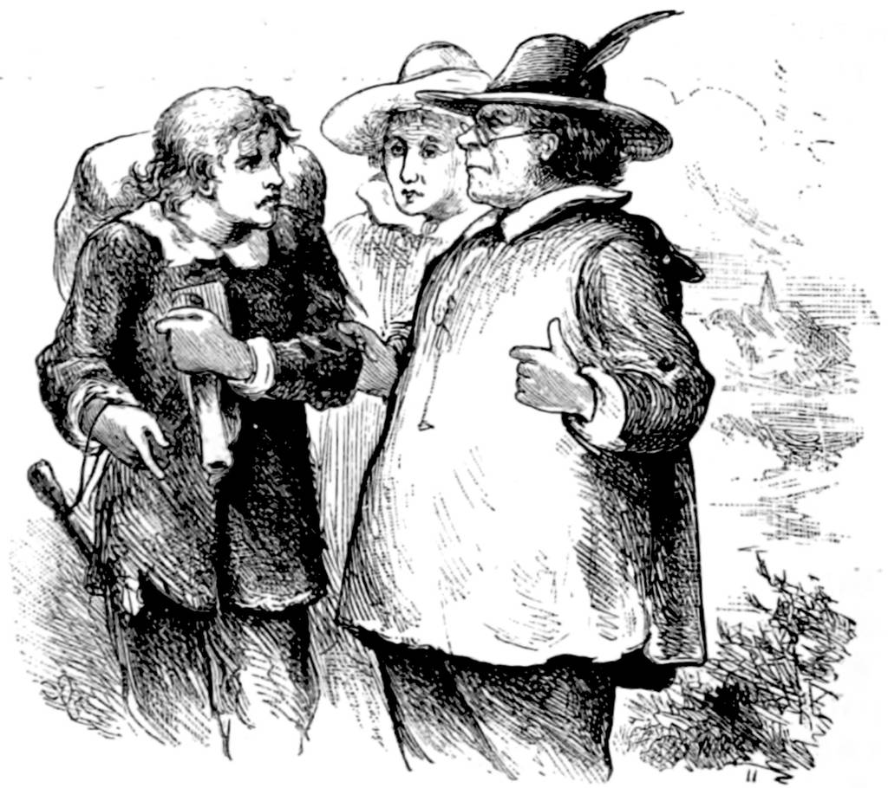

ᎾᎥᏃ ᎢᏳᎾᏓᎵ ᎾᏍᏉ ᏫᎬᏩᎦᏙᏍᏔᏅ ᏩᏗᏟᏒᎢ, ᏩᏗᏟᏒᏃ, ᎢᎦᏛ ᎬᏩᏐᏢᎢᏍᏗᏍᎪᎢ, ᎢᎦᏛᏃ ᎬᏩᏍᎦᎪᎢ, ᎢᎦᏛᏃ
ᎡᏥᎭᏨᎾ ᏫᎬᏬᏎᎰᎢ; ᎾᏍᎩᏃ ᎯᎠ ᎢᏯᎾᏛᏁᎯ, ᎠᏂᏔᎵᏃ ᎿᏉ ᏚᏄᎪᏔᏅ ᎬᏍᎦᎢᏍᏓᎩ ᏅᏓᎬᏩᏨᏍᏙᏗᏱ. ᏐᎢᏃ
ᎯᎠ ᏄᏍᏛ ᏚᏙᎥᎩ, ᎬᏩᏟᏍᏛ-ᎤᏬᎯᏳᏗᏱ, ᏐᎢᏃ ᎤᏬᎯᏳᎯᏍᏛ ᏚᏙᎥᎩ.

The Neighbors also came out to see him run; and as he ran, some mocked,
others threatened, and some cried after him to return; and among those
that did so, there were two that resolved to fetch him back by force.
The name of the one was *Obstinate*, and the name of the other
*Pliable*.

ᎾᏍᎩ ᎠᏗᎾ ᎯᎠ ᏄᏬᎯᏨ ᎿᏉ ᎢᏅᎯ ᏰᎵ ᏩᏘᏟᏒᎩ. ᎠᏗᎾ ᎠᏎ ᎬᏩᎨᎲᏍᏗᏱ ᏚᏄᎪᏛᎢ, ᎬᏩᎨᎮᏅᏃ, Ꮭ ᏳᏬᎯᏤ ᎿᏉ
ᏮᎬᏩᏢᏔᎲᎩ. ᎿᏉᏃ ᎠᏍᎦᏯ ᎯᎠ ᏂᏚᏪᏎᎸᎩ, “ᎦᏙᏉ ᎢᏍᏗᏲᎵᎦ?” ᎯᎠᏃ ᏂᎬᏩᏪᏎᎸᎩ, ᎥᏣᏨᏍᏗᏱ
ᏍᏛᏍᏗᏰᏔᏂᎦ;” ᎯᎠ ᏂᏚᏪᏎᎸᎩ, “ᎠᏎᏃ ᎥᏝ ᎾᏍᎩ ᏱᏅᎦᎵᏍᏓ” ᏗᏍᏕᎬᏰᏃ ᏥᎦᏚᎭ
ᎠᏲᎩᏉ ᎨᏒᎢ; ᎠᎴ ᎠᏴ ᎾᏍᏉ ᎾᎿ ᎠᏆᏕᏅᎯ: ᎠᎴ ᏥᎦᏔᎭ ᎤᏙᎯᏳᏒ ᎾᎿ ᏙᏓᏍᏗᏲᎱᏏ ᎢᎸᎯᏳᏉ ᏙᏓᏍᏗᏃᏴᏥ,
ᎠᎴ ᎥᏝ ᏗᏓᏂᏐᏗᏱᏉ ᎢᏴ ᏱᎨᏎᏍᏗ, ᎡᎳᏗᏍᎩᏂ ᎠᏥᎸᏱ ᏗᏓᏪᎵᎩᏍᎬ ᎢᏴᏛ, Ꭷ, ᏍᏓ ᎦᎵᏴᎾᏉᏲᎪ ᎢᏕᎾᏉ.

Now by this time the Man was got a good distance from them; but however
they were resolved to pursue him, which they did, and in a little time
they overtook him. Then said the Man, Neighbors, wherefore are you come?
They said, To persuade you to go back with us. But he said, That can by
no means be; you dwell, said he, in the City of *Destruction*, the place
also where I was born, I see it to be so; and dying there, sooner or
later, you will sink lower than the Grave, into a place that burns with
Fire and Brimstone: be content, good Neighbors, and go along with me.

ᏄᏬᎯᏳᎯᏒᎾᏃ ᎯᎠ ᏄᏪᏒᎩ. ᎦᏙᏃ, ᏥᎪᏃ ᏙᏓᏲᏍᏛᏕᏥ ᎣᎦᎵᎢ ᎠᎴ ᎪᎱᏍᏗ ᎣᏍᏛ ᎣᎩᎾᏓᏅᏓᏗᏍᏗ ᎣᎩᏂᎲᎢ\!

Obst. What, said *Obstinate*, and leave
our friends and our comforts behind us\!

ᎥᎥ, ᎤᏛᏅ ᏧᏁᎶᏗ, (ᎾᏍᎩᏰᏃ ᏄᏍᏛ ᏚᏙᎥᎩ,) ᎯᎠᏍᎩᏂ ᏥᏍᏛᏕᎦ ᎥᏝ ᏗᎬᏟᎶᏍᏙᏗ ᏱᎩ, ᏄᏍᏛᏃ ᎠᏴ
ᎠᎩᏲᎵᏒᎢ. ᎠᎴ ᎢᏍᏙᎯᏳᏅᎭ ᏄᏍᏛᏉ ᎠᏴ ᎠᏆᏤᎵ ᎢᏳᎵᏍᏙᏗ ᎨᏒ ᎤᏠᏱᏉ ᎾᏍᏉ ᏍᏓᏤᎵ
ᏅᏓᎦᎵᏔᏂ, ᎾᎿᏰᏃ ᏥᏫᏥᎦᏘ ᎥᏝ ᏰᎵᏉ ᏗᎩᏰᎵᎯᏍᏗ ᎢᎦᎢ ᏴᏗᎭ, ᎤᏗᏗᏢᏍᎩᏂ ᎢᎦᎢ ᏗᏍᏆᏂᎪᏗ,
ᏁᏗᎦ ᎢᏕᎾ ᏫᏍᏓᏙᎴᎰᏏᏓᏃ ᎯᎠ ᏥᏂᏥᏪᎭ.

Chr. Yes, said Christian, for that was
his name, because that *all* which you shall forsake is not worthy to be
compared with a *little* of that that I am seeking to enjoy; and if you
will go along with me and hold it, you shall fare as I myself; for there
where I go, is enough and to spare: Come away, and prove my words.

ᏄᏬᎯᏳᎯᏒᎾᏃ ᎯᎠ ᏄᏪᏒᎢ. ᎦᏙᏃ ᎤᏍᏗ ᏣᏲᎴᎦ, ᎾᏍᎩ ᏂᎦᎵᏍᏙᏗ ᏂᎦᏗ ᎡᎶᎯ ᏥᏕᏣᏲᏍᎦ?

Obst. What are the things you seek, since
you leave all the world to find them?

ᏧᏁᎶᏗᏃ ᎯᎠ ᏄᏪᏒᎩ. ᎠᏕᏗᏱᏍᎩᏂ, ᎠᏲᎩ, ᎠᎴ ᎠᎦᏓᎯᏲᎩ, ᎠᎴ ᎠᏍᎪᎸᎩ ᏂᎨᏒᎾ, ᎦᎸᎳᏗ ᏗᏍᏆᏂᎪᏗ,
ᎬᏩᏲᎢᏍᏗ ᎠᎴ ᏂᎨᏒᎾ, ᎠᎴ ᎨᏥᏁᏗ ᏅᏓᎦᎵᏍᏔᏂ, ᎢᏳ ᎿᏉ ᎠᏍᏆᎸᎲᎭ, ᎾᏍᎩ ᎤᎾᎵᏂᎬᏁᎸᎯ,
ᏁᏗᎦ ᏍᏗᎪᎵᏯ ᎯᎠ ᎪᏪᎵ ᏥᏥᏁᎭ.

Chr. I seek an *Inheritance
incorruptible*, *undefiled*, *and that fadeth not away*, and it is laid
up in Heaven, and safe there, to be bestowed at the time appointed, on
them that diligently seek it. Read it so, if you will, in my Book.

ᏄᏬᎯᏳᎯᏒᎾᏃ ᎯᎠ ᏄᏪᏒᎩ. Ꭱ, ᎤᏟ ᏫᏣᏓᏅᎦ Ꮎ ᎪᏪᎵ ᏥᏁᎭ; ᏛᎭᏨᏏᏧ ᎥᏝᎨ?

Obst. Tush, said *Obstinate*, away with your Book; will you go back with
us or no?

ᏧᏁᎶᏗᏃ ᎯᎠ ᏄᏪᏒᎩ. ᎥᏝ, ᎯᎠᏰᏃ ᏂᎦᎵᏍᏙᏗᎭ, ᎿᏉᏰᏃ ᎦᏓᎷᎪᏗ ᏓᎩᏂᏴᎲ.

Chr. No, not I, said the other, because I
have laid my hand to the Plow.

ᏄᏬᎯᏳᎯᏒᎾᏃ ᎯᎠ ᏄᏪᏒᎩ, Ꭷ, ᏦᎯᏳᎯᏍᏛ, ᏗᎩᏁᏅᏒᏉᏃ ᏮᏛᏂᎶᏏ ᎩᏅᏒ. ᎠᏁᎭᏰ ᎯᎠ ᏧᏂᎸᏃᏘᏍᎩ ᎢᏳᏃ ᎪᎱᏍᏗ
ᎠᎾᏓᏅᏛᎵ ᎤᏟ ᎠᏂᎦᏔᎿᎢᏳ ᎤᎾᏤᎸᎭ, ᎡᏍᎦᏉ ᎦᎵᏉᎩ ᎢᏯᏂᏛ ᎠᏂᏍᎦᏯ ᎠᏂᎦᏔᎿᎢ ᎠᎴ ᎣᏍᏛ ᏗᎬᏩᏃᏏᏐᏗ
ᏥᎨᏐᎢ.

Obst. Come then, Neighbor *Pliable*, let
us turn again, and go home without him; there is a company of these
craz’d-headed coxcombs, that, when they take a fancy by the end, are
wiser in their own eyes than seven men that can render a reason.

ᎤᏬᎯᏳᎯᏍᏛᏃ ᎯᎠ ᏄᏪᏒᎩ. ᎥᏞᏍᏗ ᎦᎯᏐᏢᏔᏅᏉ, ᎢᏳᏰᏃ ᎯᎠ ᎤᏓᏅᏘ ᎠᎴ ᏧᏁᎶᏗ ᏥᏂᎦᏪ ᏳᏙᏱᏳᎭ, ᎣᏏᏍᎩᏂ
ᎤᏲᎭ ᎡᏍᎦᏉ ᎠᏴ ᎩᏂᏲᎲᎢ; ᎠᏴᏍᎩᏂ ᏗᏆᏓᏅᏛ ᎢᏴᏛ ᎠᏆᎦᎵᏴᎾᏁᏉ ᎣᎩᏁᏅᏍᏗ ᎯᎠ ᎣᎩᎾᎵᎢ.

Pli. Then said *Pliable*, Don’t revile;
if what the good *Christian* says is true, the things he looks after are
better than ours; my heart inclines to go with my Neighbor.

ᏄᏬᎯᏳᎯᏒᎾᏃ ᎯᎠ ᏄᏪᏒᎩ. Ᏺ. ᏥᎪ ᎠᏂᏁᏉᎦᏉ ᎠᏏ ᎤᏂᏁᎫ\! ᏍᏉᎯᏳᎲᎦᏉᏲᎪ ᎠᏴ ᏥᎾᏨᎾᏉ; ᏝᏰᏃ ᎩᎶ
ᏱᎬᎦᏔᎭ ᎾᎿ ᏫᏣᏘᏅᏍᏙᏗᏱ ᎯᎠ ᎤᏅᏥᏙᎯ ᎤᏢᎩ ᏥᏣᏘᏁᎦ. ᏥᎭᏨᎾᏉ ᏥᎭᏨᎾᏉᏲᎪ; ᎣᏏᏃ ᏰᎵ
ᏣᏓᏅᏖᏗᏱ ᎨᏎᏍᏗ.

Obst. What\! more fools still? Be ruled
by me, and go back; who knows whither such a brain-sick fellow will lead
you? Go back, go back, and be wise.

ᏧᏁᎶᏗᏃ ᎯᎠ ᏄᏪᏎᎸ ᎤᏬᎯᏳᎯᏍᏛ. ᎠᏩᏛᏗᏍᎩᏂ ᎯᎠ ᏥᏥᏁᎢᏍᏗᎭ, ᎠᎴ ᎤᏗᏢᏍᏙᏗ ᎢᎦᎢ ᎦᎸᏉᏗᏳ ᎠᏩᏛᏗ. ᎢᏳ
ᎠᎴ ᎠᏴ ᏍᎩᎳᏏᏘᏍᎨᏍᏗ, ᎠᏂ ᎯᎠ ᎪᏪᎵᎯ ᎯᎪᎵᏯ; ᎠᎴᏃ ᎯᎠ ᏥᏂᎦᏪ ᎤᏙᎯᏳᏒ ᎨᏒᎢ, ᎬᏂᏳᏉ, ᎤᏁᏨᎯ
ᎤᏩᏒ ᎤᎩᎬ ᎬᏂᎨᏒ ᏄᏩᏁᏔᏅ.

Chr. Come with me, Neighbor *Pliable*;
there are such things to be had which I spoke of, and many more Glories
besides. If you believe not me, read here in this Book; and for the
truth of what is exprest therein, behold, all is confirmed by the blood
of Him that made it.

ᎤᏬᎯᏳᎯᏍᏛᏃ ᎯᎠ ᏄᏪᏎᎸ ᏄᏬᎯᏳᎯᏒᎾ. ᎿᏉ ᎠᏴ ᏕᎫᎪᏗᏉᏃ, ᏓᏲᏍᏕᏏᏉ ᎯᎠ ᎤᏓᏅᏘ ᎠᏍᎦᏯ, ᎠᎴ ᎢᏳᎵᏍᏓᏁᏗᏉ
ᎨᏒ ᎢᏯᏆᎵᏍᏓᏁᎵᏓᏍᏗ ᎨᏎᏍᏗ. Ꭷ, ᏣᏓᏅᏘ ᎩᎾᎵᎪᎯ, ᎯᎦᏔᎭᏍᎪᏃ ᏫᎦᎶᎯᏍᏗᏱ ᎾᎿ ᏥᏫᎦᏘ?

Pli. Well, Neighbor *Obstinate*, said
*Pliable*, I begin to come to a point: I intend to go along with this
good man, and to cast in my lot with him: but, my good companion, do you
know the way to this desired place?

ᏧᏁᎶᏗᏃ ᎯᎠ ᏄᏪᏒᎩ. ᎠᎵᏣᏙᏂᏙᎯ ᏧᏙᎢᏛ ᎠᏆᏎᎮᎸ ᎤᏍᏗ ᎦᎶᎯᏍᏗ ᏗᎪᏢᏒ ᏩᎩᎶᎯᏍᏗᏱ Ꭰ ᏫᏂᎦᏛ ᎢᏗᏢ, ᎾᎿ
ᎣᏍᏛ ᏓᏰᎩᏂᏃᏁᎵ ᏫᎩᏂᎶᎯᏍᏗᏱ.

Chr. I am directed by a man, whose name
is *Evangelist*, to speed me to a little Gate that is before us, where
we shall receive instructions about the way.

ᎤᏬᎯᏳᎯᏍᏛᏃ ᎯᎠ ᏄᏪᏒᎩ. Ꭷ ᏣᏓᏅᏘ ᎩᎾᎵᎢ ᎢᎾᎢᏎᏍᏗᎪᎦᏃ. ᎿᏉᏃ ᏫᏚᎾᏓᏴᎸᏔᏅᎩ.

Pli. Come then, good Neighbor, let us be
going. Then they went both together.

ᏄᏬᎯᏳᎯᏒᎾᏃ ᎯᎠ ᏄᏪᏒᎩ. ᎠᏴᏃ ᏛᎦᏨᏏᏉᏃ, ᎥᏝ ᎿᏉ ᏲᎩᎾᎵᎪᏌᏗᏎᏍᏗ ᎤᎴᎾᎯᏛ ᎤᏓᏅᏛᎢ.

Obst. And I will go back to my place,
said *Obstinate*; I will be no companion of such mis-led, fantastical
fellows.

# ᏧᏁᎶᏗ ᎠᎴ ᎤᏬᎯᏳᎯᏍᏛ

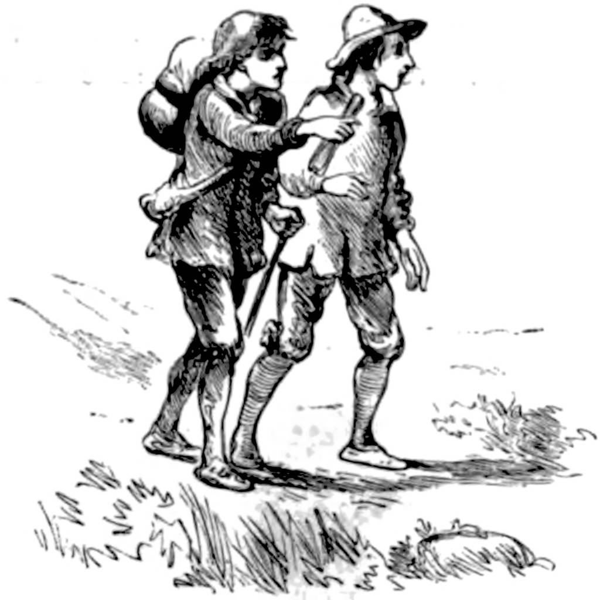

ᎾᏍᎩᏃ ᎦᏍᎩᏓᏍᎬ ᎦᏥᎪᎥ, ᎢᏳ ᎿᏉ ᎢᎤᏨᏒ ᏄᏬᎯᏳᎯᏒᎾ, ᏧᏁᎶᏗ ᎠᎴ ᎤᏬᎯᏳᎯᏍᏛ ᎠᎾᎵᏃᎮᏔᏂᏐ ᎠᎾᎢᏒ
ᎢᎾᎨᎢ, ᎯᎠ ᏄᏂᏪᏒ. ᎿᏉ ᎤᎾᎴᏅᎲ.

Now I saw in my Dream, that when *Obstinate* was gone back, *Christian*
and *Pliable* went talking over the Plain; and thus they began their
discourse.

ᏧᏁᎶᏗ ᎯᎠ ᏄᏪᏎᎸ ᎤᏬᎯᏳᎯᏍᏛ, Ꭷ, ᎰᏍᎩᏂ ᎦᎵᎡᎵᎦ ᏦᎯᏳᎲᎦ ᎩᏁᏅᏍᏗᏱ. ᎢᏳᏰᏃ ᎾᏍᏉ ᏄᏬᎯᏳᎯᏒᎾ ᏱᎠᎦᏔᎮ
ᏥᏥᎦᏔᎭ ᎢᎦᎢ ᏄᎾᏰᎯᏍᏛ ᎠᏏ ᎢᎩᎪᎲᎯ ᏂᎨᏒᎾ ᏥᎩ, ᎥᏝᏍᎩᏂ ᏱᎨᎩᎾᏨᎡᎴᎢ.

Chr. Come Neighbor *Pliable*, how do you
do? I am glad you are persuaded to go along with me: Had even
*Obstinate* himself but felt what I have felt of the powers and terrors
of what is yet unseen, he would not thus lightly have given us the back.

ᎤᏬᎯᏳᎯᏍᏛᏃ ᎯᎠ ᎿᏉ ᏄᏪᏎᎸᎩ. Ꭷ, ᏗᏣᏁᎶᏗ, ᎿᏉ ᎬᏂ ᎩᏅᏒ ᏂᎩᎾᏛᎿᏗ, ᎤᏗᏢᏃ ᎢᎦᎢ ᏍᎩᏃᎲᏏ
ᏅᏧᏍᏗᏓᏅᎢ, ᎠᎴ ᏂᎦᎵᏍᏙᏗᏍᎬ ᏍᏤᎵ ᏂᎦᎵᏍᏗᏍᎬᎢ, ᎾᎿ ᏥᏫᏂᎦᏘ.

Pli. Come, Neighbor *Christian*, since
there are none but us two here, tell me now further what the things are,
and how to be enjoyed, whither we are going?

ᏧᏁᎶᏗᏃ ᎯᎠ ᏄᏪᏒᎩ, ᎤᏟ ᏃᎯ ᎪᎵᎦ ᏗᏆᏓᏅᏛ ᎢᏴᏛ, ᎥᏝᏃ ᎾᏍᎩᏯ ᎬᎩᏃᎮᏗ ᏱᎩ, ᎠᏎᏃ ᏥᏣᎩᏛᎲᏍᎦ
ᏣᏙᎴᎰᎯᏍᏗᏱ, ᏓᎬᎪᎵᏰᎵ ᎪᏪᎵᎯ.

Chr. I can better conceive of them with
my Mind, than speak of them with my Tongue: but yet, since you are
desirous to know, I will read of them in my Book.

ᎤᏬᎯᏳᎯᏍᏛᏃ ᎯᎠ ᏄᏪᏒᎩ. ᏥᎪᏃ ᎤᏙᎯᏳᎯᏯ ᏣᏰᎸ ᎯᎠ ᏥᏂᎦᏪ ᎪᏪᎵᎯ?

Pli. And do you think that the words of
your Book are certainly true?

ᏧᏁᎶᏗᏃ ᎯᎠ ᏄᏪᏒᎩ. ᎥᎥ, ᎤᏙᎯᏳᎯᏯᎢ; ᎬᏩᏥᎪᏗ ᏂᎨᏒᎾ ᏥᎩ ᎤᏬᏢᏅᎯ ᎯᎠ ᎪᏪᎵ.

Chr. Yes, verily; for it was made by him
that cannot lye.

ᎤᏬᎯᏳᎯᏍᏛᏃ ᎯᎠ ᏄᏪᏒᎩ. ᎰᏩᏉ, ᎦᏙᏃ ᏧᏍᏗᏓᎾ?

Pli. Well said; what things are they?

ᏧᏁᎶᏗᏃ ᎯᎠ ᏄᏪᏒᎩ. ᎠᎵᏍᏆᏗᏍᎩᏍᎩᏂ ᏂᎨᏒᎾ ᏗᎪᏢ ᎤᎬᏫᏳᎯ ᎤᏤᎵᎪᎯ ᎠᏕᏗᏱ, ᎠᎴ ᎠᎵᏍᏆᏗᏍᎩ ᏂᎨᏒᎾ ᎬᏂᏛ
ᎡᎩᏁᏗ, ᎾᎿᏃ ᎿᏉ ᏂᎪᎯᎸ ᎠᎴ ᎠᎵᏍᏆᏗᏍᎩ ᏂᎨᏒᎾ ᎢᎦᏕᏗ ᎨᏎᏍᏗ.

Chr. There is an endless Kingdom to be inhabited, and everlasting Life
to be given us, that we may inhabit that Kingdom for ever.

ᎤᏬᎯᏳᎯᏍᏛᏃ ᎯᎠ ᏄᏪᏒᎩ. ᎰᏩᏉ; ᎦᏙᏕᏃ ᎠᏏ Ꮀ ᏗᎤᏍᏗ?

Pli. Well said; and what else?

ᏧᏁᎶᏗᏃ ᎯᎠ ᏄᏪᏒᎩ. ᎦᎸᏉᏗᏍᎩᏂ ᏗᎵᏍᏚᎶ ᏤᎩᏅᏁᏗ; ᎠᎴ ᏗᎦᏅᏬ ᏙᏓᏰᎩᏅᏁᎵ, ᏅᏙ ᎦᎸᎶᎢ ᏥᎧᎳ ᎡᏍᎦ
ᏄᏔᎷᎩᏍᎨᏍᏗ ᎾᏍᎩᏃ ᏂᏚᏔᎷᎩᏍᎬᎢ.

Chr. There are Crowns of glory to be
given us, and Garments that will make us shine like the Sun in the
firmament of Heaven.

ᎤᏬᎯᏳᎯᏍᏛ. ᎤᏣᏘᏉ ᎣᎯ; ᎦᏙᏃ ᎠᏏ ᏗᎤᏍᏗ?

Pli. This is excellent; and what else?

ᏧᏁᎶᏗᏃ ᎯᎠ ᏄᏪᏒᎩ. ᎥᏝᏍᎩᏂ ᎿᏉ ᏱᏓᏂᏴᎨᏍᏗ, ᎥᏝ ᎠᎴ ᎿᏉ ᎤᏲ ᏳᎾᏓᏅᏖᏍᏗ, ᎠᎴ ᎾᏍᎩ ᎤᏤᎵ ᏨᏗᎩ
ᏙᏓᎦᏅᎦᎸᎰᏂ ᏕᎩᎦᏌᏬᎸᎢ.

Chr. There shall be no more crying, nor
sorrow, for He that is owner of the place will wipe all tears from our
eyes.

ᎤᏬᎯᏳᏍᏛᏃ ᎯᎠ ᏄᏪᏒᎩ. ᎦᎪᏃ ᎾᎿ ᎢᏧᎳᎭ ᏫᏕᎮᏍᏗ?

Pli. And what company shall we have
there?

ᏧᏁᎶᏗ. ᎾᎿᏍᎩᏂ ᏕᎦᏜᏍᏗᏕᎨᏍᏗ ᎠᏂᏓᏪ ᏗᏂᎧᎿᏩᏗᏙᎯ; ᎤᏣᏘ ᏧᏂᎦᏙᏴᎢᏍᏗᏳ ᏗᎧᏃᏗᏱ ᏗᏅᏃᏛ. ᎠᎴ ᎾᏍᏉ ᎾᎿ
ᏕᏓᏠᏍᎨᏍᏗ ᎤᏣᏘ ᎢᏳᎦᏴᎳᏨᎯ ᎢᏳᎾᏧᏈᏍᏗ ᎾᎿ ᎦᏳᎳ ᎢᎬᏱ ᎨᎨᏅᎡᎸᎯ ᏥᎩ; ᎥᏝ ᏌᏉ ᏱᎬᏩᏜᏍᏗ ᎡᎯᏍᏗ
ᎢᏯᏓᏛᏁᎯ, ᏧᎾᏓᎨᏳᎯᏉᏍᎩᏂ ᎠᎴ ᎾᏂᏍᎦᏅᎾ; ᎠᎴ ᏂᏓᏗ ᎤᏁᎳᏅᎯ ᏧᎧᎿᏂᏓᏍᏗᏱ ᎠᏁᏙᎭ, ᎠᎴ
ᏂᎪᎯᎸ ᏗᎨᎦᏓᏂᎸᏨᎯᏉ ᎠᏂᏙᎾᎣ ᎤᏁᎳᏅᎯ ᎠᎦᏔᎲᎢ. ᎠᏗᎾ ᎯᎠᏉ ᎢᎦᏪᏍᏗ, ᎾᎿ ᏙᏓᏗᎪᎯ ᎤᎾᏓᏂᎵᎨ
ᎠᏕᎸ-ᏓᎶᏂᎨ ᏗᎪᏢᏔᏅᎯ ᏚᎾᎵᏍᏚᎴᏍᏗ; ᎠᎴ ᎾᎿ ᏙᏛᏗᎪᎯ ᎾᏂᏍᎦᏅᎾ ᎠᎾᏛ ᎠᏕᎸ-ᏓᎶᏂᎨ ᏗᎪᏢᏔᏅᎯ
ᎠᏤᎷᎩ ᏓᏂᏁᎮᏍᏗ; ᎠᎴ ᎾᎿ ᏙᏛᏗᎪᎯ ᎠᏂᏍᎦᏯ, ᎠᏂ ᎡᎶᎯ ᎠᏁᎯ ᏗᎬᏩᏂᏓᎦᎸᎢᏒᎯ, ᎠᎴ ᏗᎨᎦᎪᎲᏍᏔᏅᎯ,
ᎠᎴ ᏅᎩ-ᏗᏂᏅᏌᏗ ᏗᎬᏩᏂᏯᎥᎯ, ᎠᎴ ᎠᎺᏉᎯ ᏗᎨᏥᎬᏴᎯ, ᎤᏂᎨᏳᎯᏉ ᎨᏒ ᎤᎬᏫᏳᎯ ᎾᎿ ᎡᎯ ᎤᏂᏍᏛᏗᏍᎬᎢ, ᏂᎦᏗ
ᏙᎯᏱ ᎢᎨᏎᏍᏗ, ᎠᎴ ᎠᏲᎱᏍᎩ ᏂᎨᏒᎾ ᎠᏅᏬᏉ ᎢᏗᎬᏤᎵᏛ ᏚᎾᏅᏬᏍᏕᏍᏗ.

Chr. There we shall be with *Seraphims*
and *Cherubins*, creatures that will dazzle your eyes to look on them:
There also you shall meet with thousands and ten thousands that have
gone before us to that place; none of them are hurtful, but loving and
holy; every one walking in the sight of God, and standing in his
presence with acceptance for ever. In a word, there we shall see the
Elders with their golden Crowns, there we shall see the Holy Virgins
with their golden Harps, there we shall see men that by the World were
cut in pieces, burnt in flames, eaten of beasts, drowned in the seas,
for the love that they bare to the Lord of the place, all well, and
cloathed with Immortality as with a garment.

ᎤᏬᎯᏳᎯᏍᏛᏃ ᎯᎠ ᏄᏪᏒᎩ. ᏰᎵ ᎬᏩᏓᎩᎣᏁᏗᏉ ᎣᏓᏅᏛ ᎯᎠ ᎥᏛᎩᏍᎬᎢ. ᏥᎪᏃᎾ ᎾᏍᎩ ᎯᎠ ᎣᏤᎵ ᎢᎬᏩᎵᏍᏙᏗ?
ᎦᏙᏃ ᏱᎦᎵᏍᏙᏓ ᎠᏴ ᎩᎾᏤᎵ ᏱᏂᎦᎵᏍᏓ?

Pli. The hearing of this is enough to
ravish one’s heart; but are these things to be enjoyed? How shall we get
to be sharers hereof?

ᏧᏁᎶᏗ. ᎤᎬᏫᏳᎯ, ᎾᎿ ᎤᎬᏫᏳᏌᏕᎩ, ᎾᏍᎩ ᎤᏬᏪᎳ ᎯᎠ ᎪᏪᎵᎯ, ᎯᎠ ᎾᏍᎩ ᏄᏍᏗ ᎦᏛᎬᎢ, ᎢᏳᏃ ᎤᏙᎯᏳᏒ
ᏱᎩᎾᎦᎵᏴᎭ, ᎬᏩᎦᏘᏯᏉ ᏓᎩᏂᏁᎵ.

Chr. The Lord, the Governor of the
country, hath recorded that in this Book; the substance of which is, If
we be truly willing to have it, he will bestow it upon us freely.

ᎤᏬᎯᏳᏍᏛ. ᎰᏩᏉ, ᏣᏓᏅᏘ ᏥᎩᎾᎵᎪᏩᏘ, ᎤᏣᏘᏉ ᎦᎵᎡᎵᎦ ᏥᎦᏛᎩᎭ; Ꭷ ᏃᏍᎨ, ᎢᎾᏓᏅᏩᏗᏍᏙᏓ ᎢᎾᎢᏒᎢ.

Pli. Well, my good companion, glad am I
to hear of these things ; come on, let us mend our pace.

ᏧᏁᎶᏗ. ᎥᏝ ᏰᎵ ᎬᏆᏓᏅᏩᏗᏍᏗ ᏱᎩ, ᏂᎦᎵᏍᏙᏗ ᎯᎠ ᎦᎨᏗᏳ ᏥᎦᎵᏎᎭ.

Chr. I cannot go so fast as I would, by
reason of this Burden that is upon my back.

# ᎠᎵᎲᏲᎵᎵᎯᏍᏗᏱ

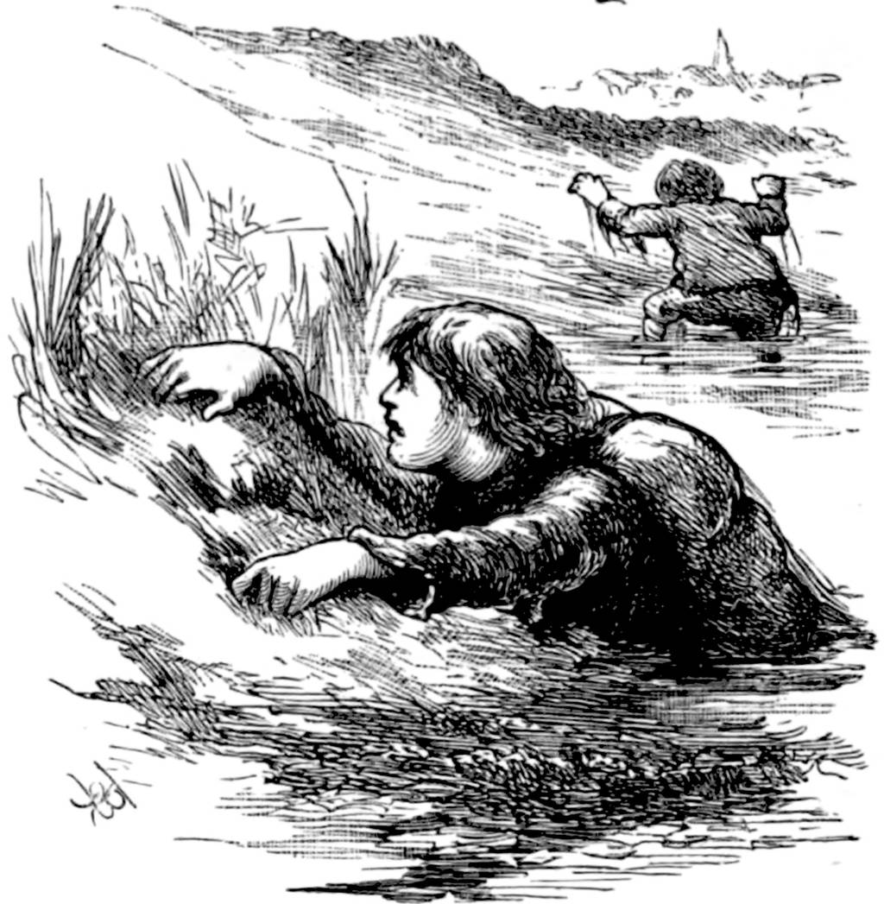

ᎾᏍᎩᏃ ᎯᎠ ᎦᏍᎩᏓᏍᎬ ᎦᏥᎪᎥᎩ, ᎤᏂᏍᏆᏛ ᎯᎠ ᎠᎾᎵᏃᎮᏍᎬᎢ, ᎿᏉ ᎾᎥᏂᏳ ᎤᏂᎷᎸ ᏝᏬᏚᎯ ᎥᏓᎸᎢ, ᎾᏍᎩ ᎯᎠ
ᎢᎾᎨ ᏧᏩᎫᏗ: ᎠᎴᏃᎾ ᏄᎾᏁᎸᎾ ᎠᎾᎢᏒᎩ, ᎢᏧᎳ ᎤᎵᏍᏗᏳ ᎥᏓᎸ ᏫᏚᏂᎬᏨᎩ. ᎾᏍᎩᏃ ᎯᎠ ᏝᏬᏚᎯ ᎥᏓᎸ
ᎠᎵᎲᏲᎵᎵᎯᏍᏗᏱ, ᏚᏙᎥ. ᎠᏂᏃ, ᎾᏍᎩ ᎢᏳᏍᏗ, ᎪᎯᏗᏳ ᏚᎾᏛᎩᎶᎥᎩ, ᎠᎴ ᎤᏂᏆᏘᏍᏗᏳ
ᏚᏂᏝᏬᏔᎶᏨᎩ; ᏧᏁᎶᏗᏃ, ᎦᎨᏛ ᎠᎵᏎᎲ ᏂᎦᎵᏍᏙᏗᏍᎬᎩ, ᎿᏉ ᎤᎴᏅᎲ ᎦᏃᏴᎬ ᏝᏬᏚᎯ.

Now I saw in my Dream, that just as they had ended this talk, they drew
near to a very miry *Slough*, that was in the midst of the plain ; and
they, being heedless, did both fall suddenly into the bog. The name of
the slough was *Dispond*. Here therefore they wallowed for a time, being
grievously bedaubed with the dirt; and Christian, because of the Burden
that was on his back, began to sink in the mire.

ᎤᏬᎯᏳᎯᏍᏛᏃ ᎯᎠ ᏄᏪᏒᎩ, Ꭱ, ᏗᏣᏁᎶᏗ ᎩᎾᎵᎢ ᎭᏢ ᏂᏣᏛᎿᏕᎦ?

Pli. Then said *Pliable*, Ah Neighbor
*Christian*, where are you now?

ᏧᏁᎶᏗ. ᎤᏙᎯᏳᎯᏯ, ᎤᏛᏅ ᏧᏁᎶᏗ, ᎥᏝ ᏱᏥᎦᏔᎭ.

Chr. Truly, said *Christian*, I do not
know.

ᎾᏍᎩᏉ ᎯᎠ ᎿᏉ ᎤᎿᎸᏨ ᎤᏬᎯᏳᎯᏍᏛ, ᎤᎿᎸᎯᏳ ᎨᏒ ᎯᎠ ᏄᏪᏎᎸ ᎠᏁᎯ, ᎾᏍ ᎩᏍᎪ ᎯᎠ ᏄᏍᏗ ᎣᏍᏛ ᎠᏕᏗᏱ ᎯᎠ
ᏥᏂᎪᎯᎩ ᏥᏍᎩᏃᎮᎮᎲᎩ? ᎾᏍᎩᏉ ᏱᏄᏍᏗ ᎯᎠ ᏥᏄᏍᏗ ᎥᏂᎩᏍᎬᎢ, ᎦᏙᏍᎩᏉ ᎤᏍᏗ ᎡᎵᏍᏗᏉ ᏂᎦᎵᏍᏗᎭ ᎾᎿ
ᏫᎦᏅᏅᎢ? ᎢᏳᏃ ᎬᏆᏚᎩᏍᏗ ᎨᏎᏍᏗ ᎦᎬᏃᏛ, ᏨᏒ ᏣᏤᎵ ᏂᎦᎵᏍᏔᏅ ᏦᏒ ᏩᏕᏗᏱ. ᎠᎴ ᎿᏉ ᎤᎴᏅᎲ
ᏔᎵᎭ ᎬᏍᎦᎢᏍᏓᎩ ᏄᏛᏁᎸᎩ, ᎠᎴ ᏧᏪᏅᏒ ᎢᏗᏢ ᎤᏚᎩᏍᏔᏅ ᏝᏬᏚᎯ; ᎠᎴ ᏅᎦᏯᎢᏒᎢ, ᏧᏁᎶᏗᏃ ᎥᏝ ᎿᏉ ᎣᏂ
ᏳᎪᎮᎢ.

Pli. At that *Pliable* began to be
offended, and angerly said to his fellow, Is this the happiness you have
told me all this while of? If we have such ill speed at our first
setting out, what may we expect ’twixt this and our Journey’s end? May I
get out again with my life, you shall possess the brave Country alone
for me. And with that he gave a desperate struggle or two, and got out
of the mire on that side of the Slough which was next to his own house:
so away he went, and Christian saw him no more.

ᎾᏍᎩᏃ ᎢᏳᏍᏗ ᏧᏁᎶᏗ ᎠᎬᏕᏨ, ᎤᏩᏒᎯᏳ ᏓᎵᎷᏆᏕᏏᏙᎲ ᎥᏓᎸ ᎠᎵᎲᏲᎵᎵᎯᏍᏗᏱ: ᎠᏎᏃ ᎠᏟᏂᎬᏁᎮ ᏩᎦᏛ ᎢᏗᏢ
ᏭᏚᎩᏍᏙᏗᏱ, Ꭰ ᎤᏍᏗ ᎦᎶᎯᏍᏗᏱ ᏗᎪᏢᏒ ᎢᏗᏢ; ᎾᏍᎩ ᎯᎠ ᏄᏛᏁᎴᎢ, ᎠᏎᏃ ᎥᏝ ᎬᏩᏚᎩᏍᏗ ᏱᏄᎵᏍᏔᏁ
ᏂᎦᎵᏍᏙᏗᏍᎨ ᎠᎵᏎᎲᎢ: ᎠᏎᏃ ᎦᏍᎩᏓᏍᎬ ᏥᎪᎥᎩ, ᎠᏍᎦᏯ ᎤᎷᏤᎸᎩ, ᎠᏓᏍᏕᎵᏍᎩ ᏧᏙᎢᏛ, ᎠᎴ ᎤᏛᏛᏅᎩ
“ᎦᏙᏉ ᎠᏂ ᎭᏛᏁᎭ?”

Wherefore Christian was left to tumble in the Slough of *Dispond* alone;
but still he endeavoured to struggle to that side of the Slough that was
still further from his own house, and next to the Wicket-gate; the which
he did, but could not get out, because of the Burden that was upon his
back: But I beheld in my Dream, that a man came to him, whose name was
*Help*, and asked him, “What he did there?”

# ᎠᏓᏍᏕᎵᏍᎩ

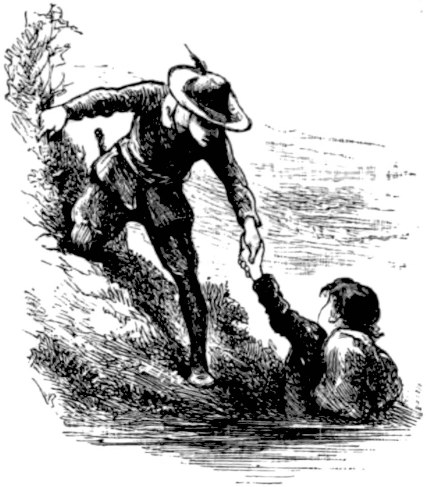

ᏧᏁᎶᏗ. ᎰᏩᏉ, ᎤᏛᏅᎩ ᏧᏁᎶᏗ, ᎠᎵᏣᏙᏂᏙᎯᏍᎩᏂ ᎠᏃᏎᎰ ᎠᎩᏁᏤᎸ ᎠᏂ ᏅᏛᎩᎶᎯᏍᏗᏱ, ᎠᎴ ᏩᏆᏎᎮᎸ Ꮎ ᎤᏍᏗ
ᎦᎶᎯᏍᏗᏱ ᏨᏗᎪᏢᎭ, ᎾᏍᎩᏃ ᏰᎵ ᎦᏥᏯᏗᏫᏎᏗ ᎢᏳᎵᏍᏙᏗᏱ ᎤᏔᎳᏬᎯᏍᏗ ᎤᎷᎯᏍᏗ ᏥᎩ. ᎾᏍᎩᏃ ᎦᎢᏒᎢ ᎠᏂ
ᎠᎩᎬᏥᎸᎩ.

Chr. Sir, said Christian, I was bid go
this way by a man called Evangelist, who directed me also to yonder
Gate, that I might escape the wrath to come; and as I was going thither,
I fell in here.

ᎠᏓᏍᏕᎵᏍᎩ. ᎦᏙᏃ ᎥᏝ ᏗᎳᏏᏅᏍᏗᏱ ᏱᏣᎦᏖᏃᎴᎢ.

Help. But why did you not look for the
steps?

ᏧᏁᎶᏗ. ᎦᎾᏰᎯᏍᏗᏍᎩᏂ ᎨᏒ ᎠᏍᏓᏱᏳ ᎠᎩᎨᎯᏒᎩ, ᎾᏍᎩ ᎠᏂᏗᏢ ᎠᏆᎵᏘᏍᏔᏅ, ᎾᏍᎩ ᎠᎩᎬᏨᎩ.

Chr. Fear followed me so hard, that I
fled the next way, and fell in.

ᎠᏓᏍᏕᎵᏍᎩ. ᎯᎠᏃ ᏄᏪᏎᎸᎩ, ᎡᎭᏙᏯᏅᎯᏓ, ᎠᎴ ᏭᏙᏯᏅᎯᏛᎩ, ᎠᎴ ᎤᏩᎩᏒᎩ, ᎠᎴ ᎠᏍᏓᏲᎯ ᎦᏙᎯ ᎤᏪᎧᏅᎩ,
ᎠᎴ ᎨᎭᎢᏎᏍᏗ ᎤᏬᏎᎸᎩ.

Help. Then said he, *Give me thy hand*:
so he gave him his hand, and he drew him out, and set him upon sound
ground, and bid him go on his way.

ᎿᏉᏃ ᎤᏓᏛᎩᏛ ᏗᎦᏙᎬ ᏩᎩᎷᏥᎸᎩ, ᎯᎠ ᏂᏥᏪᏎᎸᎩ, Ꭷ, ᎠᏂ ᎠᏎ ᎦᎶᎯᏍᏗ ᏥᎩ, ᎠᏲᎱᏍᎩ ᏗᎦᏚᎲ ᏅᏓᎦᎶᏒᎯ,
ᎾᏃ ᎤᏍᏗ ᎦᎶᎯᏍᏗᏱ ᏗᎪᏢᏒ ᏮᎦᏛᎢ, ᎦᏙᏃ ᎦᎵᏍᏙᏗᎭ, Ꮭ ᎪᏢᎯᏌᏅᎯ ᏱᎩ ᎠᏂ, ᎾᏍᎩᏃ ᎤᏲ ᎢᏳᎾᏛᎿᏕᎩ
ᎠᏁᏙᎯ ᏅᏩᏙᎯᏯᏛ ᎤᏂᎶᎯᏍᏗᏱ?” ᎯᎠᏃ ᎾᎩᏪᏎᎸᎩ, “ᎯᎠᏍᎩᏂ ᏝᏬᏚᎯ ᏥᎩ ᎥᏝ ᏰᎵ ᎦᎪᏢᎯᏐᏗ ᏱᎩ:
ᎠᏂᏍᎩᏂ ᎤᏅᏪᎥ ᎾᏍᎩ ᏂᎪᎯᎸ ᎤᏪᏯᏗᏍᏗ ᎤᎩᏓᏜᏛᎯ ᎠᎴ ᎦᏓᎭ ᏗᏓᎴᎲᏍᎦ ᎤᏍᎦᏅᏨᎯ ᎨᏒ ᎤᎪᏩᏛᏗ
ᏂᎦᎵᏍᏗᏍᎬᎢ, ᎠᎴ ᎾᏍᎩ ᏂᎦᎵᏍᏙᏗ ᎠᎵᎲᏲᎵᎵᎯᏍᏗᏱ ᎥᏓᎸ ᏥᏚᏙᎥ; ᎢᏳᏰᏃ ᎤᏍᎦᏅᏨᎯ ᎤᎪᎯᎯᏍᏗ
ᏂᎦᎵᏍᏔᏂᎦ ᎤᏓᎴᎾᏍᏗᏉ ᎢᏗᏢ ᎨᏒ ᏄᏛᎿᏕᎬᎢ, ᎿᏉ ᎤᏓᏅᏙᎩᎯ ᏗᏓᎴᎲᏍᎪ ᎦᎾᏰᎯᏍᏗ ᎠᎴ ᎤᏜᏏᏛᎡᎯ,
ᎠᎴ ᎠᎵᎲᏲᎵᎯ ᏄᎵᏍᏓᏁᎰ ᏧᏓᏅᏛᎢ, ᎾᏍᎩᏃ ᎯᎠ ᏂᎦᏗ ᏓᏜᏍᏔᏂᏙᎲᎢ, ᎠᎴ ᎾᏍᎩ ᎠᏂ ᎠᏓᏟᏌᏂᎯᎰᎢ: ᎾᏍᎩᏃ
ᏂᎦᎵᏍᏙᏗ ᏥᏄᏲᎢᏴ ᎠᏂ ᎦᏙᎯ.

Then I stepped to him that pluckt him out, and said, Sir, wherefore,
since over this place is the way from the City of *Destruction* to
yonder Gate, is it that this place is not mended, that poor travellers
might go thither with more security? And he said unto me, This miry
Slough is such a place as cannot be mended; it is the descent whither
the scum and filth that attends conviction for sin doth continually run,
and therefore it is called the Slough of *Dispond*; for still as the
sinner is awakened about his lost condition, there ariseth in his soul
many fears and doubts, and discouraging apprehensions, which all of them
get together, and settle in this place: And this is the reason of the
badness of this ground.

“ᎥᏝᏍᎩᏂ ᎤᏏᏳ ᏳᏰᎸᎭ ᎤᎬᏫᏳᎯ ᎾᏍᎩ ᎯᎠ ᏥᏄᏲᎢᏴ. ᎠᎴ ᎾᏍᏉ ᎪᎱᏍᏗ ᎬᏩᏛᏁᎯ, ᏗᎧᎿᏩᏗᏙᎯ ᏧᏁᏤᎸᎯ,
ᎾᏍᎩ ᎤᏙᎯᏳᎯ ᏩᏍᏛ ᎦᎸᏉᏗ ᏤᎭ ᎤᏤᎵᎦ, ᎿᏉ ᏔᎳᏚ ᎢᏯᏍᎪᎯᏧᏈ ᎾᏕᏘᏴ ᎬᏩᎾᎴᏅᏛ ᏚᏂᎸᏫᏍᏓᏁ ᎯᎠ
ᎦᏙᎯ, ᎣᏍᏛ ᎢᏳᏅᏁᏗᏱ ᎠᎾᏟᏂᎬᏁᎲᎢ: ᎠᎴᏃᎾᎢ: ᎠᏋᏒ ᏥᎦᏔᎭ,” ᎤᏛᏅᎩ, “ᎠᏂ ᏔᎳᏍᎪᎯ ᎢᏯᎦᏴᎵ ᏓᏆᎴᎷ
ᎢᏯᎧᎵᎢ ᎤᏃᏴᏥᎸ, ᎠᎴ ᎥᏝ ᎾᏍᎩᏉ ᏱᏂᎦᎥ, ᎢᎸᏍᎩᏍᎩᏂ ᎢᏳᏆᏗᏅᏛ ᎢᎦᎢ (ᎤᏃᏴᏥᎸ) ᎣᏍᏛ ᎨᎨᏲᏅᎯ ᎨᏒᎢ,
ᎾᏍᎩ ᏂᎪᎯᎸ ᎠᎴ ᏂᎬᎾᏛ ᎤᎬᏫᏳᎯ ᎤᏤᎵᎪᎯ ᏅᏓᏳᏴᏍᏔᏅᎯ, ᎨᎨᏲᏙᎢ ᎨᏒᎢ (ᎠᎴᏃᎾ ᎠᏂᎦᏔᎯ, ᎯᎠ
ᎾᏂᏪᏍᎪᎢ, ᎾᏍᎩ ᎤᏅᏒ ᎣᏏ ᎢᎬᏩᏅᏁᏗ ᎦᏙᎯ ᎠᎴ ᎦᎶᎯᏍᏗᏱ, ᎠᎾᏗᏍᎪᎢ,) ᎢᏳᏃᎾ ᏰᎵ
ᎦᎪᏢᎯᏐᏗ ᏱᎩ; ᎠᏎᏃᎾ ᎠᏏᏉ ᎠᎵᎲᏲᎵᎵᎯᏍᏗᏱᏉ ᎢᎩ; ᎠᎴᏃ ᏅᏩᏍᏕᏍᏗᏉ ᎢᏳᏃ ᏂᎦᎥ ᎢᎬᏩᎾᏛᏁᏗ
ᎢᏳᎾᏛᏁᎸᎯ ᎨᏎᏍᏗ.

It is not the pleasure of the King that this place should remain so bad.
His labourers also have, by the direction of His Majesties Surveyors,
been for above these sixteen hundred years imployed about this patch of
ground, if perhaps it might have been mended: yea, and to my knowledge,
said he, here hath been swallowed up at least twenty thousand
cart-loads, yea, millions of wholesome instructions, that have at all
seasons been brought from all places of the King’s dominions (and they
that can tell say they are the best materials to make good ground of the
place), if so be it might have been mended, but it is the Slough of
*Dispond* still, and so will be when they have done what they can.

“ᎤᏙᎯᏳᏍᎩᏂᏃᏅ, ᏗᎧᎿᏩᏛᏍᏗ ᎤᏍᎪᎸᏔᏅᎯ ᎤᏁᏨᎯ, ᏕᎪᏢ ᎣᏏ ᎠᎴ ᏧᎵᏂᎩᏗ ᏗᎳᏏᏅᏍᏗᏱ, ᎠᏰᎵ ᎦᏅᏃᏗ ᎾᏍᎩ
ᎯᎠ ᎥᏓᎸᎢ; ᎠᏎᏃᎾ ᎢᎸᎯᏳ ᎤᏣᏙ ᎤᏲᎢ ᏓᎵᏍᏗᏍᎪᎢ, ᎠᏗᎾ ᎥᏝ ᎠᎯᏛ ᏗᎬᎪᏩᏛᏗ ᏱᎩ ᏗᎳᏏᏅᏍᏗᏱ; ᎠᎴᏃ
ᏗᎬᎪᏩᏛᏗ ᏱᎩ, ᏴᏫ ᏧᎾᎸᏕᏍᏙᏗᏍᎩ ᎨᏒ ᏂᎦᎵᏍᏙᏗᏍᎪ, ᎤᏣᏘᏂ ᎤᎾᎳᏏᏃᎢ, ᎠᎴ ᎠᏂᏝᏬᏔᎶᎪᎢ, ᎠᏎᏃᎾ
ᏕᎪᏢᏒ ᏗᎳᏏᏅᏍᏗᏱ. ᎠᏗᎾ ᎿᏉ ᎣᏏᏳ ᎦᏙᎯ ᎢᏳᏃ ᎦᎶᎯᏍᏗᏱ ᎤᏂᏴ ᏍᏔᏅᎯ ᏥᎨᏐ.”

True, there are by the direction of the Lawgiver, certain good and
substantial steps, placed even through the very midst of this Slough;
but at such time as this place doth much spue out its filth, as it doth
against change of weather, these steps are hardly seen; or if they be,
men through the dizziness of their heads, step besides; and then they
are bemired to purpose, notwithstanding the steps be there; but the
ground is good when they are once got in at the Gate.

# ᎤᏬᎯᏳᎯᏍᏛ

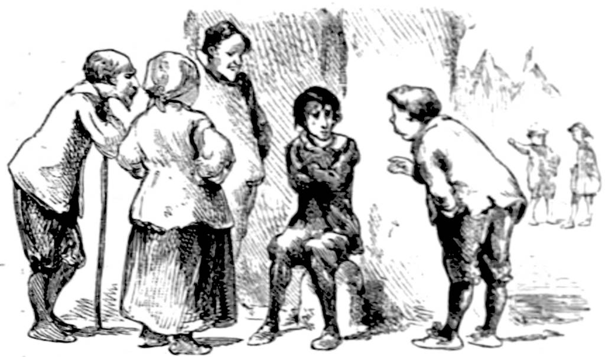

ᎿᏉᏃ ᎥᏥᎪᎥᎢ ᎦᏍᎩᏓᏍᎬᎢ, ᎾᏍᎩ ᎿᏉ ᎤᏬᎯᏳᎯᏍᏛ ᏭᎷᏦᏅ ᏧᏪᏅᏒᎢ. ᎿᏉᏃ ᎾᎥᎢ ᎢᏳᎾᏓᎵ ᎬᏩᏩᏛᎯᎸᎩ; ᎢᎦᏛ
ᎯᎦᏔᎿᎢᏳ ᎯᏍᎦᏯ ᏨᏛᎠᏨᎾ ᎬᏬᏎᎰᎢ; ᎢᎦᏛᏃ ᎤᏁᎫᏉ ᎤᎾᏰᎯᏍᏗᏳ ᏥᏄᏛᏁᎸ ᏧᏍᏓᏩᏛᏒ ᏧᏁᎶᏗ ᎢᎬᏬᏎᎰᎢ:
ᎢᎦᏛᏃ ᎬᏩᏐᏢᎢᏍᏗᏍᎪᎢ ᏭᏍᎦᎵᎸᎢᏉ; ᎯᎠ ᏂᎬᏩᏪᏎᎰᎢ, “ᎦᏳᎳ ᏣᏂᎩᏛ ᏥᎨᏒ ᏱᏂᎬᏩᏕᎰᎯᏍᏗᏉ
ᏳᏫᎦᏴᎵᎲᏲᎵᎭ ᎤᏍᏗᏉ ᏧᏓᎴᏅᏛ ᏱᏃᎵᏍᏓᏁᎵᏕᎭ\!” ᎾᏍᎩᏃ ᎤᏬᎯᏳᎯᏍᏛ ᎤᏕᎰᏐᏅᎯ ᎤᏬᎶ ᎠᏂᏅᎢ.
ᎠᏎᏃ ᎿᏉ ᏂᎦᎥ ᎤᎦᎵᏍᏙᏒ, ᎿᏉ ᎤᏂᏁᏟᏴᏒ ᎠᏂᏬᏂᏍᎬᎢ, ᎿᏉ ᎤᎾᏕᎰᏔᏅ ᏧᏁᎶᏗ. ᎾᏍᎩ ᎯᎠ ᏂᎦᎥ
ᏄᏛᏁᎸ ᎤᏬᎯᏳᎯᏍᏛ.

Now I saw in my Dream, that by this time *Pliable* was got home to his
house again. So his Neighbors came to visit him: and some of them called
him neighbors wise man for coming back, and some called him fool for
hazarding himself with Christian: others did mock at his cowardliness;
saying, Surely since you began to venture, I would not have been so base
to have given out for a few difficulties. So *Pliable* sat sneaking
among them. But at last he got more confidence, and then they all turned
their tales, and began to deride poor *Christian* behind his back. And
thus much concerning *Pliable*.

# ᎡᎶᎯ-ᎡᎯ-ᎠᎦᏔᎿᎢ

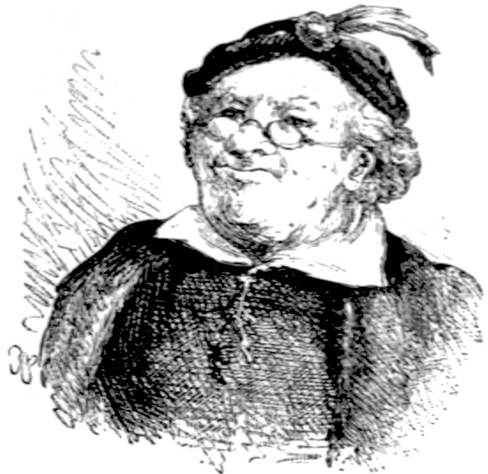

ᎿᏉᏃ ᏧᏁᎶᏗ ᎤᏩᏒᎯᏲᏨᎯ ᎢᎾᎨ ᎠᎢᏒᎢ, Ꭸ ᎢᏴᏛ ᎩᎶ ᏭᎪᎲ ᏠᎨᏏ ᏚᎾᏗᎢᏏᏗᏒ ᏙᏓᏳᏠᏏᏒᎩ; ᎠᎴ ᏕᎦᎾᏗᎢᏍᎬ
ᏅᏃᎯ ᏧᎾᏠᎯᏍᏗ ᏂᎦᎵᏍᏗᏍᎬᎩ. ᎾᏍᎩᏃ ᎠᏍᎦᏯ ᏥᏕᎤᎾᏠᏎ ᎡᎶᎯ-ᎡᎯ-ᎠᎦᏔᎿᎢ ᏕᎤᏙᎥᎩ: ᎠᎴ ᎡᎶᎯ
ᎠᏓᏅᏖᎵᏓᏍᏗ ᎦᏚᎲ ᎡᎯ ᎨᏒᎩ, ᎤᏣᏘ ᎡᏉᎯᏳ ᎦᏚᎲᎢ, ᎠᎴ ᎾᏍᏉ ᎤᎶᏗᏢᏉ (ᎦᏚᎭ) ᏧᏁᎶᏗ
ᏧᏓᎴᏅᎢ. ᎾᏍᎩᏃ ᎯᎠ ᎠᏍᎦᏯ ᏚᎾᏠᏒ ᏧᏁᎶᏗ, ᎠᎴ ᎤᏍᏗᎩᏛ ᎤᎦᏔᎯ ᏂᎨᏐᎢ, (ᎾᎯᏳᏰᏃ ᏧᏁᎶᏗ ᎤᏂᎩᏍᏗ
ᏄᎵᏍᏔᏅ ᎠᏲᎱᏍᎩᏱ ᎤᏣᏛ ᎤᏂᏃᎮᎵᏓᏍᏗ ᏄᎵᏍᏔᏅᎩ, ᎥᏝ ᎤᏩᏒᏉ ᎤᏪᏚᎲ ᎤᏩᏒ ᎤᏂᏃᎮᎵᏓᏍᏗ ᏱᏄᎵᏍᏔᏁᎢ,
ᎾᏍᏉᏍᎩᏂ ᎢᏴᏛ ᏕᎦᏚᎲ ᎤᏂᏃᎮᎵᏓᏍᏗ ᏄᎵᏍᏔᏅᎩ); ᎾᏍᎩᏃ ᎢᏳᏍᏗ, ᎡᎶᎯ ᎡᎯ ᎠᎦᏔᎿᎢ, ᎬᏁᎳᎩ ᎤᏬᎵᎬ,
ᏂᎦᎥᏉ ᎠᎵᏂᎬᏁᎲ ᎠᎢᏒᎢ, ᎠᎴ ᎤᏕᎶᎰᏒ ᏂᎦᎥ ᏚᏯᏪᎬᎢ ᎠᎴ ᎤᎵᏰᏗᏍᎬᎢ, ᎠᎴ ᎾᏍᎩ ᎢᎬᏩᏍᏗᏓᏂ,
ᎿᏉ ᎤᎴᏅᎲ ᎤᎵᏃᎮᏔᏅ ᏧᏁᎶᏗ.

Now as *Christian* was walking solitary by himself, he espied one afar
off come crossing over the field to meet him; and their hap was to meet
just as they were crossing the way of each other. The gentleman’s name
that met him was *Mr. Worldly Wiseman*: he dwelt in the Town of *Carnal
Policy*, a very great Town, and also hard by from whence *Christian*
came. This man then meeting with *Christian*, and having some inkling of
him, — for *Christian*’s setting forth from the City of *Destruction*
was much noised abroad, not only in the Town where he dwelt, but also it
began to be the towntalk in some other places, — Master *Worldly
Wiseman* therefore, having some guess of him, by beholding his laborious
going, by observing his sighs and groans, and the like, began thus to
enter into some talk with *Christian*.

ᎡᎶᎯ-ᎡᎯ-ᎠᎦᏔᎿᎢ. ᎦᏙ ᎬᏩᏍᏗ ᎪᎯ, ᎩᎾᎵᎢ, ᎭᏢ ᏫᎦᏘ ᏂᎦᎥ ᏕᏣᏣᏪᎢᏍᏗᏗ?

World. How now, good fellow, whither away
after this burdened manner?

ᏧᏁᎶᏗ. ᎤᏙᎯᏳᎯᏯ ᏓᏆᏣᏪᎢᏍᏗᏗ, ᎠᎴ ᎥᏝ ᎩᎶ ᎤᏗᏢ ᎢᎦᎢ ᏱᏙᎬᏩᏣᏪᎢᏍᏔᏂᏙᎶᎢ\! ᎠᎴ ᎾᏍᎩ ᏥᏍᏆᏛᏛᎲᎦ
ᏫᏥᎦᏛᎢ? ᏓᎬᏃᏁᎵᏉ, ᎾᏍᎩᏂ ᎤᏍᏗ ᎦᎶᎯᏍᏗᏱ ᏗᎪᏢᏒ ᏫᏥᎦᏘ; ᎥᎩᏃᏁᎸᏰᏃ, ᎾᎿᏉ ᏓᏴᎩᏃᏁᎵ
ᎢᏯᏆᏛᏁᏗᏱ ᎠᎩᏰᏅᏙᎠᎯᏍᏗᏱ ᎯᎠ ᎦᎨᏛ ᏥᎦᎵᏎᎭ.

Chr. A burdened manner indeed, as ever I
think poor creature had. And whereas you ask me, Whither away? I tell
you, Sir, I am going to yonder Wicket-gate before me; for there, as I am
informed, I shall be put into a way to be rid of my heavy Burden.

ᎡᎶᎯ-ᎡᎯ-ᎠᎦᏔᎿᎢ. ᏥᎪ ᏣᏓᎵᎢ ᎠᎴ ᏗᏤᏥ ᎠᏁᎭ?

World. Hast thou a Wife and Children?

ᏧᏁᎶᏗ. ᎥᎥ; ᎠᏎᏃ ᏂᎦᎥᏉ ᎦᎨᏗ ᎦᎵᏎᎲ, ᎥᏝ ᏰᎵ ᎣᏍᏛ ᎬᏆᏓᏅᏓᏗᏍᏗ ᎠᏁᎲ ᏱᏂᎦᎵᏍᏗᏍᎪᎢ ᎪᎯ:
ᎾᏁᎲᎾᏉᏰᏃ ᏱᎩ ᎢᏳᏍᏗ ᎾᏆᎵᏍᏓᏁᎰ ᎦᏓᏅᏖᏍᎬᎢ.

Chr. Yes, but I am so laden with this
Burden, that I cannot take that pleasure in them as formerly; methinks I
am as if I had none.

ᎡᎶᎯ-ᎡᎯ-ᎠᎦᏔᎾᎢ. ᏥᎪ ᏱᏍᏆᏛᏓᏍᏓᏏᏉ ᎢᏳᏃ ᏱᎬᏬᏁᏔᏅ?

World. Wilt thou hearken to me if I give
thee counsel?

ᏧᏁᎶᏗ. ᎢᏳ ᎣᏍᏛ ᏱᎩ, ᏱᎬᏯᏛᏓᏍᏓᏏᏉ; ᎤᏣᏘᏰᏃ ᎠᎩᏂᎬᏎ ᎣᏍᏛ ᎥᎩᏬᏁᏙᏗᏱ.

Chr. If it be good, I will; for I stand
in need of good counsel.

ᎡᎶᎯ-ᎡᎯ-ᎠᎦᏔᎿᎢ. ᎯᎠᏍᎩᏂ ᏄᏍᏗ ᏱᎬᏁᏥ, ᏄᎳᏉ ᏣᏚᎦ Ꮎ ᏣᎵᏎᎭ; ᎥᏝ ᏙᎯᏱ ᏴᎦᎭᏓᏅᏓᏓ ᎬᏂ ᎾᏍᎩ
ᏱᏂᏣᏛᏁᎸ: ᎠᎴ ᎥᏝ ᎣᏍᏛ ᏣᏓᏅᏓᏗᏍᏗ ᏴᎦᎯᏩᏛ ᎤᏁᎳᏅᎯ ᎤᏍᎪᎸᏔᏅ ᎪᎱᏍᏗ ᎲᏗᏍᎬᎢ;

World. I would advise thee then, that
thou with all speed get thyself rid of thy Burden; for thou wilt never
be settled in thy mind till then; nor canst thou enjoy the benefits of
the blessing which God hath bestowed upon thee till then.

ᏧᏁᎶᏗ. ᎾᏍᎩ ᎠᏗᏃᏅ ᎠᎩᏲᎭ, ᎾᏍᎩ ᎠᎩᏰᏅᏙᎠᎯᏍᏗᏱ ᎯᎠ ᎦᎨᏛ ᏥᎦᎵᏎᎭ: ᎥᏝᏍᎩᏂᏃ ᎠᏋᏒᏉ ᏰᎵ ᎬᏆᏰᏅᏕᏍᏗ
ᏱᎩ, ᎠᎴ ᎾᏍᎪ ᎥᏝ ᎩᎶ ᏰᎭ ᎠᏴ ᏗᏆᏓᎴᏅ ᎾᏍᎩ ᏰᎵ ᎬᎩᏰᏅᏕᏍᏗ; ᎾᏍᎩᏰᏃ ᎢᏳᏍᏗ ᎠᏂ ᏫᏥᎦᏗ, ᏥᎬᏲᏎᎸᎩ,
ᎠᎩᏰᏅᏙᎠᎯᏍᏗᏱ ᎠᏆᏚᎵᏍᎬᎢ.

Chr. That is that which I seek for, even
to be rid of this heavy Burden; but get it off myself, I cannot; nor is
there any man in our country that can take it off my shoulders;
therefore am I going this way, as I told you, that I may be rid of my
Burden.

ᎡᎶᎯ-ᎡᎯ. ᎦᎪ ᏣᏁᏤᎴ ᎠᏂ ᏣᎶᎯᏍᏗᏱ ᎾᏍᎩ ᏣᏰᏅᏙᎠᎯᏍᏗᏱ ᏣᏩᏛᏗᏱ?

World. Who bid thee go this way to be rid
of thy Burden?

ᏧᏁᎶᏗ ᎠᏍᎦᏯ ᎣᏍᏛ, Ꮀ ᎤᏣᏘ ᎠᏥᎸᏉᏗᏳ ᎠᏓᏅᏖᏗᏱ: ᎠᎵᏣᏙᏂᏙᎯ ᎠᎩᏰᎸ ᏚᏙᎥ.

Chr. A man that appeared to me to be a
very great and honorable person; his name as I remember is *Evangelist*.

ᎡᎶᎯ-ᎡᎯ. Ᏺ, ᏄᏍᏗᎩ ᏣᏬᏁᏔᏅ\! ᎥᏝ ᎠᏏ ᎦᏙ ᏱᎬᏩᏍᏗ ᎤᏟ ᎤᎾᏰᎯᏍᏗ ᎠᎴ ᎤᏕᏯᏙᏗ ᎦᎶᎯᏍᏗᏱ ᏱᎦᎩ ᎾᏍᎩ
ᎯᎠ ᎠᏂ ᏨᏗᏣᏎᎮᎸ; ᎠᎴ ᏔᏕᎶᎰᏏ, ᎾᏍᎩ ᏣᏬᏁᏔᏅ ᎢᎯᏍᏓᏩᏕᏒᎭ.

World. I beshrew him for his counsel;
there is not a more dangerous and troublesome way in the world than is
that unto which he hath directed thee; and that thou shalt find, if thou
wilt be ruled by his counsel.

ᎠᎴ ᎦᏙᎴᎣᏍᎦ ᎦᏳᎳ ᎪᎱᏍᏗ ᏣᎵᏍᏓᏁᎵᏙᎸᎢ; ᎢᏥᎪᏩᏗᏰᏃ ᎦᏳᎳ ᏝᏬᏔ ᎢᏣᏓᏅᎵᏰᎥ ᎠᎵᎲᏲᎵᎵᎯᏍᏗᏱ ᎤᏕᏅᎯ;
ᎠᏗᎾ ᎾᎿ ᏝᏬᏚᎯ ᏧᏩᎫᏗ ᎠᏓᎴᏂᏍᎬᏉ ᎤᏲ ᎤᎾᏓᏅᏓᏗᏍᏗᏱ ᎨᏒ ᎾᏍᎩ ᎾᎿ ᎦᎶᎢᏍᏗ ᎠᏂᏴᏍᏗᏍᎩ; ᎯᎠᏍᎩᏂ
ᏄᏍᏗ ᏙᏓᏣᏠᏏᏙᎵ ᎭᎢᏒᎢ, ᏧᏯᏪᎢᏍᏗ, ᎠᎩᎵᏯ, ᎠᎪᏄ, ᎤᎾᏰᎯᏍᏗ ᎠᏓᏅᏓᏗᏍᏗ, ᎣᏰᎸᎭᎢ, ᎭᏰᎳᏍᏗ-ᎦᏅᎯᏛ,
ᏢᏓᏥ-ᏣᏁᏆ, ᎢᎾᏛ-ᎠᎾᎵ-ᏫᏍᏗᏍᎩ, ᎤᎵᏏᎩ, ᎠᎴ ᎯᎠᏉ ᏱᏂᎦᏪᏒ, ᎠᏲᎱᏍᎩ ᎠᎴ ᎾᏍᎩᏉ ᎢᎬᏩᏍᏗᏓᏂ
ᏘᏩᏛᏔᏂᏙᎵ\!

Thou hast met with something (as I perceive) already; for I see the dirt
of the Slough of *Dispond* is upon thee; but that Slough is the
beginning of the sorrows that do attend those that go on in that way:
Hear me, I am older than thou; thou art like to meet with, in the way
which thou goest, Wearisomeness, Painfulness, Hunger, Perils, Nakedness,
Sword, Lions, Dragons, Darkness, and in a word, Death, and what not\!

ᎯᎠᏍᎩᏂ ᏥᎬᏃᏁᎭ ᎤᏙᎯᏳᎯᏯ, ᎤᏂᏣᏔ ᎬᏂᎨᏒ ᎢᏳᏅᏁᎸᎯ. ᎦᏙᏃ ᏱᎦᎵᏍᏙᏗ ᏱᏂᎦᎥᏉ ᏴᏓᏓᎡᎦ, ᎠᎴ ᏴᏛᏓᏍᏓᏁ
ᏅᎦᏔᎲᎾ?

These things are certainly true, having been confirmed by many
testimonies. And why should a man so carelessly cast away himself, by
giving heed to a stranger?

ᏧᏁᎶᏗ. ᎠᏗᏃᎾ ᎯᎠ ᏥᎦᎵᏎᎭ ᎤᏟᎯᏳ ᏂᏥᎾᏰᏍᎦ ᎡᏍᎦᏉ ᏂᎦᏛ ᎯᎠ ᏥᏁᎢᏍᏔᏄᎦ; ᎠᎴ ᎥᏝ ᎪᎱᏍᏗ ᎬᎩᎾᏰᎯᏍᏗ
ᏱᎩ ᏗᏆᏠᏏᏓᏍᏗᏱ, ᎢᏳᏃ ᏫᎬᎩᏰᏅᏙᎠᎯᏍᏗ ᎢᎬᏩᎵᏍᏙᏗᏉ ᏱᎩ ᎯᎠ ᏥᎦᎵᏎᎭ.

Chr. Why, Sir, this Burden upon my back
is more terrible to me than are all these things which you have
mentioned; nay, methinks I care not what I meet with in the way, so be I
can also meet with deliverance from my Burden.

ᎡᎶᎯ-ᎡᎯ. ᎦᏙᏃ ᏧᎵᏍᏙᏔᏅ ᎾᏍᎩ ᎯᎠ ᏣᎵᏎᎭ?

World. How camest thou by thy Burden at
first?

ᏧᏁᎶᏗ. ᎯᎠᏉ ᏥᎪᎵᏰᏍᎬ ᎪᏪᎵ.

Chr. By reading this Book in my hand.

ᎡᎶᎯ-ᎡᎯ. ᎾᏍᎩᏍᎩᏂ ᏂᎨᎵᏍᎬᎩ; ᎾᏍᎩᏰᏃ ᎤᏂᏣᏔ ᏄᎾᎵᏍᏓᏁᎸ ᏗᏂᏩᎾᎦᎳ ᎤᎾᏓᏅᏖᏗᏱ ᎠᏂᏍᎦᏯ, ᎾᏍᎩ,
ᏂᎦᎵᏍᏙᏗ ᎤᎾᎵᏌᎳᏁᎲ ᎪᎱᏍᏗ ᎬᏩᏃᎵᏍᏗ ᏂᎨᏒᎾ ᎨᏒᎢ, ᎠᎴ ᎤᎵᏍᏗᏉ ᎤᎾᏁᎳᏫᏎᎯ ᏄᏅᏁᎰᎢ; ᎠᎴ
ᎾᏍᎩ ᎤᎾᏁᎳᏫᏎᎯ ᎨᏒ ᎬᏂᏳ ᏄᏅᏁᎭ, ᎠᎴᎾ ᎦᏕᎶᎣᏍᎦ ᎾᏍᎩ ᏂᎯ ᏂᏨᏁᎲᎢ, ᎠᎴ ᎬᏍᎦᎢᏍᏓᎩ ᎾᎾᏛᏁᎰ, ᎠᎴ
ᎤᏂᏲᎰ ᎪᎱᏍᏗ ᎾᏂᎦᏔᎲᎾ ᎢᏳᏍᏗ ᎨᏒᎢ.

World. I thought so; and it is happened
unto worldly thee as to other weak men, who meddling with things too
high for them, do suddenly fall into thy distractions; which
distractions do not only unman men men (as thine I perceive has done
thee), but they run them upon desperate ventures, to obtain they know
not what.

ᏧᏁᎶᏗ. ᎠᏴᏍᎩᏂ ᏥᎦᏔᎭ ᎢᏳᏍᏗ ᎠᎩᏲᎲᎢ; ᏙᎯᏱᏍᎩᏂ ᎠᏆᏓᏅᏓᏗᏍᏗᏱ ᎯᎠ ᎦᎨᏛ ᏥᎦᎵᏎᎭ ᎠᎩᏲᎭ.

Chr. I know what I would obtain; it is
ease for my heavy burden.

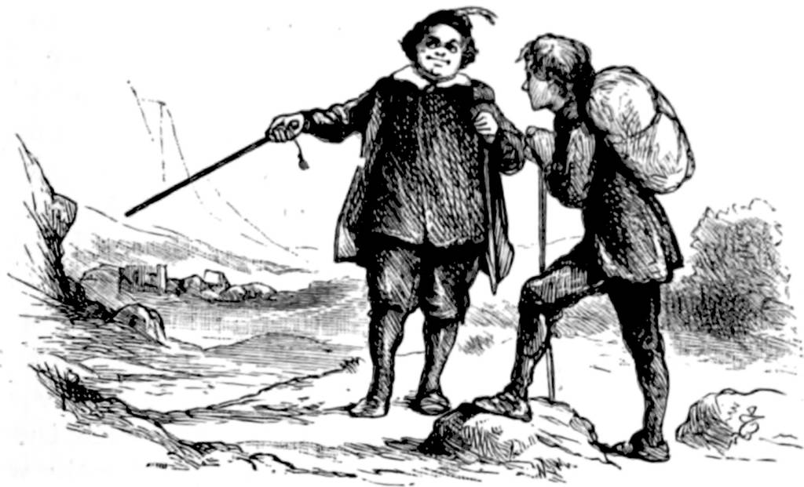

ᎡᎶᎯ-ᎡᎯ. ᎦᏙᏃ ᎠᏂ ᎢᏣᏲᎭ ᏙᎯᏱ ᏣᏓᏅᏓᏗᏍᏗᏱ, ᏂᎦᎥᏃ ᎤᎾᏰᎯᏍᏗ ᎠᏓᏅᏓᏗᏍᏗ ᎠᏩᏛᏔᏂᏓᏍᏗ ᎠᏂ ᎥᎢᏒᎢ?
ᎢᏳᏰᏃ ᏰᎵ ᎨᏣᏛᏓᏍᏙᏗ ᏱᎩ ᏱᎬᏯᏎᎯᏏ ᎢᏣᏛᏁᏗ ᏣᏩᏛᏗᏱ ᎾᏍᎩ ᏥᏣᏲᎭ, ᎠᎴ ᎥᏝ ᎾᏍᎩ ᎢᎦᎢ ᎤᎾᏰᎯᏍᏗ
ᏣᏩᏛᏔᏂᏓᏍᏗ ᏱᏅᎦᎵᏍᏓ, ᎠᎴᏃᎾ ᎡᏍᎦᏂᏳᏉ ᎡᎭ ᎤᏓᏗᏫᏍᏙᏗ. ᎠᎴᏃ ᎠᏏ ᏴᏥᏁᏉᏣ, ᎯᎠ ᏱᏅᏥᏫ, ᎯᎠ
ᎤᎾᏰᎯᏍᏗᏉ ᏣᏩᏛᏔᏂᏓᏍᏗ ᏥᏂᎦᎵᏍᏗᎭ, ᎯᎠ ᏱᏄᏍᏗ ᏱᏩᏛᏔᏂᏙᎭ, ᏙᎯᏱ, ᏣᎵᎢ, ᎠᎴ ᏙᎯᏱ ᏣᏓᏅᏓᏗᏍᏗ
ᎨᏒᎢ.

World. But why wilt thou seek for ease
this way, seeing so many dangers attend it? Especially, since (hadst
thou but patience to hear me) I could direct thee to the obtaining of
what thou desirest, without the dangers that thou in this way wilt run
thyself into; yea, and the remedy is at hand. Besides, I will add, that
instead of those dangers, thou shalt meet with much safety, friendship,
and content.

ᏧᏁᎶᏗ. ᏅᏗᎦ ᏍᎩᏃᎲᏏ.

Chr. Pray Sir, open this secret to me.

ᎡᎶᎯ-ᎡᎯ. ᎰᏩᏉ, ᎢᏢᏉᏍᎩᏂ ᏥᎦᏚᎭ (ᎠᏎ ᎣᏓᏅᏗᏉ ᏱᎩ ᏥᏚᏙᎥ) ᎾᎿ ᎡᎭ ᎣᏍᏛ ᎠᏍᎦᏯ ᏚᏳᏙᏛ-ᎢᏯᏛᏁᎯ
ᏚᏙᎥ, ᎾᏍᎩ ᎠᏍᎦᏯ ᎠᏏᎾᏌᏂᏳ, ᎠᎴ ᎣᏏᏳ ᎠᎦᏓᏅᏖᏗᏱ, ᎠᎴ ᎠᏏᎾᏏᏳ ᏧᏪᏰᏅᏕᏍᏗᏱ ᎠᏂᏍᎦᏯ ᎾᏍᎩᏯ
ᏂᎯ ᏥᏂᏨᏅ ᎢᏧᏅᎿ; ᎠᎴ ᎠᏋᏒ ᏥᎦᏔᎭ ᎤᏣᏔ ᎾᏍᎩ ᎯᎠ ᎢᏳᏍᏗ ᎣᏏᏳ ᏂᏚᏛᏁᎸ; ᎠᎴᏃ ᎤᏣᏘ ᎠᏏᎾᏌᏂᏳ
ᏧᏅᏬᏗᏱ ᏓᎾᎵᏎᎲ ᎤᏍᏗᎩᏛ ᏧᏂᎸᏃᏙᏗᏍᎩ ᏥᎨᏐᎢ. ᎾᏍᎩᏰᏃ, ᏥᎬᏲᏎᎭ, ᏱᏫᎷᏤᎸ, ᏞᎩᏳ
ᏱᏣᏍᏕᎸ. ᎥᏝ ᏑᏟᎶᏛ ᏱᎩ ᏗᎦᏁᎸᎢ; ᎠᎴᏃ ᏄᏬᎸᎾ ᏱᎩ ᎤᏩᏒ, Ꮀ ᎬᏂᎦᎵᏍᏗ ᎤᏪᏥ ᎠᏫᏅ ᎡᎭ
ᎤᏙᎵᏍᏙᏍᏛ ᏚᏙᎥ, ᎾᏍᎩᏯᏉ ᎾᏍᏉ ᎤᏛᏐᏅᎯ ᎢᎬᏩᏛᏁᏗ ᎨᏒ ᏱᎾᏛᎦ: ᎾᎿᏉᏍᎩᏂ, ᎬᏲᏎᎭ, ᏱᏣᏰᏅᏙᎠᏏᎦ;
ᎠᎴ ᎢᏳ ᎨᏣᏨᏍᏗᏉ ᏂᏣᏰᎸᏒᎾ ᏱᎩ Ꭰ ᎢᏣᏕᏅᎢ, (ᎠᎴᎾ ᎥᏝ ᏱᎤᏨᏒᏉ Ꮀ ᏱᎨᎵᎭ,) ᏳᏫᏙᎯᏯᏅᏉ ᏣᏓᎵᎢ
ᎠᎴ ᏗᏤᏥ ᏗᏂᏲᎵ ᎾᎿ ᎦᏚᎲ ᏱᏙᎭᏘᏃᎦ, ᎠᎴ ᎾᎿ ᎤᏣᏔ ᏓᏓᏁᎸ ᏧᏏᏩ, ᎠᎴ ᎥᏝ ᎦᎶᏒᏍᏔᏅᎯ
ᏱᏙᎦᏰᏣᎬᏩᎶᏓᏏ ᎭᏙᎳᏍᎬᎢ: ᎠᎴ ᎤᏣᏔᏉ ᎣᏍᏛ ᎡᎭ ᎾᎿ ᎠᎵᏍᏓᏴᏗ ᎠᎴ ᎦᏲᎵᏉ
ᏧᎬᏩᎶᏗ; ᎠᎴᏃᎾ ᎤᏟ ᎢᎦᎢ ᎣᏍᏛ ᎤᏓᏅᏓᏗᏍᏗ ᏣᏓᎵᎢ ᎢᏳᏩᏁᎯ, ᎤᎶᏗᏢᏉ ᎯᏁᎴᏍᏗ ᎠᏃᏍᏛ ᎾᎥ ᎢᏣᏓᎵ
ᏓᏂᏁᎸᎢ, ᎠᎴ ᎣᏏ ᎨᏣᏓᏅᏖᏗᏱ ᎨᏎᏍᏗ.

World. Why in yonder Village (the village is named *Morality*) there
dwells a Gentleman whose name is *Legality*, a very judicious man, and a
man of very good name, that has skill to help men off with such burdens
as thine are from their shoulders: yea, to my knowledge he hath done a
great deal of good this way; ay, and besides, he hath skill to cure
those that are somewhat crazed in their wits with their burdens. To him,
as I said, thou mayest go, and be helped presently. His house is not
quite a mile from this place, and if he should not be at home himself,
he hath a pretty young man to his Son, whose name is *Civility*, that
can do it (to speak on) as well as the old Gentleman himself; there, I
say, thou mayest be eased of thy Burden; and if thou art not minded to
go back to thy former habitation, as indeed I would not wish thee, thou
mayest send for thy Wife and Children to thee to this village, where
there are houses now stand empty, one of which thou mayest have at
reasonable rates; Provision is there also cheap and good; and that which
will make thy life the more happy is, to be sure there thou shalt live
by honest Neighbors, in credit and good fashion,

ᎿᏉᏃ ᏧᏁᎶᏗ ᎤᏍᏗᎩᏛ ᏧᏢᏫᏛ ᏄᎵᏍᏓᏁᎸ; ᎠᏎᏃ ᎥᏝ ᏳᏬᎯᏤ ᎿᏉ ᏚᏭᎪᏔᏅ, ᎯᎠ ᏄᏪᏒᎩ, ᎢᏳᏃ ᏳᏙᎯᏳ ᎯᎠ
ᎠᏍᎦᏯ ᏥᏂᎦᏪᎠ, ᎤᏗᏢᏉ ᎨᎵ ᏱᏚᏳᎪᏗ ᎾᎩᏪᏎᎸᏉ ᏱᎾᏆᏛᏁᎸ: ᎾᏍᎩ ᎯᎠ ᏚᏭᎪᏔᏅ ᎯᎠ ᎠᏏ ᏄᏪᏒᎩ.

Now was Christian somewhat at a stand, but by presently he concluded, If
this be true which this Gentleman hath said, my wisest course is to take
his advice; and with that he thus farther spoke.

ᏧᏁᎶᏗ. Ꭷ, ᎭᏢᏕᏃ ᏫᎦᏅᎿ ᎯᎠ ᎤᏓᏅᏗ ᎠᏍᎦᏯ ᏗᎦᏁᎸᎢ?

Chr. Sir, which is my way to this honest
man’s house?

ᎡᎶᎯ-ᎡᎯ. ᎯᎪᏩᏗᏍᎪ Ꮎ ᏨᏧᏌᎯᎳ?

World. Do you see yonder high Hill?

ᏧᏁᎶᏗ. ᎥᎥ, ᎣᏏ ᏥᎪᏩᏘᎭ.

Chr. Yes, very well.

ᎡᎶᎯ-ᎡᎯ. ᎾᎿ ᎣᏓᎷᎶᏗ ᏫᏣᎶᎯᏍᏗ; ᎢᎬᏱᏱᏉᏃ ᎠᏓᏁᎸ ᏫᎷᏥᎸ ᎾᏍᎩ ᎦᏁᎸ.

World. By that Hill you must go, and the
first house you come at is his.

ᎾᏍᎩᏃ ᏧᏁᎶᏗ ᎤᏞᏒ ᎤᏕᏙᏩᏗᏒ ᏚᏳᎪᏛᏧᎸᏫᏍᏓᏁᎯ ᏗᎦᏁᎸ ᏭᎶᏒ ᎤᏍᏕᎸᏗᏱ ᎤᏲᎸᏒᎩ: ᎠᏎᏃ, ᎬᏂᏳᏉ, ᎢᏳᏃ
ᎣᏓᎷᎶᏗ ᏭᎷᏥᎸ ᎣᏣᏗᏉ ᎦᎸᎳᏗ ᏂᎦᏙ ᏅᏩᏍᏙᎢ, ᎠᎴ ᎾᏍᏉ ᎦᏅᏅ ᎢᏗᏢ ᎦᏍᎩ ᎢᏅᎯᏳ ᏧᎬᎮᏩᏙᎢ, ᎾᏍᎩᏃ
ᏧᏁᎶᏗ ᎠᏍᎦᎢᎰᏉ ᎤᏗᏢ ᎾᎥ ᏭᎷᎯᏍᏗᏱ, ᎬᏩᏐᎥᏍᏗᏉᏰᏃ ᏅᏩᏍᏙ ᏓᎧᏂᏍᎬᎢ; ᎾᏍᎩᏃ ᎢᏳᏍᏗ ᎦᏙᎪᏉ, ᎠᎴ
ᎤᏠᎪᏉ ᎢᏳᏛᏁᏗᏱ. ᎠᎴ ᎿᏉ ᎠᎵᏎᎲ ᎤᏗᏢ ᏂᎦᎨᏐ ᏅᏩᏍᏙ ᎡᏍᎦᏉ ᎠᏏ ᎾᏞᏍᎬᎾ ᏥᎨᏒᎩ. ᎠᎴ ᎿᏉ
ᎠᏥᎸ ᏙᏗᎦᎾᏄᎪᎪ ᎤᏌᎯᎸᎢ, ᎾᏍᎩᏃ ᎿᏉ ᎤᏗᏢ ᎾᏍᎦᎢᎰ ᏧᏁᎶᏗ ᎠᎴ ᏓᏥᎴᏴᏏᏉ ᎡᎵᏍᎪᎢ; ᎠᎴ ᎠᎵ ᎬᏩᎰᏅᎯ
ᎦᏙᎪᎢ, ᎠᎴ ᎤᏪᎾᏫᏍᎪ ᎠᏍᎦᎢᎲᎢ.

So *Christian* turned out of his way to go to Mr *Legality’s* house for
help; but behold, when he was got now hard by the Hill, it seemed so
high, and also that side of it that was next the wayside, did hang so
much over, that Christian was afraid to venture further, lest the Hill
should fall on his head; wherefore there he stood still, and he wot not
what to do. Also his Burden *now* seemed heavier to him than while he
was in his way. There came also flashes of fire out of the Hill, that
made Christian afraid that he should be burned. Here therefore he sweat
and did quake for fear.

ᎠᎴ ᎿᏉ ᎤᎴᏅᎲ ᎤᏲ ᎤᏰᎸᏐ ᎤᏬᎯᏳᏅ ᎡᎶᎯ-ᎡᎯ-ᎠᎦᏔᎿᎢ ᎤᏬᏁᏔᏅᎢ; ᎠᎴ ᎿᏉ ᏫᏅᎬᏩᎪᎲ ᏙᏛᎤᏠᏏᏒ
ᎠᎵᏣᏙᏂᏙᎯ, ᎠᎴ ᎤᎪᎲᏉ ᎤᎴᏅᎲ ᎠᏕᎰᏍᎬᎢ. ᎾᏍᎩᏃ ᎠᎵᏣᏙᏂᏙᎯ ᎡᏍᎦ ᏗᎦᏙᎢ, ᎠᎴ
ᎦᏙᎬ ᎢᏗᏢ ᏗᎦᏙ ᏣᎢᏒᎢ, ᎠᎴ ᎤᎾᏰᎯᏍᏗᏳ ᏚᎧᏂᏍᎬ ᎨᏐᎢ, ᎠᎴ ᎿᏉ ᎤᎴᏅᎲ ᎤᏬᏁᏔᏅ ᏧᏁᎶᏗ.

And now he began to be sorry that he had taken Mr *Worldly Wiseman’s*
counsel. And with that he saw *Evangelist* coming to meet him; at the
sight also of whom he began to blush for shame. So *Evangelist* drew
nearer and nearer; and coming up to him, he looked upon him with a
severe and dreadful countenance, and thus began to reason with
*Christian*.

# ᏏᏊ ᎠᎵᏣᏙᏂᏙᎯ

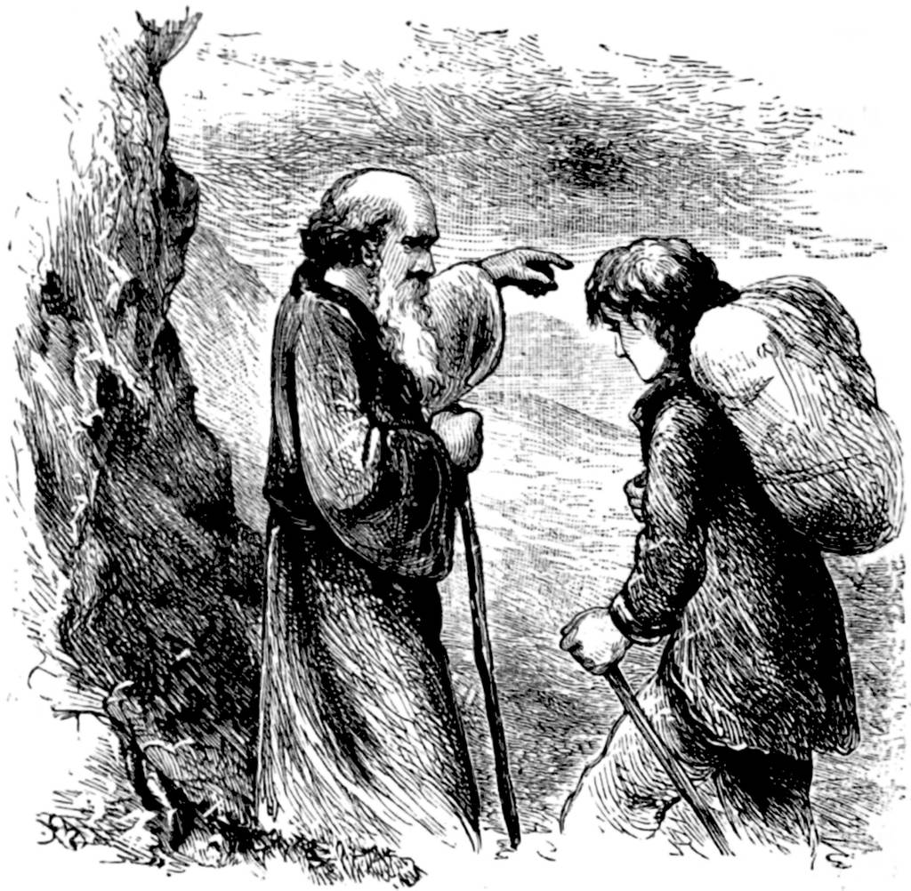

ᎠᎵᏣᏙᏂᏙᎯ. ᎦᏙᏉ ᎭᏛᏁᎭ ᎠᏂ ᏗᏣᏁᎶᏗ? ᎤᏛᏅᎩ: ᎾᏍᎩᏃ ᏄᏪᏒ ᎤᏠᎪᏉ ᎢᏳᏪᏍᏗᏱ ᏧᏁᎶᏗ: ᎾᏍᎩᏃ
ᏂᎦᎵᏍᏙᏗᏍᎪ ᎡᎳᏪᏉ ᎦᏙᎪᎢ. ᎿᏉ ᎠᎴ ᎯᎠ ᏄᏪᏒ ᎠᎵᏣᏙᏂᏙᎯ, ᏝᏍᎪ ᏂᎯ ᏱᎩ ᏥᎬᏩᏛᎲ
ᏣᏠᏱᎲ ᎠᏐᏱ ᏙᏱᏗᏢ ᏥᏙᎬ ᎠᏲᎱᎯᏍᏗ ᏗᎦᏚᎲᎢ?

Evan. What doest thou here, *Christian*?
said he: at which words *Christian* knew not what to answer; wherefore
at present he stood speechless before him. Then said *Evangelist*
farther, Art not with thou the man that I found crying without the walls
of the City of *Destruction*?

ᏧᏁᎶᏗ. ᎥᎥ ᎬᎨᏳᎢ, ᎠᏴᏰᎾᎢ.

Chr. Yes, dear Sir, I am the man.

ᎠᎵᏣᏙᏂᏙᎯ. ᏝᏍᎪᏃ ᏳᏫᎬᏯᏎᎮᎴ ᎤᏍᏗ ᎦᎶᎯᏍᏗ ᏗᎪᏢᏒᎢ ᏫᏣᎶᎯᏍᏗᏱ;

Evan. Did not I direct thee the way to
the little Wicket-gate,

ᏧᏁᎶᏗ. ᎥᎥ ᎬᎨᏳᎢ, ᎤᏛᏅᎩ.

Chr. Yes, dear Sir, said Christian.

ᎠᎵᏣᏙᏂᏙᎯ. ᎦᏙᏃ ᎦᎵᏍᏙᏗ ᏂᎦᎥ ᏞᎩᏳ ᎢᏣᏞᏒ? ᏣᏞᏛᏉᏰᏃ ᏥᏂᏣᏛᎿᏗ ᎠᏂ.

Evan. How is it then that thou art so
quickly turned aside? for thou art now out of the way.

ᏧᏁᎶᏗ. ᎠᏍᎦᏯᏍᎩᏂ ᎣᏍᏛ ᏙᎩᎾᏠᏒ ᏄᏬᎯᏨᎾᏉ ᎠᎵᎲᏲᎵᎵᎯᏍᏗᏱ ᎥᏓᎸ ᏗᏆᏚᎩᏒ, ᎾᏍᎩ ᎠᎩᏍᏗᏰᏔᏅᎩ, ᎯᎠ
ᏫᏥᎦᏛ ᏨᏗᎦᏚᎭ, ᎾᎿ ᎦᏥᏩᏛᏗ ᎨᏒ ᎠᏍᎦᏯ ᎾᏍᎩ ᏰᎵ ᎬᎩᏰᏅᏕ ᏍᏗᏉ ᎨᏒᎢ.

Chr. I met with a Gentleman so soon as I
had got over the Slough of *Dispond*, who persuaded me that I might, in
the village before me, find a man that could take off my Burden.

ᎠᎵᏣᏙᏂᏙᎯ. ᎦᎪ ᎢᏳᏍᏗ?

Evan. What was he?

ᏧᏁᎶᏗ. ᎣᏏᏳ ᎨᏒ ᏗᎧᏃᏗᏱ ᎠᏍᎦᏯ, ᎠᎴ ᎤᏣᏛ ᎠᏆᎵᏃᎮᏔᏅᎩ; ᎾᏍᎩᏃ ᎢᏨᏍᏗ ᎠᏂ ᎠᎩᎷᏥᎸ; ᎠᏎᏃ ᎠᎩᎪᎲ
ᎯᎠ ᎤᏌᎯᎸᎢ, ᎠᎴ ᏂᎦᎥ ᎤᎬᏪᎭᏛᎢ, ᎤᎵᏍᏗᏳᏉ ᎠᏆᎴᏫᏍᏔᏅᎩ; ᏯᏆᏐᎥᎦᏉᏰᏃ ᎠᏇᎵᏒᎩ.

Chr. He looked like a Gentleman, and
talked much to me, and got me at last to yield; so I came hither: but
when I beheld this Hill, and how it hangs over the way, I suddenly made
a stand, lest it should fall on my head.

ᎠᎵᏣᏙᏂᏙᎯ. ᎦᏙᏃ ᏦᏎᎴ ᎾᏍᎩ ᎣᏍᏛ ᎠᏍᎦᏯ?

Evan. What said that Gentleman to you?

ᏧᏁᎶᏗ. ᎠᏆᏛᏛᏅᏉᏰᎾ, ᏫᏥᎦᏛᎢ; ᎠᎴ ᏥᏃᏁᎸᏉᏃ.

Chr. Why, he asked me whither I was
going; and I told him.

ᎠᎵᏣᏙᏂᏙᎯ. ᎦᏙᏃ ᎿᏉ ᎢᎤᏛᏁᎢ?

Evan. And what said he then?

ᏧᏁᎶᏗ. ᎠᏆᏛᏛᏅᏰᎾ, ᏥᎪ ᏗᏣᏓᏘᎿᎢ? ᎠᏉᏎᎸᎩ; ᎥᏥᏃᏁᎸᏃ. ᎠᏎᏃ, ᎤᏣᏘᏉ ᎦᎨᏗᏳ ᎾᏆᏛᎿᏕᎦ ᎯᎠ ᏥᎵᏎᎭ,
ᎥᏝᏃ ᎣᏍᏛ ᎣᎦᏓᏅᏓᏗᏍᎪ ᎠᏁᏙᎲ ᎨᏙᎲᎢ ᎾᏍᎩᏯ ᎢᎸᎯᏳ ᏥᏄᏍᏛᎩ; ᎢᏥᏲᏎᎸᎩ.

Chr. He asked me if I had a family; and I
told him. But, said I, I am so loaden with the Burden that is on my
back, that I cannot take pleasure in them as formerly.

ᎠᎵᏣᏙᏂᏙᎯ. ᎦᏙᏃ ᎿᏆᎴ ᎤᏛᏁᎢ.

Evan. And what said he then?

ᏧᏁᎶᏗ. ᎠᎩᏁᏤᎸᏉᏰᎾ ᏄᎵᏍᏛ ᎠᏆᏰᏅᏕᏍᏗᏱ, ᎠᏗᎾ ᏙᎯᏱᏉ ᎠᏆᏓᏅᏓᏗᏍᏗ ᎠᎩᏲᎭ, ᏥᏲᏎᎸᎩ: ᎠᎴ ᎾᏍᎩ ᎢᏳᏍᏗ
Ꮎ ᎤᏍᏗ ᎦᎶᎯᏍᏗ ᏗᎪᏢᏒ ᏫᏥᎦᏗ, ᏥᏲᏎᎸᎩ, ᎾᎿ ᎠᎴ ᏨᏉᏏᏌᏁᏗᏱ ᎠᎩᏲᎵ ᎾᏍᎩᏃ ᎠᏆᏚᏓᎴᏍᏗᏱ ᎠᎩᏩᏛᏗᏱ.
ᎾᏍᎩᏃ ᎿᏉ ᎤᏟ ᎣᏏ ᎢᎬᏆᏛᏁᏗ ᎠᏆᏎᎮᏗᏱ ᎠᏉᏎᎸᎩ, ᎠᎴ ᎾᎥᏉ ᎬᎩᏩᏛᏗ ᎨᏒᎢ, ᎠᎴ ᎾᏍᎩ ᎢᎦᎢ
ᎤᏕᏯᏙᏗ ᎬᏩᏛᏔᏂᏓᏍᏗ ᏂᎨᏒᎾ ᎨᏒᎢ, ᎾᏍᎩ ᏥᏂᎦᎥ ᏥᏥᏩᏛᏔᏂᏙᎭ ᏂᎯ ᏥᏍᏆᏎᎮᎸᎩ; ᎾᏍᎩ ᎯᎠ
ᏮᏓᎬᏯᏎᎮᎵ ᎣᏍᏛ ᎠᏍᎦᏯ ᏗᎦᏁᎸ ᎾᏍᎩ ᎤᏣᏘ ᎠᏏᎾᏏᏳ ᎤᏓᏰᏅᏕᏍᏗᏱ, ᎤᏛᏅᎩ; ᎾᏍᎩᏃ ᏥᏲᎢᏳᏅᎩ, ᎠᎴ
ᏛᏆᏎᎮᎸ ᎠᏂ, ᎠᎴ ᎠᏂ ᎠᎩᎷᏨᎩ, ᎾᏍᎩᏃ ᏱᏅᏎᎦᎩ ᏙᎯᏱ ᏱᎦᏓᏅᏓᏓ ᎯᎠ ᏥᎦᎵᏎᎭ ᎠᏇᎵᏒᎩ. ᎠᏎᏃ
ᎠᏂ ᎠᎩᎷᏥᎸ, ᎾᏍᎩ ᎯᎠ ᏄᏍᏛ ᎠᎩᎪᏩᏛᏗ ᎸᎵᏍᏔᏅ ᏥᏄᏍᏗ ᏂᎯ ᏥᎪᏩᏘᎭ, ᎠᏆᎴᏫᏍᏓᏅᏃ, ᏥᎾᏰᏍᎬᏉ
ᎤᏍᎦᏎᏗ ᎨᏒᎢ; ᎠᏎᏃ ᎪᎯ ᎨᏒ ᎥᏝᏃ ᏱᏥᎦᏔᎭ ᎢᏯᏆᏛᏁᏗᏱ.

Chr. He bid me with speed get rid of my
Burden; and I told him ’twas ease that I sought. And, said I, I am
therefore going to yonder Gate, to receive further direction how I may
get to the place of deliverance. So he said that he would shew me a
better way, and short, not so attended with difficulties as the way,
Sir, that you set me; which way, said he, will direct you to a
Gentleman’s house that hath skill to take off these Burdens: So I
believed him, and turned out of that way into this, if haply I might be
soon eased of my Burden. But when I came to this place, and beheld
things as they are, I stopped for fear (as I said) of danger: but I now
know not what to do.

ᎠᎵᏣᏙᏂᏙᎯ. ᎿᏉᏃ ᎯᎠ ᏄᏪᏒ ᎠᎵᏣᏙᏂᎪᎯ, ᎯᏙᎨᏍᏗ ᏞᎦ, ᎾᏍᎩᏃ ᏓᎬᏃᏁᎵ ᏄᏍᏛ ᎤᏁᎳᏅᎯ ᎤᏁᏨᎯ. ᎾᏍᎩᏃ
ᎦᏙᎪ ᎤᏪᎾᏫᏍᎪᎢ. ᎿᏉᏃ ᎯᎠ ᏄᏪᏒ ᎠᎵᏣᏙᏂᏙᎯ, “ᎢᏤᏯᏔᎮᏍᏗ ᏞᏍᏗ ᏥᎡᏣᏓᏱᎵ ᎾᏍᎩ ᏥᎧᏁᎦ: ᎢᏳᏰᏃ
ᏄᎾᏓᏗᏫᏎᎸᎾ ᏱᎩ ᎾᏍᎩ ᎤᎾᏓᏱᎸᎯ ᎾᏍᎩ ᎡᎶᎯ ᎤᏁᏥᎸᎯ ᎤᏗᏢᏃ ᎢᎦᎢ ᎥᏝ ᏂᎯ ᏴᎦᏰᏓᏗᏫᏏ, ᎢᏳᏃ
ᎢᎡᏓᏜᎡᎮᏍᏗ ᎾᏍᎩ ᎦᎸᎳᏗ ᏨᏗᎧᏁᎦ.” ᎠᎴ ᎠᏏ ᎯᎠ ᏄᏪᏒᎩ, “ᎤᎾᏓᏅᏗᏃ ᎪᎯᏳᏗᏉ ᎨᏒ
ᏚᎾᏛᏂᏗᏍᏙᏕᏍᏗ; ᎢᏳᏍᎩᏂᏃ ᎩᎶ ᎢᎠᏏᏁᎨᏍᏗ, ᎥᏝ ᎣᏍᏛ ᎦᏥᏯᏓᏅᏓᏕᏗ ᏱᎨᏎᏍᏗ,” ᎿᏉ ᎠᎴ ᎾᏍᎩ
ᏚᏬᎢᏌᏅᎩ; ᏂᎯᏍᎩᏂ ᎯᏍᎦᏯ ᎤᏲᏢ ᎢᏗᏢ ᏫᎦᏘ; ᎠᎴ ᎿᏉ ᏣᎴᏅ ᏣᏲᎢᏎ ᏩᏍᏛ ᎦᎸᎳᏗᏳ ᏧᎵᏙᎯᏍᏗ
ᎤᏁᏨᎯ, ᎠᎴ ᎿᏉ ᎭᏞᎠ ᏅᏩᏙᎯᏯᏛ ᎦᏅᎿᏩᏗᏒᎢ, ᎠᎴ ᎾᎥᏂᏳᏉ ᎿᏉ ᎤᏲᏢ ᏣᎾᏄᎪᏥᎯᏍᏗᏱ.

Evan. Then, said *Evangelist*, stand
still a little, that I may shew thee the words of God. So he stood
trembling. Then said Evangelist, *See that ye refuse not him that
speaketh; for if they escaped not who refused him that spake on Earth,
much more shall not we escape, if we turn away from him that speaketh
from Heaven.* He said moreover, *Now the just shall live by faith: but
if any man draws back, my soul shall have no pleasure in him.* He also
did thus apply them, *Thou art the man that art running into this
misery, thou hast begun to reject the counsel of the Most High, and to
draw back thy foot from the way of peace, even almost to the hazarding
of thy perdition.*

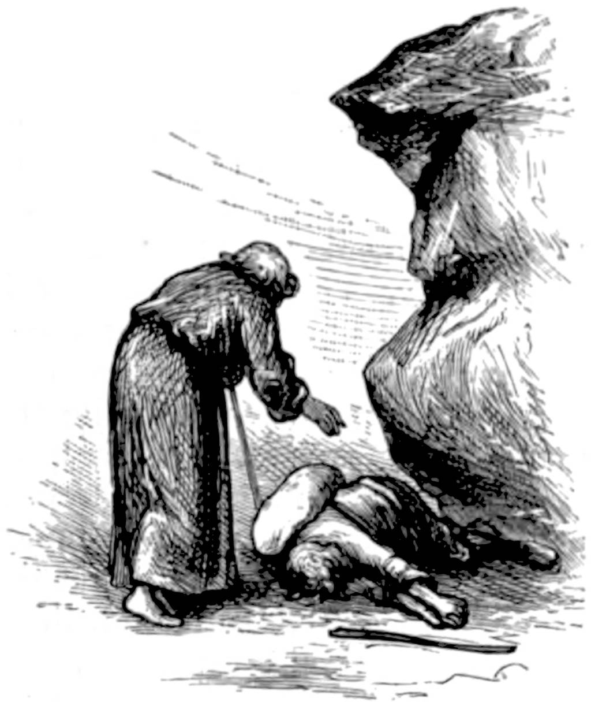

ᎿᏉᏃ ᏧᏁᎶᏗ ᎡᎳᏗ ᏕᎤᎳᏍᎬ ᎾᎥ ᎤᏲᎱᏒᎯ ᎢᏗᎬᏤᎵᏛ ᎤᏅᏥᎸᎩ, ᎤᏪᎷᏅᎩ, ᏄᏲᏢᏉ ᎠᏴ, ᎿᏉᏰᏃ ᎠᏎ
ᎾᏆᎵᏍᏓᏁᎵᎦ ᎤᏛᏅᎩ\! ᎾᏍᎩᏃ ᎤᎪᎲ ᎠᎵᏣᏙᏂᏙᎯ ᎠᎦᏗᏏ ᎤᏬᏰᏂ ᎤᏂᏴᎲᎩ, ᎯᎠ
ᏄᏪᏎᎸᎩ, “ᏂᎦᏗ ᏄᏓᎴᏒ ᎠᏍᎦᏅᎢᏍᏗ ᎨᏒ ᎠᎴ ᎠᏐᏢᎢᏍᏙᏗ ᎨᏒ ᎨᏥᏙᎵᏍᏗᏉ ᎨᏎᏍᏗ ᏴᏫ;” ᎹᏚ
12:31. “ᏞᏍᏗᏉ ᏂᏦᎯᏳᏒᎾᏉ ᏱᎨᏎᏍᏗ, ᎰᎯᏳᎲᏍᎨᏍᏗᏉᏍᎩᏂ,” ᏣᏂ 20:27. ᎿᏉ ᏧᏁᎶᏗ ᏔᎵᏁ ᎤᏍᏗᎩᏛ
ᎤᎦᎵᏍᏙᏒᎩ, ᎠᎴ ᎤᏪᎾᏫᏍᎩ ᎤᎴᏅᎩ, ᎾᏍᎩᏯ ᎢᎬᏱᏱ ᏥᏄᏛᏁᎸᎩ, ᎠᎵᏣᏙᏂᏙᎯ ᎦᏙᎬᎢ.

Then *Christian* fell down at his foot as dead, crying, Wo is me, for I
am undone: At the sight of which, *Evangelist* caught him by the right
hand, saying, “All manner of sin and blasphemies shall be forgiven unto
men;” \[Matthew 12:31\]. “Be not faithless,
but believing.” \[John 20:27\]. Then did
*Christian* again a little revive, and stood up trembling, as at first,
before *Evangelist*.

ᎿᏉᏃ ᎠᎵᏣᏙᏂᏙᎯ ᎤᎴᏅᎲ, ᎯᎠ ᏄᏪᏒᎩ, ᎤᏗᏢ ᎢᎦᎢ ᎣᏍᏛ ᎭᎦᏌᏯᏍᏓ ᎾᏍᎩ ᏨᏓᎬᏃᏁᎵ. ᎿᏉ ᏓᎬᏃᏁᎵ ᎾᏍᎩ
ᎨᏒ ᏥᏣᎴᎾᏍ. ᏔᏅ, ᎠᎴ ᎾᏍᎩ ᎨᏒ ᏧᏪᎸ ᏫᎶᎯ ᏥᏦᏎᎴᎢ. ᎯᎠ ᎠᏍᎦᏯ ᎾᏍᎩ ᏥᏕᏣᏠᏎᎢ, ᎾᏍᎩ
ᎡᎶᎯ-ᎡᎯ-ᎠᎦᏔᎿᎢ; ᎠᎴᏃᎾ ᏚᏳᎪᏗᏉ ᏥᏄᏍᏗ ᏥᏚᏙᎥ; ᎯᎠ ᏂᎦᎵᏍᏙᏗ ᎾᏍᎩ ᎡᎶᎯᏉ-ᎡᎯ ᏗᏕᏲᏗ
ᎤᎨᏳᎯ ᎨᏒᎢ; (ᎾᏍᎩᏃ ᎢᏳᏍᏗ ᎠᏎ-ᎣᏓᏅᏗᏳᏉ-ᏱᎩ ᏥᏚᏙᎥ ᏗᎦᏚᎲ ᎡᎪ ᎤᎾᎵᎪᎯ ᏓᏂᎳᏫᎬᎢ;) ᏂᎦᎵᏍᏙᏗᏰᏃ
ᎤᏟ ᏄᎨᏳ ᎾᏍᎩ ᏓᎾᏕᏲᎲᏍᎬᎢ, ᎤᏭᏓᎴᏰᏃᎾ ᏓᏓᎿᏩᏍᏛ ᏗᎧᎿᏩᏛᏍᏗ ᏧᎧᎿᏩᏛᏍᏗᏱ; ᎠᎴᏃ ᏂᎦᎵᏍᏙᏗ
ᎡᎶᎯᏉ ᎤᏓᏅᏖᎵᏓᏍᏗ ᎤᎲᎢ, ᎾᏍᎩ ᎢᏳᏍᏗ ᎠᏴ ᎠᏆᎴᎾᏍᏓᏁᎭ, ᎠᏎᏃ ᎠᏴ ᏕᎦᏕᏲᎲᏍᎬ ᏚᏳᎪᏗ.

Then *Evangelist* proceeded, saying, Give more earnest heed to the
things that I shall tell thee of. I will now shew thee who it was that
deluded thee, and who it was also to whom he sent thee. The man that met
thee is one *Worldly Wiseman*, and rightly is he so called: partly
because he savoureth only the doctrine of this world, (therefore he
always goes to the Town of *Morality* to church); and partly because he
loveth that doctrine best, for it saveth him from the Cross. And because
he is of this carnal temper, therefore he seeketh to prevent my ways,
though right.

ᎠᎴ ᏦᎢ ᏄᏓᎴ ᎯᎠ ᎠᏍᎦᏯ ᏓᏕᏲᎲᏍᎬ ᎠᏎ ᎤᏍᎦᎢᏍᏗᏳ ᎯᏯᏓᏅᏓᏕᏗ ᏅᏓᎦᎵᏍᏔᏂ.

Now there are three things in this man’s counsel that thou must utterly
abhor.

ᏥᏣᎴᎾᏍᏗᎭ.

His turning thee out of the way.

ᎠᎴ ᏣᎵᏂᎬᏁ ᏧᏓᎿᏩᏛ ᏕᎯᎧᎿᏩᏗᏒ ᎤᏍᎦᎢᏍᏗ ᏣᏓᏅᏓᏗᏍᏗᏱ ᏥᏂᏨᏁᎭ.

His labouring to render the Cross odious to thee.

ᎠᎴ ᎠᏓᎯᎯ ᏗᎪᏢᏒ ᎢᏗᏢ ᏥᏫᏗᏣᎦᏔᏁ ᏗᏣᎳᏏᏕᏂ.

And his setting thy feet in that way that leadeth unto the
administration of Death.

ᎢᎬᏱ, ᎠᏎ ᎤᏍᎦᎢᏍᏗᏳ ᎯᏯᏓᏅᏓᏕᏗ ᏅᏓᎦᎵᏍᏔᏂ ᏥᎶᏞᏍᏗᎭ ᎦᏅᏅᎢ; ᎠᎴ ᎾᏍᏉ ᏨᏒ ᎨᏒ ᏦᎯᏳᏅᎢ; ᎯᎠᏰᏃ
ᎾᏍᎩ ᎢᏣᏲᎢᏎ ᎤᏁᎳᏅᎯ ᎦᏁᎬᎢ, ᎠᎴ ᎯᎬᏫᏳᏗᎭ ᎡᎶᎯ-ᎡᎯ-ᎠᎦᏔᎿᎢ ᏣᏬᏁᏔᏅᎢ. ᏲᎰᏩ ᏰᏃ ᎯᎠ
ᏂᎦᏪᎭ, “ᎢᏣᎵᏂᎬᏏ ᎬᎾᏙᎵ ᎦᎶᎯᏍᏗᏱ ᎨᏒ ᎢᏥᏴᏍᏙᏗᏱ,” ᎷᎦ 13:24; ᎾᏍᎩ ᎯᎠ ᎦᎶᎯᏍᏗᏱ
ᏗᎪᏢᏒ ᏫᏣᎶᎯᏍᏗᏱ ᏥᎬᏲᏎᎸᎩ: “ᎬᎾᏙᎵᏰᏃ ᎦᎶᎯᏍᏗᏱ ᎾᏍᎩ ᎬᏂᏛ ᏫᎦᎾᏄ ᎪᎬᎢ, ᎠᎴ ᎠᏂᎦᏲᎵᏳ
ᎠᏂᏩᏘᎭ.” ᎹᏚ 7:13-14. ᎾᏍᎩ ᎯᎠ ᎤᏍᏗ ᎦᎶᎯᏍᏗᏱ ᏗᎪᏢᏒᎢ, ᎠᎴ ᎾᎿ ᏫᎦᏅᏅᎢ, ᎾᏍᎩ
ᎯᎠ ᎤᏁᎫᏥᏛ ᎠᏍᎦᏯ ᏣᏞᏍᏔᏅ, ᎾᏍᎩ ᎪᎱᏍᏗ ᏣᎵᏍᏓᏁᏗᏱ ᎾᎥ ᏥᎾᏨᏏᏓ: ᎾᏍᎩ ᎢᏳᏍᏗ, ᎯᏂᏆᏗᎮᏗᏉ,
ᏥᏣᏞᏍᏗ ᎦᏅᏅᎢ, ᎠᎴ ᎭᏓᏂᏆᏗᎮᏍᏗ ᏨᏒ ᏥᏲᎢᏳᏁᎸ.

First, Thou must abhor his turning thee out of the way; yea, and thine
own consenting thereto, because this is to reject the counsel of God for
the sake of the counsel of a *Worldly Wiseman*. The Lord says, *Strive
to enter in at the strait gate* \[Luke
13:24\]*,* the gate to which I sent thee; *for strait is
the gate that leadeth unto life, and few there be that find it*
\[Matthew 7:13-14\]*.* From this little
Wicket-gate, and from the way thereto, hath this wicked man turned thee,
to the bringing of thee almost to destruction; hate therefore his
turning thee out of the way, and abhor thyself for hearkening to him.

ᏔᎵᏁᎢᏃ, ᎠᎴ ᎯᏂᏆᏘᎮᏗ ᏥᏂᎦᎥ ᏣᎵᏂᎬᏁ ᏓᏓᎿᏩᏍᏛ ᎤᏍᎦᎢᏍᏗ ᎠᏓᏅᏓᏗᏍᏗ ᎢᏨᏁᏗᏱ; ᎾᏍᎩᏰᏃ ᏣᎬᏫᏳᏙᏗ
ᎡᏍᎦᏉ ᏣᏰᎸᏗ ᎢᏥᏈᏱ ᎨᏅᎢᏍᏗ ᎠᎲᎢ, ᎠᏂᏈᎷ 11:25-26. ᎠᎴᏃ ᎾᏍᏉ, ᎦᎸᏉᏗᏳ ᎤᎬᏫᏳᎯ
ᏣᏃᏁᎸ, ᎾᏍᎩ ᎩᎶ ᎬᏅ ᎢᎠᏩᏘᏍᎨᏍᏗ, ᎾᏍᎩ ᎤᏲᎱᏎᏗ ᎨᏎᏍᏗ; ᎠᎴ ᎩᎶ ᎠᎩᏍᏓᏩᏕᎨᏍᏗ,
ᏂᎦᏂᏆᏘᎲᎾᏃ ᎢᎨᏎᏍᏗ ᎤᏙᏓ, ᎠᎴ ᎤᏥ, ᎠᎴ ᎤᏓᎵᎢ, ᎠᎴ ᏧᏪᏥ, ᎠᎴ ᎠᎾᏓᏅᏢᎢ, ᎠᎴ
ᏧᏙ, ᎠᎴ ᎤᏩᏒ ᎬᏅ ᎾᏍᏉ ᏂᎦᏂᏆᏗᎲᎾ ᎢᎨᏎᏍᏗ, ᎥᏝ ᎠᏴ ᎠᎩᏍᏓᏩᏕᎩ ᏱᎨᏎᏍᏗ, ᎹᏚ 8:38; ᏣᏂ
12:25; ᎹᏚ 10:39; ᎷᎦ 14:26. ᎾᏍᎩᏃ ᎯᎠ ᎢᏳᏍᏗ, ᎯᎠ ᏂᎬᏪᏎᎭ, ᎤᏁᎳᏅᎯ ᎯᎠ ᏂᎦᏪᎠ, ᎤᏍᏗ
ᎦᎶᎯᏍᏗ ᏗᎪᏢᏒ ᏫᏂᏣᏴᏍᏔᏅᎾ ᏱᎩ, ᎥᏝ ᎬᏂᏛ ᏴᎦᎯᏩᏛ. ᎢᏳᏃ ᎩᎶ ᏴᏫ ᏱᏣᏍᏗᏰᏗ ᏦᎯᏳᏗᏱ ᎾᏍᎩ
ᏱᏫᏣᏴᏍᏔᏅ ᏣᎯᎯᏉ ᎨᏒᎢ: ᎾᏍᎩ ᎯᎠ ᏥᏄᏍᏗ ᏥᏓᏕᏲᎲᏍᎦ, ᎯᏍᎦᏤᏗ.

Secondly, Thou must abhor his labouring to render the Cross odious unto
thee; for thou art to *prefer it before the treasures of Egypt*
\[Hebrews 11:25-26\]*.* Besides, the King of
Glory hath told thee, that *he that will save his life shall lose it*:
and He that comes after him, and hates not his father, and mother, and
wife, and children, and brethren, and sisters, yea and his own life
also, he cannot be my Disciple. \[Mark 13:35, John 12:25,
Matthew 10:39, Luke 14:26\] I say therefore, for a man to
labour to persuade thee, that that shall be thy death, without which,
the Truth hath said, thou canst not have eternal life; This doctrine
thou must abhor.

ᏦᎢᏁᎢ, ᎠᏎ ᎯᏂᏆᏘᎮᏗ ᎾᏍᎩ ᏥᏣᏕᏙᏍᏔᏅ ᎦᏅᎾᏩᏗᏒ ᏫᎦᎾᏄᎪᎬ ᎠᏲᎱᎯᏍᏗᏱ. ᎠᎴ ᎾᏍᎩ ᏂᎯ ᏣᏓᏅᏖᏗ ᎪᎦ
ᎢᏳᏍᏗ ᎨᏒᎢ, ᎾᏍᎩ ᏧᏬᎸ ᏫᏣᎷᎯᏍᏗᏱ ᏦᏎᎸᎢ, ᎠᎴ ᎾᏍᎪ ᎢᎬᏩᏛᏁᏗ ᏂᎨᏒᎾ ᎨᏒ, ᎾᏍᎩ ᎠᏍᎦᏯ
ᏣᏰᏅᎾᏍᏗᏱ ᎭᎵᏎᎲᎢ.

Thirdly, Thou must hate his setting of thy feet in the way that leadeth
to the ministration of death. And for this thou must consider to whom he
sent thee, and also how unable that person was to deliver thee from thy
Burden.

ᎠᎴ ᎯᎠ ᏧᏬᎸ ᏫᏣᎶᎯᏍᏗᏱ ᏥᏣᏎᎮᎸ ᏙᎯ ᏣᏓᏅᏓᏗᏍᏗᏱ, ᏚᏳᎪᏛ ᏧᎸᏫᏍᏓᏁᎯ ᏚᏙᎥ, ᎾᏍᎩ ᎠᏥᎾᏝᎢ ᎠᎨᏴ
ᎤᏪᏥ, ᎿᏉ ᎪᎯ ᏤᎭ, ᎠᎴ ᏥᏕᎨᏥᎾᏝᎠ ᎤᏩᏒ, ᎠᎴ ᏧᏪᏥ; ᎠᎴ ᎾᏍᎩ ᏓᏟᏍᎶᏍᏗ ᎯᎠ ᎤᏌᎯᎸ ᏌᎾᎢ
ᎾᏍᎩ ᏥᏍᎯᎦᎢᎭ ᏣᏐᎥᏍᏗᏱ. ᎿᏉᏃ ᎯᎠ ᎠᎨᏴ ᎠᎴ ᏧᏪᏥ ᏱᏗᎨᏥᎾᏝᎠ, ᎦᏙᏃ ᏱᎦᎵᏍᏙᏗ ᏯᏓᏅᏖ ᎾᏍᎩ
ᎨᏧᏓᎴᏍᏗᏱ? ᎯᎠᏃ ᏚᏳᎪᏛ ᏧᎸᏫᏍᏓᏁᎯ ᏥᏚᏙᎥ, ᎥᏝ ᎾᏍᏉ ᏰᎵᎦ ᎢᎬᏩᏛᏁᏗ ᏱᎩ ᏣᏰᏅᏕᏍᏗᏱ
ᎭᎵᏎᎲᎢ. ᎥᏝ ᎠᎴ ᎩᎶ ᏳᏪᏰᏅᏕᏐ ᎠᏏ ᎯᎠ ᎠᏍᎦᏯ; ᎥᏝ, ᎠᎴ ᎾᏍᎩ ᎢᎬᏩᎵᏍᏙᏗ ᏱᎩ; ᎥᏝ
ᏰᏃ ᏴᎨᏣᏚᏓᎴᏍᏓ ᎢᏨᏗᏍᎬ ᏕᏥᎸᏫᏍᏓᏁᎲ ᎢᏦᎯᏳᎲᏍᎬ ᏗᎧᎾᏩᏛᏍᏗ; ᏝᏰᏃ ᎩᎶ ᎬᏪᏰᏅᏙᎠᎯᏍᏗ ᏱᎩ
ᎠᎵᏎᎲ, ᏚᎸᏫᏍᏓᏁᎲ ᏗᎧᎾᏩᏛᏍᏗ ᎪᎯᏳᎲᏍᎬᎢ. ᎾᏍᎩᏃ ᎡᎶᎯ-ᎡᎯ-ᎠᎦᏔᎾᎢ ᎡᏙᎯᏉ, ᏅᏩᎾᏓᎴ
ᎤᎾᏤᎵᎪᎯ ᎡᎯ; ᎠᎴ ᏚᏳᎪᏛ-ᏧᎸᎾᏍᏓᏁᎯ ᏥᏚᏙᎥ ᎠᏓᎶᏄᎮᏍᎩᏉ; ᎤᏪᏥᏃ ᎤᏙᎵᏍᏙᏍᏛ ᏥᏚᏙᎥ, ᏂᎦᎥ
ᎤᏙᎵᏍᏙᏏᏳ ᏗᎦᏃᏗᏱ ᏥᎩ, ᎤᏠᎾᏍᏗᏉ, ᎥᏝ ᎠᎴ ᎨᏣᏍᏕᎸᏗ ᏱᎩ. ᎠᏴ ᏍᏉᎯᏳᎲᎦ, ᎥᏝ ᎪᎱᏍᏗ ᏳᎬᏩᎳ ᏂᎦᎥ
ᏥᎨᎯᏯᏛᎦᏁᎸ ᎯᎠ ᎤᏂᏁᎫ ᎠᏂᏍᎦᏯ, ᎤᎾᏓᏅᏖᎸᏉᏍᎩᏂ ᎨᏣᎴᎾᏍᏙᏗᏱ ᏣᎵᏍᏕᎸᏙᏗ ᎨᏒᎢ, ᎯᎠ ᏥᎨᏣᏞᏍᏔᏅ
ᎦᏅᏅ ᏥᎬᏯᏕᏙᏍᏔᏅᎩ. ᎿᏉᏃ ᎠᎵᏥᏙᏂᏙᎯ ᎠᏍᏓᏯ ᎤᏔᏲᎸᎩ ᎦᎸᎳᏗ ᎤᏍᏓᏱᏕᏗᏱ ᎾᏍᎩ ᎯᎠ ᏄᏪᏒᎢ; ᎿᏉᏃ ᎯᎠ
ᏄᏪᏒ, ᎩᎧᏁᎬ ᎠᎴ ᎠᏥᎸ ᏓᏳᎾᏄᎪᏨ ᎣᏓᎸᎢ, ᎾᎿ ᎠᏫᏂᏗᏢ ᏧᏁᎶᏗ ᎦᏙᎬᎢ, ᎾᏍᎩ ᎤᏍᏘᏰᎬ ᏚᎴᏓᏁᎸᎩ. ᎯᎠᏃ
ᏄᏪᏒ ᏧᏁᏨ: “ᎾᏂᎥ ᏗᎧᎾᏩᏛᏍᏗ ᎠᏃᎯᏳᎲᏍᎬ ᏧᎾᎵᏍᎦᏍᏙᏗ ᎤᎾᏓᏄᏴᏗ ᎤᏁᎳᏅᎯ ᎤᏓᏍᎦᎢᏍᏗ ᎨᏒᎢ; ᎯᎠᏰᏃ
ᏂᎬᏅ ᎪᏪᎳ, ᎨᏥᏍᎦᎢᏍᏗ ᎨᏎᏍᏗ ᎾᏂᎥ ᏂᏓᏂᎧᎾᏩᏗᏒᎾ ᎢᎨᏎᏍᏗ, ᏗᎧᎾᏩᏛᏍᏗ ᏂᎬᏅ ᎪᏪᎵᎯ.

He to whom thou was sent for ease, being by name *Legality*, is the Son
of the Bond-woman which now is, and is in bondage with her children;
woman and is in a mystery this Mount *Sinai*, which thou hast feared
will fall on thy head. Now if she with her children are in bondage, how
canst thou expect by them to be made free? This *Legality* therefore is
not able to set thee free from thy Burden. No man was as yet ever rid of
his Burden by him ; no, nor ever is like to be: ye cannot be justified
by the Works of the Law; for by the deeds of the Law; no man living can
be rid of his Burden: therefore, Mr *Worldly Wiseman* is an alien, and
Mr *Legality* a cheat; and for his son *Civility*, notwithstanding his
simpering looks, he is but a hypocrite and can not help thee. Believe
me, there is nothing in all this noise, that thou hast heard of this
sottish man, but a design to beguile thee of thy Salvation, by turning
thee from the way in which I had set thee. After this *Evangelist*
called aloud to the Heavens for confirmation of what he had said; and
with that there came words and fire out of the Mountain under which poor
*Christian* stood, that made the hair of his flesh stand. The words were
thus pronounced, *As many as are the works of the Law are under the
curse; for it is written, Cursed is every one that continueth not in all
things which are written in the Book of the Law to do them.*

ᎾᏉᏃ ᏧᏁᎶᏗ ᎥᏝ ᎪᎱᏍᏗ ᏱᎦᏖᏃᎮ ᎤᏲᎱᎯᏍᏗᏱᏉ ᎤᏩᏒ, ᎠᎴ ᎠᏍᏓᏱᏳ ᎤᏪᎷᏅᎩ, ᎠᎴ ᎤᏍᎦᏨᎩ ᎾᎯᏳ ᏚᎾᏠᏒ
ᎡᎶᎯ ᎡᎯ ᎠᎦᏔᎾᎢ, ᎠᏏᏉ ᎠᎴ ᎯᎠ ᎤᏓᏪᏎᎲᎩ ᎤᏩᏒ, ᎤᏣᏗᏉᎧ ᎠᎩᏁᎫ ᎨᏎ ᏥᏥᏯᏛᏓᏍᏓᏁᎸᎩ ᎧᏁᎬᎢ.
ᎠᎴ ᎤᏣᏘ ᎤᏕᎰᏒᎩ ᎤᏓᏅᏖᎸ ᎯᎠ ᎠᏍᎦᏯ ᎦᏃᎮᏍᎬ ᎤᏇᏓᎵᏉ ᏅᏓᏳᏓᎴᏅᎯ ᎨᏒᎢ, ᎠᎴ ᎾᏍᎩᏉ ᎤᏎᎪᎩᏒᎢ,
ᎠᎴ ᏚᏳᎪᏛ ᎤᏕᏙᏩᏗᏒ ᎤᏞᏍᏓᏅᎢ. ᎯᎠᏃ ᏄᏛᏁᎸ ᎯᎠ ᏄᏪᏎᎸᎩ ᎠᎵᏣᏙᏂᏙᎯ.

Now *Christian* looked for nothing but death, and began to cry out
lamentably, even cursing the time in which he met with Mr *Worldly
Wiseman*, still calling himself a thousand fools for hearkening to his
counsel: he also was greatly ashamed to think that this Gentleman’s
arguments, flowing only from the flesh, should have that prevalency with
him as to cause him to forsake the right way. This done, he applied
himself again to *Evangelist* in words and sense as follows.

ᏧᏁᎶᏗ. ᎩᎾᎵᎢ ᎦᏙ ᎮᎵᎠ? ᏥᎪᏰᎵᏉ ᎤᏚᎩ ᎦᎬᏗ? ᏰᎵᏉᏍᎪ ᎠᏏ ᎬᏆᏨᏍᏗ, ᎠᎴ ᎤᏍᏗ ᎦᎶᎯᏍᏗ ᏗᎪᏢᏒ
ᏫᎬᎩᎷᎯᏍᏗ? ᏝᏍᎪ ᎯᎠ ᏥᎾᏆᏛᏁᎸ ᏴᎬᎩᏍᏛᏓ ᏴᎦᏴᏆᏓᏱᎦᏉ, ᎠᎴ ᏴᏛᎦᏴᏆᏨᏍᏓ ᎠᏆᏕᎰᏐᏅᎯ;
ᎤᏲᎢᏳ ᏥᏰᎸᏍᎦ ᎯᎠ ᎠᏍᎦᏯ ᎧᏁᎬ ᏥᏯᏛᏓᏍᏓᏁᎸᎢ; ᏰᎵᏉᏍᎪᏃᏅ ᎠᎩᏍᎦᏅᏨ ᎦᏴᎩᏙᎵᏍᏗ?

Chr. Sir, what think you? Is there hopes?
May I now go back and go up to the Wicket-gate? Shall I not be abandoned
for this, and sent back from thence ashamed? I am sorry I have hearkened
to this man’s counsel : But may my sin be forgiven?

ᎠᎵᏣᏙᏂᏙᎯ. ᎤᏙᎯᏳᏍᎩᏃᏅ ᎤᏣᏘ ᎯᏍᎦᏅᎩ, ᎾᏍᎩᏰᏃ ᏂᎦᎵᏍᏙᏓ ᏔᎵ ᎢᏳᏓᎴᎩ ᎤᏲ ᏕᏣᎸᏫᏍᏓᏏ; ᎾᏍᎩ ᏥᏣᏞᏒ
ᏚᏳᎪᏛ ᏣᏕᏙᏩᏗᏒᎢ, ᎠᎴ ᏧᏓᏅᏍᏙᏒᎯ ᏕᎦᏅᏅ ᏥᏣᏕᏙᏅ. ᎠᏎᏃ ᎠᏍᎦᏯ ᎦᎶᎯᏍᏗ ᏥᎦᏙᎦ ᎠᏏᏉ ᏙᏛᏣᏓᏂᎸᏥ,
ᏧᏣᏘᏰᏃ ᎣᏏ ᏚᏰᎸ ᏴᏫ; ᎮᏯᏔᎮᏍᏗᏗᎾ ᏞᏍᏗ ᏔᎵᏁ ᏥᎭᎪᎸᏏ ᏣᏕᏙᏩᏗᏒᎢ, ᏱᏁᎭᎵᏍᏔᏂᏓᏉᏰᏃ ᏫᎦᎶᎯᏍᏗ ᎨᏒ
ᎠᏏ ᎤᏍᏗᎩᏛᏉ ᏳᏓᎳᏬᏒ. ᏕᏫ ᏧᏃᎩᏛ 2:12.

Evan. Then said *Evangelist* to him, Thy
sin is very great, for by it thou hast committed two evils: thou hast
forsaken the way that is good, to tread in forbidden paths; yet will the
man at the Gate receive thee, for he has good-will for men; only, said
he, take heed that thou turn not aside again, lest thou perish from the
way, when his wrath is kindled but a little. \[Psalms
2:12\]

ᎾᏉᏃ ᏧᏁᎶᏗ ᎤᏁᏨᎩ ᎥᎤᏨᏍᏗᏱ; ᎠᎵᏣᏙᏂᏙᎯᏃ ᎤᏔᏪᏙᏅ, ᎠᎴ ᎤᎦᎵᏍᏓᏗᏍᏔᏅ, ᎤᏂᎬᏍᏙᏗᏱ ᎤᏁᏤᎸᎩ; ᎾᏍᎩᏃ
ᎠᏯᏄᎵᏳ ᏭᎶᏒᎩ, Ꮭ ᎠᎴ ᎩᎶ ᏱᎧᏁᏤᎮ ᎠᎢᏒᎢ; ᎩᎶ ᎠᎴ ᎪᎱᏍᏗ ᏳᏛᏛᏅ ᎥᏝ ᏱᏗᎧᏁᏤᎮᎢ. ᎠᎢᏒᏃ ᎾᏍᎩᏯ
ᎨᏒᎩ ᎩᎶ ᎤᏓᏅᏍᏙᏒᎯ ᎦᏙᎯ ᏣᎢᏐᎢ, ᎥᏝ ᎠᎴ ᏅᏩᏙᎯᏯᏛ ᎾᏆᏛᎿᏗ ᎬᏪᎵᏍᏗ ᏱᎨᏎ ᎬᏂ ᏔᎵᏁ ᏫᎤᏕᏙᏂᎸ
ᎦᏅᏅ ᎾᎿ ᎤᏞᏒ ᎤᏍᏓᏩᏛᏍᏗᏱ ᎡᎶᎯ ᎡᎯ ᎠᎦᏔᎾᎢ ᎧᏁᎬᎢ. ᎯᎸᏍᎩᏉᏃ ᏫᏄᏬᎯᏨ ᏧᏁᎶᏗ ᏭᎷᏥᎸᎩ
ᎦᎶᎯᏍᏗ ᏗᎪᏢᏒᎢ, ᎦᎶᎯᏍᏗᏱᏃ ᎦᎸᎳᏗᏢ ᎯᎠ ᏂᎬᏅ ᎪᏪᎸᎩ, ᎢᏨᏂᎦ ᎠᏎ ᏓᏰᏥᏍᏚᎢᎡᎵ, ᎹᏚ
7:7.

Then did *Christian* address himself to go back; and *Evangelist*, after
he had kissed him, gave him one smile, and bid him God speed. So he went
on with haste, neither spake he to any man by the way; nor if any man
asked him, would he vouchsafe them an answer. He went like one that was
all the while treading on forbidden ground, and could by no means think
himself safe, till again he was got into the way which he left to follow
Mr *Worldly Wiseman’s* counsel. So in process of time *Christian* got up
to the Gate. Now over the Gate there was written, *Knock and it shall be
opened unto you.* \[Matthew 7:7\].

# ᎣᏍᏛ ᏧᏰᎸᎯ ᏴᏫ

ᎾᏉᏃ ᎤᏩᏂᎸᎩ ᎥᏝ ᎠᎴ ᏌᏉᏉ, ᎠᎴ ᏔᎵᎭᏉ ᏱᏄᏩᏂᎴᎢ, ᎯᎠ ᏂᎦᏪᏍᎬᎩ, “ᏥᎪ ᎠᏂ ᎬᎩᏴᏍᏗ? ᎠᏫᏂᏍᎪ ᏅᏛᏯᎢ
ᏛᎩᏍᏚᎩᎡᎵ ᎠᏴ ᎠᎩᏲᎢ, ᎪᎱᏍᏗᏍᎩᏂᏃᏅ ᎦᏴᏆᏛᏁᏗ ᏂᎨᏒᎾ ᏄᎵᏍᏔᏂᎸ ᏗᏆᏓᎦᏘᎸᏛ ᏥᎩ, ᎾᏉᏃ ᎠᏎ ᎠᎵᏍᏆᏗᏍᎩ
ᏂᎨᏒᎾ ᏕᏥᏃᎩᏍᏗᏍᎨᏍᏗ ᏥᎸᏉᏗᏍᎬ ᎦᎸᎶ ᏗᎨᏒᎢ.” ᎪᎯᏃ ᎢᏴᏛ ᎩᎶ ᎢᏳᏍᏗ ᎤᎷᏥᎸᎩ ᎤᏙᎵᏍᏙᏍᏛ ᎨᏒᎩ
ᏗᎧᏃᏗᏱ, ᎣᏍᏛ ᏧᏰᎸᎯ ᏴᏫ ᏧᏙᎢᏛ, ᎾᏍᎩᏃ ᎤᏛᏛᏅᎩ ᎯᎠ ᏄᏪᏒᎩ, “ᎦᎪ ᎡᏙᎠ?” ᎠᎴ “ᎭᏢ
ᏘᎶᎯ” ᎠᎴ “ᎦᏙ ᏣᏚᎵᎭ?”

He knocked therefore more than once or twice saying, *May I now enter
here? Will he within Open to sorry me, though I have been An undeserving
Rebel? Then shall I Not fail to sing his lasting praise on high.* At
last there came a grave person to the gate named *Good-will*, who asked
“Who was there?” and “Whence he came?” and “What he would have?”

ᏧᏁᎶᏗ. ᎠᏂᏍᎩᏂ ᎦᏙᎦ ᎤᏲ ᎢᏳᏛᎾᏕᎩ, ᎦᎨᏛ ᎠᎵᏎᎯ, ᎠᏍᎦᎾ ᏧᎸᏫᏓᏁᎯ.

Chr. Here is a poor burdened sinner.

ᎠᏲᎱᎯᏍᏗᏱ ᏗᎦᏚᎲ ᏓᎨᎾ, ᏌᏯᏂ ᏦᏓᎸ ᏫᏥᎦᏘ, ᎥᏊᏓᎴᏍᏗᏱ ᎤᏔᎳᏬᎯᏍᏗ ᎤᎷᎯᏍᏗ ᏥᎩ; ᎠᏂᏃ ᎯᎠ ᎦᎶᎯᏍᏗᏱ
ᎾᎿ ᏫᎦᏅᏅ ᎥᎩᏃᏁᎸ, ᎾᏍᎩᏃ ᎢᏳᏍᏗ ᎠᏆᏚᎵᎭ ᎠᏆᏕᎶᎰᎯᏗᏱ ᎢᏳ ᎣᏏ ᏣᏰᎸᏎᏍᏗ ᎠᎩᏴᏍᏗᏱ.

I come from the City of *Destruction*, but am going to Mount *Zion*,
that I may be delivered from the wrath to come. I would therefore, Sir,
since I am informed that by this Gate is the way thither, know if you
are willing to let me in.

ᎣᏍᏛ ᏧᏰᎸᎯ ᏴᏫ. ᏗᏆᏓᏅᏛᏍᎩᏂ ᎢᏴᏛ ᎣᏏ ᏥᏰᎸᏍᎦ; ᎾᏍᎩᏃ ᏄᏪᏒ ᎤᏍᏚᎢᏒᎩ ᎦᎶᎯᏍᏗᏱ.

Good-will. I am willing with all my
heart, said he; and with that he opened the Gate.

ᎾᏉᏃ ᏧᏁᎶᏗ ᏛᏴᎵᏒ ᏐᎢ ᎤᎾᏌᏁᏒᎩ. ᎾᏉᏃ ᏧᏁᎶᏗ ᎯᎠ ᏄᏪᏒᎩ, ᎦᏙ ᎦᏛᎦ ᎯᎠ ᏥᏂᏍᏋᎦ? ᏐᎢᏃ ᎯᎠ
ᏄᏪᏎᎸᎩ, ᎠᏂ ᎦᎶᎯᏍᏗᏱ ᏥᎪᏢᎭ ᎡᏍᎦᏂ ᎤᎵᏂᎩᏛ ᎠᏐᏯ, ᎤᎿᏃ ᏇᎵᏥᏆ ᏧᏓᏗᎾᎢ; ᎾᎿᏃ ᎤᏩᏒ,
ᎠᎴ ᏚᏓᏘᎿᎥ ᎦᏂ ᏕᎬᏩᏂᏲᏍᏗᏍᎪ ᎠᏂ ᎦᎶᎯᏍᏗ ᎤᏂᎷᏥᎸᎯ, ᏯᏎᎦᎩ ᏱᏓᏂᏲᎱᎯ ᎠᏏᏉ ᏫᏄᏂᏴᎸᎾ ᎠᏁᎵᏍᎪᎢ.
ᎾᏉᏃ ᏧᏁᎶᏗ ᎦᎵᎡᎵᎦ, ᎠᎴ ᎠᎩᎾᏫᎠ ᎤᏛᏅᎩ. ᎾᏉᏃ ᎤᏴᎸ ᎠᏍᎦᏯ ᎦᎶᎯᎠᏍᏗ ᎠᎦᏗᏯ, ᎤᏛᏛᏅᎩ ᎦᎪ
ᏗᏣᏎᎮᎴ ᎠᏂ, ᎤᏬᏎᎸᎩ.

So when *Christian* was stepping in, the other gave him a pull. Then
said *Christian*, What means that? The other told him, A little distance
from this Gate, there is erected a strong Castle, of which Beelzebub is
the Captain; from thence both he and they that are with him shoot arrows
at those that come up to this Gate, if haply they may die before they
can enter in. Then said *Christian*, I rejoice and tremble. So when he
was got in, the man of the Gate asked him who directed him thither?

ᏧᏁᎶᏗ. ᎠᎵᏣᏙᏂᏙᎯᏍᎩᏂ ᎠᎩᏁᏤᎸ ᎠᏂ ᎠᎩᎷᎯᏍᏗᏱ, ᎠᎴ ᎠᏋᏂᏍᏗᏱ ᎾᏍᎩᏯ ᏥᏂᎦᏛᎦ, ᎠᎴ ᎠᎩᏃᏁᎸ ᏂᎯ
ᎨᏍᎩᏃᏁᏗ ᎨᏒ ᎢᏯᏆᏛᏁᏗᏱ.

Chr. *Evangelist* bid me come hither and
knock (as I did); and he said that you, Sir, would tell me what I must
do.

ᎣᏍᏛ-ᏧᏰᎸᎯ. ᎦᎶᎯᏍᏗᏱ ᎠᏍᏚᎢᏛ ᎢᎬᏱᏢ ᏁᏨᏂᏏ, Ꮭ ᎠᎴ ᎩᎶ ᎬᏩᏍᏚᏗ ᏱᎩ.

Good-will. An open door is set before
thee, and no man can shut it.

ᏄᏁᎶᏗ. ᎾᏉ ᎠᏆᎴᏅᎲ ᎣᏍᏛ ᎦᏓᏅᏓᏗᏍᎬ ᎤᏎᎦᏥᏙᎸᎯ ᎠᏆᏓᏗᏫᏎᎸᎯ ᎨᏒᎢ.

Chr. Now I begin to reap the benefits of
my hazards.

ᎣᏍᏛ-ᏧᏰᎸᎯ. ᎦᏙᏕᏃ ᏧᎵᏍᏙᏓᏅ ᏨᏒ ᏥᎷᏥᎦ.

Good-will. But how is it that you came
alone?

ᏧᏁᎶᏗ. ᎾᎥᏍᎩᏂ ᎢᏲᎦᏓᎵ ᎥᏝ ᏱᏂᎪᏩᏗᏍᎨ ᏄᎾᏰᎯᏍᏛ ᏄᎾᏛᏅ ᏮᏍᎩᏯ ᎠᏴ ᏥᎪᏩᏗᏍᎬᎢ.

Chr. Because none of my Neighbors saw
their danger, as I saw mine.

ᎣᏍᏛ-ᏧᏰᎸᎯ. ᎢᎦᏛᏍᎪᏃ ᎤᎾᏅᏖ ᏗᏤᏅ?

Good-will. Did any of them know of your
coming?

ᏧᏁᎶᏗ. ᎥᎥ, ᎠᏆᏓᎵᎢ, ᎠᎴ ᏗᏇᏥ ᎢᎬᏱᏉ ᎬᎩᎪᎲᎩ, ᎠᎴ ᏓᎬᎩᏯᏅᎲᎩ ᎥᎠᏆᏨᏍᏗᏱᏉ: ᎠᎴ ᎾᏍᏉ ᎢᎦᏛ ᎾᎥ
ᎢᏲᎦᏓᎵ ᎠᏂᏙᎾᎥ ᎠᏍᏓᏱᏳ ᎾᏂᏪᏍᎬ ᎬᎩᏯᏂᏍᎬᎩ ᎥᎠᏆᏨᏍᏗᏱ; ᎠᏎᏃ ᏕᏥᏰᏌᏛ ᏓᎩᏍᏚᏓᏅ ᏗᏥᎴᏂ, ᎠᎴ
ᏓᎦᎦᎢᏒᏉ ᏗᏥᎦᏛᎢ.

Chr. Yes, my Wife and Children saw me at
the first, and called after me to turn again; also some of my Neighbors
stood crying and calling after me to return; but I put my fingers in my
ears, and so came on my way.

ᎣᏍᏛ-ᏧᏰᎸᎯ. ᏝᏍᎪᏃ ᎢᎦᏛ ᏴᏗᎨᏣᏍᏓ-ᏩᏛᏎ ᎨᏣᏍᏗᏰᏙᏗᏱ ᎥᏣᏨᏍᏗᏱ?

Good-will. But did none of them follow
you, to persuade you to go back?

ᏧᏁᎶᏗ. ᎥᎥ ᏄᏬᎯᏳᎯᏒᎾ, ᎠᎴ ᎤᏬᎯᏳᎯᏍᏛ ᎢᏧᎳ; ᎠᏎᏃ ᎤᎾᏕᎶᎰᏒ ᎦᎬᎩᏎᎪᎩᏍᏗ ᏂᎨᏒᎾ ᎨᏒ ᏄᏬᎯᏳᎯᏒᎾ
ᎬᏆᏐᎮᎯ ᏮᎤᏨᏒᎩ, ᎤᏬᎯᏳᎯᏍᏛᏍᎩᏂ ᏞᎦ ᎢᏧᎳᎭ ᏓᏲᎩᏁᏅᏒᎩ.

Chr. Yes, both *Obstinate* and *Pliable*;
but when they saw that they could not prevail, *Obstinate* went railing
back, but *Pliable* came with me a little way.

ᎣᏍᏛ-ᏧᏰᎸᎯ. ᎦᏙᏃ Ꮭ ᏴᏗᎦᏯᎢᏎᏉ?

Good-will. But why did he not come
through?

ᏧᏁᎶᏗ. ᎤᏙᎯᏳᎯᏍᎩᏂᏃᏅ ᎠᎵᎲᏲᎵᎵᎯᏍᏗᏱ ᎥᏓᎸ ᎢᏧᎳᎭ ᏓᏲᎩᏂᎷᏥᎸᎩ ᎠᎴ ᎾᏍᏉ ᎾᎿᏂ ᎣᎩᏂᏰᎶᎢᏍᏓᏁᎸᎩ ᎢᏧᎳ
ᏙᎩᏂᎬᏨᎩ. ᎾᏉᏃ ᎾᎥ ᎢᏦᎩᎾᏓᎳᏛᎯ ᎤᎵᎲᏲᎵᎸᎩ, Ꮭ ᎠᎴ ᎤᏟ ᎢᏴᏛ ᏅᏓᎬᏩᏁᎶᏙᏗ ᏱᎨᏎᎢ. ᎾᏉᏃ ᎤᏩᏒ ᎦᏁᎸ
ᎢᏗᏢ ᏭᏚᎩᏍᏔᏅ, ᎯᎠ ᎾᎩᏪᏎᎸᎩ, ᏨᏒᏉ ᏣᏤᎵ ᏂᎦᎵᏍᏔᏅᎭ ᏅᏩᏙᎯᏯᏛ ᏗᏍᏆᏂᎪᏛᎢ: ᎾᏉᏃ ᏮᎤᏨᏒᎩ, ᎠᏴᏃ
ᎡᏍᎦ ᏛᎩᎶᏒᎩ; ᏄᏬᎯᏳᎯᏒᎾ ᎤᏍᏓᏩᏛᏒᎩ, ᎠᏴᏃ ᎠᏂ ᎦᎶᎯᏍᏗ ᏙᏛᏊᎪᏔᏅᎩ.

Chr. We indeed came both together, until
we came to the Slough of *Dispond*, into the which we also suddenly
fell. And then was my Neighbor *Pliable* discouraged, and would not
adventure further. Wherefore getting out again on that side next to his
own house, he told me I should possess the brave country alone for him ;
so he went *his* way, and I came *mine*: he after *Obstinate*, and I to
this Gate.

ᎣᏍᏛ-ᏧᏰᎸᎯ. Ᏺ ᏄᏲᎢᏴ ᏄᏛᎾᏕᎦ, ᏥᎪ ᏂᎦᎥ ᎤᏍᏘᎩᏳ ᎤᏰᎸᎭ ᎦᎸᎶ ᎦᎸᏉᏗᏳ ᏗᎨᏒᎢ, ᏝᏍᎪ ᎤᏁᎳᎩ ᎢᎸᏍᎩ
ᎢᏳᏓᎴᎩ ᏧᏓᎴᏅᏛ ᏫᏓᏆᏠᏏᏓ ᎬᏪᎵᏍᏗ ᏱᎨᏎ ᎾᎿ ᏭᎾᏄᎪᏥᎯᏍᏗᏱ?

Good-will. Then said *Good-will*, Alas,
poor man, is the celestial glory of so small esteem with him, that he
counteth it not worth running the hazards of a few difficulties to
obtain it?

ᏧᏁᎶᏗ. ᎤᏙᎯᏳ ᏚᏳᎪᏛ ᏂᏥᏪᏏ ᎤᏬᎯᏳᎯᏍᏛ; ᎠᎴ ᎾᏍᏉ ᎠᏋᏒ ᏚᏳᎪᏛ ᏯᏆᏓᏃᎮᎸ ᎬᏂᎨᏒ ᏱᏂᎦᎵᏍᏓ ᎢᏅᎯᏳ
ᏂᏚᏓᎴᎿᎥᎾ ᎨᏒ ᏃᎩᎾᏛᏁᎸᎢ. ᎤᏙᎯᏳ ᎯᏍᎩᏂᏃᏅ ᎾᏍᎩ ᏭᏨᏒᎩ ᎤᏩᏒ ᏗᎦᏁᎸ ᏭᎷᏨᎩ, ᎠᏗᎾ ᎠᏴ ᎾᏍᏉ
ᎠᏆᏞᏒᎩ ᎠᏲᎱᎯᏍᏗᏱ ᎢᏗᏢ ᏩᎩᎶᏒᎩ, ᎡᎶᎯ ᎡᎯ ᎠᎦᏓᎾᎢ ᎠᎩᏍᏗᏰᏓᏅᎩ ᎾᎿ ᏩᎩᎶᎯᏍᏗᏱ, ᎤᏇᏓᎵᏉ
ᎤᏓᏅᏖᎵᏓᏍᏗ ᎨᏒ ᏛᏓᎴᎲᏍᎬᎩ ᎠᎩᏍᏗᏰᏗᏍᎬᎢ.

Chr. Truly, said *Christian*, I have said
the truth of *Pliable*, and if I should also say all the truth of
myself, it will appear there is no betterment before tot ’twixt him and
myself. ’Tis true, he went back to his own house, but I also turned
aside to go in the way of death, being persuaded thereto by the carnal
arguments of one Mr *Worldly Wiseman*.

ᎣᏍᏛ-ᏧᏰᎸᎯ. ᏥᎪ ᎾᏍᎩ ᎢᏣᏩᏛᏔᏁᎢ, ᎾᏍᎩᏰᎨᎵ ᎤᏚᎵᏍᎨ ᏚᏳᎪᏛ ᏧᎸᏫᏍᏓᏁᎯ ᏧᏬᎸ ᏣᏲᎸᏍᏗᏱ ᏙᎯ
ᏣᏓᏅᏔᏗᏍᏗ. ᎢᏧᎳᏍᎩᏂ ᎾᏍᎩ ᎤᏣᏘ ᎠᎾᏓᎶᏄᎮᏍᎩ. ᎢᏦᎯᏳᏁᏍᎪᏃᏅ ᎾᏍᎩ ᏂᏣᏪᏎᎲᎢ?

Good-will. O, did he light upon you?
What\! he would have had you a sought for ease at the hands of Mr.
*Legality*. They are both of them a very cheat: But did you take his
counsel?

ᏧᏁᎶᏗ. ᎥᎥ ᎢᎬᏆᏛᏁᏗ ᎨᏒ ᎢᎦ ᎾᏆᏛᏁᎸᎩ. ᏚᏳᎪᏛ ᏧᎸᏫᏍᏓᏁᎯ ᏥᏩᏛᎲᏒᎩ; ᏁᎦᎸᏃ ᎾᎥ ᏦᏓᎸ ᏛᏆᏐᏂ
ᎠᏇᎵᏒᎩ, ᎾᏍᎩᏃ ᎢᏳᏍᏗ ᎠᏎ ᎠᏆᎴᏫᏍᏙᏗ ᎾᏆᎵᏍᏓᏁᎸᎩ.

Chr. Yes, as far as I durst: I went to
find out Mr *Legality*, until I thought that the Mountain that stands by
his house would have fallen upon my head; wherefore there I was forced
to stop.

ᎣᏍᏛ-ᏧᏰᎸᎯ. ᎾᏍᎩ ᎣᏓᎸ ᎦᏳᎳ ᎤᏂᏣᏔ ᏚᏂᎸ, ᎠᎴ ᎠᏏ ᎤᏂᏣᏗ ᏙᏓᏳᏂᎵ; ᎣᏏᏳ ᏂᏣᎵᏍᏓᏏ ᎾᏍᎩ
ᏂᏣᏓᏫᏔᏓᏅᎾ ᏥᎩ.

Good-will. That Mountain has been the
death of many, and will be the death of many more; ’tis well you escaped
being by it dashed in pieces.

ᏧᏁᎶᏗ. ᎦᏙᏍᎩ ᏱᎬᏆᎵᏍᏓᏁᎴ ᎢᏳᏃ ᎠᎵᏣᏙᏂᏙᎯ ᏔᎵᏁ ᎾᎩᏩᏛᏓᏅᎯ ᏱᎨᏎᎢ; ᎠᏎᏃ ᎤᏁᎳᏅᎯᏉ ᎤᏓᏙᎵᏣᏛ
ᏅᏓᏳᎵᏍᏙᏔᏅᎩ ᏔᎵᏁ ᎠᎩᎷᏤᎸᎩ ᏱᏝᏰᏃ ᎠᎩᏩᏛᎲ ᎥᏝ ᎯᎸᎯᏳ ᎠᏂ ᏱᎬᎩᎾᏄᎪᏥᎴᎢ. ᎠᏎᏍᎩᏂᏃ
ᎠᎩᎷᏥᎸ ᏅᏆᏍᏗᏉ, ᎤᏟᏍᎩᏂᏃᏅ ᏱᏂᏚᏳᎪᏕ ᎾᏍᎩ ᎣᏓᎸ ᎠᎩᎯᏍᏗᏱ, ᎡᏍᎦᏉ ᎠᏂ ᎬᏯᎵᏃᎮᏙᏗᏱ ᏣᎬᏫᏳᎯ.
ᎠᏎᏃ ᏂᎦᎥ ᎣᏏᏳ ᏂᏍᏆᏛᏂᏏ ᏥᏍᎩᏍᎪᎸᏓᏏ ᎠᏂ ᎠᎩᏴᏍᏗᏱ.

Chr. Why truly I do not know what had be
come of me there, had not *Evangelist* happily met me again, as I was
musing in the midst of my dumps: but ’twas God’s mercy that he came to
me again, for else I had never come hither. But now I am come, such a
one as I am, more fit indeed for death by that Mountain than thus to
stand talking with my Lord; but O, what a favour is this to me, that yet
I am admitted entrance here.

ᎣᏍᏛ-ᏧᏰᎸᎯ. ᎥᏝ ᎩᎶ ᎡᏍᎦ ᏲᏥᏰᎸᏍᎪ ᏱᏅᏗᎦᎵᏍᏙᏗᏍᎪ ᎪᎱᏍᏗ ᎤᎾᏛᏁᎸ ᎠᏏ ᎠᏂ ᏄᏂᎷᏥᎸᎾ ᏥᎨᏐᎢ:
ᎥᏝᏍᎩᏂ ᎪᎱᏍᏗ ᏴᏛᎦᎵᏍᏙᏓ ᏙᏱ ᏳᏮᎦᎨᎦᏓᎤᎦ, ᏣᏂ 6:37.

Good-will. We make no objections against
any, notwithstanding all that they have done before they come hither,
they in no wise are cast out; \[John 6:37\]

ᎾᏍᎩᏃ ᎢᏳᏍᏗ ᏣᏓᏅᏗ ᏗᏣᏁᎶᏗ, ᎢᏧᎳᎭ ᏞᎦ ᎢᏁᎾ, ᎠᎴ ᏓᎬᏰᏲᏂ ᏄᏍᏛ ᎾᎿ ᏫᏣᎶᎯᏍᏗᏱ ᎨᏒᎢ, ᏫᎦᏛ ᎢᏗᏢ
ᏫᏓᎧᏅᎦ; ᎯᎪᏩᏗᎭᏍᎪ ᎯᎠ ᎠᏯᏙᎵ ᎦᏅᏅᎢ? ᎾᎿᏍᎩᏂ ᎠᏎ ᏣᎶᎯᏍᏗ. ᎾᎩᏰᏃ ᏧᎾᏛᏐᏅᎯ, ᎠᎴ ᎠᎾᏕᎶᎰᏍᎩ,
ᎠᎴ ᎦᎶᏁᏛ, ᎠᎴ ᎦᎶᏁᏛ ᏧᏅᏏᏛ ᎤᏂᏅᎿᏅᎯ, ᎠᎴ ᎤᏣᏗ ᎦᏥᏃᏏᏳ; ᎾᎿᏍᎩᏂ ᎠᏎ ᏫᏣᎶᎯᏍᏗ.

And therefore, good *Christian*, come a little way with me, and I will
teach thee about the way thou must go. Look before thee; dost thou see
this narrow way? That is the way thou
must go; it was cast up by the Patriarchs, Prophets, Christ, and his
Apostles; and it is as straight as a rule can make it: This is the way
thou must go.

ᏧᏁᎶᏗ. ᏝᏍᎪᏃ ᎢᎸᎯᏢ ᏱᏓᎪᎸᏏᏙᎠ, ᎠᎴ ᏱᏓᎦᎴᏂᎭ, ᎾᎦᏓᎲᎾ ᎬᏩᎴᎾᏍᏗ ᎨᏒᎢ?

Chr. But said Christian, Is there no
turnings nor windings, by which a Stranger may lose the way?

ᎣᏍᏛ-ᏧᏰᎸᎯ. ᎥᎥ, ᏚᏣᏓᏍᎩᏂ ᏓᎦᎴᏂᎭ, ᎠᎴ ᏓᏕᏙᏂᎯᎭ ᎯᎠ ᎦᏅᏅᎢ. ᏗᏯᏖᏅ, ᎠᎴ ᏂᏗᎦᏣᏃᏒᎾ: ᎠᏎᏃ ᎯᎠ
ᏄᏍᏕᏍᏗ ᎰᎵᏍᏗᏍᎨᏍᏗ ᏚᏳᎪᏛ ᎦᎶᎯᏍᏗᏱ, ᎾᏍᎩᏰᏃ ᎤᏩᏒ ᎦᏥᏃᏍᏛ ᎠᎴ ᎠᏯᏙᎵ ᎦᏅᏅ, ᎹᏚ 7:14.

Good-will. Yes, there are many ways
*butt* down upon this, and they are crooked and wide: But thus thou
mayest distinguish the right from the wrong, the right only being
straight and narrow. \[Matthew 7:14\]

ᎾᏉ ᎠᎴ ᎠᏆᏛᎦᏅᎩ ᎦᏍᎩᏓᏍᎬᎢ ᏧᏁᎶᏗ ᎤᏓᏛᏛᏅᎩ ᎯᎠ ᏄᏪᏒᎩ, ᏝᏍᎪ ᎨᏍᎩᏰᏅᏕᏍᏗ ᏱᎩ ᎯᎠ ᎦᎨᏛ ᏥᎦᎵᏎᎭ
ᎤᏛᏅᎩ. ᏝᏰᏃ ᎠᏏ ᏳᏪᏰᏅᏙᎠᏍᎨᎢ ᎠᎵᏎᎲᎢ, Ꮭ ᎠᎴ ᎤᏩᏒ ᎬᏬᎲᏙᏗ ᏱᎨᏎᎢ.

Then I saw in my Dream, that *Christian* asked him further If he could
not help him off with his Burden that was upon his back; for as yet he
had not got rid thereof, nor could he by any means get it off without
help.

ᎯᎠᏃ ᏫᏥᏪᏎᎸᎩ, ᎤᏁᎳᎩᏉ ᎮᎳ ᎭᎵᏎᎲᎢ, ᎬᏂ ᎠᏚᏓᎴᏏᎯᏍᏗᏱ ᏫᎷᏥᎸᎭ, ᎾᎿᏃ ᎤᏁᎳᎩ ᏮᏓᏣᏰᏅᏙᎠᏏᎵ.

He told him, As to thy Burden, be content to bear it, until thou comest
to the place of Deliverance; for there it will fall from thy back
itself.

ᎾᏉᏃ ᏧᏁᎶᏗ ᎤᏓᏠᎸᎩ, ᎠᎴ ᎤᏛᏅᎢᏍᏓᏅᎩ ᏩᎦᏛ ᎢᏗᏢ ᏭᎶᎯᏍᏗᏱ. ᏐᎢᏃ ᎯᎠ ᏄᏪᏎᎸᎩ ᎠᏂ ᎦᎶᎯᏍᏗᏱ ᏣᏂᎩᏛ
ᎢᏴᏛᏉ ᏤᏅᏎᏍᏗ ᎠᏁᏢᏗᏍᎩ ᎦᏁᎸ ᏮᏘᎷᏥᎵ, ᎾᎿᏃ ᎦᎶᎯᏍᏗᏱ ᏮᏂᎵᎸᎭ, ᎾᏍᎩᏃ ᎣᏍᏛ ᎪᎱᏍᏗ
ᏙᏓᏣᎾᏄᎪᏫᏎᎵ. ᎾᏉᏃ ᏧᏁᎶᏗ ᎤᎾᎵᎢᏃ ᏚᎾᏓᏲ. ᎵᎸᎩ, ᎠᎴ ᏓᎵᏁ ᎤᏂᎬᏍᏙᏗᏱ
ᎠᏥᏁᏤᎸᎩ.

Then *Christian* began to gird up his loins, and to address himself to
his Journey. So the other told him, That by that he was gone some
distance from the Gate, he would come at the house of the *Interpreter*,
at whose door he should knock, and he would shew him excellent things.
Then *Christian* took his leave of his Friend, and he again bid him God
speed.

# ᎠᏁᏢᏗᏍᎩ

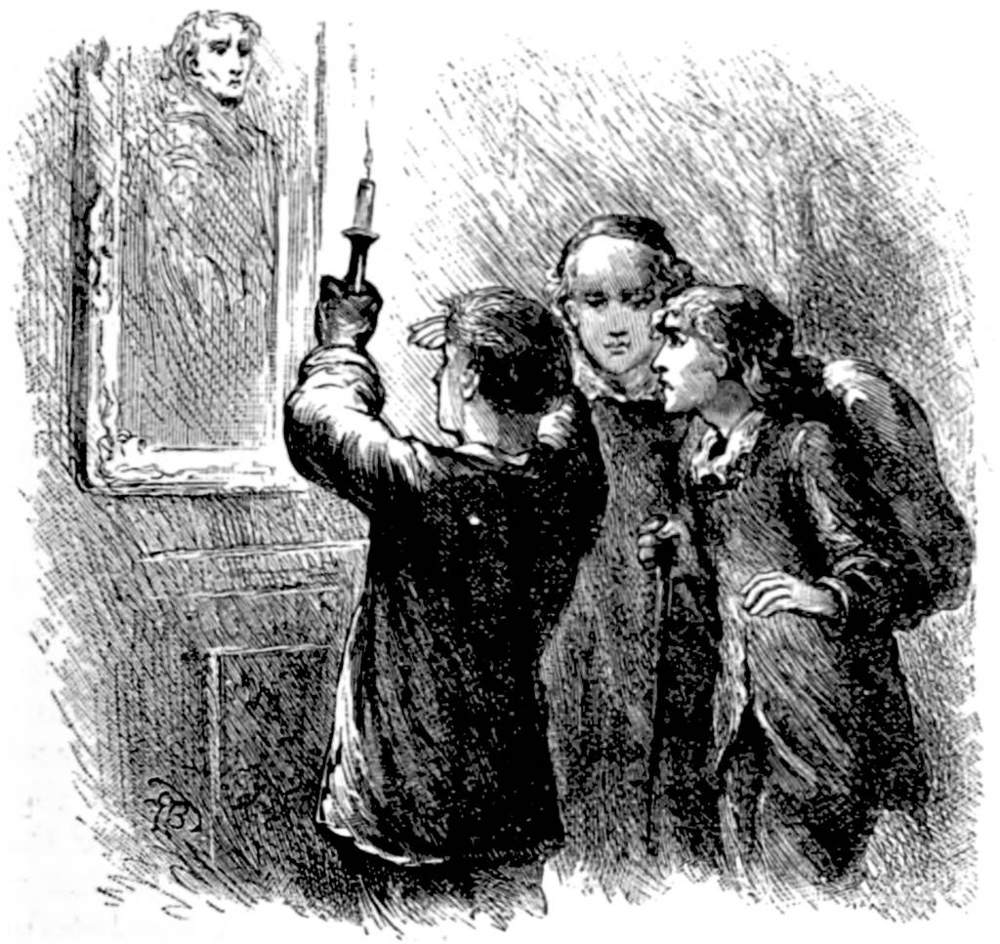

ᎾᏉᏃ ᎤᏪᏅᏒᎩ ᎬᏂ ᏭᎷᏥᎸ ᎠᏁᏢᏗᏍᎩ ᎦᏁᎸᎢ, (ᎾᏍᎩ ᎯᎠ ᎠᏁᏢᏗᏍᎩ ᏣᏗᎭ ᎦᎸᏉᏗᏳ ᎠᏖᏅᏙ ᎦᏛᎦ.) ᎾᎿᏃ
ᎤᏩᎫᏗᎶᏛ ᎤᏩᏂᎸᎩ. ᎪᎯᏃ ᎢᏴᏛ ᎩᎶ ᎢᏳᏍᏗ ᎦᎶᎯᏍᏗᏱ ᏓᏳᎷᏥᎸᎩ, ᎦᎪ ᎢᏳᏍᏗ ᎡᏙᎠ ᏓᏳᏛᏂᎸᎩ.

Then he went on till he came at the house of the *Interpreter*, where he
knocked over and over; at last one came to the door, and asked Who was
there?

ᏧᏁᎶᏗ. ᎠᏂᏍᎩᏂ ᎦᏙᎦ ᎡᏙᎯ, ᎠᏂᏃ ᎦᏁᎳ ᏗᎾᏓᎦᏔᎯ ᎠᎩᏁᏤᎸᎩ ᎠᏂ ᎠᎩᎶᎯᏍᏙᏗᏱ, ᎠᏋᏒ ᎣᏍᏛ
ᎢᏯᏆᎵᏍᏓᏁᏗᏱ; ᎾᏍᎩᏃ ᎢᏳᏍᏗ ᎠᏆᏚᎵᎭ ᎦᏁᎳ ᏥᏯᎵᏃᎮᏙᏗᏱ.

Chr. Sir, here is a Traveller, who was
bid by an acquaintance of the good man of this house to call here for my
profit; I would therefore speak with the Master of the house.

ᎾᏉᏃ ᎦᎶᎯᏍᏗᏱ ᏓᏳᎷᏨᎯ ᎦᏁᎳ ᏭᏯᏅᎲᎩ, ᎾᏍᎩᏃ ᎪᎯ ᎢᏴᏛ ᎤᎷᏤᎸᎩ ᏧᏁᎶᏗ, ᎠᎴ ᎢᏳᏍᏗ ᎤᎸᏏᎸ ᎤᏛᏛᏅᎩ.

So he called for the Master of the house, who after a little time came
to *Christian*, and asked him what he would have?

ᏧᏁᎶᏗ. ᎠᏴᏍᎩᏂ ᎠᏲᎱᎯᏍᏗᏱ ᏗᎦᏚᎲ ᏅᏛᎩᎶᏒᎯ, ᎠᎴ ᏌᏯᏂ ᏦᏓᎸ ᏫᏥᎦᏗ; ᎯᎠᏃ ᎦᏅᏅ ᎠᏓᎴᏂᏍᎬ ᎦᎶᎯᏍᏗᏱ
ᏥᎪᏢᎭ, ᎠᏍᎦᏯ ᎾᎿᏂ ᎠᎦᏘᏯ ᎠᎩᏁᏤᎸᎩ, ᎠᏂ ᎠᎩᎶᎯᏍᏙᏗᏱ ᎠᎴ ᏂᎯ ᎪᎱᏍᏗ ᎣᏍᏛ ᏗᎨᏍᎩᎾᏄᎪᏫᏎᏗ ᎨᏒᎢ
ᎠᎩᏃᏁᎸᎩ, ᎾᏍᎩ ᎤᏣᏘ ᎠᏆᎵᏍᏕᎸᏙᏗ ᎦᎢᏒᎢ.

Chr. Sir, said *Christian*, I am a man
that am come from the City of *Destruction*, and am going to the Mount
*Zion*; and I was told by the Man that stands at the Gate at the head of
this way, that if I called here, you would shew me excellent things,
such as would be a help to me in my Journey.

ᎠᏁᏢᏗᏍᎩ. ᎡᎯᏴᎭ ᎪᎱᏍᏗ ᎤᏣᏘ ᏣᎵᏍᏕᎸᏙᏗ ᏙᏓᎬᎾᏄᎪᏫᏎᎵ. ᎾᏍᎩᏃ ᎤᏅᏏᏓᏍᏗ ᎤᏁᏤᎸᎩ ᎤᏨᏍᏙᏗᏱ, ᏧᏁᎶᏗᏃ
ᏍᎩᏍᏓᏩᏚᎦ ᎤᏬᏎᎸᎩ; ᎾᏍᎩᏃ ᎤᏕᎵᏛ ᎧᏅᏑᎸ ᏭᏘᏅᏍᏔᏅᎩ, ᎤᏅᏏᏓᏍᏗᏃ ᎦᎶᎯᏍᏗ ᎤᏍᏚᎢᏍᏗᏱ ᎤᏁᏤᎸᎩ;
ᎤᏍᏚᎢᏒᏃ ᏧᏁᎶᏗ ᏭᎪᎲᎩ ᏴᏫ ᎤᏙᎵᏍᏙᏍᏛ ᏗᏟᎶᏍᏔᏅᎯ, ᎾᎿ ᎧᏅᏑᎸ ᎦᏛᎩ; ᎯᎠᏃ ᏄᏍᏛᎩ;
ᏘᎦᏙᎵ ᎦᎸᎳᏗ ᏧᏫᏓᎧᏃ ᎾᏍᎩᏯ ᏂᏚᏩᏅᎩ, ᏫᎬᏩᏓᎪᎾᏛᏛᏃ ᎣᏍᏛ ᎪᏪᎵ ᎤᏒᎦᎸᎩ, ᏚᏳᎪᏛᏃ ᏗᎦᎿᏩᏛᏍᏗ
ᏚᎭᏁᎦᎸ ᎪᏪᎸᎩ, ᎡᎶᎯᏃ ᎤᏐᎭᏛ ᎢᏗᏢ ᏄᏩᏁᏛᎩ; ᎦᏙᎬᏃ ᏴᏫ ᏥᏓᏍᏗᏰᏗᏍᎪ ᎾᏍᎩᏯ ᏄᏛᏅᎩ, ᎠᏍᎪᎵᏃ ᎦᎸᎳᏗᏢ
ᎠᎵᏍᏚᎶ ᎠᏕᎸ ᏓᎶᏂᎨ ᎪᏢᏔᏅᎯ ᎦᏛᎩ.

Inter. Then said the *Interpreter*, Come
in, I will shew thee that which will be profitable to thee. So he
commanded his man to light the Candle, and bid *Christian* follow him,
so he had him into a private room, and bid his man open a door; the
which when he had done, *Christian* saw the Picture of a very grave
Person hang up against the wall; and this was the fashion of it. It had
eyes lifted up to Heaven, the best of Books in his hand, the Law of
Truth was written upon his lips, the The World was behind his back. It
stood as if it pleaded with men, and a Crown of Gold did hang over his
head.

ᏧᏁᎶᏗᏃ ᎦᏙ ᎦᏛᎦ ᎯᎠ ᎤᏛᏅᎩ?

Chr. Then said *Christian*, What means
this?

ᎠᏁᏢᏗᏍᎩ. ᎾᏍᎩ ᎠᏍᎦᏯ ᎯᎠ ᏣᎦᏟᎶᏍᏔᏅᎯ ᏥᎩ, ᎤᏎᎦᏨᎯ ᎨᎶ ᏴᏫ ᎠᏁᎲᎢ. ᎾᏍᎩ ᏥᎪᏩᏘᎭ ᎦᎸᎳᏗ ᏧᏫᏓᎧᏅ,
ᎠᎴ ᏭᏓᎪᎾᏛᏛ ᎣᏍᏛ ᎪᏪᎵ ᏧᏒᎦᎸ, ᎠᎴ ᏚᏳᎪᏛ ᏗᎧᎿᏩᏛᏍᏗ ᏚᎭᏁᎦᎸ ᏥᎪᏪᎳ, ᎾᏍᎩ ᏣᏃᏁᎭ ᏄᏍᏛ ᏧᎸᏫᏍᏓᏁᏗ
ᎤᎲᎢ, ᎾᏍᎩ ᎤᏕᎵᏛ ᎤᏕᎶᎰᎯᏍᏗ ᎠᎴ ᎠᏍᎦᎾ ᏧᏂᎸᏫᏍᏓᏁᎯ ᏧᎾᏄᎪᏫᏎᏗᏱ; ᎠᎴ ᎾᏍᏉ ᏥᎪᏩᏘᎭ ᏴᏫ
ᏥᏓᏍᏘᏰᏗᏍᎪ ᎾᏍᎩᏯ ᏄᏛᏅ ᎦᏙᎬᎢ. ᎾᏍᎩᏃ ᏥᎪᏩᏗ ᎡᎶᎯ ᎤᏐᎭᏛ ᎢᏗᏢ ᏥᏄᏩᏁᏗ, ᎠᎴ
ᎠᎵᏍᏚᎶ ᎠᏕᎸ ᏓᎶᏂᎨᏍᏛᎭ ᎠᏍᎪᎵ ᎦᎸᎳᏗᏢ ᏥᎦᏔ; ᎾᏍᎩ ᏣᏃᏁᎯ ᏂᎦᎥ ᎠᏂ ᎡᎶᎯ ᎡᎯ ᎡᏍᎦ ᎤᏰᎸᏅᎯ, ᎠᎴ
ᎤᏂᏆᏗᎸᎯ ᏥᎩ, ᏥᏅᏗᎦᎵᏍᏙᏗᎭ ᎤᏅᏏᏓᏍᏗ ᎪᎱᏍᏗ ᎤᏛᏁᏗᏱ ᎤᏚᎵᏍᎬᎢ, ᎤᏓᎷᎶᏗ ᏂᎨᏒᎾ ᎨᏒ ᎦᎸᏉᏗᏳ
ᎠᎦᎫᏴᏓᏁᏗᏱ ᎤᏓᏁᏟᏴᏍᏗ ᏂᎦᎵᏍᏓᏂᎸᎭ. ᎾᏉᏃ ᎠᏁᏢᏗᏍᎩ ᎯᎠ ᏄᏪᏒᎩ, ᎯᎠᏍᎩᏂ ᏂᎦᎵᏍᏙᏓ ᏥᎬᎾᏄᎪᏫᏏ
ᎯᎠ ᏴᏫ ᏗᏟᎶᏍᏓᏅᎯ, ᎾᏍᎩᏍᎩᏂ ᎠᏍᎦᏯ ᎠᏂ ᏥᏓᎦᏟᎶᏍᏗ ᎤᏩᏒᎯᏳ ᎤᎬᏫᏳᎯ ᎾᎿ ᏫᎦᏛ ᎡᎯ ᎤᏁᏤᎸ ᏣᏎᎮᏗᏱ
ᏂᎦᎥ ᎤᏦᏍᏗ ᏕᏣᏠᏏᏙᎲ ᏎᎢᏒᎢ: ᎾᏍᎩ ᎢᏳᏍᏗ ᎣᏍᏛ ᎭᎦᏌᏯᏍᏓ ᎬᏯᏎᎮᎸᎢ, ᎠᎴ ᏣᏅᏘᏳ ᎨᏎᏍᏗ ᏄᏍᏛ ᏣᎪᎲᎢ,
ᎢᎸᎯᏢᏰᏃ ᎭᎢᏒ ᏱᏂᎦᎨᎯᏩᏛᏓ ᎤᎾᏠᎾᏍᏗ ᎠᎾᏓᏎᎮᎯ, ᎾᏍᎩ ᎠᏲᎱᎯᏍᏗᏉ ᏫᎦᏄᎪᎬ ᎬᏩᎾᏓᏎᎮᏗ ᏥᎩ.

Inter. The Man whose Picture this is, is
one of a thousand; he can beget children, travel in birth with children,
and nurse them himself when they are born. And whereas thou seest him
with his eyes lift up to Heaven, the best of Books in his hand, and the
Law of Truth writ on his lips, it is to shew thee that his work is to
know and unfold dark things to sinners; even as also thou seest him
stand as if he pleaded with men; and whereas thou picture seest the
World as cast behind him, and that a Crown hangs over his head, that is
to shew thee that slighting and despising the things that are present,
for the love that he hath to his Master’s service, he is sure in the
world that comes next to have Glory for his reward. Now, said the
*Interpreter*, I have shewed thee this Picture first, because the Man
whose Picture this is, is the only man whom the Lord of the place
whither thou art picture going, hath authorized to be thy guide in all
difficult places thou mayest meet with in the way; wherefore take good
heed to what I have shewed thee, and bear well in thy mind what thou
hast seen, lest in thy Journey thou meet with some that pretend to lead
thee right, but their way goes down to death.

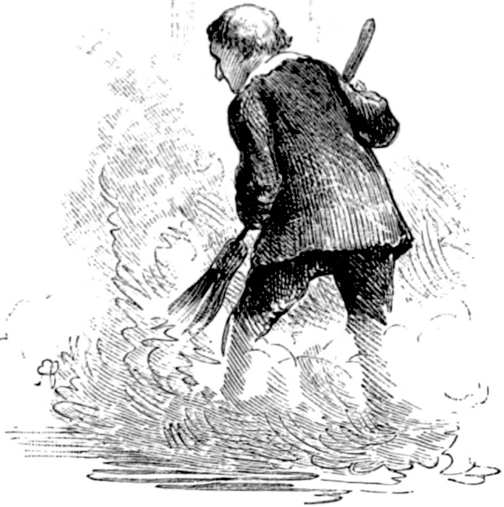

ᎾᏆᎴ ᎠᎪᏯᏁᏒᎩ, ᎠᎴ ᎤᏔᏅ ᎧᏅᏑᎸ ᏩᎪᏱᏅᏍᏔᏅᎩ, ᎾᎿ ᎤᏣᏘ ᎪᏍᏚ, ᎠᎴ ᎦᏓ ᎦᎳᎨᏴᎩ, ᏅᏓᎦᎵᏍᏙᏗᏍᎬᎩ
ᎯᎸᎯᏳ ᎬᏃᏌᎲᎯ ᏂᎨᏒᎾ ᎨᏒᎢ; ᎾᎿᏃ ᏞᎦ ᎤᏂᎪᎵᏰᎥ ᎠᏁᏢᏗᏍᎩ ᏭᏯᏅᎲᎩ ᎠᏍᎦᏯ ᎬᏃᏌᏍᎩ. ᎤᎴᏅᎲᏃ
ᎬᏃᏌᏍᎬ ᎤᏣᏛᎩ ᎪᏍᏚ ᎤᎵᎪᏛᏅᎩ, ᏧᏁᎶᏘᏃ ᎠᎴᏉ ᏄᏩᏬᏍᏔᏅᎩ ᎠᎵᎪᏛᏍᎬᎢ. ᎠᏛᏃ ᎾᎥ ᎥᎦᏙᎬᎩ,
ᎠᏁᏢᏗᏍᎩᏃ ᎯᎠ ᏄᏪᏎᎸᎩ ᎠᎹ ᏫᏁᎩ, ᎠᎴ ᎯᏍᏚᏟᎦ ᎠᏂ ᎦᏅᏑᎸᎢ; ᎾᏍᎩᏃ ᏄᏛᏁᎸ
ᏄᎵᎪᏛᏅᎾ ᎤᏅᏃᏌᎰᏅᎩ.

Then he took him by the hand, and led him into a very large *Parlour*
that was full of dust, because never swept; the which after he had
reviewed a little while, the *Interpreter* called for a man to sweep.
Now when he began to sweep, the dust began so abundantly to fly about,
that *Christian* had almost therewith been choaked. Then said the
*Interpreter* to a *Damsel* that stood by, Bring hither the Water, and
sprinkle the Room; the which when she had done, it was swept and
cleansed with pleasure.

ᏧᏁᎶᏗᏃ ᎤᏛᏛᏅᎩ ᎦᏙ ᎦᏛᎦ ᎯᎠ ᎤᏛᏅᎩ?

Chr. Then said *Christian*, What means
this?

ᎠᏁᏢᏗᏍᎩ. ᎯᎠᏍᎩᏂ ᎧᏅᏑᎸ ᏴᏫ ᎤᏓᏅᏙ ᎦᏃᎮᏛ ᎣᏍᏛ ᎤᏬᏢᎯᏌᏁᎸᎯ ᏂᎨᏒᎾ. ᎯᎠᏃ ᎪᏍᏚ ᎠᏍᎦᎾ ᎤᏪᎲᎢ, ᎠᎴ
ᎭᏫᏂ ᎤᏲᎢᏳ ᎨᏒᎢ, ᎾᏍᎩ ᏂᎬ ᏴᏫᎯ ᎦᏓᎭ ᎢᎬᏩᏁᏘ ᏥᎩ. ᎢᎬᏱᏃ ᏧᏩᏃᏌᎲᎩ ᏗᎧᎿᏩᏛᏍᏗ; ᎠᎹᏍᎩᏂ ᏧᏅᏦᎸᎩ,
ᎠᎴ ᏧᏍᏚᎵᏙᎸᎩ, ᎾᏍᎩ ᎣᏍᏛ ᎦᏃᎮᏛ. ᎾᏍᎩᏃ ᏥᏣᎪᎲᎩ, ᎢᎬᏱ ᎤᎴᏅᎲ ᎬᏃᏌᏍᎬᎢ, ᎪᏍᏚ ᎤᏣᏘ ᏧᎵᎪᏛᏅᎩ,
ᎠᎴ ᎾᏍᎩ ᏰᎵ ᎬᏩᏃᏌᎰᎲᏍᏗ ᏂᎨᏒᎾ ᏥᏄᎵᏍᏔᏅᎩ, ᎠᎴ ᎠᎴᏉ ᏥᏂᏣᏬᏍᏔᏅᎩ ᎠᎵᎪᏛᏍᎬᎢ; ᎾᏍᎩ ᏣᏃᏁᎯ,
ᏗᎧᎿᏩᏛᏍᏗ ᏚᎸᏫᏍᏓᏁᎲ ᏂᎦᏅᎦᎵᏍᎬᎾ ᎨᏒ ᎠᏓᏅᏙ ᎠᏍᎦᎾ ᏚᎸᏫᏍᏓᏁᎸᎢ, ᎬᏃᎯᏍᏗᎭᏉᏍᎩᏂ, ᎠᎴ
ᎠᎵᏂᎪᎯᏍᏗᎭ, ᎠᎴ ᎠᏍᎦᎾ ᎧᏁᏉᎠ, ᎾᏍᎩ ᎤᏓᏅᏙᎩᎯ ᎤᏓᏅᏍᏙᏒᎯ ᎨᏒ ᎦᎾᏄᎪᏫᏍᎬᎢ,
ᏝᏰᏃ ᏰᎵ ᏱᏄᎵᏂᎬᎦ ᎤᏎᎪᎩᏍᏗᏱ.

Inter. The *Interpreter* answered, This
*parlour* is the heart of a man that was never sanctified by the sweet
Grace of the Gospel: the *dust* is his Original Sin and inward
Corruptions, that have defiled the whole man. He that began to sweep at
first, is the Law; but she that brought water, and did sprinkle it, is
the Gospel. Now, whereas thou sawest that so soon as the first began to
sweep, the dust did so fly about that the Room by him could not be
cleansed, but that thou wast almost choaked there with; this is to shew
thee, that the Law, instead of cleansing the heart (by its working) from
sin, doth revive, put strength into, and increase it in the soul, even
as it doth discover and forbid it, for it doth not give power to subdue.

ᏔᎵᏁᏃ ᏨᎯᎪᎥᎩ ᎠᏛ ᎠᎹ ᏧᏍᏚᏢᎩ, ᎠᎴ ᎾᏉ ᏄᏦᎢᏎᏛᎾ ᏥᏄᎵᏍᏓᏅᎩ ᎬᏃᏌᏍᏗᏱ, ᎾᏍᎩᏍᎩᏂ ᎯᎠ ᏣᏃᏁᎯ, ᎣᏍᏛ
ᎦᏃᎮᏛ ᎠᏓᏅᏙᎩᎯ ᏫᎦᎷᏥᎦ ᎠᏍᎦᎾ ᎠᎦᏓᎵᏁᎯᏕᎰᎢ, ᎠᎴ ᎠᏥᏎᎪᎩᏍᎪᎢ, ᎾᏍᎩᏃ ᎠᎪᎯᏳᎲᏍᎬ ᎠᏓᏅᏙ
ᎠᏓᏅᎦᎵᏍᎪᎢ; ᎠᎴ ᎣᏏᏳ ᏂᎦᎵᏍᏗᏍᎪ ᎦᎸᏉᏗ ᎤᎬᏫᏳᎯ ᎤᏕᏘᏱ. ᏣᏂ 15:3. ᎨᏥᏅᏏᏛ
15:9. ᏣᏂ 15:13.

Again, as thou sawest the Damsel sprinkle the room with Water, upon
which it was cleansed with pleasure; this is to shew thee, that when the
Gospel comes in the sweet and precious influences thereof to the heart,
then I say, even as thou sawest the Damsel lay the dust by sprinkling
the floor with Water, so is sin vanquished and subdued, and the soul
made clean, through the faith of it, and consequently fit for the King
of Glory to inhabit. \[John 15:3, Acts 15:9, John
15:13\]

# ᎠᏂᏔᎵ ᏗᏂᏲᎵ

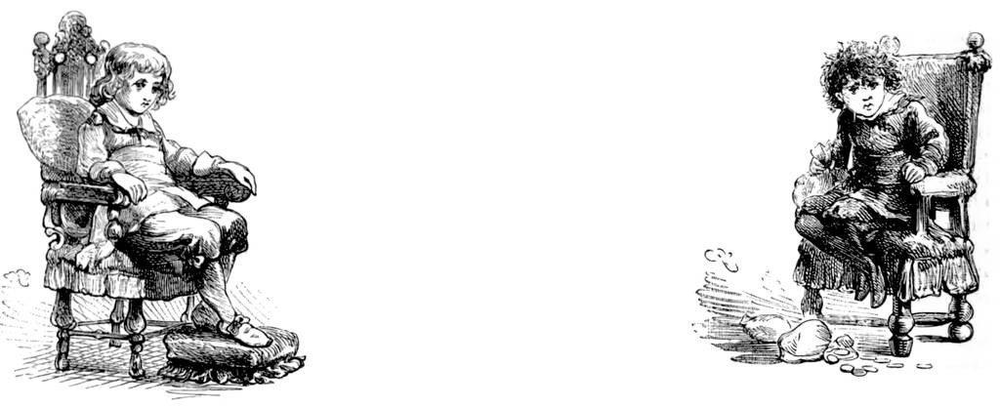

ᎠᎴ ᎠᏏ ᎠᎩᎪᎲᎩ ᎦᏍᎩᏓᏍᎬ ᎠᏁᏢᏗᏍᎩᏃ ᎤᏬᏯᏁᏒᎩ ᏧᏁᎶᏗ, ᎠᎴ ᎤᏍᏗ ᎦᏅᏑᎸ ᏭᏴᏔᏅᎩ, ᎾᎿᏃ ᏚᏃᎸ ᎠᏂᏔᎵ
ᏗᏂᏲᎵ, ᏧᎾᏁᎳᎩᎭ ᏚᎾᏍᎩᎸᎩ. ᎤᏓᏂᎵᎨᏃ ᎤᎿᎸᏣᏘ ᏚᏙᎥᎩ, ᏐᎢᏃ ᎬᏂᏗᏳ ᏚᏙᎥᎩ. ᎤᎿᎸᏣᏘᏃ ᎤᏣᏘ
ᎠᎵᏑᎵᎪᎨᏍᎩ ᏅᏩᏍᏛᎩ, ᎬᏂᏗᏳᏍᎩᏂ ᎡᎳᏪᏉ ᎨᏒᎩ.

I saw moreover in my Dream, that the *Interpreter* took him by the hand,
and had him into a little room, where sat two little Children, each one
in his chair. The name of the eldest was *Passion*, and the name of the
other *Patience*. *Passion* seemed to be much discontent; but *Patience*
was very quiet.

ᎾᏉᏃ ᏧᏁᎶᏗ ᎤᏛᏛᏅᎩ ᏗᎵᏰᎢᎸᏍᏗᏍᎬ ᎤᎿᎸᏣᏘ ᏂᎦᎥ ᎠᎵᏑᎵᎪᎨᏍᎬᎢ.

Then *Christian* asked, What is the reason of the discontent of
*Passion*?

ᎠᏁᏢᏗᏍᎩᏃ ᏧᏁᏨ ᎯᎠ ᏄᏪᏒᎩ, ᎤᎾᏓᏅᏖᎮᎵᏕᎯᏍᎩᏂ ᎤᏚᎵᎭ ᎤᎧᏘᏗᏍᏗᏱ ᎤᏤᎵᎦ ᎣᏌᏂ ᎠᏥᏁᏗᏱ ᎬᏂ ᏔᎵᏁ
ᏩᏓᎴᏂᏍᎬ ᎤᏕᏘᏴᏌᏗᏒᎢ; ᎠᏎᏃ ᎪᎯᏉ ᎨᏒ ᏂᎦᏛ ᎤᏚᎵᎭ; ᎬᏂᏗᏳᏍᎩᏂ ᎣᏏᏉ ᎤᏰᎸᎭ ᎤᎧᏘᏗᏍᏗᏱ.

The *Interpreter* answered, The Governor of them would have him stay for
his best things till the beginning of the next year; but he will have
all now; but *Patience* is willing to wait.

ᎾᏉᏃ ᎥᏥᎪᎥᎩ ᎠᏏᏴᏱ ᎤᎷᏤᎸᎩ ᎤᎿᎸᏣᏘ ᎠᎴ ᎤᏲᎮᎸᎩ ᏕᎦᎶᏗ ᎠᎧᎵ ᏧᎬᏩᎶᏗ, ᎠᎴ ᏚᎳᏍᎬ ᎤᏪᏐᏅᏴᎩ: ᎾᏍᎩᏃ
ᎤᏭᏖᏒᎩ ᎠᎴ ᎤᎵᎮᎵᏨᎩ, ᎠᎴ ᎤᏰᏣᏍᏔᏅᎩ ᎠᏙᏢᏗᏍᎬ ᎬᏂᎯᏳ. ᎠᏎᏃ ᏄᏬᎯᏨᎾᏉ ᏫᏓᏆᎧᎿᏅ ᏂᎦᏛ ᎤᏤᏬᏅᎯ
ᎨᏒᎩ, Ꮭ ᎠᎴ ᎪᎱᏍᏗ ᏳᏘᏰᎴ ᏧᏓᏓᎦᎸᎢᏛ ᏗᏄᏬ ᎤᏩᏒ.

Then I saw that one came to Passion, and brought him a bag of treasure,
and poured it down at his feet, the which he took up and rejoiced
therein; and withal, laughed Patience to scorn. But I beheld but a
while, and he had lavished all away, and had nothing left him but Rags.

ᎾᏉᏃ ᏧᏁᎶᏗ ᎯᎠ ᏄᏪᏎᎸᎩ ᎠᏁᏢᏗᏍᎩ, ᎤᏟ ᎢᎦ ᏗᏍᏉᏏᏌᏏ ᎯᎠ ᏥᏄᏍᏗ.

Chr. Then said *Christian* to the
*Interpreter*, Expound this matter more fully to me.

ᎠᏁᏢᏗᏍᎩᏃ ᎯᎠ ᏄᏪᏒᎩ, ᎯᎠ ᎠᏂᏔᎵ ᎠᏂᏧᏣ ᏓᏟᎶᏍᏗᏉ; ᎤᎿᎸᏣᏗ ᎡᎶᎯᏉ ᎤᏩᏒ ᎠᎾᏓᏅᏖᏍᎩ ᏥᎩ ᏕᎨᎦᏟᎶᏍᏗ,
ᎬᏂᏗᏳᏃ, ᎤᏓᏁᏟᏴᏍᏗ ᏥᎩ ᎠᎾᏓᏅᏖᏍᎩ ᏕᎨᎦᏟᎶᏍᏗ: ᎯᎪᏩᏘᎭᏰᏃ ᎤᎿᎸᏣᏘ ᏂᎦᏛ ᎤᏚᎵᎭ ᎪᎯᏉ ᎤᏕᏗᏚᏌᏗᏒᎢ,
ᎾᏍᎩ ᎯᎠ ᎦᏛᎦ ᎠᏂᏉ ᎡᎶᎯ ᎨᏒᎢ; ᎾᏍᎩᏰᏃ ᏄᎾᏍᏗ ᎠᏂᏉ ᎡᎶᎯ ᎤᏩᏒ ᎠᎾᏓᏅᏖᏍᎩ, ᎪᎯᏉ ᎨᏒ ᎤᎾᏚᎵᏍᎪ
ᏂᎦᏛ ᎤᎾᏤᎵᎦ ᎣᏍᏛ, ᎥᏝᏰᏃ ᎬᏩᏂᎦᏘᏗᏍᏗ ᏱᎨᏐ ᏔᎵᏁ ᎤᏕᏘᏴᏗᏱ, ᎤᎾᏤᎵᎦ ᎨᏒ ᎣᏍᏛ ᎤᏂᏩᏛᏗᏱ, ᎾᏍᎩ
ᎦᏛᎦ ᎤᏓᏁᏟᏴᏍᏗ ᎨᏒᎢ.

Inter. So he said, These two Lads are
figures: *Passion*, of the men of this world; and *Patience*, of the men
of that which is to come; for as here thou seest, *Passion* will have
all now this year, that is to say, in this world; so are the men of this
world: they must have all their good things now, they cannot stay till
next year, that is, until the next world, for their portion of good.

ᎡᏘ ᎢᏳᏂᏪᏍᏗ ᏥᎨᏎ ᏌᏉ ᏥᏍᏆ ᏲᏒᎦᎸ ᎤᏟ ᎢᎦ ᏧᎬᏩᎶᏗ, ᎡᏍᎦᏉ ᎠᏂᏓᎵ ᎤᏪᏲᏔᏛᏉ ᎠᏏ ᏳᎾᎩᎳ, ᎤᏟ
ᎦᎸᏉᏗᏳ ᎤᏂᏰᎸᎭ ᎡᏍᎦᏉ ᏂᎦᏛ ᎤᏁᎳᏅᎯ ᎤᏁᏨᎯ ᎦᏃᎮᏍᎬ ᎣᏍᏛ ᏗᏍᏆᏂᎪᏛ ᎤᏓᏁᏟᏴᏍᏗ
ᏂᎦᎵᏍᏔᏂᎸᎭ. ᎠᏎᏃ ᏨᏣᎪᎲᎩ ᎾᏞᎬᏉ ᏧᏤᏬᏅᎩ, ᎠᎴ ᎪᎱᏍᏗ ᏄᏘᏰᎸᎾ ᏥᎨᏒᎩ ᏧᏓᏓᎦᎸᎢᏛ
ᏗᏄᏬ ᎤᏩᏒ, ᎾᏍᎩᏯᏍᎩᏂ ᏅᏓᏳᎾᎵᏍᏓᏁᎵ ᏂᎦᏛ ᎾᏍᎩ ᎢᏳᎾᏍᏗ ᏴᏫ ᎯᎠ ᎡᎶᎯ ᎠᎵᏍᏆᏛᎭ.

That proverb, *A Bird in the Hand is worth two in the Bush*, is of more
authority with them than are all the Divine testimonies of the good of
the world hand to come. But as thou sawest that he had quickly lavished
all away, and had presently left him nothing but Rags; so will it be
with all such men at the end of this world.

ᏧᏁᎶᏗ. ᎾᏉ ᏥᎪᏩᏗᎭ ᎬᏂᏗᏳ ᎤᏟ ᎠᎦᏔᎾᎢᏳ ᎨᏒᎢ, ᎠᎴ ᎢᎸᏍᎩ ᎢᏳᏓᎴᎩ ᏅᏗᎦᎵᏍᏙᏗᏍᎬᎢ. ᎢᎬᏱ,
ᏂᎦᎵᏍᏙᏗᎭ ᎠᎦᏘᏗᏍᎬᏉ ᎤᏤᎵᎦ ᎣᏌᏂ ᎠᏥᏁᏗᏱ. ᏔᎵᏁ ᎠᎴ ᎾᏍᏉ ᏅᏗᎦᎵᏍᏙᏗᎭ ᎤᏤᎵᎦ
ᎨᏒ ᎠᎵᎮᎵᎨᏍᏗ ᎾᏗᏳ ᏐᎢ ᎪᎱᏍᏗ ᏄᎲᎾ ᏥᎨᏎᏍᏗ ᏧᏓᏓᎦᎸᎢᏛ ᎤᏩᏒ.

Chr. Then said *Christian*, Now I see
that *Patience* has the best wisdom, and that upon many accounts. 1.
Because he stays for the best things, 2. And also because he will have
the Glory of his, when the other has nothing but Rags.

ᎠᏁᏢᏗᏍᎩ. ᎥᏝ ᎠᎴ ᎾᏍᎩᏉ ᏱᏂᎦᎥ ᎠᏏᏰᏃ ᏴᎯᏁᏉᏣ ᎯᎠ ᏱᏅᎯᏫ, ᎦᎸᏉᏗᏳ ᏔᎵᏁ ᏩᏕᏂᎯᏍᏗ ᏗᎨᏒ ᎥᏝ ᎯᎸᎯᏳ
ᏴᎬᏲᎩ, ᎯᎠᏍᎩᏂ ᎾᏞᎬᏉ ᏛᎦᎶᏐᏂ. ᎾᏍᎩᏃ ᎢᏳᏍᏗ ᎤᎿᎸᏣᏗ ᎥᏝ ᎬᏩᏰᏣᏍᏙᏗ ᏱᏂᎦᎵᏍᏗᎭ ᎬᏂᏗᏳ,
ᏂᎦᎵᏍᏙᏗᏍᎬ ᎤᎿᎸᏣᏗ ᎢᎬᏱ ᎤᏩᏛᎲ ᎤᏤᎵᎦ ᎣᏍᏛ, ᎬᏂᏗᏳᏍᎩᏂ ᎤᏟ ᏅᏛᏰᏣᏍᏓᏂ
ᎤᎿᎸᏣᏗ ᏂᎦᎵᏍᏙᏗᏍᎨᏍᏗ ᎣᏂᏱ ᎠᏥᏁᎸ ᎤᏤᎵᎦ ᎣᏍᏛ; ᎢᎬᏱᏰᏃ ᎤᏜᏅᏓᏕᏗ ᏣᎢᏒ ᎣᏂᏱ, ᏂᎦᎵᏍᏙᏗ
ᎣᏂᏱ ᎠᏎ ᎤᏍᏆᎸᎡᏗ ᎨᏒ ᎤᎷᎯᏍᏗᏱ; ᎣᏂᏱᏍᎩᏂ ᎥᏝ ᎪᎱᏍᏗ ᏴᎬᏜᏅᏓᏗᏏ; ᏝᏰᏃ ᎪᎱᏍᏗ ᎤᏓᏁᏟᏴᏍᏓᏁᎯ ᏱᎩ;
ᎩᎶᏃ ᎢᎬᏱ ᎤᏚᎸᏛ ᏱᎩ ᎤᏤᎵᎦ ᎨᏒᎢ, ᎠᏎ ᎤᏜᏅᏓᏕᏗ ᎤᏤᏩᏍᏗᏱ; ᎩᎶᏍᎩᏂ ᎤᎦᏗᏛᎯ ᎨᏎᏍᏗ ᎤᏤᎵᎦ ᎨᏒᎢ,
ᎾᏍᎩ ᎾᏲᎪ ᎠᎵᏍᏆᏗᏍᎩ ᏂᎨᏒᎾ ᎤᎮᏍᏗ: ᎾᏍᎩᏰᏃ ᎢᏳᏍᏗ ᎯᎠ ᏥᎾᏥᏪᏎᎴ ᎤᏪᎿᎢ, ᎠᏏ ᏨᏅᎩ ᎯᏩᏘᏍᎬᎩ ᏣᏤᎵᎦ
ᎣᏍᏛ, ᎠᎴ ᎾᏍᏉ ᎳᏏᎳ ᎤᏤᎵᎦ ᎤᏲ ᎠᏩᏘᏍᎬᎩ, ᎠᏎᏃ ᎾᏉ ᎢᎠᏥᏄᏬᎯᏍᏔᏅ, ᏂᎯᏃ ᎢᎡᏣᎩᎵᏲᎢᏍᏔᏅ. ᎷᎦ
16:25.

Inter. Nay, you may add another, to wit,
the first must glory of the *next* world will never wear out; but
*these* are suddenly gone, Therefore *Passion* had not but things so
much reason to laugh at *Patience*, because he had his good things
first, as *Patience* will have to laugh at *Passion*, because he had his
best things last; for *first* must give place to *last*, because *last*
must have his time to come: but last gives place to nothing; for there
is not another to succeed. He therefore that hath his portion *first*,
must needs have a time to spend it; but he that hath his portion *last*,
must have it lastingly; therefore it is said of *Dives, In thy lifetime
thou receivedst thy good things, and likewise* Lazarus *evil things; but
now he is comforted, and thou art tormented.* \[Luke
16:25\]

ᏧᏁᎶᏗ. ᎾᏉ ᎦᏕᎶᎣᏍᎦ ᎤᏟ ᎣᏏᏳ ᎨᏒ ᏃᏚᎸᎲᎥᏍᎬᎾ ᏱᎩ ᎪᎯᏉ ᎨᏒ ᏤᎾᎠ, ᎠᎦᏘᏗᏍᏗᏱᏍᎩᏂ ᎠᏏ ᎤᎷᎯᏍᏗ
ᏥᎩ.

Chr. Then I perceive ’tis not best to
covet things that are now, but to wait for things to come.

ᎠᏁᏢᏗᏍᎩ. ᏚᏳᎪᏛ ᏂᏫ: ᏄᏓᎴᏒᏰᏃ ᎠᎪᏩᏛᏗ ᏥᎩ ᎦᎶᏐᎲᏍᎩᏉ ᎢᎩ, ᎾᏍᎩᏍᎩᏂ ᎠᎪᏩᏛᏗ ᏂᎨᏒᎾ ᏥᎩ ᎾᏲᎪ
ᎠᎵᏍᏆᏗᏍᎩ ᏂᎨᏒᎾ 2 ᎪᎳᏂᏗ 4; 18. ᎾᏍᎩ ᎯᎠ ᎤᏙᎯᏳᎯ ᏄᏍᏗ, ᎠᏎᏃ ᎪᎯᏉ ᎨᏒ ᏤᎾᎠ, ᎤᏇᎵᏃ
ᎢᎦᏚᎸᎲᏗ ᎨᏒ ᎾᎥᏂ ᏂᏚᏓᎸ; ᎠᎴ ᎾᏍᏉ ᏂᎦᎵᏍᏙᏗ ᎠᏏ ᎤᎷᎯᏍᏗ ᏥᎩ, ᎠᎴ ᎤᏇᏓᎵ ᎤᏓᏅᏖᎵᏓᏍᏗ ᎨᏒ
ᏗᎬᏩᎾᏙᎵᏍᏗ ᏂᎨᏒᎾ ᏥᎩ; ᎾᏍᎩᏰᏃ ᎢᏳᏍᎢ ᎾᏍᎩ ᎯᎠ ᎢᎬᏱ ᏥᏥᏁᎢᏍᏓ ᎢᎬᏪᏅᏛ ᎣᏏᏳ
ᏓᎾᏓᏰᎸᏍᎪᎢ; ᏔᎵᏁᏃ ᏥᏥᏁᎢᏍᏓ ᎢᏅᎯᏳ ᏂᏚᏓᎸ ᏅᏩᏍᏗᏗᏐᏉ. ᎶᎻ 7:15-25.

Inter. You say truth: *For the things
which are seen are* Temporal; *but the things that are not temporal seen
are* Eternal. \[2 Corinthians 4:18\] But
though this be so, yet since things present and our fleshly appetite are
such near neighbors one to another; and, again, because things to come
and carnal sense are such strangers one to another; therefore it is that
the first of these so suddenly fell into *amity*, and that *distance* is
so continued between the second. \[Romans
7:15-25\]

# Notes

## Not an exact translation

This is not an exact translation between the two languages. In many
places the Cherokee text “skips” details or has other differences to
simplify the translation process or may have additional information
added related to context.

### Examples:

1.  ᎠᏴᏍᎩᏂ ᎠᏲᎱᎯᏍᏗᏱ ᏗᎦᏚᎲ …
    
    1.  ᎠᏴ (I) + ᏍᎩᏂ (but), ᎠᏲᎱᏍᏗᏱ (place of death), ᏗᎦᏚᎲ (city), …
    
    2.  But it is I the death place city …
    
    3.  I am a man that am come from the City of Destruction
        
        *In this example “I am a man” has become “But it is I” and “City
        of Destruction” has become “City of Death”.*

2.  ᎦᎢᏒᏃ ᎢᎾᎨ ᎠᏂ ᎡᎶᎯ …
    
    1.  ᎦᎢᏒ (I was walking) + Ꮓ (And) ᎢᎾᎨ (wilderness) ᎠᏂ (here) ᎡᎶᎯ
        (world) …
    
    2.  And I was walking the wilderness here (of) the world …
    
    3.  As I walk’d through the wilderness of this world …
        
        *In this example “walk’d through” has become “was walking” and
        “of this” has become “here”*

3.  … ᏍᏗᎪᎵᏯ ᎯᎠ ᎪᏪᎵ ᏥᏥᏁᎭ.
    
    1.  … ᏍᏗᎪᎵᏯ ᎯᎠ ᎪᏪᎵ ᏥᏥᏁᎭ.
    
    2.  … let you two read this book which-I-am-holding
    
    3.  … read it so, if you will, in my Book.
        
        *In this example “Read it so, if you will” has become “Let you
        two read” and “in my book” has become “this book
        which-I-am-holding”.*

## \-ᎥᎩ, -ᎥᎢ, -Ꭵ, -ᎡᎢ

The following shows the final suffixes *-vgi*, *-vi*, *-v*, *-ei* as
they were used in 1844. Even though it is not reflected in a lot of
modern teaching materials, there are communities which still use the -ᎥᎩ
suffix.

  - -Ꭵ  
    \[-v\] “did or was doing”

  - -ᎥᎩ  
    \[-vgi\] “did or was doing (with my
    personal knowledge or consciousness)”

  - -ᎡᎢ  
    \[-ei\] “did or was doing (without my
    personal knowledge or consciousness)”

  - -ᎥᎢ  
    \[-vi\] “his doing (already done)” *(This
    form should be treated as a noun in the text.)*

### Examples:

  - ᎧᏁᎪᎢ - “He is usually or on certain occasions speaking.”
    
      - ᎧᏁᎬ - “He was speaking.”
    
      - ᎧᏁᎬᎩ - “He was speaking (with my personal knowledge or
        consciousness).”
    
      - ᎧᏁᎨᎢ - “He was speaking (without my personal knowledge or
        consciousness).”
    
      - ᎧᏁᎬᎢ - “His word (that he was speaking).” *(This form should be
        treated as a noun.)*

  - ᎤᏁᏨ - “He spoke.”
    
      - ᎤᏁᏦᎢ - “He has spoken (habitually or on certain occasions).”
    
      - ᎤᏁᏨᎩ - “He spoke (with my personal knowledge or consciousness).”
    
      - ᎤᏁᏤᎢ - “He spoke (without my personal knowledge or
        consciousness).”
    
      - ᎤᏁᏤᏍᏗ - “He will have spoke.”
    
      - ᎤᏁᏨᎢ - “His word (that he spoke).” *(This form should be treated
        as a noun.)*

*Cherokee Messenger*, pg 30-32

## ᎨᏒᎢ, ᎨᏐᎢ …

The following indicates the main meanings for some of the more common
forms of “is” as found in the text.

  - ᎨᏒ  
    “was”

  - ᎨᏐᎢ  
    “is usually, is under certain conditions”

  - ᎨᏒᎩ  
    “was (with personal knowledge, or consciousness)”

  - ᎨᏎᎢ  
    “was (without personal knowledge, or consciousness)”

  - ᎨᏎᏍᏗ  
    “will be”

  - ᎨᏒᎢ  
    “being”

*Cherokee Messenger*, pg 30

## \-ᏍᎩᏂ

This suffix is used extensively throughout the text.

*This postfix is typically translated as ‘but’; when attached to a
question word, however, it often expresses ‘I wonder’.*

*A Reference Grammar of Oklahoma Cherokee (2015)* pg 209.

### Examples:

1.  From the text:
    
    1.  … ᎪᎱᏍᏗᏉᏍᎩᏂ ᎤᎵᏍᏓᏏ ᎤᏓᏅᏛ ᎠᏁᎵᏍᎬᎩ
        
        … but because they thought that some frenzy distemper had got
        into his head
        
        ᎪᎱᏍᏗ (something) + Ꮙ (just) + ᏍᎩᏂ (but)
    
    2.  … ᎯᎠᏃ ᏄᏪᏒᎩ, Ꭷ, ᎰᏩᏉ, ᎦᏕᎶᎣᏍᎦᏍᎩᏂ ᎠᏂ ᎪᏪᎵ ᏣᏆᏒᎦᏔ
        
        … He answered, Sir, I perceive by the Book in my hand, that I am
        condemned to die
        
        ᎦᏕᎶᎣᏍᎦ (I am finding out) + ᏍᎩᏂ (but)

2.  From the *Cherokee English Dictionary* (1972)
    
    1.  ᎦᏙᏍᎩᏂ ᎤᏍᏗ ᏄᏩᏁ ᏥᏚᎦᏍᏗᎭ. *(See ᏚᎦᏍᏗᎭ, pg 87)*
        
        I wonder what’s causing him to vomit.
        
        ᎦᏙ (what) + ᏍᎩᏂ (but)
    
    2.  ᎠᏣᎳᎩ ᎤᏴᏜ “ᏳᏂᏴᎭ” Ꮭ ᎤᏴᏜ ᏱᎦᏂᏱᏍᎪᎢ, ᎤᏴᏜᏍᎩᏂ ᎤᎬᏫᏍᏳᏐ ᎤᏂᏱᏍᎪᎢ. *(See ᎤᏴᏜ,
        pg 169)*
        
        Whenever a Cherokee “catches” a cold, he doesn’t catch the cold;
        rather, the cold catches him.
        
        ᎤᏴᏜ (cold) + ᏍᎩᏂ (but)

*Just because there is a “but” in the Cherokee text does not mean there
will be a matching “but”, “however”, etc, in the English text. The
reverse holds true as well.*

## Wordlist

Here are a few vocabulary words selected to help with the text. Where a
term has been included because of a dialectial difference between the
Pilgrim’s Progress and the *Cherokee English Dictionary* the *Cherokee
English Dictionary* entry is included for comparison.

Additionally, many clitics and word endings are also different from what
you will find in the *Cherokee English Dictionary* and some of these
have also been included for reference to assist the student.

  - -Ᏹ  
    \[-yi\] “Place of. Location.”
    
      - -Ꭲ  
        \[-i\] “Place of. Location.”

  - -Ꮙ  
    \[-gwo\] “Just. Only.”
    
      - -Ꮚ  
        \[-gwu\] “Just. Only.”

  - ᎠᏏ  
    \[a²si\] “Yet. Still.”
    
      - Ꮟ  
        \[si²³\] “Yet. Still.”

  - ᎠᏏᏉ  
    \[a²si²³gwo\] “Just yet. Yet again.”
    
      - ᎠᏏᏊ  
        \[a²si²³gwu\] “Just yet. Yet again.”

  - ᎤᏟ  
    \[u¹dli\] “More.”
    
      - ᎤᎪᏗ  
        \[u¹go³²di\] “More.”

  - ᎢᏗᏢ, ᏗᏢ  
    \[i²di³dlv, di³dlv\] “Toward.”
    
      - ᎢᏗᏜ, ᏗᏜ  
        \[i²di³dla, di³dla\] “Toward.”

  - ᎣᏍᏛ  
    \[o⁴sdv\] “Good.”
    
      - ᎣᏍᏓ  
        \[o⁴sda\] “Good.”

  - ᎤᏰᎸᏗ  
    \[u²yehl⁴di\] “Reason. Cause. Motive.”

  - ᎧᏃᎮᏛ  
    \[kạ²no²he²³dv\] “News.”
    
      - ᎧᏃᎮᏓ  
        \[kạ²no²he²³da\] “News.”

  - ᎬᏂᏳ  
    \[\] “Behold. Lo.”

  - ᎿᏉ  
    \[hna²³gwo\] “Now.”
    
      - ᏃᏊ  
        \[no²³gwu\] “Now.”

  - ᏂᎦᎵᏍᏙᏗ  
    \[\] “Because.”

# Creative Commons

This work is licensed under the
Creative Commons Attribution-Share Alike
3.0 United States License. To view a copy of this license,
visit <http://creativecommons.org/licenses/by-sa/3.0/us/> or send a
letter to Creative Commons, 171 Second Street, Suite 300, San Francisco,
California, 94105, USA.

$Revision: 1.43 $

$Date: 2016/01/03 00:19:52 $ UTC