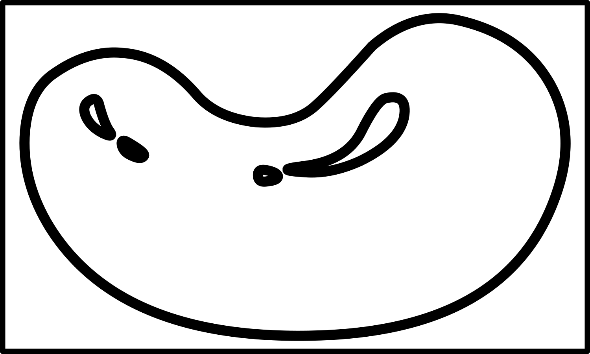

+++
draft = true
date = 2020-03-26T17:49:31Z
title = "ᎦᎵᏆᏚᏏᏁᎢ ᎠᏕᎶᏆᏍᏗ"
weight = 1585244970

[taxonomies]
authors = ["Michael Conrad"]
categories = ["Lessons", "Grammar"]
tags = []

[extra]
zulma_title="Cherokee Language Lessons 1"
featured_image = "lessons/Cherokee-Language-Lessons-Volume-1/Cherokee-Language-Lessons-Volume-1.png"

+++
## ᎦᏬᏂᏍᎬᎢ ᎠᎦᏔᎲᎢ (Grammar)

☞ *Remember that it is through the exercises in the lesson material that
you will learn how to understand and speak Cherokee, not by memorizing
rules and word parts.*

Each of the action words that you have learned so far are composed of
two main parts. A base word which indicates “an action” and one or more
prefixes which are used to indicate “who and whom”. The following list
shows this information for the forms of ᎠᎪᏩᏘᎭ you have been using.

☞ *Reminder: Cherokee does not differentiate based on sexual gender.*
*Where you see “he” or “him” in the following you can substitute “she”
or “her”.*
<!-- more -->
  - ᎠᎪᏩᏘᎭ \[Ꭰ + ᎪᏩᏘᎭ\] “He sees him or it.”
    
      - Ꭰ: “He + him or it.”
    
      - ᎪᏩᏘᎭ: “is seeing”

  - ᎠᏂᎪᏩᏘᎭ \[ᎠᏂ + ᎪᏩᏘᎭ\] “They see him or it.”
    
      - ᎠᏂ: “They + him or it.”
    
      - ᎪᏩᏘᎭ: “is seeing”

  - ᏓᎪᏩᏘᎭ \[Ꮥ + Ꭰ + ᎪᏩᏘᎭ\] “He sees them.”
    
      - Ꮥ: “More than one or once.”
    
      - Ꭰ: “He + him or it.”
    
      - ᎪᏩᏘᎭ: “is seeing”

  - ᏓᏂᎪᏩᏘᎭ \[Ꮥ + ᎠᏂ + ᎪᏩᏘᎭ\] “They see them.”
    
      - Ꮥ: “More than one or once.”
    
      - ᎠᏂ: “They + him or it.”
    
      - ᎪᏩᏘᎭ: “is seeing”

  - ᏥᎪᏩᏘᎭ \[Ꮵ + ᎪᏩᏘᎭ\] “I see him.”
    
      - Ꮵ: “I + him.”
    
      - ᎪᏩᏘᎭ: “is seeing”

  - Ꮵ̣ᎪᏩᏘᎭ \[Ꮵ̣ + ᎪᏩᏘᎭ\] “I see it.”
    
      - Ꮵ̣: “I + it.”
    
      - ᎪᏩᏘᎭ: “is seeing”

  - ᎦᏥᎪᏩᏘᎭ \[ᎦᏥ + ᎪᏩᏘᎭ\] “I see them-animate.”
    
      - ᎦᏥ: “I + them.”
    
      - ᎪᏩᏘᎭ: “is seeing”

  - ᏕᏥ̣ᎪᏩᏘᎭ \[Ꮥ + Ꮵ̣ + ᎪᏩᏘᎭ\] “I see them-inanimate.”
    
      - Ꮥ: “More than one or once.”
    
      - Ꮵ̣: “I + it.”
    
      - ᎪᏩᏘᎭ: “is seeing”

  - ᎯᎪᏩᏘᎭ \[Ꭿ + ᎪᏩᏘᎭ\] “You see him.”
    
      - Ꭿ: “You + him.”
    
      - ᎪᏩᏘᎭ: “is seeing”

  - Ꭿ̣ᎪᏩᏘᎭ \[Ꭿ̣ + ᎪᏩᏘᎭ\] “You see it.”
    
      - Ꭿ̣: “You + it.”
    
      - ᎪᏩᏘᎭ: “is seeing”

  - ᎦᎯᎪᏩᏘᎭ \[ᎦᎯ + ᎪᏩᏘᎭ\] “You see them-animate.”
    
      - ᎦᎯ: “You + them.”
    
      - ᎪᏩᏘᎭ: “is seeing”

  - ᏕᎯ̣ᎪᏩᏘᎭ \[Ꮥ + Ꭿ̣ + ᎪᏩᏘᎭ\] “You see them-inanimate.”
    
      - Ꮥ: “More than one or once.”
    
      - Ꭿ̣: “You + it.”
    
      - ᎪᏩᏘᎭ: “is seeing”

These prefixes which directly indicate the pairing of “who and whom” are
called *Bound Pronouns*.

Bound pronouns are also used on most description words like colors,
names for kinds of people, good, bad, and so forth.

Examples:

  - ᎠᎨᏯ “A woman. She’s a woman.” (Ꭰ + ᎨᏯ)
    
      - ᏥᎨᏯ “I’m a woman.” (Ꮵ + ᎨᏯ)
    
      - ᎯᎨᏯ “You’re a woman.” (Ꭿ + ᎨᏯ)

  - ᎠᏍᎦᏯ “A man. He’s a man.” (Ꭰ + ᏍᎦᏯ)
    
      - ᏥᏍᎦᏯ “I’m a man.” (Ꮵ + ᏍᎦᏯ)
    
      - ᎯᏍᎦᏯ “You’re a man.” (Ꭿ + ᏍᎦᏯ)

  - ᏣᎳᎩ “Cherokee.”
    
      - ᎠᏣᎳᎩ “He’s Cherokee.” (Ꭰ+ ᏣᎳᎩ)
    
      - ᏥᏣᎳᎩ “I’m Cherokee.” (Ꮵ + ᏣᎳᎩ)
    
      - ᎯᏣᎳᎩ “You’re Cherokee.” (Ꭿ + ᏣᎳᎩ)

<!-- end list -->

  - ᎩᎦᎨᎢ “Red.”
    
      - ᎠᎩᎦᎨᎢ “He’s red. A red person.” (Ꭰ + ᎩᎦᎨᎢ)
    
      - ᏥᎩᎦᎨᎢ “I’m red.” (Ꮵ + ᎩᎦᎨᎢ)
    
      - ᎯᎩᎦᎨᎢ “You’re red.” (Ꭿ + ᎩᎦᎨᎢ)

  - ᎬᎿᎨᎢ “Black.”
    
      - ᎠᎬᎿᎨᎢ “He’s black.” (Ꭰ + ᎬᎿᎨᎢ)
    
      - ᏥᎬᎿᎨᎢ “I’m black.” (Ꮵ + ᎬᎿᎨᎢ)
    
      - ᎯᎬᎿᎨᎢ “You’re black.” (Ꭿ + ᎬᎿᎨᎢ)

  - ᎣᏍᏓ “Good. He’s good. It’s good.”
    
      - ᎰᏍᏓ “You’re good.” (Ꭿ + ᎣᏍᏓ)
    
      - ᎠᏃᏍᏓ “They’re good.” (ᎠᏂ + ᎣᏍᏓ)

Bound Pronouns are also sometimes used to indicate someone is a type of
something or is a member of something like a clan.

Examples:

  - ᎩᏟ “A dog.”
    
      - ᎯᎩᏟ\! “You’re a dog\! You dog\!”

  - ᎠᏂᏩᎭᏯ “The wolf clan..”
    
      - ᎠᏩᎭᏯ “A member of the wolf clan.”

Bound Pronouns:

  - Provide the same information that the English pronouns such as “I”,
    “he”, “she” do.

  - Are in four main groups: “Set A”, “Set B”, “Combined”, and “Object
    Focus”.

  - Are always *bound* to a word. ☞ *This means they are only used as
    parts of words. They are never used by themselves.*

  - Indicate a paired relationship between both who or what is doing
    something (referred to as a sentence’s subject) and to whom or what
    the something is being done (referred to as a sentence’s object).

  - Specify to whom or what a descriptive word, such as a color,
    applies.

  - Are required on many words. Such words *must* be prefixed with a
    bound pronoun.

The following shows the first of the “Set A” and “Set B” bound pronouns
you will be practicing in the next set of exercises.

Each entry shows a “Pairing”, a “Set A” prefix, and a “Set B” prefix.

A “Pairing” is the paired relationship and animacy each prefix stand
for. For example, if I want to say “I see him” I would use the “Ꮵ-”
prefix. If I want to say “You see him” I would use the “Ꭿ-” prefix.

“Set A” prefixes are used on “Set A” words. “Set B” prefixes are used on
“Set B” words. What determines whether a word is “Set A” or “Set B” is
simple. If the word uses “Ꭴ-” for “he…” it is “Set B”, otherwise it is
“Set A”.

Where you see “(an.)” in the “Pairing” entry, the bound pronoun is only
used with animate objects. Where you see “(in.)” it is only used with
inanimate objects. And where you see “(an.+in.)” this indicates that the
same prefix is used for both animate and inanimate objects.

☞ *Many of these you have already practiced. The ones which are new have
been marked.*

  - I … him
    
      - Set A: Ꮵ-, ᏥᏯ͓- (ji-, ji²y-)
    
      - Set B: Ꮵ-, ᏥᏯ͓- (ji-, ji²y-)

  - I … it
    
      - Set A: Ꮵ̣-, Ꭶ͓- (jị-, g-)
    
      - Set B: Ꭰ̣Ꭹ̣-, Ꭰ̣Ꮖ͓- (ạ²gị-, ạ²gw-) ☞ *New.*

  - I … them (an.)
    
      - Set A: ᎦᏥ-, ᎦᏥᏯ͓- (ga²ji-, ga²jiy-)
    
      - Set B: ᎦᏥ-, ᎦᏥᏯ͓- (ga²ji-, ga²ji²y-)

  - I … them (in.)
    
      - Set A: ᏕᏥ-, ᏕᎦ͓- (de²ji-, g-)
    
      - Set B: Ꮣ̣Ꭹ̣-, Ꮣ̣Ꮖ͓- (dạ²gị-, dạ²gw-) ☞ *New.*

  - He … me.
    
      - Set A: Ꭰ̣Ꭹ̣-, Ꭰ̣Ꮖ͓- (ạ²gị-, ạ²gw-) ☞ *New.*
    
      - Set B: Ꭰ̣Ꭹ̣-, Ꭰ̣Ꮖ͓-​ (ạ²gị-, ạ²gw-) ☞ *New.*

  - He … he or it (an.+in.)
    
      - Set A: Ꭰ̣-, Ꭶ̣- (ạ-, gạ-)
    
      - Set B: Ꭴ-, Ꭴ̣Ꮹ͓- (u-, ụw-)

  - He … them (an.+in.)
    
      - Set A: Ꮣ̣-, ᏕᎦ̣- (dạ-, de²gạ-)
    
      - Set B: Ꮪ-, Ꮪ̣Ꮹ͓- (du-, dụ²w-)

<!-- end list -->

  - You … him
    
      - Set A: Ꭿ-, ᎯᏯ͓- (hi-, hi²y-)
    
      - Set B: Ꭿ-, ᎯᏯ͓- (hi-, hi²y-)

  - You … it
    
      - Set A: Ꭿ̣- (hị-)
    
      - Set B: Ꮳ̣- (jạ-) ☞ *New.*

  - You … them (an.)
    
      - Set A: ᎦᎯ-, ᎦᎯᏯ͓- (ga²hi-, ga²hi²y-)
    
      - Set B: ᎦᎯ-, ᎦᎯᏯ͓- (ga²hi-, ga²hi²y-)

  - You … them (in.)
    
      - Set A: ᏕᎯ̣- (de²hị-)
    
      - Set B: ᏕᏣ̣- (de²jạ-) ☞ *New.*

  - He … you.
    
      - Set A: Ꮳ̣ (jạ-) ☞ *New.*
    
      - Set B: Ꮳ̣ (jạ-) ☞ *New.*

  - They … he or it (an.+in.)
    
      - Set A: Ꭰ̣Ꮒ- (ạ²ni-)
    
      - Set B: ᎤᏂ- (u¹ni-)

  - They … them (an.+in.)
    
      - Set A: Ꮣ̣Ꮒ- (dạ²ni-)
    
      - Set B: ᏚᏂ- (du¹ni-)

☞ *When “ᎠᎩ-” or “Ꮳ-” is
immediately followed by one of the sounds of “t”, “d”, or “s”, they are
pronounced as “ak-” and “ts-” respectively.*

☞ *The bound pronouns “ᎠᎩ-” and “Ꮳ-” have more than one possible meaning
depending on context.*

## ᏘᎪᎵᏯ (Read them)

There are a number of verbs in Cherokee that are very specific as to
their use depending on the nature or attributes of what is being
referred to. These attributes can be grouped together into the five
categories of *flexible*, *liquid*, *living*, *long and rigid* *(rod
shaped)*, and *solid or other (neutral)*. The following vocabulary
introduces two such verbs: ᎤᎭ and ᎤᏩᎧᎭ.

  - ᎤᎭ  
    \[u²³ha\]“He has it, something solid.”

  - ᎤᏂᎭ  
    \[u¹ni²³ha\] “They have it, something solid.”

  - ᎠᎩᎭ  
    \[a¹gị²ha\] “I have it, something solid.”

  - ᏣᎭ  
    \[jạ²ha\] “You have it, something solid.”

  - ᎤᏩᎧᎭ  
    \[u¹wa²kạ³ha\] “He has it, something alive.”

  - ᎤᏂᎧᎭ  
    \[u¹ni²kạ³ha\] “They have it, something alive.”

  - ᎠᎩᎧᎭ  
    \[a¹gị²kạ³ha\] “I have it, something alive.”

  - ᏣᎧᎭ  
    \[jạ²kạ³ha\] “You have it, something alive.”

For review:

  - ᎥᏍᎩᎾ  
    \[v¹sgị²na\] “He. She. They. That. Those.”
    
      - ᎥᏍᎩ  
        \[v¹sgị\] - *Alternate pronunciation.*
    
      - ᏍᎩᎾ  
        \[sgị²na\] - *Alternate pronunciation.*
    
      - ᎾᏍᎩ  
        \[na¹sgi\] - *Alternate pronunciation.*

## ᏂᏔᏛᎦ (Do them)

You will need the following:

  - 30 index cards.

  - Crayons for coloring the index cards.

You will need to create three copies each of the following index cards.
Color the first set of each brown. Color the second set of each red.
Leave the third set of each white.

 

The red cards should be labeled on the reverse, in order: ᎠᎩᎦᎨ ᎠᏫ, ᎠᎩᎦᎨ
ᏥᏍᏚ, ᎠᎩᎦᎨ ᏌᎶᎵ, ᎠᎩᎦᎨ ᏩᎭᏯ, ᎠᎩᎦᎨ ᏲᎾ, ᎩᎦᎨ ᎫᎴ, ᎩᎦᎨ ᏅᏯ, ᎩᎦᎨ ᏄᎾ, ᎩᎦᎨ ᏌᏛᏗ, and
ᎩᎦᎨ ᏚᏯ.

The white cards should be labeled on the reverse, in order: ᎤᏁᎦ ᎠᏫ, ᎤᏁᎦ
ᏥᏍᏚ, ᎤᏁᎦ ᏌᎶᎵ, ᎤᏁᎦ ᏩᎭᏯ, ᎤᏁᎦ ᏲᎾ, ᎤᏁᎦ ᎫᎴ, ᎤᏁᎦ ᏅᏯ, ᎤᏁᎦ ᏄᎾ, ᎤᏁᎦ ᏌᏛᏗ, and
ᎤᏁᎦ ᏚᏯ.

The brown cards should be labeled on the reverse, in order: ᎤᏬᏗᎨ ᎠᏫ,
ᎤᏬᏗᎨ ᏥᏍᏚ, ᎤᏬᏗᎨ ᏌᎶᎵ, ᎤᏬᏗᎨ ᏩᎭᏯ, ᎤᏬᏗᎨ ᏲᎾ, ᎤᏬᏗᎨ ᎫᎴ, ᎤᏬᏗᎨ ᏅᏯ, ᎤᏬᏗᎨ
ᏄᎾ, ᎤᏬᏗᎨ ᏌᏛᏗ, and ᎤᏬᏗᎨ ᏚᏯ.

You will need to reuse the following people index cards:

 

Divide up into groups of four to seven.

### Groups

For each group the first person is designated “Ꭰ”. The second person is
designated “Ꭱ”. Any remaining people are grouped together and are
designated “Ꭲ”. After each set, rotate positions so that “Ꭰ” becomes the
“Ꭱ”, the “Ꭱ” becomes one of the “Ꭲ”, and one of the “Ꭲ” becomes the “Ꭰ”.

☞ *Keep rotating until everyone has been in position “Ꭱ”, starting over
with the first set of challenges as needed.*

☞ *The “Ꭰ” responses should be read from the book. The “Ꭱ” responses
should be done without reading the book.*

Each challenge-response should be done as in the following examples:

1.  ᏥᏍᏚ.  
    “Ꭰ” selects a rabbit card and shows the picture to “Ꭱ”.
    
    1.  \[Ꭰ→Ꭱ\] ᎠᎩᎧᎭᏍ ᏥᏍᏚ?  
        “Ꭰ” asks “Ꭱ”: Do I have a rabbit?
    
    2.  \[Ꭱ\] ᎥᎥ, ᏥᏍᏚ ᏣᎧᎭ.  
        “Ꭱ” responds: Yes, you have a rabbit.

2.  ᏲᎾ.  
    “Ꭰ” selects a bear card and shows the picture to “Ꭱ”.
    
    1.  \[Ꭰ→Ꭱ\] ᎠᎩᎧᎭᏍᎪ ᎠᎭᏫ?  
        “Ꭰ” asks “Ꭱ”: Do I have a deer?
    
    2.  \[Ꭱ\] ᎥᏝ, ᏲᎾ ᏣᎧᎭ.  
        “Ꭱ” responds: No, you have a bear.

3.  ᎠᏫ. ᎠᏲᏁᎦ.  
    “Ꭰ” selects a deer card and a white person card and places them
    together.
    
    1.  \[Ꭰ→Ꭱ\] ᎠᏫᏍ ᎤᏩᎧᎭᏍᎪ ᎠᏲᏁᎦ?  
        “Ꭰ” asks “Ꭱ”: Does the white person have a deer?
    
    2.  \[Ꭱ\] ᎥᎥ, ᏲᏁᎦ ᎠᏫ ᎤᏩᎧᎭ.  
        “Ꭱ” responds: Yes, the white person has a deer.

4.  ᎤᏬᏗᎨ ᏚᏯ.  
    “Ꭰ” selects a brown bean card and shows the picture to “Ꭱ”.
    
    1.  \[Ꭰ→Ꭱ\] ᎠᎩᎭᏍ  ᎩᎨ ᏄᎾ?  
        “Ꭰ” asks “Ꭱ”: Do I have a red potato?
    
    2.  \[Ꭱ\] ᎥᏝ, ᎤᏬᏗᎨ ᏚᏯ ᏣᎭ.  
        “Ꭱ” responds: No, you have a brown bean.

5.  ᏌᎶᎵ. ᎠᏴᏫ.  
    “Ꭰ” selects a squirrel card and a generic person card and places
    them together.
    
    1.  \[Ꭰ→Ꭱ\] ᏥᏍᏚᏍ ᎤᏩᎧᎭ ᎠᏴᏫ?  
        “Ꭰ” asks “Ꭱ”: Does the person have a rabbit?
    
    2.  \[Ꭱ\] ᎥᏝ, ᎠᏴᏫ ᏌᎶᎵ ᎤᏩᎧᎭ.  
        “Ꭱ” responds: No, the person has a squirrel.

6.  ᎠᏫ. ᎠᏲᏁᎦ.  
    “Ꭰ” selects a deer card and a white person card and places them
    together.
    
    1.  \[Ꭰ→Ꭱ\] ᎠᏫᏍ ᎤᏩᎧᎭᏍᎪ ᎥᏍᎩ?  
        “Ꭰ” asks “Ꭱ”: Does he/she have a deer?
    
    2.  \[Ꭱ\] ᎥᎥ, ᎥᏍᎩ ᎠᏫ ᎤᏩᎧᎭ.  
        “Ꭱ” responds: Yes, he/she has a deer.

7.  ᏌᎶᎵ. ᎠᏴᏫ ᎠᎴ ᎠᏣᎳᎩ.  
    “Ꭰ” selects a squirrel card, a generic person card, and a Cherokee
    person card and places them together.
    
    1.  \[Ꭰ→Ꭱ\] ᏥᏍᏚᏍ ᎤᏂᎧᎭ ᎾᏍᎩ?  
        “Ꭰ” asks “Ꭱ”: Do they have a rabbit?
    
    2.  \[Ꭱ\] ᎥᏝ, ᎾᏍᎩ ᏌᎶᎵ ᎤᏂᎧᎭ.  
        “Ꭱ” responds: No, they have a squirrel.

☞ *Use the “Sets for Groups” section for your exercises.*

### Someone Alone

You will need to add the following people index cards:

Label each card on the reverse as follows: ᎠᏂᏴᏫᏯᎢ, ᎠᏂᏣᎳᎩ, ᎠᏂᎩᎵᏏ, ᎠᏂᏲᏁᎦ,
ᎠᏂᏴᏫ.

For the exercises you can either use index cards or use the list
directly from the book.

If using the list in the book, be sure to cover up the answers with an
index card or sheet of paper until the answer needs checking.

If using index cards, write the challenge on the front of each card.
Write all the responses on the back of each card.

Each item should be done as in the following examples:

Use a stuffed animal or pillow as an imaginary study partner.

☞ *There are two main challenge types. Those without people cards and
those with people cards. Each one is done differently.*

1.  ᏩᏯ.  
    Select a wolf card.
    
    1.  While holding the card:
        
        1.  Say to yourself: ᏩᏯ ᎠᎩᎧᎭ. (I have the wolf.)
    
    2.  Place the card with your imaginary study partner:
        
        1.  Say to your study partner: ᏩᏯ ᏣᎧᎭ. (You have the wolf.)
    
    3.  Check the answer and check that you used the correct cards.

2.   ᎠᎩᎨ ᎠᎭᏫ.  
    Select the red deer card.
    
    1.  While holding the card:
        
        1.  Say to yourself:  ᎠᎩᎨ ᎠᎭᏫ ᎠᎩᎧᎭ. (I have the red deer.)
    
    2.  Place the card with your imaginary study partner:
        
        1.  Say to your study partner: ᎠᎩᎨ ᎠᎭᏫ ᏣᎧᎭ. (You have the deer.)
    
    3.  Check the answer and check that you used the correct cards.

3.  ᏩᎭᏯ. ᎠᏴᏫ. ᎥᏍᎩᎾ.  
    Select a wolf card and a generic person card and place them
    together.
    
    1.  Point to wolf and person cards:
        
        1.  Say to your study partner:  ᎠᏴᏫ ᏩᎭᏯ ᎤᏩᎧᎭ. (A person has a
            wolf.)
        
        2.  Say to your study partner: ᎥᏍᎩᎾ ᏩᎭᏯ ᎤᏩᎧᎭ. (He/she has a
            wolf.)
    
    2.  Check the answer and check that you used the correct cards.

4.  ᏌᏛᏗ. ᎠᏂᏲᏁᎦ. ᎥᏍᎩ.  
    Select a trap card and the white people card and place them
    together.
    
    1.  Point to the trap and white people cards:
        
        1.  Say to your study partner:  ᎠᏂᏲᏁᎦ ᏌᏛᏗ ᎤᏂᎭ. (The white people
            have a trap.)
        
        2.  Say to your study partner: ᎥᏍᎩ ᏌᏛᏗ ᎤᏂᎭ. (They have a trap.)
    
    2.  Check the answer and check that you used the correct cards.

☞ *Use the “Sets for Someone Alone” section for your exercises.*

### Sets for Groups

☞ *Repeat until everyone can do the “Ꭱ” responses smoothly without
having to reference the material.*

#### Set 1

1.  ᏌᎶᎵ.
    
    1.  \[Ꭰ→Ꭱ\] ᎠᎩᎧᎭᏍ ᏌᎶᎵ?
    
    2.  \[Ꭱ\] ᎥᎥ, ᏌᎶᎵ ᏣᎧᎭ.

2.  ᏩᎭᏯ.
    
    1.  \[Ꭰ→Ꭱ\] ᎠᎩᎧᎭᏍᎪ ᎠᏫ?
    
    2.  \[Ꭱ\] ᎥᏝ, ᏩᎭᏯ ᏣᎧᎭ.

3.  ᎠᎭᏫ.
    
    1.  \[Ꭰ→Ꭱ\] ᎠᎩᎧᎭᏍ ᎠᎭᏫ?
    
    2.  \[Ꭱ\] ᎥᎥ, ᎠᎭᏫ ᏣᎧᎭ.

4.  ᏌᎶᎵ.
    
    1.  \[Ꭰ→Ꭱ\] ᎠᎩᎧᎭᏍᎪ ᏥᏍᏚ?
    
    2.  \[Ꭱ\] ᎥᏝ, ᏌᎶᎵ ᏣᎧᎭ.

5.  ᎠᎭᏫ.
    
    1.  \[Ꭰ→Ꭱ\] ᎠᎩᎧᎭᏍ ᏩᏯ?
    
    2.  \[Ꭱ\] ᎥᏝ, ᎠᎭᏫ ᏣᎧᎭ.

6.  ᏌᏛᏗ.
    
    1.  \[Ꭰ→Ꭱ\] ᎠᎩᎭᏍ ᏌᏛᏗ?
    
    2.  \[Ꭱ\] ᎥᎥ, ᏌᏛᏗ ᏣᎭ.

7.  ᏥᏍᏚ.
    
    1.  \[Ꭰ→Ꭱ\] ᎠᎩᎧᎭᏍᎪ ᏲᎾ?
    
    2.  \[Ꭱ\] ᎥᏝ, ᏥᏍᏚ ᏣᎧᎭ.

8.  ᏄᎾ.
    
    1.  \[Ꭰ→Ꭱ\] ᎠᎩᎭᏍ ᏄᎾ?
    
    2.  \[Ꭱ\] ᎥᎥ, ᏄᎾ ᏣᎭ.

#### Set 2

1.  ᏄᎾ.
    
    1.  \[Ꭰ→Ꭱ\] ᎠᎩᎭᏍᎪ ᏚᏯ?
    
    2.  \[Ꭱ\] ᎥᏝ, ᏄᎾ ᏣᎭ.

2.  ᏌᏛᏗ.
    
    1.  \[Ꭰ→Ꭱ\] ᎠᎩᎭᏍᎪ ᏅᏯ?
    
    2.  \[Ꭱ\] ᎥᏝ, ᏌᏛᏗ ᏣᎭ.

3.  ᏅᏯ.
    
    1.  \[Ꭰ→Ꭱ\] ᎠᎩᎭᏍ ᏌᏛᏗ?
    
    2.  \[Ꭱ\] ᎥᏝ, ᏅᏯ ᏣᎭ.

4.  ᏚᏯ.
    
    1.  \[Ꭰ→Ꭱ\] ᎠᎩᎭᏍᎪ ᏄᎾ?
    
    2.  \[Ꭱ\] ᎥᏝ, ᏚᏯ ᏣᎭ.

5.  ᎤᏬᏗᎨ ᏌᎶᎵ.
    
    1.  \[Ꭰ→Ꭱ\] ᎠᎩᎧᎭᏍ ᎤᏁᎦ ᎠᎭᏫ?
    
    2.  \[Ꭱ\] ᎥᏝ, ᎤᏬᏗᎨ ᏌᎶᎵ ᏣᎧᎭ.

6.  ᎤᏁᎦ ᎠᏫ.
    
    1.  \[Ꭰ→Ꭱ\] ᎠᎩᎧᎭᏍᎪ ᎤᏬᏗᎨ ᏩᎭᏯ?
    
    2.  \[Ꭱ\] ᎥᏝ, ᎤᏁᎦ ᎠᏫ ᏣᎧᎭ.

7.  ᎠᏫ. ᎠᏲᏁᎦ.
    
    1.  \[Ꭰ→Ꭱ\] ᎠᏫᏍ ᎤᏩᎧᎭ ᎠᏲᏁᎦ?
    
    2.  \[Ꭱ\] ᎥᎥ, ᎠᏲᏁᎦ ᎠᏫ ᎤᏩᎧᎭ.

8.  ᏩᏯ. ᎠᏴᏫᏯᎢ.
    
    1.  \[Ꭰ→Ꭱ\] ᏩᏯᏍ ᎤᏩᎧᎭ ᏍᎩᎾ?
    
    2.  \[Ꭱ\] ᎥᎥ, ᏍᎩᎾ ᏩᏯ ᎤᏩᎧᎭ.

#### Set 3

1.  ᎤᏬᏗᎨ ᏅᏯ.
    
    1.  \[Ꭰ→Ꭱ\] ᎠᎩᎭᏍᎪ ᎩᎦᎨ ᏚᏯ?
    
    2.  \[Ꭱ\] ᎥᏝ, ᎤᏬᏗᎨ ᏅᏯ ᏣᎭ.

2.  ᎩᎦᎨ ᏌᏛᏗ.
    
    1.  \[Ꭰ→Ꭱ\] ᎠᎩᎭᏍᎪ ᎤᏬᏗᎨ ᏄᎾ?
    
    2.  \[Ꭱ\] ᎥᏝ, ᎩᎦᎨ ᏌᏛᏗ ᏣᎭ.

3.  ᏩᏯ. ᎠᏣᎳᎩ.
    
    1.  \[Ꭰ→Ꭱ\] ᏥᏍᏚᏍ ᎤᏩᎧᎭ ᎠᏣᎳᎩ?
    
    2.  \[Ꭱ\] ᎥᏝ, ᎠᏣᎳᎩ ᏩᏯ ᎤᏩᎧᎭ.

4.  ᏲᎾ. ᎠᎩᎵᏏ.
    
    1.  \[Ꭰ→Ꭱ\] ᎠᎭᏫᏍᎪ ᎤᏩᎧᎭ ᎾᏍᎩ?
    
    2.  \[Ꭱ\] ᎥᏝ, ᎾᏍᎩ ᏲᎾ ᎤᏩᎧᎭ.

5.  ᎠᏫ. ᎠᏴᏫ.
    
    1.  \[Ꭰ→Ꭱ\] ᏌᎶᎵᏍ ᎤᏩᎧᎭ ᎠᏴᏫ?
    
    2.  \[Ꭱ\] ᎥᏝ, ᎠᏴᏫ ᎠᏫ ᎤᏩᎧᎭ.

6.  ᎠᏫ. ᎠᎩᎵᏏ.
    
    1.  \[Ꭰ→Ꭱ\] ᏩᎭᏯᏍᎪ ᎤᏩᎧᎭ ᎥᏍᎩᎾ?
    
    2.  \[Ꭱ\] ᎥᏝ, ᎥᏍᎩᎾ ᎠᏫ ᎤᏩᎧᎭ.

7.  ᏅᏯ. ᎠᏴᏫᏯᎢ.
    
    1.  \[Ꭰ→Ꭱ\] ᏅᏯᏍ ᎤᎭ ᎠᏴᏫᏯᎢ?
    
    2.  \[Ꭱ\] ᎥᎥ, ᎠᏴᏫᏯᎢ ᏅᏯ ᎤᎭ.

8.  ᏚᏯ. ᎠᏲᏁᎦ.
    
    1.  \[Ꭰ→Ꭱ\] ᏚᏯᏍᎪ ᎤᎭ ᎥᏍᎩ?
    
    2.  \[Ꭱ\] ᎥᎥ, ᎥᏍᎩ ᏚᏯ ᎤᎭ.

#### Set 4

1.  ᏚᏯ. ᎠᏣᎳᎩ.
    
    1.  \[Ꭰ→Ꭱ\] ᏚᏯᏍ ᎤᎭ ᎥᏍᎩ?
    
    2.  \[Ꭱ\] ᎥᎥ, ᎥᏍᎩ ᏚᏯ ᎤᎭ.

2.  ᏄᎾ. ᎠᏴᏫ.
    
    1.  \[Ꭰ→Ꭱ\] ᏚᏯᏍ ᎤᎭ ᎠᏴᏫ?
    
    2.  \[Ꭱ\] ᎥᏝ, ᎠᏴᏫ ᏄᎾ ᎤᎭ.

3.  ᏅᏯ. ᎠᏣᎳᎩ.
    
    1.  \[Ꭰ→Ꭱ\] ᏌᏛᏗᏍᎪ ᎤᎭ ᎠᏣᎳᎩ?
    
    2.  \[Ꭱ\] ᎥᏝ, ᎠᏣᎳᎩ ᏅᏯ ᎤᎭ.

4.  ᏅᏯ. ᎠᏲᏁᎦ.
    
    1.  \[Ꭰ→Ꭱ\] ᏌᏛᏗᏍ ᎤᎭ ᎥᏍᎩᎾ?
    
    2.  \[Ꭱ\] ᎥᏝ, ᎥᏍᎩᎾ ᏅᏯ ᎤᎭ.

5.  ᏄᎾ. ᎠᏴᏫᏯᎢ.
    
    1.  \[Ꭰ→Ꭱ\] ᏚᏯᏍᎪ ᎤᎭ ᏍᎩᎾ?
    
    2.  \[Ꭱ\] ᎥᏝ, ᏍᎩᎾ ᏄᎾ ᎤᎭ.

6.  ᏌᏛᏗ. ᎠᏴᏫ.
    
    1.  \[Ꭰ→Ꭱ\] ᏄᎾᏍᎪ ᎤᎭ ᎠᏴᏫ?
    
    2.  \[Ꭱ\] ᎥᏝ, ᎠᏴᏫ ᏌᏛᏗ ᎤᎭ.

7.  ᏚᏯ. ᎠᎩᎵᏏ.
    
    1.  \[Ꭰ→Ꭱ\] ᏅᏯᏍ ᎤᎭ ᎠᎩᎵᏏ?
    
    2.  \[Ꭱ\] ᎥᏝ, ᎠᎩᎵᏏ ᏚᏯ ᎤᎭ.

8.  ᏌᏛᏗ. ᎠᏣᎳᎩ.
    
    1.  \[Ꭰ→Ꭱ\] ᏄᎾᏍᎪ ᎤᎭ ᎾᏍᎩ?
    
    2.  \[Ꭱ\] ᎥᏝ, ᎾᏍᎩ ᏌᏛᏗ ᎤᎭ.

#### Set 5

1.  ᏚᏯ. ᎠᏴᏫ.
    
    1.  \[Ꭰ→Ꭱ\] ᏅᏯᏍ ᎤᎭ ᏍᎩᎾ?
    
    2.  \[Ꭱ\] ᎥᏝ, ᏍᎩᎾ ᏚᏯ ᎤᎭ.

2.  ᎠᎩᎨ ᏩᎭᏯ. ᎠᏴᏫᏯᎢ.
    
    1.  \[Ꭰ→Ꭱ\] ᎠᏴᏫᏯᎢᏍᎪ ᎠᎩᎨ ᏩᎭᏯ ᎤᏩᎧᎭ?
    
    2.  \[Ꭱ\] ᎥᎥ, ᎠᏴᏫᏯᎢ ᎠᎩᎨ ᏩᎭᏯ ᎤᏩᎧᎭ.

3.  ᎠᎩᎦᎨ ᏲᎾ. ᎠᎩᎵᏏ.
    
    1.  \[Ꭰ→Ꭱ\] ᎠᎩᎵᏏᏍ ᎠᎩᎦᎨ ᏲᎾ ᎤᏩᎧᎭ?
    
    2.  \[Ꭱ\] ᎥᎥ, ᎠᎩᎵᏏ ᎠᎩᎦᎨ ᏲᎾ ᎤᏩᎧᎭ.

4.  ᎠᎩᎦᎨ ᏩᏯ. ᎠᏲᏁᎦ.
    
    1.  \[Ꭰ→Ꭱ\] ᎠᏲᏁᎦᏍ ᎠᎩᎨ ᏥᏍᏚ ᎤᏩᎧᎭ?
    
    2.  \[Ꭱ\] ᎥᏝ, ᎠᏲᏁᎦ ᎠᎩᎦᎨ ᏩᏯ ᎤᏩᎧᎭ.

5.  ᎠᎩᎨ ᏲᎾ. ᎠᎩᎵᏏ.
    
    1.  \[Ꭰ→Ꭱ\] ᎠᎩᎵᏏᏍᎪ ᎠᎩᎦᎨ ᎠᎭᏫ ᎤᏩᎧᎭ?
    
    2.  \[Ꭱ\] ᎥᏝ, ᎠᎩᎵᏏ ᎠᎩᎨ ᏲᎾ ᎤᏩᎧᎭ.

6.  ᎤᏁᎦ ᏥᏍᏚ. ᎠᏴᏫᏯᎢ.
    
    1.  \[Ꭰ→Ꭱ\] ᎠᏴᏫᏯᎢᏍ ᎤᏬᏗᎨ ᏩᏯ ᎤᏩᎧᎭ?
    
    2.  \[Ꭱ\] ᎥᏝ, ᎠᏴᏫᏯᎢ ᎤᏁᎦ ᏥᏍᏚ ᎤᏩᎧᎭ.

7.  ᎤᏬᏗᎨ ᎠᎭᏫ. ᎠᏣᎳᎩ.
    
    1.  \[Ꭰ→Ꭱ\] ᎠᏣᎳᎩᏍᎪ ᎠᎩᎨ ᏩᎭᏯ ᎤᏩᎧᎭ?
    
    2.  \[Ꭱ\] ᎥᏝ, ᎠᏣᎳᎩ ᎤᏬᏗᎨ ᎠᎭᏫ ᎤᏩᎧᎭ.

8.  ᎩᎨ ᏄᎾ. ᎠᏲᏁᎦ.
    
    1.  \[Ꭰ→Ꭱ\] ᎠᏲᏁᎦᏍ ᎩᎨ ᏄᎾ ᎤᎭ?
    
    2.  \[Ꭱ\] ᎥᎥ, ᎠᏲᏁᎦ ᎩᎨ ᏄᎾ ᎤᎭ.

#### Set 6

1.  ᎤᏁᎦ ᏅᏯ. ᎠᏴᏫ.
    
    1.  \[Ꭰ→Ꭱ\] ᎠᏴᏫᏍᎪ ᎤᏁᎦ ᏅᏯ ᎤᎭ?
    
    2.  \[Ꭱ\] ᎥᎥ, ᎠᏴᏫ ᎤᏁᎦ ᏅᏯ ᎤᎭ.

2.  ᎩᎨ ᏅᏯ. ᎠᏲᏁᎦ.
    
    1.  \[Ꭰ→Ꭱ\] ᎠᏲᏁᎦᏍ ᎤᏁᎦ ᏚᏯ ᎤᎭ?
    
    2.  \[Ꭱ\] ᎥᏝ, ᎠᏲᏁᎦ ᎩᎨ ᏅᏯ ᎤᎭ.

3.  ᎤᏬᏗᎨ ᏄᎾ. ᎠᏣᎳᎩ.
    
    1.  \[Ꭰ→Ꭱ\] ᎠᏣᎳᎩᏍᎪ ᎩᎨ ᏌᏛᏗ ᎤᎭ?
    
    2.  \[Ꭱ\] ᎥᏝ, ᎠᏣᎳᎩ ᎤᏬᏗᎨ ᏄᎾ ᎤᎭ.

4.  ᎩᎦᎨ ᏚᏯ. ᎠᏴᏫᏯᎢ.
    
    1.  \[Ꭰ→Ꭱ\] ᎠᏴᏫᏯᎢᏍ ᎤᏁᎦ ᏄᎾ ᎤᎭ?
    
    2.  \[Ꭱ\] ᎥᏝ, ᎠᏴᏫᏯᎢ ᎩᎦᎨ ᏚᏯ ᎤᎭ.

5.  ᎤᏁᎦ ᏌᏛᏗ. ᎠᎩᎵᏏ.
    
    1.  \[Ꭰ→Ꭱ\] ᎠᎩᎵᏏᏍᎪ ᎩᎨ ᏅᏯ ᎤᎭ?
    
    2.  \[Ꭱ\] ᎥᏝ, ᎠᎩᎵᏏ ᎤᏁᎦ ᏌᏛᏗ ᎤᎭ.

6.  ᏥᏍᏚ. ᎠᏴᏫᏯᎢ ᎠᎴ ᎠᎩᎵᏏ.
    
    1.  \[Ꭰ→Ꭱ\] ᏥᏍᏚᏍ ᎤᏂᎧᎭ ᎾᏍᎩ?
    
    2.  \[Ꭱ\] ᎥᎥ, ᎾᏍᎩ ᏥᏍᏚ ᎤᏂᎧᎭ.

7.  ᏲᎾ. ᎠᏴᏫ ᎠᎴ ᎠᏣᎳᎩ.
    
    1.  \[Ꭰ→Ꭱ\] ᏲᎾᏍᎪ ᎤᏂᎧᎭ ᎥᏍᎩᎾ?
    
    2.  \[Ꭱ\] ᎥᎥ, ᎥᏍᎩᎾ ᏲᎾ ᎤᏂᎧᎭ.

8.  ᏌᎶᎵ. ᎠᏴᏫ ᎠᎴ ᎠᏲᏁᎦ.
    
    1.  \[Ꭰ→Ꭱ\] ᎠᏫᏍᎪ ᎤᏂᎧᎭ ᎥᏍᎩ?
    
    2.  \[Ꭱ\] ᎥᏝ, ᎥᏍᎩ ᏌᎶᎵ ᎤᏂᎧᎭ.

#### Set 7

1.  ᏲᎾ. ᎠᏴᏫᏯᎢ ᎠᎴ ᎠᏣᎳᎩ.
    
    1.  \[Ꭰ→Ꭱ\] ᎠᎭᏫᏍ ᎤᏂᎧᎭ ᏍᎩᎾ?
    
    2.  \[Ꭱ\] ᎥᏝ, ᏍᎩᎾ ᏲᎾ ᎤᏂᎧᎭ.

2.  ᏥᏍᏚ. ᎠᏴᏫᏯᎢ ᎠᎴ ᎠᏲᏁᎦ.
    
    1.  \[Ꭰ→Ꭱ\] ᏌᎶᎵᏍᎪ ᎤᏂᎧᎭ ᎾᏍᎩ?
    
    2.  \[Ꭱ\] ᎥᏝ, ᎾᏍᎩ ᏥᏍᏚ ᎤᏂᎧᎭ.

3.  ᎠᏫ. ᎠᏴᏫ ᎠᎴ ᎠᎩᎵᏏ.
    
    1.  \[Ꭰ→Ꭱ\] ᏩᏯᏍ ᎤᏂᎧᎭ ᎥᏍᎩᎾ?
    
    2.  \[Ꭱ\] ᎥᏝ, ᎥᏍᎩᎾ ᎠᏫ ᎤᏂᎧᎭ.

4.  ᏌᏛᏗ. ᎠᏴᏫ ᎠᎴ ᎠᎩᎵᏏ.
    
    1.  \[Ꭰ→Ꭱ\] ᏌᏛᏗᏍᎪ ᎤᏂᎭ ᎥᏍᎩ?
    
    2.  \[Ꭱ\] ᎥᎥ, ᎥᏍᎩ ᏌᏛᏗ ᎤᏂᎭ.

5.  ᏄᎾ. ᎠᏴᏫᏯᎢ ᎠᎴ ᎠᏲᏁᎦ.
    
    1.  \[Ꭰ→Ꭱ\] ᏄᎾᏍ ᎤᏂᎭ ᎥᏍᎩᎾ?
    
    2.  \[Ꭱ\] ᎥᎥ, ᎥᏍᎩᎾ ᏄᎾ ᎤᏂᎭ.

6.  ᏄᎾ. ᎠᏴᏫᏯᎢ ᎠᎴ ᎠᏣᎳᎩ.
    
    1.  \[Ꭰ→Ꭱ\] ᏌᏛᏗᏍᎪ ᎤᏂᎭ ᎾᏍᎩ?
    
    2.  \[Ꭱ\] ᎥᏝ, ᎾᏍᎩ ᏄᎾ ᎤᏂᎭ.

7.  ᏅᏯ. ᎠᏴᏫ ᎠᎴ ᎠᎩᎵᏏ.
    
    1.  \[Ꭰ→Ꭱ\] ᏚᏯᏍ ᎤᏂᎭ ᏍᎩᎾ?
    
    2.  \[Ꭱ\] ᎥᏝ, ᏍᎩᎾ ᏅᏯ ᎤᏂᎭ.

8.  ᏚᏯ. ᎠᏴᏫᏯᎢ ᎠᎴ ᎠᏲᏁᎦ.
    
    1.  \[Ꭰ→Ꭱ\] ᏅᏯᏍᎪ ᎤᏂᎭ ᎥᏍᎩ?
    
    2.  \[Ꭱ\] ᎥᏝ, ᎥᏍᎩ ᏚᏯ ᎤᏂᎭ.

#### Set 8

1.  ᏌᏛᏗ. ᎠᏴᏫ ᎠᎴ ᎠᏣᎳᎩ.
    
    1.  \[Ꭰ→Ꭱ\] ᏄᎾᏍ ᎤᏂᎭ ᏍᎩᎾ?
    
    2.  \[Ꭱ\] ᎥᏝ, ᏍᎩᎾ ᏌᏛᏗ ᎤᏂᎭ.

2.  ᎤᏬᏗᎨ ᏩᎭᏯ.
    
    1.  \[Ꭰ→Ꭱ\] ᎠᎩᎧᎭᏍ ᎤᏁᎦ ᎠᏫ?
    
    2.  \[Ꭱ\] ᎥᏝ, ᎤᏬᏗᎨ ᏩᎭᏯ ᏣᎧᎭ.

3.  ᎠᎩᎦᎨ ᎠᎭᏫ.
    
    1.  \[Ꭰ→Ꭱ\] ᎠᎩᎧᎭᏍᎪ ᎠᎩᎦᎨ ᏲᎾ?
    
    2.  \[Ꭱ\] ᎥᏝ, ᎠᎩᎦᎨ ᎠᎭᏫ ᏣᎧᎭ.

4.  ᏩᎭᏯ. ᎠᏴᏫ.
    
    1.  \[Ꭰ→Ꭱ\] ᏩᎭᏯᏍ ᎤᏩᎧᎭ ᎠᏴᏫ?
    
    2.  \[Ꭱ\] ᎥᎥ, ᎠᏴᏫ ᏩᎭᏯ ᎤᏩᎧᎭ.

5.  ᎠᎭᏫ. ᎠᎩᎵᏏ.
    
    1.  \[Ꭰ→Ꭱ\] ᎠᎭᏫᏍᎪ ᎤᏩᎧᎭ ᎥᏍᎩ?
    
    2.  \[Ꭱ\] ᎥᎥ, ᎥᏍᎩ ᎠᎭᏫ ᎤᏩᎧᎭ.

6.  ᎩᎦᎨ ᏅᏯ.
    
    1.  \[Ꭰ→Ꭱ\] ᎠᎩᎭᏍᎪ ᎤᏬᏗᎨ ᏌᏛᏗ?
    
    2.  \[Ꭱ\] ᎥᏝ, ᎩᎦᎨ ᏅᏯ ᏣᎭ.

7.  ᎤᏁᎦ ᏚᏯ.
    
    1.  \[Ꭰ→Ꭱ\] ᎠᎩᎭᏍ ᎩᎦᎨ ᏄᎾ?
    
    2.  \[Ꭱ\] ᎥᏝ, ᎤᏁᎦ ᏚᏯ ᏣᎭ.

8.  ᏩᎭᏯ. ᎠᏣᎳᎩ.
    
    1.  \[Ꭰ→Ꭱ\] ᏥᏍᏚᏍᎪ ᎤᏩᎧᎭ ᎠᏣᎳᎩ?
    
    2.  \[Ꭱ\] ᎥᏝ, ᎠᏣᎳᎩ ᏩᎭᏯ ᎤᏩᎧᎭ.

### Sets for Someone Alone

#### Set 1

1.  ᏩᎭᏯ.
    
    1.  ᏩᎭᏯ ᎠᎩᎧᎭ.
    
    2.  ᏩᎭᏯ ᏣᎧᎭ.

2.  ᏅᏯ.
    
    1.  ᏅᏯ ᎠᎩᎭ.
    
    2.  ᏅᏯ ᏣᎭ.

3.  ᏌᎶᎵ.
    
    1.  ᏌᎶᎵ ᎠᎩᎧᎭ.
    
    2.  ᏌᎶᎵ ᏣᎧᎭ.

4.  ᏚᏯ.
    
    1.  ᏚᏯ ᎠᎩᎭ.
    
    2.  ᏚᏯ ᏣᎭ.

5.  ᎠᎩᎦᎨ ᎠᏫ.
    
    1.  ᎠᎩᎦᎨ ᎠᏫ ᎠᎩᎧᎭ.
    
    2.  ᎠᎩᎦᎨ ᎠᏫ ᏣᎧᎭ.

6.  ᎤᏁᎦ ᏌᏛᏗ.
    
    1.  ᎤᏁᎦ ᏌᏛᏗ ᎠᎩᎭ.
    
    2.  ᎤᏁᎦ ᏌᏛᏗ ᏣᎭ.

7.  ᏩᏯ.
    
    1.  ᏩᏯ ᎠᎩᎧᎭ.
    
    2.  ᏩᏯ ᏣᎧᎭ.

8.  ᏄᎾ.
    
    1.  ᏄᎾ ᎠᎩᎭ.
    
    2.  ᏄᎾ ᏣᎭ.

#### Set 2

1.  ᏲᎾ. ᎠᏂᎩᎵᏏ. ᎥᏍᎩᎾ.
    
    1.  ᎠᏂᎩᎵᏏ ᏲᎾ ᎤᏂᎧᎭ. ᎥᏍᎩᎾ ᏲᎾ ᎤᏂᎧᎭ.

2.  ᎠᎩᎨ ᎠᎭᏫ.
    
    1.  ᎠᎩᎨ ᎠᎭᏫ ᎠᎩᎧᎭ.
    
    2.  ᎠᎩᎨ ᎠᎭᏫ ᏣᎧᎭ.

3.  ᏥᏍᏚ. ᎠᏂᏣᎳᎩ. ᏍᎩᎾ.
    
    1.  ᎠᏂᏣᎳᎩ ᏥᏍᏚ ᎤᏂᎧᎭ. ᏍᎩᎾ ᏥᏍᏚ ᎤᏂᎧᎭ.

4.  ᎩᎨ ᏅᏯ.
    
    1.  ᎩᎨ ᏅᏯ ᎠᎩᎭ.
    
    2.  ᎩᎨ ᏅᏯ ᏣᎭ.

5.  ᏩᎭᏯ. ᎠᎩᎵᏏ. ᎾᏍᎩ.
    
    1.  ᎠᎩᎵᏏ ᏩᎭᏯ ᎤᏩᎧᎭ. ᎾᏍᎩ ᏩᎭᏯ ᎤᏩᎧᎭ.

6.  ᏄᎾ. ᎠᏂᏴᏫ. ᎥᏍᎩ.
    
    1.  ᎠᏂᏴᏫ ᏄᎾ ᎤᏂᎭ. ᎥᏍᎩ ᏄᎾ ᎤᏂᎭ.

7.  ᏩᏯ. ᎠᏂᏴᏫᏯᎢ. ᎥᏍᎩᎾ.
    
    1.  ᎠᏂᏴᏫᏯᎢ ᏩᏯ ᎤᏂᎧᎭ. ᎥᏍᎩᎾ ᏩᏯ ᎤᏂᎧᎭ.

8.  ᏚᏯ. ᎠᏂᏲᏁᎦ. ᎥᏍᎩ.
    
    1.  ᎠᏂᏲᏁᎦ ᏚᏯ ᎤᏂᎭ. ᎥᏍᎩ ᏚᏯ ᎤᏂᎭ.

#### Set 3

1.  ᎠᎭᏫ. ᎠᏣᎳᎩ. ᎾᏍᎩ.
    
    1.  ᎠᏣᎳᎩ ᎠᎭᏫ ᎤᏩᎧᎭ. ᎾᏍᎩ ᎠᎭᏫ ᎤᏩᎧᎭ.

2.  ᏌᏛᏗ. ᎠᏴᏫ. ᏍᎩᎾ.
    
    1.  ᎠᏴᏫ ᏌᏛᏗ ᎤᎭ. ᏍᎩᎾ ᏌᏛᏗ ᎤᎭ.

3.  ᏚᏯ. ᎠᏂᎩᎵᏏ. ᏍᎩᎾ.
    
    1.  ᎠᏂᎩᎵᏏ ᏚᏯ ᎤᏂᎭ. ᏍᎩᎾ ᏚᏯ ᎤᏂᎭ.

4.  ᎤᏬᏗᎨ ᏌᎶᎵ. ᎠᏂᏲᏁᎦ. ᎥᏍᎩ
    
    1.  ᎠᏂᏲᏁᎦ ᎤᏬᏗᎨ ᏌᎶᎵ ᎤᏂᎧᎭ. ᎥᏍᎩ ᎤᏬᏗᎨ ᏌᎶᎵ ᎤᏂᎧᎭ.

5.  ᏅᏯ. ᎠᏲᏁᎦ. ᎾᏍᎩ.
    
    1.  ᎠᏲᏁᎦ ᏅᏯ ᎤᎭ. ᎾᏍᎩ ᏅᏯ ᎤᎭ.

6.  ᎤᏁᎦ ᏲᎾ. ᎠᏴᏫᏯᎢ. ᎥᏍᎩᎾ
    
    1.  ᎠᏴᏫᏯᎢ ᎤᏁᎦ ᏲᎾ ᎤᏩᎧᎭ. ᎥᏍᎩᎾ ᎤᏁᎦ ᏲᎾ ᎤᏩᎧᎭ.

7.  ᎤᏁᎦ ᎠᏫ. ᎠᏂᏴᏫᏯᎢ. ᎥᏍᎩ
    
    1.  ᎠᏂᏴᏫᏯᎢ ᎤᏁᎦ ᎠᏫ ᎤᏂᎧᎭ. ᎥᏍᎩ ᎤᏁᎦ ᎠᏫ ᎤᏂᎧᎭ.

8.  ᎤᏬᏗᎨ ᏌᏛᏗ. ᎠᏂᏣᎳᎩ. ᏍᎩᎾ.
    
    1.  ᎠᏂᏣᎳᎩ ᎤᏬᏗᎨ ᏌᏛᏗ ᎤᏂᎭ. ᏍᎩᎾ ᎤᏬᏗᎨ ᏌᏛᏗ ᎤᏂᎭ.

#### Set 4

1.  ᏥᏍᏚ.
    
    1.  ᏥᏍᏚ ᎠᎩᎧᎭ.
    
    2.  ᏥᏍᏚ ᏣᎧᎭ.

2.  ᏄᎾ.
    
    1.  ᏄᎾ ᎠᎩᎭ.
    
    2.  ᏄᎾ ᏣᎭ.

3.  ᎠᎩᎨ ᎠᏫ.
    
    1.  ᎠᎩᎨ ᎠᏫ ᎠᎩᎧᎭ.
    
    2.  ᎠᎩᎨ ᎠᏫ ᏣᎧᎭ.

4.  ᎩᎦᎨ ᏌᏛᏗ.
    
    1.  ᎩᎦᎨ ᏌᏛᏗ ᎠᎩᎭ.
    
    2.  ᎩᎦᎨ ᏌᏛᏗ ᏣᎭ.

5.  ᎠᎩᎦᎨ ᎠᎭᏫ. ᎠᏣᎳᎩ. ᎥᏍᎩᎾ
    
    1.  ᎠᏣᎳᎩ ᎠᎩᎦᎨ ᎠᎭᏫ ᎤᏩᎧᎭ. ᎥᏍᎩᎾ ᎠᎩᎦᎨ ᎠᎭᏫ ᎤᏩᎧᎭ.

6.  ᎤᏁᎦ ᏅᏯ. ᎠᏂᏴᏫ. ᎾᏍᎩ.
    
    1.  ᎠᏂᏴᏫ ᎤᏁᎦ ᏅᏯ ᎤᏂᎭ. ᎾᏍᎩ ᎤᏁᎦ ᏅᏯ ᎤᏂᎭ.

7.  ᏥᏍᏚ. ᎠᏂᎩᎵᏏ. ᎾᏍᎩ.
    
    1.  ᎠᏂᎩᎵᏏ ᏥᏍᏚ ᎤᏂᎧᎭ. ᎾᏍᎩ ᏥᏍᏚ ᎤᏂᎧᎭ.

8.  ᎩᎦᎨ ᏚᏯ. ᎠᏲᏁᎦ. ᎥᏍᎩ.
    
    1.  ᎠᏲᏁᎦ ᎩᎦᎨ ᏚᏯ ᎤᎭ. ᎥᏍᎩ ᎩᎦᎨ ᏚᏯ ᎤᎭ.

#### Set 5

1.  ᏲᎾ. ᎠᏴᏫᏯᎢ. ᎥᏍᎩᎾ.
    
    1.  ᎠᏴᏫᏯᎢ ᏲᎾ ᎤᏩᎧᎭ. ᎥᏍᎩᎾ ᏲᎾ ᎤᏩᎧᎭ.

2.  ᎩᎨ ᏄᎾ. ᎠᏴᏫ. ᏍᎩᎾ.
    
    1.  ᎠᏴᏫ ᎩᎨ ᏄᎾ ᎤᎭ. ᏍᎩᎾ ᎩᎨ ᏄᎾ ᎤᎭ.

3.  ᏄᎾ. ᎠᏂᏣᎳᎩ. ᎥᏍᎩᎾ.
    
    1.  ᎠᏂᏣᎳᎩ ᏄᎾ ᎤᏂᎭ. ᎥᏍᎩᎾ ᏄᎾ ᎤᏂᎭ.

4.  ᏌᏛᏗ. ᎠᎩᎵᏏ. ᎾᏍᎩ.
    
    1.  ᎠᎩᎵᏏ ᏌᏛᏗ ᎤᎭ. ᎾᏍᎩ ᏌᏛᏗ ᎤᎭ.

5.  ᎤᏬᏗᎨ ᏚᏯ. ᎠᏴᏫ. ᎥᏍᎩ.
    
    1.  ᎠᏴᏫ ᎤᏬᏗᎨ ᏚᏯ ᎤᎭ. ᎥᏍᎩ ᎤᏬᏗᎨ ᏚᏯ ᎤᎭ.

6.  ᎤᏬᏗᎨ ᏌᎶᎵ. ᎠᏂᏴᏫ. ᏍᎩᎾ
    
    1.  ᎠᏂᏴᏫ ᎤᏬᏗᎨ ᏌᎶᎵ ᎤᏂᎧᎭ. ᏍᎩᎾ ᎤᏬᏗᎨ ᏌᎶᎵ ᎤᏂᎧᎭ.

7.  ᎠᎩᎨ ᏩᎭᏯ. ᎠᏲᏁᎦ. ᎥᏍᎩᎾ
    
    1.  ᎠᏲᏁᎦ ᎠᎩᎨ ᏩᎭᏯ ᎤᏩᎧᎭ. ᎥᏍᎩᎾ ᎠᎩᎨ ᏩᎭᏯ ᎤᏩᎧᎭ.

8.  ᎩᎨ ᏅᏯ. ᎠᏂᏴᏫᏯᎢ. ᎥᏍᎩ.
    
    1.  ᎠᏂᏴᏫᏯᎢ ᎩᎨ ᏅᏯ ᎤᏂᎭ. ᎥᏍᎩ ᎩᎨ ᏅᏯ ᎤᏂᎭ.

#### Set 6

1.  ᎤᏁᎦ ᏄᎾ. ᎠᏴᏫᏯᎢ. ᏍᎩᎾ.
    
    1.  ᎠᏴᏫᏯᎢ ᎤᏁᎦ ᏄᎾ ᎤᎭ. ᏍᎩᎾ ᎤᏁᎦ ᏄᎾ ᎤᎭ.

2.  ᏩᏯ.
    
    1.  ᏩᏯ ᎠᎩᎧᎭ.
    
    2.  ᏩᏯ ᏣᎧᎭ.

3.  ᏅᏯ.
    
    1.  ᏅᏯ ᎠᎩᎭ.
    
    2.  ᏅᏯ ᏣᎭ.

4.  ᎤᏁᎦ ᏌᎶᎵ.
    
    1.  ᎤᏁᎦ ᏌᎶᎵ ᎠᎩᎧᎭ.
    
    2.  ᎤᏁᎦ ᏌᎶᎵ ᏣᎧᎭ.

5.  ᎩᎦᎨ ᏚᏯ.
    
    1.  ᎩᎦᎨ ᏚᏯ ᎠᎩᎭ.
    
    2.  ᎩᎦᎨ ᏚᏯ ᏣᎭ.

6.  ᏥᏍᏚ. ᎠᏂᏲᏁᎦ. ᎾᏍᎩ.
    
    1.  ᎠᏂᏲᏁᎦ ᏥᏍᏚ ᎤᏂᎧᎭ. ᎾᏍᎩ ᏥᏍᏚ ᎤᏂᎧᎭ.

7.  ᎠᏫ. ᎠᏣᎳᎩ. ᎥᏍᎩ.
    
    1.  ᎠᏣᎳᎩ ᎠᏫ ᎤᏩᎧᎭ. ᎥᏍᎩ ᎠᏫ ᎤᏩᎧᎭ.

8.  ᏌᏛᏗ. ᎠᏂᏲᏁᎦ. ᎥᏍᎩᎾ.
    
    1.  ᎠᏂᏲᏁᎦ ᏌᏛᏗ ᎤᏂᎭ. ᎥᏍᎩᎾ ᏌᏛᏗ ᎤᏂᎭ.

#### Set 7

1.  ᏌᏛᏗ. ᎠᎩᎵᏏ. ᏍᎩᎾ.
    
    1.  ᎠᎩᎵᏏ ᏌᏛᏗ ᎤᎭ. ᏍᎩᎾ ᏌᏛᏗ ᎤᎭ.

2.  ᎠᎩᎦᎨ ᏩᏯ. ᎠᏂᏣᎳᎩ. ᎾᏍᎩ
    
    1.  ᎠᏂᏣᎳᎩ ᎠᎩᎦᎨ ᏩᏯ ᎤᏂᎧᎭ. ᎾᏍᎩ ᎠᎩᎦᎨ ᏩᏯ ᎤᏂᎧᎭ.

3.  ᎤᏬᏗᎨ ᏲᎾ. ᎠᏣᎳᎩ. ᏍᎩᎾ
    
    1.  ᎠᏣᎳᎩ ᎤᏬᏗᎨ ᏲᎾ ᎤᏩᎧᎭ. ᏍᎩᎾ ᎤᏬᏗᎨ ᏲᎾ ᎤᏩᎧᎭ.

4.  ᎤᏬᏗᎨ ᏄᎾ. ᎠᏂᏴᏫᏯᎢ. ᎥᏍᎩᎾ.
    
    1.  ᎠᏂᏴᏫᏯᎢ ᎤᏬᏗᎨ ᏄᎾ ᎤᏂᎭ. ᎥᏍᎩᎾ ᎤᏬᏗᎨ ᏄᎾ ᎤᏂᎭ.

5.  ᎤᏁᎦ ᏚᏯ. ᎠᏴᏫ. ᎾᏍᎩ.
    
    1.  ᎠᏴᏫ ᎤᏁᎦ ᏚᏯ ᎤᎭ. ᎾᏍᎩ ᎤᏁᎦ ᏚᏯ ᎤᎭ.

6.  ᎤᏁᎦ ᎠᎭᏫ.
    
    1.  ᎤᏁᎦ ᎠᎭᏫ ᎠᎩᎧᎭ.
    
    2.  ᎤᏁᎦ ᎠᎭᏫ ᏣᎧᎭ.

7.  ᎩᎦᎨ ᏅᏯ.
    
    1.  ᎩᎦᎨ ᏅᏯ ᎠᎩᎭ.
    
    2.  ᎩᎦᎨ ᏅᏯ ᏣᎭ.

8.  ᏩᎭᏯ. ᎠᏲᏁᎦ. ᎥᏍᎩ.
    
    1.  ᎠᏲᏁᎦ ᏩᎭᏯ ᎤᏩᎧᎭ. ᎥᏍᎩ ᏩᎭᏯ ᎤᏩᎧᎭ.