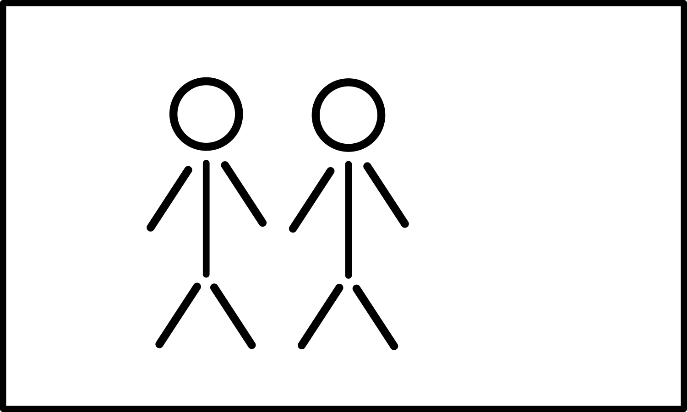
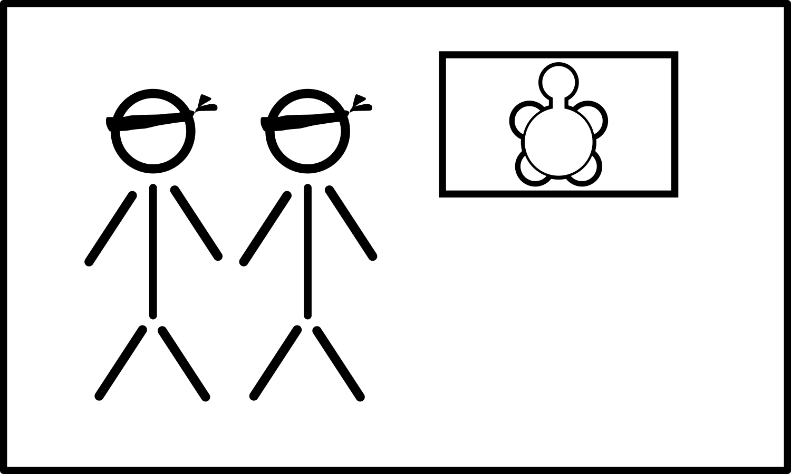

+++
draft = false
date = 2020-03-26T17:54:00Z
title = "ᏁᎳᏚᏏᏁᎢ ᎠᏕᎶᏆᏍᏗ"
weight = 1585245240

[taxonomies]
authors = ["Michael Conrad"]
categories = ["Lessons", "Grammar"]
tags = []

[extra]
zulma_title="Cherokee Language Lessons 1"
featured_image = "lessons/Cherokee-Language-Lessons-Volume-1/Cherokee-Language-Lessons-Volume-1.png"

+++
## ᎦᏬᏂᏍᎬᎢ ᎠᎦᏔᎲᎢ (Grammar)

☞ *Remember that it is through the exercises in the lesson material that
you will learn how to understand and speak Cherokee, not by memorizing
rules and word parts.*

You were previously introduced to the special combination of Ꮭ/ᏱᎩ to
indicate “isn’t”.

  - Ꮭ \_\_\_\_\_ ᏱᎩ \[hla \_\_\_\_\_ yi⁴gi\]

When you use the Cherokee word “ᎥᏝ” and combine it with the special
prefix “Ᏹ-” you create a negative sentence.
<!-- more -->
Examples:

  - ᎯᎠ ᎠᎩᎵᏏ. “This is an English person.”
    
      - ᎯᎠ Ꮭ ᎠᎩᎵᏏ ᏱᎩ. “This is not an English person.”
    
      - Ꮭ ᎯᎠ ᎠᎩᎵᏏ ᏱᎩ. “Not this English person.”

  - ᎠᏂᏣᎳᎩᏊ. “It is only the Cherokee people.”
    
      - ᎥᏝᏊ ᎠᏂᏣᎳᎩ ᏱᎩ. “Not only is it the Cherokee people.” ☞ *Notice
        how the “-Ꮚ” was add to “ᎥᏝ” to form “not only”?*

  - Ꮎ ᏐᏈᎵ ᎠᎪᏩᏘᎭ. “He sees that horse.”
    
      - Ꮭ Ꮎ ᏐᏈᎵ ᏯᎪᏩᏘᎭ. “He doesn’t see that horse.”

  - Ꮭ ᎣᏍᏓ ᏩᎭᏯ ᏱᏥᎪᏩᏘᎭ. “It is not a good wolf I see.”
    
      - ᎣᏍᏓ, Ꮭ ᏩᎭᏯ ᏱᏥᎪᏩᏘᎭ. “Good, it is not a wolf I see.”

  - Ꮭ ᎤᏬᏗᎨ ᏥᏍᏚ ᏱᏥᎪᏩᏘᎭ. ᎤᏁᎦ ᏥᎪᏩᏘᎭ. “It is not a brown rabbit I see. I see
    a white one.”
    
      - ᏥᏍᏚ ᏥᎪᏩᏘᎭ. Ꮭ ᎤᏬᏗᎨ ᏱᎩ. ᎤᏁᎦ. “The rabbit I am seeing. It isn’t
        brown. It’s white.”

☞ *You must use both ᎥᏝ and Ᏹ- together to indicate “isn’t” or
“doesn’t”.*

If you leave off “ᎥᏝ” and only use “Ᏹ-” you create a statement that sits
between “is” and “isn’t”. You are indicating “if” or “maybe”.

Example:

  - ᏩᎭᏯ ᏱᏥᎪᏩᏘᎭ ᎠᎴ ᎩᏟ ᏱᏥᎪᏩᏘᎭ. “Maybe I see wolf or maybe I see a dog.”

## ᏘᎪᎵᏯ (Read them)

  - ᎠᎩᎪᏩᏘᎭ  
    \[ạ²gị²gowh²tị³ha\] “He sees me.”

  - Ꮭ ᏯᎩᎪᏩᏘᎭ  
    \[hla yạ²gị²gowh²tị³ha\] “He doesn’t see me.”  
    ☞ *Ᏹ- followed by Ꭰ- combine and become Ꮿ-.*

  - ᏣᎪᏩᏘᎭ  
    \[jạ²gowh²tị³ha\] “He sees you.”

  - Ꮭ ᏱᏣᎪᏩᏘᎭ  
    \[hla yị²jạ²gowh²tị³ha\] “He doesn’t see you.”

  - Ꮭ ᏳᎭ  
    \[hla yu²³ha\] “He doesn’t have it, something solid.”  
    ☞ *Ᏹ- followed by Ꭴ- combine and become Ᏻ-.*

  - Ꮭ ᏳᏂᎭ  
    \[hla yu¹ni²³ha\] “They don’t have it, something solid.”

  - Ꮭ ᏯᎩᎭ  
    \[hla ya¹gị²ha\] “I don’t have it, something solid.”

  - Ꮭ ᏱᏣᎭ  
    \[hla yị²jạ²ha\] “You don’t have it, something solid.”

  - Ꮭ ᏳᏩᎧᎭ  
    \[hla yu¹wa²kạ³ha\] “He doesn’t have it, something alive.”

  - Ꮭ ᏳᏂᎧᎭ  
    \[hla yu¹ni²kạ³ha\] “They don’t have it, something alive.”

  - Ꮭ ᏯᎩᎧᎭ  
    \[hla ya¹gị²kạ³ha\] “I don’t have it, something alive.”

  - Ꮭ ᏱᏣᎧᎭ  
    \[hla yị²jạ²kạ³ha\] “You don’t have it, something alive.”

## ᏂᏔᏛᎦ (Do them)

You will need the following:

  - 15 index cards.

  - Crayons for coloring the index cards.

You will need to reuse the following cards from the previous chapter.

 

You will need to reuse the following people index cards:

 
 

You will need to add the following people index cards:

Label each card on the reverse as follows: ᎠᏂᏴᏫᏯᎢ, ᎠᏂᏣᎳᎩ, ᎠᏂᎩᎵᏏ, ᎠᏂᏲᏁᎦ,
ᎠᏂᏴᏫ.

You will need to create one copy each of the following blind-folded
people index cards:

 

Label each card on the reverse as follows: ᎠᏴᏫᏯᎢ, ᎠᏣᎳᎩ, ᎠᎩᎵᏏ, ᎠᏲᏁᎦ, ᎠᏴᏫ,
ᎠᏂᏴᏫᏯᎢ, ᎠᏂᏣᎳᎩ, ᎠᏂᎩᎵᏏ, ᎠᏂᏲᏁᎦ, ᎠᏂᏴᏫ.

Divide up into groups of four to seven.

### Groups

For each group the first person is designated “Ꭰ”. The second person is
designated “Ꭱ”. Any remaining people are grouped together and are
designated “Ꭲ”. After each set, rotate positions so that “Ꭰ” becomes the
“Ꭱ”, the “Ꭱ” becomes one of the “Ꭲ”, and one of the “Ꭲ” becomes the “Ꭰ”.

☞ *Keep rotating until everyone has been in position “Ꭱ”, starting over
with the first set of challenges as needed.*

☞ *The “Ꭰ” responses should be read from the book. The “Ꭱ” responses
should be done without reading the book.*

Each challenge-response should be done as in the following examples:

1.  ᏥᏍᏚ.  
    “Ꭰ” selects a rabbit card and shows the picture to “Ꭱ”.
    
    1.  \[Ꭰ→Ꭱ\] ᎠᎩᎧᎭᏍ ᏥᏍᏚ?  
        “Ꭰ” asks “Ꭱ”: Do I have a rabbit?
    
    2.  \[Ꭱ\] ᎥᎥ, ᏥᏍᏚ ᏣᎧᎭ.  
        “Ꭱ” responds: Yes, you have a rabbit.

2.  ᏲᎾ.  
    “Ꭰ” selects a bear card and shows the picture to “Ꭱ”.
    
    1.  \[Ꭰ→Ꭱ\] ᎠᎩᎧᎭᏍᎪ ᎠᎭᏫ?  
        “Ꭰ” asks “Ꭱ”: Do I have a deer?
    
    2.  \[Ꭱ\] ᎥᏝ, ᏲᎾ ᏣᎧᎭ.  
        “Ꭱ” responds: No, you have a bear.

3.  ᎠᏫ. ᎠᏲᏁᎦ.  
    “Ꭰ” selects a deer card and a white person card and places them
    together..
    
    1.  \[Ꭰ→Ꭱ\] ᎠᏫᏍ ᎤᏩᎧᎭᏍᎪ ᎠᏲᏁᎦ?  
        “Ꭰ” asks “Ꭱ”: Does the white person have a deer?
    
    2.  \[Ꭱ\] ᎥᎥ, ᏲᏁᎦ ᎠᏫ ᎤᏩᎧᎭ.  
        “Ꭱ” responds: Yes, the white person has a deer.

4.  ᎤᏬᏗᎨ ᏚᏯ.  
    “Ꭰ” selects a brown bean card and shows the picture to “Ꭱ”.
    
    1.  \[Ꭰ→Ꭱ\] ᎠᎩᎭᏍ  ᎩᎨ ᏄᎾ?  
        “Ꭰ” asks “Ꭱ”: Do I have a red potato?
    
    2.  \[Ꭱ\] ᎥᏝ, ᎤᏬᏗᎨ ᏚᏯ ᏣᎭ.  
        “Ꭱ” responds: No, you have a brown bean.

5.  ᏌᎶᎵ. ᎠᏴᏫ.  
    “Ꭰ” selects a squirrel card and a generic person card and places
    them together..
    
    1.  \[Ꭰ→Ꭱ\] ᏥᏍᏚᏍ ᎤᏩᎧᎭ ᎠᏴᏫ?  
        “Ꭰ” asks “Ꭱ”: Does the person have a rabbit?
    
    2.  \[Ꭱ\] ᎥᏝ, ᎠᏴᏫ ᏌᎶᎵ ᎤᏩᎧᎭ.  
        “Ꭱ” responds: No, the person has a squirrel.

### Someone Alone

For the exercises use the list directly from the book.

Be sure to cover up the answers with an index card or sheet of paper
until the answer needs checking.

Each item should be done as in the following examples:

Use a stuffed animal or pillow as an imaginary study partner.

☞ *There are three main challenge types. Those with people cards and
animals, those with only people cards, and those with only animal cards.
Each one is done differently.*

1.  ᏥᏍᏚ.
    
    1.  Select and hold a rabbit card.
    
    2.  Point at your self and say to your study partner ᏥᏍᏚ ᎠᎩᎧᎭ. (I
        have a rabbit.)
        
        1.  Point at your partner and say Ꮭ ᏥᏍᏚ ᏱᏣᎧᎭ. (You don’t have a
            rabbit.)
    
    3.  Place the card with your imaginary study partner.
    
    4.  Point at yourself and say to your patner Ꮭ ᏥᏍᏚ ᏯᎩᎧᎭ. (I don’t
        have a rabbit.)
        
        1.  Point at your partner and say ᏥᏍᏚ ᏣᎧᎭ. (You have a rabbit.)
    
    5.  Check the answer and that you are using the correct card.

2.  ᎠᏴᏫ \[blind-folded\]
    
    1.  Select a generic person card that is blind-folded.
    
    2.  Pretend aloud that your study partner asks Ꮎ ᎠᏴᏫ, ᏣᎪᏩᏘᎭᏍ? (That
        person, does he/she see you?)
        
        1.  Point at the card and say to your partner Ꮭ ᎠᏴᏫ ᏯᎩᎪᏩᏘᎭ. (The
            person does not see me.)
    
    3.  Check the answer and that you are using the correct card.

3.  ᎠᏣᎳᎩ \[not-blind-folded\]
    
    1.  Select a Cherokee person card that isn’t blind-folded.
    
    2.  Pretend aloud that your study partner asks Ꮎ ᎠᏣᎳᎩ, ᏣᎪᏩᏘᎭᏍ? (That
        Cherokee, does he/she see you?)
        
        1.  Point at the card and say to your partner ᎥᎥ, ᎠᏣᎳᎩ ᎠᎩᎪᏩᏘᎭ.
            (Yes, the Cherokee person sees me.)
    
    3.  Check the answer and that you are using the correct card.

4.  ᏲᎾ. ✓ ᎠᏂᏴᏫᏯᎢ. ✗ ᎠᏂᏣᎳᎩ. ᎥᏍᎩ.  
    The ✓ indicates they have it. The ✗ indicates they don’t have it.
    
    1.  Select a bear card and a Native American people card and place
        them with each other. Select a Cherokee people card and place it
        by itself.
    
    2.  Point to the bear and Native American cards and say:
        
        1.  ᎠᏂᏴᏫᏯᎢ ᏲᎾ ᎤᏂᎧᎭ. (The Native Americans have a bear.)
        
        2.  ᎥᏍᎩ ᏲᎾ ᎤᏂᎧᎭ. (They have a bear.)
    
    3.  Point to the Cherokee people card and say:
        
        1.  Ꮭ ᎠᏂᏣᎳᎩ ᏲᎾ ᏳᏂᎧᎭ. (The Cherokee people don’t have a bear.)
        
        2.  Ꮭ ᎥᏍᎩ ᏲᎾ ᏳᏂᎧᎭ. (They don’t have a bear.)
    
    4.  Check the answer and that you are using the correct cards.

☞ *Use the “Sets for Someone Alone” section for your exercises.*

### Sets for Groups

#### Set 1

1.  ᏲᎾ.
    
    1.  \[Ꭰ→Ꭱ\] ᎠᎩᎧᎭᏍ ᏲᎾ?
    
    2.  \[Ꭱ\] ᎥᎥ, ᏲᎾ ᏣᎧᎭ.

2.  ᏲᎾ.
    
    1.  \[Ꭰ→Ꭱ\] ᎠᎩᎧᎭᏍᎪ ᎠᎭᏫ?
    
    2.  \[Ꭱ\] Ꮭ ᎠᎭᏫ ᏱᏣᎧᎭ.
    
    3.  \[Ꭱ\] ᏲᎾ ᏣᎧᎭ.

3.  ᏌᎶᎵ.
    
    1.  \[Ꭰ→Ꭱ\] ᎠᎩᎧᎭᏍ ᏌᎶᎵ?
    
    2.  \[Ꭱ\] ᎥᎥ, ᏌᎶᎵ ᏣᎧᎭ.

4.  ᏌᎶᎵ.
    
    1.  \[Ꭰ→Ꭱ\] ᎠᎩᎧᎭᏍᎪ ᏥᏍᏚ?
    
    2.  \[Ꭱ\] Ꮭ ᏥᏍᏚ ᏱᏣᎧᎭ.
    
    3.  \[Ꭱ\] ᏌᎶᎵ ᏣᎧᎭ.

5.  ᎠᏫ.
    
    1.  \[Ꭰ→Ꭱ\] ᎠᎩᎧᎭᏍ ᏩᎭᏯ?
    
    2.  \[Ꭱ\] Ꮭ ᎠᏫ ᏱᏣᎧᎭ.
    
    3.  \[Ꭱ\] ᎠᏫ ᏣᎧᎭ.

6.  ᏌᏛᏗ.
    
    1.  \[Ꭰ→Ꭱ\] ᎠᎩᎭᏍᎪ ᏌᏛᏗ?
    
    2.  \[Ꭱ\] ᎥᎥ, ᏌᏛᏗ ᏣᎭ.

7.  ᏥᏍᏚ.
    
    1.  \[Ꭰ→Ꭱ\] ᎠᎩᎧᎭᏍ ᏩᎭᏯ?
    
    2.  \[Ꭱ\] Ꮭ ᏥᏍᏚ ᏱᏣᎧᎭ.
    
    3.  \[Ꭱ\] ᏥᏍᏚ ᏣᎧᎭ.

8.  ᏄᎾ.
    
    1.  \[Ꭰ→Ꭱ\] ᎠᎩᎭᏍᎪ ᏄᎾ?
    
    2.  \[Ꭱ\] ᎥᎥ, ᏄᎾ ᏣᎭ.

#### Set 2

1.  ᏅᏯ.
    
    1.  \[Ꭰ→Ꭱ\] ᎠᎩᎭᏍ ᏌᏛᏗ?
    
    2.  \[Ꭱ\] Ꮭ ᏌᏛᏗ ᏱᏣᎭ.
    
    3.  \[Ꭱ\] ᏅᏯ ᏣᎭ.

2.  ᏚᏯ.
    
    1.  \[Ꭰ→Ꭱ\] ᎠᎩᎭᏍᎪ ᏄᎾ?
    
    2.  \[Ꭱ\] Ꮭ ᏄᎾ ᏱᏣᎭ.
    
    3.  \[Ꭱ\] ᏚᏯ ᏣᎭ.

3.  ᏄᎾ.
    
    1.  \[Ꭰ→Ꭱ\] ᎠᎩᎭᏍ ᏚᏯ?
    
    2.  \[Ꭱ\] Ꮭ ᏚᏯ ᏱᏣᎭ.
    
    3.  \[Ꭱ\] ᏄᎾ ᏣᎭ.

4.  ᏌᏛᏗ.
    
    1.  \[Ꭰ→Ꭱ\] ᎠᎩᎭᏍᎪ ᏅᏯ?
    
    2.  \[Ꭱ\] Ꮭ ᏅᏯ ᏱᏣᎭ.
    
    3.  \[Ꭱ\] ᏌᏛᏗ ᏣᎭ.

5.  ᎠᏴᏫ \[blind-folded\]
    
    1.  \[Ꭰ\] Ꮎ ᎠᏴᏫ, ᏣᎪᏩᏘᎭᏍ?
    
    2.  \[Ꭱ\] Ꮭ ᎠᏴᏫ ᏯᎩᎪᏩᏘᎭ.

6.  ᎤᏬᏗᎨ ᏥᏍᏚ. ᎠᏂᏴᏫ.
    
    1.  \[Ꭰ→Ꭱ\] ᎠᏂᏴᏫᏍ ᎤᏬᏗᎨ ᏥᏍᏚ ᎤᏂᎧᎭ?
    
    2.  \[Ꭱ\] ᎥᎥ, ᎠᏂᏴᏫ ᎤᏬᏗᎨ ᏥᏍᏚ ᎤᏂᎧᎭ.

7.  ᎤᏁᎦ ᏩᎭ. ᎠᏂᏴᏫᏯᎢ.
    
    1.  \[Ꭰ→Ꭱ\] ᎥᏍᎩᎾᏍ ᎤᏁᎦ ᏩᎭ ᎤᏂᎧᎭ?
    
    2.  \[Ꭱ\] ᎥᎥ, ᎥᏍᎩᎾ ᎤᏁᎦ ᏩᎭ ᎤᏂᎧᎭ.

8.  ᎠᎩᎦᎨ ᏐᏈᎵ. ᎠᎩᎵᏏ.
    
    1.  \[Ꭰ→Ꭱ\] ᎠᎩᎵᏏᏍᎪ ᎠᎩᎦᎨ ᏐᏈᎵ ᎤᏩᎧᎭ?
    
    2.  \[Ꭱ\] ᎥᎥ, ᎠᎩᎵᏏ ᎠᎩᎦᎨ ᏐᏈᎵ ᎤᏩᎧᎭ.

#### Set 3

1.  ᎤᏬᏗᎨ ᎩᏟ. ᎠᏲᏁᎦ.
    
    1.  \[Ꭰ→Ꭱ\] ᏍᎩᎾᏍ ᎤᏬᏗᎨ ᎩᏟ ᎤᏩᎧᎭ?
    
    2.  \[Ꭱ\] ᎥᎥ, ᏍᎩᎾ ᎤᏬᏗᎨ ᎩᏟ ᎤᏩᎧᎭ.

2.  ᎤᏁᎦ ᏌᎶᎵ. ᎠᏂᏲᏁᎦ.
    
    1.  \[Ꭰ→Ꭱ\] ᎠᏂᏲᏁᎦᏍᎪ ᎤᏬᏗᎨ ᎠᎭᏫ ᎤᏂᎧᎭ?
    
    2.  \[Ꭱ\] Ꮭ ᎠᏂᏲᏁᎦ ᎤᏬᏗᎨ ᎠᎭᏫ ᏳᏂᎧᎭ.
    
    3.  \[Ꭱ\] ᎠᏂᏲᏁᎦ ᎤᏁᎦ ᏌᎶᎵ ᎤᏂᎧᎭ.

3.  ᎠᎩᎦᎨ ᏲᎾ. ᎠᏂᎩᎵᏏ.
    
    1.  \[Ꭰ→Ꭱ\] ᎾᏍᎩᏍ ᎤᏁᎦ ᎠᏫ ᎤᏂᎧᎭ?
    
    2.  \[Ꭱ\] Ꮭ ᎾᏍᎩ ᎤᏁᎦ ᎠᏫ ᏳᏂᎧᎭ.
    
    3.  \[Ꭱ\] ᎾᏍᎩ ᎠᎩᎦᎨ ᏲᎾ ᎤᏂᎧᎭ.

4.  ᎠᎩᎦᎨ ᏩᎭᏯ. ᎠᏴᏫᏯᎢ.
    
    1.  \[Ꭰ→Ꭱ\] ᎠᏴᏫᏯᎢᏍᎪ ᎠᎩᎦᎨ ᎠᎭᏫ ᎤᏩᎧᎭ?
    
    2.  \[Ꭱ\] Ꮭ ᎠᏴᏫᏯᎢ ᎠᎩᎦᎨ ᎠᎭᏫ ᏳᏩᎧᎭ.
    
    3.  \[Ꭱ\] ᎠᏴᏫᏯᎢ ᎠᎩᎦᎨ ᏩᎭᏯ ᎤᏩᎧᎭ.

5.  ᎤᏁᎦ ᏌᎶᎵ. ᎠᏣᎳᎩ.
    
    1.  \[Ꭰ→Ꭱ\] ᎥᏍᎩᏍ ᎠᎩᎦᎨ ᎠᏫ ᎤᏩᎧᎭ?
    
    2.  \[Ꭱ\] Ꮭ ᎥᏍᎩ ᎠᎩᎦᎨ ᎠᏫ ᏳᏩᎧᎭ.
    
    3.  \[Ꭱ\] ᎥᏍᎩ ᎤᏁᎦ ᏌᎶᎵ ᎤᏩᎧᎭ.

6.  ᎤᏬᏗᎨ ᏥᏍᏚ. ᎠᏂᏣᎳᎩ.
    
    1.  \[Ꭰ→Ꭱ\] ᎠᏂᏣᎳᎩᏍᎪ ᎤᏬᏗᎨ ᏲᎾ ᎤᏂᎧᎭ?
    
    2.  \[Ꭱ\] Ꮭ ᎠᏂᏣᎳᎩ ᎤᏬᏗᎨ ᏲᎾ ᏳᏂᎧᎭ.
    
    3.  \[Ꭱ\] ᎠᏂᏣᎳᎩ ᎤᏬᏗᎨ ᏥᏍᏚ ᎤᏂᎧᎭ.

7.  ᎤᏬᏗᎨ ᎠᎭᏫ. ᎠᏂᏴᏫ.
    
    1.  \[Ꭰ→Ꭱ\] ᎾᏍᎩᏍ ᎤᏁᎦ ᏌᎶᎵ ᎤᏂᎧᎭ?
    
    2.  \[Ꭱ\] Ꮭ ᎾᏍᎩ ᎤᏁᎦ ᏌᎶᎵ ᏳᏂᎧᎭ.
    
    3.  \[Ꭱ\] ᎾᏍᎩ ᎤᏬᏗᎨ ᎠᎭᏫ ᎤᏂᎧᎭ.

8.  ᎤᏁᎦ ᏥᏍᏚ. ᎠᏣᎳᎩ.
    
    1.  \[Ꭰ→Ꭱ\] ᎠᏣᎳᎩᏍᎪ ᎤᏁᎦ ᏩᎭᏯ ᎤᏩᎧᎭ?
    
    2.  \[Ꭱ\] Ꮭ ᎠᏣᎳᎩ ᎤᏁᎦ ᏩᎭᏯ ᏳᏩᎧᎭ.
    
    3.  \[Ꭱ\] ᎠᏣᎳᎩ ᎤᏁᎦ ᏥᏍᏚ ᎤᏩᎧᎭ.

#### Set 4

1.  ᎠᎩᎦᎨ ᎠᏫ. ᎠᏴᏫ.
    
    1.  \[Ꭰ→Ꭱ\] ᎠᏴᏫᏍᎪ ᎠᎩᎦᎨ ᏲᎾ ᎤᏩᎧᎭ?
    
    2.  \[Ꭱ\] Ꮭ ᎠᏴᏫ ᎠᎩᎦᎨ ᏲᎾ ᏳᏩᎧᎭ.
    
    3.  \[Ꭱ\] ᎠᏴᏫ ᎠᎩᎦᎨ ᎠᏫ ᎤᏩᎧᎭ.

2.  ᎠᎩᎦᎨ ᏥᏍᏚ. ᎠᎩᎵᏏ.
    
    1.  \[Ꭰ→Ꭱ\] ᎥᏍᎩᏍ ᎤᏬᏗᎨ ᏲᎾ ᎤᏩᎧᎭ?
    
    2.  \[Ꭱ\] Ꮭ ᎥᏍᎩ ᎤᏬᏗᎨ ᏲᎾ ᏳᏩᎧᎭ.
    
    3.  \[Ꭱ\] ᎥᏍᎩ ᎠᎩᎦᎨ ᏥᏍᏚ ᎤᏩᎧᎭ.

3.  ᎤᏬᏗᎨ ᎠᎭᏫ. ᎠᏲᏁᎦ.
    
    1.  \[Ꭰ→Ꭱ\] ᎥᏍᎩᎾᏍ ᎤᏬᏗᎨ ᏩᎭᏯ ᎤᏩᎧᎭ?
    
    2.  \[Ꭱ\] Ꮭ ᎥᏍᎩᎾ ᎤᏬᏗᎨ ᏩᎭᏯ ᏳᏩᎧᎭ.
    
    3.  \[Ꭱ\] ᎥᏍᎩᎾ ᎤᏬᏗᎨ ᎠᎭᏫ ᎤᏩᎧᎭ.

4.  ᎩᎦᎨ ᏅᏯ. ᎠᏂᎩᎵᏏ.
    
    1.  \[Ꭰ→Ꭱ\] ᎠᏂᎩᎵᏏᏍᎪ ᎩᎦᎨ ᏅᏯ ᎤᏂᎭ?
    
    2.  \[Ꭱ\] ᎥᎥ, ᎠᏂᎩᎵᏏ ᎩᎦᎨ ᏅᏯ ᎤᏂᎭ.

5.  ᎤᏁᎦ ᏚᏯ. ᎠᏂᏣᎳᎩ.
    
    1.  \[Ꭰ→Ꭱ\] ᎠᏂᏣᎳᎩᏍᎪ ᎤᏁᎦ ᏚᏯ ᎤᏂᎭ?
    
    2.  \[Ꭱ\] ᎥᎥ, ᎠᏂᏣᎳᎩ ᎤᏁᎦ ᏚᏯ ᎤᏂᎭ.

6.  ᎤᏬᏗᎨ ᏅᏯ. ᎠᏴᏫᏯᎢ.
    
    1.  \[Ꭰ→Ꭱ\] ᎠᏴᏫᏯᎢᏍ ᎤᏬᏗᎨ ᏅᏯ ᎤᎭ?
    
    2.  \[Ꭱ\] ᎥᎥ, ᎠᏴᏫᏯᎢ ᎤᏬᏗᎨ ᏅᏯ ᎤᎭ.

7.  ᎤᏬᏗᎨ ᏚᏯ. ᎠᎩᎵᏏ.
    
    1.  \[Ꭰ→Ꭱ\] ᎠᎩᎵᏏᏍᎪ ᎤᏬᏗᎨ ᏚᏯ ᎤᎭ?
    
    2.  \[Ꭱ\] ᎥᎥ, ᎠᎩᎵᏏ ᎤᏬᏗᎨ ᏚᏯ ᎤᎭ.

8.  ᎩᎦᎨ ᏅᏯ. ᎠᏂᏲᏁᎦ.
    
    1.  \[Ꭰ→Ꭱ\] ᎠᏂᏲᏁᎦᏍ ᎤᏁᎦ ᏌᏛᏗ ᎤᏂᎭ?
    
    2.  \[Ꭱ\] Ꮭ ᎠᏂᏲᏁᎦ ᎤᏁᎦ ᏌᏛᏗ ᏳᏂᎭ.
    
    3.  \[Ꭱ\] ᎠᏂᏲᏁᎦ ᎩᎦᎨ ᏅᏯ ᎤᏂᎭ.

#### Set 5

1.  ᎤᏁᎦ ᏄᎾ. ᎠᏂᏴᏫᏯᎢ.
    
    1.  \[Ꭰ→Ꭱ\] ᎠᏂᏴᏫᏯᎢᏍᎪ ᎤᏬᏗᎨ ᏚᏯ ᎤᏂᎭ?
    
    2.  \[Ꭱ\] Ꮭ ᎠᏂᏴᏫᏯᎢ ᎤᏬᏗᎨ ᏚᏯ ᏳᏂᎭ.
    
    3.  \[Ꭱ\] ᎠᏂᏴᏫᏯᎢ ᎤᏁᎦ ᏄᎾ ᎤᏂᎭ.

2.  ᎤᏁᎦ ᏄᎾ. ᎠᏴᏫᏯᎢ.
    
    1.  \[Ꭰ→Ꭱ\] ᎠᏴᏫᏯᎢᏍ ᎩᎦᎨ ᏚᏯ ᎤᎭ?
    
    2.  \[Ꭱ\] Ꮭ ᎠᏴᏫᏯᎢ ᎩᎦᎨ ᏚᏯ ᏳᎭ.
    
    3.  \[Ꭱ\] ᎠᏴᏫᏯᎢ ᎤᏁᎦ ᏄᎾ ᎤᎭ.

3.  ᎤᏬᏗᎨ ᏅᏯ. ᎠᏲᏁᎦ.
    
    1.  \[Ꭰ→Ꭱ\] ᎠᏲᏁᎦᏍ ᎤᏬᏗᎨ ᏌᏛᏗ ᎤᎭ?
    
    2.  \[Ꭱ\] Ꮭ ᎠᏲᏁᎦ ᎤᏬᏗᎨ ᏌᏛᏗ ᏳᎭ.
    
    3.  \[Ꭱ\] ᎠᏲᏁᎦ ᎤᏬᏗᎨ ᏅᏯ ᎤᎭ.

4.  ᎩᎦᎨ ᏚᏯ. ᎠᏂᎩᎵᏏ.
    
    1.  \[Ꭰ→Ꭱ\] ᎠᏂᎩᎵᏏᏍᎪ ᎩᎦᎨ ᏅᏯ ᎤᏂᎭ?
    
    2.  \[Ꭱ\] Ꮭ ᎠᏂᎩᎵᏏ ᎩᎦᎨ ᏅᏯ ᏳᏂᎭ.
    
    3.  \[Ꭱ\] ᎠᏂᎩᎵᏏ ᎩᎦᎨ ᏚᏯ ᎤᏂᎭ.

5.  ᎤᏬᏗᎨ ᏌᏛᏗ. ᎠᏂᏴᏫ.
    
    1.  \[Ꭰ→Ꭱ\] ᎠᏂᏴᏫᏍᎪ ᎤᏁᎦ ᏄᎾ ᎤᏂᎭ?
    
    2.  \[Ꭱ\] Ꮭ ᎠᏂᏴᏫ ᎤᏁᎦ ᏄᎾ ᏳᏂᎭ.
    
    3.  \[Ꭱ\] ᎠᏂᏴᏫ ᎤᏬᏗᎨ ᏌᏛᏗ ᎤᏂᎭ.

6.  ᎤᏁᎦ ᏚᏯ. ᎠᏣᎳᎩ.
    
    1.  \[Ꭰ→Ꭱ\] ᎠᏣᎳᎩᏍ ᎩᎦᎨ ᏄᎾ ᎤᎭ?
    
    2.  \[Ꭱ\] Ꮭ ᎠᏣᎳᎩ ᎩᎦᎨ ᏄᎾ ᏳᎭ.
    
    3.  \[Ꭱ\] ᎠᏣᎳᎩ ᎤᏁᎦ ᏚᏯ ᎤᎭ.

7.  ᎩᎦᎨ ᏌᏛᏗ. ᎠᏴᏫ.
    
    1.  \[Ꭰ→Ꭱ\] ᎠᏴᏫᏍ ᎤᏁᎦ ᏅᏯ ᎤᎭ?
    
    2.  \[Ꭱ\] Ꮭ ᎠᏴᏫ ᎤᏁᎦ ᏅᏯ ᏳᎭ.
    
    3.  \[Ꭱ\] ᎠᏴᏫ ᎩᎦᎨ ᏌᏛᏗ ᎤᎭ.

8.  ᎠᎩᎵᏏ \[not-blind-folded\]
    
    1.  \[Ꭰ\] Ꮎ ᎠᎩᎵᏏ, ᏣᎪᏩᏘᎭᏍ?
    
    2.  \[Ꭱ\] ᎥᎥ, ᎠᎩᎵᏏ ᎠᎩᎪᏩᏘᎭ.

#### Set 6

1.  ᎠᏣᎳᎩ \[not-blind-folded\]
    
    1.  \[Ꭰ\] Ꮎ ᎠᏣᎳᎩ, ᏣᎪᏩᏘᎭᏍ?
    
    2.  \[Ꭱ\] ᎥᎥ, ᎠᏣᎳᎩ ᎠᎩᎪᏩᏘᎭ.

2.  ᎤᏁᎦ ᏪᏌ. ᎠᏂᏴᏫ ᎠᎴ ᎠᏂᏲᏁᎦ.
    
    1.  \[Ꭰ→Ꭱ\] ᏍᎩᎾᏍᎪ ᎤᏁᎦ ᏪᏌ ᎤᏂᎧᎭ?
    
    2.  \[Ꭱ\] ᎥᎥ, ᏍᎩᎾ ᎤᏁᎦ ᏪᏌ ᎤᏂᎧᎭ.

3.  ᎠᎩᎦᎨ ᏩᎭᏯ. ᎠᏂᏴᏫᏯᎢ ᎠᎴ ᎠᏂᎩᎵᏏ.
    
    1.  \[Ꭰ→Ꭱ\] ᎥᏍᎩᏍ ᎠᎩᎦᎨ ᏩᎭᏯ ᎤᏂᎧᎭ?
    
    2.  \[Ꭱ\] ᎥᎥ, ᎥᏍᎩ ᎠᎩᎦᎨ ᏩᎭᏯ ᎤᏂᎧᎭ.

4.  ᎤᏬᏗᎨ ᏐᏈᎵ. ᎠᏲᏁᎦ ᎠᎴ ᎠᏴᏫ.
    
    1.  \[Ꭰ→Ꭱ\] ᎾᏍᎩᏍᎪ ᎤᏬᏗᎨ ᏐᏈᎵ ᎤᏂᎧᎭ?
    
    2.  \[Ꭱ\] ᎥᎥ, ᎾᏍᎩ ᎤᏬᏗᎨ ᏐᏈᎵ ᎤᏂᎧᎭ.

5.  ᎤᏁᎦ ᏩᎭ. ᎠᏴᏫᏯᎢ ᎠᎴ ᎠᎩᎵᏏ.
    
    1.  \[Ꭰ→Ꭱ\] ᏍᎩᎾᏍᎪ ᎤᏁᎦ ᏩᎭ ᎤᏂᎧᎭ?
    
    2.  \[Ꭱ\] ᎥᎥ, ᏍᎩᎾ ᎤᏁᎦ ᏩᎭ ᎤᏂᎧᎭ.

6.  ᎤᏁᎦ ᏌᎶᎵ. ᎠᏂᏴᏫ ᎠᎴ ᎠᏂᏣᎳᎩ.
    
    1.  \[Ꭰ→Ꭱ\] ᎥᏍᎩᎾᏍ ᎤᏁᎦ ᎠᏫ ᎤᏂᎧᎭ?
    
    2.  \[Ꭱ\] Ꮭ ᎥᏍᎩᎾ ᎤᏁᎦ ᎠᏫ ᏳᏂᎧᎭ.
    
    3.  \[Ꭱ\] ᎥᏍᎩᎾ ᎤᏁᎦ ᏌᎶᎵ ᎤᏂᎧᎭ.

7.  ᎠᎩᎦᎨ ᏩᎭᏯ. ᎠᏂᏴᏫᏯᎢ ᎠᎴ ᎠᏂᏲᏁᎦ.
    
    1.  \[Ꭰ→Ꭱ\] ᎾᏍᎩᏍᎪ ᎠᎩᎦᎨ ᏥᏍᏚ ᎤᏂᎧᎭ?
    
    2.  \[Ꭱ\] Ꮭ ᎾᏍᎩ ᎠᎩᎦᎨ ᏥᏍᏚ ᏳᏂᎧᎭ.
    
    3.  \[Ꭱ\] ᎾᏍᎩ ᎠᎩᎦᎨ ᏩᎭᏯ ᎤᏂᎧᎭ.

8.  ᎤᏬᏗᎨ ᏌᎶᎵ. ᎠᏣᎳᎩ ᎠᎴ ᎠᎩᎵᏏ.
    
    1.  \[Ꭰ→Ꭱ\] ᏍᎩᎾᏍ ᎤᏬᏗᎨ ᎠᎭᏫ ᎤᏂᎧᎭ?
    
    2.  \[Ꭱ\] Ꮭ ᏍᎩᎾ ᎤᏬᏗᎨ ᎠᎭᏫ ᏳᏂᎧᎭ.
    
    3.  \[Ꭱ\] ᏍᎩᎾ ᎤᏬᏗᎨ ᏌᎶᎵ ᎤᏂᎧᎭ.

#### Set 7

1.  ᎠᎩᎦᎨ ᏲᎾ. ᎠᏣᎳᎩ ᎠᎴ ᎠᏴᏫ.
    
    1.  \[Ꭰ→Ꭱ\] ᎥᏍᎩᎾᏍᎪ ᎠᎩᎦᎨ ᎠᏫ ᎤᏂᎧᎭ?
    
    2.  \[Ꭱ\] Ꮭ ᎥᏍᎩᎾ ᎠᎩᎦᎨ ᎠᏫ ᏳᏂᎧᎭ.
    
    3.  \[Ꭱ\] ᎥᏍᎩᎾ ᎠᎩᎦᎨ ᏲᎾ ᎤᏂᎧᎭ.

2.  ᎤᏬᏗᎨ ᏥᏍᏚ. ᎠᏂᏴᏫᏯᎢ ᎠᎴ ᎠᏂᏣᎳᎩ.
    
    1.  \[Ꭰ→Ꭱ\] ᎥᏍᎩᏍ ᎤᏁᎦ ᏌᎶᎵ ᎤᏂᎧᎭ?
    
    2.  \[Ꭱ\] Ꮭ ᎥᏍᎩ ᎤᏁᎦ ᏌᎶᎵ ᏳᏂᎧᎭ.
    
    3.  \[Ꭱ\] ᎥᏍᎩ ᎤᏬᏗᎨ ᏥᏍᏚ ᎤᏂᎧᎭ.

3.  ᎤᏁᎦ ᎠᏫ. ᎠᏂᏴᏫ ᎠᎴ ᎠᏂᎩᎵᏏ.
    
    1.  \[Ꭰ→Ꭱ\] ᎾᏍᎩᏍᎪ ᎠᎩᎦᎨ ᏩᎭᏯ ᎤᏂᎧᎭ?
    
    2.  \[Ꭱ\] Ꮭ ᎾᏍᎩ ᎠᎩᎦᎨ ᏩᎭᏯ ᏳᏂᎧᎭ.
    
    3.  \[Ꭱ\] ᎾᏍᎩ ᎤᏁᎦ ᎠᏫ ᎤᏂᎧᎭ.

4.  ᎤᏁᎦ ᎠᎭᏫ. ᎠᏲᏁᎦ ᎠᎴ ᎠᎩᎵᏏ.
    
    1.  \[Ꭰ→Ꭱ\] ᎥᏍᎩᎾᏍ ᎤᏁᎦ ᏲᎾ ᎤᏂᎧᎭ?
    
    2.  \[Ꭱ\] Ꮭ ᎥᏍᎩᎾ ᎤᏁᎦ ᏲᎾ ᏳᏂᎧᎭ.
    
    3.  \[Ꭱ\] ᎥᏍᎩᎾ ᎤᏁᎦ ᎠᎭᏫ ᎤᏂᎧᎭ.

5.  ᎠᎩᎦᎨ ᎠᎭᏫ. ᎠᏴᏫᏯᎢ ᎠᎴ ᎠᏴᏫ.
    
    1.  \[Ꭰ→Ꭱ\] ᎥᏍᎩᏍᎪ ᎤᏬᏗᎨ ᏩᎭᏯ ᎤᏂᎧᎭ?
    
    2.  \[Ꭱ\] Ꮭ ᎥᏍᎩ ᎤᏬᏗᎨ ᏩᎭᏯ ᏳᏂᎧᎭ.
    
    3.  \[Ꭱ\] ᎥᏍᎩ ᎠᎩᎦᎨ ᎠᎭᏫ ᎤᏂᎧᎭ.

6.  ᎠᏴᏫ \[blind-folded\]
    
    1.  \[Ꭰ\] Ꮎ ᎠᏴᏫ, ᏣᎪᏩᏘᎭᏍ?
    
    2.  \[Ꭱ\] Ꮭ ᎠᏴᏫ ᏯᎩᎪᏩᏘᎭ.

7.  ᎤᏬᏗᎨ ᏲᎾ. ᎠᏂᏴᏫᏯᎢ.
    
    1.  \[Ꭰ→Ꭱ\] ᎠᏂᏴᏫᏯᎢᏍ ᎤᏬᏗᎨ ᏲᎾ ᎤᏂᎧᎭ?
    
    2.  \[Ꭱ\] ᎥᎥ, ᎠᏂᏴᏫᏯᎢ ᎤᏬᏗᎨ ᏲᎾ ᎤᏂᎧᎭ.

8.  ᎠᎩᎦᎨ ᏥᏍᏚ. ᎠᏂᏣᎳᎩ.
    
    1.  \[Ꭰ→Ꭱ\] ᏍᎩᎾᏍᎪ ᎠᎩᎦᎨ ᏥᏍᏚ ᎤᏂᎧᎭ?
    
    2.  \[Ꭱ\] ᎥᎥ, ᏍᎩᎾ ᎠᎩᎦᎨ ᏥᏍᏚ ᎤᏂᎧᎭ.

#### Set 8

1.  ᎤᏁᎦ ᏩᎭᏯ. ᎠᏲᏁᎦ.
    
    1.  \[Ꭰ→Ꭱ\] ᎠᏲᏁᎦᏍ ᎤᏁᎦ ᏩᎭᏯ ᎤᏩᎧᎭ?
    
    2.  \[Ꭱ\] ᎥᎥ, ᎠᏲᏁᎦ ᎤᏁᎦ ᏩᎭᏯ ᎤᏩᎧᎭ.

2.  ᎤᏬᏗᎨ ᏪᏌ. ᎠᏴᏫᏯᎢ.
    
    1.  \[Ꭰ→Ꭱ\] ᏍᎩᎾᏍ ᎤᏬᏗᎨ ᏪᏌ ᎤᏩᎧᎭ?
    
    2.  \[Ꭱ\] ᎥᎥ, ᏍᎩᎾ ᎤᏬᏗᎨ ᏪᏌ ᎤᏩᎧᎭ.

3.  ᎤᏁᎦ ᏲᎾ. ᎠᏂᏲᏁᎦ.
    
    1.  \[Ꭰ→Ꭱ\] ᎠᏂᏲᏁᎦᏍᎪ ᎤᏁᎦ ᎠᏫ ᎤᏂᎧᎭ?
    
    2.  \[Ꭱ\] Ꮭ ᎠᏂᏲᏁᎦ ᎤᏁᎦ ᎠᏫ ᏳᏂᎧᎭ.
    
    3.  \[Ꭱ\] ᎠᏂᏲᏁᎦ ᎤᏁᎦ ᏲᎾ ᎤᏂᎧᎭ.

4.  ᎤᏬᏗᎨ ᏌᎶᎵ. ᎠᏂᏴᏫᏯᎢ.
    
    1.  \[Ꭰ→Ꭱ\] ᎥᏍᎩᎾᏍᎪ ᎠᎩᎦᎨ ᏥᏍᏚ ᎤᏂᎧᎭ?
    
    2.  \[Ꭱ\] Ꮭ ᎥᏍᎩᎾ ᎠᎩᎦᎨ ᏥᏍᏚ ᏳᏂᎧᎭ.
    
    3.  \[Ꭱ\] ᎥᏍᎩᎾ ᎤᏬᏗᎨ ᏌᎶᎵ ᎤᏂᎧᎭ.

5.  ᎠᎩᎦᎨ ᏲᎾ. ᎠᏴᏫᏯᎢ.
    
    1.  \[Ꭰ→Ꭱ\] ᎠᏴᏫᏯᎢᏍ ᎤᏬᏗᎨ ᎠᏫ ᎤᏩᎧᎭ?
    
    2.  \[Ꭱ\] Ꮭ ᎠᏴᏫᏯᎢ ᎤᏬᏗᎨ ᎠᏫ ᏳᏩᎧᎭ.
    
    3.  \[Ꭱ\] ᎠᏴᏫᏯᎢ ᎠᎩᎦᎨ ᏲᎾ ᎤᏩᎧᎭ.

6.  ᎤᏬᏗᎨ ᏩᎭᏯ. ᎠᎩᎵᏏ.
    
    1.  \[Ꭰ→Ꭱ\] ᎥᏍᎩᏍᎪ ᎠᎩᎦᎨ ᏥᏍᏚ ᎤᏩᎧᎭ?
    
    2.  \[Ꭱ\] Ꮭ ᎥᏍᎩ ᎠᎩᎦᎨ ᏥᏍᏚ ᏳᏩᎧᎭ.
    
    3.  \[Ꭱ\] ᎥᏍᎩ ᎤᏬᏗᎨ ᏩᎭᏯ ᎤᏩᎧᎭ.

7.  ᎤᏁᎦ ᎠᎭᏫ. ᎠᏂᏲᏁᎦ.
    
    1.  \[Ꭰ→Ꭱ\] ᎠᏂᏲᏁᎦᏍ ᎤᏬᏗᎨ ᏌᎶᎵ ᎤᏂᎧᎭ?
    
    2.  \[Ꭱ\] Ꮭ ᎠᏂᏲᏁᎦ ᎤᏬᏗᎨ ᏌᎶᎵ ᏳᏂᎧᎭ.
    
    3.  \[Ꭱ\] ᎠᏂᏲᏁᎦ ᎤᏁᎦ ᎠᎭᏫ ᎤᏂᎧᎭ.

8.  ᎠᎩᎦᎨ ᏥᏍᏚ. ᎠᏂᎩᎵᏏ.
    
    1.  \[Ꭰ→Ꭱ\] ᎾᏍᎩᏍᎪ ᎤᏁᎦ ᏲᎾ ᎤᏂᎧᎭ?
    
    2.  \[Ꭱ\] Ꮭ ᎾᏍᎩ ᎤᏁᎦ ᏲᎾ ᏳᏂᎧᎭ.
    
    3.  \[Ꭱ\] ᎾᏍᎩ ᎠᎩᎦᎨ ᏥᏍᏚ ᎤᏂᎧᎭ.

### Sets for Someone Alone

#### Set 1

1.  ᏩᎭᏯ.
    
    1.  ᏩᎭᏯ ᎠᎩᎧᎭ. Ꮭ ᏩᎭᏯ ᏱᏣᎧᎭ.
    
    2.  Ꮭ ᏩᎭᏯ ᏯᎩᎧᎭ. ᏩᎭᏯ ᏣᎧᎭ.

2.  ᏅᏯ.
    
    1.  ᏅᏯ ᎠᎩᎭ. Ꮭ ᏅᏯ ᏱᏣᎭ.
    
    2.  Ꮭ ᏅᏯ ᏯᎩᎭ. ᏅᏯ Ꮳ���.

3.  ᏲᎾ.
    
    1.  ᏲᎾ ᎠᎩᎧᎭ. Ꮭ ᏲᎾ ᏱᏣᎧᎭ.
    
    2.  Ꮭ ᏲᎾ ᏯᎩᎧᎭ. ᏲᎾ ᏣᎧᎭ.

4.  ᏄᎾ.
    
    1.  ᏄᎾ ᎠᎩᎭ. Ꮭ ᏄᎾ ᏱᏣᎭ.
    
    2.  Ꮭ ᏄᎾ ᏯᎩᎭ. ᏄᎾ ᏣᎭ.

5.  ᎠᎩᎨ ᎠᏫ.
    
    1.  ᎠᎩᎨ ᎠᏫ ᎠᎩᎧᎭ. Ꮭ ᎠᎩᎨ ᎠᏫ ᏱᏣᎧᎭ.
    
    2.  Ꮭ ᎠᎩᎨ ᎠᏫ ᏯᎩᎧᎭ. ᎠᎩᎨ ᎠᏫ ᏣᎧᎭ.

6.  ᎤᏁᎦ ᏚᏯ.
    
    1.  ᎤᏁᎦ ᏚᏯ ᎠᎩᎭ. Ꮭ ᎤᏁᎦ ᏚᏯ ᏱᏣᎭ.
    
    2.  Ꮭ ᎤᏁᎦ ᏚᏯ ᏯᎩᎭ. ᎤᏁᎦ ᏚᏯ ᏣᎭ.

7.  ᏌᎶᎵ.
    
    1.  ᏌᎶᎵ ᎠᎩᎧᎭ. Ꮭ ᏌᎶᎵ ᏱᏣᎧᎭ.
    
    2.  Ꮭ ᏌᎶᎵ ᏯᎩᎧᎭ. ᏌᎶᎵ ᏣᎧᎭ.

8.  ᏌᏛᏗ.
    
    1.  ᏌᏛᏗ ᎠᎩᎭ. Ꮭ ᏌᏛᏗ ᏱᏣᎭ.
    
    2.  Ꮭ ᏌᏛᏗ ᏯᎩᎭ. ᏌᏛᏗ ᏣᎭ.

#### Set 2

1.  ᎠᏴᏫᏯᎢ \[blind-folded\]
    
    1.  \[Ꭰ\] Ꮎ ᎠᏴᏫᏯᎢ, ᏣᎪᏩᏘᎭᏍ?
    
    2.  \[Ꭱ\] Ꮭ ᎠᏴᏫᏯᎢ ᏯᎩᎪᏩᏘᎭ.

2.  ᎠᎩᎦᎨ ᏩᏯ.
    
    1.  ᎠᎩᎦᎨ ᏩᏯ ᎠᎩᎧᎭ. Ꮭ ᎠᎩᎦᎨ ᏩᏯ ᏱᏣᎧᎭ.
    
    2.  Ꮭ ᎠᎩᎦᎨ ᏩᏯ ᏯᎩᎧᎭ. ᎠᎩᎦᎨ ᏩᏯ ᏣᎧᎭ.

3.  ᎠᏲᏁᎦ \[blind-folded\]
    
    1.  \[Ꭰ\] Ꮎ ᎠᏲᏁᎦ, ᏣᎪᏩᏘᎭᏍ?
    
    2.  \[Ꭱ\] Ꮭ ᎠᏲᏁᎦ ᏯᎩᎪᏩᏘᎭ.

4.  ᎩᎨ ᏌᏛᏗ.
    
    1.  ᎩᎨ ᏌᏛᏗ ᎠᎩᎭ. Ꮭ ᎩᎨ ᏌᏛᏗ ᏱᏣᎭ.
    
    2.  Ꮭ ᎩᎨ ᏌᏛᏗ ᏯᎩᎭ. ᎩᎨ ᏌᏛᏗ ᏣᎭ.

5.  ᎠᏣᎳᎩ \[not-blind-folded\]
    
    1.  \[Ꭰ\] Ꮎ ᎠᏣᎳᎩ, ᏣᎪᏩᏘᎭᏍ?
    
    2.  \[Ꭱ\] ᎥᎥ, ᎠᏣᎳᎩ ᎠᎩᎪᏩᏘᎭ.

6.  ᎠᏴᏫ \[blind-folded\]
    
    1.  \[Ꭰ\] Ꮎ ᎠᏴᏫ, ᏣᎪᏩᏘᎭᏍ?
    
    2.  \[Ꭱ\] Ꮭ ᎠᏴᏫ ᏯᎩᎪᏩᏘᎭ.

7.  ᏥᏍᏚ. ✓ ᎠᏂᏴᏫᏯᎢ. ✗ ᎠᏂᎩᎵᏏ. ᎥᏍᎩᎾ.
    
    1.  ᎠᏂᏴᏫᏯᎢ ᏥᏍᏚ ᎤᏂᎧᎭ. ᎥᏍᎩᎾ ᏥᏍᏚ ᎤᏂᎧᎭ.
    
    2.  Ꮭ ᎠᏂᎩᎵᏏ ᏥᏍᏚ ᏳᏂᎧᎭ. Ꮭ ᎥᏍᎩᎾ ᏥᏍᏚ ᏳᏂᎧᎭ.

8.  ᎠᎩᎵᏏ \[not-blind-folded\]
    
    1.  \[Ꭰ\] Ꮎ ᎠᎩᎵᏏ, ᏣᎪᏩᏘᎭᏍ?
    
    2.  \[Ꭱ\] ᎥᎥ, ᎠᎩᎵᏏ ᎠᎩᎪᏩᏘᎭ.

#### Set 3

1.  ᎠᎭᏫ. ✓ ᎠᏂᏴᏫ. ✗ ᎠᏂᏲᏁᎦ. ᎾᏍᎩ.
    
    1.  ᎠᏂᏴᏫ ᎠᎭᏫ ᎤᏂᎧᎭ. ᎾᏍᎩ ᎠᎭᏫ ᎤᏂᎧᎭ.
    
    2.  Ꮭ ᎠᏂᏲᏁᎦ ᎠᎭᏫ ᏳᏂᎧᎭ. Ꮭ ᎾᏍᎩ ᎠᎭᏫ ᏳᏂᎧᎭ.

2.  ᎠᎭᏫ. ✓ ᎠᏴᏫ. ✗ ᎠᎩᎵᏏ. ᎥᏍᎩ.
    
    1.  ᎠᏴᏫ ᎠᎭᏫ ᎤᏩᎧᎭ. ᎥᏍᎩ ᎠᎭᏫ ᎤᏩᎧᎭ.
    
    2.  Ꮭ ᎠᎩᎵᏏ ᎠᎭᏫ ᏳᏩᎧᎭ. Ꮭ ᎥᏍᎩ ᎠᎭᏫ ᏳᏩᎧᎭ.

3.  ᏌᎶᎵ. ✓ ᎠᏂᏴᏫ. ✗ ᎠᏂᏣᎳᎩ. ᏍᎩᎾ.
    
    1.  ᎠᏂᏴᏫ ᏌᎶᎵ ᎤᏂᎧᎭ. ᏍᎩᎾ ᏌᎶᎵ ᎤᏂᎧᎭ.
    
    2.  Ꮭ ᎠᏂᏣᎳᎩ ᏌᎶᎵ ᏳᏂᎧᎭ. Ꮭ ᏍᎩᎾ ᏌᎶᎵ ᏳᏂᎧᎭ.

4.  ᏥᏍᏚ. ✗ ᎠᏂᏴᏫᏯᎢ. ✓ ᎠᏂᎩᎵᏏ. ᎥᏍᎩ.
    
    1.  ᎠᏂᎩᎵᏏ ᏥᏍᏚ ᎤᏂᎧᎭ. ᎥᏍᎩ ᏥᏍᏚ ᎤᏂᎧᎭ.
    
    2.  Ꮭ ᎠᏂᏴᏫᏯᎢ ᏥᏍᏚ ᏳᏂᎧᎭ. Ꮭ ᎥᏍᎩ ᏥᏍᏚ ᏳᏂᎧᎭ.

5.  ᏩᏯ. ✓ ᎠᏴᏫᏯᎢ. ✗ ᎠᏣᎳᎩ. ᎾᏍᎩ.
    
    1.  ᎠᏴᏫᏯᎢ ᏩᏯ ᎤᏩᎧᎭ. ᎾᏍᎩ ᏩᏯ ᎤᏩᎧᎭ.
    
    2.  Ꮭ ᎠᏣᎳᎩ ᏩᏯ ᏳᏩᎧᎭ. Ꮭ ᎾᏍᎩ ᏩᏯ ᏳᏩᎧᎭ.

6.  ᏩᎭᏯ. ✗ ᎠᏂᏴᏫᏯᎢ. ✓ ᎠᏂᏣᎳᎩ. ᏍᎩᎾ.
    
    1.  ᎠᏂᏣᎳᎩ ᏩᎭᏯ ᎤᏂᎧᎭ. ᏍᎩᎾ ᏩᎭᏯ ᎤᏂᎧᎭ.
    
    2.  Ꮭ ᎠᏂᏴᏫᏯᎢ ᏩᎭᏯ ᏳᏂᎧᎭ. Ꮭ ᏍᎩᎾ ᏩᎭᏯ ᏳᏂᎧᎭ.

7.  ᎠᏫ. ✗ ᎠᏴᏫ. ✓ ᎠᏲᏁᎦ. ᎥᏍᎩᎾ.
    
    1.  ᎠᏲᏁᎦ ᎠᏫ ᎤᏩᎧᎭ. ᎥᏍᎩᎾ ᎠᏫ ᎤᏩᎧᎭ.
    
    2.  Ꮭ ᎠᏴᏫ ᎠᏫ ᏳᏩᎧᎭ. Ꮭ ᎥᏍᎩᎾ ᎠᏫ ᏳᏩᎧᎭ.

8.  ᏲᎾ. ✗ ᎠᏂᏴᏫ. ✓ ᎠᏂᏲᏁᎦ. ᎾᏍᎩ.
    
    1.  ᎠᏂᏲᏁᎦ ᏲᎾ ᎤᏂᎧᎭ. ᎾᏍᎩ ᏲᎾ ᎤᏂᎧᎭ.
    
    2.  Ꮭ ᎠᏂᏴᏫ ᏲᎾ ᏳᏂᎧᎭ. Ꮭ ᎾᏍᎩ ᏲᎾ ᏳᏂᎧᎭ.

#### Set 4

1.  ᏅᏯ. ✓ ᎠᏂᏴᏫᏯᎢ. ✗ ᎠᏂᎩᎵᏏ. ᎥᏍᎩᎾ.
    
    1.  ᎠᏂᏴᏫᏯᎢ ᏅᏯ ᎤᏂᎭ. ᎥᏍᎩᎾ ᏅᏯ ᎤᏂᎭ.
    
    2.  Ꮭ ᎠᏂᎩᎵᏏ ᏅᏯ ᏳᏂᎭ. Ꮭ ᎥᏍᎩᎾ ᏅᏯ ᏳᏂᎭ.

2.  ᏩᏯ. ✗ ᎠᏴᏫᏯᎢ. ✓ ᎠᎩᎵᏏ. ᏍᎩᎾ.
    
    1.  ᎠᎩᎵᏏ ᏩᏯ ᎤᏩᎧᎭ. ᏍᎩᎾ ᏩᏯ ᎤᏩᎧᎭ.
    
    2.  Ꮭ ᎠᏴᏫᏯᎢ ᏩᏯ ᏳᏩᎧᎭ. Ꮭ ᏍᎩᎾ ᏩᏯ ᏳᏩᎧᎭ.

3.  ᏚᏯ. ✓ ᎠᏂᏴᏫ. ✗ ᎠᏂᏲᏁᎦ. ᎥᏍᎩ.
    
    1.  ᎠᏂᏴᏫ ᏚᏯ ᎤᏂᎭ. ᎥᏍᎩ ᏚᏯ ᎤᏂᎭ.
    
    2.  Ꮭ ᎠᏂᏲᏁᎦ ᏚᏯ ᏳᏂᎭ. Ꮭ ᎥᏍᎩ ᏚᏯ ᏳᏂᎭ.

4.  ᏄᎾ. ✓ ᎠᏴᏫᏯᎢ. ✗ ᎠᏣᎳᎩ. ᎾᏍᎩ.
    
    1.  ᎠᏴᏫᏯᎢ ᏄᎾ ᎤᎭ. ᎾᏍᎩ ᏄᎾ ᎤᎭ.
    
    2.  Ꮭ ᎠᏣᎳᎩ ᏄᎾ ᏳᎭ. Ꮭ ᎾᏍᎩ ᏄᎾ ᏳᎭ.

5.  ᏄᎾ. ✓ ᎠᏂᏴᏫᏯᎢ. ✗ ᎠᏂᏣᎳᎩ. ᎥᏍᎩ.
    
    1.  ᎠᏂᏴᏫᏯᎢ ᏄᎾ ᎤᏂᎭ. ᎥᏍᎩ ᏄᎾ ᎤᏂᎭ.
    
    2.  Ꮭ ᎠᏂᏣᎳᎩ ᏄᎾ ᏳᏂᎭ. Ꮭ ᎥᏍᎩ ᏄᎾ ᏳᏂᎭ.

6.  ᏌᏛᏗ. ✗ ᎠᏂᏴᏫ. ✓ ᎠᏂᏣᎳᎩ. ᎥᏍᎩᎾ.
    
    1.  ᎠᏂᏣᎳᎩ ᏌᏛᏗ ᎤᏂᎭ. ᎥᏍᎩᎾ ᏌᏛᏗ ᎤᏂᎭ.
    
    2.  Ꮭ ᎠᏂᏴᏫ ᏌᏛᏗ ᏳᏂᎭ. Ꮭ ᎥᏍᎩᎾ ᏌᏛᏗ ᏳᏂᎭ.

7.  ᏚᏯ. ✓ ᎠᏴᏫ. ✗ ᎠᏲᏁᎦ. ᏍᎩᎾ.
    
    1.  ᎠᏴᏫ ᏚᏯ ᎤᎭ. ᏍᎩᎾ ᏚᏯ ᎤᎭ.
    
    2.  Ꮭ ᎠᏲᏁᎦ ᏚᏯ ᏳᎭ. Ꮭ ᏍᎩᎾ ᏚᏯ ᏳᎭ.

8.  ᏅᏯ. ✗ ᎠᏂᏴᏫ. ✓ ᎠᏂᏲᏁᎦ. ᏍᎩᎾ.
    
    1.  ᎠᏂᏲᏁᎦ ᏅᏯ ᎤᏂᎭ. ᏍᎩᎾ ᏅᏯ ᎤᏂᎭ.
    
    2.  Ꮭ ᎠᏂᏴᏫ ᏅᏯ ᏳᏂᎭ. Ꮭ ᏍᎩᎾ ᏅᏯ ᏳᏂᎭ.

#### Set 5

1.  ᏚᏯ. ✗ ᎠᏴᏫᏯᎢ. ✓ ᎠᏲᏁᎦ. ᎥᏍᎩ.
    
    1.  ᎠᏲᏁᎦ ᏚᏯ ᎤᎭ. ᎥᏍᎩ ᏚᏯ ᎤᎭ.
    
    2.  Ꮭ ᎠᏴᏫᏯᎢ ᏚᏯ ᏳᎭ. Ꮭ ᎥᏍᎩ ᏚᏯ ᏳᎭ.

2.  ᏅᏯ. ✗ ᎠᏂᏴᏫᏯᎢ. ✓ ᎠᏂᎩᎵᏏ. ᎾᏍᎩ.
    
    1.  ᎠᏂᎩᎵᏏ ᏅᏯ ᎤᏂᎭ. ᎾᏍᎩ ᏅᏯ ᎤᏂᎭ.
    
    2.  Ꮭ ᎠᏂᏴᏫᏯᎢ ᏅᏯ ᏳᏂᎭ. Ꮭ ᎾᏍᎩ ᏅᏯ ᏳᏂᎭ.

3.  ᏌᏛᏗ. ✗ ᎠᏴᏫ. ✓ ᎠᏣᎳᎩ. ᎥᏍᎩᎾ.
    
    1.  ᎠᏣᎳᎩ ᏌᏛᏗ ᎤᎭ. ᎥᏍᎩᎾ ᏌᏛᏗ ᎤᎭ.
    
    2.  Ꮭ ᎠᏴᏫ ᏌᏛᏗ ᏳᎭ. Ꮭ ᎥᏍᎩᎾ ᏌᏛᏗ ᏳᎭ.

4.  ᎤᏬᏗᎨ ᏩᎭᏯ. ✓ ᎠᏂᏴᏫᏯᎢ. ✗ ᎠᏂᏲᏁᎦ. ᎥᏍᎩᎾ
    
    1.  ᎠᏂᏴᏫᏯᎢ ᎤᏬᏗᎨ ᏩᎭᏯ ᎤᏂᎧᎭ. ᎥᏍᎩᎾ ᎤᏬᏗᎨ ᏩᎭᏯ ᎤᏂᎧᎭ.
    
    2.  Ꮭ ᎠᏂᏲᏁᎦ ᎤᏬᏗᎨ ᏩᎭᏯ ᏳᏂᎧᎭ. Ꮭ ᎥᏍᎩᎾ ᎤᏬᏗᎨ ᏩᎭᏯ ᏳᏂᎧᎭ.

5.  ᎤᏁᎦ ᏌᎶᎵ. ✓ ᎠᏴᏫ. ✗ ᎠᎩᎵᏏ. ᎾᏍᎩ
    
    1.  ᎠᏴᏫ ᎤᏁᎦ ᏌᎶᎵ ᎤᏩᎧᎭ. ᎾᏍᎩ ᎤᏁᎦ ᏌᎶᎵ ᎤᏩᎧᎭ.
    
    2.  Ꮭ ᎠᎩᎵᏏ ᎤᏁᎦ ᏌᎶᎵ ᏳᏩᎧᎭ. Ꮭ ᎾᏍᎩ ᎤᏁᎦ ᏌᎶᎵ ᏳᏩᎧᎭ.

6.  ᎤᏁᎦ ᏥᏍᏚ. ✓ ᎠᏂᏴᏫ. ✗ ᎠᏂᏣᎳᎩ. ᎥᏍᎩ
    
    1.  ᎠᏂᏴᏫ ᎤᏁᎦ ᏥᏍᏚ ᎤᏂᎧᎭ. ᎥᏍᎩ ᎤᏁᎦ ᏥᏍᏚ ᎤᏂᎧᎭ.
    
    2.  Ꮭ ᎠᏂᏣᎳᎩ ᎤᏁᎦ ᏥᏍᏚ ᏳᏂᎧᎭ. Ꮭ ᎥᏍᎩ ᎤᏁᎦ ᏥᏍᏚ ᏳᏂᎧᎭ.

7.  ᎠᎩᎨ ᏲᎾ. ✓ ᎠᏴᏫᏯᎢ. ✗ ᎠᎩᎵᏏ. ᏍᎩᎾ
    
    1.  ᎠᏴᏫᏯᎢ ᎠᎩᎨ ᏲᎾ ᎤᏩᎧᎭ. ᏍᎩᎾ ᎠᎩᎨ ᏲᎾ ᎤᏩᎧᎭ.
    
    2.  Ꮭ ᎠᎩᎵᏏ ᎠᎩᎨ ᏲᎾ ᏳᏩᎧᎭ. Ꮭ ᏍᎩᎾ ᎠᎩᎨ ᏲᎾ ᏳᏩᎧᎭ.

8.  ᎠᎩᎦᎨ ᎠᎭᏫ. ✗ ᎠᏂᏴᏫᏯᎢ. ✓ ᎠᏂᎩᎵᏏ. ᎾᏍᎩ
    
    1.  ᎠᏂᎩᎵᏏ ᎠᎩᎦᎨ ᎠᎭᏫ ᎤᏂᎧᎭ. ᎾᏍᎩ ᎠᎩᎦᎨ ᎠᎭᏫ ᎤᏂᎧᎭ.
    
    2.  Ꮭ ᎠᏂᏴᏫᏯᎢ ᎠᎩᎦᎨ ᎠᎭᏫ ᏳᏂᎧᎭ. Ꮭ ᎾᏍᎩ ᎠᎩᎦᎨ ᎠᎭᏫ ᏳᏂᎧᎭ.

#### Set 6

1.  ᎤᏬᏗᎨ ᎠᏫ. ✓ ᎠᏴᏫᏯᎢ. ✗ ᎠᏣᎳᎩ. ᎥᏍᎩᎾ
    
    1.  ᎠᏴᏫᏯᎢ ᎤᏬᏗᎨ ᎠᏫ ᎤᏩᎧᎭ. ᎥᏍᎩᎾ ᎤᏬᏗᎨ ᎠᏫ ᎤᏩᎧᎭ.
    
    2.  Ꮭ ᎠᏣᎳᎩ ᎤᏬᏗᎨ ᎠᏫ ᏳᏩᎧᎭ. Ꮭ ᎥᏍᎩᎾ ᎤᏬᏗᎨ ᎠᏫ ᏳᏩᎧᎭ.

2.  ᎤᏁᎦ ᏌᎶᎵ. ✗ ᎠᏂᏴᏫ. ✓ ᎠᏂᎩᎵᏏ. ᎥᏍᎩ
    
    1.  ᎠᏂᎩᎵᏏ ᎤᏁᎦ ᏌᎶᎵ ᎤᏂᎧᎭ. ᎥᏍᎩ ᎤᏁᎦ ᏌᎶᎵ ᎤᏂᎧᎭ.
    
    2.  Ꮭ ᎠᏂᏴᏫ ᎤᏁᎦ ᏌᎶᎵ ᏳᏂᎧᎭ. Ꮭ ᎥᏍᎩ ᎤᏁᎦ ᏌᎶᎵ ᏳᏂᎧᎭ.

3.  ᎠᎩᎨ ᏩᎭᏯ. ✗ ᎠᏴᏫ. ✓ ᎠᏲᏁᎦ. ᏍᎩᎾ
    
    1.  ᎠᏲᏁᎦ ᎠᎩᎨ ᏩᎭᏯ ᎤᏩᎧᎭ. ᏍᎩᎾ ᎠᎩᎨ ᏩᎭᏯ ᎤᏩᎧᎭ.
    
    2.  Ꮭ ᎠᏴᏫ ᎠᎩᎨ ᏩᎭᏯ ᏳᏩᎧᎭ. Ꮭ ᏍᎩᎾ ᎠᎩᎨ ᏩᎭᏯ ᏳᏩᎧᎭ.

4.  ᎤᏬᏗᎨ ᎠᏫ. ✗ ᎠᏂᏴᏫ. ✓ ᎠᏂᏲᏁᎦ. ᎾᏍᎩ
    
    1.  ᎠᏂᏲᏁᎦ ᎤᏬᏗᎨ ᎠᏫ ᎤᏂᎧᎭ. ᎾᏍᎩ ᎤᏬᏗᎨ ᎠᏫ ᎤᏂᎧᎭ.
    
    2.  Ꮭ ᎠᏂᏴᏫ ᎤᏬᏗᎨ ᎠᏫ ᏳᏂᎧᎭ. Ꮭ ᎾᏍᎩ ᎤᏬᏗᎨ ᎠᏫ ᏳᏂᎧᎭ.

5.  ᎠᎩᎦᎨ ᏩᏯ. ✗ ᎠᏴᏫ. ✓ ᎠᏣᎳᎩ. ᏍᎩᎾ
    
    1.  ᎠᏣᎳᎩ ᎠᎩᎦᎨ ᏩᏯ ᎤᏩᎧᎭ. ᏍᎩᎾ ᎠᎩᎦᎨ ᏩᏯ ᎤᏩᎧᎭ.
    
    2.  Ꮭ ᎠᏴᏫ ᎠᎩᎦᎨ ᏩᏯ ᏳᏩᎧᎭ. Ꮭ ᏍᎩᎾ ᎠᎩᎦᎨ ᏩᏯ ᏳᏩᎧᎭ.

6.  ᎩᎦᎨ ᏄᎾ. ✓ ᎠᏂᏴᏫᏯᎢ. ✗ ᎠᏂᏣᎳᎩ. ᎥᏍᎩᎾ.
    
    1.  ᎠᏂᏴᏫᏯᎢ ᎩᎦᎨ ᏄᎾ ᎤᏂᎭ. ᎥᏍᎩᎾ ᎩᎦᎨ ᏄᎾ ᎤᏂᎭ.
    
    2.  Ꮭ ᎠᏂᏣᎳᎩ ᎩᎦᎨ ᏄᎾ ᏳᏂᎭ. Ꮭ ᎥᏍᎩᎾ ᎩᎦᎨ ᏄᎾ ᏳᏂᎭ.

7.  ᎤᏬᏗᎨ ᏲᎾ. ✗ ᎠᏴᏫᏯᎢ. ✓ ᎠᎩᎵᏏ. ᎥᏍᎩ
    
    1.  ᎠᎩᎵᏏ ᎤᏬᏗᎨ ᏲᎾ ᎤᏩᎧᎭ. ᎥᏍᎩ ᎤᏬᏗᎨ ᏲᎾ ᎤᏩᎧᎭ.
    
    2.  Ꮭ ᎠᏴᏫᏯᎢ ᎤᏬᏗᎨ ᏲᎾ ᏳᏩᎧᎭ. Ꮭ ᎥᏍᎩ ᎤᏬᏗᎨ ᏲᎾ ᏳᏩᎧᎭ.

8.  ᎤᏬᏗᎨ ᏚᏯ. ✓ ᎠᏂᏴᏫ. ✗ ᎠᏂᏲᏁᎦ. ᎥᏍᎩᎾ.
    
    1.  ᎠᏂᏴᏫ ᎤᏬᏗᎨ ᏚᏯ ᎤᏂᎭ. ᎥᏍᎩᎾ ᎤᏬᏗᎨ ᏚᏯ ᎤᏂᎭ.
    
    2.  Ꮭ ᎠᏂᏲᏁᎦ ᎤᏬᏗᎨ ᏚᏯ ᏳᏂᎭ. Ꮭ ᎥᏍᎩᎾ ᎤᏬᏗᎨ ᏚᏯ ᏳᏂᎭ.

#### Set 7

1.  ᎤᏬᏗᎨ ᏌᏛᏗ. ✓ ᎠᏴᏫ. ✗ ᎠᏲᏁᎦ. ᎥᏍᎩ.
    
    1.  ᎠᏴᏫ ᎤᏬᏗᎨ ᏌᏛᏗ ᎤᎭ. ᎥᏍᎩ ᎤᏬᏗᎨ ᏌᏛᏗ ᎤᎭ.
    
    2.  Ꮭ ᎠᏲᏁᎦ ᎤᏬᏗᎨ ᏌᏛᏗ ᏳᎭ. Ꮭ ᎥᏍᎩ ᎤᏬᏗᎨ ᏌᏛᏗ ᏳᎭ.

2.  ᎩᎦᎨ ᏅᏯ. ✓ ᎠᏂᏴᏫᏯᎢ. ✗ ᎠᏂᎩᎵᏏ. ᏍᎩᎾ.
    
    1.  ᎠᏂᏴᏫᏯᎢ ᎩᎦᎨ ᏅᏯ ᎤᏂᎭ. ᏍᎩᎾ ᎩᎦᎨ ᏅᏯ ᎤᏂᎭ.
    
    2.  Ꮭ ᎠᏂᎩᎵᏏ ᎩᎦᎨ ᏅᏯ ᏳᏂᎭ. Ꮭ ᏍᎩᎾ ᎩᎦᎨ ᏅᏯ ᏳᏂᎭ.

3.  ᎩᎨ ᏄᎾ. ✓ ᎠᏴᏫᏯᎢ. ✗ ᎠᏣᎳᎩ. ᎾᏍᎩ.
    
    1.  ᎠᏴᏫᏯᎢ ᎩᎨ ᏄᎾ ᎤᎭ. ᎾᏍᎩ ᎩᎨ ᏄᎾ ᎤᎭ.
    
    2.  Ꮭ ᎠᏣᎳᎩ ᎩᎨ ᏄᎾ ᏳᎭ. Ꮭ ᎾᏍᎩ ᎩᎨ ᏄᎾ ᏳᎭ.

4.  ᎤᏁᎦ ᏚᏯ. ✗ ᎠᏂᏴᏫ. ✓ ᎠᏂᏣᎳᎩ. ᎥᏍᎩ.
    
    1.  ᎠᏂᏣᎳᎩ ᎤᏁᎦ ᏚᏯ ᎤᏂᎭ. ᎥᏍᎩ ᎤᏁᎦ ᏚᏯ ᎤᏂᎭ.
    
    2.  Ꮭ ᎠᏂᏴᏫ ᎤᏁᎦ ᏚᏯ ᏳᏂᎭ. Ꮭ ᎥᏍᎩ ᎤᏁᎦ ᏚᏯ ᏳᏂᎭ.

5.  ᎩᎨ ᏌᏛᏗ. ✓ ᎠᏴᏫ. ✗ ᎠᏲᏁᎦ. ᏍᎩᎾ.
    
    1.  ᎠᏴᏫ ᎩᎨ ᏌᏛᏗ ᎤᎭ. ᏍᎩᎾ ᎩᎨ ᏌᏛᏗ ᎤᎭ.
    
    2.  Ꮭ ᎠᏲᏁᎦ ᎩᎨ ᏌᏛᏗ ᏳᎭ. Ꮭ ᏍᎩᎾ ᎩᎨ ᏌᏛᏗ ᏳᎭ.

6.  ᎤᏬᏗᎨ ᏄᎾ. ✗ ᎠᏂᏴᏫᏯᎢ. ✓ ᎠᏂᏣᎳᎩ. ᎥᏍᎩᎾ.
    
    1.  ᎠᏂᏣᎳᎩ ᎤᏬᏗᎨ ᏄᎾ ᎤᏂᎭ. ᎥᏍᎩᎾ ᎤᏬᏗᎨ ᏄᎾ ᎤᏂᎭ.
    
    2.  Ꮭ ᎠᏂᏴᏫᏯᎢ ᎤᏬᏗᎨ ᏄᎾ ᏳᏂᎭ. Ꮭ ᎥᏍᎩᎾ ᎤᏬᏗᎨ ᏄᎾ ᏳᏂᎭ.

7.  ᎤᏁᎦ ᏅᏯ. ✗ ᎠᏴᏫᏯᎢ. ✓ ᎠᎩᎵᏏ. ᎾᏍᎩ.
    
    1.  ᎠᎩᎵᏏ ᎤᏁᎦ ᏅᏯ ᎤᎭ. ᎾᏍᎩ ᎤᏁᎦ ᏅᏯ ᎤᎭ.
    
    2.  Ꮭ ᎠᏴᏫᏯᎢ ᎤᏁᎦ ᏅᏯ ᏳᎭ. Ꮭ ᎾᏍᎩ ᎤᏁᎦ ᏅᏯ ᏳᎭ.

8.  ᎩᎦᎨ ᏚᏯ. ✗ ᎠᏂᏴᏫᏯᎢ. ✓ ᎠᏂᏲᏁᎦ. ᎥᏍᎩ.
    
    1.  ᎠᏂᏲᏁᎦ ᎩᎦᎨ ᏚᏯ ᎤᏂᎭ. ᎥᏍᎩ ᎩᎦᎨ ᏚᏯ ᎤᏂᎭ.
    
    2.  Ꮭ ᎠᏂᏴᏫᏯᎢ ᎩᎦᎨ ᏚᏯ ᏳᏂᎭ. Ꮭ ᎥᏍᎩ ᎩᎦᎨ ᏚᏯ ᏳᏂᎭ.

#### Set 8

1.  ᎤᏁᎦ ᏄᎾ. ✗ ᎠᏴᏫ. ✓ ᎠᎩᎵᏏ. ᏍᎩᎾ.
    
    1.  ᎠᎩᎵᏏ ᎤᏁᎦ ᏄᎾ ᎤᎭ. ᏍᎩᎾ ᎤᏁᎦ ᏄᎾ ᎤᎭ.
    
    2.  Ꮭ ᎠᏴᏫ ᎤᏁᎦ ᏄᎾ ᏳᎭ. Ꮭ ᏍᎩᎾ ᎤᏁᎦ ᏄᎾ ᏳᎭ.

2.  ᎤᏁᎦ ᎠᎭᏫ.
    
    1.  ᎤᏁᎦ ᎠᎭᏫ ᎠᎩᎧᎭ. Ꮭ ᎤᏁᎦ ᎠᎭᏫ ᏱᏣᎧᎭ.
    
    2.  Ꮭ ᎤᏁᎦ ᎠᎭᏫ ᏯᎩᎧᎭ. ᎤᏁᎦ ᎠᎭᏫ ᏣᎧᎭ.

3.  ᎩᎦᎨ ᏅᏯ.
    
    1.  ᎩᎦᎨ ᏅᏯ ᎠᎩᎭ. Ꮭ ᎩᎦᎨ ᏅᏯ ᏱᏣᎭ.
    
    2.  Ꮭ ᎩᎦᎨ ᏅᏯ ᏯᎩᎭ. ᎩᎦᎨ ᏅᏯ ᏣᎭ.

4.  ᎠᏴᏫ \[not-blind-folded\]
    
    1.  \[Ꭰ\] Ꮎ ᎠᏴᏫ, ᏣᎪᏩᏘᎭᏍ?
    
    2.  \[Ꭱ\] ᎥᎥ, ᎠᏴᏫ ᎠᎩᎪᏩᏘᎭ.

5.  ᏥᏍᏚ. ✓ ᎠᏴᏫᏯᎢ. ✗ ᎠᏲᏁᎦ. ᎾᏍᎩ.
    
    1.  ᎠᏴᏫᏯᎢ ᏥᏍᏚ ᎤᏩᎧᎭ. ᎾᏍᎩ ᏥᏍᏚ ᎤᏩᎧᎭ.
    
    2.  Ꮭ ᎠᏲᏁᎦ ᏥᏍᏚ ᏳᏩᎧᎭ. Ꮭ ᎾᏍᎩ ᏥᏍᏚ ᏳᏩᎧᎭ.

6.  ᏩᏯ. ✗ ᎠᏴᏫ. ✓ ᎠᏣᎳᎩ. ᎥᏍᎩᎾ.
    
    1.  ᎠᏣᎳᎩ ᏩᏯ ᎤᏩᎧᎭ. ᎥᏍᎩᎾ ᏩᏯ ᎤᏩᎧᎭ.
    
    2.  Ꮭ ᎠᏴᏫ ᏩᏯ ᏳᏩᎧᎭ. Ꮭ ᎥᏍᎩᎾ ᏩᏯ ᏳᏩᎧᎭ.

7.  ᏌᏛᏗ. ✓ ᎠᏴᏫᏯᎢ. ✗ ᎠᏲᏁᎦ. ᎥᏍᎩ.
    
    1.  ᎠᏴᏫᏯᎢ ᏌᏛᏗ ᎤᎭ. ᎥᏍᎩ ᏌᏛᏗ ᎤᎭ.
    
    2.  Ꮭ ᎠᏲᏁᎦ ᏌᏛᏗ ᏳᎭ. Ꮭ ᎥᏍᎩ ᏌᏛᏗ ᏳᎭ.

8.  ᏅᏯ. ✗ ᎠᏴᏫᏯᎢ. ✓ ᎠᎩᎵᏏ. ᏍᎩᎾ.
    
    1.  ᎠᎩᎵᏏ ᏅᏯ ᎤᎭ. ᏍᎩᎾ ᏅᏯ ᎤᎭ.
    
    2.  Ꮭ ᎠᏴᏫᏯᎢ ᏅᏯ ᏳᎭ. Ꮭ ᏍᎩᎾ ᏅᏯ ᏳᎭ.