+++
draft = false
date = 2020-03-26T17:24:34Z
title = "ᏂᎦᏚᏏᏁᎢ ᎠᏕᎶᏆᏍᏗ"
weight = 1585243470

[taxonomies]
authors = ["Michael Conrad"]
categories = ["Lessons", "Grammar"]
tags = []

[extra]
zulma_title="Cherokee Language Lessons 1"
featured_image = "lessons/Cherokee-Language-Lessons-Volume-1/Cherokee-Language-Lessons-Volume-1.png"

+++
## ᏘᎪᎵᏯ (Read them)

The following color names are used when talking about single inanimate
things:

  - ᎢᏤᎢ  
    \[ị¹je⁴ɂi\] “Green of fruit or vegetable.”

  - ᎢᏤᎢᏳᏍᏗ  
    \[ị²je³ɂị²yu⁴sdi\] “Green colored.”

  - ᎤᏁᎦ  
    \[u²ne⁴ga\] “White.”

  - ᎤᏍᎪᎸᎢ  
    \[u¹sgo²³lv⁴ɂi\] “Dim. Faded.”
<!-- more -->
  - ᎤᏬᏗᎨᎢ  
    \[ụ²wo²³dị³ge⁴ɂi\] “Brown.”

  - ᎩᎦᎨᎢ, ᎩᎨᎢ  
    \[gi²³gạ³ge⁴ɂi, gi²³ge⁴ɂi\] “Red.”

  - ᎬᎿᎨᎢ, ᎬᏂᎨᎢ  
    \[gv²³hnạ³ge⁴ɂi, gv²³nị³ge⁴ɂi\] “Black.”

  - ᏌᎪᏂᎨᎢ  
    \[sạ²ko²³nị³ge⁴ɂi\] “Blue.”

  - ᏓᎭᎵᎨᎢ  
    \[dạ²ha²lị²ge⁴ɂi\] “Purple.”

  - ᏓᎶᏂᎨᎢ  
    \[dạ²lo²³nị³ge⁴ɂi\] “Yellow.”

☞ *ᎢᏤᎢ is only used when referring to fruits and vegetables that are
still green.*

☞ *ᎢᏤᎢᏳᏍᏗ - Think “like a new fruit or vegetable”.*

When talking about single animate things, the prefix Ꭰ̣- is added if the
word doesn’t start with any of the vowels Ꭰ, Ꭱ, Ꭲ, Ꭳ, Ꭴ, or Ꭵ:

  - ᎠᎩᎦᎨᎢ, ᎠᎩᎨᎢ  
    \[ạ²gi²³gạ³ge⁴ɂi, ạ²gi²³ge⁴ɂi\] “Red.”

  - ᎠᎬᎿᎨᎢ, ᎠᎬᏂᎨᎢ  
    \[ạ²gv²³hnạ³ge⁴ɂi, ạ²gv²³nị³ge⁴ɂi\] “Black.”

  - ᎠᏌᎪᏂᎨᎢ  
    \[ạ²sạ²ko²³nị³ge⁴ɂi\] “Blue.”

  - ᎠᏓᎭᎵᎨᎢ  
    \[ạ²dạ²ha²lị²ge⁴ɂi\] “Purple.”

  - ᎠᏓᎶᏂᎨᎢ  
    \[ạ²dạ²lo²³nị³ge⁴ɂi\] “Yellow.”

Some colors are described with word combinations. ᎤᏍᎪᎸᎢ is used in many
of these combinations:

  - ᎩᎦᎨ ᎤᏍᎪᎸᎢ  
    \[gi²³gạ³ge u¹sgo²³lv⁴ɂi\] “Pink. (Red-faded).”

  - ᎬᎿᎨ ᎤᏍᎪᎸᎢ  
    \[gv²³hnạ³ge u¹sgo²³lv⁴ɂi\] “Grey. (Black-faded).”

  - ᏌᎪᏂᎨ ᎤᏍᎪᎸᎢ  
    \[sạ²ko²³nị³ge⁴ɂi u¹sgo²³lv⁴ɂi\] “Grey. (Blue-faded).”

  - ᏓᎶᏂᎨ ᎤᏍᎪᎸᎢ  
    \[dạ²lo²³nị³ge u¹sgo²³lv⁴ɂi\] “Orange. (Yellow-dim).”

☞ *Some communities use ᎠᏓᎶᏂᎨᎢ for “orange”.*

## ᏂᏔᏛᎦ (Do them)

You will need the following:

  - 40 *white* index cards.

  - A box of crayons for coloring the index cards. ☞ *The “boxes of 8”
    as sold in most stores should have all the colors needed.*

The exercise has been split up into two grouped sets.

For the first group you will need to create nine index cards.

On each card’s front draw a black square then color it in with the
specificed color. On the reverse side write the color’s name.

Example:

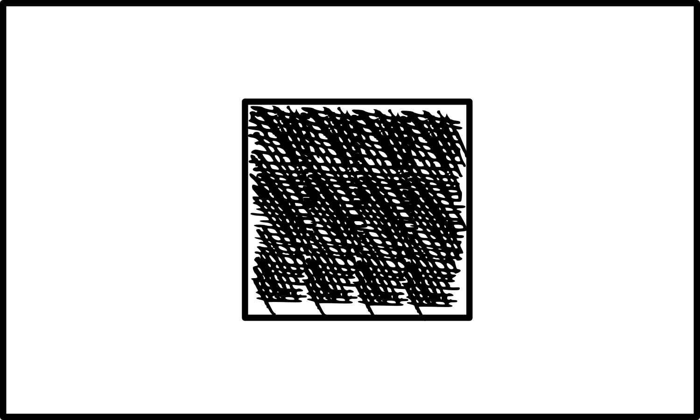
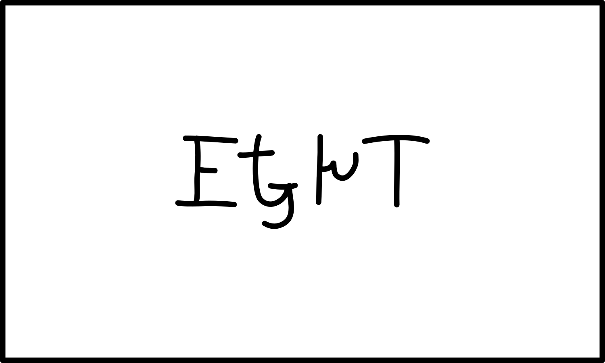

The colors you will be using are:

  - Green / ᎢᏤᎢᏳᏍᏗ. ☞ *If anyone is red-green color blind, add a drawing
    of a leaf.*

  - White / ᎤᏁᎦ. ☞ *Don’t color in the square.*

  - Brown / ᎤᏬᏗᎨᎢ.

  - Red / ᎩᎦᎨᎢ. (ᎩᎨᎢ.)

  - Black / ᎬᎿᎨᎢ. (ᎬᏂᎨᎢ.)

  - Blue / ᏌᎪᏂᎨᎢ.

  - Purple / ᏓᎭᎵᎨᎢ.

  - Yellow / ᏓᎶᏂᎨᎢ.

  - Orange / ᏓᎶᏂᎨ ᎤᏍᎪᎸᎢ.

For the second set you will need to create five copies of each the
following index cards:

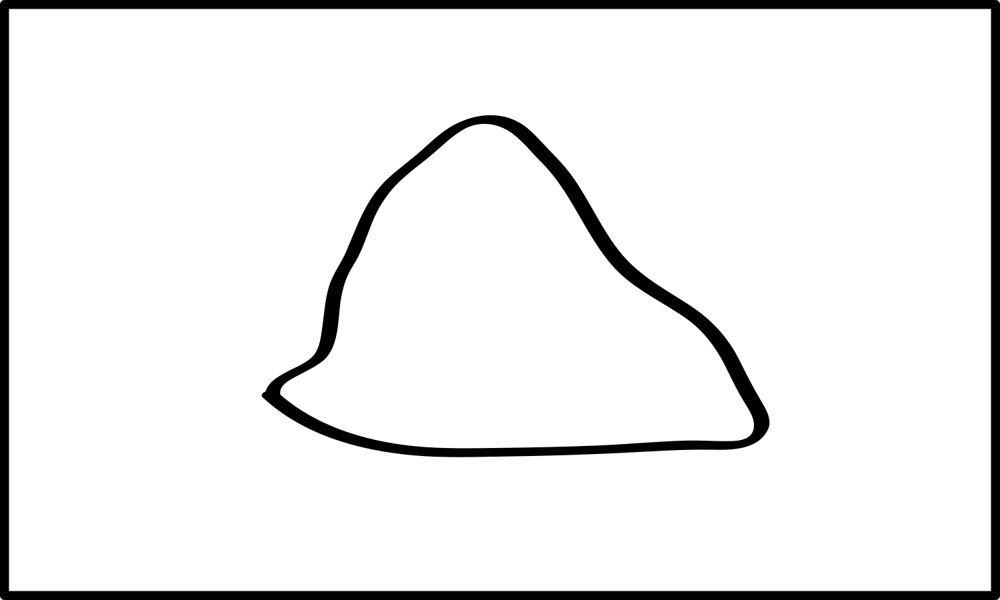 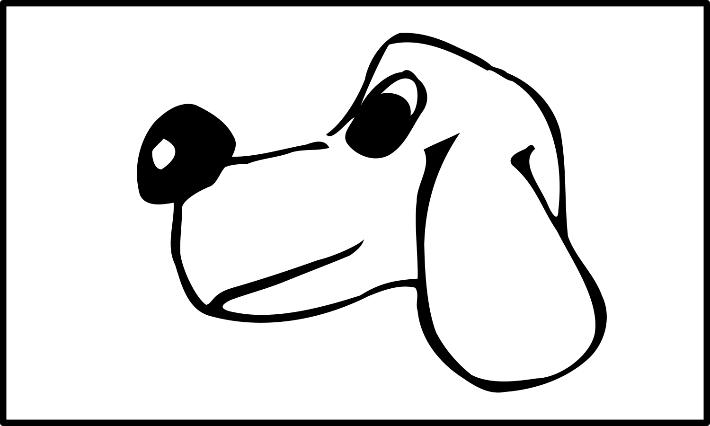
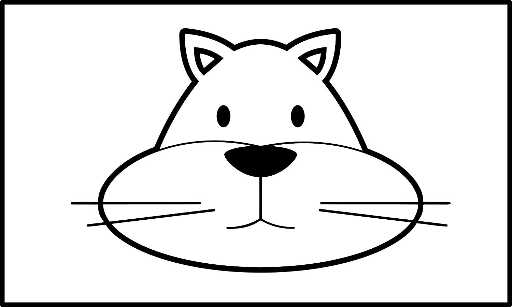
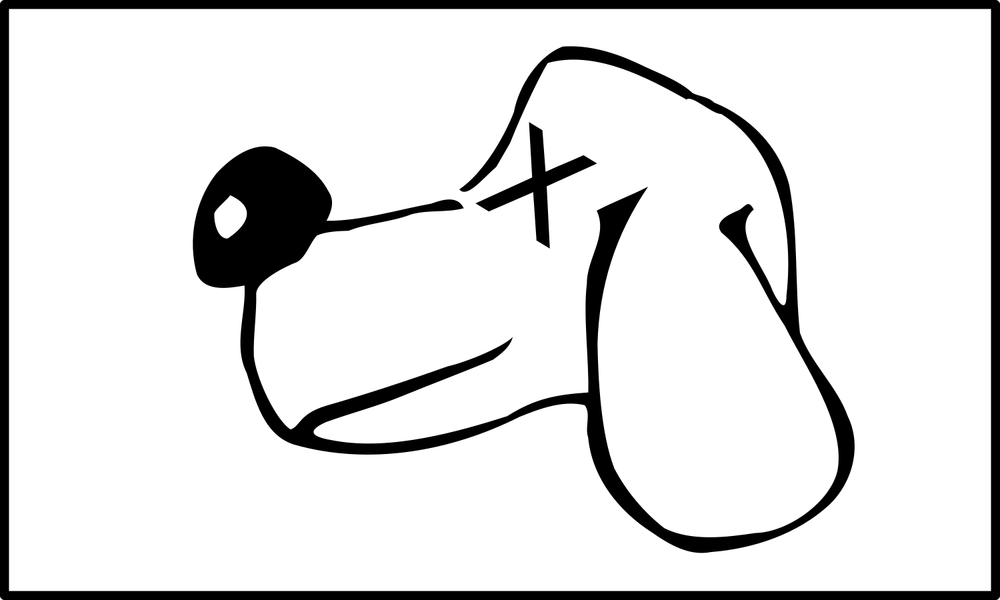
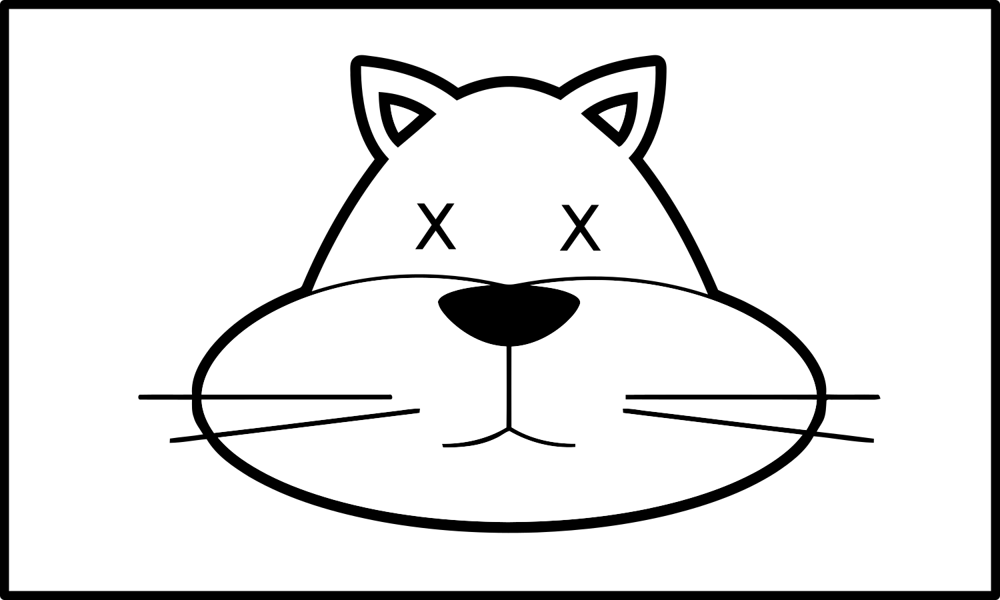

The picture goes on the front of each index card and gets colored in.
Each card needs to be colored as specified. On the reverse of the card
you will need to add the matching Cherokee.

☞ *If anyone is red-green color blind, add a drawing of a leaf to each
card with green on it.*

ᏅᏯ cards:

  - White / ᎤᏁᎦ ᏅᏯ. ☞ *Don’t color in the ᏅᏯ.*

  - Brown / ᎤᏬᏗᎨ ᏅᏯ.

  - Black / ᎬᎿᎨ ᏅᏯ. (ᎬᏂᎨ ᏅᏯ.)

  - Yellow / ᏓᎶᏂᎨ ᏅᏯ.

  - Orange / ᏓᎶᏂᎨ ᎤᏍᎪᎸ ᏅᏯ.

Alive ᎩᏟ cards:

  - Green / ᎢᏤᎢᏳᏍᏗ ᎩᏟ.

  - White / ᎤᏁᎦ ᎩᏟ. ☞ *Don’t color in the ᎩᏟ.*

  - Red / ᎠᎩᎦᎨ ᎩᏟ. (ᎠᎩᎨ ᎩᏟ.)

  - Purple / ᎠᏓᎭᎵᎨ ᎩᏟ.

  - Yellow / ᎠᏓᎶᏂᎨ ᎩᏟ.

Alive ᏪᏌ cards:

  - Green / ᎢᏤᎢᏳᏍᏗ ᏪᏌ.

  - Brown / ᎤᏬᏗᎨ ᏪᏌ.

  - Blue / ᎠᏌᎪᏂᎨ ᏪᏌ.

  - Purple / ᎠᏓᎭᎵᎨ ᏪᏌ.

  - Orange / ᎠᏓᎶᏂᎨ ᎤᏍᎪᎸ ᏪᏌ.

Dead ᎩᏟ cards:

  - White / ᎤᏁᎦ ᎩᏟ. ☞ *Don’t color in the ᎩᏟ.*

  - Black / ᎬᎿᎨ ᎩᏟ. (ᎬᏂᎨ ᎩᏟ.)

  - Blue / ᏌᎪᏂᎨ ᎩᏟ.

  - Yellow / ᏓᎶᏂᎨ ᎩᏟ.

  - Orange / ᏓᎶᏂᎨ ᎤᏍᎪᎸ ᎩᏟ.

Dead ᏪᏌ cards:

  - Green / ᎢᏤᎢᏳᏍᏗ ᏪᏌ.

  - Brown / ᎤᏬᏗᎨ ᏪᏌ.

  - Red / ᎩᎦᎨ ᏪᏌ. (ᎩᎨ ᏪᏌ.)

  - Black / ᎬᎿᎨ ᏪᏌ. (ᎬᏂᎨ ᏪᏌ.)

  - Yellow / ᏓᎶᏂᎨ ᏪᏌ.

Recommended areas on each card to color:

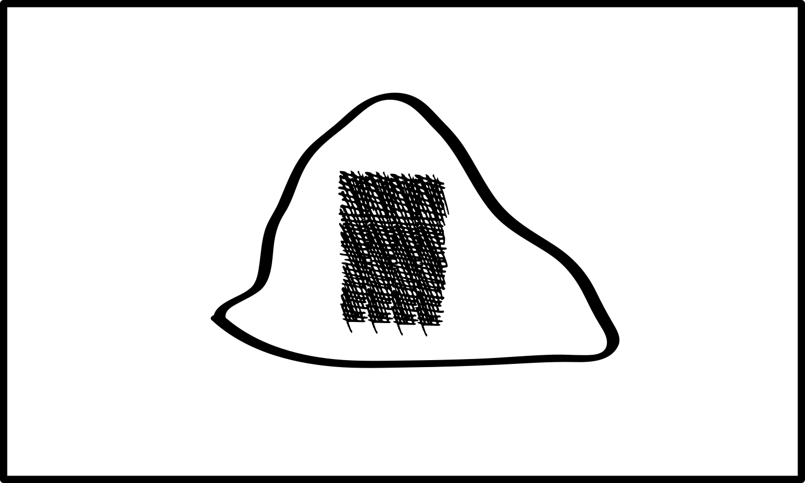
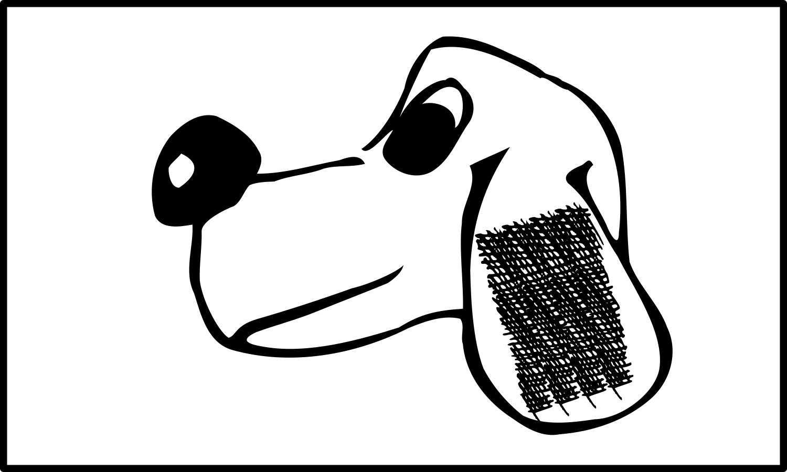
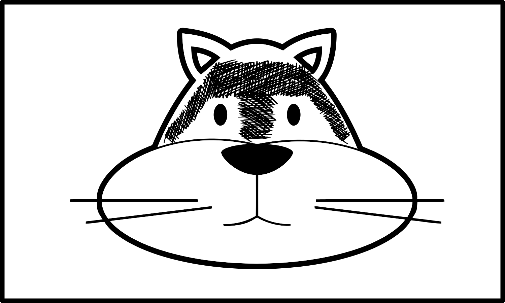
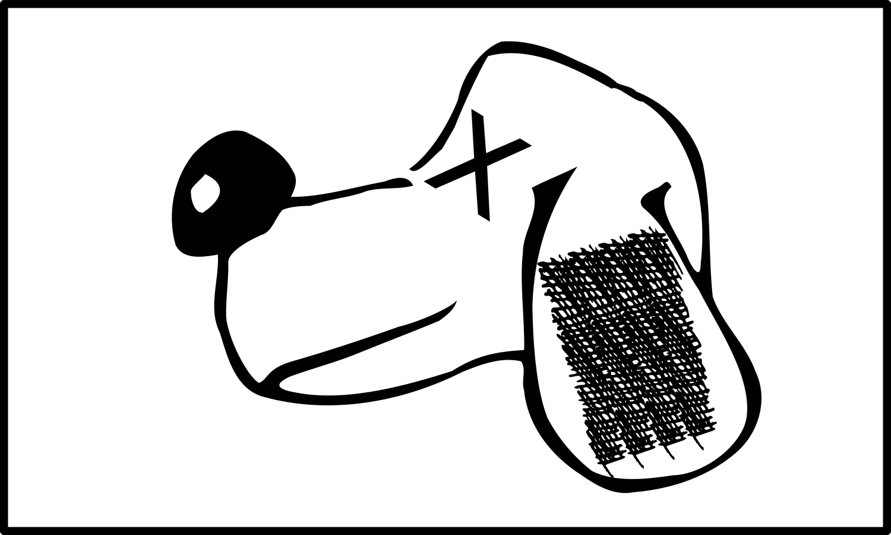
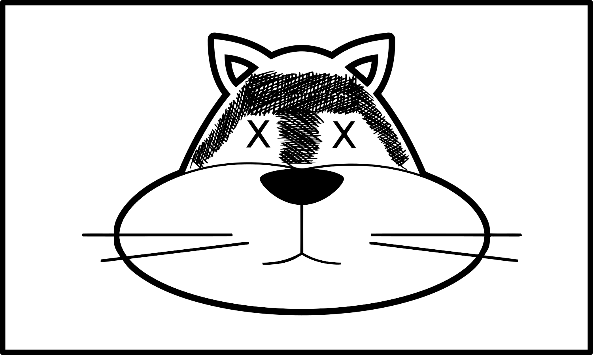

Divide up into groups of four to seven.

### Groups

For each group the first person is designated “Ꭰ”. The second person is
designated “Ꭱ”. Any remaining people are grouped together and are
designated “Ꭲ”. After each set, rotate positions so that “Ꭰ” becomes the
“Ꭱ”, the “Ꭱ” becomes one of the “Ꭲ”, and one of the “Ꭲ” becomes the “Ꭰ”.

☞ *Keep rotating until everyone has been in position “Ꭱ”, starting over
with the first set of challenges as needed.*

☞ *The “Ꭰ” responses should be read from the book. The “Ꭱ” responses
should be done without reading the book.*

For the first group of sets each challenge-response should be done as in
the following examples:

1.  ᎦᏙ ᎤᏍᏗ ᎤᏁᎦ?  
    “Ꭰ” asks “Ꭱ”: ᎦᏙ ᎤᏍᏗ ᎤᏁᎦ? (Which is white?)  
    “Ꭱ” selects the card they think is ᎤᏁᎦ.  
    “Ꭱ” says: ᎯᎠ ᎤᏁᎦ. (This is white.) ☞ (*Only use the spoken name.*)  
    “Ꭱ” flips the card over to see if they are correct or incorrect.  
    If incorrect “Ꭰ” should say: ᎥᏝ. Ꮎ \_\_\_\_\_. (No. That is
    \_\_\_\_\_.)

2.  ᎦᏙ ᎤᏍᏗ ᎩᎦᎨᎢ?  
    “Ꭰ” asks “Ꭱ”: ᎦᏙ ᎤᏍᏗ ᎩᎦᎨᎢ? (Which is red?)  
    “Ꭱ” selects the card they think is ᎩᎦᎨᎢ.  
    “Ꭱ” says: ᎯᎠ ᎩᎦᎨᎢ. (This is red.) ☞ (*Only use the spoken name.*)  
    “Ꭱ” flips the card over to see if they are correct or incorrect.  
    If incorrect “Ꭰ” should say: ᎥᏝ. Ꮎ \_\_\_\_\_. (No. That is
    \_\_\_\_\_.)

For the second group of sets each challenge-response should be done as
in the following examples:

1.  ᎦᏙ ᎤᏍᏗ ᎤᏁᎦ ᏅᏯ?  
    “Ꭰ” asks “Ꭱ”: ᎦᏙ ᎤᏍᏗ ᎤᏁᎦ? (Which is the white rock?)
    
    1.  ᎯᎠ ᎤᏁᎦ ᏅᏯ.  
        “Ꭱ” selects the card they think is the ᎤᏁᎦ ᏅᏯ.  
        “Ꭱ” says: ᎯᎠ ᎤᏁᎦ ᏅᏯ. (This is the white rock.)  
        “Ꭱ” flips the card over to see if they are correct or incorrect.

2.  ᎦᏙ ᎤᏍᏗ ᎠᎩᎦᎨᎢ ᎩᏟ?  
    “Ꭰ” asks “Ꭱ”: ᎦᏙ ᎤᏍᏗ ᎠᎩᎦᎨᎢ ᎩᏟ? (Which is the red dog?)
    
    1.  ᎯᎠ ᎠᎩᎦᎨᎢ ᎩᏟ.  
        “Ꭱ” selects the card they think is the ᎠᎩᎦᎨᎢ ᎩᏟ.  
        “Ꭱ” says: ᎯᎠ ᎠᎩᎦᎨᎢ ᎩᏟ. (This is the red dog.)  
        “Ꭱ” flips the card over to see if they are correct or incorrect.

3.  ᎦᏙ ᎤᏍᏗ ᎤᏁᎦ ᎩᏟ?  
    “Ꭰ” asks “Ꭱ”: ᎦᏙ ᎤᏍᏗ ᎤᏁᎦ ᎩᏟ? (Which is the white dog?)
    
    1.  ᎯᎠ ᎤᏁᎦ ᎩᏟ (alive) ᎠᎴ ᎯᎠ ᎤᏁᎦ ᎩᏟ (dead).  
        “Ꭱ” sees two cards that match.  
        “Ꭱ” selects each card they think is an ᎤᏁᎦ ᎩᏟ.  
        “Ꭱ” says: ᎯᎠ ᎤᏁᎦ ᎩᏟ ᎠᎴ ᎯᎠ ᎤᏁᎦ ᎩᏟ. (This is a white dog and this
        is a white dog.)  
        “Ꭱ” flips the cards over to see if they are correct or
        incorrect.  
        If “Ꭱ” does not select all the correct cards, “Ꭰ” shows them the
        other correct card.

### Someone Alone

For each set, write out all of the “Ꭰ” challenges on a sheet of paper.
Do not write out the “Ꭱ” responses.

☞ *The “Ꭰ” responses should be read aloud from the paper. The “Ꭱ”
responses should be done without reading anything. The book should then
be checked to see if the all correct cards were selected.*

### First Group

☞ *Repeat this group until everyone can do the “Ꭱ” responses smoothly
without having to reference the material.*

#### Set 1

1.  ᎦᏙ ᎤᏍᏗ ᎬᎿᎨᎢ?

2.  ᎦᏙ ᎤᏍᏗ ᎩᎨᎢ?

3.  ᎦᏙ ᎤᏍᏗ ᎤᏁᎦ?

4.  ᎦᏙ ᎤᏍᏗ ᎤᏬᏗᎨᎢ?

5.  ᎦᏙ ᎤᏍᏗ ᏌᎪᏂᎨᎢ?

#### Set 2

1.  ᎦᏙ ᎤᏍᏗ ᎬᏂᎨᎢ?

2.  ᎦᏙ ᎤᏍᏗ ᎤᏬᏗᎨᎢ?

3.  ᎦᏙ ᎤᏍᏗ ᎩᎦᎨᎢ?

4.  ᎦᏙ ᎤᏍᏗ ᏌᎪᏂᎨᎢ?

5.  ᎦᏙ ᎤᏍᏗ ᎤᏁᎦ?

#### Set 3

1.  ᎦᏙ ᎤᏍᏗ ᏓᎭᎵᎨᎢ?

2.  ᎦᏙ ᎤᏍᏗ ᎤᏬᏗᎨᎢ?

3.  ᎦᏙ ᎤᏍᏗ ᏓᎶᏂᎨᎢ?

4.  ᎦᏙ ᎤᏍᏗ ᏌᎪᏂᎨᎢ?

5.  ᎦᏙ ᎤᏍᏗ ᏓᎶᏂᎨᎢ?

#### Set 4

1.  ᎦᏙ ᎤᏍᏗ ᎢᏤᎢᏳᏍᏗ?

2.  ᎦᏙ ᎤᏍᏗ ᏓᎶᏂᎨ ᎤᏍᎪᎸᎢ?

3.  ᎦᏙ ᎤᏍᏗ ᏓᎭᎵᎨᎢ?

4.  ᎦᏙ ᎤᏍᏗ ᎢᏤᎢᏳᏍᏗ?

5.  ᎦᏙ ᎤᏍᏗ ᏓᎶᏂᎨ ᎤᏍᎪᎸᎢ?

#### Set 5

1.  ᎦᏙ ᎤᏍᏗ ᏓᎶᏂᎨᎢ?

2.  ᎦᏙ ᎤᏍᏗ ᎢᏤᎢᏳᏍᏗ?

3.  ᎦᏙ ᎤᏍᏗ ᏓᎶᏂᎨ ᎤᏍᎪᎸᎢ?

4.  ᎦᏙ ᎤᏍᏗ ᎬᏂᎨᎢ?

5.  ᎦᏙ ᎤᏍᏗ ᎩᎦᎨᎢ?

#### Set 6

1.  ᎦᏙ ᎤᏍᏗ ᎤᏁᎦ?

2.  ᎦᏙ ᎤᏍᏗ ᎤᏬᏗᎨᎢ?

3.  ᎦᏙ ᎤᏍᏗ ᏌᎪᏂᎨᎢ?

4.  ᎦᏙ ᎤᏍᏗ ᏓᎭᎵᎨᎢ?

5.  ᎦᏙ ᎤᏍᏗ ᏓᎶᏂᎨᎢ?

#### Set 7

1.  ᎦᏙ ᎤᏍᏗ ᎢᏤᎢᏳᏍᏗ?

2.  ᎦᏙ ᎤᏍᏗ ᏓᎶᏂᎨ ᎤᏍᎪᎸᎢ?

3.  ᎦᏙ ᎤᏍᏗ ᎬᎿᎨᎢ?

4.  ᎦᏙ ᎤᏍᏗ ᎩᎨᎢ?

5.  ᎦᏙ ᎤᏍᏗ ᎤᏁᎦ?

#### Set 8

1.  ᎦᏙ ᎤᏍᏗ ᎤᏬᏗᎨᎢ?

2.  ᎦᏙ ᎤᏍᏗ ᏌᎪᏂᎨᎢ?

3.  ᎦᏙ ᎤᏍᏗ ᏓᎭᎵᎨᎢ?

4.  ᎦᏙ ᎤᏍᏗ ᏓᎶᏂᎨᎢ?

5.  ᎦᏙ ᎤᏍᏗ ᎢᏤᎢᏳᏍᏗ?

#### Set 9

1.  ᎦᏙ ᎤᏍᏗ ᏓᎶᏂᎨ ᎤᏍᎪᎸᎢ?

2.  ᎦᏙ ᎤᏍᏗ ᎬᏂᎨᎢ?

3.  ᎦᏙ ᎤᏍᏗ ᎩᎨᎢ?

4.  ᎦᏙ ᎤᏍᏗ ᎤᏁᎦ?

5.  ᎦᏙ ᎤᏍᏗ ᏓᎭᎵᎨᎢ?

### Second Group

☞ *Repeat this group until everyone can do the “Ꭱ” responses smoothly
without having to reference the material.*

#### Set 1

1.  ᎦᏙ ᎤᏍᏗ ᎤᏁᎦ ᎩᏟ?
    
    1.  ᎯᎠ ᎤᏁᎦ ᎩᏟ (alive) ᎠᎴ ᎯᎠ ᎤᏁᎦ ᎩᏟ (dead).

2.  ᎦᏙ ᎤᏍᏗ ᎤᏁᎦ ᏅᏯ?
    
    1.  ᎯᎠ ᎤᏁᎦ ᏅᏯ.

3.  ᎦᏙ ᎤᏍᏗ ᎠᎩᎦᎨᎢ ᎩᏟ?
    
    1.  ᎯᎠ ᎠᎩᎦᎨᎢ ᎩᏟ.

4.  ᎦᏙ ᎤᏍᏗ ᎬᏂᎨᎢ ᎩᏟ?
    
    1.  ᎯᎠ ᎬᏂᎨᎢ ᎩᏟ.

5.  ᎦᏙ ᎤᏍᏗ ᎬᎿᎨᎢ ᏅᏯ?
    
    1.  ᎯᎠ ᎬᎿᎨᎢ ᏅᏯ.

6.  ᎦᏙ ᎤᏍᏗ ᎤᏁᎦ ᎩᏟ?
    
    1.  ᎯᎠ ᎤᏁᎦ ᎩᏟ (alive) ᎠᎴ ᎯᎠ ᎤᏁᎦ ᎩᏟ (dead).

7.  ᎦᏙ ᎤᏍᏗ ᎬᏂᎨᎢ ᎩᏟ?
    
    1.  ᎯᎠ ᎬᏂᎨᎢ ᎩᏟ.

8.  ᎦᏙ ᎤᏍᏗ ᎤᏁᎦ ᏅᏯ?
    
    1.  ᎯᎠ ᎤᏁᎦ ᏅᏯ.

9.  ᎦᏙ ᎤᏍᏗ ᎬᎿᎨᎢ ᏅᏯ?
    
    1.  ᎯᎠ ᎬᎿᎨᎢ ᏅᏯ.

10. ᎦᏙ ᎤᏍᏗ ᎠᎩᎨᎢ ᎩᏟ?
    
    1.  ᎯᎠ ᎠᎩᎨᎢ ᎩᏟ.

#### Set 2

1.  ᎦᏙ ᎤᏍᏗ ᎬᎿᎨᎢ ᏪᏌ?
    
    1.  ᎯᎠ ᎬᎿᎨᎢ ᏪᏌ.

2.  ᎦᏙ ᎤᏍᏗ ᎬᏂᎨᎢ ᎩᏟ?
    
    1.  ᎯᎠ ᎬᏂᎨᎢ ᎩᏟ.

3.  ᎦᏙ ᎤᏍᏗ ᎩᎨᎢ ᏪᏌ?
    
    1.  ᎯᎠ ᎩᎨᎢ ᏪᏌ.

4.  ᎦᏙ ᎤᏍᏗ ᎬᎿᎨᎢ ᏅᏯ?
    
    1.  ᎯᎠ ᎬᎿᎨᎢ ᏅᏯ.

5.  ᎦᏙ ᎤᏍᏗ ᎩᎦᎨᎢ ᏪᏌ?
    
    1.  ᎯᎠ ᎩᎦᎨᎢ ᏪᏌ.

6.  ᎦᏙ ᎤᏍᏗ ᎤᏬᏗᎨ ᏅᏯ?
    
    1.  ᎯᎠ ᎤᏬᏗᎨ ᏅᏯ.

7.  ᎦᏙ ᎤᏍᏗ ᎤᏬᏗᎨ ᏪᏌ?
    
    1.  ᎯᎠ ᎤᏬᏗᎨ ᏪᏌ (alive) ᎠᎴ ᎯᎠ ᎤᏬᏗᎨ ᏪᏌ (dead).

8.  ᎦᏙ ᎤᏍᏗ ᎬᏂᎨᎢ ᏪᏌ?
    
    1.  ᎯᎠ ᎬᏂᎨᎢ ᏪᏌ.

9.  ᎦᏙ ᎤᏍᏗ ᎤᏬᏗᎨ ᏅᏯ?
    
    1.  ᎯᎠ ᎤᏬᏗᎨ ᏅᏯ.

10. ᎦᏙ ᎤᏍᏗ ᎤᏬᏗᎨ ᏪᏌ?
    
    1.  ᎯᎠ ᎤᏬᏗᎨ ᏪᏌ (alive) ᎠᎴ ᎯᎠ ᎤᏬᏗᎨ ᏪᏌ (dead).

#### Set 3

1.  ᎦᏙ ᎤᏍᏗ ᏌᎪᏂᎨ ᎩᏟ?
    
    1.  ᎯᎠ ᏌᎪᏂᎨ ᎩᏟ.

2.  ᎦᏙ ᎤᏍᏗ ᏓᎶᏂᎨ ᎩᏟ?
    
    1.  ᎯᎠ ᏓᎶᏂᎨ ᎩᏟ.

3.  ᎦᏙ ᎤᏍᏗ ᎩᎦᎨᎢ ᏪᏌ?
    
    1.  ᎯᎠ ᎩᎦᎨᎢ ᏪᏌ.

4.  ᎦᏙ ᎤᏍᏗ ᏌᎪᏂᎨ ᎩᏟ?
    
    1.  ᎯᎠ ᏌᎪᏂᎨ ᎩᏟ.

5.  ᎦᏙ ᎤᏍᏗ ᏓᎶᏂᎨ ᎩᏟ?
    
    1.  ᎯᎠ ᏓᎶᏂᎨ ᎩᏟ.

6.  ᎦᏙ ᎤᏍᏗ ᏓᎶᏂᎨ ᏅᏯ?
    
    1.  ᎯᎠ ᏓᎶᏂᎨ ᏅᏯ.

7.  ᎦᏙ ᎤᏍᏗ ᎤᏬᏗᎨ ᏅᏯ?
    
    1.  ᎯᎠ ᎤᏬᏗᎨ ᏅᏯ.

8.  ᎦᏙ ᎤᏍᏗ ᎤᏬᏗᎨ ᏪᏌ?
    
    1.  ᎯᎠ ᎤᏬᏗᎨ ᏪᏌ (alive) ᎠᎴ ᎯᎠ ᎤᏬᏗᎨ ᏪᏌ (dead).

9.  ᎦᏙ ᎤᏍᏗ ᏓᎶᏂᎨ ᏅᏯ?
    
    1.  ᎯᎠ ᏓᎶᏂᎨ ᏅᏯ.

10. ᎦᏙ ᎤᏍᏗ ᏓᎶᏂᎨ ᏪᏌ?
    
    1.  ᎯᎠ ᏓᎶᏂᎨ ᏪᏌ.

#### Set 4

1.  ᎦᏙ ᎤᏍᏗ ᏌᎪᏂᎨ ᎩᏟ?
    
    1.  ᎯᎠ ᏌᎪᏂᎨ ᎩᏟ.

2.  ᎦᏙ ᎤᏍᏗ ᏓᎶᏂᎨ ᎩᏟ?
    
    1.  ᎯᎠ ᏓᎶᏂᎨ ᎩᏟ.

3.  ᎦᏙ ᎤᏍᏗ ᏓᎶᏂᎨ ᏪᏌ?
    
    1.  ᎯᎠ ᏓᎶᏂᎨ ᏪᏌ.

4.  ᎦᏙ ᎤᏍᏗ ᎠᏌᎪᏂᎨ ᏪᏌ?
    
    1.  ᎯᎠ ᎠᏌᎪᏂᎨ ᏪᏌ.

5.  ᎦᏙ ᎤᏍᏗ ᏓᎶᏂᎨ ᏅᏯ?
    
    1.  ᎯᎠ ᏓᎶᏂᎨ ᏅᏯ.

6.  ᎦᏙ ᎤᏍᏗ ᎠᏌᎪᏂᎨ ᏪᏌ?
    
    1.  ᎯᎠ ᎠᏌᎪᏂᎨ ᏪᏌ.

7.  ᎦᏙ ᎤᏍᏗ ᎠᏓᎭᎵᎨ ᎩᏟ?
    
    1.  ᎯᎠ ᎠᏓᎭᎵᎨ ᎩᏟ.

8.  ᎦᏙ ᎤᏍᏗ ᎠᏓᎭᎵᎨ ᏪᏌ?
    
    1.  ᎯᎠ ᎠᏓᎭᎵᎨ ᏪᏌ.

9.  ᎦᏙ ᎤᏍᏗ ᏓᎶᏂᎨ ᏪᏌ?
    
    1.  ᎯᎠ ᏓᎶᏂᎨ ᏪᏌ.

10. ᎦᏙ ᎤᏍᏗ ᎠᏓᎭᎵᎨ ᎩᏟ?
    
    1.  ᎯᎠ ᎠᏓᎭᎵᎨ ᎩᏟ.

#### Set 5

1.  ᎦᏙ ᎤᏍᏗ ᎠᏓᎭᎵᎨ ᏪᏌ?
    
    1.  ᎯᎠ ᎠᏓᎭᎵᎨ ᏪᏌ.

2.  ᎦᏙ ᎤᏍᏗ ᎠᏌᎪᏂᎨ ᏪᏌ?
    
    1.  ᎯᎠ ᎠᏌᎪᏂᎨ ᏪᏌ.

3.  ᎦᏙ ᎤᏍᏗ ᎠᏓᎶᏂᎨ ᎩᏟ?
    
    1.  ᎯᎠ ᎠᏓᎶᏂᎨ ᎩᏟ.

4.  ᎦᏙ ᎤᏍᏗ ᎠᏓᎭᎵᎨ ᎩᏟ?
    
    1.  ᎯᎠ ᎠᏓᎭᎵᎨ ᎩᏟ.

5.  ᎦᏙ ᎤᏍᏗ ᎠᏓᎭᎵᎨ ᏪᏌ?
    
    1.  ᎯᎠ ᎠᏓᎭᎵᎨ ᏪᏌ.

6.  ᎦᏙ ᎤᏍᏗ ᎢᏤᎢᏳᏍᏗ ᎩᏟ?
    
    1.  ᎯᎠ ᎢᏤᎢᏳᏍᏗ ᎩᏟ.

7.  ᎦᏙ ᎤᏍᏗ ᎠᏓᎶᏂᎨ ᎩᏟ?
    
    1.  ᎯᎠ ᎠᏓᎶᏂᎨ ᎩᏟ.

8.  ᎦᏙ ᎤᏍᏗ ᎢᏤᎢᏳᏍᏗ ᏪᏌ?
    
    1.  ᎯᎠ ᎢᏤᎢᏳᏍᏗ ᏪᏌ (alive) ᎠᎴ ᎯᎠ ᎢᏤᎢᏳᏍᏗ ᏪᏌ (dead).

9.  ᎦᏙ ᎤᏍᏗ ᏓᎶᏂᎨ ᎤᏍᎪᎸ ᎩᏟ?
    
    1.  ᎯᎠ ᏓᎶᏂᎨ ᎤᏍᎪᎸ ᎩᏟ.

10. ᎦᏙ ᎤᏍᏗ ᎢᏤᎢᏳᏍᏗ ᎩᏟ?
    
    1.  ᎯᎠ ᎢᏤᎢᏳᏍᏗ ᎩᏟ.

#### Set 6

1.  ᎦᏙ ᎤᏍᏗ ᏓᎶᏂᎨ ᎤᏍᎪᎸ ᎩᏟ?
    
    1.  ᎯᎠ ᏓᎶᏂᎨ ᎤᏍᎪᎸ ᎩᏟ.

2.  ᎦᏙ ᎤᏍᏗ ᏓᎶᏂᎨ ᎤᏍᎪᎸ ᏅᏯ?
    
    1.  ᎯᎠ ᏓᎶᏂᎨ ᎤᏍᎪᎸ ᏅᏯ.

3.  ᎦᏙ ᎤᏍᏗ ᎢᏤᎢᏳᏍᏗ ᏪᏌ?
    
    1.  ᎯᎠ ᎢᏤᎢᏳᏍᏗ ᏪᏌ (alive) ᎠᎴ ᎯᎠ ᎢᏤᎢᏳᏍᏗ ᏪᏌ (dead).

4.  ᎦᏙ ᎤᏍᏗ ᏓᎶᏂᎨ ᎤᏍᎪᎸ ᏅᏯ?
    
    1.  ᎯᎠ ᏓᎶᏂᎨ ᎤᏍᎪᎸ ᏅᏯ.

5.  ᎦᏙ ᎤᏍᏗ ᎠᏓᎶᏂᎨ ᎤᏍᎪᎸ ᏪᏌ?
    
    1.  ᎯᎠ ᎠᏓᎶᏂᎨ ᎤᏍᎪᎸ ᏪᏌ.

6.  ᎦᏙ ᎤᏍᏗ ᏓᎶᏂᎨ ᎤᏍᎪᎸ ᎩᏟ?
    
    1.  ᎯᎠ ᏓᎶᏂᎨ ᎤᏍᎪᎸ ᎩᏟ.

7.  ᎦᏙ ᎤᏍᏗ ᎠᏓᎶᏂᎨ ᎤᏍᎪᎸ ᏪᏌ?
    
    1.  ᎯᎠ ᎠᏓᎶᏂᎨ ᎤᏍᎪᎸ ᏪᏌ.

8.  ᎦᏙ ᎤᏍᏗ ᏓᎶᏂᎨ ᎤᏍᎪᎸ ᏅᏯ?
    
    1.  ᎯᎠ ᏓᎶᏂᎨ ᎤᏍᎪᎸ ᏅᏯ.

9.  ᎦᏙ ᎤᏍᏗ ᎠᏓᎶᏂᎨ ᎤᏍᎪᎸ ᏪᏌ?
    
    1.  ᎯᎠ ᎠᏓᎶᏂᎨ ᎤᏍᎪᎸ ᏪᏌ.

10. ᎦᏙ ᎤᏍᏗ ᎤᏁᎦ ᎩᏟ?
    
    1.  ᎯᎠ ᎤᏁᎦ ᎩᏟ (alive) ᎠᎴ ᎯᎠ ᎤᏁᎦ ᎩᏟ (dead).