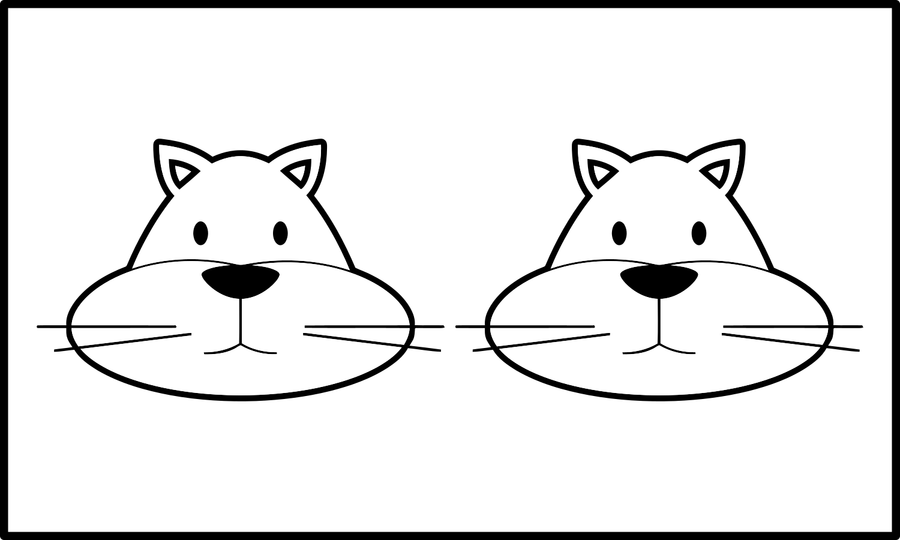

+++
draft = false
date = 2020-03-26T17:41:36Z
title = "ᏍᎩᎦᏚᏏᏁᎢ ᎠᏕᎶᏆᏍᏗ"
weight = 1585244490

[taxonomies]
authors = ["Michael Conrad"]
categories = ["Lessons", "Grammar"]
tags = []

[extra]
zulma_title="Cherokee Language Lessons 1"
featured_image = "lessons/Cherokee-Language-Lessons-Volume-1/Cherokee-Language-Lessons-Volume-1.png"

+++
## ᏘᎪᎵᏯ (Read them)

When talking about multiple animate things, the prefix ᎠᏂ- is added if
the word doesn’t start with Ꭴ:

  - ᎠᏂᏤᎢ  
    \[ạ²ni²je⁴ɂi\] “Green of fruit or vegetable.”

  - ᎠᏂᏤᎢᏳᏍᏗ  
    \[ạ²ni²je³ɂị²yu⁴sdi\] “Green colored.”

  - ᎠᏂᎩᎦᎨᎢ  
    \[ạ²ni²gi²³gạ³ge⁴ɂi\] “Red.”
<!-- more -->
  - ᎠᏂᏓᎭᎵᎨᎢ  
    \[ạ²ni²dạ²ha²lị²ge⁴ɂi\] “Purple.”

  - ᎠᏂᎬᎿᎨᎢ  
    \[ạ²ni²gv²³hnạ³ge⁴ɂi\] “Black.”

  - ᎠᏂᏌᎪᏂᎨᎢ  
    \[ạ²ni²sạ²ko²³nị³ge⁴ɂi\] “Blue.”

  - ᎠᏂᏓᎶᏂᎨᎢ  
    \[ạ²ni²dạ²lo²³nị³ge⁴ɂi\] “Yellow.”

For “Ꭴ-” words, when talking about multiple animate things, either the
prefix ᎤᏂ- or ᏧᏂ- is added after removing the Ꭴ- or ᎤᏩ͓-. Which to use
for which word will be specified as part of your vocabulary.

  - ᎤᏂᏁᎦ  
    \[u²ni²ne⁴ga\] “White.”

  - ᎤᏂᏍᎪᎸᎢ  
    \[u¹nị²sgo²³lv⁴ɂi\] “Dim. Faded.”

  - ᏧᏃᏗᎨᎢ  
    \[ju²no²³dị³ge⁴ɂi\] “Brown.”

When talking about multiple inanimate things, the prefix “Ꮧ̣-” is added.
☞ *Note: When “Ꮧ̣-” is used with a word starting with “Ꭱ-”, “Ꭳ-”, “Ꭴ-”,
or “Ꭵ-” the two sounds combine together and become one of “Ꮴ-”, “Ꮶ-”,
“Ꮷ-”, or “Ꮸ-”. When “Ꮧ̣-” is used on a word that starts with “Ꭰ-” or
“Ꭲ-”, the “Ꭰ-” or “Ꭲ-” is dropped before “Ꮧ̣-” is added.*

  - ᏗᏤᎢ  
    \[dị²je⁴ɂi\] “Green of fruit or vegetable.”

  - ᏗᏤᎢᏳᏍᏗ  
    \[dị²je³ɂị²yu⁴sdi\] “Green colored.”

  - ᏧᏁᎦ  
    \[ju²ne⁴ga\] “White.”

  - ᏧᏍᎪᎸᎢ  
    \[ju²sgo²³lv⁴ɂi\] “Dim. Faded.”

  - ᏧᏬᏗᎨᎢ  
    \[jụ²wo²³dị³ge⁴ɂi\] “Brown.”

  - ᏗᎩᎦᎨᎢ  
    \[dị²gi²³gạ³ge⁴ɂi\] “Red.”

  - ᏗᎬᎿᎨᎢ  
    \[dị²gv²³hnạ³ge⁴ɂi\] “Black.”

  - ᏗᏌᎪᏂᎨᎢ  
    \[dị²sạ²ko²³nị³ge⁴ɂi\] “Blue.”

  - ᏗᏓᎭᎵᎨᎢ  
    \[dị²dạ²ha²lị²ge⁴ɂi\] “Purple.”

  - ᏗᏓᎶᏂᎨᎢ  
    \[dị²dạ²lo²³nị³ge⁴ɂi\] “Yellow.”

## ᏂᏔᏛᎦ (Do them)

You will need the following:

  - 30 *white* index cards.

  - A box of crayons for coloring the index cards. ☞ *The “boxes of 8”
    as sold in many stores should have all the colors needed.*

You will need to create six copies each of the following index cards:

The picture goes on the front of each index card and gets colored in.
Each card needs to be colored as specified. On the reverse of the card
you will need to add the matching Cherokee.

☞ *If anyone is red-green color blind, add a drawing of a leaf to each
card with green on it.*

Alive ᏌᏊ ᎩᏟ cards:

  - Green / ᎢᏤᎢᏳᏍᏗ ᎩᏟ.

  - White / ᎤᏁᎦ ᎩᏟ.

  - Brown / ᎤᏬᏗᎨ ᎩᏟ.

  - Black / ᎠᎬᎿᎨ ᎩᏟ.

  - Yellow / ᎠᏓᎶᏂᎨ ᎩᏟ.

  - Orange / ᎠᏓᎶᏂᎨ ᎤᏍᎪᎸ ᎩᏟ.

Alive ᎠᏂᏔᎵ ᏪᏌ cards:

  - Green / ᎠᏂᏤᎢᏳᏍᏗ ᏪᏌ.

  - White / ᎤᏂᏁᎦ ᏪᏌ.

  - Brown / ᏧᏃᏗᎨ ᏪᏌ.

  - Black / ᎠᏂᎬᎿᎨ ᏪᏌ.

  - Yellow / ᎠᏂᏓᎶᏂᎨ ᏪᏌ.

  - Orange / ᎠᏂᏓᎶᏂᎨ ᎤᏂᏍᎪᎸ ᏪᏌ.

Dead ᏌᏊ ᎩᏟ cards:

  - Green / ᎢᏤᎢᏳᏍᏗ ᎩᏟ.

  - White / ᎤᏁᎦ ᎩᏟ.

  - Brown / ᎤᏬᏗᎨ ᎩᏟ.

  - Black / ᎬᎿᎨ ᎩᏟ.

  - Yellow / ᏓᎶᏂᎨ ᎩᏟ .

  - Orange / ᏓᎶᏂᎨ ᎤᏍᎪᎸ ᎩᏟ.

Dead ᏔᎵ ᏪᏌ cards:

  - Green / ᏗᏤᎢᏳᏍᏗ ᏪᏌ.

  - White / ᏧᏁᎦ ᏪᏌ.

  - Brown / ᏧᏬᏗᎨ ᏪᏌ.

  - Black / ᏗᎬᎿᎨ ᏪᏌ.

  - Yellow / ᏗᏓᎶᏂᎨ ᏪᏌ .

  - Orange / ᏗᏓᎶᏂᎨ ᏧᏍᎪᎸ ᏪᏌ.

Divide up into groups of four to seven.

### Groups

For each group the first person is designated “Ꭰ”. The second person is
designated “Ꭱ”. Any remaining people are grouped together and are
designated “Ꭲ”. After each set, rotate positions so that “Ꭰ” becomes the
“Ꭱ”, the “Ꭱ” becomes one of the “Ꭲ”, and one of the “Ꭲ” becomes the “Ꭰ”.

☞ *Keep rotating until everyone has been in position “Ꭱ”, starting over
with the first set of challenges as needed.*

☞ *The “Ꭰ” responses should be read from the book. The “Ꭱ” responses
should be done without reading the book.*

Each challenge-response should be done as in the following examples:

1.  ᎬᎿᎨ ᎩᏟ.  
    “Ꭰ” selects the dead black dog card and shows the picture to “Ꭱ”.
    
    1.  \[Ꭰ→Ꭱ\] ᎦᏙ ᎤᏍᏗ?  
        “Ꭰ” asks: What is it?
    
    2.  \[Ꭱ\] ᎯᎠ ᎬᎿᎨ ᎩᏟ.  
        “Ꭱ” responds: This is a black dog.

2.  ᏧᏁᎦ ᏪᏌ.  
    “Ꭰ” selects the dead white cats card and shows the picture to “Ꭱ”.
    
    1.  \[Ꭰ→Ꭱ\] ᎦᏙ ᏧᏍᏗ?  
        “Ꭰ” asks: What are these?
    
    2.  \[Ꭱ\] ᎯᎠ ᏧᏁᎦ ᏪᏌ.  
        “Ꭱ” responds: These are white cats.

3.  \[Ꭰ→Ꭱ\] ᎦᏙ ᎤᏍᏗ ᎤᏁᎦ ᎩᏟ?  
    “Ꭰ” asks “Ꭱ”: Which one is a white dog?
    
    1.  \[Ꭱ\] ᎯᎠ ᎤᏁᎦ ᎩᏟ (alive) ᎠᎴ ᎯᎠ ᎤᏁᎦ ᎩᏟ (dead).  
        “Ꭱ” sees two cards that match.  
        “Ꭱ” selects each card they think is an ᎤᏁᎦ ᎩᏟ.  
        “Ꭱ” says: ᎯᎠ ᎤᏁᎦ ᎩᏟ ᎠᎴ ᎯᎠ ᎤᏁᎦ ᎩᏟ. (This is a white dog and this
        is a white dog.)  
        “Ꭱ” flips the cards over to see if they are correct or
        incorrect.  
        If “Ꭱ” does not select all the correct cards, “Ꭰ” shows them the
        other correct card.

4.  \[Ꭰ→Ꭱ\] ᎦᏙ ᎤᎾᏍᏗ ᎤᏂᏁᎦ ᏪᏌ?  
    “Ꭰ” asks “Ꭱ”: Which ones are (alive) white cats?
    
    1.  \[Ꭱ\] ᎯᎠ ᎤᏂᏁᎦ ᏪᏌ.  
        “Ꭱ” selects the card they think is an ᎤᏂᏁᎦ ᏪᏌ.  
        “Ꭱ” responds: These are white cats.

### Someone Alone

There are two different types of challenges in the sets. You will need
to do each type differently.

#### Which ones?

Write out all of the challenges that start with “\[Ꭰ→Ꭱ\]” on a sheet of
paper. Do not write out the “Ꭱ” responses. The “Ꭰ” challenges should be
read aloud from the paper. The “Ꭱ” responses should be done without
reading anything. The book should then be checked to see if the all
correct cards were selected.

☞ *Repeat this exercise until you can select all the correct pictures
for each challenge without having to reference the material. The faster
you can select the correct pictures, the better.*

#### What is it?

Take all the index cards and shuffle them well. Cycle through the cards
and for each picture say: “ᎯᎠ \_\_\_\_\_.” Turn the card over to see if
you are correct.

☞ *After you have cycled through all the cards shuffle them well before
doing the exercise again.*

☞ *Repeat this exercise until you can correctly describe each picture
without having to reference the material. The faster you can describe
each picture, the better.*

### Sets

☞ *Repeat this group until everyone can do the “Ꭱ” responses smoothly
without having to reference the material.*

#### Set 1

1.  \[Ꭰ→Ꭱ\] ᎦᏙ ᎤᏍᏗ ᎢᏤᎢᏳᏍᏗ ᎩᏟ?
    
    1.  \[Ꭱ\] ᎯᎠ ᎢᏤᎢᏳᏍᏗ ᎩᏟ (alive) ᎠᎴ ᎯᎠ ᎢᏤᎢᏳᏍᏗ ᎩᏟ (dead).

2.  \[Ꭰ→Ꭱ\] ᎦᏙ ᎤᏍᏗ ᎤᏁᎦ ᎩᏟ?
    
    1.  \[Ꭱ\] ᎯᎠ ᎤᏁᎦ ᎩᏟ (alive) ᎠᎴ ᎯᎠ ᎤᏁᎦ ᎩᏟ (dead).

3.  \[Ꭰ→Ꭱ\] ᎦᏙ ᎤᏍᏗ ᎤᏬᏗᎨ ᎩᏟ?
    
    1.  \[Ꭱ\] ᎯᎠ ᎤᏬᏗᎨ ᎩᏟ (alive) ᎠᎴ ᎯᎠ ᎤᏬᏗᎨ ᎩᏟ (dead).

4.  \[Ꭰ→Ꭱ\] ᎦᏙ ᎤᏍᏗ ᎠᎬᎿᎨ ᎩᏟ?
    
    1.  \[Ꭱ\] ᎯᎠ ᎠᎬᎿᎨ ᎩᏟ.

5.  \[Ꭰ→Ꭱ\] ᎦᏙ ᎤᏍᏗ ᎠᏓᎶᏂᎨ ᎩᏟ?
    
    1.  \[Ꭱ\] ᎯᎠ ᎠᏓᎶᏂᎨᎢ ᎩᏟ.

6.  \[Ꭰ→Ꭱ\] ᎦᏙ ᎤᏍᏗ ᎠᏓᎶᏂᎨ ᎤᏍᎪᎸ ᎩᏟ?
    
    1.  \[Ꭱ\] ᎯᎠ ᎠᏓᎶᏂᎨᎢ ᎤᏍᎪᎸ ᎩᏟ.

7.  \[Ꭰ→Ꭱ\] ᎦᏙ ᎤᏍᏗ ᎬᎿᎨ ᎩᏟ?
    
    1.  \[Ꭱ\] ᎯᎠ ᎬᎿᎨ ᎩᏟ.

8.  \[Ꭰ→Ꭱ\] ᎦᏙ ᎤᏍᏗ ᏓᎶᏂᎨ ᎩᏟ?
    
    1.  \[Ꭱ\] ᎯᎠ ᏓᎶᏂᎨ ᎩᏟ.

9.  \[Ꭰ→Ꭱ\] ᎦᏙ ᎤᏍᏗ ᏓᎶᏂᎨ ᎤᏍᎪᎸ ᎩᏟ?
    
    1.  \[Ꭱ\] ᎯᎠ ᏓᎶᏂᎨ ᎤᏍᎪᎸ ᎩᏟ.

#### Set 2

1.  \[Ꭰ→Ꭱ\] ᎦᏙ ᎤᎾᏍᏗ ᎠᏂᏤᎢᏳᏍᏗ ᏪᏌ?
    
    1.  \[Ꭱ\] ᎯᎠ ᎠᏂᏤᎢᏳᏍᏗ ᏪᏌ.

2.  \[Ꭰ→Ꭱ\] ᎦᏙ ᎤᎾᏍᏗ ᎤᏂᏁᎦ ᏪᏌ?
    
    1.  \[Ꭱ\] ᎯᎠ ᎤᏂᏁᎦ ᏪᏌ.

3.  \[Ꭰ→Ꭱ\] ᎦᏙ ᎤᎾᏍᏗ ᏧᏃᏗᎨ ᏪᏌ?
    
    1.  \[Ꭱ\] ᎯᎠ ᏧᏃᏗᎨ ᏪᏌ.

4.  \[Ꭰ→Ꭱ\] ᎦᏙ ᎤᎾᏍᏗ ᎠᏂᎬᎿᎨ ᏪᏌ?
    
    1.  \[Ꭱ\] ᎯᎠ ᎠᏂᎬᎿᎨ ᏪᏌ.

5.  \[Ꭰ→Ꭱ\] ᎦᏙ ᎤᎾᏍᏗ ᎠᏂᏓᎶᏂᎨ ᏪᏌ?
    
    1.  \[Ꭱ\] ᎯᎠ ᎠᏂᏓᎶᏂᎨ ᏪᏌ.

6.  \[Ꭰ→Ꭱ\] ᎦᏙ ᎤᎾᏍᏗ ᎠᏂᏓᎶᏂᎨ ᎤᏂᏍᎪᎸ ᏪᏌ?
    
    1.  \[Ꭱ\] ᎯᎠ ᎠᏂᏓᎶᏂᎨ ᎤᏂᏍᎪᎸ ᏪᏌ.

7.  \[Ꭰ→Ꭱ\] ᎦᏙ ᏧᏍᏗ ᏗᏤᎢᏳᏍᏗ ᏪᏌ?
    
    1.  \[Ꭱ\] ᎯᎠ ᏗᏤᎢᏳᏍᏗ ᏪᏌ.

8.  \[Ꭰ→Ꭱ\] ᎦᏙ ᏧᏍᏗ ᏧᏁᎦ ᏪᏌ?
    
    1.  \[Ꭱ\] ᎯᎠ ᏧᏁᎦ ᏪᏌ.

9.  \[Ꭰ→Ꭱ\] ᎦᏙ ᏧᏍᏗ ᏧᏬᏗᎨ ᏪᏌ?
    
    1.  \[Ꭱ\] ᎯᎠ ᏧᏬᏗᎨ ᏪᏌ.

#### Set 3

1.  \[Ꭰ→Ꭱ\] ᎦᏙ ᏧᏍᏗ ᏗᎬᎿᎨ ᏪᏌ?
    
    1.  \[Ꭱ\] ᎯᎠ ᏗᎬᎿᎨ ᏪᏌ.

2.  \[Ꭰ→Ꭱ\] ᎦᏙ ᏧᏍᏗ ᏗᏓᎶᏂᎨ ᏪᏌ?
    
    1.  \[Ꭱ\] ᎯᎠ ᏗᏓᎶᏂᎨᎢ ᏪᏌ.

3.  \[Ꭰ→Ꭱ\] ᎦᏙ ᏧᏍᏗ ᏗᏓᎶᏂᎨ ᏧᏍᎪᎸ ᏪᏌ?
    
    1.  \[Ꭱ\] ᎯᎠ ᏗᏓᎶᏂᎨᎢ ᏧᏍᎪᎸ ᏪᏌ.

4.  ᎢᏤᎢᏳᏍᏗ ᎩᏟ (alive).
    
    1.  \[Ꭰ→Ꭱ\] ᎦᏙ ᎤᏍᏗ?
    
    2.  \[Ꭱ\] ᎯᎠ ᎢᏤᎢᏳᏍᏗ ᎩᏟ.

5.  ᎤᏁᎦ ᎩᏟ (alive).
    
    1.  \[Ꭰ→Ꭱ\] ᎦᏙ ᎤᏍᏗ?
    
    2.  \[Ꭱ\] ᎯᎠ ᎤᏁᎦ ᎩᏟ.

6.  ᎤᏬᏗᎨ ᎩᏟ (alive).
    
    1.  \[Ꭰ→Ꭱ\] ᎦᏙ ᎤᏍᏗ?
    
    2.  \[Ꭱ\] ᎯᎠ ᎤᏬᏗᎨ ᎩᏟ.

7.  ᎠᎬᎿᎨ ᎩᏟ.
    
    1.  \[Ꭰ→Ꭱ\] ᎦᏙ ᎤᏍᏗ?
    
    2.  \[Ꭱ\] ᎯᎠ ᎠᎬᎿᎨ ᎩᏟ.

8.  ᎠᏓᎶᏂᎨ ᎩᏟ.
    
    1.  \[Ꭰ→Ꭱ\] ᎦᏙ ᎤᏍᏗ?
    
    2.  \[Ꭱ\] ᎯᎠ ᎠᏓᎶᏂᎨᎢ ᎩᏟ.

9.  ᎠᏓᎶᏂᎨ ᎤᏍᎪᎸ ᎩᏟ.
    
    1.  \[Ꭰ→Ꭱ\] ᎦᏙ ᎤᏍᏗ?
    
    2.  \[Ꭱ\] ᎯᎠ ᎠᏓᎶᏂᎨᎢ ᎤᏍᎪᎸ ᎩᏟ.

#### Set 4

1.  ᎢᏤᎢᏳᏍᏗ ᎩᏟ (dead).
    
    1.  \[Ꭰ→Ꭱ\] ᎦᏙ ᎤᏍᏗ?
    
    2.  \[Ꭱ\] ᎯᎠ ᎢᏤᎢᏳᏍᏗ ᎩᏟ.

2.  ᎤᏁᎦ ᎩᏟ (dead).
    
    1.  \[Ꭰ→Ꭱ\] ᎦᏙ ᎤᏍᏗ?
    
    2.  \[Ꭱ\] ᎯᎠ ᎤᏁᎦ ᎩᏟ.

3.  ᎤᏬᏗᎨ ᎩᏟ (dead).
    
    1.  \[Ꭰ→Ꭱ\] ᎦᏙ ᎤᏍᏗ?
    
    2.  \[Ꭱ\] ᎯᎠ ᎤᏬᏗᎨ ᎩᏟ.

4.  ᎬᎿᎨ ᎩᏟ.
    
    1.  \[Ꭰ→Ꭱ\] ᎦᏙ ᎤᏍᏗ?
    
    2.  \[Ꭱ\] ᎯᎠ ᎬᎿᎨ ᎩᏟ.

5.  ᏓᎶᏂᎨ ᎩᏟ.
    
    1.  \[Ꭰ→Ꭱ\] ᎦᏙ ᎤᏍᏗ?
    
    2.  \[Ꭱ\] ᎯᎠ ᏓᎶᏂᎨ ᎩᏟ.

6.  ᏓᎶᏂᎨ ᎤᏍᎪᎸ ᎩᏟ.
    
    1.  \[Ꭰ→Ꭱ\] ᎦᏙ ᎤᏍᏗ?
    
    2.  \[Ꭱ\] ᎯᎠ ᏓᎶᏂᎨ ᎤᏍᎪᎸ ᎩᏟ.

7.  ᎠᏂᏤᎢᏳᏍᏗ ᏪᏌ.
    
    1.  \[Ꭰ→Ꭱ\] ᎦᏙ ᎤᎾᏍᏗ?
    
    2.  \[Ꭱ\] ᎯᎠ ᎠᏂᏤᎢᏳᏍᏗ ᏪᏌ.

8.  ᎤᏂᏁᎦ ᏪᏌ.
    
    1.  \[Ꭰ→Ꭱ\] ᎦᏙ ᎤᎾᏍᏗ?
    
    2.  \[Ꭱ\] ᎯᎠ ᎤᏂᏁᎦ ᏪᏌ.

9.  ᏧᏃᏗᎨ ᏪᏌ.
    
    1.  \[Ꭰ→Ꭱ\] ᎦᏙ ᎤᎾᏍᏗ?
    
    2.  \[Ꭱ\] ᎯᎠ ᏧᏃᏗᎨ ᏪᏌ.

#### Set 5

1.  ᎠᏂᎬᎿᎨ ᏪᏌ.
    
    1.  \[Ꭰ→Ꭱ\] ᎦᏙ ᎤᎾᏍᏗ?
    
    2.  \[Ꭱ\] ᎯᎠ ᎠᏂᎬᎿᎨ ᏪᏌ.

2.  ᎠᏂᏓᎶᏂᎨ ᏪᏌ.
    
    1.  \[Ꭰ→Ꭱ\] ᎦᏙ ᎤᎾᏍᏗ?
    
    2.  \[Ꭱ\] ᎯᎠ ᎠᏂᏓᎶᏂᎨ ᏪᏌ.

3.  ᎠᏂᏓᎶᏂᎨ ᎤᏂᏍᎪᎸ ᏪᏌ.
    
    1.  \[Ꭰ→Ꭱ\] ᎦᏙ ᎤᎾᏍᏗ?
    
    2.  \[Ꭱ\] ᎯᎠ ᎠᏂᏓᎶᏂᎨ ᎤᏂᏍᎪᎸ ᏪᏌ.

4.  ᏗᏤᎢᏳᏍᏗ ᏪᏌ.
    
    1.  \[Ꭰ→Ꭱ\] ᎦᏙ ᏧᏍᏗ?
    
    2.  \[Ꭱ\] ᎯᎠ ᏗᏤᎢᏳᏍᏗ ᏪᏌ.

5.  ᏧᏁᎦ ᏪᏌ.
    
    1.  \[Ꭰ→Ꭱ\] ᎦᏙ ᏧᏍᏗ?
    
    2.  \[Ꭱ\] ᎯᎠ ᏧᏁᎦ ᏪᏌ.

6.  ᏧᏬᏗᎨ ᏪᏌ.
    
    1.  \[Ꭰ→Ꭱ\] ᎦᏙ ᏧᏍᏗ?
    
    2.  \[Ꭱ\] ᎯᎠ ᏧᏬᏗᎨ.

7.  ᏗᎬᎿᎨ ᏪᏌ.
    
    1.  \[Ꭰ→Ꭱ\] ᎦᏙ ᏧᏍᏗ?
    
    2.  \[Ꭱ\] ᎯᎠ ᏗᎬᎿᎨ ᏪᏌ.

8.  ᏗᏓᎶᏂᎨ ᏪᏌ.
    
    1.  \[Ꭰ→Ꭱ\] ᎦᏙ ᏧᏍᏗ?
    
    2.  \[Ꭱ\] ᎯᎠ ᏗᏓᎶᏂᎨᎢ ᏪᏌ.

9.  ᏗᏓᎶᏂᎨ ᏧᏍᎪᎸ ᏪᏌ.
    
    1.  \[Ꭰ→Ꭱ\] ᎦᏙ ᏧᏍᏗ?
    
    2.  \[Ꭱ\] ᎯᎠ ᏗᏓᎶᏂᎨᎢ ᏧᏍᎪᎸ ᏪᏌ.