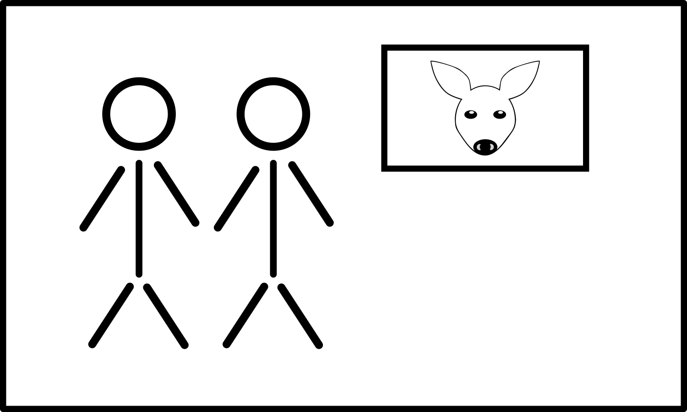
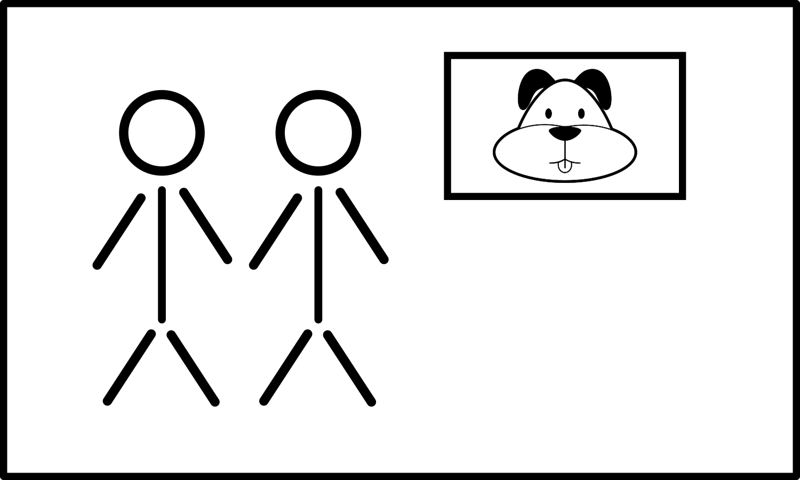
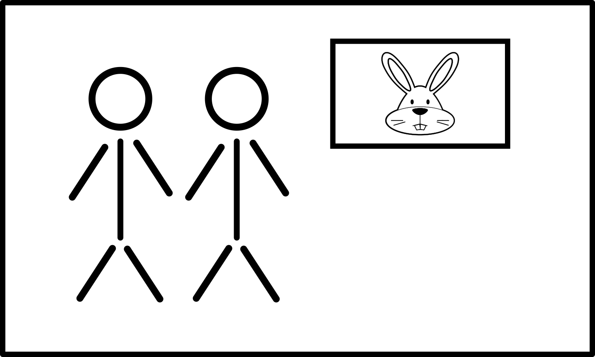
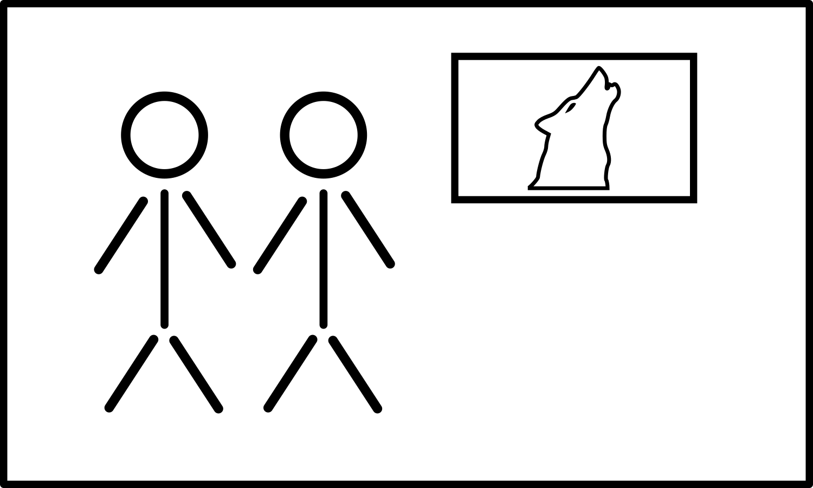
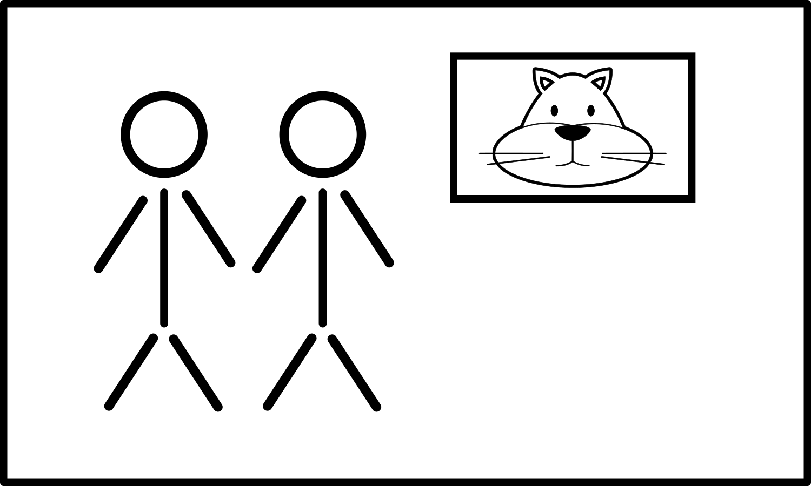

+++
draft = false
date = 2020-03-26T15:30:19Z
title = "ᏍᎪᎯᏁᎢ ᎠᏕᎶᏆᏍᏗ"
weight = 1585236610

[taxonomies]
authors = ["Michael Conrad"]
categories = ["Lessons", "Grammar"]
tags = []

[extra]
zulma_title="Cherokee Language Lessons 1"
featured_image = "lessons/Cherokee-Language-Lessons-Volume-1/Cherokee-Language-Lessons-Volume-1.png"

+++
## ᏘᎪᎵᏯ (Read them)

  - ᎠᏂᎠᏫ  
    \[a¹ni²ɂạ²hwi\] “The deer people.”

  - ᎠᏂᎩᏟ  
    \[a¹ni²gi²hli\] “The dog people.”

  - ᎠᏂᏥᏍᏚ  
    \[a¹ni²ji²sdu\] “The rabbit people.”

  - ᎠᏂᏩᎭᏯ  
    \[a¹ni²wạ²hạ²ya\] “The wolf people.”

  - ᎠᏂᏪᏌ  
    \[a¹ni²we²³sa\] “The cat people.”
<!-- more -->
  - ᏙᎯ  
    \[to¹hi⁴\] “Peaceful. Well in health.”

  - ᏙᎯᏧ  
    \[to¹hi⁴ju\] “It is well, isn’t it?”  
    “Things are well, aren’t they?”

  - ᏙᎯᏊ  
    \[to¹hi⁴gwu\] “It is just well.”  
    “Things are just well.”

  - ᏛᎬᎪᎯ  
    \[dv²gv²go²hi\] “I will see you one again.”

  - ᏛᏍᎩᎪᎯ  
    \[dv²sgi²go²hi\] “You one will see me again.”

  - ᏛᏍᏛᎪᎯ  
    \[dv²sdv²go²hi\] “I will see you two again.”  
    “We two will see you one again.”  
    “We two will see you two again.”

  - ᏛᏍᎩᏂᎪᎯ  
    \[dv²sgị²ni²go²hi\] “You one will see us two again.”  
    “You two will see me or us two again.”

  - ᏛᎢᏨᎪᎯ  
    \[dv²ɂi¹jv²go²hi\] “I will see you all again.”  
    “We two will see you all again.”  
    “We all will see you one or you two or you all again.”

  - ᏛᎢᏍᎩᎪᎯ  
    \[dv²ɂi¹sgi²go²hi\] “You one will see us all again.”  
    “You two will see us all again.”  
    “You all will see me or us two or us all again.”

  - ᏙᎾᏓᎪᎲᎢ  
    \[dọ²nạ²da²go²hv²ɂi\] “Later let us two see each other again.”

  - ᏙᏓᏓᎪᎲᎢ  
    \[dọ²dạ²da²go²hv²ɂi\] “Later let us all see each other again.”

☞ *ᏙᎯᏧ is a common greeting when meeting someone.* ⚠ *This is
incorrectly translated by a lot of materials as “How are you?”. While it
is used to ask someone how things are, it does not have a literal
meaning of “How are you?”.*

☞ *ᏙᎯᏊ is normally used in response when asked “ᏙᎯᏧ?”.* ⚠ *This is
incorrectly translated by a lot of materials as “I am fine.” While it is
used to indicate things are fine, it does not have the literal meaning
of “I am fine.”*

☞ *For the words “ᏙᎾᏓᎪᎲᎢ” and “ᏙᏓᏓᎪᎲᎢ”, the final “Ꮂ” is always
pronounced with a normal tone. If you instead use a high tone, you will
change the meaning from a desired future event to something that
happened a while ago.*

## ᏂᏔᏛᎦ (Do them)

You will need to create three each of the following index cards:

Label each card on the reverse as follows: ᎠᏂᎠᏫ, ᎠᏂᎩᏟ, ᎠᏂᏥᏍᏚ, ᎠᏂᏩᎭᏯ,
ᎠᏂᏪᏌ.

Divide up into groups of six to eleven. If you don’t have enough people,
use props for imaginary people and act the imaginary people out.

### Groups of two or more

If needed, use pillows or other props to add enough imaginary study
partners to create a group of six.

For each group the first person is designated “Ꭰ”. Additional people
will be assigned to “Ꭰ” or “Ꭱ” as needed for each challenge. People
should be assigned to the “Ꭰ” group from the right. People should be
assigned to the “Ꭱ” group from the left. The remaining people are
grouped together and are designated “Ꭲ”. After each set rotate positions
right so that there is a new “Ꭰ” person.

☞ *Keep rotating until everyone has been in both positions of “Ꭰ” and
“Ꭱ”, starting over with the first set of challenges as needed.*

☞ *Any imaginary study partners should be included in the rotations.*

☞ *The “Ꭰ” responses should be read from the book. The “Ꭱ” responses
should be done without reading the book.*

Each challenge-response should be done as in the following examples:

1.  \[Ꭰ\] ᏌᏊ↺ ᎠᎴ ᏌᏊ→. (ᎠᏂᎩᏟ↺, ᎠᏂᏥᏍᏚ→)  
    There is only one “Ꭰ” and only one “Ꭱ”.  
    “Ꭰ” indicates the person to their immediate left is to be the “Ꭱ”.  
    “Ꭰ” gives the “Ꭱ” an “ᎠᏂᏥᏍᏚ” index card to hold and holds an “ᎠᏂᎩᏟ”
    index card.
    
    1.  \[Ꭰ→Ꭱ\] ᎣᏏᏲ ᎠᏂᏥᏍᏚ, ᏙᎯᏧ?  
        “Ꭰ” says to “Ꭱ”: Hello “the rabbit people”, things are well,
        right?
    
    2.  \[Ꭱ→Ꭰ\] ᎣᏏᏲ ᎠᏂᎩᏟ, ᏙᎯᏊ. ᏂᎯᎾᎲ?  
        “Ꭱ” responds: Hello “the dog people”, things are just fine. But
        what about you?
    
    3.  \[Ꭰ→Ꭱ\] ᏙᎯᏊ. ᏛᎬᎪᎯᏍᎪ?  
        “Ꭰ” says to “Ꭱ”: Things are just fine. Will I see you again
        later?
    
    4.  \[Ꭱ→Ꭰ\] ᎥᎥ, ᏛᏍᎩᎪᎯ.  
        “Ꭱ” responds: Yes, you will see me again later.
    
    5.  \[Ꭰ→Ꭱ\] ᏙᎾᏓᎪᎲ²Ꭲ.  
        “Ꭰ” says to “Ꭱ”: Let us two see each other again later.
    
    6.  \[Ꭱ→Ꭰ\] ᏙᎾᏓᎪᎲ²Ꭲ.  
        “Ꭱ” responds: Let us two see each other again later.

2.  \[Ꭰ\] ᎠᏂᏔᎵ↺ ᎠᎴ ᏌᏊ→. (ᎠᏂᏩᏯ↺, ᎠᏂᏥᏍᏚ→)  
    There are two “Ꭰ” and only one “Ꭱ”.  
    “Ꭰ” indicates the person to their immediate right is to be part of
    the “Ꭰ” group.  
    “Ꭰ” indicates the person to their immediate left is to be the “Ꭱ”.  
    “Ꭰ” gives the “Ꭱ” an “ᎠᏂᏥᏍᏚ” index card to hold. Each “Ꭰ” holds an
    “ᎠᏂᏩᏯ” index card.
    
    1.  \[Ꭰ→Ꭱ\] ᎣᏏᏲ ᎠᏂᏥᏍᏚ, ᏙᎯᏧ?  
        “Ꭰ” says to “Ꭱ”: Hello “the rabbit people”, things are well,
        right?
    
    2.  \[Ꭱ→Ꭰ\] ᎣᏏᏲ ᎠᏂᏩᏯ, ᏙᎯᏊ. ᏂᎯᎾᎲ?  
        “Ꭱ” responds: Hello “the wolf people”, things are just fine. But
        what about you two?
    
    3.  \[Ꭰ→Ꭱ\] ᏙᎯᏊ. ᏛᏍᏛᎪᎯᏍ?  
        “Ꭰ” says to “Ꭱ”: Things are just fine. Will we two see you again
        later?
    
    4.  \[Ꭱ→Ꭰ\] ᎥᎥ, ᏛᏍᎩᏂᎪᎯ.  
        “Ꭱ” responds: Yes, you two will see me again later.
    
    5.  \[Ꭰ→Ꭱ\] ᏙᏓᏓᎪᎲ²Ꭲ.  
        “Ꭰ” says to “Ꭱ”: Let us all see each other again later.
    
    6.  \[Ꭱ→Ꭰ\] ᏙᏓᏓᎪᎲ²Ꭲ.  
        “Ꭱ” responds: Let us all see each other again later.

3.  \[Ꭰ\] ᎠᏂᏔᎵ↺ ᎠᎴ ᎠᏂᏦᎢ→. (ᎠᏂᏩᏯ↺, ᎠᏂᏪᏌ→)  
    There are two “Ꭰ” and three “Ꭱ”.  
    “Ꭰ” indicates the person to their immediate right is to be part of
    the “Ꭰ” group.  
    “Ꭰ” indicates the next three people to their immediate left is to be
    the “Ꭱ” group.  
    “Ꭰ” gives each “Ꭱ” an “ᎠᏂᏪᏌ” index card to hold. Each “Ꭰ” holds an
    “ᎠᏂᏩᏯ” index card.
    
    1.  \[Ꭰ→Ꭱ\] ᎣᏏᏲ ᎠᏂᏪᏌ, ᏙᎯᏧ?  
        “Ꭰ” says to “Ꭱ”: Hello “the cat people”, things are well, right?
    
    2.  \[Ꭱ→Ꭰ\] ᎣᏏᏲ ᎠᏂᏩᏯ, ᏙᎯᏊ. ᏂᎯᎾᎲ?  
        “Ꭱ” responds: Hello “the wolf people”, things are just fine. But
        what about you two?
    
    3.  \[Ꭰ→Ꭱ\] ᏙᎯᏊ. ᏛᎢᏨᎪᎯᏍ?  
        “Ꭰ” says to “Ꭱ”: Things are just fine. Will we two see you all
        again later?
    
    4.  \[Ꭱ→Ꭰ\] ᎥᎥ, ᏛᎢᏍᎩᎪᎯ.  
        “Ꭱ” responds: Yes, you two will see us all again later.
    
    5.  \[Ꭰ→Ꭱ\] ᏙᏓᏓᎪᎲ²Ꭲ.  
        “Ꭰ” says to “Ꭱ”: Let us all see each other again later.
    
    6.  \[Ꭱ→Ꭰ\] ᏙᏓᏓᎪᎲ²Ꭲ.  
        “Ꭱ” responds: Let us all see each other again later.

### Someone Alone

Using pillows or other props, add enough imaginary study partners to
create a group of six.

On index cards, slips of paper, or something similar, write out the “Ꭰ”
challenges on each of the front sides along with the correct “Ꭱ”
responses on the reverse side for the each set of challenges. Do this
for each challenge as listed. There may be challenges and responses
repeated. Keep the cards in order and in separate sets.

☞ *The “Ꭰ” responses should be read from the cards. The “Ꭱ” responses
should be done without reading the cards.*

#### For “Set 1”:

Place the stack of index cards, challenge side up, response side down.

Have the second imaginary study partner to your right be “Ꭰ”.

Generally follow the instructions as given for groups of two or more.
You will need to act out both the “Ꭰ” and “Ꭱ” parts.

Flip the card over and check your responses against the responses on the
response side of the index card.

#### For “Set 2”:

Have the first imaginary study partner to your right be “Ꭰ”.

#### For “Set 3”:

You are the “Ꭰ”.

#### For “Set 4”:

Have the first imaginary study partner to your left be “Ꭰ”.

#### For “Set 5”:

Have the second imaginary study partner to your left be “Ꭰ”.

### Sets

☞ *Repeat these until everyone can do the “Ꭱ” responses smoothly without
having to reference the material.*

#### Set 1

1.  \[Ꭰ\] ᏌᏊ↺ ᎠᎴ ᏌᏊ→. (ᎠᏂᎩᏟ↺, ᎠᏂᏥᏍᏚ→)
    
    1.  \[Ꭰ→Ꭱ\] ᎣᏏᏲ ᎠᏂᏥᏍᏚ, ᏙᎯᏧ?
    
    2.  \[Ꭱ→Ꭰ\] ᎣᏏᏲ ᎠᏂᎩᏟ, ᏙᎯᏊ. ᏂᎯᎾᎲ?
    
    3.  \[Ꭰ→Ꭱ\] ᏙᎯᏊ. ᏛᎬᎪᎯᏍᎪ?
    
    4.  \[Ꭱ→Ꭰ\] ᎥᎥ, ᏛᏍᎩᎪᎯ.
    
    5.  \[Ꭰ→Ꭱ\] ᏙᎾᏓᎪᎲ²Ꭲ.
    
    6.  \[Ꭱ→Ꭰ\] ᏙᎾᏓᎪᎲ²Ꭲ.

2.  \[Ꭰ\] ᎠᏂᏔᎵ↺ ᎠᎴ ᏌᏊ→. (ᎠᏂᏩᎭᏯ↺, ᎠᏂᏪᏌ→)
    
    1.  \[Ꭰ→Ꭱ\] ᎣᏏᏲ ᎠᏂᏪᏌ, ᏙᎯᏧ?
    
    2.  \[Ꭱ→Ꭰ\] ᎣᏏᏲ ᎠᏂᏩᎭᏯ, ᏙᎯᏊ. ᏂᎯᎾᎲ?
    
    3.  \[Ꭰ→Ꭱ\] ᏙᎯᏊ. ᏛᏍᏛᎪᎯᏍ?
    
    4.  \[Ꭱ→Ꭰ\] ᎥᎥ, ᏛᏍᎩᏂᎪᎯ.
    
    5.  \[Ꭰ→Ꭱ\] ᏙᏓᏓᎪᎲ²Ꭲ.
    
    6.  \[Ꭱ→Ꭰ\] ᏙᏓᏓᎪᎲ²Ꭲ.

3.  \[Ꭰ\] ᏌᏊ↺ ᎠᎴ ᏌᏊ→. (ᎠᏂᏩᏯ↺, ᎠᏂᎠᏫ→)
    
    1.  \[Ꭰ→Ꭱ\] ᎣᏏᏲ ᎠᏂᎠᏫ, ᏙᎯᏧ?
    
    2.  \[Ꭱ→Ꭰ\] ᎣᏏᏲ ᎠᏂᏩᏯ, ᏙᎯᏊ. ᏂᎯᎾᎲ?
    
    3.  \[Ꭰ→Ꭱ\] ᏙᎯᏊ. ᏛᎬᎪᎯᏍᎪ?
    
    4.  \[Ꭱ→Ꭰ\] ᎥᎥ, ᏛᏍᎩᎪᎯ.
    
    5.  \[Ꭰ→Ꭱ\] ᏙᎾᏓᎪᎲ²Ꭲ.
    
    6.  \[Ꭱ→Ꭰ\] ᏙᎾᏓᎪᎲ²Ꭲ.

4.  \[Ꭰ\] ᎠᏂᏦᎢ↺ ᎠᎴ ᏌᏊ→. (ᎠᏂᎩᏟ↺, ᎠᏂᎠᏫ→)
    
    1.  \[Ꭰ→Ꭱ\] ᎣᏏᏲ ᎠᏂᎠᏫ, ᏙᎯᏧ?
    
    2.  \[Ꭱ→Ꭰ\] ᎣᏏᏲ ᎠᏂᎩᏟ, ᏙᎯᏊ. ᏂᎯᎾᎲ?
    
    3.  \[Ꭰ→Ꭱ\] ᏙᎯᏊ. ᏛᎢᏨᎪᎯᏍ?
    
    4.  \[Ꭱ→Ꭰ\] ᎥᎥ, ᏛᎢᏍᎩᎪᎯ.
    
    5.  \[Ꭰ→Ꭱ\] ᏙᏓᏓᎪᎲ²Ꭲ.
    
    6.  \[Ꭱ→Ꭰ\] ᏙᏓᏓᎪᎲ²Ꭲ.

5.  \[Ꭰ\] ᎠᏂᏔᎵ↺ ᎠᎴ ᏌᏊ→. (ᎠᏂᏩᏯ↺, ᎠᏂᏥᏍᏚ→)
    
    1.  \[Ꭰ→Ꭱ\] ᎣᏏᏲ ᎠᏂᏥᏍᏚ, ᏙᎯᏧ?
    
    2.  \[Ꭱ→Ꭰ\] ᎣᏏᏲ ᎠᏂᏩᏯ, ᏙᎯᏊ. ᏂᎯᎾᎲ?
    
    3.  \[Ꭰ→Ꭱ\] ᏙᎯᏊ. ᏛᏍᏛᎪᎯᏍᎪ?
    
    4.  \[Ꭱ→Ꭰ\] ᎥᎥ, ᏛᏍᎩᏂᎪᎯ.
    
    5.  \[Ꭰ→Ꭱ\] ᏙᏓᏓᎪᎲ²Ꭲ.
    
    6.  \[Ꭱ→Ꭰ\] ᏙᏓᏓᎪᎲ²Ꭲ.

6.  \[Ꭰ\] ᎠᏂᏦᎢ↺ ᎠᎴ ᏌᏊ→. (ᎠᏂᏩᎭᏯ↺, ᎠᏂᏪᏌ→)
    
    1.  \[Ꭰ→Ꭱ\] ᎣᏏᏲ ᎠᏂᏪᏌ, ᏙᎯᏧ?
    
    2.  \[Ꭱ→Ꭰ\] ᎣᏏᏲ ᎠᏂᏩᎭᏯ, ᏙᎯᏊ. ᏂᎯᎾᎲ?
    
    3.  \[Ꭰ→Ꭱ\] ᏙᎯᏊ. ᏛᎢᏨᎪᎯᏍ?
    
    4.  \[Ꭱ→Ꭰ\] ᎥᎥ, ᏛᎢᏍᎩᎪᎯ.
    
    5.  \[Ꭰ→Ꭱ\] ᏙᏓᏓᎪᎲ²Ꭲ.
    
    6.  \[Ꭱ→Ꭰ\] ᏙᏓᏓᎪᎲ²Ꭲ.

7.  \[Ꭰ\] ᏌᏊ↺ ᎠᎴ ᎠᏂᏔᎵ→. (ᎠᏂᏩᎭᏯ↺, ᎠᏂᎠᏫ→)
    
    1.  \[Ꭰ→Ꭱ\] ᎣᏏᏲ ᎠᏂᎠᏫ, ᏙᎯᏧ?
    
    2.  \[Ꭱ→Ꭰ\] ᎣᏏᏲ ᎠᏂᏩᎭᏯ, ᏙᎯᏊ. ᏂᎯᎾᎲ?
    
    3.  \[Ꭰ→Ꭱ\] ᏙᎯᏊ. ᏛᏍᏛᎪᎯᏍ?
    
    4.  \[Ꭱ→Ꭰ\] ᎥᎥ, ᏛᏍᎩᏂᎪᎯ.
    
    5.  \[Ꭰ→Ꭱ\] ᏙᏓᏓᎪᎲ²Ꭲ.
    
    6.  \[Ꭱ→Ꭰ\] ᏙᏓᏓᎪᎲ²Ꭲ.

8.  \[Ꭰ\] ᎠᏂᏦᎢ↺ ᎠᎴ ᏌᏊ→. (ᎠᏂᎩᏟ↺, ᎠᏂᏪᏌ→)
    
    1.  \[Ꭰ→Ꭱ\] ᎣᏏᏲ ᎠᏂᏪᏌ, ᏙᎯᏧ?
    
    2.  \[Ꭱ→Ꭰ\] ᎣᏏᏲ ᎠᏂᎩᏟ, ᏙᎯᏊ. ᏂᎯᎾᎲ?
    
    3.  \[Ꭰ→Ꭱ\] ᏙᎯᏊ. ᏛᎢᏨᎪᎯᏍᎪ?
    
    4.  \[Ꭱ→Ꭰ\] ᎥᎥ, ᏛᎢᏍᎩᎪᎯ.
    
    5.  \[Ꭰ→Ꭱ\] ᏙᏓᏓᎪᎲ²Ꭲ.
    
    6.  \[Ꭱ→Ꭰ\] ᏙᏓᏓᎪᎲ²Ꭲ.

9.  \[Ꭰ\] ᏌᏊ↺ ᎠᎴ ᎠᏂᏦᎢ→. (ᎠᏂᏩᏯ↺, ᎠᏂᏥᏍᏚ→)
    
    1.  \[Ꭰ→Ꭱ\] ᎣᏏᏲ ᎠᏂᏥᏍᏚ, ᏙᎯᏧ?
    
    2.  \[Ꭱ→Ꭰ\] ᎣᏏᏲ ᎠᏂᏩᏯ, ᏙᎯᏊ. ᏂᎯᎾᎲ?
    
    3.  \[Ꭰ→Ꭱ\] ᏙᎯᏊ. ᏛᎢᏨᎪᎯᏍᎪ?
    
    4.  \[Ꭱ→Ꭰ\] ᎥᎥ, ᏛᎢᏍᎩᎪᎯ.
    
    5.  \[Ꭰ→Ꭱ\] ᏙᏓᏓᎪᎲ²Ꭲ.
    
    6.  \[Ꭱ→Ꭰ\] ᏙᏓᏓᎪᎲ²Ꭲ.

#### Set 2

1.  \[Ꭰ\] ᏌᏊ↺ ᎠᎴ ᎠᏂᏔᎵ→. (ᎠᏂᏩᏯ↺, ᎠᏂᎠᏫ→)
    
    1.  \[Ꭰ→Ꭱ\] ᎣᏏᏲ ᎠᏂᎠᏫ, ᏙᎯᏧ?
    
    2.  \[Ꭱ→Ꭰ\] ᎣᏏᏲ ᎠᏂᏩᏯ, ᏙᎯᏊ. ᏂᎯᎾᎲ?
    
    3.  \[Ꭰ→Ꭱ\] ᏙᎯᏊ. ᏛᏍᏛᎪᎯᏍ?
    
    4.  \[Ꭱ→Ꭰ\] ᎥᎥ, ᏛᏍᎩᏂᎪᎯ.
    
    5.  \[Ꭰ→Ꭱ\] ᏙᏓᏓᎪᎲ²Ꭲ.
    
    6.  \[Ꭱ→Ꭰ\] ᏙᏓᏓᎪᎲ²Ꭲ.

2.  \[Ꭰ\] ᏌᏊ↺ ᎠᎴ ᎠᏂᏦᎢ→. (ᎠᏂᏩᎭᏯ↺, ᎠᏂᏪᏌ→)
    
    1.  \[Ꭰ→Ꭱ\] ᎣᏏᏲ ᎠᏂᏪᏌ, ᏙᎯᏧ?
    
    2.  \[Ꭱ→Ꭰ\] ᎣᏏᏲ ᎠᏂᏩᎭᏯ, ᏙᎯᏊ. ᏂᎯᎾᎲ?
    
    3.  \[Ꭰ→Ꭱ\] ᏙᎯᏊ. ᏛᎢᏨᎪᎯᏍᎪ?
    
    4.  \[Ꭱ→Ꭰ\] ᎥᎥ, ᏛᎢᏍᎩᎪᎯ.
    
    5.  \[Ꭰ→Ꭱ\] ᏙᏓᏓᎪᎲ²Ꭲ.
    
    6.  \[Ꭱ→Ꭰ\] ᏙᏓᏓᎪᎲ²Ꭲ.

3.  \[Ꭰ\] ᎠᏂᏔᎵ↺ ᎠᎴ ᎠᏂᏔᎵ→. (ᎠᏂᎩᏟ↺, ᎠᏂᏥᏍᏚ→)
    
    1.  \[Ꭰ→Ꭱ\] ᎣᏏᏲ ᎠᏂᏥᏍᏚ, ᏙᎯᏧ?
    
    2.  \[Ꭱ→Ꭰ\] ᎣᏏᏲ ᎠᏂᎩᏟ, ᏙᎯᏊ. ᏂᎯᎾᎲ?
    
    3.  \[Ꭰ→Ꭱ\] ᏙᎯᏊ. ᏛᏍᏛᎪᎯᏍ?
    
    4.  \[Ꭱ→Ꭰ\] ᎥᎥ, ᏛᏍᎩᏂᎪᎯ.
    
    5.  \[Ꭰ→Ꭱ\] ᏙᏓᏓᎪᎲ²Ꭲ.
    
    6.  \[Ꭱ→Ꭰ\] ᏙᏓᏓᎪᎲ²Ꭲ.

4.  \[Ꭰ\] ᏌᏊ↺ ᎠᎴ ᎠᏂᏦᎢ→. (ᎠᏂᎩᏟ↺, ᎠᏂᏥᏍᏚ→)
    
    1.  \[Ꭰ→Ꭱ\] ᎣᏏᏲ ᎠᏂᏥᏍᏚ, ᏙᎯᏧ?
    
    2.  \[Ꭱ→Ꭰ\] ᎣᏏᏲ ᎠᏂᎩᏟ, ᏙᎯᏊ. ᏂᎯᎾᎲ?
    
    3.  \[Ꭰ→Ꭱ\] ᏙᎯᏊ. ᏛᎢᏨᎪᎯᏍ?
    
    4.  \[Ꭱ→Ꭰ\] ᎥᎥ, ᏛᎢᏍᎩᎪᎯ.
    
    5.  \[Ꭰ→Ꭱ\] ᏙᏓᏓᎪᎲ²Ꭲ.
    
    6.  \[Ꭱ→Ꭰ\] ᏙᏓᏓᎪᎲ²Ꭲ.

5.  \[Ꭰ\] ᎠᏂᏔᎵ↺ ᎠᎴ ᎠᏂᏦᎢ→. (ᎠᏂᏩᏯ↺, ᎠᏂᏪᏌ→)
    
    1.  \[Ꭰ→Ꭱ\] ᎣᏏᏲ ᎠᏂᏪᏌ, ᏙᎯᏧ?
    
    2.  \[Ꭱ→Ꭰ\] ᎣᏏᏲ ᎠᏂᏩᏯ, ᏙᎯᏊ. ᏂᎯᎾᎲ?
    
    3.  \[Ꭰ→Ꭱ\] ᏙᎯᏊ. ᏛᎢᏨᎪᎯᏍᎪ?
    
    4.  \[Ꭱ→Ꭰ\] ᎥᎥ, ᏛᎢᏍᎩᎪᎯ.
    
    5.  \[Ꭰ→Ꭱ\] ᏙᏓᏓᎪᎲ²Ꭲ.
    
    6.  \[Ꭱ→Ꭰ\] ᏙᏓᏓᎪᎲ²Ꭲ.

6.  \[Ꭰ\] ᎠᏂᏔᎵ↺ ᎠᎴ ᎠᏂᏔᎵ→. (ᎠᏂᏩᎭᏯ↺, ᎠᏂᎠᏫ→)
    
    1.  \[Ꭰ→Ꭱ\] ᎣᏏᏲ ᎠᏂᎠᏫ, ᏙᎯᏧ?
    
    2.  \[Ꭱ→Ꭰ\] ᎣᏏᏲ ᎠᏂᏩᎭᏯ, ᏙᎯᏊ. ᏂᎯᎾᎲ?
    
    3.  \[Ꭰ→Ꭱ\] ᏙᎯᏊ. ᏛᏍᏛᎪᎯᏍᎪ?
    
    4.  \[Ꭱ→Ꭰ\] ᎥᎥ, ᏛᏍᎩᏂᎪᎯ.
    
    5.  \[Ꭰ→Ꭱ\] ᏙᏓᏓᎪᎲ²Ꭲ.
    
    6.  \[Ꭱ→Ꭰ\] ᏙᏓᏓᎪᎲ²Ꭲ.

7.  \[Ꭰ\] ᎠᏂᏔᎵ↺ ᎠᎴ ᎠᏂᏦᎢ→. (ᎠᏂᎩᏟ↺, ᎠᏂᎠᏫ→)
    
    1.  \[Ꭰ→Ꭱ\] ᎣᏏᏲ ᎠᏂᎠᏫ, ᏙᎯᏧ?
    
    2.  \[Ꭱ→Ꭰ\] ᎣᏏᏲ ᎠᏂᎩᏟ, ᏙᎯᏊ. ᏂᎯᎾᎲ?
    
    3.  \[Ꭰ→Ꭱ\] ᏙᎯᏊ. ᏛᎢᏨᎪᎯᏍ?
    
    4.  \[Ꭱ→Ꭰ\] ᎥᎥ, ᏛᎢᏍᎩᎪᎯ.
    
    5.  \[Ꭰ→Ꭱ\] ᏙᏓᏓᎪᎲ²Ꭲ.
    
    6.  \[Ꭱ→Ꭰ\] ᏙᏓᏓᎪᎲ²Ꭲ.

8.  \[Ꭰ\] ᏌᏊ↺ ᎠᎴ ᏌᏊ→. (ᎠᏂᏩᏯ↺, ᎠᏂᏥᏍᏚ→)
    
    1.  \[Ꭰ→Ꭱ\] ᎣᏏᏲ ᎠᏂᏥᏍᏚ, ᏙᎯᏧ?
    
    2.  \[Ꭱ→Ꭰ\] ᎣᏏᏲ ᎠᏂᏩᏯ, ᏙᎯᏊ. ᏂᎯᎾᎲ?
    
    3.  \[Ꭰ→Ꭱ\] ᏙᎯᏊ. ᏛᎬᎪᎯᏍ?
    
    4.  \[Ꭱ→Ꭰ\] ᎥᎥ, ᏛᏍᎩᎪᎯ.
    
    5.  \[Ꭰ→Ꭱ\] ᏙᎾᏓᎪᎲ²Ꭲ.
    
    6.  \[Ꭱ→Ꭰ\] ᏙᎾᏓᎪᎲ²Ꭲ.

9.  \[Ꭰ\] ᎠᏂᏦᎢ↺ ᎠᎴ ᎠᏂᏔᎵ→. (ᎠᏂᏩᎭᏯ↺, ᎠᏂᏪᏌ→)
    
    1.  \[Ꭰ→Ꭱ\] ᎣᏏᏲ ᎠᏂᏪᏌ, ᏙᎯᏧ?
    
    2.  \[Ꭱ→Ꭰ\] ᎣᏏᏲ ᎠᏂᏩᎭᏯ, ᏙᎯᏊ. ᏂᎯᎾᎲ?
    
    3.  \[Ꭰ→Ꭱ\] ᏙᎯᏊ. ᏛᎢᏨᎪᎯᏍᎪ?
    
    4.  \[Ꭱ→Ꭰ\] ᎥᎥ, ᏛᎢᏍᎩᎪᎯ.
    
    5.  \[Ꭰ→Ꭱ\] ᏙᏓᏓᎪᎲ²Ꭲ.
    
    6.  \[Ꭱ→Ꭰ\] ᏙᏓᏓᎪᎲ²Ꭲ.

#### Set 3

1.  \[Ꭰ\] ᎠᏂᏔᎵ↺ ᎠᎴ ᏌᏊ→. (ᎠᏂᏩᎭᏯ↺, ᎠᏂᏪᏌ→)
    
    1.  \[Ꭰ→Ꭱ\] ᎣᏏᏲ ᎠᏂᏪᏌ, ᏙᎯᏧ?
    
    2.  \[Ꭱ→Ꭰ\] ᎣᏏᏲ ᎠᏂᏩᎭᏯ, ᏙᎯᏊ. ᏂᎯᎾᎲ?
    
    3.  \[Ꭰ→Ꭱ\] ᏙᎯᏊ. ᏛᏍᏛᎪᎯᏍ?
    
    4.  \[Ꭱ→Ꭰ\] ᎥᎥ, ᏛᏍᎩᏂᎪᎯ.
    
    5.  \[Ꭰ→Ꭱ\] ᏙᏓᏓᎪᎲ²Ꭲ.
    
    6.  \[Ꭱ→Ꭰ\] ᏙᏓᏓᎪᎲ²Ꭲ.

2.  \[Ꭰ\] ᎠᏂᏔᎵ↺ ᎠᎴ ᎠᏂᏦᎢ→. (ᎠᏂᎩᏟ↺, ᎠᏂᏥᏍᏚ→)
    
    1.  \[Ꭰ→Ꭱ\] ᎣᏏᏲ ᎠᏂᏥᏍᏚ, ᏙᎯᏧ?
    
    2.  \[Ꭱ→Ꭰ\] ᎣᏏᏲ ᎠᏂᎩᏟ, ᏙᎯᏊ. ᏂᎯᎾᎲ?
    
    3.  \[Ꭰ→Ꭱ\] ᏙᎯᏊ. ᏛᎢᏨᎪᎯᏍᎪ?
    
    4.  \[Ꭱ→Ꭰ\] ᎥᎥ, ᏛᎢᏍᎩᎪᎯ.
    
    5.  \[Ꭰ→Ꭱ\] ᏙᏓᏓᎪᎲ²Ꭲ.
    
    6.  \[Ꭱ→Ꭰ\] ᏙᏓᏓᎪᎲ²Ꭲ.

3.  \[Ꭰ\] ᎠᏂᏦᎢ↺ ᎠᎴ ᎠᏂᏔᎵ→. (ᎠᏂᏩᏯ↺, ᎠᏂᎠᏫ→)
    
    1.  \[Ꭰ→Ꭱ\] ᎣᏏᏲ ᎠᏂᎠᏫ, ᏙᎯᏧ?
    
    2.  \[Ꭱ→Ꭰ\] ᎣᏏᏲ ᎠᏂᏩᏯ, ᏙᎯᏊ. ᏂᎯᎾᎲ?
    
    3.  \[Ꭰ→Ꭱ\] ᏙᎯᏊ. ᏛᎢᏨᎪᎯᏍᎪ?
    
    4.  \[Ꭱ→Ꭰ\] ᎥᎥ, ᏛᎢᏍᎩᎪᎯ.
    
    5.  \[Ꭰ→Ꭱ\] ᏙᏓᏓᎪᎲ²Ꭲ.
    
    6.  \[Ꭱ→Ꭰ\] ᏙᏓᏓᎪᎲ²Ꭲ.

4.  \[Ꭰ\] ᎠᏂᏦᎢ↺ ᎠᎴ ᎠᏂᏦᎢ→. (ᎠᏂᎩᏟ↺, ᎠᏂᎠᏫ→)
    
    1.  \[Ꭰ→Ꭱ\] ᎣᏏᏲ ᎠᏂᎠᏫ, ᏙᎯᏧ?
    
    2.  \[Ꭱ→Ꭰ\] ᎣᏏᏲ ᎠᏂᎩᏟ, ᏙᎯᏊ. ᏂᎯᎾᎲ?
    
    3.  \[Ꭰ→Ꭱ\] ᏙᎯᏊ. ᏛᎢᏨᎪᎯᏍ?
    
    4.  \[Ꭱ→Ꭰ\] ᎥᎥ, ᏛᎢᏍᎩᎪᎯ.
    
    5.  \[Ꭰ→Ꭱ\] ᏙᏓᏓᎪᎲ²Ꭲ.
    
    6.  \[Ꭱ→Ꭰ\] ᏙᏓᏓᎪᎲ²Ꭲ.

5.  \[Ꭰ\] ᎠᏂᏦᎢ↺ ᎠᎴ ᏌᏊ→. (ᎠᏂᏩᎭᏯ↺, ᎠᏂᏥᏍᏚ→)
    
    1.  \[Ꭰ→Ꭱ\] ᎣᏏᏲ ᎠᏂᏥᏍᏚ, ᏙᎯᏧ?
    
    2.  \[Ꭱ→Ꭰ\] ᎣᏏᏲ ᎠᏂᏩᎭᏯ, ᏙᎯᏊ. ᏂᎯᎾᎲ?
    
    3.  \[Ꭰ→Ꭱ\] ᏙᎯᏊ. ᏛᎢᏨᎪᎯᏍ?
    
    4.  \[Ꭱ→Ꭰ\] ᎥᎥ, ᏛᎢᏍᎩᎪᎯ.
    
    5.  \[Ꭰ→Ꭱ\] ᏙᏓᏓᎪᎲ²Ꭲ.
    
    6.  \[Ꭱ→Ꭰ\] ᏙᏓᏓᎪᎲ²Ꭲ.

6.  \[Ꭰ\] ᎠᏂᏦᎢ↺ ᎠᎴ ᎠᏂᏔᎵ→. (ᎠᏂᏩᏯ↺, ᎠᏂᏪᏌ→)
    
    1.  \[Ꭰ→Ꭱ\] ᎣᏏᏲ ᎠᏂᏪᏌ, ᏙᎯᏧ?
    
    2.  \[Ꭱ→Ꭰ\] ᎣᏏᏲ ᎠᏂᏩᏯ, ᏙᎯᏊ. ᏂᎯᎾᎲ?
    
    3.  \[Ꭰ→Ꭱ\] ᏙᎯᏊ. ᏛᎢᏨᎪᎯᏍᎪ?
    
    4.  \[Ꭱ→Ꭰ\] ᎥᎥ, ᏛᎢᏍᎩᎪᎯ.
    
    5.  \[Ꭰ→Ꭱ\] ᏙᏓᏓᎪᎲ²Ꭲ.
    
    6.  \[Ꭱ→Ꭰ\] ᏙᏓᏓᎪᎲ²Ꭲ.

7.  \[Ꭰ\] ᏌᏊ↺ ᎠᎴ ᎠᏂᏔᎵ→. (ᎠᏂᏩᎭᏯ↺, ᎠᏂᏪᏌ→)
    
    1.  \[Ꭰ→Ꭱ\] ᎣᏏᏲ ᎠᏂᏪᏌ, ᏙᎯᏧ?
    
    2.  \[Ꭱ→Ꭰ\] ᎣᏏᏲ ᎠᏂᏩᎭᏯ, ᏙᎯᏊ. ᏂᎯᎾᎲ?
    
    3.  \[Ꭰ→Ꭱ\] ᏙᎯᏊ. ᏛᏍᏛᎪᎯᏍᎪ?
    
    4.  \[Ꭱ→Ꭰ\] ᎥᎥ, ᏛᏍᎩᏂᎪᎯ.
    
    5.  \[Ꭰ→Ꭱ\] ᏙᏓᏓᎪᎲ²Ꭲ.
    
    6.  \[Ꭱ→Ꭰ\] ᏙᏓᏓᎪᎲ²Ꭲ.

8.  \[Ꭰ\] ᎠᏂᏦᎢ↺ ᎠᎴ ᎠᏂᏦᎢ→. (ᎠᏂᎩᏟ↺, ᎠᏂᎠᏫ→)
    
    1.  \[Ꭰ→Ꭱ\] ᎣᏏᏲ ᎠᏂᎠᏫ, ᏙᎯᏧ?
    
    2.  \[Ꭱ→Ꭰ\] ᎣᏏᏲ ᎠᏂᎩᏟ, ᏙᎯᏊ. ᏂᎯᎾᎲ?
    
    3.  \[Ꭰ→Ꭱ\] ᏙᎯᏊ. ᏛᎢᏨᎪᎯᏍ?
    
    4.  \[Ꭱ→Ꭰ\] ᎥᎥ, ᏛᎢᏍᎩᎪᎯ.
    
    5.  \[Ꭰ→Ꭱ\] ᏙᏓᏓᎪᎲ²Ꭲ.
    
    6.  \[Ꭱ→Ꭰ\] ᏙᏓᏓᎪᎲ²Ꭲ.

9.  \[Ꭰ\] ᏌᏊ↺ ᎠᎴ ᎠᏂᏦᎢ→. (ᎠᏂᏩᏯ↺, ᎠᏂᏥᏍᏚ→)
    
    1.  \[Ꭰ→Ꭱ\] ᎣᏏᏲ ᎠᏂᏥᏍᏚ, ᏙᎯᏧ?
    
    2.  \[Ꭱ→Ꭰ\] ᎣᏏᏲ ᎠᏂᏩᏯ, ᏙᎯᏊ. ᏂᎯᎾᎲ?
    
    3.  \[Ꭰ→Ꭱ\] ᏙᎯᏊ. ᏛᎢᏨᎪᎯᏍ?
    
    4.  \[Ꭱ→Ꭰ\] ᎥᎥ, ᏛᎢᏍᎩᎪᎯ.
    
    5.  \[Ꭰ→Ꭱ\] ᏙᏓᏓᎪᎲ²Ꭲ.
    
    6.  \[Ꭱ→Ꭰ\] ᏙᏓᏓᎪᎲ²Ꭲ.

#### Set 4

1.  \[Ꭰ\] ᎠᏂᏦᎢ↺ ᎠᎴ ᎠᏂᏦᎢ→. (ᎠᏂᏩᎭᏯ↺, ᎠᏂᏥᏍᏚ→)
    
    1.  \[Ꭰ→Ꭱ\] ᎣᏏᏲ ᎠᏂᏥᏍᏚ, ᏙᎯᏧ?
    
    2.  \[Ꭱ→Ꭰ\] ᎣᏏᏲ ᎠᏂᏩᎭᏯ, ᏙᎯᏊ. ᏂᎯᎾᎲ?
    
    3.  \[Ꭰ→Ꭱ\] ᏙᎯᏊ. ᏛᎢᏨᎪᎯᏍᎪ?
    
    4.  \[Ꭱ→Ꭰ\] ᎥᎥ, ᏛᎢᏍᎩᎪᎯ.
    
    5.  \[Ꭰ→Ꭱ\] ᏙᏓᏓᎪᎲ²Ꭲ.
    
    6.  \[Ꭱ→Ꭰ\] ᏙᏓᏓᎪᎲ²Ꭲ.

2.  \[Ꭰ\] ᎠᏂᏔᎵ↺ ᎠᎴ ᎠᏂᏔᎵ→. (ᎠᏂᏩᏯ↺, ᎠᏂᏪᏌ→)
    
    1.  \[Ꭰ→Ꭱ\] ᎣᏏᏲ ᎠᏂᏪᏌ, ᏙᎯᏧ?
    
    2.  \[Ꭱ→Ꭰ\] ᎣᏏᏲ ᎠᏂᏩᏯ, ᏙᎯᏊ. ᏂᎯᎾᎲ?
    
    3.  \[Ꭰ→Ꭱ\] ᏙᎯᏊ. ᏛᏍᏛᎪᎯᏍ?
    
    4.  \[Ꭱ→Ꭰ\] ᎥᎥ, ᏛᏍᎩᏂᎪᎯ.
    
    5.  \[Ꭰ→Ꭱ\] ᏙᏓᏓᎪᎲ²Ꭲ.
    
    6.  \[Ꭱ→Ꭰ\] ᏙᏓᏓᎪᎲ²Ꭲ.

3.  \[Ꭰ\] ᎠᏂᏔᎵ↺ ᎠᎴ ᎠᏂᏦᎢ→. (ᎠᏂᎩᏟ↺, ᎠᏂᎠᏫ→)
    
    1.  \[Ꭰ→Ꭱ\] ᎣᏏᏲ ᎠᏂᎠᏫ, ᏙᎯᏧ?
    
    2.  \[Ꭱ→Ꭰ\] ᎣᏏᏲ ᎠᏂᎩᏟ, ᏙᎯᏊ. ᏂᎯᎾᎲ?
    
    3.  \[Ꭰ→Ꭱ\] ᏙᎯᏊ. ᏛᎢᏨᎪᎯᏍᎪ?
    
    4.  \[Ꭱ→Ꭰ\] ᎥᎥ, ᏛᎢᏍᎩᎪᎯ.
    
    5.  \[Ꭰ→Ꭱ\] ᏙᏓᏓᎪᎲ²Ꭲ.
    
    6.  \[Ꭱ→Ꭰ\] ᏙᏓᏓᎪᎲ²Ꭲ.

4.  \[Ꭰ\] ᎠᏂᏦᎢ↺ ᎠᎴ ᎠᏂᏔᎵ→. (ᎠᏂᏩᏯ↺, ᎠᏂᏪᏌ→)
    
    1.  \[Ꭰ→Ꭱ\] ᎣᏏᏲ ᎠᏂᏪᏌ, ᏙᎯᏧ?
    
    2.  \[Ꭱ→Ꭰ\] ᎣᏏᏲ ᎠᏂᏩᏯ, ᏙᎯᏊ. ᏂᎯᎾᎲ?
    
    3.  \[Ꭰ→Ꭱ\] ᏙᎯᏊ. ᏛᎢᏨᎪᎯᏍ?
    
    4.  \[Ꭱ→Ꭰ\] ᎥᎥ, ᏛᎢᏍᎩᎪᎯ.
    
    5.  \[Ꭰ→Ꭱ\] ᏙᏓᏓᎪᎲ²Ꭲ.
    
    6.  \[Ꭱ→Ꭰ\] ᏙᏓᏓᎪᎲ²Ꭲ.

5.  \[Ꭰ\] ᎠᏂᏦᎢ↺ ᎠᎴ ᎠᏂᏦᎢ→. (ᎠᏂᎩᏟ↺, ᎠᏂᏥᏍᏚ→)
    
    1.  \[Ꭰ→Ꭱ\] ᎣᏏᏲ ᎠᏂᏥᏍᏚ, ᏙᎯᏧ?
    
    2.  \[Ꭱ→Ꭰ\] ᎣᏏᏲ ᎠᏂᎩᏟ, ᏙᎯᏊ. ᏂᎯᎾᎲ?
    
    3.  \[Ꭰ→Ꭱ\] ᏙᎯᏊ. ᏛᎢᏨᎪᎯᏍᎪ?
    
    4.  \[Ꭱ→Ꭰ\] ᎥᎥ, ᏛᎢᏍᎩᎪᎯ.
    
    5.  \[Ꭰ→Ꭱ\] ᏙᏓᏓᎪᎲ²Ꭲ.
    
    6.  \[Ꭱ→Ꭰ\] ᏙᏓᏓᎪᎲ²Ꭲ.

6.  \[Ꭰ\] ᏌᏊ↺ ᎠᎴ ᏌᏊ→. (ᎠᏂᏩᎭᏯ↺, ᎠᏂᎠᏫ→)
    
    1.  \[Ꭰ→Ꭱ\] ᎣᏏᏲ ᎠᏂᎠᏫ, ᏙᎯᏧ?
    
    2.  \[Ꭱ→Ꭰ\] ᎣᏏᏲ ᎠᏂᏩᎭᏯ, ᏙᎯᏊ. ᏂᎯᎾᎲ?
    
    3.  \[Ꭰ→Ꭱ\] ᏙᎯᏊ. ᏛᎬᎪᎯᏍᎪ?
    
    4.  \[Ꭱ→Ꭰ\] ᎥᎥ, ᏛᏍᎩᎪᎯ.
    
    5.  \[Ꭰ→Ꭱ\] ᏙᎾᏓᎪᎲ²Ꭲ.
    
    6.  \[Ꭱ→Ꭰ\] ᏙᎾᏓᎪᎲ²Ꭲ.

7.  \[Ꭰ\] ᎠᏂᏔᎵ↺ ᎠᎴ ᏌᏊ→. (ᎠᏂᎩᏟ↺, ᎠᏂᏥᏍᏚ→)
    
    1.  \[Ꭰ→Ꭱ\] ᎣᏏᏲ ᎠᏂᏥᏍᏚ, ᏙᎯᏧ?
    
    2.  \[Ꭱ→Ꭰ\] ᎣᏏᏲ ᎠᏂᎩᏟ, ᏙᎯᏊ. ᏂᎯᎾᎲ?
    
    3.  \[Ꭰ→Ꭱ\] ᏙᎯᏊ. ᏛᏍᏛᎪᎯᏍ?
    
    4.  \[Ꭱ→Ꭰ\] ᎥᎥ, ᏛᏍᎩᏂᎪᎯ.
    
    5.  \[Ꭰ→Ꭱ\] ᏙᏓᏓᎪᎲ²Ꭲ.
    
    6.  \[Ꭱ→Ꭰ\] ᏙᏓᏓᎪᎲ²Ꭲ.

8.  \[Ꭰ\] ᎠᏂᏦᎢ↺ ᎠᎴ ᏌᏊ→. (ᎠᏂᏩᏯ↺, ᎠᏂᎠᏫ→)
    
    1.  \[Ꭰ→Ꭱ\] ᎣᏏᏲ ᎠᏂᎠᏫ, ᏙᎯᏧ?
    
    2.  \[Ꭱ→Ꭰ\] ᎣᏏᏲ ᎠᏂᏩᏯ, ᏙᎯᏊ. ᏂᎯᎾᎲ?
    
    3.  \[Ꭰ→Ꭱ\] ᏙᎯᏊ. ᏛᎢᏨᎪᎯᏍᎪ?
    
    4.  \[Ꭱ→Ꭰ\] ᎥᎥ, ᏛᎢᏍᎩᎪᎯ.
    
    5.  \[Ꭰ→Ꭱ\] ᏙᏓᏓᎪᎲ²Ꭲ.
    
    6.  \[Ꭱ→Ꭰ\] ᏙᏓᏓᎪᎲ²Ꭲ.

9.  \[Ꭰ\] ᏌᏊ↺ ᎠᎴ ᎠᏂᏔᎵ→. (ᎠᏂᏩᎭᏯ↺, ᎠᏂᏪᏌ→)
    
    1.  \[Ꭰ→Ꭱ\] ᎣᏏᏲ ᎠᏂᏪᏌ, ᏙᎯᏧ?
    
    2.  \[Ꭱ→Ꭰ\] ᎣᏏᏲ ᎠᏂᏩᎭᏯ, ᏙᎯᏊ. ᏂᎯᎾᎲ?
    
    3.  \[Ꭰ→Ꭱ\] ᏙᎯᏊ. ᏛᏍᏛᎪᎯᏍ?
    
    4.  \[Ꭱ→Ꭰ\] ᎥᎥ, ᏛᏍᎩᏂᎪᎯ.
    
    5.  \[Ꭰ→Ꭱ\] ᏙᏓᏓᎪᎲ²Ꭲ.
    
    6.  \[Ꭱ→Ꭰ\] ᏙᏓᏓᎪᎲ²Ꭲ.

#### Set 5

1.  \[Ꭰ\] ᏌᏊ↺ ᎠᎴ ᎠᏂᏦᎢ→. (ᎠᏂᏩᏯ↺, ᎠᏂᏪᏌ→)
    
    1.  \[Ꭰ→Ꭱ\] ᎣᏏᏲ ᎠᏂᏪᏌ, ᏙᎯᏧ?
    
    2.  \[Ꭱ→Ꭰ\] ᎣᏏᏲ ᎠᏂᏩᏯ, ᏙᎯᏊ. ᏂᎯᎾᎲ?
    
    3.  \[Ꭰ→Ꭱ\] ᏙᎯᏊ. ᏛᎢᏨᎪᎯᏍᎪ?
    
    4.  \[Ꭱ→Ꭰ\] ᎥᎥ, ᏛᎢᏍᎩᎪᎯ.
    
    5.  \[Ꭰ→Ꭱ\] ᏙᏓᏓᎪᎲ²Ꭲ.
    
    6.  \[Ꭱ→Ꭰ\] ᏙᏓᏓᎪᎲ²Ꭲ.

2.  \[Ꭰ\] ᎠᏂᏔᎵ↺ ᎠᎴ ᎠᏂᏔᎵ→. (ᎠᏂᏩᎭᏯ↺, ᎠᏂᎠᏫ→)
    
    1.  \[Ꭰ→Ꭱ\] ᎣᏏᏲ ᎠᏂᎠᏫ, ᏙᎯᏧ?
    
    2.  \[Ꭱ→Ꭰ\] ᎣᏏᏲ ᎠᏂᏩᎭᏯ, ᏙᎯᏊ. ᏂᎯᎾᎲ?
    
    3.  \[Ꭰ→Ꭱ\] ᏙᎯᏊ. ᏛᏍᏛᎪᎯᏍ?
    
    4.  \[Ꭱ→Ꭰ\] ᎥᎥ, ᏛᏍᎩᏂᎪᎯ.
    
    5.  \[Ꭰ→Ꭱ\] ᏙᏓᏓᎪᎲ²Ꭲ.
    
    6.  \[Ꭱ→Ꭰ\] ᏙᏓᏓᎪᎲ²Ꭲ.

3.  \[Ꭰ\] ᎠᏂᏔᎵ↺ ᎠᎴ ᎠᏂᏦᎢ→. (ᎠᏂᎩᏟ↺, ᎠᏂᏥᏍᏚ→)
    
    1.  \[Ꭰ→Ꭱ\] ᎣᏏᏲ ᎠᏂᏥᏍᏚ, ᏙᎯᏧ?
    
    2.  \[Ꭱ→Ꭰ\] ᎣᏏᏲ ᎠᏂᎩᏟ, ᏙᎯᏊ. ᏂᎯᎾᎲ?
    
    3.  \[Ꭰ→Ꭱ\] ᏙᎯᏊ. ᏛᎢᏨᎪᎯᏍ?
    
    4.  \[Ꭱ→Ꭰ\] ᎥᎥ, ᏛᎢᏍᎩᎪᎯ.
    
    5.  \[Ꭰ→Ꭱ\] ᏙᏓᏓᎪᎲ²Ꭲ.
    
    6.  \[Ꭱ→Ꭰ\] ᏙᏓᏓᎪᎲ²Ꭲ.

4.  \[Ꭰ\] ᎠᏂᏦᎢ↺ ᎠᎴ ᎠᏂᏔᎵ→. (ᎠᏂᎩᏟ↺, ᎠᏂᎠᏫ→)
    
    1.  \[Ꭰ→Ꭱ\] ᎣᏏᏲ ᎠᏂᎠᏫ, ᏙᎯᏧ?
    
    2.  \[Ꭱ→Ꭰ\] ᎣᏏᏲ ᎠᏂᎩᏟ, ᏙᎯᏊ. ᏂᎯᎾᎲ?
    
    3.  \[Ꭰ→Ꭱ\] ᏙᎯᏊ. ᏛᎢᏨᎪᎯᏍᎪ?
    
    4.  \[Ꭱ→Ꭰ\] ᎥᎥ, ᏛᎢᏍᎩᎪᎯ.
    
    5.  \[Ꭰ→Ꭱ\] ᏙᏓᏓᎪᎲ²Ꭲ.
    
    6.  \[Ꭱ→Ꭰ\] ᏙᏓᏓᎪᎲ²Ꭲ.

5.  \[Ꭰ\] ᎠᏂᏦᎢ↺ ᎠᎴ ᎠᏂᏦᎢ→. (ᎠᏂᏩᏯ↺, ᎠᏂᏪᏌ→)
    
    1.  \[Ꭰ→Ꭱ\] ᎣᏏᏲ ᎠᏂᏪᏌ, ᏙᎯᏧ?
    
    2.  \[Ꭱ→Ꭰ\] ᎣᏏᏲ ᎠᏂᏩᏯ, ᏙᎯᏊ. ᏂᎯᎾᎲ?
    
    3.  \[Ꭰ→Ꭱ\] ᏙᎯᏊ. ᏛᎢᏨᎪᎯᏍᎪ?
    
    4.  \[Ꭱ→Ꭰ\] ᎥᎥ, ᏛᎢᏍᎩᎪᎯ.
    
    5.  \[Ꭰ→Ꭱ\] ᏙᏓᏓᎪᎲ²Ꭲ.
    
    6.  \[Ꭱ→Ꭰ\] ᏙᏓᏓᎪᎲ²Ꭲ.

6.  \[Ꭰ\] ᏌᏊ↺ ᎠᎴ ᏌᏊ→. (ᎠᏂᏩᎭᏯ↺, ᎠᏂᏥᏍᏚ→)
    
    1.  \[Ꭰ→Ꭱ\] ᎣᏏᏲ ᎠᏂᏥᏍᏚ, ᏙᎯᏧ?
    
    2.  \[Ꭱ→Ꭰ\] ᎣᏏᏲ ᎠᏂᏩᎭᏯ, ᏙᎯᏊ. ᏂᎯᎾᎲ?
    
    3.  \[Ꭰ→Ꭱ\] ᏙᎯᏊ. ᏛᎬᎪᎯᏍ?
    
    4.  \[Ꭱ→Ꭰ\] ᎥᎥ, ᏛᏍᎩᎪᎯ.
    
    5.  \[Ꭰ→Ꭱ\] ᏙᎾᏓᎪᎲ²Ꭲ.
    
    6.  \[Ꭱ→Ꭰ\] ᏙᎾᏓᎪᎲ²Ꭲ.

7.  \[Ꭰ\] ᎠᏂᏔᎵ↺ ᎠᎴ ᏌᏊ→. (ᎠᏂᏩᏯ↺, ᎠᏂᏥᏍᏚ→)
    
    1.  \[Ꭰ→Ꭱ\] ᎣᏏᏲ ᎠᏂᏥᏍᏚ, ᏙᎯᏧ?
    
    2.  \[Ꭱ→Ꭰ\] ᎣᏏᏲ ᎠᏂᏩᏯ, ᏙᎯᏊ. ᏂᎯᎾᎲ?
    
    3.  \[Ꭰ→Ꭱ\] ᏙᎯᏊ. ᏛᏍᏛᎪᎯᏍ?
    
    4.  \[Ꭱ→Ꭰ\] ᎥᎥ, ᏛᏍᎩᏂᎪᎯ.
    
    5.  \[Ꭰ→Ꭱ\] ᏙᏓᏓᎪᎲ²Ꭲ.
    
    6.  \[Ꭱ→Ꭰ\] ᏙᏓᏓᎪᎲ²Ꭲ.

8.  \[Ꭰ\] ᏌᏊ↺ ᎠᎴ ᎠᏂᏔᎵ→. (ᎠᏂᎩᏟ↺, ᎠᏂᏪᏌ→)
    
    1.  \[Ꭰ→Ꭱ\] ᎣᏏᏲ ᎠᏂᏪᏌ, ᏙᎯᏧ?
    
    2.  \[Ꭱ→Ꭰ\] ᎣᏏᏲ ᎠᏂᎩᏟ, ᏙᎯᏊ. ᏂᎯᎾᎲ?
    
    3.  \[Ꭰ→Ꭱ\] ᏙᎯᏊ. ᏛᏍᏛᎪᎯᏍᎪ?
    
    4.  \[Ꭱ→Ꭰ\] ᎥᎥ, ᏛᏍᎩᏂᎪᎯ.
    
    5.  \[Ꭰ→Ꭱ\] ᏙᏓᏓᎪᎲ²Ꭲ.
    
    6.  \[Ꭱ→Ꭰ\] ᏙᏓᏓᎪᎲ²Ꭲ.

9.  \[Ꭰ\] ᎠᏂᏔᎵ↺ ᎠᎴ ᎠᏂᏔᎵ→. (ᎠᏂᏩᎭᏯ↺, ᎠᏂᎠᏫ→)
    
    1.  \[Ꭰ→Ꭱ\] ᎣᏏᏲ ᎠᏂᎠᏫ, ᏙᎯᏧ?
    
    2.  \[Ꭱ→Ꭰ\] ᎣᏏᏲ ᎠᏂᏩᎭᏯ, ᏙᎯᏊ. ᏂᎯᎾᎲ?
    
    3.  \[Ꭰ→Ꭱ\] ᏙᎯᏊ. ᏛᏍᏛᎪᎯᏍ?
    
    4.  \[Ꭱ→Ꭰ\] ᎥᎥ, ᏛᏍᎩᏂᎪᎯ.
    
    5.  \[Ꭰ→Ꭱ\] ᏙᏓᏓᎪᎲ²Ꭲ.
    
    6.  \[Ꭱ→Ꭰ\] ᏙᏓᏓᎪᎲ²Ꭲ.