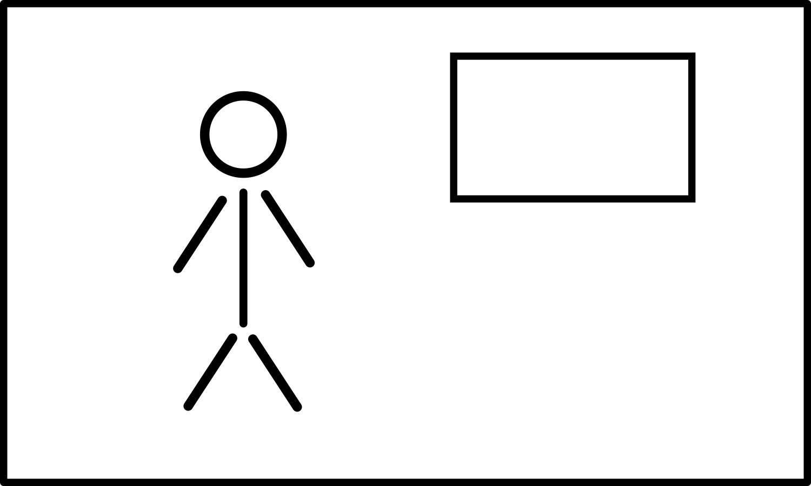
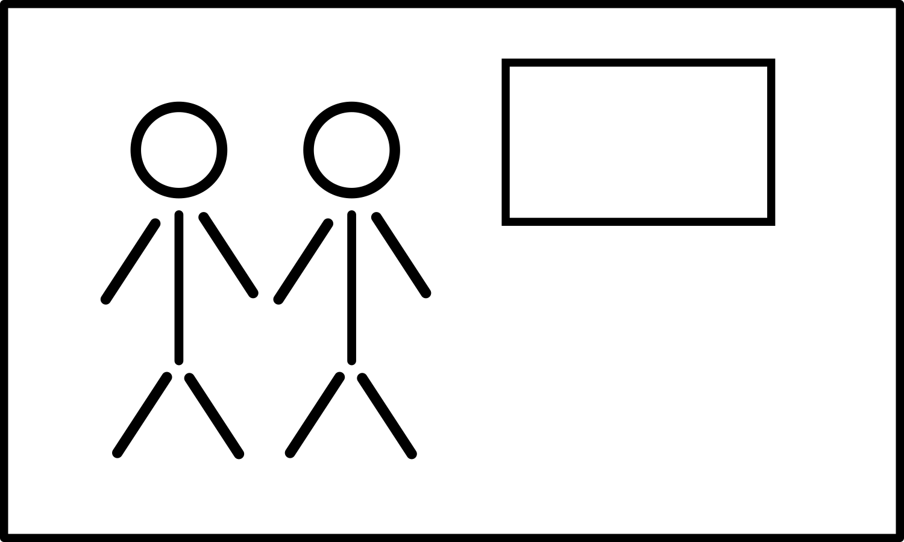
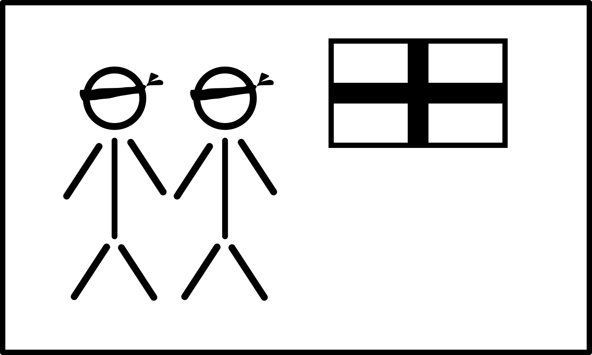
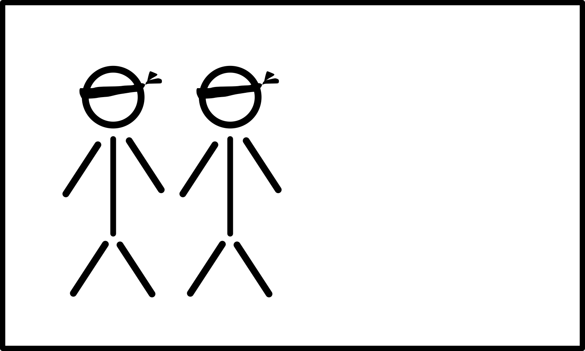

+++
draft = false
date = 2020-03-26T18:04:16Z
title = "ᏐᏁᎳᏚᏏᏁᎢ ᎠᏕᎶᏆᏍᏗ"
weight = 1585245850

[taxonomies]
authors = ["Michael Conrad"]
categories = ["Lessons", "Grammar"]
tags = []

[extra]
zulma_title="Cherokee Language Lessons 1"
featured_image = "lessons/Cherokee-Language-Lessons-Volume-1/Cherokee-Language-Lessons-Volume-1.png"

+++
## ᎦᏬᏂᏍᎬᎢ ᎠᎦᏔᎲᎢ (Grammar)

☞ *Remember that it is through the exercises in the lesson material that
you will learn how to understand and speak Cherokee, not by memorizing
rules and word parts.*

The following two new bound pronouns are used in this lesson.

  - They … me.
    
      - ᎬᎩ̣-, ᎬᏆ͓- (gv²gị-, gv²gw-)

  - They … you.
    
      - ᎨᏣ̣- (ge²jạ-)
<!-- more -->
## ᏘᎪᎵᏯ (Read them)

  - ᎬᎩᎪᏩᏘᎭ  
    \[gv²gị²gowh²tị³ha\] “They see me.”

  - Ꮭ ᏱᎬᎩᎪᏩᏘᎭ  
    \[hla yị²gv²gị²gowh²tị³ha\] “They don’t see me.”

  - ᎨᏣᎪᏩᏘᎭ  
    \[ge²jạ²gowh²tị³ha\] “They see you.”

  - Ꮭ ᏱᎨᏣᎪᏩᏘᎭ  
    \[hla yị²ge²jạ²gowh²tị³ha\] “They don’t see you.”

<!-- end list -->

  - ᏚᎭ  
    \[du²³ha\] “He has them, some solid things.”

  - ᏚᏂᎭ  
    \[du¹ni²³ha\] “They have them, some solid things.”

  - ᏓᎩᎭ  
    \[da¹gị²ha\] “I have them, some solid things.”

  - ᏕᏣᎭ  
    \[de²jạ²ha\] “You have them, some solid things.”

  - ᏚᏩᎧᎭ  
    \[du¹wa²kạ³ha\] “He has them, some alive things.”

  - ᏚᏂᎧᎭ  
    \[du¹ni²kạ³ha\] “They have them, some alive things.”

  - ᏓᎩᎧᎭ  
    \[da¹gị²kạ³ha\] “I have them, some alive things.”

  - ᏕᏣᎧᎭ  
    \[de²jạ²kạ³ha\] “You have them, some alive things.”

<!-- end list -->

  - Ꮭ ᏱᏚᎭ  
    \[hla yị²du²³ha\] “He doesn’t have them, some solid things.”

  - Ꮭ ᏱᏚᏂᎭ  
    \[hla yị²du¹ni²³ha\] “They don’t have them, some solid things.”

  - Ꮭ ᏱᏓᎩᎭ  
    \[hla yị²da²gị²ha\] “I don’t have them, some solid things.”

  - Ꮭ ᏱᏗᏣᎭ  
    \[hla yị²di²jạ²ha\] “You don’t have them, some solid things.”

  - Ꮭ ᏱᏚᏩᎧᎭ  
    \[hla yị²du¹wa²kạ³ha\] “He doesn’t have them, some alive things.”

  - Ꮭ ᏱᏚᏂᎧᎭ  
    \[hla yị²du¹ni²kạ³ha\] “They don’t have them, some alive things.”

  - Ꮭ ᏱᏓᎩᎧᎭ  
    \[hla yị²da²gị²kạ³ha\] “I don’t have them, some alive things.”

  - Ꮭ ᏱᏗᏣᎧᎭ  
    \[hla yị²di²jạ²kạ³ha\] “You don’t have them, some alive things.”

## ᏂᏔᏛᎦ (Do them)

You will need to reuse the following cards from the previous chapter.

 

You will need to add three each of the following cards. Color the first
set of each brown. Color the second set of each red. Leave the third set
of each white.

Label each card on the reverse as follows: ᎤᏬᏗᎨ ᎩᏟ, ᎤᏬᏗᎨ ᏐᏈᎵ, ᎤᏬᏗᎨ ᏪᏌ,
ᏧᏃᏗᎨ ᎩᏟ, ᏧᏃᏗᎨ ᏐᏈᎵ, ᏧᏃᏗᎨ ᏪᏌ, ᎠᎩᎦᎨ ᎩᏟ, ᎠᎩᎦᎨ ᏐᏈᎵ, ᎠᎩᎦᎨ ᏪᏌ, ᎠᏂᎩᎦᎨ ᎩᏟ,
ᎠᏂᎩᎦᎨ ᏐᏈᎵ, ᎠᏂᎩᎦᎨ ᏪᏌ, ᎤᏁᎦ ᎩᏟ, ᎤᏁᎦ ᏐᏈᎵ, ᎤᏁᎦ ᏪᏌ, ᎤᏂᏁᎦ ᎩᏟ, ᎤᏂᏁᎦ ᏐᏈᎵ,
ᎤᏂᏁᎦ ᏪᏌ.

You will need to add three each of the following cards. Color the first
set of each brown. Color the second set of each red. Leave the third set
of each white.

Label each card on the reverse as follows: ᏧᏃᏗᎨ ᎠᏫ, ᏧᏃᏗᎨ ᏥᏍᏚ, ᏧᏃᏗᎨ ᏌᎶᎵ,
ᏧᏃᏗᎨ ᏩᎭᏯ, ᏧᏃᏗᎨ ᏲᎾ, ᎠᏂᎩᎦᎨ ᎠᏫ, ᎠᏂᎩᎦᎨ ᏥᏍᏚ, ᎠᏂᎩᎦᎨ ᏌᎶᎵ, ᎠᏂᎩᎦᎨ ᏩᎭᏯ, ᎠᏂᎩᎦᎨ
ᏲᎾ, ᎤᏂᏁᎦ ᎠᏫ, ᎤᏂᏁᎦ ᏥᏍᏚ, ᎤᏂᏁᎦ ᏌᎶᎵ, ᎤᏂᏁᎦ ᏩᎭᏯ, ᎤᏂᏁᎦ ᏲᎾ.

You will need to add three each of the following cards. Color the first
set of each brown. Color the second set of each red. Leave the third set
of each white.

Label each card on the reverse as follows: ᏧᏬᏗᎨ ᎫᎴ, ᏧᏬᏗᎨ ᏅᏯ, ᏧᏬᏗᎨ ᏄᎾ,
ᏧᏬᏗᎨ ᏗᏌᏛᏗ, ᏧᏬᏚᎨ ᏚᏯ, ᏗᎩᎦᎨ ᎫᎴ, ᏗᎩᎦᎨ ᏅᏯ, ᏗᎩᎦᎨ ᏄᎾ, ᏗᎩᎦᎨ ᏗᏌᏛᏗ, ᏗᎩᎦᎨ ᏚᏯ,
ᏧᏁᎦ ᎫᎴ, ᏧᏁᎦ ᏅᏯ, ᏧᏁᎦ ᏄᎾ, ᏧᏁᎦ ᏗᏌᏛᏗ, ᏧᏁᎦ ᏚᏯ.

You will need to reuse the following people index cards:

 
 

You will need to reuse the following blind-folded people index cards:

 

### Groups

For each group the first person is designated “Ꭰ”. The second person is
designated “Ꭱ”. Any remaining people are grouped together and are
designated “Ꭲ”. After each set, rotate positions so that “Ꭰ” becomes the
“Ꭱ”, the “Ꭱ” becomes one of the “Ꭲ”, and one of the “Ꭲ” becomes the “Ꭰ”.

☞ *Keep rotating until everyone has been in position “Ꭱ”, starting over
with the first set of challenges as needed.*

☞ *The “Ꭰ” responses should be read from the book. The “Ꭱ” responses
should be done without reading the book.*

Each challenge-response should be done as in the previous lesson.

Examples:

1.  ᏥᏍᏚ.  
    “Ꭰ” selects a rabbit card and shows the picture to “Ꭱ”.
    
    1.  \[Ꭰ→Ꭱ\] ᎠᎩᎧᎭᏍ ᏥᏍᏚ?  
        “Ꭰ” asks “Ꭱ”: Do I have a rabbit?
    
    2.  \[Ꭱ\] ᎥᎥ, ᏥᏍᏚ ᏣᎧᎭ.  
        “Ꭱ” responds: Yes, you have a rabbit.

2.  ᏔᎵ ᏅᏯ.  
    “Ꭰ” selects a two rocks card and shows the picture to “Ꭱ”.
    
    1.  \[Ꭰ→Ꭱ\] ᏓᎩᎭᏍ ᏅᏯ?  
        “Ꭰ” asks “Ꭱ”: Do I have rocks?
    
    2.  \[Ꭱ\] ᎥᎥ, ᏅᏯ ᏕᏣᎭ.  
        “Ꭱ” responds: Yes, you have rocks.

### Someone Alone

For the exercises you can either use index cards or use the list
directly from the book.

If using the list in the book, be sure to cover up the answers with an
index card or sheet of paper until the answer needs checking.

If using index cards, write the challenge on the front of each card.
Write all the responses on the back of each card.

Each item should be done as in the following examples:

Use a stuffed animal or pillow as an imaginary study partner.

☞ *There are three main challenge types. Those with people cards and
animals, those with only people cards, and those with only animal cards.
Each one is done differently.*

Each challenge-response should be done as in the previous lesson.

Examples:

1.  ᏥᏍᏚ.
    
    1.  Select and hold a rabbit card.
    
    2.  Point at your self and say to your study partner ᏥᏍᏚ ᎠᎩᎧᎭ. (I
        have a rabbit.)
        
        1.  Point at your partner and say Ꮭ ᏥᏍᏚ ᏱᏣᎧᎭ. (You don’t have a
            rabbit.)
    
    3.  Place the card with your imaginary study partner.
    
    4.  Point at yourself and say to your patner Ꮭ ᏥᏍᏚ ᏯᎩᎧᎭ. (I don’t
        have a rabbit.)
        
        1.  Point at your partner and say ᏥᏍᏚ ᏣᎧᎭ. (You have a rabbit.)
    
    5.  Check the answer and that you are using the correct card.

2.  ᏔᎵ ᏄᎾ. ✓ ᎠᏂᏴᏫᏯᎢ. ✗ ᎠᏂᏣᎳᎩ. ᎾᏍᎩ.  
    The ✓ indicates they have it. The ✗ indicates they don’t have it.
    
    1.  Select a two potato card and a Native American people card and
        place them with each other. Select a Cherokee people card and
        place it by itself.
    
    2.  Point to the potatoes card and Native American card and say:
        
        1.  ᎠᏂᏴᏫᏯᎢ ᏄᎾ ᏚᏂᎭ. (The Native Americans have potatoes.)
        
        2.  ᎾᏍᎩ ᏄᎾ ᏚᏂᎭ. (They have potatoes.)
    
    3.  Point to the Cherokee people card and say:
        
        1.  Ꮭ ᎠᏂᏣᎳᎩ ᏄᎾ ᏱᏚᏂᎭ. (The Cherokee people don’t have potatoes.)
        
        2.  Ꮭ ᎾᏍᎩ ᏄᎾ ᏱᏚᏂᎭ. (They don’t have potatoes.)
    
    4.  Check the answer and that you are using the correct cards.

☞ *Use the “Sets for Someone Alone” section for your exercises.*

### Sets for Groups

☞ *The following contains both review material from previous lessons and
new material from this lesson.*

#### Set 1

1.  ᏌᎶᎵ.
    
    1.  \[Ꭰ→Ꭱ\] ᎠᎩᎧᎭᏍ ᏌᎶᎵ?
    
    2.  \[Ꭱ\] ᎥᎥ, ᏌᎶᎵ ᏣᎧᎭ.

2.  ᎠᎭᏫ.
    
    1.  \[Ꭰ→Ꭱ\] ᎠᎩᎧᎭᏍᎪ ᏐᏈᎵ?
    
    2.  \[Ꭱ\] Ꮭ ᏐᏈᎵ ᏱᏣᎧᎭ.
    
    3.  \[Ꭱ\] ᎠᎭᏫ ᏣᎧᎭ.

3.  ᎠᏫ.
    
    1.  \[Ꭰ→Ꭱ\] ᎠᎩᎧᎭᏍ ᎠᏫ?
    
    2.  \[Ꭱ\] ᎥᎥ, ᎠᏫ ᏣᎧᎭ.

4.  ᏥᏍᏚ.
    
    1.  \[Ꭰ→Ꭱ\] ᎠᎩᎧᎭᏍ ᏪᏌ?
    
    2.  \[Ꭱ\] Ꮭ ᏪᏌ ᏱᏣᎧᎭ.
    
    3.  \[Ꭱ\] ᏥᏍᏚ ᏣᎧᎭ.

5.  ᏚᏯ.
    
    1.  \[Ꭰ→Ꭱ\] ᎠᎩᎭᏍᎪ ᏚᏯ?
    
    2.  \[Ꭱ\] ᎥᎥ, ᏚᏯ ᏣᎭ.

6.  ᏅᏯ.
    
    1.  \[Ꭰ→Ꭱ\] ᎠᎩᎭᏍ ᏌᏛᏗ?
    
    2.  \[Ꭱ\] Ꮭ ᏌᏛᏗ ᏱᏣᎭ.
    
    3.  \[Ꭱ\] ᏅᏯ ᏣᎭ.

7.  ᏄᎾ.
    
    1.  \[Ꭰ→Ꭱ\] ᎠᎩᎭᏍᎪ ᏄᎾ?
    
    2.  \[Ꭱ\] ᎥᎥ, ᏄᎾ ᏣᎭ.

8.  ᏄᎾ.
    
    1.  \[Ꭰ→Ꭱ\] ᎠᎩᎭᏍ ᏚᏯ?
    
    2.  \[Ꭱ\] Ꮭ ᏚᏯ ᏱᏣᎭ.
    
    3.  \[Ꭱ\] ᏄᎾ ᏣᎭ.

9.  ᏔᎵ ᏚᏯ.
    
    1.  \[Ꭰ→Ꭱ\] ᏓᎩᎭᏍᎪ ᏚᏯ?
    
    2.  \[Ꭱ\] ᎥᎥ, ᏚᏯ ᏕᏣᎭ.

10. ᎠᏂᏔᎵ ᏥᏍᏚ.
    
    1.  \[Ꭰ→Ꭱ\] ᏓᎩᎧᎭᏍ ᏥᏍᏚ?
    
    2.  \[Ꭱ\] ᎥᎥ, ᏥᏍᏚ ᏕᏣᎧᎭ.

#### Set 2

1.  ᏔᎵ ᏅᏯ.
    
    1.  \[Ꭰ→Ꭱ\] ᏓᎩᎭᏍᎪ ᏗᏌᏛᏗ?
    
    2.  \[Ꭱ\] Ꮭ ᏗᏌᏛᏗ ᏱᏗᏣᎭ.
    
    3.  \[Ꭱ\] ᏅᏯ ᏕᏣᎭ.

2.  ᏔᎵ ᏚᏯ.
    
    1.  \[Ꭰ→Ꭱ\] ᏓᎩᎭᏍ ᏄᎾ?
    
    2.  \[Ꭱ\] Ꮭ ᏄᎾ ᏱᏗᏣᎭ.
    
    3.  \[Ꭱ\] ᏚᏯ ᏕᏣᎭ.

3.  ᎠᏂᏔᎵ ᏌᎶᎵ.
    
    1.  \[Ꭰ→Ꭱ\] ᏓᎩᎧᎭᏍᎪ ᎩᏟ?
    
    2.  \[Ꭱ\] Ꮭ ᎩᏟ ᏱᏗᏣᎧᎭ.
    
    3.  \[Ꭱ\] ᏌᎶᎵ ᏕᏣᎧᎭ.

4.  ᎠᏂᏔᎵ ᏲᎾ.
    
    1.  \[Ꭰ→Ꭱ\] ᏓᎩᎧᎭᏍ ᏩᎭᏯ?
    
    2.  \[Ꭱ\] Ꮭ ᏲᎾ ᏱᏗᏣᎧᎭ.
    
    3.  \[Ꭱ\] ᏲᎾ ᏕᏣᎧᎭ.

5.  ᎠᏂᎩᎵᏏ \[blind-folded\]
    
    1.  \[Ꭰ\] Ꮎ ᎠᏂᎩᎵᏏ, ᎨᏣᎪᏩᏘᎭᏍ?
    
    2.  \[Ꭱ\] Ꮭ ᎠᏂᎩᎵᏏ ᏱᎬᎩᎪᏩᏘᎭ.

6.  ᎠᏴᏫᏯᎢ \[blind-folded\]
    
    1.  \[Ꭰ\] Ꮎ ᎠᏴᏫᏯᎢ, ᏣᎪᏩᏘᎭᏍ?
    
    2.  \[Ꭱ\] Ꮭ ᎠᏴᏫᏯᎢ ᏯᎩᎪᏩᏘᎭ.

7.  ᎠᎩᎦᎨ ᎩᏟ. ᎠᏂᏣᎳᎩ.
    
    1.  \[Ꭰ→Ꭱ\] ᎠᏂᏣᎳᎩᏍᎪ ᎠᎩᎦᎨ ᎩᏟ ᎤᏂᎧᎭ?
    
    2.  \[Ꭱ\] ᎥᎥ, ᎠᏂᏣᎳᎩ ᎠᎩᎦᎨ ᎩᏟ ᎤᏂᎧᎭ.

8.  ᎤᏬᏗᎨ ᏲᎾ. ᎠᏂᏲᏁᎦ.
    
    1.  \[Ꭰ→Ꭱ\] ᎾᏍᎩᏍ ᎤᏬᏗᎨ ᏲᎾ ᎤᏂᎧᎭ?
    
    2.  \[Ꭱ\] ᎥᎥ, ᎾᏍᎩ ᎤᏬᏗᎨ ᏲᎾ ᎤᏂᎧᎭ.

9.  ᎤᏁᎦ ᎠᎭᏫ. ᎠᏣᎳᎩ.
    
    1.  \[Ꭰ→Ꭱ\] ᎠᏣᎳᎩᏍᎪ ᎤᏁᎦ ᎠᎭᏫ ᎤᏩᎧᎭ?
    
    2.  \[Ꭱ\] ᎥᎥ, ᎠᏣᎳᎩ ᎤᏁᎦ ᎠᎭᏫ ᎤᏩᎧᎭ.

10. ᎤᏁᎦ ᏐᏈᎵ. ᎠᎩᎵᏏ.
    
    1.  \[Ꭰ→Ꭱ\] ᎥᏍᎩᏍᎪ ᎤᏁᎦ ᏐᏈᎵ ᎤᏩᎧᎭ?
    
    2.  \[Ꭱ\] ᎥᎥ, ᎥᏍᎩ ᎤᏁᎦ ᏐᏈᎵ ᎤᏩᎧᎭ.

#### Set 3

1.  ᎤᏬᏗᎨ ᏩᎭᏯ. ᎠᏲᏁᎦ.
    
    1.  \[Ꭰ→Ꭱ\] ᏍᎩᎾᏍ ᎤᏬᏗᎨ ᏩᎭᏯ ᎤᏩᎧᎭ?
    
    2.  \[Ꭱ\] ᎥᎥ, ᏍᎩᎾ ᎤᏬᏗᎨ ᏩᎭᏯ ᎤᏩᎧᎭ.

2.  ᎠᎩᎦᎨ ᎠᏫ. ᎠᏂᏴᏫᏯᎢ.
    
    1.  \[Ꭰ→Ꭱ\] ᎠᏂᏴᏫᏯᎢᏍᎪ ᎤᏬᏗᎨ ᏲᎾ ᎤᏂᎧᎭ?
    
    2.  \[Ꭱ\] Ꮭ ᎠᏂᏴᏫᏯᎢ ᎤᏬᏗᎨ ᏲᎾ ᏳᏂᎧᎭ.
    
    3.  \[Ꭱ\] ᎠᏂᏴᏫᏯᎢ ᎠᎩᎦᎨ ᎠᏫ ᎤᏂᎧᎭ.

3.  ᎤᏬᏗᎨ ᏩᏯ. ᎠᏂᏴᏫ.
    
    1.  \[Ꭰ→Ꭱ\] ᎠᏂᏴᏫᏍ ᎤᏁᎦ ᏪᏌ ᎤᏂᎧᎭ?
    
    2.  \[Ꭱ\] Ꮭ ᎠᏂᏴᏫ ᎤᏁᎦ ᏪᏌ ᏳᏂᎧᎭ.
    
    3.  \[Ꭱ\] ᎠᏂᏴᏫ ᎤᏬᏗᎨ ᏩᏯ ᎤᏂᎧᎭ.

4.  ᎤᏁᎦ ᏥᏍᏚ. ᎠᏂᏴᏫᏯᎢ.
    
    1.  \[Ꭰ→Ꭱ\] ᎥᏍᎩᎾᏍᎪ ᎠᎩᎦᎨ ᎩᏟ ᎤᏂᎧᎭ?
    
    2.  \[Ꭱ\] Ꮭ ᎥᏍᎩᎾ ᎠᎩᎦᎨ ᎩᏟ ᏳᏂᎧᎭ.
    
    3.  \[Ꭱ\] ᎥᏍᎩᎾ ᎤᏁᎦ ᏥᏍᏚ ᎤᏂᎧᎭ.

5.  ᎠᎩᎦᎨ ᎠᏫ. ᎠᏂᏴᏫ.
    
    1.  \[Ꭰ→Ꭱ\] ᏍᎩᎾᏍ ᎠᎩᎦᎨ ᏐᏈᎵ ᎤᏂᎧᎭ?
    
    2.  \[Ꭱ\] Ꮭ ᏍᎩᎾ ᎠᎩᎦᎨ ᏐᏈᎵ ᏳᏂᎧᎭ.
    
    3.  \[Ꭱ\] ᏍᎩᎾ ᎠᎩᎦᎨ ᎠᏫ ᎤᏂᎧᎭ.

6.  ᎠᎩᎦᎨ ᏌᎶᎵ. ᎠᏴᏫ.
    
    1.  \[Ꭰ→Ꭱ\] ᎠᏴᏫᏍᎪ ᎤᏬᏗᎨ ᏲᎾ ᎤᏩᎧᎭ?
    
    2.  \[Ꭱ\] Ꮭ ᎠᏴᏫ ᎤᏬᏗᎨ ᏲᎾ ᏳᏩᎧᎭ.
    
    3.  \[Ꭱ\] ᎠᏴᏫ ᎠᎩᎦᎨ ᏌᎶᎵ ᎤᏩᎧᎭ.

7.  ᎤᏁᎦ ᏩᏯ. ᎠᏴᏫᏯᎢ.
    
    1.  \[Ꭰ→Ꭱ\] ᎠᏴᏫᏯᎢᏍ ᎤᏁᎦ ᎩᏟ ᎤᏩᎧᎭ?
    
    2.  \[Ꭱ\] Ꮭ ᎠᏴᏫᏯᎢ ᎤᏁᎦ ᎩᏟ ᏳᏩᎧᎭ.
    
    3.  \[Ꭱ\] ᎠᏴᏫᏯᎢ ᎤᏁᎦ ᏩᏯ ᎤᏩᎧᎭ.

8.  ᎤᏬᏗᎨ ᎠᎭᏫ. ᎠᏣᎳᎩ.
    
    1.  \[Ꭰ→Ꭱ\] ᎥᏍᎩᏍᎪ ᎤᏁᎦ ᏪᏌ ᎤᏩᎧᎭ?
    
    2.  \[Ꭱ\] Ꮭ ᎥᏍᎩ ᎤᏁᎦ ᏪᏌ ᏳᏩᎧᎭ.
    
    3.  \[Ꭱ\] ᎥᏍᎩ ᎤᏬᏗᎨ ᎠᎭᏫ ᎤᏩᎧᎭ.

9.  ᎤᏁᎦ ᏩᎭᏯ. ᎠᎩᎵᏏ.
    
    1.  \[Ꭰ→Ꭱ\] ᎾᏍᎩᏍ ᎠᎩᎦᎨ ᏐᏈᎵ ᎤᏩᎧᎭ?
    
    2.  \[Ꭱ\] Ꮭ ᎾᏍᎩ ᎠᎩᎦᎨ ᏐᏈᎵ ᏳᏩᎧᎭ.
    
    3.  \[Ꭱ\] ᎾᏍᎩ ᎤᏁᎦ ᏩᎭᏯ ᎤᏩᎧᎭ.

10. ᎤᏬᏗᎨ ᏅᏯ. ᎠᏂᏲᏁᎦ.
    
    1.  \[Ꭰ→Ꭱ\] ᎠᏂᏲᏁᎦᏍᎪ ᎤᏬᏗᎨ ᏅᏯ ᎤᏂᎭ?
    
    2.  \[Ꭱ\] ᎥᎥ, ᎠᏂᏲᏁᎦ ᎤᏬᏗᎨ ᏅᏯ ᎤᏂᎭ.

#### Set 4

1.  ᎩᎦᎨ ᏌᏛᏗ. ᎠᏂᏣᎳᎩ.
    
    1.  \[Ꭰ→Ꭱ\] ᎠᏂᏣᎳᎩᏍ ᎩᎦᎨ ᏌᏛᏗ ᎤᏂᎭ?
    
    2.  \[Ꭱ\] ᎥᎥ, ᎠᏂᏣᎳᎩ ᎩᎦᎨ ᏌᏛᏗ ᎤᏂᎭ.

2.  ᎤᏁᎦ ᏌᏛᏗ. ᎠᏲᏁᎦ.
    
    1.  \[Ꭰ→Ꭱ\] ᎠᏲᏁᎦᏍᎪ ᎤᏁᎦ ᏌᏛᏗ ᎤᎭ?
    
    2.  \[Ꭱ\] ᎥᎥ, ᎠᏲᏁᎦ ᎤᏁᎦ ᏌᏛᏗ ᎤᎭ.

3.  ᎩᎦᎨ ᏅᏯ. ᎠᏴᏫ.
    
    1.  \[Ꭰ→Ꭱ\] ᎠᏴᏫᏍ ᎩᎦᎨ ᏅᏯ ᎤᎭ?
    
    2.  \[Ꭱ\] ᎥᎥ, ᎠᏴᏫ ᎩᎦᎨ ᏅᏯ ᎤᎭ.

4.  ᎤᏁᎦ ᏄᎾ. ᎠᏂᎩᎵᏏ.
    
    1.  \[Ꭰ→Ꭱ\] ᎠᏂᎩᎵᏏᏍᎪ ᎩᎦᎨ ᏚᏯ ᎤᏂᎭ?
    
    2.  \[Ꭱ\] Ꮭ ᎠᏂᎩᎵᏏ ᎩᎦᎨ ᏚᏯ ᏳᏂᎭ.
    
    3.  \[Ꭱ\] ᎠᏂᎩᎵᏏ ᎤᏁᎦ ᏄᎾ ᎤᏂᎭ.

5.  ᎤᏬᏗᎨ ᏅᏯ. ᎠᏂᎩᎵᏏ.
    
    1.  \[Ꭰ→Ꭱ\] ᎠᏂᎩᎵᏏᏍ ᎤᏬᏗᎨ ᏌᏛᏗ ᎤᏂᎭ?
    
    2.  \[Ꭱ\] Ꮭ ᎠᏂᎩᎵᏏ ᎤᏬᏗᎨ ᏌᏛᏗ ᏳᏂᎭ.
    
    3.  \[Ꭱ\] ᎠᏂᎩᎵᏏ ᎤᏬᏗᎨ ᏅᏯ ᎤᏂᎭ.

6.  ᎤᏬᏗᎨ ᏅᏯ. ᎠᎩᎵᏏ.
    
    1.  \[Ꭰ→Ꭱ\] ᎠᎩᎵᏏᏍ ᎤᏁᎦ ᏚᏯ ᎤᎭ?
    
    2.  \[Ꭱ\] Ꮭ ᎠᎩᎵᏏ ᎤᏁᎦ ᏚᏯ ᏳᎭ.
    
    3.  \[Ꭱ\] ᎠᎩᎵᏏ ᎤᏬᏗᎨ ᏅᏯ ᎤᎭ.

7.  ᎤᏁᎦ ᏄᎾ. ᎠᏴᏫᏯᎢ.
    
    1.  \[Ꭰ→Ꭱ\] ᎠᏴᏫᏯᎢᏍᎪ ᎤᏬᏗᎨ ᏌᏛᏗ ᎤᎭ?
    
    2.  \[Ꭱ\] Ꮭ ᎠᏴᏫᏯᎢ ᎤᏬᏗᎨ ᏌᏛᏗ ᏳᎭ.
    
    3.  \[Ꭱ\] ᎠᏴᏫᏯᎢ ᎤᏁᎦ ᏄᎾ ᎤᎭ.

8.  ᎠᏂᏴᏫ \[not-blind-folded\]
    
    1.  \[Ꭰ\] Ꮎ ᎠᏂᏴᏫ, ᎨᏣᎪᏩᏘᎭᏍ?
    
    2.  \[Ꭱ\] ᎥᎥ, ᎠᏂᏴᏫ ᎬᎩᎪᏩᏘᎭ.

9.  ᎠᏂᏴᏫᏯᎢ \[not-blind-folded\]
    
    1.  \[Ꭰ\] Ꮎ ᎠᏂᏴᏫᏯᎢ, ᎨᏣᎪᏩᏘᎭᏍ?
    
    2.  \[Ꭱ\] ᎥᎥ, ᎠᏂᏴᏫᏯᎢ ᎬᎩᎪᏩᏘᎭ.

10. ᎠᏲᏁᎦ \[not-blind-folded\]
    
    1.  \[Ꭰ\] Ꮎ ᎠᏲᏁᎦ, ᏣᎪᏩᏘᎭᏍ?
    
    2.  \[Ꭱ\] ᎥᎥ, ᎠᏲᏁᎦ ᎠᎩᎪᏩᏘᎭ.

#### Set 5

1.  ᎠᏣᎳᎩ \[not-blind-folded\]
    
    1.  \[Ꭰ\] Ꮎ ᎠᏣᎳᎩ, ᏣᎪᏩᏘᎭᏍ?
    
    2.  \[Ꭱ\] ᎥᎥ, ᎠᏣᎳᎩ ᎠᎩᎪᏩᏘᎭ.

2.  ᏔᎵ ᏧᏁᎦ ᏗᏌᏛᏗ. ᎠᏂᏲᏁᎦ.
    
    1.  \[Ꭰ→Ꭱ\] ᎠᏂᏲᏁᎦᏍ ᏧᏁᎦ ᏗᏌᏛᏗ ᏚᏂᎭ?
    
    2.  \[Ꭱ\] ᎥᎥ, ᎠᏂᏲᏁᎦ ᏧᏁᎦ ᏗᏌᏛᏗ ᏚᏂᎭ.

3.  ᏔᎵ ᏗᎩᎦᎨ ᏅᏯ. ᎠᏂᏣᎳᎩ.
    
    1.  \[Ꭰ→Ꭱ\] ᎠᏂᏣᎳᎩᏍᎪ ᏗᎩᎦᎨ ᏅᏯ ᏚᏂᎭ?
    
    2.  \[Ꭱ\] ᎥᎥ, ᎠᏂᏣᎳᎩ ᏗᎩᎦᎨ ᏅᏯ ᏚᏂᎭ.

4.  ᏔᎵ ᏧᏬᏗᎨ ᏄᎾ. ᎠᏴᏫ.
    
    1.  \[Ꭰ→Ꭱ\] ᎠᏴᏫᏍᎪ ᏧᏬᏗᎨ ᏄᎾ ᏚᎭ?
    
    2.  \[Ꭱ\] ᎥᎥ, ᎠᏴᏫ ᏧᏬᏗᎨ ᏄᎾ ᏚᎭ.

5.  ᏔᎵ ᏧᏬᏗᎨ ᏅᏯ. ᎠᏣᎳᎩ.
    
    1.  \[Ꭰ→Ꭱ\] ᎠᏣᎳᎩᏍ ᏧᏬᏗᎨ ᏅᏯ ᏚᎭ?
    
    2.  \[Ꭱ\] ᎥᎥ, ᎠᏣᎳᎩ ᏧᏬᏗᎨ ᏅᏯ ᏚᎭ.

6.  ᎠᏂᏔᎵ ᎠᏂᎩᎦᎨ ᏩᏯ. ᎠᏂᏣᎳᎩ.
    
    1.  \[Ꭰ→Ꭱ\] ᎠᏂᏣᎳᎩᏍᎪ ᎠᏂᎩᎦᎨ ᏩᏯ ᏚᏂᎧᎭ?
    
    2.  \[Ꭱ\] ᎥᎥ, ᎠᏂᏣᎳᎩ ᎠᏂᎩᎦᎨ ᏩᏯ ᏚᏂᎧᎭ.

7.  ᎠᏂᏔᎵ ᏧᏃᏗᎨ ᏪᏌ. ᎠᏂᏴᏫ.
    
    1.  \[Ꭰ→Ꭱ\] ᎠᏂᏴᏫᏍ ᏧᏃᏗᎨ ᏪᏌ ᏚᏂᎧᎭ?
    
    2.  \[Ꭱ\] ᎥᎥ, ᎠᏂᏴᏫ ᏧᏃᏗᎨ ᏪᏌ ᏚᏂᎧᎭ.

8.  ᎠᏂᏔᎵ ᎤᏂᏁᎦ ᏌᎶᎵ. ᎠᏂᏲᏁᎦ.
    
    1.  \[Ꭰ→Ꭱ\] ᎥᏍᎩᎾᏍᎪ ᎤᏂᏁᎦ ᏌᎶᎵ ᏚᏂᎧᎭ?
    
    2.  \[Ꭱ\] ᎥᎥ, ᎥᏍᎩᎾ ᎤᏂᏁᎦ ᏌᎶᎵ ᏚᏂᎧᎭ.

9.  ᎠᏂᏔᎵ ᎠᏂᎩᎦᎨ ᏩᎭᏯ. ᎠᏂᎩᎵᏏ.
    
    1.  \[Ꭰ→Ꭱ\] ᎥᏍᎩᏍ ᎠᏂᎩᎦᎨ ᏩᎭᏯ ᏚᏂᎧᎭ?
    
    2.  \[Ꭱ\] ᎥᎥ, ᎥᏍᎩ ᎠᏂᎩᎦᎨ ᏩᎭᏯ ᏚᏂᎧᎭ.

10. ᎠᏂᏔᎵ ᏧᏃᏗᎨ ᏩᏯ. ᎠᎩᎵᏏ.
    
    1.  \[Ꭰ→Ꭱ\] ᎠᎩᎵᏏᏍ ᏧᏃᏗᎨ ᏩᏯ ᏚᏩᎧᎭ?
    
    2.  \[Ꭱ\] ᎥᎥ, ᎠᎩᎵᏏ ᏧᏃᏗᎨ ᏩᏯ ᏚᏩᎧᎭ.

#### Set 6

1.  ᎠᏂᏔᎵ ᎤᏂᏁᎦ ᏐᏈᎵ. ᎠᏲᏁᎦ.
    
    1.  \[Ꭰ→Ꭱ\] ᎠᏲᏁᎦᏍᎪ ᎤᏂᏁᎦ ᏐᏈᎵ ᏚᏩᎧᎭ?
    
    2.  \[Ꭱ\] ᎥᎥ, ᎠᏲᏁᎦ ᎤᏂᏁᎦ ᏐᏈᎵ ᏚᏩᎧᎭ.

2.  ᎠᏂᏔᎵ ᎤᏂᏁᎦ ᎠᏫ. ᎠᏴᏫᏯᎢ.
    
    1.  \[Ꭰ→Ꭱ\] ᎾᏍᎩᏍ ᎤᏂᏁᎦ ᎠᏫ ᏚᏩᎧᎭ?
    
    2.  \[Ꭱ\] ᎥᎥ, ᎾᏍᎩ ᎤᏂᏁᎦ ᎠᏫ ᏚᏩᎧᎭ.

3.  ᎠᏂᏔᎵ ᎠᏂᎩᎦᎨ ᎠᎭᏫ. ᎠᏴᏫ.
    
    1.  \[Ꭰ→Ꭱ\] ᏍᎩᎾᏍᎪ ᎠᏂᎩᎦᎨ ᎠᎭᏫ ᏚᏩᎧᎭ?
    
    2.  \[Ꭱ\] ᎥᎥ, ᏍᎩᎾ ᎠᏂᎩᎦᎨ ᎠᎭᏫ ᏚᏩᎧᎭ.

4.  ᏔᎵ ᏗᎩᎦᎨ ᏄᎾ. ᎠᏂᏴᏫᏯᎢ.
    
    1.  \[Ꭰ→Ꭱ\] ᎠᏂᏴᏫᏯᎢᏍ ᏧᏁᎦ ᏗᏌᏛᏗ ᏚᏂᎭ?
    
    2.  \[Ꭱ\] Ꮭ ᎠᏂᏴᏫᏯᎢ ᏧᏁᎦ ᏗᏌᏛᏗ ᏱᏚᏂᎭ.
    
    3.  \[Ꭱ\] ᎠᏂᏴᏫᏯᎢ ᏗᎩᎦᎨ ᏄᎾ ᏚᏂᎭ.

5.  ᏔᎵ ᏧᏁᎦ ᏅᏯ. ᎠᏂᎩᎵᏏ.
    
    1.  \[Ꭰ→Ꭱ\] ᎠᏂᎩᎵᏏᏍᎪ ᏧᏬᏗᎨ ᏚᏯ ᏚᏂᎭ?
    
    2.  \[Ꭱ\] Ꮭ ᎠᏂᎩᎵᏏ ᏧᏬᏗᎨ ᏚᏯ ᏱᏚᏂᎭ.
    
    3.  \[Ꭱ\] ᎠᏂᎩᎵᏏ ᏧᏁᎦ ᏅᏯ ᏚᏂᎭ.

6.  ᏔᎵ ᏧᏁᎦ ᏄᎾ. ᎠᏴᏫᏯᎢ.
    
    1.  \[Ꭰ→Ꭱ\] ᎠᏴᏫᏯᎢᏍᎪ ᏗᎩᎦᎨ ᏚᏯ ᏚᎭ?
    
    2.  \[Ꭱ\] Ꮭ ᎠᏴᏫᏯᎢ ᏗᎩᎦᎨ ᏚᏯ ᏱᏚᎭ.
    
    3.  \[Ꭱ\] ᎠᏴᏫᏯᎢ ᏧᏁᎦ ᏄᎾ ᏚᎭ.

7.  ᏔᎵ ᏧᏬᏗᎨ ᏅᏯ. ᎠᏴᏫ.
    
    1.  \[Ꭰ→Ꭱ\] ᎠᏴᏫᏍ ᏧᏁᎦ ᏗᏌᏛᏗ ᏚᎭ?
    
    2.  \[Ꭱ\] Ꮭ ᎠᏴᏫ ᏧᏁᎦ ᏗᏌᏛᏗ ᏱᏚᎭ.
    
    3.  \[Ꭱ\] ᎠᏴᏫ ᏧᏬᏗᎨ ᏅᏯ ᏚᎭ.

8.  ᏔᎵ ᏗᎩᎦᎨ ᏚᏯ. ᎠᏂᏴᏫ.
    
    1.  \[Ꭰ→Ꭱ\] ᎠᏂᏴᏫᏍᎪ ᏧᏬᏗᎨ ᏅᏯ ᏚᏂᎭ?
    
    2.  \[Ꭱ\] Ꮭ ᎠᏂᏴᏫ ᏧᏬᏗᎨ ᏅᏯ ᏱᏚᏂᎭ.
    
    3.  \[Ꭱ\] ᎠᏂᏴᏫ ᏗᎩᎦᎨ ᏚᏯ ᏚᏂᎭ.

9.  ᏔᎵ ᏧᏬᏗᎨ ᏗᏌᏛᏗ. ᎠᏂᏲᏁᎦ.
    
    1.  \[Ꭰ→Ꭱ\] ᎠᏂᏲᏁᎦᏍ ᏗᎩᎦᎨ ᏄᎾ ᏚᏂᎭ?
    
    2.  \[Ꭱ\] Ꮭ ᎠᏂᏲᏁᎦ ᏗᎩᎦᎨ ᏄᎾ ᏱᏚᏂᎭ.
    
    3.  \[Ꭱ\] ᎠᏂᏲᏁᎦ ᏧᏬᏗᎨ ᏗᏌᏛᏗ ᏚᏂᎭ.

10. ᏔᎵ ᏧᏁᎦ ᏗᏌᏛᏗ. ᎠᎩᎵᏏ.
    
    1.  \[Ꭰ→Ꭱ\] ᎠᎩᎵᏏᏍ ᏗᎩᎦᎨ ᏅᏯ ᏚᎭ?
    
    2.  \[Ꭱ\] Ꮭ ᎠᎩᎵᏏ ᏗᎩᎦᎨ ᏅᏯ ᏱᏚᎭ.
    
    3.  \[Ꭱ\] ᎠᎩᎵᏏ ᏧᏁᎦ ᏗᏌᏛᏗ ᏚᎭ.

#### Set 7

1.  ᏔᎵ ᏗᎩᎦᎨ ᏚᏯ. ᎠᏲᏁᎦ.
    
    1.  \[Ꭰ→Ꭱ\] ᎠᏲᏁᎦᏍᎪ ᏧᏬᏗᎨ ᏄᎾ ᏚᎭ?
    
    2.  \[Ꭱ\] Ꮭ ᎠᏲᏁᎦ ᏧᏬᏗᎨ ᏄᎾ ᏱᏚᎭ.
    
    3.  \[Ꭱ\] ᎠᏲᏁᎦ ᏗᎩᎦᎨ ᏚᏯ ᏚᎭ.

2.  ᎠᏂᏔᎵ ᏧᏃᏗᎨ ᏌᎶᎵ. ᎠᏂᏣᎳᎩ.
    
    1.  \[Ꭰ→Ꭱ\] ᎠᏂᏣᎳᎩᏍᎪ ᎤᏂᏁᎦ ᎩᏟ ᏚᏂᎧᎭ?
    
    2.  \[Ꭱ\] Ꮭ ᎠᏂᏣᎳᎩ ᎤᏂᏁᎦ ᎩᏟ ᏱᏚᏂᎧᎭ.
    
    3.  \[Ꭱ\] ᎠᏂᏣᎳᎩ ᏧᏃᏗᎨ ᏌᎶᎵ ᏚᏂᎧᎭ.

3.  ᎠᏂᏔᎵ ᎠᏂᎩᎦᎨ ᎠᎭᏫ. ᎠᏂᏴᏫᏯᎢ.
    
    1.  \[Ꭰ→Ꭱ\] ᎠᏂᏴᏫᏯᎢᏍ ᏧᏃᏗᎨ ᏐᏈᎵ ᏚᏂᎧᎭ?
    
    2.  \[Ꭱ\] Ꮭ ᎠᏂᏴᏫᏯᎢ ᏧᏃᏗᎨ ᏐᏈᎵ ᏱᏚᏂᎧᎭ.
    
    3.  \[Ꭱ\] ᎠᏂᏴᏫᏯᎢ ᎠᏂᎩᎦᎨ ᎠᎭᏫ ᏚᏂᎧᎭ.

4.  ᎠᏂᏔᎵ ᏧᏃᏗᎨ ᏩᏯ. ᎠᏂᏴᏫ.
    
    1.  \[Ꭰ→Ꭱ\] ᎥᏍᎩᎾᏍᎪ ᎠᏂᎩᎦᎨ ᏪᏌ ᏚᏂᎧᎭ?
    
    2.  \[Ꭱ\] Ꮭ ᎥᏍᎩᎾ ᎠᏂᎩᎦᎨ ᏪᏌ ᏱᏚᏂᎧᎭ.
    
    3.  \[Ꭱ\] ᎥᏍᎩᎾ ᏧᏃᏗᎨ ᏩᏯ ᏚᏂᎧᎭ.

5.  ᎠᏂᏔᎵ ᎤᏂᏁᎦ ᏥᏍᏚ. ᎠᏂᏲᏁᎦ.
    
    1.  \[Ꭰ→Ꭱ\] ᏍᎩᎾᏍ ᎠᏂᎩᎦᎨ ᏲᎾ ᏚᏂᎧᎭ?
    
    2.  \[Ꭱ\] Ꮭ ᏍᎩᎾ ᎠᏂᎩᎦᎨ ᏲᎾ ᏱᏚᏂᎧᎭ.
    
    3.  \[Ꭱ\] ᏍᎩᎾ ᎤᏂᏁᎦ ᏥᏍᏚ ᏚᏂᎧᎭ.

6.  ᎠᏂᏔᎵ ᎤᏂᏁᎦ ᏩᎭᏯ. ᎠᏣᎳᎩ.
    
    1.  \[Ꭰ→Ꭱ\] ᎠᏣᎳᎩᏍᎪ ᏧᏃᏗᎨ ᏪᏌ ᏚᏩᎧᎭ?
    
    2.  \[Ꭱ\] Ꮭ ᎠᏣᎳᎩ ᏧᏃᏗᎨ ᏪᏌ ᏱᏚᏩᎧᎭ.
    
    3.  \[Ꭱ\] ᎠᏣᎳᎩ ᎤᏂᏁᎦ ᏩᎭᏯ ᏚᏩᎧᎭ.

7.  ᎠᏂᏔᎵ ᎠᏂᎩᎦᎨ ᎠᏫ. ᎠᏣᎳᎩ.
    
    1.  \[Ꭰ→Ꭱ\] ᎠᏣᎳᎩᏍ ᎤᏂᏁᎦ ᏲᎾ ᏚᏩᎧᎭ?
    
    2.  \[Ꭱ\] Ꮭ ᎠᏣᎳᎩ ᎤᏂᏁᎦ ᏲᎾ ᏱᏚᏩᎧᎭ.
    
    3.  \[Ꭱ\] ᎠᏣᎳᎩ ᎠᏂᎩᎦᎨ ᎠᏫ ᏚᏩᎧᎭ.

8.  ᎠᏂᏔᎵ ᏧᏃᏗᎨ ᏩᎭᏯ. ᎠᎩᎵᏏ.
    
    1.  \[Ꭰ→Ꭱ\] ᎥᏍᎩᏍ ᏧᏃᏗᎨ ᏐᏈᎵ ᏚᏩᎧᎭ?
    
    2.  \[Ꭱ\] Ꮭ ᎥᏍᎩ ᏧᏃᏗᎨ ᏐᏈᎵ ᏱᏚᏩᎧᎭ.
    
    3.  \[Ꭱ\] ᎥᏍᎩ ᏧᏃᏗᎨ ᏩᎭᏯ ᏚᏩᎧᎭ.

9.  ᎠᏂᏔᎵ ᏧᏃᏗᎨ ᏩᏯ. ᎠᏲᏁᎦ.
    
    1.  \[Ꭰ→Ꭱ\] ᎾᏍᎩᏍᎪ ᎤᏂᏁᎦ ᎩᏟ ᏚᏩᎧᎭ?
    
    2.  \[Ꭱ\] Ꮭ ᎾᏍᎩ ᎤᏂᏁᎦ ᎩᏟ ᏱᏚᏩᎧᎭ.
    
    3.  \[Ꭱ\] ᎾᏍᎩ ᏧᏃᏗᎨ ᏩᏯ ᏚᏩᎧᎭ.

10. ᎠᏂᏔᎵ ᎤᏂᏁᎦ ᏐᏈᎵ. ᎠᏂᏴᏫᏯᎢ.
    
    1.  \[Ꭰ→Ꭱ\] ᎠᏂᏴᏫᏯᎢᏍᎪ ᎠᏂᎩᎦᎨ ᎠᎭᏫ ᏚᏂᎧᎭ?
    
    2.  \[Ꭱ\] Ꮭ ᎠᏂᏴᏫᏯᎢ ᎠᏂᎩᎦᎨ ᎠᎭᏫ ᏱᏚᏂᎧᎭ.
    
    3.  \[Ꭱ\] ᎠᏂᏴᏫᏯᎢ ᎤᏂᏁᎦ ᏐᏈᎵ ᏚᏂᎧᎭ.

#### Set 8

1.  ᎠᏂᏔᎵ ᎠᏂᎩᎦᎨ ᏪᏌ. ᎠᏂᏣᎳᎩ.
    
    1.  \[Ꭰ→Ꭱ\] ᎠᏂᏣᎳᎩᏍ ᎤᏂᏁᎦ ᎠᏫ ᏚᏂᎧᎭ?
    
    2.  \[Ꭱ\] Ꮭ ᎠᏂᏣᎳᎩ ᎤᏂᏁᎦ ᎠᏫ ᏱᏚᏂᎧᎭ.
    
    3.  \[Ꭱ\] ᎠᏂᏣᎳᎩ ᎠᏂᎩᎦᎨ ᏪᏌ ᏚᏂᎧᎭ.

2.  ᎠᏂᏔᎵ ᎠᏂᎩᎦᎨ ᏲᎾ. ᎠᏂᎩᎵᏏ.
    
    1.  \[Ꭰ→Ꭱ\] ᎥᏍᎩᎾᏍᎪ ᎠᏂᎩᎦᎨ ᏥᏍᏚ ᏚᏂᎧᎭ?
    
    2.  \[Ꭱ\] Ꮭ ᎥᏍᎩᎾ ᎠᏂᎩᎦᎨ ᏥᏍᏚ ᏱᏚᏂᎧᎭ.
    
    3.  \[Ꭱ\] ᎥᏍᎩᎾ ᎠᏂᎩᎦᎨ ᏲᎾ ᏚᏂᎧᎭ.

3.  ᎠᏂᏔᎵ ᎤᏂᏁᎦ ᎩᏟ. ᎠᏂᏴᏫ.
    
    1.  \[Ꭰ→Ꭱ\] ᎥᏍᎩᏍ ᏧᏃᏗᎨ ᏌᎶᎵ ᏚᏂᎧᎭ?
    
    2.  \[Ꭱ\] Ꮭ ᎥᏍᎩ ᏧᏃᏗᎨ ᏌᎶᎵ ᏱᏚᏂᎧᎭ.
    
    3.  \[Ꭱ\] ᎥᏍᎩ ᎤᏂᏁᎦ ᎩᏟ ᏚᏂᎧᎭ.

4.  ᎠᏂᏔᎵ ᏧᏃᏗᎨ ᏲᎾ. ᎠᏴᏫ.
    
    1.  \[Ꭰ→Ꭱ\] ᎠᏴᏫᏍ ᎠᏂᎩᎦᎨ ᎠᎭᏫ ᏚᏩᎧᎭ?
    
    2.  \[Ꭱ\] Ꮭ ᎠᏴᏫ ᎠᏂᎩᎦᎨ ᎠᎭᏫ ᏱᏚᏩᎧᎭ.
    
    3.  \[Ꭱ\] ᎠᏴᏫ ᏧᏃᏗᎨ ᏲᎾ ᏚᏩᎧᎭ.

5.  ᎠᏂᏔᎵ ᎠᏂᎩᎦᎨ ᏪᏌ. ᎠᏴᏫᏯᎢ.
    
    1.  \[Ꭰ→Ꭱ\] ᎠᏴᏫᏯᎢᏍᎪ ᏧᏃᏗᎨ ᏩᏯ ᏚᏩᎧᎭ?
    
    2.  \[Ꭱ\] Ꮭ ᎠᏴᏫᏯᎢ ᏧᏃᏗᎨ ᏩᏯ ᏱᏚᏩᎧᎭ.
    
    3.  \[Ꭱ\] ᎠᏴᏫᏯᎢ ᎠᏂᎩᎦᎨ ᏪᏌ ᏚᏩᎧᎭ.

6.  ᎠᏂᏔᎵ ᎤᏂᏁᎦ ᎩᏟ. ᎠᏴᏫ.
    
    1.  \[Ꭰ→Ꭱ\] ᎥᏍᎩᎾᏍ ᎤᏂᏁᎦ ᏌᎶᎵ ᏚᏩᎧᎭ?
    
    2.  \[Ꭱ\] Ꮭ ᎥᏍᎩᎾ ᎤᏂᏁᎦ ᏌᎶᎵ ᏱᏚᏩᎧᎭ.
    
    3.  \[Ꭱ\] ᎥᏍᎩᎾ ᎤᏂᏁᎦ ᎩᏟ ᏚᏩᎧᎭ.

7.  ᎠᏂᏔᎵ ᏧᏃᏗᎨ ᏐᏈᎵ. ᎠᏣᎳᎩ.
    
    1.  \[Ꭰ→Ꭱ\] ᏍᎩᎾᏍᎪ ᎠᏂᎩᎦᎨ ᎠᏫ ᏚᏩᎧᎭ?
    
    2.  \[Ꭱ\] Ꮭ ᏍᎩᎾ ᎠᏂᎩᎦᎨ ᎠᏫ ᏱᏚᏩᎧᎭ.
    
    3.  \[Ꭱ\] ᏍᎩᎾ ᏧᏃᏗᎨ ᏐᏈᎵ ᏚᏩᎧᎭ.

8.  ᎤᏬᏗᎨ ᏥᏍᏚ. ᎠᏂᏴᏫ ᎠᎴ ᎠᏂᎩᎵᏏ.
    
    1.  \[Ꭰ→Ꭱ\] ᎾᏍᎩᏍᎪ ᎤᏬᏗᎨ ᏥᏍᏚ ᎤᏂᎧᎭ?
    
    2.  \[Ꭱ\] ᎥᎥ, ᎾᏍᎩ ᎤᏬᏗᎨ ᏥᏍᏚ ᎤᏂᎧᎭ.

9.  ᎠᎩᎦᎨ ᎩᏟ. ᎠᏂᏴᏫᏯᎢ ᎠᎴ ᎠᏂᏣᎳᎩ.
    
    1.  \[Ꭰ→Ꭱ\] ᎥᏍᎩᏍ ᎠᎩᎦᎨ ᎩᏟ ᎤᏂᎧᎭ?
    
    2.  \[Ꭱ\] ᎥᎥ, ᎥᏍᎩ ᎠᎩᎦᎨ ᎩᏟ ᎤᏂᎧᎭ.

10. ᎠᎩᎦᎨ ᏲᎾ. ᎠᏴᏫᏯᎢ ᎠᎴ ᎠᏴᏫ.
    
    1.  \[Ꭰ→Ꭱ\] ᏍᎩᎾᏍ ᎠᎩᎦᎨ ᏲᎾ ᎤᏂᎧᎭ?
    
    2.  \[Ꭱ\] ᎥᎥ, ᏍᎩᎾ ᎠᎩᎦᎨ ᏲᎾ ᎤᏂᎧᎭ.

#### Set 9

1.  ᎤᏁᎦ ᏪᏌ. ᎠᏣᎳᎩ ᎠᎴ ᎠᎩᎵᏏ.
    
    1.  \[Ꭰ→Ꭱ\] ᎥᏍᎩᎾᏍᎪ ᎤᏁᎦ ᏪᏌ ᎤᏂᎧᎭ?
    
    2.  \[Ꭱ\] ᎥᎥ, ᎥᏍᎩᎾ ᎤᏁᎦ ᏪᏌ ᎤᏂᎧᎭ.

2.  ᎤᏬᏗᎨ ᏩᎭᏯ. ᎠᏂᏴᏫᏯᎢ ᎠᎴ ᎠᏂᏲᏁᎦ.
    
    1.  \[Ꭰ→Ꭱ\] ᎾᏍᎩᏍᎪ ᎤᏬᏗᎨ ᏪᏌ ᎤᏂᎧᎭ?
    
    2.  \[Ꭱ\] Ꮭ ᎾᏍᎩ ᎤᏬᏗᎨ ᏪᏌ ᏳᏂᎧᎭ.
    
    3.  \[Ꭱ\] ᎾᏍᎩ ᎤᏬᏗᎨ ᏩᎭᏯ ᎤᏂᎧᎭ.

3.  ᎤᏁᎦ ᏥᏍᏚ. ᎠᏂᏴᏫ ᎠᎴ ᎠᏂᎩᎵᏏ.
    
    1.  \[Ꭰ→Ꭱ\] ᎥᏍᎩᏍ ᎤᏁᎦ ᏲᎾ ᎤᏂᎧᎭ?
    
    2.  \[Ꭱ\] Ꮭ ᎥᏍᎩ ᎤᏁᎦ ᏲᎾ ᏳᏂᎧᎭ.
    
    3.  \[Ꭱ\] ᎥᏍᎩ ᎤᏁᎦ ᏥᏍᏚ ᎤᏂᎧᎭ.

4.  ᎠᎩᎦᎨ ᎠᏫ. ᎠᏲᏁᎦ ᎠᎴ ᎠᎩᎵᏏ.
    
    1.  \[Ꭰ→Ꭱ\] ᎥᏍᎩᎾᏍ ᎠᎩᎦᎨ ᎩᏟ ᎤᏂᎧᎭ?
    
    2.  \[Ꭱ\] Ꮭ ᎥᏍᎩᎾ ᎠᎩᎦᎨ ᎩᏟ ᏳᏂᎧᎭ.
    
    3.  \[Ꭱ\] ᎥᏍᎩᎾ ᎠᎩᎦᎨ ᎠᏫ ᎤᏂᎧᎭ.

5.  ᎤᏬᏗᎨ ᏥᏍᏚ. ᎠᏴᏫᏯᎢ ᎠᎴ ᎠᏴᏫ.
    
    1.  \[Ꭰ→Ꭱ\] ᎾᏍᎩᏍᎪ ᎤᏬᏗᎨ ᏐᏈᎵ ᎤᏂᎧᎭ?
    
    2.  \[Ꭱ\] Ꮭ ᎾᏍᎩ ᎤᏬᏗᎨ ᏐᏈᎵ ᏳᏂᎧᎭ.
    
    3.  \[Ꭱ\] ᎾᏍᎩ ᎤᏬᏗᎨ ᏥᏍᏚ ᎤᏂᎧᎭ.

6.  ᎠᏂᏔᎵ ᎠᏂᎩᎦᎨ ᎠᏫ. ᎠᏂᏴᏫ ᎠᎴ ᎠᏂᏲᏁᎦ.
    
    1.  \[Ꭰ→Ꭱ\] ᏍᎩᎾᏍ ᎠᏂᎩᎦᎨ ᎠᏫ ᏚᏂᎧᎭ?
    
    2.  \[Ꭱ\] ᎥᎥ, ᏍᎩᎾ ᎠᏂᎩᎦᎨ ᎠᏫ ᏚᏂᎧᎭ.

7.  ᎠᏂᏔᎵ ᏧᏃᏗᎨ ᏩᏯ. ᎠᏂᏴᏫᏯᎢ ᎠᎴ ᎠᏂᏣᎳᎩ.
    
    1.  \[Ꭰ→Ꭱ\] ᎥᏍᎩᏍᎪ ᏧᏃᏗᎨ ᏩᏯ ᏚᏂᎧᎭ?
    
    2.  \[Ꭱ\] ᎥᎥ, ᎥᏍᎩ ᏧᏃᏗᎨ ᏩᏯ ᏚᏂᎧᎭ.

8.  ᎠᏂᏔᎵ ᎤᏂᏁᎦ ᎩᏟ. ᎠᏣᎳᎩ ᎠᎴ ᎠᎩᎵᏏ.
    
    1.  \[Ꭰ→Ꭱ\] ᎾᏍᎩᏍᎪ ᎤᏂᏁᎦ ᎩᏟ ᏚᏂᎧᎭ?
    
    2.  \[Ꭱ\] ᎥᎥ, ᎾᏍᎩ ᎤᏂᏁᎦ ᎩᏟ ᏚᏂᎧᎭ.

9.  ᎠᏂᏔᎵ ᎠᏂᎩᎦᎨ ᎠᎭᏫ. ᎠᏲᏁᎦ ᎠᎴ ᎠᏴᏫ.
    
    1.  \[Ꭰ→Ꭱ\] ᎥᏍᎩᎾᏍ ᎠᏂᎩᎦᎨ ᎠᎭᏫ ᏚᏂᎧᎭ?
    
    2.  \[Ꭱ\] ᎥᎥ, ᎥᏍᎩᎾ ᎠᏂᎩᎦᎨ ᎠᎭᏫ ᏚᏂᎧᎭ.

10. ᎠᏂᏔᎵ ᏧᏃᏗᎨ ᏩᏯ. ᎠᏂᏴᏫᏯᎢ ᎠᎴ ᎠᏂᏣᎳᎩ.
    
    1.  \[Ꭰ→Ꭱ\] ᏍᎩᎾᏍᎪ ᏧᏃᏗᎨ ᏐᏈᎵ ᏚᏂᎧᎭ?
    
    2.  \[Ꭱ\] Ꮭ ᏍᎩᎾ ᏧᏃᏗᎨ ᏐᏈᎵ ᏱᏚᏂᎧᎭ.
    
    3.  \[Ꭱ\] ᏍᎩᎾ ᏧᏃᏗᎨ ᏩᏯ ᏚᏂᎧᎭ.

#### Set 10

1.  ᎠᏂᏔᎵ ᎤᏂᏁᎦ ᎠᎭᏫ. ᎠᏂᏴᏫ ᎠᎴ ᎠᏂᏲᏁᎦ.
    
    1.  \[Ꭰ→Ꭱ\] ᎥᏍᎩᎾᏍ ᎤᏂᏁᎦ ᎩᏟ ᏚᏂᎧᎭ?
    
    2.  \[Ꭱ\] Ꮭ ᎥᏍᎩᎾ ᎤᏂᏁᎦ ᎩᏟ ᏱᏚᏂᎧᎭ.
    
    3.  \[Ꭱ\] ᎥᏍᎩᎾ ᎤᏂᏁᎦ ᎠᎭᏫ ᏚᏂᎧᎭ.

2.  ᎠᏂᏔᎵ ᎠᏂᎩᎦᎨ ᏩᎭᏯ. ᎠᏲᏁᎦ ᎠᎴ ᎠᎩᎵᏏ.
    
    1.  \[Ꭰ→Ꭱ\] ᎥᏍᎩᏍ ᏧᏃᏗᎨ ᏲᎾ ᏚᏂᎧᎭ?
    
    2.  \[Ꭱ\] Ꮭ ᎥᏍᎩ ᏧᏃᏗᎨ ᏲᎾ ᏱᏚᏂᎧᎭ.
    
    3.  \[Ꭱ\] ᎥᏍᎩ ᎠᏂᎩᎦᎨ ᏩᎭᏯ ᏚᏂᎧᎭ.

3.  ᎠᏂᏔᎵ ᏧᏃᏗᎨ ᏌᎶᎵ. ᎠᏣᎳᎩ ᎠᎴ ᎠᏴᏫ.
    
    1.  \[Ꭰ→Ꭱ\] ᏍᎩᎾᏍᎪ ᎠᏂᎩᎦᎨ ᏪᏌ ᏚᏂᎧᎭ?
    
    2.  \[Ꭱ\] Ꮭ ᏍᎩᎾ ᎠᏂᎩᎦᎨ ᏪᏌ ᏱᏚᏂᎧᎭ.
    
    3.  \[Ꭱ\] ᏍᎩᎾ ᏧᏃᏗᎨ ᏌᎶᎵ ᏚᏂᎧᎭ.

4.  ᎠᏂᏔᎵ ᎤᏂᏁᎦ ᏪᏌ. ᎠᏂᏴᏫᏯᎢ ᎠᎴ ᎠᏂᎩᎵᏏ.
    
    1.  \[Ꭰ→Ꭱ\] ᎾᏍᎩᏍᎪ ᎤᏂᏁᎦ ᏌᎶᎵ ᏚᏂᎧᎭ?
    
    2.  \[Ꭱ\] Ꮭ ᎾᏍᎩ ᎤᏂᏁᎦ ᏌᎶᎵ ᏱᏚᏂᎧᎭ.
    
    3.  \[Ꭱ\] ᎾᏍᎩ ᎤᏂᏁᎦ ᏪᏌ ᏚᏂᎧᎭ.

5.  ᎠᏂᏔᎵ ᎠᏂᎩᎦᎨ ᏲᎾ. ᎠᏂᏴᏫ ᎠᎴ ᎠᏂᏣᎳᎩ.
    
    1.  \[Ꭰ→Ꭱ\] ᎥᏍᎩᏍ ᎠᏂᎩᎦᎨ ᏥᏍᏚ ᏚᏂᎧᎭ?
    
    2.  \[Ꭱ\] Ꮭ ᎥᏍᎩ ᎠᏂᎩᎦᎨ ᏥᏍᏚ ᏱᏚᏂᎧᎭ.
    
    3.  \[Ꭱ\] ᎥᏍᎩ ᎠᏂᎩᎦᎨ ᏲᎾ ᏚᏂᎧᎭ.

6.  ᎠᏂᏔᎵ ᎤᏂᏁᎦ ᎩᏟ. ᎠᏴᏫᏯᎢ ᎠᎴ ᎠᎩᎵᏏ.
    
    1.  \[Ꭰ→Ꭱ\] ᎥᏍᎩᎾᏍᎪ ᏧᏃᏗᎨ ᏩᎭᏯ ᏚᏂᎧᎭ?
    
    2.  \[Ꭱ\] Ꮭ ᎥᏍᎩᎾ ᏧᏃᏗᎨ ᏩᎭᏯ ᏱᏚᏂᎧᎭ.
    
    3.  \[Ꭱ\] ᎥᏍᎩᎾ ᎤᏂᏁᎦ ᎩᏟ ᏚᏂᎧᎭ.

7.  ᎠᏂᏔᎵ ᏧᏃᏗᎨ ᏐᏈᎵ. ᎠᏴᏫᏯᎢ ᎠᎴ ᎠᏴᏫ.
    
    1.  \[Ꭰ→Ꭱ\] ᏍᎩᎾᏍ ᎤᏂᏁᎦ ᎠᎭᏫ ᏚᏂᎧᎭ?
    
    2.  \[Ꭱ\] Ꮭ ᏍᎩᎾ ᎤᏂᏁᎦ ᎠᎭᏫ ᏱᏚᏂᎧᎭ.
    
    3.  \[Ꭱ\] ᏍᎩᎾ ᏧᏃᏗᎨ ᏐᏈᎵ ᏚᏂᎧᎭ.

8.  ᏔᎵ ᏚᏯ.
    
    1.  \[Ꭰ→Ꭱ\] ᏓᎩᎭᏍᎪ ᏚᏯ?
    
    2.  \[Ꭱ\] ᎥᎥ, ᏚᏯ ᏕᏣᎭ.

9.  ᎠᏂᏔᎵ ᏲᎾ.
    
    1.  \[Ꭰ→Ꭱ\] ᏓᎩᎧᎭᏍ ᏲᎾ?
    
    2.  \[Ꭱ\] ᎥᎥ, ᏲᎾ ᏕᏣᎧᎭ.

10. ᏔᎵ ᏅᏯ.
    
    1.  \[Ꭰ→Ꭱ\] ᏓᎩᎭᏍ ᏚᏯ?
    
    2.  \[Ꭱ\] Ꮭ ᏚᏯ ᏱᏗᏣᎭ.
    
    3.  \[Ꭱ\] ᏅᏯ ᏕᏣᎭ.

### Sets for Someone Alone

☞ *The following contains both review material from previous lessons and
new material from this lesson.*

☞ *Take a short break if needed after every two sets.*

#### Set 1

1.  ᏪᏌ.
    
    1.  ᏪᏌ ᎠᎩᎧᎭ. Ꮭ ᏪᏌ ᏱᏣᎧᎭ.
    
    2.  Ꮭ ᏪᏌ ᏯᎩᎧᎭ. ᏪᏌ ᏣᎧᎭ.

2.  ᏚᏯ.
    
    1.  ᏚᏯ ᎠᎩᎭ. Ꮭ ᏚᏯ ᏱᏣᎭ.
    
    2.  Ꮭ ᏚᏯ ᏯᎩᎭ. ᏚᏯ ᏣᎭ.

3.  ᎠᎭᏫ.
    
    1.  ᎠᎭᏫ ᎠᎩᎧᎭ. Ꮭ ᎠᎭᏫ ᏱᏣᎧᎭ.
    
    2.  Ꮭ ᎠᎭᏫ ᏯᎩᎧᎭ. ᎠᎭᏫ ᏣᎧᎭ.

4.  ᏌᏛᏗ.
    
    1.  ᏌᏛᏗ ᎠᎩᎭ. Ꮭ ᏌᏛᏗ ᏱᏣᎭ.
    
    2.  Ꮭ ᏌᏛᏗ ᏯᎩᎭ. ᏌᏛᏗ ᏣᎭ.

5.  ᏔᎵ ᏗᏌᏛᏗ.
    
    1.  ᏗᏌᏛᏗ ᏓᎩᎭ. Ꮭ ᏗᏌᏛᏗ ᏱᏗᏣᎭ.
    
    2.  Ꮭ ᏗᏌᏛᏗ ᏱᏓᎩᎭ. ᏗᏌᏛᏗ ᏕᏣᎭ.

6.  ᎠᏂᏔᎵ ᏲᎾ.
    
    1.  ᏲᎾ ᏓᎩᎧᎭ. Ꮭ ᏲᎾ ᏱᏗᏣᎧᎭ.
    
    2.  Ꮭ ᏲᎾ ᏱᏓᎩᎧᎭ. ᏲᎾ ᏕᏣᎧᎭ.

7.  ᎠᎩᎦᎨ ᏥᏍᏚ.
    
    1.  ᎠᎩᎦᎨ ᏥᏍᏚ ᎠᎩᎧᎭ. Ꮭ ᎠᎩᎦᎨ ᏥᏍᏚ ᏣᎧᎭ.
    
    2.  Ꮭ ᎠᎩᎦᎨ ᏥᏍᏚ ᏯᎩᎧᎭ. ᎠᎩᎦᎨ ᏥᏍᏚ ᏣᎧᎭ.

8.  ᎤᏬᏗᎨ ᏄᎾ.
    
    1.  ᎤᏬᏗᎨ ᏄᎾ ᎠᎩᎭ. Ꮭ ᎤᏬᏗᎨ ᏄᎾ ᏱᏣᎭ.
    
    2.  Ꮭ ᎤᏬᏗᎨ ᏄᎾ ᏯᎩᎭ. ᎤᏬᏗᎨ ᏄᎾ ᏣᎭ.

#### Set 2

1.  ᏔᎵ ᎩᎦᎨ ᏚᏯ.
    
    1.  ᎩᎦᎨ ᏚᏯ ᏓᎩᎭ. Ꮭ ᎩᎦᎨ ᏚᏯ ᏱᏗᏣᎭ.
    
    2.  Ꮭ ᎩᎦᎨ ᏚᏯ ᏱᏓᎩᎭ. ᎩᎦᎨ ᏚᏯ ᏕᏣᎭ.

2.  ᎠᏂᏔᎵ ᎠᏂᎩᎦᎨ ᏩᏯ.
    
    1.  ᎠᏂᎩᎦᎨ ᏩᏯ ᏓᎩᎧᎭ. Ꮭ ᎠᏂᎩᎦᎨ ᏩᏯ ᏱᏗᏣᎧᎭ.
    
    2.  Ꮭ ᎠᏂᎩᎦᎨ ᏩᏯ ᏱᏓᎩᎧᎭ. ᎠᏂᎩᎦᎨ ᏩᏯ ᏕᏣᎧᎭ.

3.  ᎠᏂᏣᎳᎩ \[blind-folded\]
    
    1.  \[Ꭰ\] Ꮎ ᎠᏂᏣᎳᎩ, ᎨᏣᎪᏩᏘᎭᏍ?
    
    2.  \[Ꭱ\] Ꮭ ᎠᏂᏣᎳᎩ ᏱᎬᎩᎪᏩᏘᎭ.

4.  ᎠᏴᏫᏯᎢ \[blind-folded\]
    
    1.  \[Ꭰ\] Ꮎ ᎠᏴᏫᏯᎢ, ᏣᎪᏩᏘᎭᏍ?
    
    2.  \[Ꭱ\] Ꮭ ᎠᏴᏫᏯᎢ ᏯᎩᎪᏩᏘᎭ.

5.  ᎠᏂᏲᏁᎦ \[not-blind-folded\]
    
    1.  \[Ꭰ\] Ꮎ ᎠᏂᏲᏁᎦ, ᎨᏣᎪᏩᏘᎭᏍ?
    
    2.  \[Ꭱ\] ᎥᎥ, ᎠᏂᏲᏁᎦ ᎬᎩᎪᏩᏘᎭ.

6.  ᎠᏣᎳᎩ \[not-blind-folded\]
    
    1.  \[Ꭰ\] Ꮎ ᎠᏣᎳᎩ, ᏣᎪᏩᏘᎭᏍ?
    
    2.  \[Ꭱ\] ᎥᎥ, ᎠᏣᎳᎩ ᎠᎩᎪᏩᏘᎭ.

7.  ᏐᏈᎵ. ✓ ᎠᏂᏴᏫ. ✗ ᎠᏂᎩᎵᏏ. ᏍᎩᎾ.
    
    1.  ᎠᏂᏴᏫ ᏐᏈᎵ ᎤᏂᎧᎭ. ᏍᎩᎾ ᏐᏈᎵ ᎤᏂᎧᎭ.
    
    2.  Ꮭ ᎠᏂᎩᎵᏏ ᏐᏈᎵ ᏳᏂᎧᎭ. Ꮭ ᏍᎩᎾ ᏐᏈᎵ ᏳᏂᎧᎭ.

8.  ᏌᎶᎵ. ✓ ᎠᏴᏫᏯᎢ. ✗ ᎠᏴᏫ. ᎥᏍᎩ.
    
    1.  ᎠᏴᏫᏯᎢ ᏌᎶᎵ ᎤᏩᎧᎭ. ᎥᏍᎩ ᏌᎶᎵ ᎤᏩᎧᎭ.
    
    2.  Ꮭ ᎠᏴᏫ ᏌᎶᎵ ᏳᏩᎧᎭ. Ꮭ ᎥᏍᎩ ᏌᎶᎵ ᏳᏩᎧᎭ.

#### Set 3

1.  ᎩᏟ. ✓ ᎠᏲᏁᎦ. ✗ ᎠᎩᎵᏏ. ᎾᏍᎩ.
    
    1.  ᎠᏲᏁᎦ ᎩᏟ ᎤᏩᎧᎭ. ᎾᏍᎩ ᎩᏟ ᎤᏩᎧᎭ.
    
    2.  Ꮭ ᎠᎩᎵᏏ ᎩᏟ ᏳᏩᎧᎭ. Ꮭ ᎾᏍᎩ ᎩᏟ ᏳᏩᎧᎭ.

2.  ᏅᏯ. ✓ ᎠᏂᏴᏫᏯᎢ. ✗ ᎠᏂᏲᏁᎦ. ᎥᏍᎩᎾ.
    
    1.  ᎠᏂᏴᏫᏯᎢ ᏅᏯ ᎤᏂᎭ. ᎥᏍᎩᎾ ᏅᏯ ᎤᏂᎭ.
    
    2.  Ꮭ ᎠᏂᏲᏁᎦ ᏅᏯ ᏳᏂᎭ. Ꮭ ᎥᏍᎩᎾ ᏅᏯ ᏳᏂᎭ.

3.  ᏌᏛᏗ. ✓ ᎠᏂᏴᏫ. ✗ ᎠᏂᏣᎳᎩ. ᎥᏍᎩᎾ.
    
    1.  ᎠᏂᏴᏫ ᏌᏛᏗ ᎤᏂᎭ. ᎥᏍᎩᎾ ᏌᏛᏗ ᎤᏂᎭ.
    
    2.  Ꮭ ᎠᏂᏣᎳᎩ ᏌᏛᏗ ᏳᏂᎭ. Ꮭ ᎥᏍᎩᎾ ᏌᏛᏗ ᏳᏂᎭ.

4.  ᏄᎾ. ✓ ᎠᏣᎳᎩ. ✗ ᎠᏴᏫ. ᎥᏍᎩ.
    
    1.  ᎠᏣᎳᎩ ᏄᎾ ᎤᎭ. ᎥᏍᎩ ᏄᎾ ᎤᎭ.
    
    2.  Ꮭ ᎠᏴᏫ ᏄᎾ ᏳᎭ. Ꮭ ᎥᏍᎩ ᏄᎾ ᏳᎭ.

5.  ᏅᏯ. ✓ ᎠᏣᎳᎩ. ✗ ᎠᎩᎵᏏ. ᎾᏍᎩ.
    
    1.  ᎠᏣᎳᎩ ᏅᏯ ᎤᎭ. ᎾᏍᎩ ᏅᏯ ᎤᎭ.
    
    2.  Ꮭ ᎠᎩᎵᏏ ᏅᏯ ᏳᎭ. Ꮭ ᎾᏍᎩ ᏅᏯ ᏳᎭ.

6.  ᏔᎵ ᏄᎾ. ✓ ᎠᏂᏴᏫᏯᎢ. ✗ ᎠᏂᏲᏁᎦ. ᏍᎩᎾ.
    
    1.  ᎠᏂᏴᏫᏯᎢ ᏄᎾ ᏚᏂᎭ. ᏍᎩᎾ ᏄᎾ ᏚᏂᎭ.
    
    2.  Ꮭ ᎠᏂᏲᏁᎦ ᏄᎾ ᏱᏚᏂᎭ. Ꮭ ᏍᎩᎾ ᏄᎾ ᏱᏚᏂᎭ.

7.  ᏔᎵ ᏅᏯ. ✓ ᎠᏂᏴᏫ. ✗ ᎠᏂᎩᎵᏏ. ᎥᏍᎩ.
    
    1.  ᎠᏂᏴᏫ ᏅᏯ ᏚᏂᎭ. ᎥᏍᎩ ᏅᏯ ᏚᏂᎭ.
    
    2.  Ꮭ ᎠᏂᎩᎵᏏ ᏅᏯ ᏱᏚᏂᎭ. Ꮭ ᎥᏍᎩ ᏅᏯ ᏱᏚᏂᎭ.

8.  ᏔᎵ ᏗᏌᏛᏗ. ✓ ᎠᏲᏁᎦ. ✗ ᎠᏴᏫ. ᎾᏍᎩ.
    
    1.  ᎠᏲᏁᎦ ᏗᏌᏛᏗ ᏚᎭ. ᎾᏍᎩ ᏗᏌᏛᏗ ᏚᎭ.
    
    2.  Ꮭ ᎠᏴᏫ ᏗᏌᏛᏗ ᏱᏚᎭ. Ꮭ ᎾᏍᎩ ᏗᏌᏛᏗ ᏱᏚᎭ.

#### Set 4

1.  ᏔᎵ ᏚᏯ. ✓ ᎠᏴᏫᏯᎢ. ✗ ᎠᎩᎵᏏ. ᏍᎩᎾ.
    
    1.  ᎠᏴᏫᏯᎢ ᏚᏯ ᏚᎭ. ᏍᎩᎾ ᏚᏯ ᏚᎭ.
    
    2.  Ꮭ ᎠᎩᎵᏏ ᏚᏯ ᏱᏚᎭ. Ꮭ ᏍᎩᎾ ᏚᏯ ᏱᏚᎭ.

2.  ᏔᎵ ᏄᎾ. ✗ ᎠᏂᏴᏫᏯᎢ. ✓ ᎠᏂᏣᎳᎩ. ᎥᏍᎩᎾ.
    
    1.  ᎠᏂᏣᎳᎩ ᏄᎾ ᏚᏂᎭ. ᎥᏍᎩᎾ ᏄᎾ ᏚᏂᎭ.
    
    2.  Ꮭ ᎠᏂᏴᏫᏯᎢ ᏄᎾ ᏱᏚᏂᎭ. Ꮭ ᎥᏍᎩᎾ ᏄᎾ ᏱᏚᏂᎭ.

3.  ᏔᎵ ᏅᏯ. ✗ ᎠᏂᏴᏫ. ✓ ᎠᏂᏲᏁᎦ. ᎾᏍᎩ.
    
    1.  ᎠᏂᏲᏁᎦ ᏅᏯ ᏚᏂᎭ. ᎾᏍᎩ ᏅᏯ ᏚᏂᎭ.
    
    2.  Ꮭ ᎠᏂᏴᏫ ᏅᏯ ᏱᏚᏂᎭ. Ꮭ ᎾᏍᎩ ᏅᏯ ᏱᏚᏂᎭ.

4.  ᏔᎵ ᏗᏌᏛᏗ. ✗ ᎠᏣᎳᎩ. ✓ ᎠᏴᏫ. ᎥᏍᎩᎾ.
    
    1.  ᎠᏴᏫ ᏗᏌᏛᏗ ᏚᎭ. ᎥᏍᎩᎾ ᏗᏌᏛᏗ ᏚᎭ.
    
    2.  Ꮭ ᎠᏣᎳᎩ ᏗᏌᏛᏗ ᏱᏚᎭ. Ꮭ ᎥᏍᎩᎾ ᏗᏌᏛᏗ ᏱᏚᎭ.

5.  ᏔᎵ ᏚᏯ. ✗ ᎠᏴᏫᏯᎢ. ✓ ᎠᎩᎵᏏ. ᎥᏍᎩ.
    
    1.  ᎠᎩᎵᏏ ᏚᏯ ᏚᎭ. ᎥᏍᎩ ᏚᏯ ᏚᎭ.
    
    2.  Ꮭ ᎠᏴᏫᏯᎢ ᏚᏯ ᏱᏚᎭ. Ꮭ ᎥᏍᎩ ᏚᏯ ᏱᏚᎭ.

6.  ᎠᏂᏔᎵ ᎠᏫ. ✓ ᎠᏂᏴᏫᏯᎢ. ✗ ᎠᏂᎩᎵᏏ. ᏍᎩᎾ.
    
    1.  ᎠᏂᏴᏫᏯᎢ ᎠᏫ ᏚᏂᎧᎭ. ᏍᎩᎾ ᎠᏫ ᏚᏂᎧᎭ.
    
    2.  Ꮭ ᎠᏂᎩᎵᏏ ᎠᏫ ᏱᏚᏂᎧᎭ. Ꮭ ᏍᎩᎾ ᎠᏫ ᏱᏚᏂᎧᎭ.

7.  ᎠᏂᏔᎵ ᏩᎭᏯ. ✓ ᎠᏂᏴᏫ. ✗ ᎠᏂᏣᎳᎩ. ᎥᏍᎩ.
    
    1.  ᎠᏂᏴᏫ ᏩᎭᏯ ᏚᏂᎧᎭ. ᎥᏍᎩ ᏩᎭᏯ ᏚᏂᎧᎭ.
    
    2.  Ꮭ ᎠᏂᏣᎳᎩ ᏩᎭᏯ ᏱᏚᏂᎧᎭ. Ꮭ ᎥᏍᎩ ᏩᎭᏯ ᏱᏚᏂᎧᎭ.

8.  ᎠᏂᏔᎵ ᎠᏫ. ✓ ᎠᏲᏁᎦ. ✗ ᎠᏴᏫ. ᎥᏍᎩᎾ.
    
    1.  ᎠᏲᏁᎦ ᎠᏫ ᏚᏩᎧᎭ. ᎥᏍᎩᎾ ᎠᏫ ᏚᏩᎧᎭ.
    
    2.  Ꮭ ᎠᏴᏫ ᎠᏫ ᏱᏚᏩᎧᎭ. Ꮭ ᎥᏍᎩᎾ ᎠᏫ ᏱᏚᏩᎧᎭ.

#### Set 5

1.  ᎠᏂᏔᎵ ᏪᏌ. ✓ ᎠᏲᏁᎦ. ✗ ᎠᎩᎵᏏ. ᏍᎩᎾ.
    
    1.  ᎠᏲᏁᎦ ᏪᏌ ᏚᏩᎧᎭ. ᏍᎩᎾ ᏪᏌ ᏚᏩᎧᎭ.
    
    2.  Ꮭ ᎠᎩᎵᏏ ᏪᏌ ᏱᏚᏩᎧᎭ. Ꮭ ᏍᎩᎾ ᏪᏌ ᏱᏚᏩᎧᎭ.

2.  ᎠᏂᏔᎵ ᎩᏟ. ✗ ᎠᏂᏴᏫᏯᎢ. ✓ ᎠᏂᏣᎳᎩ. ᎾᏍᎩ.
    
    1.  ᎠᏂᏣᎳᎩ ᎩᏟ ᏚᏂᎧᎭ. ᎾᏍᎩ ᎩᏟ ᏚᏂᎧᎭ.
    
    2.  Ꮭ ᎠᏂᏴᏫᏯᎢ ᎩᏟ ᏱᏚᏂᎧᎭ. Ꮭ ᎾᏍᎩ ᎩᏟ ᏱᏚᏂᎧᎭ.

3.  ᎠᏂᏔᎵ ᏩᏯ. ✗ ᎠᏂᏴᏫᏯᎢ. ✓ ᎠᏂᎩᎵᏏ. ᏍᎩᎾ.
    
    1.  ᎠᏂᎩᎵᏏ ᏩᏯ ᏚᏂᎧᎭ. ᏍᎩᎾ ᏩᏯ ᏚᏂᎧᎭ.
    
    2.  Ꮭ ᎠᏂᏴᏫᏯᎢ ᏩᏯ ᏱᏚᏂᎧᎭ. Ꮭ ᏍᎩᎾ ᏩᏯ ᏱᏚᏂᎧᎭ.

4.  ᎠᏂᏔᎵ ᏐᏈᎵ. ✗ ᎠᏣᎳᎩ. ✓ ᎠᎩᎵᏏ. ᎥᏍᎩ.
    
    1.  ᎠᎩᎵᏏ ᏐᏈᎵ ᏚᏩᎧᎭ. ᎥᏍᎩ ᏐᏈᎵ ᏚᏩᎧᎭ.
    
    2.  Ꮭ ᎠᏣᎳᎩ ᏐᏈᎵ ᏱᏚᏩᎧᎭ. Ꮭ ᎥᏍᎩ ᏐᏈᎵ ᏱᏚᏩᎧᎭ.

5.  ᎠᏂᏔᎵ ᏥᏍᏚ. ✗ ᎠᏴᏫᏯᎢ. ✓ ᎠᏴᏫ. ᎥᏍᎩᎾ.
    
    1.  ᎠᏴᏫ ᏥᏍᏚ ᏚᏩᎧᎭ. ᎥᏍᎩᎾ ᏥᏍᏚ ᏚᏩᎧᎭ.
    
    2.  Ꮭ ᎠᏴᏫᏯᎢ ᏥᏍᏚ ᏱᏚᏩᎧᎭ. Ꮭ ᎥᏍᎩᎾ ᏥᏍᏚ ᏱᏚᏩᎧᎭ.

6.  ᎤᏁᎦ ᎠᎭᏫ. ✓ ᎠᏂᏴᏫ. ✗ ᎠᏂᏲᏁᎦ. ᎾᏍᎩ
    
    1.  ᎠᏂᏴᏫ ᎤᏁᎦ ᎠᎭᏫ ᎤᏂᎧᎭ. ᎾᏍᎩ ᎤᏁᎦ ᎠᎭᏫ ᎤᏂᎧᎭ.
    
    2.  Ꮭ ᎠᏂᏲᏁᎦ ᎤᏁᎦ ᎠᎭᏫ ᏳᏂᎧᎭ. Ꮭ ᎾᏍᎩ ᎤᏁᎦ ᎠᎭᏫ ᏳᏂᎧᎭ.

7.  ᎤᏬᏗᎨ ᏌᎶᎵ. ✓ ᎠᏂᏴᏫ. ✗ ᎠᏂᏣᎳᎩ. ᏍᎩᎾ
    
    1.  ᎠᏂᏴᏫ ᎤᏬᏗᎨ ᏌᎶᎵ ᎤᏂᎧᎭ. ᏍᎩᎾ ᎤᏬᏗᎨ ᏌᎶᎵ ᎤᏂᎧᎭ.
    
    2.  Ꮭ ᎠᏂᏣᎳᎩ ᎤᏬᏗᎨ ᏌᎶᎵ ᏳᏂᎧᎭ. Ꮭ ᏍᎩᎾ ᎤᏬᏗᎨ ᏌᎶᎵ ᏳᏂᎧᎭ.

8.  ᎤᏬᏗᎨ ᏩᎭᏯ. ✓ ᎠᏣᎳᎩ. ✗ ᎠᏴᏫ. ᎾᏍᎩ
    
    1.  ᎠᏣᎳᎩ ᎤᏬᏗᎨ ᏩᎭᏯ ᎤᏩᎧᎭ. ᎾᏍᎩ ᎤᏬᏗᎨ ᏩᎭᏯ ᎤᏩᎧᎭ.
    
    2.  Ꮭ ᎠᏴᏫ ᎤᏬᏗᎨ ᏩᎭᏯ ᏳᏩᎧᎭ. Ꮭ ᎾᏍᎩ ᎤᏬᏗᎨ ᏩᎭᏯ ᏳᏩᎧᎭ.

#### Set 6

1.  ᎤᏁᎦ ᏲᎾ. ✓ ᎠᏴᏫᏯᎢ. ✗ ᎠᎩᎵᏏ. ᎥᏍᎩ
    
    1.  ᎠᏴᏫᏯᎢ ᎤᏁᎦ ᏲᎾ ᎤᏩᎧᎭ. ᎥᏍᎩ ᎤᏁᎦ ᏲᎾ ᎤᏩᎧᎭ.
    
    2.  Ꮭ ᎠᎩᎵᏏ ᎤᏁᎦ ᏲᎾ ᏳᏩᎧᎭ. Ꮭ ᎥᏍᎩ ᎤᏁᎦ ᏲᎾ ᏳᏩᎧᎭ.

2.  ᎤᏁᎦ ᏚᏯ. ✓ ᎠᏂᏴᏫᏯᎢ. ✗ ᎠᏂᎩᎵᏏ. ᎥᏍᎩᎾ.
    
    1.  ᎠᏂᏴᏫᏯᎢ ᎤᏁᎦ ᏚᏯ ᎤᏂᎭ. ᎥᏍᎩᎾ ᎤᏁᎦ ᏚᏯ ᎤᏂᎭ.
    
    2.  Ꮭ ᎠᏂᎩᎵᏏ ᎤᏁᎦ ᏚᏯ ᏳᏂᎭ. Ꮭ ᎥᏍᎩᎾ ᎤᏁᎦ ᏚᏯ ᏳᏂᎭ.

3.  ᎤᏁᎦ ᏅᏯ. ✓ ᎠᏂᏴᏫᏯᎢ. ✗ ᎠᏂᏲᏁᎦ. ᎾᏍᎩ.
    
    1.  ᎠᏂᏴᏫᏯᎢ ᎤᏁᎦ ᏅᏯ ᎤᏂᎭ. ᎾᏍᎩ ᎤᏁᎦ ᏅᏯ ᎤᏂᎭ.
    
    2.  Ꮭ ᎠᏂᏲᏁᎦ ᎤᏁᎦ ᏅᏯ ᏳᏂᎭ. Ꮭ ᎾᏍᎩ ᎤᏁᎦ ᏅᏯ ᏳᏂᎭ.

4.  ᎤᏬᏗᎨ ᏄᎾ. ✓ ᎠᏲᏁᎦ. ✗ ᎠᏴᏫ. ᎥᏍᎩᎾ.
    
    1.  ᎠᏲᏁᎦ ᎤᏬᏗᎨ ᏄᎾ ᎤᎭ. ᎥᏍᎩᎾ ᎤᏬᏗᎨ ᏄᎾ ᎤᎭ.
    
    2.  Ꮭ ᎠᏴᏫ ᎤᏬᏗᎨ ᏄᎾ ᏳᎭ. Ꮭ ᎥᏍᎩᎾ ᎤᏬᏗᎨ ᏄᎾ ᏳᎭ.

5.  ᎩᎦᎨ ᏚᏯ. ✓ ᎠᏴᏫᏯᎢ. ✗ ᎠᎩᎵᏏ. ᏍᎩᎾ.
    
    1.  ᎠᏴᏫᏯᎢ ᎩᎦᎨ ᏚᏯ ᎤᎭ. ᏍᎩᎾ ᎩᎦᎨ ᏚᏯ ᎤᎭ.
    
    2.  Ꮭ ᎠᎩᎵᏏ ᎩᎦᎨ ᏚᏯ ᏳᎭ. Ꮭ ᏍᎩᎾ ᎩᎦᎨ ᏚᏯ ᏳᎭ.

6.  ᎠᏂᏔᎵ ᎤᏂᏁᎦ ᏥᏍᏚ. ✓ ᎠᏂᏴᏫ. ✗ ᎠᏂᏲᏁᎦ. ᎥᏍᎩ
    
    1.  ᎠᏂᏴᏫ ᎤᏂᏁᎦ ᏥᏍᏚ ᏚᏂᎧᎭ. ᎥᏍᎩ ᎤᏂᏁᎦ ᏥᏍᏚ ᏚᏂᎧᎭ.
    
    2.  Ꮭ ᎠᏂᏲᏁᎦ ᎤᏂᏁᎦ ᏥᏍᏚ ᏱᏚᏂᎧᎭ. Ꮭ ᎥᏍᎩ ᎤᏂᏁᎦ ᏥᏍᏚ ᏱᏚᏂᎧᎭ.

7.  ᎠᏂᏔᎵ ᏧᏃᏗᎨ ᎩᏟ. ✓ ᎠᏂᏴᏫ. ✗ ᎠᏂᎩᎵᏏ. ᎥᏍᎩᎾ
    
    1.  ᎠᏂᏴᏫ ᏧᏃᏗᎨ ᎩᏟ ᏚᏂᎧᎭ. ᎥᏍᎩᎾ ᏧᏃᏗᎨ ᎩᏟ ᏚᏂᎧᎭ.
    
    2.  Ꮭ ᎠᏂᎩᎵᏏ ᏧᏃᏗᎨ ᎩᏟ ᏱᏚᏂᎧᎭ. Ꮭ ᎥᏍᎩᎾ ᏧᏃᏗᎨ ᎩᏟ ᏱᏚᏂᎧᎭ.

8.  ᎠᏂᏔᎵ ᏧᏃᏗᎨ ᏐᏈᎵ. ✓ ᎠᏲᏁᎦ. ✗ ᎠᏴᏫ. ᎥᏍᎩ
    
    1.  ᎠᏲᏁᎦ ᏧᏃᏗᎨ ᏐᏈᎵ ᏚᏩᎧᎭ. ᎥᏍᎩ ᏧᏃᏗᎨ ᏐᏈᎵ ᏚᏩᎧᎭ.
    
    2.  Ꮭ ᎠᏴᏫ ᏧᏃᏗᎨ ᏐᏈᎵ ᏱᏚᏩᎧᎭ. Ꮭ ᎥᏍᎩ ᏧᏃᏗᎨ ᏐᏈᎵ ᏱᏚᏩᎧᎭ.

#### Set 7

1.  ᎠᏂᏔᎵ ᎠᏂᎩᎦᎨ ᏩᎭᏯ. ✓ ᎠᏣᎳᎩ. ✗ ᎠᎩᎵᏏ. ᏍᎩᎾ
    
    1.  ᎠᏣᎳᎩ ᎠᏂᎩᎦᎨ ᏩᎭᏯ ᏚᏩᎧᎭ. ᏍᎩᎾ ᎠᏂᎩᎦᎨ ᏩᎭᏯ ᏚᏩᎧᎭ.
    
    2.  Ꮭ ᎠᎩᎵᏏ ᎠᏂᎩᎦᎨ ᏩᎭᏯ ᏱᏚᏩᎧᎭ. Ꮭ ᏍᎩᎾ ᎠᏂᎩᎦᎨ ᏩᎭᏯ ᏱᏚᏩᎧᎭ.

2.  ᎠᏂᏔᎵ ᎤᏂᏁᎦ ᏪᏌ. ✗ ᎠᏂᏴᏫᏯᎢ. ✓ ᎠᏂᏣᎳᎩ. ᎾᏍᎩ
    
    1.  ᎠᏂᏣᎳᎩ ᎤᏂᏁᎦ ᏪᏌ ᏚᏂᎧᎭ. ᎾᏍᎩ ᎤᏂᏁᎦ ᏪᏌ ᏚᏂᎧᎭ.
    
    2.  Ꮭ ᎠᏂᏴᏫᏯᎢ ᎤᏂᏁᎦ ᏪᏌ ᏱᏚᏂᎧᎭ. Ꮭ ᎾᏍᎩ ᎤᏂᏁᎦ ᏪᏌ ᏱᏚᏂᎧᎭ.

3.  ᎠᏂᏔᎵ ᏧᏃᏗᎨ ᏌᎶᎵ. ✗ ᎠᏂᏴᏫ. ✓ ᎠᏂᏣᎳᎩ. ᎥᏍᎩ
    
    1.  ᎠᏂᏣᎳᎩ ᏧᏃᏗᎨ ᏌᎶᎵ ᏚᏂᎧᎭ. ᎥᏍᎩ ᏧᏃᏗᎨ ᏌᎶᎵ ᏚᏂᎧᎭ.
    
    2.  Ꮭ ᎠᏂᏴᏫ ᏧᏃᏗᎨ ᏌᎶᎵ ᏱᏚᏂᎧᎭ. Ꮭ ᎥᏍᎩ ᏧᏃᏗᎨ ᏌᎶᎵ ᏱᏚᏂᎧᎭ.

4.  ᎠᏂᏔᎵ ᎤᏂᏁᎦ ᏩᏯ. ✗ ᎠᏴᏫᏯᎢ. ✓ ᎠᏴᏫ. ᏍᎩᎾ
    
    1.  ᎠᏴᏫ ᎤᏂᏁᎦ ᏩᏯ ᏚᏩᎧᎭ. ᏍᎩᎾ ᎤᏂᏁᎦ ᏩᏯ ᏚᏩᎧᎭ.
    
    2.  Ꮭ ᎠᏴᏫᏯᎢ ᎤᏂᏁᎦ ᏩᏯ ᏱᏚᏩᎧᎭ. Ꮭ ᏍᎩᎾ ᎤᏂᏁᎦ ᏩᏯ ᏱᏚᏩᎧᎭ.

5.  ᎠᏂᏔᎵ ᎠᏂᎩᎦᎨ ᎠᎭᏫ. ✗ ᎠᏲᏁᎦ. ✓ ᎠᎩᎵᏏ. ᎥᏍᎩᎾ
    
    1.  ᎠᎩᎵᏏ ᎠᏂᎩᎦᎨ ᎠᎭᏫ ᏚᏩᎧᎭ. ᎥᏍᎩᎾ ᎠᏂᎩᎦᎨ ᎠᎭᏫ ᏚᏩᎧᎭ.
    
    2.  Ꮭ ᎠᏲᏁᎦ ᎠᏂᎩᎦᎨ ᎠᎭᏫ ᏱᏚᏩᎧᎭ. Ꮭ ᎥᏍᎩᎾ ᎠᏂᎩᎦᎨ ᎠᎭᏫ ᏱᏚᏩᎧᎭ.

6.  ᏔᎵ ᎩᎦᎨ ᏅᏯ. ✓ ᎠᏂᏴᏫᏯᎢ. ✗ ᎠᏂᎩᎵᏏ. ᎾᏍᎩ.
    
    1.  ᎠᏂᏴᏫᏯᎢ ᎩᎦᎨ ᏅᏯ ᏚᏂᎭ. ᎾᏍᎩ ᎩᎦᎨ ᏅᏯ ᏚᏂᎭ.
    
    2.  Ꮭ ᎠᏂᎩᎵᏏ ᎩᎦᎨ ᏅᏯ ᏱᏚᏂᎭ. Ꮭ ᎾᏍᎩ ᎩᎦᎨ ᏅᏯ ᏱᏚᏂᎭ.

7.  ᏔᎵ ᎤᏬᏗᎨ ᏄᎾ. ✓ ᎠᏂᏴᏫ. ✗ ᎠᏂᏲᏁᎦ. ᎥᏍᎩ.
    
    1.  ᎠᏂᏴᏫ ᎤᏬᏗᎨ ᏄᎾ ᏚᏂᎭ. ᎥᏍᎩ ᎤᏬᏗᎨ ᏄᎾ ᏚᏂᎭ.
    
    2.  Ꮭ ᎠᏂᏲᏁᎦ ᎤᏬᏗᎨ ᏄᎾ ᏱᏚᏂᎭ. Ꮭ ᎥᏍᎩ ᎤᏬᏗᎨ ᏄᎾ ᏱᏚᏂᎭ.

8.  ᏔᎵ ᎤᏁᎦ ᏚᏯ. ✓ ᎠᏣᎳᎩ. ✗ ᎠᏴᏫ. ᏍᎩᎾ.
    
    1.  ᎠᏣᎳᎩ ᎤᏁᎦ ᏚᏯ ᏚᎭ. ᏍᎩᎾ ᎤᏁᎦ ᏚᏯ ᏚᎭ.
    
    2.  Ꮭ ᎠᏴᏫ ᎤᏁᎦ ᏚᏯ ᏱᏚᎭ. Ꮭ ᏍᎩᎾ ᎤᏁᎦ ᏚᏯ ᏱᏚᎭ.

#### Set 8

1.  ᏔᎵ ᎤᏁᎦ ᏄᎾ. ✓ ᎠᏣᎳᎩ. ✗ ᎠᎩᎵᏏ. ᎥᏍᎩᎾ.
    
    1.  ᎠᏣᎳᎩ ᎤᏁᎦ ᏄᎾ ᏚᎭ. ᎥᏍᎩᎾ ᎤᏁᎦ ᏄᎾ ᏚᎭ.
    
    2.  Ꮭ ᎠᎩᎵᏏ ᎤᏁᎦ ᏄᎾ ᏱᏚᎭ. Ꮭ ᎥᏍᎩᎾ ᎤᏁᎦ ᏄᎾ ᏱᏚᎭ.

2.  ᏔᎵ ᎩᎦᎨ ᏅᏯ. ✗ ᎠᏂᏴᏫᏯᎢ. ✓ ᎠᏂᏲᏁᎦ. ᎾᏍᎩ.
    
    1.  ᎠᏂᏲᏁᎦ ᎩᎦᎨ ᏅᏯ ᏚᏂᎭ. ᎾᏍᎩ ᎩᎦᎨ ᏅᏯ ᏚᏂᎭ.
    
    2.  Ꮭ ᎠᏂᏴᏫᏯᎢ ᎩᎦᎨ ᏅᏯ ᏱᏚᏂᎭ. Ꮭ ᎾᏍᎩ ᎩᎦᎨ ᏅᏯ ᏱᏚᏂᎭ.

3.  ᏔᎵ ᎤᏬᏗᎨ ᏗᏌᏛᏗ. ✗ ᎠᏂᏴᏫᏯᎢ. ✓ ᎠᏂᏣᎳᎩ. ᎥᏍᎩᎾ.
    
    1.  ᎠᏂᏣᎳᎩ ᎤᏬᏗᎨ ᏗᏌᏛᏗ ᏚᏂᎭ. ᎥᏍᎩᎾ ᎤᏬᏗᎨ ᏗᏌᏛᏗ ᏚᏂᎭ.
    
    2.  Ꮭ ᎠᏂᏴᏫᏯᎢ ᎤᏬᏗᎨ ᏗᏌᏛᏗ ᏱᏚᏂᎭ. Ꮭ ᎥᏍᎩᎾ ᎤᏬᏗᎨ ᏗᏌᏛᏗ ᏱᏚᏂᎭ.

4.  ᏔᎵ ᎩᎦᎨ ᏄᎾ. ✗ ᎠᏲᏁᎦ. ✓ ᎠᏴᏫ. ᏍᎩᎾ.
    
    1.  ᎠᏴᏫ ᎩᎦᎨ ᏄᎾ ᏚᎭ. ᏍᎩᎾ ᎩᎦᎨ ᏄᎾ ᏚᎭ.
    
    2.  Ꮭ ᎠᏲᏁᎦ ᎩᎦᎨ ᏄᎾ ᏱᏚᎭ. Ꮭ ᏍᎩᎾ ᎩᎦᎨ ᏄᎾ ᏱᏚᎭ.

5.  ᏔᎵ ᎤᏬᏗᎨ ᏅᏯ. ✗ ᎠᏴᏫᏯᎢ. ✓ ᎠᎩᎵᏏ. ᎾᏍᎩ.
    
    1.  ᎠᎩᎵᏏ ᎤᏬᏗᎨ ᏅᏯ ᏚᎭ. ᎾᏍᎩ ᎤᏬᏗᎨ ᏅᏯ ᏚᎭ.
    
    2.  Ꮭ ᎠᏴᏫᏯᎢ ᎤᏬᏗᎨ ᏅᏯ ᏱᏚᎭ. Ꮭ ᎾᏍᎩ ᎤᏬᏗᎨ ᏅᏯ ᏱᏚᎭ.

6.  ᏔᎵ ᏗᏌᏛᏗ.
    
    1.  ᏗᏌᏛᏗ ᏓᎩᎭ. Ꮭ ᏗᏌᏛᏗ ᏱᏗᏣᎭ.
    
    2.  Ꮭ ᏗᏌᏛᏗ ᏱᏓᎩᎭ. ᏗᏌᏛᏗ ᏕᏣᎭ.

7.  ᎠᏂᏔᎵ ᎠᏫ.
    
    1.  ᎠᏫ ᏓᎩᎧᎭ. Ꮭ ᎠᏫ ᏱᏗᏣᎧᎭ.
    
    2.  Ꮭ ᎠᏫ ᏱᏓᎩᎧᎭ. ᎠᏫ ᏕᏣᎧᎭ.

8.  ᎠᎩᎦᎨ ᏲᎾ.
    
    1.  ᎠᎩᎦᎨ ᏲᎾ ᎠᎩᎧᎭ. Ꮭ ᎠᎩᎦᎨ ᏲᎾ ᏣᎧᎭ.
    
    2.  Ꮭ ᎠᎩᎦᎨ ᏲᎾ ᏯᎩᎧᎭ. ᎠᎩᎦᎨ ᏲᎾ ᏣᎧᎭ.

#### Set 9

1.  ᎤᏁᎦ ᏌᏛᏗ.
    
    1.  ᎤᏁᎦ ᏌᏛᏗ ᎠᎩᎭ. Ꮭ ᎤᏁᎦ ᏌᏛᏗ ᏱᏣᎭ.
    
    2.  Ꮭ ᎤᏁᎦ ᏌᏛᏗ ᏯᎩᎭ. ᎤᏁᎦ ᏌᏛᏗ ᏣᎭ.

2.  ᏔᎵ ᎤᏁᎦ ᏚᏯ.
    
    1.  ᎤᏁᎦ ᏚᏯ ᏓᎩᎭ. Ꮭ ᎤᏁᎦ ᏚᏯ ᏱᏗᏣᎭ.
    
    2.  Ꮭ ᎤᏁᎦ ᏚᏯ ᏱᏓᎩᎭ. ᎤᏁᎦ ᏚᏯ ᏕᏣᎭ.

3.  ᎠᏂᏔᎵ ᎤᏂᏁᎦ ᏪᏌ.
    
    1.  ᎤᏂᏁᎦ ᏪᏌ ᏓᎩᎧᎭ. Ꮭ ᎤᏂᏁᎦ ᏪᏌ ᏱᏗᏣᎧᎭ.
    
    2.  Ꮭ ᎤᏂᏁᎦ ᏪᏌ ᏱᏓᎩᎧᎭ. ᎤᏂᏁᎦ ᏪᏌ ᏕᏣᎧᎭ.

4.  ᎠᏂᎩᎵᏏ \[blind-folded\]
    
    1.  \[Ꭰ\] Ꮎ ᎠᏂᎩᎵᏏ, ᎨᏣᎪᏩᏘᎭᏍ?
    
    2.  \[Ꭱ\] Ꮭ ᎠᏂᎩᎵᏏ ᏱᎬᎩᎪᏩᏘᎭ.

5.  ᎠᏲᏁᎦ \[blind-folded\]
    
    1.  \[Ꭰ\] Ꮎ ᎠᏲᏁᎦ, ᏣᎪᏩᏘᎭᏍ?
    
    2.  \[Ꭱ\] Ꮭ ᎠᏲᏁᎦ ᏯᎩᎪᏩᏘᎭ.

6.  ᎠᏂᏴᏫ \[not-blind-folded\]
    
    1.  \[Ꭰ\] Ꮎ ᎠᏂᏴᏫ, ᎨᏣᎪᏩᏘᎭᏍ?
    
    2.  \[Ꭱ\] ᎥᎥ, ᎠᏂᏴᏫ ᎬᎩᎪᏩᏘᎭ.

7.  ᎠᎩᎵᏏ \[not-blind-folded\]
    
    1.  \[Ꭰ\] Ꮎ ᎠᎩᎵᏏ, ᏣᎪᏩᏘᎭᏍ?
    
    2.  \[Ꭱ\] ᎥᎥ, ᎠᎩᎵᏏ ᎠᎩᎪᏩᏘᎭ.

8.  ᎩᏟ. ✓ ᎠᏂᏴᏫ. ✗ ᎠᏂᎩᎵᏏ. ᎥᏍᎩ.
    
    1.  ᎠᏂᏴᏫ ᎩᏟ ᎤᏂᎧᎭ. ᎥᏍᎩ ᎩᏟ ᎤᏂᎧᎭ.
    
    2.  Ꮭ ᎠᏂᎩᎵᏏ ᎩᏟ ᏳᏂᎧᎭ. Ꮭ ᎥᏍᎩ ᎩᏟ ᏳᏂᎧᎭ.