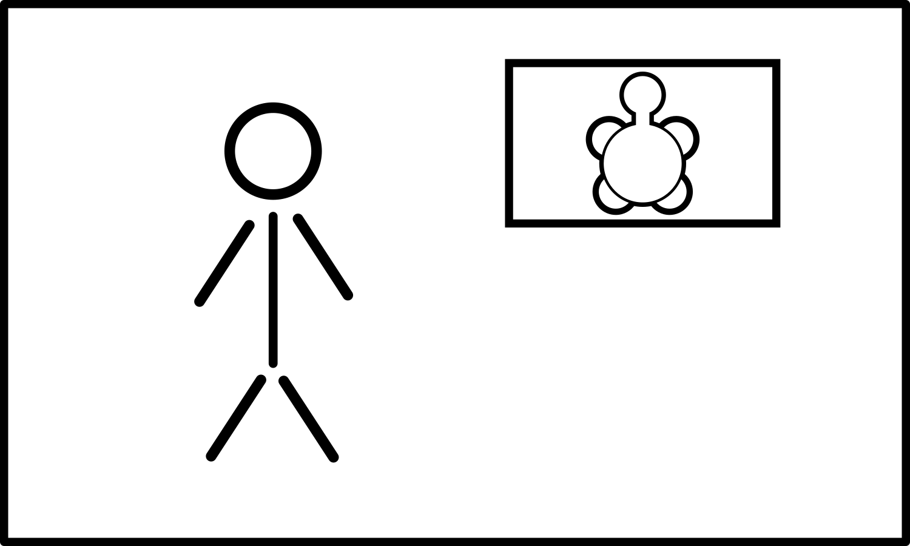
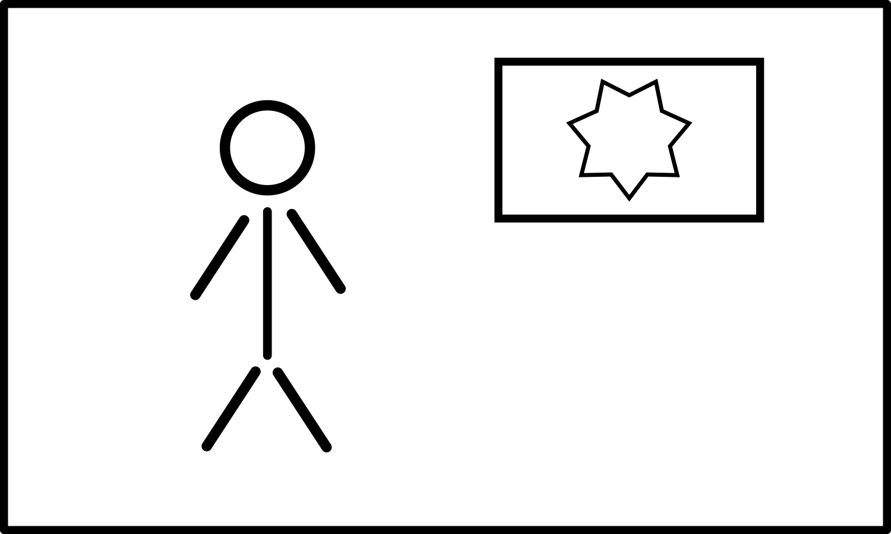
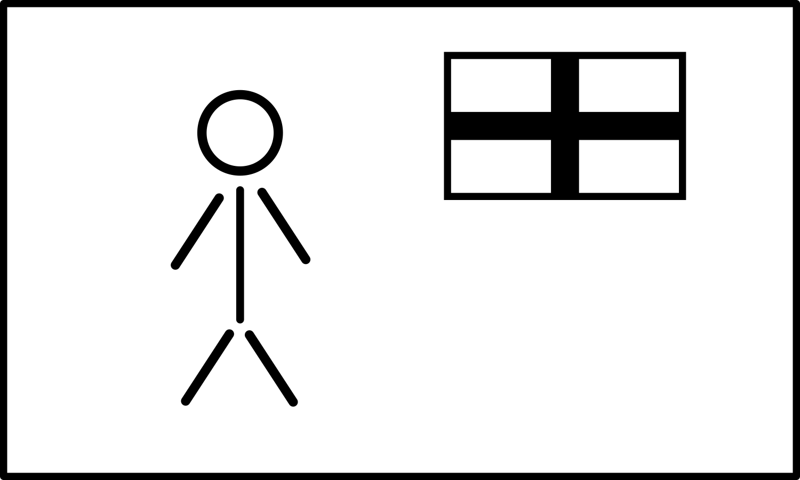
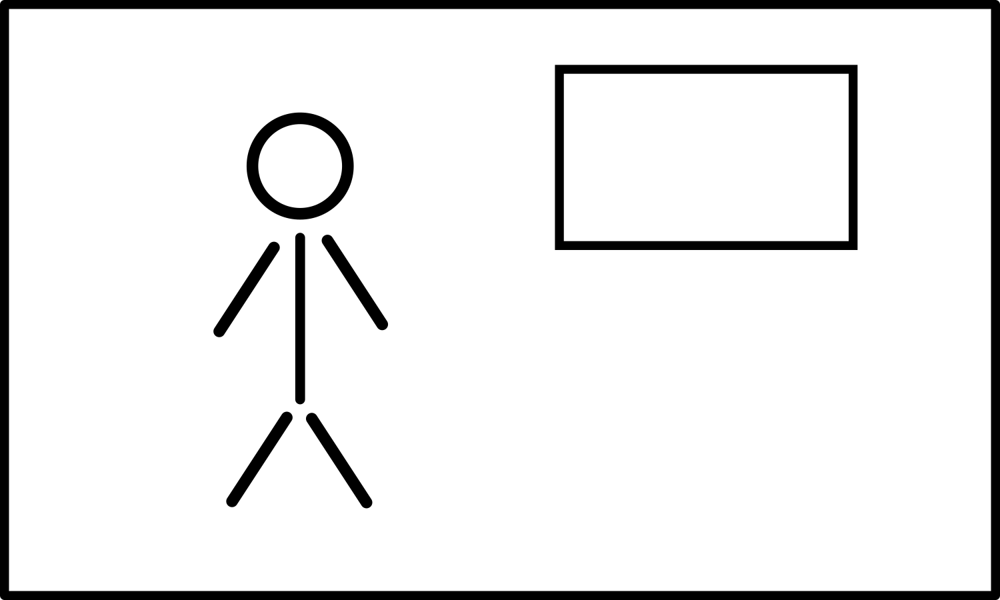
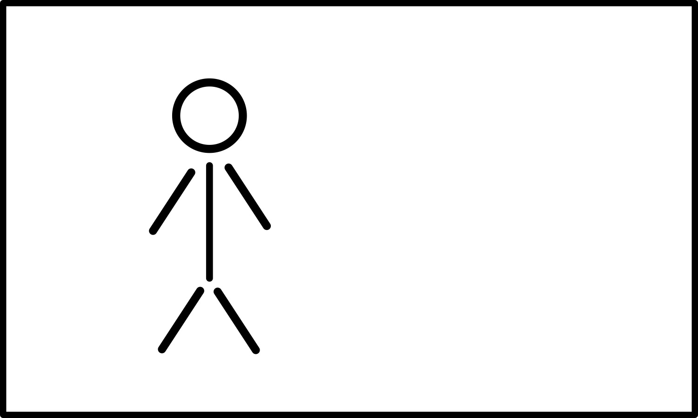

+++
draft = false
date = 2020-03-26T16:10:52Z
title = "ᏔᎳᏚᏏᏁᎢ ᎠᏕᎶᏆᏍᏗ"
weight = 1585239050

[taxonomies]
authors = ["Michael Conrad"]
categories = ["Lessons", "Grammar"]
tags = []

[extra]
zulma_title="Cherokee Language Lessons 1"
featured_image = "lessons/Cherokee-Language-Lessons-Volume-1/Cherokee-Language-Lessons-Volume-1.png"

+++
Cherokee is a language of relationship. Most words and sentences
describe the relationship between things on a continuous basis. For
example, to talk about someone being a friend, requires that you
indicate with whom they are friends. While Cherokee has a word that can
be translated as “friendship”, there is no word that directly translates
to “a friend” without indicating with whom the friendship resides. It is
always “his friend”, “my friend”, “your friend”, “their friend”. A
person who is not in relationship to anyone, has no friends, therefore
can not be called “a friend”, no matter how friendly they may be.
<!-- more -->
Cherokee is also a language of description. Like many Native American
languages, Cherokee is polysynthetic, meaning that many special basic
word parts called morphemes may be linked together to form a new larger,
single word. This allows the easy creation of new and descriptive words
to reflect or express modern concepts. One example is “ᏗᏘᏲᎯᎯ
(di²tị²yo²³hị²hi)”, literally “he argues repeatedly and on purpose
with a purpose”, which is used to refer to attorneys. Another example is
“ᏗᏓᏂᏱᏍᎩ (di²da²ni²³yi⁴sgi)”, literally “the final catcher” or “he
catches them finally and conclusively”, which is used to refer to
policemen.

As you learn Cherokee, you will notice that the literal or exact meaning
of many words and phrases do not match up with their English
counterparts in the translations. This is because many times the intent
of what is being said is expressed very differently between the two
languages. Where possible, it is alway important to learn the literal
meaning of Cherokee words and phrases and to treat their English
translations as only approximations based on usage and not meaning. Do
not make the mistake of trying to string Cherokee words together like
they are English words, you will wind up speaking gibberish.

## ᎦᏬᏂᏍᎬᎢ ᎠᎦᏔᎲᎢ (Grammar)

☞ *Remember that it is through the exercises in the lesson material that
you will learn how to understand and speak Cherokee, not by memorizing
rules and word parts.*

To ask a question in Cherokee, you can either use one of a number of
special endings, such as “-Ꮷ” and “-Ꮎ”, or you can use a question word,
normally as the first word of the question.

☞ *All of the following words should only be used when asking a
question.*

  - ᎭᏢ  
    \[ha²dlv\] “Where?”

  - ᎯᎳ ᎢᎦ  
    \[hị²la⁴ i²³ga⁴\] “How many?” *“How many inanimate things?”*

  - ᎯᎳ ᎢᏯᏂ  
    \[hị²la⁴ ị²yạ³ni\] “How many?” *“How many animate things?”*

  - ᎯᎳᏴᎢ  
    \[hị²la³²yv⁴ɂi\] “When?”

  - ᎦᎪ  
    \[ga³go²\] “Who?”

  - ᎦᎩ  
    \[ga³²gi³\] “Who again?”

  - ᎦᏙ  
    \[gạ²do¹\] “What?” ☞ *For when the question is about some doing or
    happening.*

  - ᎦᏙ ᎤᏍᏗ  
    \[gạ²do² u²sdi\] “What?” *“What thing?”*

  - ᎦᏙ ᎤᏍᏗ  
    \[gạ²do² u⁴sdi\] “Which one?”
    
      - ᎦᏙ ᎤᎾᏍᏗ  
        \[gạ²do² un⁴sdi\] “Which ones?” *“Which animate things?”*
    
      - ᎦᏙ ᏧᏍᏗ  
        \[gạ²do² ju⁴sdi\] “Which ones?” *“Which inanimate things?”*

  - ᎦᏙᎲ  
    \[gạ²do¹hv⁴\] “Why?” ☞ *This is “ᎦᏙ” with the “-Ꮂ” ending added.
    “But for what?”*

## ᏘᎪᎵᏯ (Read them)

  - ᏓᏆᏙᎠ  
    \[da¹gwạ²do³a\] “… is what I am called.”

  - ᏙᎩᎾᏙᎠ  
    \[do¹gi²nạ²do³a\] “… is what we two are called.”

  - ᏙᎦᏙᎠ  
    \[do¹gạ²do³a\] “… is what we all are called.”

  - ᏕᏣᏙᎠ?  
    \[de²³jạ³do³ɂa\] “… is what you are called.”

  - ᏕᏍᏓᏙᎠ?  
    \[de²³sdạ³do³ɂa\] “… is what you two are called.”

  - ᏕᏣᏙᎠ?  
    \[de¹jạ³do³ɂa\] “… is what you all are called.”

  - ᏚᏙᎠ  
    \[du¹do³ɂa\] “… is what he is called.”

  - ᏚᎾᏙᎠ  
    \[du¹nạ²do³ɂa\] “… is what they are called.”

  - ᎢᎮᏙᎸᎢ  
    \[ị³he²³do³²lv²ɂi\] “You come around again.”

  - ᎢᏍᏕᏙᎸᎢ  
    \[ị³sde²³do³²lv²ɂi\] “You two come around again.”

  - ᎢᎢᏤᏙᎸᎢ  
    \[ị³ɂi¹je²³do³²lv²ɂi\] “You all come around again.”

  - ᎣᏍᏓ  
    \[o⁴sda\] “Good. Well.”
    
      - ᎠᏃᏍᏓ  
        \[a¹no⁴sda\] “Good (them).”

  - ᎤᏲᎢ  
    \[u²yo⁴ɂi\] “Bad.”
    
      - ᎤᏂᏲᎢ  
        \[u²nị²yo⁴ɂi\] “Bad (them).”

  - ᎩᎵᏏ  
    \[gị²li²si\] “English.”

  - ᏴᏫ  
    \[yv²wi\] “A person. People.”

  - ᎠᎩᎵᏏ  
    \[ạ²gị²li²si\] “An English person.”
    
      - ᎠᏂᎩᎵᏏ  
        \[ạ²ni²gị²li²si\] “English people.”

  - ᎠᏣᎳᎩ  
    \[ạ²jạ²lạ²gi\] “A Cherokee person.”
    
      - ᎠᏂᏣᎳᎩ  
        \[ạ²ni²jạ²lạ²gi\] “Cherokee people.”

  - ᎠᏲᏁᎦ  
    \[ạ²yo³ne²ga\] “An English person.”
    
      - ᎠᏂᏲᏁᎦ  
        \[ạ²ni²yo³ne²ga\] “English people.”

  - ᎠᏴᏫ  
    \[ạ²yv²wi\] “A person.”
    
      - ᎠᏂᏴᏫ  
        \[ạ²ni²yv²wi\] “People.”

  - ᎠᏴᏫᏯᎢ  
    \[ạ²yv²wi²ya⁴ɂi\] “A Native American.”
    
      - ᎠᏂᏴᏫᏯᎢ  
        \[ạ²ni²yv²wi²ya⁴ɂi\] “Native Americans.”

☞ *Note the similarity of ᎠᏴᏫ to ᎠᏴ.*

☞ *ᎩᎵᏏ refers to the English language or people from England.*

☞ *The Ꭰ- prefix on the words ᎠᎩᎵᏏ, ᎠᏣᎳᎩ, ᎠᏲᏁᎦ, and ᎠᏴᏫ indicates him or
her.*

☞ *The ᎠᏂ- prefix on the words ᎠᏂᎩᎵᏏ, ᎠᏂᏣᎳᎩ, ᎠᏂᏲᏁᎦ, and ᎠᏂᏴᏫ indicates
them.*

☞ *The word ᎠᏲᏁᎦ literally means “a white person”. The English speakers
the Cherokee originally met were white.*

☞ *The word ᎠᏴᏫᏯᎢ literally means “a true person”, it is a combination
of the word ᎠᏴᏫ and the suffix -ᏯᎢ (“-ya⁴ɂi”). The suffix -ᏯᎢ adds the
meaning of “true and pure”. The word was originally used to only refer
to the Cherokee people but its use has been expanded to refer any
indigenous person of the Americas.*

  - ᎠᎵᏌᏇᏘ  
    \[a²li³sa²gwe²ti\] “Elizabeth”

  - ᎡᏂᏙᏂ  
    \[en³to²ni\] “Anthony.”

  - ᎵᏂᏓ  
    \[li³nị²da\] “Linda”

  - ᎹᎦᎵ  
    \[ma²ga³li\] “Michael”

  - ᎹᎦᏰᏘ  
    \[ma³gạ²ye²tị\] “Margaret”

  - ᎺᎵ  
    \[me³li\] “Mary”

  - ᏆᏆᎠ  
    \[gwa²gwạ²ɂa\] “Barbara.”

  - ᏑᏌᏃ  
    \[su³sạ²no\] “Susan”

  - ᏙᎹᏏ  
    \[to³mạ²si\] “Thomas”

  - ᏕᏫᏗ  
    \[de³wị²di\] “David”

  - ᏣᎵ  
    \[cha³li\] “Charles”

  - ᏣᏂ  
    \[ja³ni\] “John”

☞ *You will notice the Cherokee for several names is quite different
than their English forms. This is because Cherokee does not use the same
sounds as found in English. For more information on how English names
are written and spoken in Cherokee see the section about name
transliteration in the Appendix.*

## ᏂᏔᏛᎦ (Do them)

You will need the following props:

  - Index cards with the following name pairs written on them. The first
    name goes on the front and the second name goes on the back. You
    will need two copies of each.
    
      - ᎠᎵᏌᏇᏘ/ᎡᏂᏙᏂ, ᎵᏂᏓ/ᎹᎦᎵ, ᎹᎦᏰᏘ/ᏙᎹᏏ, ᎺᎵ/ᏕᏫᏗ, ᏆᏆᎠ/ᏣᎵ, ᏑᏌᏃ/ᏣᏂ.

  - Index cards for the following face and word combinations. Put the
    faces on the front of the cards with the Cherokee on the reverse.
    
      - ☺/ᎣᏍᏓ, ☺☺/ᎠᏃᏍᏓ, ☹/ᎤᏲᎢ, ☹☹/ᎤᏂᏲᎢ.

  - An index card with a drawing of a person with an English flag. Write
    ᎠᎩᎵᏏ on the reverse side. ☞ *Simply using two crossed lines in the
    flag would work well.*

  - An index card with a drawing of a person with a Cherokee flag. Write
    ᎠᏣᎳᎩ on the reverse side. ☞ *Simply using a seven pointed star in
    the flag would work well.*

  - An index card with a drawing of a person with a blank (white) flag.
    Write ᎠᏲᏁᎦ on the reverse side.

  - An index card with a drawing of a person with a turtle flag. Write
    ᎠᏴᏫᏯᎢ on the reverse side. ☞ *North America is referred to as
    “Turtle Island” in many Native American traditions, so a person
    combined with a turtle flag would represent a person of “Turtle
    Island”, or a Native American.*

  - Two index cards with a drawing of a person without any flag. Write
    ᎠᏴᏫ on the reverse side.

  - Index cards for each of the following animals:
    
      - ᎠᏫ, ᎩᏟ, ᏙᏯ, ᏥᏍᏚ, ᏌᎶᎵ, ᏐᏈᎵ, ᏩᎭᏯ, ᏪᏌ, ᏲᎾ.
    
      - ☞ *Pictures on front. Cherokee on the reverse side.*

  - Index cards for each of the following items:
    
      - ᎫᎴ, ᏄᎾ, ᏅᏯ, ᏌᏛᏗ, ᏡᎬᎢ, ᏚᏯ.
    
      - ☞ *Pictures on front. Cherokee on the reverse side.*

Example index card fronts:

 
 

☞ *During the exercises you must pretend that these are living animals
and people.*

Divide up into groups of four to seven. If you don’t have enough people,
use props for imaginary people and act the imaginary people out.

### Groups of two or more

If needed, use pillows or other props to add enough imaginary study
partners to create a group of six.

For each group the first person is designated “Ꭰ”. Additional people
will be assigned to “Ꭰ” or “Ꭱ” as needed for each challenge. People
should be assigned to the “Ꭰ” group from the right. People should be
assigned to the “Ꭱ” group from the left. The remaining people are
grouped together and are designated “Ꭲ”. After each set rotate positions
right so that there is a new “Ꭰ” person.

☞ *Keep rotating until everyone has been in both positions of “Ꭰ” and
“Ꭱ”, starting over with the first set of challenges as needed.*

☞ *Any imaginary study partners should be included in the rotations.*

☞ *The “Ꭰ” responses should be read from the book. The “Ꭱ” responses
should be done without reading the book.*

Each challenge-response should be done as in the following examples:

1.  \[Ꭰ\] ᎠᏫ.  
    “Ꭰ” puts a deer picture card in front of “Ꭱ”.
    
    1.  \[Ꭰ→Ꭱ\] ᎦᏙ ᏚᏙᎠ?  
        “Ꭰ” asks “Ꭱ”: What is it called?
    
    2.  \[Ꭱ\] ᎠᏫ ᏚᏙᎠ.  
        “Ꭱ” responds: It is called a deer.

2.  \[Ꭰ\] ᎠᏲᏁᎦ.  
    “Ꭰ” puts a white flag person card in front of “Ꭱ”.
    
    1.  \[Ꭰ→Ꭱ\] ᎦᏙ ᎤᏍᏗ ᎯᎪᏩᏘᎭ?  
        “Ꭰ” asks “Ꭱ’: Which one are you are seeing?
    
    2.  \[Ꭱ\] ᎠᏲᏁᎦ ᏥᎪᏩᏘᎭ.  
        “Ꭱ” responds: I am seeing an English person.

3.  \[Ꭰ\] ☺☺ ᏅᎩ ᎠᏂᎩᎵᏏ.  
    “Ꭰ” places the ☺☺ card, and four English flag person cards in front
    of “Ꭱ”.
    
    1.  \[Ꭰ→Ꭱ\] ᎦᏙ ᎤᎾᏍᏗ ᎦᎯᎪᏩᏘᎭ?  
        “Ꭰ” asks “Ꭱ’: Which ones are you are seeing?
    
    2.  \[Ꭱ\] ᏅᎩ ᎠᏃᏍᏓ ᎠᏂᎩᎵᏏ ᎦᏥᎪᏩᏘᎭ.  
        “Ꭱ” responds: I am seeing four good English people.

4.  \[Ꭰ\] ᏌᏊ↺ ᎠᎴ ᏌᏊ→. (ᎵᏂᏓ/ᎹᎦᎵ↺, ᎺᎵ/ᏕᏫᏗ→)  
    There is only one “Ꭰ” and only one “Ꭱ”.  
    “Ꭰ” indicates the person to their immediate left is to be the “Ꭱ”.  
    “Ꭰ” gives the “Ꭱ” a “ᎺᎵ/ᏕᏫᏗ” card and holds a “ᎵᏂᏓ/ᎹᎦᎵ” card.  
    Each person selects a name to be called and shows that name.
    
    1.  \[Ꭰ→Ꭱ\] ᏏᏲ, ᏙᎯᏧ?  
        “Ꭰ” says to “Ꭱ”: Hello, things are well, right?
    
    2.  \[Ꭱ\] ᏏᏲ ᏙᎯᏊ. \_\_\_\_\_ ᏓᏆᏙᎠ. ᎦᏙ ᏕᏣᏙᎠ?  
        “Ꭱ” responds: Hello things are just fine. I’m called David. What
        are you called?
    
    3.  \[Ꭰ\] \_\_\_\_\_ ᏓᏆᏙᎠ. ᏙᎾᏓᎪᎲ²Ꭲ.  
        “Ꭰ” responds: I’m called Mike. Let’s see each other again.
    
    4.  \[Ꭱ\] ᎥᎮᏙᎸ²Ꭲ.  
        “Ꭱ” responds: Come around again.

5.  \[Ꭰ\] ᎠᏂᏔᎵ↺ ᎠᎴ ᏌᏊ→. (ᎵᏂᏓ/ᎹᎦᎵ, ᎺᎵ/ᏕᏫᏗ↺, ᏑᏌᏃ/ᏣᏂ→)  
    There are two “Ꭰ” and only one “Ꭱ”.  
    “Ꭰ” indicates the person to their immediate right is to be part of
    the “Ꭰ” group.  
    “Ꭰ” indicates the person to their immediate left is to be the “Ꭱ”.  
    “Ꭰ” gives the “Ꭱ” a “ᏑᏌᏃ/ᏣᏂ” card, gives the person to their right a
    “ᎺᎵ/ᏕᏫᏗ” card and holds a “ᎵᏂᏓ/ᎹᎦᎵ” card.  
    Each person selects a name to be called and shows that name.
    
    1.  \[Ꭰ→Ꭱ\] ᎣᏏᏲ, ᏙᎯᏧ?  
        “Ꭰ” says to “Ꭱ”: Hello, things are well, right?
    
    2.  \[Ꭱ\] ᏏᏲ ᏙᎯᏊ. *ᏑᏌᏃ* ᏓᏆᏙᎠ. ᎦᏙ ᏕᏍᏓᏙᎠ?  
        “Ꭱ” responds: Hello things are just fine. I’m called Susan. What
        are you two called?
    
    3.  \[Ꭰ\] *ᎹᎦᎵ* ᎠᎴ *ᎺᎵ* ᏙᎩᎾᏙᎠ. ᏙᏓᏓᎪᎲ²Ꭲ.  
        “Ꭰ” responds: We are called (pointing at self) Mike and
        (pointing at the other “Ꭰ”) Mary. Let’s see each other again.
    
    4.  \[Ꭱ\] ᎥᏍᏕᏙᎸ²Ꭲ.  
        “Ꭱ” responds: You two come around again.

### Someone Alone

Using pillows or other props, add enough imaginary study partners to
create a group of four.

On index cards write out the “Ꭰ” challenges on each of the front sides
along with the correct “Ꭱ” responses on the reverse side for the each
set of challenges. Do this for each challenge as listed. There may be
challenges and responses repeated. Keep the cards in order and in
separate sets.

☞ *The “Ꭰ” responses should be read from the cards. The “Ꭱ” responses
should be done without reading the cards.*

#### For “Set 1”:

Place the stack of index cards, challenge side up, response side down.

Have the second imaginary study partner to your right be “Ꭰ”.

Generally follow the instructions as given for groups of two or more.
You will need to act out both the “Ꭰ” and “Ꭱ” parts.

Flip the card over and check your responses against the responses on the
response side of the index card.

#### For “Set 2”:

Have the first imaginary study partner to your right be “Ꭰ”.

#### For “Set 3”:

You are the “Ꭰ”.

#### For “Set 4”:

Have the first imaginary study partner to your left be “Ꭰ”.

#### For “Set 5”:

Have the second imaginary study partner to your left be “Ꭰ”.

### Sets

☞ *Repeat these until everyone can do the “Ꭱ” responses smoothly without
having to reference the material.*

☞ *Remember to speak the names selected by each person as shown on each
persons index cards.*

#### Set 1

1.  \[Ꭰ\] ᏲᎾ.
    
    1.  \[Ꭰ→Ꭱ\] ᎦᏙ ᏚᏙᎠ?
    
    2.  \[Ꭱ\] ᏲᎾ ᏚᏙᎠ.

2.  \[Ꭰ\] ᏚᏯ.
    
    1.  \[Ꭰ→Ꭱ\] ᎦᏙ ᏚᏙᎠ?
    
    2.  \[Ꭱ\] ᏚᏯ ᏚᏙᎠ.

3.  \[Ꭰ\] ᎩᏟ.
    
    1.  \[Ꭰ→Ꭱ\] ᎦᏙ ᏚᏙᎠ?
    
    2.  \[Ꭱ\] ᎩᏟ ᏚᏙᎠ.

4.  \[Ꭰ\] ᏡᎬᎢ.
    
    1.  \[Ꭰ→Ꭱ\] ᎦᏙ ᏚᏙᎠ?
    
    2.  \[Ꭱ\] ᏡᎬᎢ ᏚᏙᎠ.

5.  \[Ꭰ\] ᎠᏣᎳᎩ.
    
    1.  \[Ꭰ→Ꭱ\] ᎦᏙ ᎤᏍᏗ ᎯᎪᏩᏘᎭ?
    
    2.  \[Ꭱ\] ᎠᏣᎳᎩ ᏥᎪᏩᏘᎭ.

6.  \[Ꭰ\] ᎠᏂᏦᎢ ᎠᏫ.
    
    1.  \[Ꭰ→Ꭱ\] ᎦᏙ ᏚᎾᏙᎠ?
    
    2.  \[Ꭱ\] ᎠᏫ ᏚᎾᏙᎠ.

7.  \[Ꭰ\] ᎠᎩᎵᏏ.
    
    1.  \[Ꭰ→Ꭱ\] ᎦᏙ ᎤᏍᏗ ᎯᎪᏩᏘᎭ?
    
    2.  \[Ꭱ\] ᎠᎩᎵᏏ ᏥᎪᏩᏘᎭ.

#### Set 2

1.  \[Ꭰ\] ᏅᎩ ᎩᏟ.
    
    1.  \[Ꭰ→Ꭱ\] ᎦᏙ ᏚᎾᏙᎠ?
    
    2.  \[Ꭱ\] ᎩᏟ ᏚᎾᏙᎠ.

2.  \[Ꭰ\] ᎠᏂᏔᎵ ᎠᏂᏲᏁᎦ.
    
    1.  \[Ꭰ→Ꭱ\] ᎦᏙ ᎤᎾᏍᏗ ᎦᎯᎪᏩᏘᎭ?
    
    2.  \[Ꭱ\] ᎠᏂᏔᎵ ᎠᏂᏲᏁᎦ ᎦᏥᎪᏩᏘᎭ.

3.  \[Ꭰ\] ᏔᎵ ᏄᎾ.
    
    1.  \[Ꭰ→Ꭱ\] ᎦᏙ ᏚᎾᏙᎠ?
    
    2.  \[Ꭱ\] ᏄᎾ ᏚᎾᏙᎠ.

4.  \[Ꭰ\] ᎠᏫ.
    
    1.  \[Ꭰ→Ꭱ\] ᎦᏙ ᏚᏙᎠ?
    
    2.  \[Ꭱ\] ᎠᏫ ᏚᏙᎠ.

5.  \[Ꭰ\] ᎫᎴ.
    
    1.  \[Ꭰ→Ꭱ\] ᎦᏙ ᏚᏙᎠ?
    
    2.  \[Ꭱ\] ᎫᎴ ᏚᏙᎠ.

6.  \[Ꭰ\] ᏅᎩ ᏚᏯ.
    
    1.  \[Ꭰ→Ꭱ\] ᎦᏙ ᏚᎾᏙᎠ?
    
    2.  \[Ꭱ\] ᏚᏯ ᏚᎾᏙᎠ.

7.  \[Ꭰ\] ᎠᏴᏫ.
    
    1.  \[Ꭰ→Ꭱ\] ᎦᏙ ᎤᏍᏗ ᎯᎪᏩᏘᎭ?
    
    2.  \[Ꭱ\] ᎠᏴᏫ ᏥᎪᏩᏘᎭ.

#### Set 3

1.  \[Ꭰ\] ᎠᏂᏦᎢ ᏙᏯ.
    
    1.  \[Ꭰ→Ꭱ\] ᎦᏙ ᏚᎾᏙᎠ?
    
    2.  \[Ꭱ\] ᏙᏯ ᏚᎾᏙᎠ.

2.  \[Ꭰ\] ☹ ᎠᏴᏫᏯᎢ.
    
    1.  \[Ꭰ→Ꭱ\] ᎦᏙ ᎤᏍᏗ ᎯᎪᏩᏘᎭ?
    
    2.  \[Ꭱ\] ᎤᏲᎢ ᎠᏴᏫᏯᎢ ᏥᎪᏩᏘᎭ.

3.  \[Ꭰ\] ᏅᎩ ᎠᏂᏣᎳᎩ.
    
    1.  \[Ꭰ→Ꭱ\] ᎦᏙ ᎤᎾᏍᏗ ᎦᎯᎪᏩᏘᎭ?
    
    2.  \[Ꭱ\] ᏅᎩ ᎠᏂᏣᎳᎩ ᎦᏥᎪᏩᏘᎭ.

4.  \[Ꭰ\] ☺ ᎠᏲᏁᎦ.
    
    1.  \[Ꭰ→Ꭱ\] ᎦᏙ ᎤᏍᏗ ᎯᎪᏩᏘᎭ?
    
    2.  \[Ꭱ\] ᎣᏍᏓ ᎠᏲᏁᎦ ᏥᎪᏩᏘᎭ.

5.  \[Ꭰ\] ᏦᎢ ᏕᏡᎬᎢ.
    
    1.  \[Ꭰ→Ꭱ\] ᎦᏙ ᏚᎾᏙᎠ?
    
    2.  \[Ꭱ\] ᏕᏡᎬᎢ ᏚᎾᏙᎠ.

6.  \[Ꭰ\] ☹☹ ᎠᏂᏔᎵ ᎠᏂᏴᏫ.
    
    1.  \[Ꭰ→Ꭱ\] ᎦᏙ ᎤᎾᏍᏗ ᎦᎯᎪᏩᏘᎭ?
    
    2.  \[Ꭱ\] ᎠᏂᏔᎵ ᎤᏂᏲᎢ ᎠᏂᏴᏫ ᎦᏥᎪᏩᏘᎭ.

7.  \[Ꭰ\] ☺ ᎠᎩᎵᏏ.
    
    1.  \[Ꭰ→Ꭱ\] ᎦᏙ ᎤᏍᏗ ᎯᎪᏩᏘᎭ?
    
    2.  \[Ꭱ\] ᎣᏍᏓ ᎠᎩᎵᏏ ᏥᎪᏩᏘᎭ.

#### Set 4

1.  \[Ꭰ\] ᏌᏊ↺ ᎠᎴ ᏌᏊ→. (ᎹᎦᏰᏘ/ᏙᎹᏏ↺, ᎺᎵ/ᏕᏫᏗ→)
    
    1.  \[Ꭰ→Ꭱ\] ᏏᏲ, ᏙᎯᏧ?
    
    2.  \[Ꭱ\] ᏏᏲ ᏙᎯᏊ. \_\_\_\_\_ ᏓᏆᏙᎠ. ᎦᏙ ᏕᏣᏙᎠ?
    
    3.  \[Ꭰ\] \_\_\_\_\_ ᏓᏆᏙᎠ. ᏙᎾᏓᎪᎲ²Ꭲ.
    
    4.  \[Ꭱ\] ᎢᎮᏙᎸ²Ꭲ.

2.  \[Ꭰ\] ☺☺ ᎠᏂᏦᎢ ᎠᏂᏴᏫᏯᎢ.
    
    1.  \[Ꭰ→Ꭱ\] ᎦᏙ ᎤᎾᏍᏗ ᎦᎯᎪᏩᏘᎭ?
    
    2.  \[Ꭱ\] ᎠᏂᏦᎢ ᎠᏃᏍᏓ ᎠᏂᏴᏫᏯᎢ ᎦᏥᎪᏩᏘᎭ.

3.  \[Ꭰ\] ᏌᏊ↺ ᎠᎴ ᏌᏊ→. (ᎠᎵᏌᏇᏘ/ᎡᏂᏙᏂ↺, ᏆᏆᎠ/ᏣᎵ→)
    
    1.  \[Ꭰ→Ꭱ\] ᎣᏏᏲ, ᏙᎯᏧ?
    
    2.  \[Ꭱ\] ᎣᏏᏲ ᏙᎯᏊ. \_\_\_\_\_ ᏓᏆᏙᎠ. ᎦᏙ ᏕᏣᏙᎠ?
    
    3.  \[Ꭰ\] \_\_\_\_\_ ᏓᏆᏙᎠ. ᏙᎾᏓᎪᎲ²Ꭲ.
    
    4.  \[Ꭱ\] ᎢᎮᏙᎸ²Ꭲ.

4.  \[Ꭰ\] ᎠᏂᏔᎵ↺ ᎠᎴ ᏌᏊ→. (ᎠᎵᏌᏇᏘ/ᎡᏂᏙᏂ, ᎺᎵ/ᏕᏫᏗ↺, ᏑᏌᏃ/ᏣᏂ→)
    
    1.  \[Ꭰ→Ꭱ\] ᏏᏲ, ᏙᎯᏧ?
    
    2.  \[Ꭱ\] ᏏᏲ ᏙᎯᏊ. \_\_\_\_\_ ᏓᏆᏙᎠ. ᎦᏙ ᏕᏍᏓᏙᎠ?
    
    3.  \[Ꭰ\] \_\_\_\_\_ ᎠᎴ \_\_\_\_\_ ᏙᎩᎾᏙᎠ. ᏙᏓᏓᎪᎲ²Ꭲ.
    
    4.  \[Ꭱ\] ᎢᏍᏕᏙᎸ²Ꭲ.

5.  \[Ꭰ\] ᏌᏊ↺ ᎠᎴ ᏌᏊ→. (ᎵᏂᏓ/ᎹᎦᎵ↺, ᏑᏌᏃ/ᏣᏂ→)
    
    1.  \[Ꭰ→Ꭱ\] ᎣᏏᏲ, ᏙᎯᏧ?
    
    2.  \[Ꭱ\] ᎣᏏᏲ ᏙᎯᏊ. \_\_\_\_\_ ᏓᏆᏙᎠ. ᎦᏙ ᏕᏣᏙᎠ?
    
    3.  \[Ꭰ\] \_\_\_\_\_ ᏓᏆᏙᎠ. ᏙᎾᏓᎪᎲ²Ꭲ.
    
    4.  \[Ꭱ\] ᎢᎮᏙᎸ²Ꭲ.

6.  \[Ꭰ\] ᎠᏂᏔᎵ↺ ᎠᎴ ᏌᏊ→. (ᎵᏂᏓ/ᎹᎦᎵ, ᎹᎦᏰᏘ/ᏙᎹᏏ↺, ᏆᏆᎠ/ᏣᎵ→)
    
    1.  \[Ꭰ→Ꭱ\] ᎣᏏᏲ, ᏙᎯᏧ?
    
    2.  \[Ꭱ\] ᎣᏏᏲ ᏙᎯᏊ. \_\_\_\_\_ ᏓᏆᏙᎠ. ᎦᏙ ᏕᏍᏓᏙᎠ?
    
    3.  \[Ꭰ\] \_\_\_\_\_ ᎠᎴ \_\_\_\_\_ ᏙᎩᎾᏙᎠ. ᏙᏓᏓᎪᎲ²Ꭲ.
    
    4.  \[Ꭱ\] ᎢᏍᏕᏙᎸ²Ꭲ.

7.  \[Ꭰ\] ᎠᏂᏦᎢ↺ ᎠᎴ ᏌᏊ→. (ᎵᏂᏓ/ᎹᎦᎵ, ᎺᎵ/ᏕᏫᏗ, ᏑᏌᏃ/ᏣᏂ↺, ᏆᏆᎠ/ᏣᎵ→)
    
    1.  \[Ꭰ→Ꭱ\] ᏏᏲ, ᏙᎯᏧ?
    
    2.  \[Ꭱ\] ᏏᏲ ᏙᎯᏊ. \_\_\_\_\_ ᏓᏆᏙᎠ. ᎦᏙ Ꮥ¹ᏣᏙᎠ?
    
    3.  \[Ꭰ\] \_\_\_\_\_, \_\_\_\_\_, ᎠᎴ \_\_\_\_\_ ᏙᎦᏙᎠ. ᏙᏓᏓᎪᎲ²Ꭲ.
    
    4.  \[Ꭱ\] ᎢᎢᏤᏙᎸ²Ꭲ.

#### Set 5

1.  \[Ꭰ\] ᏐᏈᎵ.
    
    1.  \[Ꭰ→Ꭱ\] ᎦᏙ ᏚᏙᎠ?
    
    2.  \[Ꭱ\] ᏐᏈᎵ ᏚᏙᎠ.

2.  \[Ꭰ\] ᏅᏯ.
    
    1.  \[Ꭰ→Ꭱ\] ᎦᏙ ᏚᏙᎠ?
    
    2.  \[Ꭱ\] ᏅᏯ ᏚᏙᎠ.

3.  \[Ꭰ\] ᎠᏴᏫᏯᎢ.
    
    1.  \[Ꭰ→Ꭱ\] ᎦᏙ ᎤᏍᏗ ᎯᎪᏩᏘᎭ?
    
    2.  \[Ꭱ\] ᎠᏴᏫᏯᎢ ᏥᎪᏩᏘᎭ.

4.  \[Ꭰ\] ᎠᏂᏔᎵ ᏌᎶᎵ.
    
    1.  \[Ꭰ→Ꭱ\] ᎦᏙ ᏚᎾᏙᎠ?
    
    2.  \[Ꭱ\] ᏌᎶᎵ ᏚᎾᏙᎠ.

5.  \[Ꭰ\] ᏅᎩ ᎠᏂᎩᎵᏏ.
    
    1.  \[Ꭰ→Ꭱ\] ᎦᏙ ᎤᎾᏍᏗ ᎦᎯᎪᏩᏘᎭ?
    
    2.  \[Ꭱ\] ᏅᎩ ᎠᏂᎩᎵᏏ ᎦᏥᎪᏩᏘᎭ.

6.  \[Ꭰ\] ᏅᎩ ᎫᎴ.
    
    1.  \[Ꭰ→Ꭱ\] ᎦᏙ ᏚᎾᏙᎠ?
    
    2.  \[Ꭱ\] ᎫᎴ ᏚᎾᏙᎠ.

7.  \[Ꭰ\] ᎠᏂᏦᎢ↺ ᎠᎴ ᏌᏊ→. (ᎠᎵᏌᏇᏘ/ᎡᏂᏙᏂ, ᎹᎦᏰᏘ/ᏙᎹᏏ, ᏆᏆᎠ/ᏣᎵ↺, ᎠᎵᏌᏇᏘ/ᎡᏂᏙᏂ→)
    
    1.  \[Ꭰ→Ꭱ\] ᎣᏏᏲ, ᏙᎯᏧ?
    
    2.  \[Ꭱ\] ᎣᏏᏲ ᏙᎯᏊ. \_\_\_\_\_ ᏓᏆᏙᎠ. ᎦᏙ Ꮥ¹ᏣᏙᎠ?
    
    3.  \[Ꭰ\] \_\_\_\_\_, \_\_\_\_\_, ᎠᎴ \_\_\_\_\_ ᏙᎦᏙᎠ. ᏙᏓᏓᎪᎲ²Ꭲ.
    
    4.  \[Ꭱ\] ᎢᎢᏤᏙᎸ²Ꭲ.

#### Set 6

1.  \[Ꭰ\] ☹ ᎠᏴᏫ.
    
    1.  \[Ꭰ→Ꭱ\] ᎦᏙ ᎤᏍᏗ ᎯᎪᏩᏘᎭ?
    
    2.  \[Ꭱ\] ᎤᏲᎢ ᎠᏴᏫ ᏥᎪᏩᏘᎭ.

2.  \[Ꭰ\] ☺☺ ᏅᎩ ᎠᏂᏴᏫᏯᎢ.
    
    1.  \[Ꭰ→Ꭱ\] ᎦᏙ ᎤᎾᏍᏗ ᎦᎯᎪᏩᏘᎭ?
    
    2.  \[Ꭱ\] ᏅᎩ ᎠᏃᏍᏓ ᎠᏂᏴᏫᏯᎢ ᎦᏥᎪᏩᏘᎭ.

3.  \[Ꭰ\] ᎠᏂᏦᎢ↺ ᎠᎴ ᏌᏊ→. (ᎵᏂᏓ/ᎹᎦᎵ, ᎺᎵ/ᏕᏫᏗ, ᏆᏆᎠ/ᏣᎵ↺, ᎹᎦᏰᏘ/ᏙᎹᏏ→)
    
    1.  \[Ꭰ→Ꭱ\] ᏏᏲ, ᏙᎯᏧ?
    
    2.  \[Ꭱ\] ᏏᏲ ᏙᎯᏊ. \_\_\_\_\_ ᏓᏆᏙᎠ. ᎦᏙ Ꮥ¹ᏣᏙᎠ?
    
    3.  \[Ꭰ\] \_\_\_\_\_, \_\_\_\_\_, ᎠᎴ \_\_\_\_\_ ᏙᎦᏙᎠ. ᏙᏓᏓᎪᎲ²Ꭲ.
    
    4.  \[Ꭱ\] ᎢᎢᏤᏙᎸ²Ꭲ.

4.  \[Ꭰ\] ᏌᏊ↺ ᎠᎴ ᏌᏊ→. (ᎠᎵᏌᏇᏘ/ᎡᏂᏙᏂ↺, ᎺᎵ/ᏕᏫᏗ→)
    
    1.  \[Ꭰ→Ꭱ\] ᏏᏲ, ᏙᎯᏧ?
    
    2.  \[Ꭱ\] ᏏᏲ ᏙᎯᏊ. \_\_\_\_\_ ᏓᏆᏙᎠ. ᎦᏙ ᏕᏣᏙᎠ?
    
    3.  \[Ꭰ\] \_\_\_\_\_ ᏓᏆᏙᎠ. ᏙᎾᏓᎪᎲ²Ꭲ.
    
    4.  \[Ꭱ\] ᎢᎮᏙᎸ²Ꭲ.

5.  \[Ꭰ\] ᎠᏂᏔᎵ↺ ᎠᎴ ᏌᏊ→. (ᎠᎵᏌᏇᏘ/ᎡᏂᏙᏂ, ᎹᎦᏰᏘ/ᏙᎹᏏ↺, ᏑᏌᏃ/ᏣᏂ→)
    
    1.  \[Ꭰ→Ꭱ\] ᎣᏏᏲ, ᏙᎯᏧ?
    
    2.  \[Ꭱ\] ᎣᏏᏲ ᏙᎯᏊ. \_\_\_\_\_ ᏓᏆᏙᎠ. ᎦᏙ ᏕᏍᏓᏙᎠ?
    
    3.  \[Ꭰ\] \_\_\_\_\_ ᎠᎴ \_\_\_\_\_ ᏙᎩᎾᏙᎠ. ᏙᏓᏓᎪᎲ²Ꭲ.
    
    4.  \[Ꭱ\] ᎢᏍᏕᏙᎸ²Ꭲ.

6.  \[Ꭰ\] ᎠᏂᏦᎢ↺ ᎠᎴ ᏌᏊ→. (ᎵᏂᏓ/ᎹᎦᎵ, ᎺᎵ/ᏕᏫᏗ, ᏆᏆᎠ/ᏣᎵ↺, ᏑᏌᏃ/ᏣᏂ→)
    
    1.  \[Ꭰ→Ꭱ\] ᎣᏏᏲ, ᏙᎯᏧ?
    
    2.  \[Ꭱ\] ᎣᏏᏲ ᏙᎯᏊ. \_\_\_\_\_ ᏓᏆᏙᎠ. ᎦᏙ Ꮥ¹ᏣᏙᎠ?
    
    3.  \[Ꭰ\] \_\_\_\_\_, \_\_\_\_\_, ᎠᎴ \_\_\_\_\_ ᏙᎦᏙᎠ. ᏙᏓᏓᎪᎲ²Ꭲ.
    
    4.  \[Ꭱ\] ᎢᎢᏤᏙᎸ²Ꭲ.

7.  \[Ꭰ\] ᎠᏂᏦᎢ ᎠᏂᏲᏁᎦ.
    
    1.  \[Ꭰ→Ꭱ\] ᎦᏙ ᎤᎾᏍᏗ ᎦᎯᎪᏩᏘᎭ?
    
    2.  \[Ꭱ\] ᎠᏂᏦᎢ ᎠᏂᏲᏁᎦ ᎦᏥᎪᏩᏘᎭ.