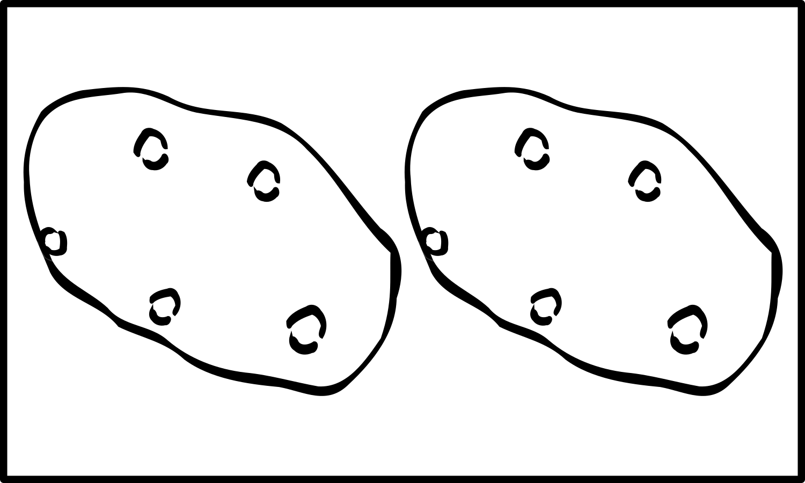

+++
draft = false
date = 2020-03-26T18:13:22Z
title = "ᏔᎵᏍᎪ ᏌᏊᎯᏁᎢ ᎠᏕᎶᏆᏍᏗ"
weight = 1585246400

[taxonomies]
authors = ["Michael Conrad"]
categories = ["Lessons", "Grammar"]
tags = []

[extra]
zulma_title="Cherokee Language Lessons 1"
featured_image = "lessons/Cherokee-Language-Lessons-Volume-1/Cherokee-Language-Lessons-Volume-1.png"

+++
## ᎦᏬᏂᏍᎬᎢ ᎠᎦᏔᎲᎢ (Grammar)

☞ *Remember that it is through the exercises in the lesson material that
you will learn how to understand and speak Cherokee, not by memorizing
rules and word parts.*

Cherokee word ordering works differently than English word ordering. In
simple sentences the subject of the sentence comes first, followed by
the object and its modifiers, and finally by the verb and its modifiers.
This results in what is called a “subject-object-verb” word order. This
can be seen in the following example:
<!-- more -->
  - “ᎡᏅᏙᏂ ᎠᏫ ᎠᎪᏩᏘᎭ.”
    
      - “Tony, a deer, he sees it.”
    
      - “Tony sees a deer.”

Placing the subject after the verb is also possible, yielding
“object-verb-subject”, as in the following example:

  - “ᎠᏫ ᎠᎪᏩᏘᎭ ᏆᏆᎠ.”
    
      - “A deer, she sees it, Barbara.”
    
      - “Barbara sees a deer.”

In addition, adjectives, such as colors, while normally placed before
nouns, will sometimes be used after them as in the following two
examples:

  - “ᎡᏅᏙᏂ ᎠᎩᎦᎨ ᎠᏫ ᎠᎪᏩᏘᎭ.”
    
      - “Anthony, a red deer, he sees it.”
    
      - “Anthony sees a red deer.”

  - “ᏆᏆᎠ ᎠᏫ ᎠᎩᎦᎨ ᎠᎪᏩᏘᎭ.”
    
      - “Barbara, a deer, a red one, she sees it.”
    
      - “Barbara sees a red deer.”

Because Cherokee is very flexible about word ordering many speakers will
sometimes rearrange sentences to emphasize something by saying that part
first.

☞ *As you work through the exercises Cherokee word ordering will become
second nature and not something you normally will need to think about.*

## ᏘᎪᎵᏯ (Read them)

This lesson introduces ᎤᏚᎵᎭ “He wants him, it.” The following shows ᎤᏚᎵᎭ
combined with the bound pronouns you have learned so far:

  - ᏥᏯᏚᎵᎭ  
    \[ji²ya²du²lị³ha\] “I want him.”

  - ᎠᏆᏚᎵᎭ  
    \[a¹gwạ²du²lị³ha\] “I want it.”

  - ᎦᏥᏯᏚᎵᎭ  
    \[ga²ji²ya²du²lị³ha\] “I want them-animate.”

  - ᏓᏆᏚᎵᎭ  
    \[da¹gwạ²du²lị³ha\] “I want them-inanimate.”

  - ᎠᏆᏚᎵᎭ  
    \[a¹gwạ²du²lị³ha\] “He wants me.”

  - ᎬᏆᏚᎵᎭ  
    \[gv¹gwạ²du²lị³ha\] “They want me.”

  - ᎤᏚᎵᎭ  
    \[u¹du²lị³ha\] “He wants him, it.”

  - ᏚᏚᎵᎭ  
    \[du¹du²lị³ha\] “He wants them.”

<!-- end list -->

  - ᎯᏯᏚᎵᎭ  
    \[hi²ya²du²lị³ha\] “You want him.”

  - ᏣᏚᎵᎭ  
    \[jạ²du²lị³ha\] “You want it.”

  - ᎦᎯᏯᏚᎵᎭ  
    \[ga²hi²ya²du²lị³ha\] “You want them-animate.”

  - ᏕᏣᏚᎵᎭ  
    \[de²jạ²du²lị³ha\] “You want them-inanimate.”

  - ᏣᏚᎵᎭ  
    \[jạ²du²lị³ha\] “He wants you.”

  - ᎨᏣᏚᎵᎭ  
    \[ge²jạ²du²lị³ha\] “They want you.”

  - ᎤᎾᏚᎵᎭ  
    \[u¹na²du²lị³ha\] “They want him, it.”

  - ᏚᎾᏚᎵᎭ  
    \[du¹na²du²lị³ha\] “They want them.”

Additional vocabulary used in the following exercises.

  - ᎠᏎᏃ, ᎠᏎᏅ  
    \[a²se³hno, a²se³hnv\] “But.”

  - ᎦᎪ  
    \[ga³go²\] “Who?”

  - ᎦᏍᎩᎶ  
    \[ga²sgị²lo\] “A table or a chair.”
    
      - ᏗᎦᏍᎩᎶ  
        \[dị²ga²sgị²lo\] “Tables. Chairs.”

## ᏂᏔᏛᎦ (Do them)

You will need to reuse the following white cards from the previous
chapter.

 

You will need to reuse the following people index cards:

 
 

You will need to add the following index cards:

Label each one on the reverse as follows: ᎦᏍᎩᎶ, ᎦᏍᎩᎶ, ᏗᎦᏍᎩᎶ, ᏗᎦᏍᎩᎶ,
ᏗᎦᏍᎩᎶ.

Divide up into groups of two to seven.

### Groups

For each group the first person is designated “Ꭰ”. The second person is
designated “Ꭱ”. Any remaining people are grouped together and are
designated “Ꭲ”. After each set, rotate positions so that “Ꭰ” becomes the
“Ꭱ”, the “Ꭱ” becomes one of the “Ꭲ” and one of the “Ꭲ” becomes the “Ꭰ”.

☞ *Keep rotating until everyone has been in position “Ꭰ”, starting over
with the first set of challenges as needed.*

☞ *The “Ꭰ” responses should be read from the book. The “Ꭱ” responses
should be done without reading the book. The “Ꭰ” person should help as
needed.*

Each challenge-response should be done as in the following examples:

1.  ᏲᎾ, ᎠᏂᏔᎵ ᏪᏌ, ᏌᏛᏗ, ᏔᎵ ᎫᎴ.  
    “Ꭰ” places a single bear card, a two cat card, a single trap card,
    and a two acorn card in front of “Ꭱ”.
    
    1.  \[Ꭰ\] ᎫᎴ ᏓᏆᏚᎵᎭ.  
        “Ꭰ” says: I want acorns.
    
    2.  \[Ꭱ\] ᎫᎴᏍ ᏕᏣᏚᎵᎭ?  
        “Ꭱ” confirms: You want acorns?
    
    3.  \[Ꭰ\] ᎥᎥ.  
        “Ꭰ” says: Yes.
    
    4.  \[Ꭱ\] ᎰᏩ, ᎫᎴ → \[Ꭰ\]  
        “Ꭱ” says: Alright. Hands “Ꭰ” the acorns card.
    
    5.  \[Ꭱ\] ᎫᎴ ᏕᏣᎭ.  
        “Ꭱ” says: You have acorns.

2.  ᎩᏟ, ᎠᏂᏔᎵ ᏲᎾ, ᎦᏍᎩᎶ(├┐), ᏔᎵ ᏗᏌᏛᏗ, → ᎠᏂᏣᎳᎩ.  
    “Ꭰ” places a single dog card, a two bear card, a single chair card,
    a two trap card, and a two Cherokee card in front of “Ꭱ”.
    
    1.  \[Ꭰ\] ᏲᎾ ᏚᎾᏚᎵᎭ.  
        “Ꭰ” points at the Cherokee card and says: They want bears.
    
    2.  \[Ꭱ\] ᏲᎾᏍ ᏚᎾᏚᎵᎭ?  
        “Ꭱ” confirms: They want bears?
    
    3.  \[Ꭰ\] ᎥᎥ.  
        “Ꭰ” says: Yes.
    
    4.  \[Ꭱ\] ᎰᏩ, ᏲᎾ → ᎠᏂᏣᎳᎩ  
        “Ꭱ” says: Alright. Places bears with Cherokee.
    
    5.  \[Ꭱ\] ᏲᎾ ᏚᏂᎧᎭ.  
        “Ꭱ” says: They have bears.

3.  ᏌᎶᎵ, ᎠᏂᏔᎵ ᎩᏟ, ᎦᏍᎩᎶ(┍┑), ᏔᎵ ᏗᎦᏍᎩᎶ(┍┑┍┑), → ᎠᎩᎵᏏ.  
    “Ꭰ” places a single squirrel card, a two dog card, a single table
    card, a two table card, and a two English card in front of “Ꭱ”.
    
    1.  \[Ꭰ\] ᏄᎾ ᎤᏚᎵᎭ.  
        “Ꭰ” points at the English card and says: He/she wants a potato.
    
    2.  \[Ꭱ\] ᎠᏎᏃ Ꮭ ᏄᎾ ᏯᎩᎭ.  
        “Ꭱ” says: But I don’t have a potato.

4.  ᏌᏊ ᏌᎶᎵ, ᎠᏂᏔᎵ ᎠᏫ.  
    “Ꭰ” places a single squirrel card and a two deer card in front of
    themselves.
    
    1.  \[Ꭰ\] ᎯᎠ ᏌᏊ ᏌᎶᎵ. ᎯᎠ ᎠᏂᏔᎵ ᎠᏫ.  
        “Ꭰ” points at the squirrel card and says: This is one
        squirrel.  
        “Ꭰ” points at the deer card and says: These are two deer.
    
    2.  \[Ꭰ\] ᎦᎪ ᏣᏚᎵᎭ?  
        “Ꭰ” says: Who wants you? (Who one wants you?).
    
    3.  \[Ꭱ\] Ꮎ ᏌᏊ ᏌᎶᎵ ᎠᏆᏚᎵᎭ.  
        “Ꭱ” says: That one squirrel wants me.

5.  ᏌᏊ ᎠᏴᏫ, ᎠᏂᏔᎵ ᎠᏂᏴᏫ.  
    “Ꭰ” places a single person card and a two people card in front of
    themselves.
    
    1.  \[Ꭰ\] ᎯᎠ ᏌᏊ ᎠᏴᏫ. ᎯᎠ ᎠᏂᏔᎵ ᎠᏂᏴᏫ.  
        “Ꭰ” points at the one person card and says: This is one
        person.  
        “Ꭰ” points at the two person card and says: These are two
        people.
    
    2.  \[Ꭰ\] ᎦᎪ ᎨᏣᏚᎵᎭ?  
        “Ꭰ” says: Who wants you? (Who they wants you?).
    
    3.  \[Ꭱ\] Ꮎ ᎠᏂᏔᎵ ᎠᏂᏴᏫ ᎬᏆᏚᎵᎭ.  
        “Ꭱ” says: Those two people want me.

### Someone Alone

Add one pretend study partner and follow the instructions for Groups.

☞ *Use an index card and hide the “Ꭱ” responses when reading the “Ꭰ”
challenges. Until you know the exercises steps, you will have to
periodcally check the “Ꭱ” responses before doing them while they are
covered.*

☞ *Remember to speak and act the responses out\!*

### Sets

☞ *Take a short break if needed after every two to three sets.*

#### Set 1

1.  ᎩᏟ, ᎠᏂᏔᎵ ᏥᏍᏚ, ᏚᏯ, ᏔᎵ ᏗᎦᏍᎩᎶ(├┐┍┑).
    
    1.  \[Ꭰ\] ᎠᏫ ᎦᏥᏯᏚᎵᎭ.
    
    2.  \[Ꭱ\] ᎠᏎᏃ Ꮭ ᎠᏫ ᏱᏓᎩᎧᎭ.

2.  ᎠᏴᏫ, ᎠᏂᏔᎵ ᎠᏂᏴᏫ, ᏅᏯ, ᏔᎵ ᏅᏯ, →ᎠᏂᏴᏫᏯᎢ.
    
    1.  \[Ꭰ\] ᎠᏂᏴᏫ ᏚᎾᏚᎵᎭ.
    
    2.  \[Ꭱ\] ᎠᏂᏴᏫᏍ ᏚᎾᏚᎵᎭ?
    
    3.  \[Ꭰ\] ᎥᎥ.
    
    4.  \[Ꭱ\] ᎰᏩ, ᎠᏂᏴᏫ →ᎠᏂᏴᏫᏯᎢ
    
    5.  \[Ꭱ\] ᎠᏂᏴᏫ ᏚᏂᎧᎭ.

3.  ᏌᏊ ᏲᎾ, ᎠᏂᏔᎵ ᎩᏟ.
    
    1.  \[Ꭰ\] ᎯᎠ ᏌᏊ ᏲᎾ. ᎯᎠ ᎠᏂᏔᎵ ᎩᏟ.
    
    2.  \[Ꭰ\] ᎦᎪ ᎨᏣᏚᎵᎭ?
    
    3.  \[Ꭱ\] Ꮎ ᎠᏂᏔᎵ ᎩᏟ ᎬᏆᏚᎵᎭ.

4.  ᏩᎭᏯ, ᎠᏂᏔᎵ ᏪᏌ, ᎦᏍᎩᎶ(├┐), ᏔᎵ ᏗᏌᏛᏗ.
    
    1.  \[Ꭰ\] ᏌᎶᎵ ᎦᏥᏯᏚᎵᎭ.
    
    2.  \[Ꭱ\] ᎠᏎᏃ Ꮭ ᏌᎶᎵ ᏱᏓᎩᎧᎭ.

5.  ᎩᏟ, ᎠᏂᏔᎵ ᏌᎶᎵ, ᏄᎾ, ᏔᎵ ᏄᎾ, →ᎠᏂᏣᎳᎩ.
    
    1.  \[Ꭰ\] ᏌᎶᎵ ᏚᎾᏚᎵᎭ.
    
    2.  \[Ꭱ\] ᏌᎶᎵᏍ ᏚᎾᏚᎵᎭ?
    
    3.  \[Ꭰ\] ᎥᎥ.
    
    4.  \[Ꭱ\] ᎰᏩ, ᏌᎶᎵ →ᎠᏂᏣᎳᎩ
    
    5.  \[Ꭱ\] ᏌᎶᎵ ᏚᏂᎧᎭ.

6.  ᏐᏈᎵ, ᎠᏂᏔᎵ ᎠᏫ, ᎦᏍᎩᎶ(┍┑), ᏔᎵ ᎫᎴ.
    
    1.  \[Ꭰ\] ᎦᏍᎩᎶ ᎠᏆᏚᎵᎭ.
    
    2.  \[Ꭱ\] ᎦᏍᎩᎶᏍ ᏣᏚᎵᎭ?
    
    3.  \[Ꭰ\] ᎥᎥ.
    
    4.  \[Ꭱ\] ᎰᏩ, ᎦᏍᎩᎶ →\[Ꭰ\]
    
    5.  \[Ꭱ\] ᎦᏍᎩᎶ ᏣᎭ.

7.  ᏌᏊ ᏥᏍᏚ, ᎠᏂᏔᎵ ᏥᏍᏚ.
    
    1.  \[Ꭰ\] ᎯᎠ ᏌᏊ ᏥᏍᏚ. ᎯᎠ ᎠᏂᏔᎵ ᏥᏍᏚ.
    
    2.  \[Ꭰ\] ᎦᎪ ᎨᏣᏚᎵᎭ?
    
    3.  \[Ꭱ\] Ꮎ ᎠᏂᏔᎵ ᏥᏍᏚ ᎬᏆᏚᎵᎭ.

8.  ᏪᏌ, ᎠᏂᏔᎵ ᏩᎭᏯ, ᏌᏛᏗ, ᏔᎵ ᏗᎦᏍᎩᎶ(├┐├┐), →ᎠᏂᎩᎵᏏ.
    
    1.  \[Ꭰ\] ᏩᎭᏯ ᏚᎾᏚᎵᎭ.
    
    2.  \[Ꭱ\] ᏩᎭᏯᏍ ᏚᎾᏚᎵᎭ?
    
    3.  \[Ꭰ\] ᎥᎥ.
    
    4.  \[Ꭱ\] ᎰᏩ, ᏩᎭᏯ →ᎠᏂᎩᎵᏏ
    
    5.  \[Ꭱ\] ᏩᎭᏯ ᏚᏂᎧᎭ.

#### Set 2

1.  ᏌᎶᎵ, ᎠᏂᏔᎵ ᏲᎾ, ᎫᎴ, ᏔᎵ ᏚᏯ.
    
    1.  \[Ꭰ\] ᎫᎴ ᎠᏆᏚᎵᎭ.
    
    2.  \[Ꭱ\] ᎫᎴᏍ ᏣᏚᎵᎭ?
    
    3.  \[Ꭰ\] ᎥᎥ.
    
    4.  \[Ꭱ\] ᎰᏩ, ᎫᎴ →\[Ꭰ\]
    
    5.  \[Ꭱ\] ᎫᎴ ᏣᎭ.

2.  ᏌᏊ ᎠᏫ, ᎠᏂᏔᎵ ᏪᏌ.
    
    1.  \[Ꭰ\] ᎯᎠ ᏌᏊ ᎠᏫ. ᎯᎠ ᎠᏂᏔᎵ ᏪᏌ.
    
    2.  \[Ꭰ\] ᎦᎪ ᎨᏣᏚᎵᎭ?
    
    3.  \[Ꭱ\] Ꮎ ᎠᏂᏔᎵ ᏪᏌ ᎬᏆᏚᎵᎭ.

3.  ᏩᎭᏯ, ᎠᏂᏔᎵ ᏐᏈᎵ, ᏌᏛᏗ, ᏔᎵ ᏗᏌᏛᏗ, →ᎠᏂᎩᎵᏏ.
    
    1.  \[Ꭰ\] ᏚᏯ ᎤᎾᏚᎵᎭ.
    
    2.  \[Ꭱ\] ᎠᏎᏃ Ꮭ ᏚᏯ ᏯᎩᎭ.

4.  ᎠᏴᏫ, ᎠᏂᏔᎵ ᏩᎭᏯ, ᏄᎾ, ᏔᎵ ᏗᎦᏍᎩᎶ(┍┑┍┑).
    
    1.  \[Ꭰ\] ᏄᎾ ᎠᏆᏚᎵᎭ.
    
    2.  \[Ꭱ\] ᏄᎾᏍ ᏣᏚᎵᎭ?
    
    3.  \[Ꭰ\] ᎥᎥ.
    
    4.  \[Ꭱ\] ᎰᏩ, ᏄᎾ →\[Ꭰ\]
    
    5.  \[Ꭱ\] ᏄᎾ ᏣᎭ.

5.  ᎠᏫ, ᎠᏂᏔᎵ ᎠᏂᏴᏫ, ᏅᏯ, ᏔᎵ ᏗᎦᏍᎩᎶ(┍┑┍┑), →ᎠᏂᏣᎳᎩ.
    
    1.  \[Ꭰ\] ᏄᎾ ᎤᎾᏚᎵᎭ.
    
    2.  \[Ꭱ\] ᎠᏎᏃ Ꮭ ᏄᎾ ᏯᎩᎭ.

6.  ᏲᎾ, ᎠᏂᏔᎵ ᏐᏈᎵ, ᎦᏍᎩᎶ(├┐), ᏔᎵ ᏅᏯ, →ᎠᏂᏴᏫᏯᎢ.
    
    1.  \[Ꭰ\] ᏄᎾ ᏚᎾᏚᎵᎭ.
    
    2.  \[Ꭱ\] ᎠᏎᏃ Ꮭ ᏄᎾ ᏱᏓᎩᎭ.

7.  ᏥᏍᏚ, ᎠᏂᏔᎵ ᏲᎾ, ᎦᏍᎩᎶ(┍┑), ᏔᎵ ᏗᎦᏍᎩᎶ(├┐┍┑), →ᎠᏂᏴᏫᏯᎢ.
    
    1.  \[Ꭰ\] ᎫᎴ ᎤᎾᏚᎵᎭ.
    
    2.  \[Ꭱ\] ᎠᏎᏃ Ꮭ ᎫᎴ ᏯᎩᎭ.

8.  ᏩᎭᏯ, ᎠᏂᏔᎵ ᏪᏌ, ᏌᏛᏗ, ᏔᎵ ᏗᎦᏍᎩᎶ(├┐├┐), →ᎠᏂᎩᎵᏏ.
    
    1.  \[Ꭰ\] ᎫᎴ ᏚᎾᏚᎵᎭ.
    
    2.  \[Ꭱ\] ᎠᏎᏃ Ꮭ ᎫᎴ ᏱᏓᎩᎭ.

#### Set 3

1.  ᎩᏟ, ᎠᏂᏔᎵ ᎩᏟ, ᎦᏍᎩᎶ(├┐), ᏔᎵ ᎫᎴ, →ᎠᏣᎳᎩ.
    
    1.  \[Ꭰ\] ᎫᎴ ᏚᏚᎵᎭ.
    
    2.  \[Ꭱ\] ᎫᎴᏍ ᏚᏚᎵᎭ?
    
    3.  \[Ꭰ\] ᎥᎥ.
    
    4.  \[Ꭱ\] ᎰᏩ, ᎫᎴ →ᎠᏣᎳᎩ
    
    5.  \[Ꭱ\] ᎫᎴ ᏚᎭ.

2.  ᏌᏊ ᏐᏈᎵ, ᎠᏂᏔᎵ ᎠᏫ.
    
    1.  \[Ꭰ\] ᎯᎠ ᏌᏊ ᏐᏈᎵ. ᎯᎠ ᎠᏂᏔᎵ ᎠᏫ.
    
    2.  \[Ꭰ\] ᎦᎪ ᏣᏚᎵᎭ?
    
    3.  \[Ꭱ\] Ꮎ ᏌᏊ ᏐᏈᎵ ᎠᏆᏚᎵᎭ.

3.  ᏌᎶᎵ, ᎠᏂᏔᎵ ᏌᎶᎵ, ᏅᏯ, ᏔᎵ ᏗᏌᏛᏗ, →ᎠᏂᏣᎳᎩ.
    
    1.  \[Ꭰ\] ᏚᏯ ᏚᎾᏚᎵᎭ.
    
    2.  \[Ꭱ\] ᎠᏎᏃ Ꮭ ᏚᏯ ᏱᏓᎩᎭ.

4.  ᏪᏌ, ᎠᏂᏔᎵ ᏥᏍᏚ, ᎦᏍᎩᎶ(┍┑), ᏔᎵ ᏗᎦᏍᎩᎶ(├┐├┐), →ᎠᎩᎵᏏ.
    
    1.  \[Ꭰ\] ᏗᎦᏍᎩᎶ ᏚᏚᎵᎭ.
    
    2.  \[Ꭱ\] ᏗᎦᏍᎩᎶᏍ ᏚᏚᎵᎭ?
    
    3.  \[Ꭰ\] ᎥᎥ.
    
    4.  \[Ꭱ\] ᎰᏩ, ᏗᎦᏍᎩᎶ →ᎠᎩᎵᏏ
    
    5.  \[Ꭱ\] ᏗᎦᏍᎩᎶ ᏚᎭ.

5.  ᏪᏌ, ᎠᏂᏔᎵ ᏩᎭᏯ, ᏚᏯ, ᏔᎵ ᏚᏯ, →ᎠᏴᏫᏯᎢ.
    
    1.  \[Ꭰ\] ᏩᎭᏯ ᏚᏚᎵᎭ.
    
    2.  \[Ꭱ\] ᏩᎭᏯᏍ ᏚᏚᎵᎭ?
    
    3.  \[Ꭰ\] ᎥᎥ.
    
    4.  \[Ꭱ\] ᎰᏩ, ᏩᎭᏯ →ᎠᏴᏫᏯᎢ
    
    5.  \[Ꭱ\] ᏩᎭᏯ ᏚᏩᎧᎭ.

6.  ᏌᏊ ᎩᏟ, ᎠᏂᏔᎵ ᎩᏟ.
    
    1.  \[Ꭰ\] ᎯᎠ ᏌᏊ ᎩᏟ. ᎯᎠ ᎠᏂᏔᎵ ᎩᏟ.
    
    2.  \[Ꭰ\] ᎦᎪ ᏣᏚᎵᎭ?
    
    3.  \[Ꭱ\] Ꮎ ᏌᏊ ᎩᏟ ᎠᏆᏚᎵᎭ.

7.  ᏌᎶᎵ, ᎠᏂᏔᎵ ᏌᎶᎵ, ᏌᏛᏗ, ᏔᎵ ᏗᎦᏍᎩᎶ(├┐┍┑), →ᎠᏴᏫᏯᎢ.
    
    1.  \[Ꭰ\] ᏗᎦᏍᎩᎶ ᏚᏚᎵᎭ.
    
    2.  \[Ꭱ\] ᏗᎦᏍᎩᎶᏍ ᏚᏚᎵᎭ?
    
    3.  \[Ꭰ\] ᎥᎥ.
    
    4.  \[Ꭱ\] ᎰᏩ, ᏗᎦᏍᎩᎶ →ᎠᏴᏫᏯᎢ
    
    5.  \[Ꭱ\] ᏗᎦᏍᎩᎶ ᏚᎭ.

8.  ᏩᎭᏯ, ᎠᏂᏔᎵ ᏐᏈᎵ, ᏅᏯ, ᏔᎵ ᏄᎾ, →ᎠᏣᎳᎩ.
    
    1.  \[Ꭰ\] ᏐᏈᎵ ᏚᏚᎵᎭ.
    
    2.  \[Ꭱ\] ᏐᏈᎵᏍ ᏚᏚᎵᎭ?
    
    3.  \[Ꭰ\] ᎥᎥ.
    
    4.  \[Ꭱ\] ᎰᏩ, ᏐᏈᎵ →ᎠᏣᎳᎩ
    
    5.  \[Ꭱ\] ᏐᏈᎵ ᏚᏩᎧᎭ.

#### Set 4

1.  ᏌᏊ ᎠᏫ, ᎠᏂᏔᎵ ᏲᎾ.
    
    1.  \[Ꭰ\] ᎯᎠ ᏌᏊ ᎠᏫ. ᎯᎠ ᎠᏂᏔᎵ ᏲᎾ.
    
    2.  \[Ꭰ\] ᎦᎪ ᏣᏚᎵᎭ?
    
    3.  \[Ꭱ\] Ꮎ ᏌᏊ ᎠᏫ ᎠᏆᏚᎵᎭ.

2.  ᎠᏴᏫ, ᎠᏂᏔᎵ ᎠᏫ, ᎦᏍᎩᎶ(┍┑), ᏔᎵ ᏗᎦᏍᎩᎶ(├┐├┐), →ᎠᎩᎵᏏ.
    
    1.  \[Ꭰ\] ᎫᎴ ᎤᏚᎵᎭ.
    
    2.  \[Ꭱ\] ᎠᏎᏃ Ꮭ ᎫᎴ ᏯᎩᎭ.

3.  ᏐᏈᎵ, ᎠᏂᏔᎵ ᏪᏌ, ᎫᎴ, ᏔᎵ ᏗᏌᏛᏗ, →ᎠᏴᏫᏯᎢ.
    
    1.  \[Ꭰ\] ᏪᏌ ᏚᏚᎵᎭ.
    
    2.  \[Ꭱ\] ᏪᏌᏍ ᏚᏚᎵᎭ?
    
    3.  \[Ꭰ\] ᎥᎥ.
    
    4.  \[Ꭱ\] ᎰᏩ, ᏪᏌ →ᎠᏴᏫᏯᎢ
    
    5.  \[Ꭱ\] ᏪᏌ ᏚᏩᎧᎭ.

4.  ᏥᏍᏚ, ᎠᏂᏔᎵ ᏥᏍᏚ, ᎦᏍᎩᎶ(├┐), ᏔᎵ ᏅᏯ, →ᎠᏣᎳᎩ.
    
    1.  \[Ꭰ\] ᏄᎾ ᎤᏚᎵᎭ.
    
    2.  \[Ꭱ\] ᎠᏎᏃ Ꮭ ᏄᎾ ᏯᎩᎭ.

5.  ᏪᏌ, ᎠᏂᏔᎵ ᎩᏟ, ᏚᏯ, ᏔᎵ ᏅᏯ, →ᎠᏂᎩᎵᏏ.
    
    1.  \[Ꭰ\] ᏌᎶᎵ ᎤᎾᏚᎵᎭ.
    
    2.  \[Ꭱ\] ᎠᏎᏃ Ꮭ ᏌᎶᎵ ᏯᎩᎧᎭ.

6.  ᏲᎾ, ᎠᏂᏔᎵ ᎠᏂᏴᏫ, ᎦᏍᎩᎶ(┍┑), ᏔᎵ ᏗᎦᏍᎩᎶ(├┐┍┑), →ᎠᎩᎵᏏ.
    
    1.  \[Ꭰ\] ᏚᏯ ᎤᏚᎵᎭ.
    
    2.  \[Ꭱ\] ᎠᏎᏃ Ꮭ ᏚᏯ ᏯᎩᎭ.

7.  ᏥᏍᏚ, ᎠᏂᏔᎵ ᏩᎭᏯ, ᏌᏛᏗ, ᏔᎵ ᏗᎦᏍᎩᎶ(┍┑┍┑), →ᎠᏂᏣᎳᎩ.
    
    1.  \[Ꭰ\] ᎠᏫ ᎤᎾᏚᎵᎭ.
    
    2.  \[Ꭱ\] ᎠᏎᏃ Ꮭ ᎠᏫ ᏯᎩᎧᎭ.

8.  ᏪᏌ, ᎠᏂᏔᎵ ᎩᏟ, ᎦᏍᎩᎶ(├┐), ᏔᎵ ᏗᎦᏍᎩᎶ(├┐├┐), →ᎠᎩᎵᏏ.
    
    1.  \[Ꭰ\] ᏲᎾ ᎤᏚᎵᎭ.
    
    2.  \[Ꭱ\] ᎠᏎᏃ Ꮭ ᏲᎾ ᏯᎩᎧᎭ.

#### Set 5

1.  ᎩᏟ, ᎠᏂᏔᎵ ᏩᎭᏯ, ᎫᎴ, ᏔᎵ ᏗᏌᏛᏗ, →ᎠᏂᏴᏫᏯᎢ.
    
    1.  \[Ꭰ\] ᎠᏴᏫ ᎤᎾᏚᎵᎭ.
    
    2.  \[Ꭱ\] ᎠᏎᏃ Ꮭ ᎠᏴᏫ ᏯᎩᎧᎭ.

2.  ᏥᏍᏚ, ᎠᏂᏔᎵ ᏪᏌ, ᏄᎾ, ᏔᎵ ᏄᎾ, →ᎠᏴᏫᏯᎢ.
    
    1.  \[Ꭰ\] ᏐᏈᎵ ᎤᏚᎵᎭ.
    
    2.  \[Ꭱ\] ᎠᏎᏃ Ꮭ ᏐᏈᎵ ᏯᎩᎧᎭ.

3.  ᏥᏍᏚ, ᎠᏂᏔᎵ ᏐᏈᎵ, ᎦᏍᎩᎶ(┍┑), ᏔᎵ ᏅᏯ, →ᎠᏣᎳᎩ.
    
    1.  \[Ꭰ\] ᎦᏍᎩᎶ ᎤᏚᎵᎭ.
    
    2.  \[Ꭱ\] ᎦᏍᎩᎶᏍ ᎤᏚᎵᎭ?
    
    3.  \[Ꭰ\] ᎥᎥ.
    
    4.  \[Ꭱ\] ᎰᏩ, ᎦᏍᎩᎶ →ᎠᏣᎳᎩ
    
    5.  \[Ꭱ\] ᎦᏍᎩᎶ ᎤᎭ.

4.  ᏩᎭᏯ, ᎠᏂᏔᎵ ᏥᏍᏚ, ᏅᏯ, ᏔᎵ ᏗᎦᏍᎩᎶ(├┐┍┑), →ᎠᎩᎵᏏ.
    
    1.  \[Ꭰ\] ᏐᏈᎵ ᎤᏚᎵᎭ.
    
    2.  \[Ꭱ\] ᎠᏎᏃ Ꮭ ᏐᏈᎵ ᏯᎩᎧᎭ.

5.  ᏌᎶᎵ, ᎠᏂᏔᎵ ᎠᏂᏴᏫ, ᎦᏍᎩᎶ(├┐), ᏔᎵ ᎫᎴ, →ᎠᏣᎳᎩ.
    
    1.  \[Ꭰ\] ᎦᏍᎩᎶ ᎤᏚᎵᎭ.
    
    2.  \[Ꭱ\] ᎦᏍᎩᎶᏍ ᎤᏚᎵᎭ?
    
    3.  \[Ꭰ\] ᎥᎥ.
    
    4.  \[Ꭱ\] ᎰᏩ, ᎦᏍᎩᎶ →ᎠᏣᎳᎩ
    
    5.  \[Ꭱ\] ᎦᏍᎩᎶ ᎤᎭ.

6.  ᏩᎭᏯ, ᎠᏂᏔᎵ ᏌᎶᎵ, ᏌᏛᏗ, ᏔᎵ ᏗᎦᏍᎩᎶ(┍┑┍┑).
    
    1.  \[Ꭰ\] ᏚᏯ ᎠᏆᏚᎵᎭ.
    
    2.  \[Ꭱ\] ᎠᏎᏃ Ꮭ ᏚᏯ ᏯᎩᎭ.

7.  ᏪᏌ, ᎠᏂᏔᎵ ᏪᏌ, ᏅᏯ, ᏔᎵ ᏗᎦᏍᎩᎶ(┍┑┍┑), →ᎠᏴᏫᏯᎢ.
    
    1.  \[Ꭰ\] ᏅᏯ ᎤᏚᎵᎭ.
    
    2.  \[Ꭱ\] ᏅᏯᏍ ᎤᏚᎵᎭ?
    
    3.  \[Ꭰ\] ᎥᎥ.
    
    4.  \[Ꭱ\] ᎰᏩ, ᏅᏯ →ᎠᏴᏫᏯᎢ
    
    5.  \[Ꭱ\] ᏅᏯ ᎤᎭ.

8.  ᏲᎾ, ᎠᏂᏔᎵ ᏩᎭᏯ, ᏅᏯ, ᏔᎵ ᏗᎦᏍᎩᎶ(┍┑┍┑).
    
    1.  \[Ꭰ\] ᏄᎾ ᎠᏆᏚᎵᎭ.
    
    2.  \[Ꭱ\] ᎠᏎᏃ Ꮭ ᏄᎾ ᏯᎩᎭ.

#### Set 6

1.  ᏐᏈᎵ, ᎠᏂᏔᎵ ᏲᎾ, ᏚᏯ, ᏔᎵ ᏚᏯ.
    
    1.  \[Ꭰ\] ᏐᏈᎵ ᏥᏯᏚᎵᎭ.
    
    2.  \[Ꭱ\] ᏐᏈᎵᏍ ᎯᏯᏚᎵᎭ?
    
    3.  \[Ꭰ\] ᎥᎥ.
    
    4.  \[Ꭱ\] ᎰᏩ, ᏐᏈᎵ →\[Ꭰ\]
    
    5.  \[Ꭱ\] ᏐᏈᎵ ᏣᎧᎭ.

2.  ᎠᏴᏫ, ᎠᏂᏔᎵ ᏥᏍᏚ, ᎦᏍᎩᎶ(├┐), ᏔᎵ ᏗᎦᏍᎩᎶ(├┐┍┑).
    
    1.  \[Ꭰ\] ᎫᎴ ᎠᏆᏚᎵᎭ.
    
    2.  \[Ꭱ\] ᎠᏎᏃ Ꮭ ᎫᎴ ᏯᎩᎭ.

3.  ᎩᏟ, ᎠᏂᏔᎵ ᎩᏟ, ᏌᏛᏗ, ᏔᎵ ᏅᏯ.
    
    1.  \[Ꭰ\] ᎩᏟ ᏥᏯᏚᎵᎭ.
    
    2.  \[Ꭱ\] ᎩᏟᏍ ᎯᏯᏚᎵᎭ?
    
    3.  \[Ꭰ\] ᎥᎥ.
    
    4.  \[Ꭱ\] ᎰᏩ, ᎩᏟ →\[Ꭰ\]
    
    5.  \[Ꭱ\] ᎩᏟ ᏣᎧᎭ.

4.  ᎠᏫ, ᎠᏂᏔᎵ ᎠᏫ, ᎫᎴ, ᏔᎵ ᏗᏌᏛᏗ, →ᎠᏂᏣᎳᎩ.
    
    1.  \[Ꭰ\] ᎠᏫ ᎤᎾᏚᎵᎭ.
    
    2.  \[Ꭱ\] ᎠᏫᏍ ᎤᎾᏚᎵᎭ?
    
    3.  \[Ꭰ\] ᎥᎥ.
    
    4.  \[Ꭱ\] ᎰᏩ, ᎠᏫ →ᎠᏂᏣᎳᎩ
    
    5.  \[Ꭱ\] ᎠᏫ ᎤᏂᎧᎭ.

5.  ᎠᏫ, ᎠᏂᏔᎵ ᏩᎭᏯ, ᏄᎾ, ᏔᎵ ᎫᎴ.
    
    1.  \[Ꭰ\] ᎠᏫ ᏥᏯᏚᎵᎭ.
    
    2.  \[Ꭱ\] ᎠᏫᏍ ᎯᏯᏚᎵᎭ?
    
    3.  \[Ꭰ\] ᎥᎥ.
    
    4.  \[Ꭱ\] ᎰᏩ, ᎠᏫ →\[Ꭰ\]
    
    5.  \[Ꭱ\] ᎠᏫ ᏣᎧᎭ.

6.  ᎩᏟ, ᎠᏂᏔᎵ ᎠᏂᏴᏫ, ᎦᏍᎩᎶ(┍┑), ᏔᎵ ᏗᎦᏍᎩᎶ(├┐├┐), →ᎠᏂᎩᎵᏏ.
    
    1.  \[Ꭰ\] ᎩᏟ ᎤᎾᏚᎵᎭ.
    
    2.  \[Ꭱ\] ᎩᏟᏍ ᎤᎾᏚᎵᎭ?
    
    3.  \[Ꭰ\] ᎥᎥ.
    
    4.  \[Ꭱ\] ᎰᏩ, ᎩᏟ →ᎠᏂᎩᎵᏏ
    
    5.  \[Ꭱ\] ᎩᏟ ᎤᏂᎧᎭ.

7.  ᎩᏟ, ᎠᏂᏔᎵ ᏥᏍᏚ, ᏅᏯ, ᏔᎵ ᏚᏯ, →ᎠᎩᎵᏏ.
    
    1.  \[Ꭰ\] ᏲᎾ ᏚᏚᎵᎭ.
    
    2.  \[Ꭱ\] ᎠᏎᏃ Ꮭ ᏲᎾ ᏱᏓᎩᎧᎭ.

8.  ᏐᏈᎵ, ᎠᏂᏔᎵ ᎩᏟ, ᎦᏍᎩᎶ(├┐), ᏔᎵ ᏗᎦᏍᎩᎶ(┍┑┍┑), →ᎠᏂᏴᏫᏯᎢ.
    
    1.  \[Ꭰ\] ᏐᏈᎵ ᎤᎾᏚᎵᎭ.
    
    2.  \[Ꭱ\] ᏐᏈᎵᏍ ᎤᎾᏚᎵᎭ?
    
    3.  \[Ꭰ\] ᎥᎥ.
    
    4.  \[Ꭱ\] ᎰᏩ, ᏐᏈᎵ →ᎠᏂᏴᏫᏯᎢ
    
    5.  \[Ꭱ\] ᏐᏈᎵ ᎤᏂᎧᎭ.

#### Set 7

1.  ᏪᏌ, ᎠᏂᏔᎵ ᏪᏌ, ᎦᏍᎩᎶ(┍┑), ᏔᎵ ᏗᎦᏍᎩᎶ(├┐┍┑), →ᎠᏣᎳᎩ.
    
    1.  \[Ꭰ\] ᏐᏈᎵ ᏚᏚᎵᎭ.
    
    2.  \[Ꭱ\] ᎠᏎᏃ Ꮭ ᏐᏈᎵ ᏱᏓᎩᎧᎭ.

2.  ᏩᎭᏯ, ᎠᏂᏔᎵ ᏪᏌ, ᏄᎾ, ᏔᎵ ᏄᎾ, →ᎠᏂᏴᏫᏯᎢ.
    
    1.  \[Ꭰ\] ᏄᎾ ᎤᎾᏚᎵᎭ.
    
    2.  \[Ꭱ\] ᏄᎾᏍ ᎤᎾᏚᎵᎭ?
    
    3.  \[Ꭰ\] ᎥᎥ.
    
    4.  \[Ꭱ\] ᎰᏩ, ᏄᎾ →ᎠᏂᏴᏫᏯᎢ
    
    5.  \[Ꭱ\] ᏄᎾ ᎤᏂᎭ.

3.  ᏥᏍᏚ, ᎠᏂᏔᎵ ᎩᏟ, ᏌᏛᏗ, ᏔᎵ ᏗᎦᏍᎩᎶ(├┐├┐), →ᎠᏴᏫᏯᎢ.
    
    1.  \[Ꭰ\] ᎠᏂᏴᏫ ᏚᏚᎵᎭ.
    
    2.  \[Ꭱ\] ᎠᏎᏃ Ꮭ ᎠᏂᏴᏫ ᏱᏓᎩᎧᎭ.

4.  ᏌᎶᎵ, ᎠᏂᏔᎵ ᏐᏈᎵ, ᏚᏯ, ᏔᎵ ᏗᏌᏛᏗ, →ᎠᏂᏣᎳᎩ.
    
    1.  \[Ꭰ\] ᏚᏯ ᎤᎾᏚᎵᎭ.
    
    2.  \[Ꭱ\] ᏚᏯᏍ ᎤᎾᏚᎵᎭ?
    
    3.  \[Ꭰ\] ᎥᎥ.
    
    4.  \[Ꭱ\] ᎰᏩ, ᏚᏯ →ᎠᏂᏣᎳᎩ
    
    5.  \[Ꭱ\] ᏚᏯ ᎤᏂᎭ.

5.  ᏩᎭᏯ, ᎠᏂᏔᎵ ᏩᎭᏯ, ᎫᎴ, ᏔᎵ ᏗᎦᏍᎩᎶ(┍┑┍┑).
    
    1.  \[Ꭰ\] ᎠᏫ ᏥᏯᏚᎵᎭ.
    
    2.  \[Ꭱ\] ᎠᏎᏃ Ꮭ ᎠᏫ ᏯᎩᎧᎭ.

6.  ᏪᏌ, ᎠᏂᏔᎵ ᎠᏫ, ᎫᎴ, ᏔᎵ ᎫᎴ, →ᎠᏂᎩᎵᏏ.
    
    1.  \[Ꭰ\] ᎫᎴ ᎤᎾᏚᎵᎭ.
    
    2.  \[Ꭱ\] ᎫᎴᏍ ᎤᎾᏚᎵᎭ?
    
    3.  \[Ꭰ\] ᎥᎥ.
    
    4.  \[Ꭱ\] ᎰᏩ, ᎫᎴ →ᎠᏂᎩᎵᏏ
    
    5.  \[Ꭱ\] ᎫᎴ ᎤᏂᎭ.

7.  ᏥᏍᏚ, ᎠᏂᏔᎵ ᏥᏍᏚ, ᎦᏍᎩᎶ(┍┑), ᏔᎵ ᏅᏯ.
    
    1.  \[Ꭰ\] ᏲᎾ ᏥᏯᏚᎵᎭ.
    
    2.  \[Ꭱ\] ᎠᏎᏃ Ꮭ ᏲᎾ ᏯᎩᎧᎭ.

8.  ᎠᏴᏫ, ᎠᏂᏔᎵ ᏥᏍᏚ, ᎦᏍᎩᎶ(├┐), ᏔᎵ ᏗᎦᏍᎩᎶ(├┐├┐).
    
    1.  \[Ꭰ\] ᏄᎾ ᏓᏆᏚᎵᎭ.
    
    2.  \[Ꭱ\] ᎠᏎᏃ Ꮭ ᏄᎾ ᏱᏓᎩᎭ.

#### Set 8

1.  ᎩᏟ, ᎠᏂᏔᎵ ᏩᎭᏯ, ᏚᏯ, ᏔᎵ ᏄᎾ.
    
    1.  \[Ꭰ\] ᏌᎶᎵ ᏥᏯᏚᎵᎭ.
    
    2.  \[Ꭱ\] ᎠᏎᏃ Ꮭ ᏌᎶᎵ ᏯᎩᎧᎭ.

2.  ᏲᎾ, ᎠᏂᏔᎵ ᏲᎾ, ᏌᏛᏗ, ᏔᎵ ᏗᏌᏛᏗ.
    
    1.  \[Ꭰ\] ᏚᏯ ᏓᏆᏚᎵᎭ.
    
    2.  \[Ꭱ\] ᎠᏎᏃ Ꮭ ᏚᏯ ᏱᏓᎩᎭ.

3.  ᏥᏍᏚ, ᎠᏂᏔᎵ ᏌᎶᎵ, ᏄᎾ, ᏔᎵ ᏚᏯ.
    
    1.  \[Ꭰ\] ᏌᎶᎵ ᎦᏥᏯᏚᎵᎭ.
    
    2.  \[Ꭱ\] ᏌᎶᎵᏍ ᎦᎯᏯᏚᎵᎭ?
    
    3.  \[Ꭰ\] ᎥᎥ.
    
    4.  \[Ꭱ\] ᎰᏩ, ᏌᎶᎵ →\[Ꭰ\]
    
    5.  \[Ꭱ\] ᏌᎶᎵ ᏕᏣᎧᎭ.

4.  ᏐᏈᎵ, ᎠᏂᏔᎵ ᏌᎶᎵ, ᏅᏯ, ᏔᎵ ᏅᏯ.
    
    1.  \[Ꭰ\] ᎫᎴ ᏓᏆᏚᎵᎭ.
    
    2.  \[Ꭱ\] ᎠᏎᏃ Ꮭ ᎫᎴ ᏱᏓᎩᎭ.

5.  ᏥᏍᏚ, ᎠᏂᏔᎵ ᎠᏂᏴᏫ, ᏅᏯ, ᏔᎵ ᏗᎦᏍᎩᎶ(├┐┍┑).
    
    1.  \[Ꭰ\] ᎠᏂᏴᏫ ᎦᏥᏯᏚᎵᎭ.
    
    2.  \[Ꭱ\] ᎠᏂᏴᏫᏍ ᎦᎯᏯᏚᎵᎭ?
    
    3.  \[Ꭰ\] ᎥᎥ.
    
    4.  \[Ꭱ\] ᎰᏩ, ᎠᏂᏴᏫ →\[Ꭰ\]
    
    5.  \[Ꭱ\] ᎠᏂᏴᏫ ᏕᏣᎧᎭ.

6.  ᏪᏌ, ᎠᏂᏔᎵ ᏪᏌ, ᎦᏍᎩᎶ(├┐), ᏔᎵ ᏅᏯ, →ᎠᏂᏣᎳᎩ.
    
    1.  \[Ꭰ\] ᏐᏈᎵ ᏚᎾᏚᎵᎭ.
    
    2.  \[Ꭱ\] ᎠᏎᏃ Ꮭ ᏐᏈᎵ ᏱᏓᎩᎧᎭ.

7.  ᎩᏟ, ᎠᏂᏔᎵ ᏲᎾ, ᏌᏛᏗ, ᏔᎵ ᏗᎦᏍᎩᎶ(├┐┍┑).
    
    1.  \[Ꭰ\] ᏲᎾ ᎦᏥᏯᏚᎵᎭ.
    
    2.  \[Ꭱ\] ᏲᎾᏍ ᎦᎯᏯᏚᎵᎭ?
    
    3.  \[Ꭰ\] ᎥᎥ.
    
    4.  \[Ꭱ\] ᎰᏩ, ᏲᎾ →\[Ꭰ\]
    
    5.  \[Ꭱ\] ᏲᎾ ᏕᏣᎧᎭ.

8.  ᏩᎭᏯ, ᎠᏂᏔᎵ ᎩᏟ, ᎫᎴ, ᏔᎵ ᎫᎴ, →ᎠᏂᎩᎵᏏ.
    
    1.  \[Ꭰ\] ᏌᎶᎵ ᏚᎾᏚᎵᎭ.
    
    2.  \[Ꭱ\] ᎠᏎᏃ Ꮭ ᏌᎶᎵ ᏱᏓᎩᎧᎭ.

#### Set 9

1.  ᎠᏫ, ᎠᏂᏔᎵ ᎠᏫ, ᎦᏍᎩᎶ(┍┑), ᏔᎵ ᏗᏌᏛᏗ, →ᎠᏴᏫᏯᎢ.
    
    1.  \[Ꭰ\] ᏚᏯ ᏚᏚᎵᎭ.
    
    2.  \[Ꭱ\] ᎠᏎᏃ Ꮭ ᏚᏯ ᏱᏓᎩᎭ.

2.  ᏪᏌ, ᎠᏂᏔᎵ ᏪᏌ, ᏌᏛᏗ, ᏔᎵ ᏗᏌᏛᏗ, →ᎠᏂᏴᏫᏯᎢ.
    
    1.  \[Ꭰ\] ᎠᏂᏴᏫ ᏚᎾᏚᎵᎭ.
    
    2.  \[Ꭱ\] ᎠᏎᏃ Ꮭ ᎠᏂᏴᏫ ᏱᏓᎩᎧᎭ.

3.  ᏪᏌ, ᎠᏂᏔᎵ ᏪᏌ, ᎦᏍᎩᎶ(├┐), ᏔᎵ ᏗᎦᏍᎩᎶ(├┐┍┑), →ᎠᏣᎳᎩ.
    
    1.  \[Ꭰ\] ᏄᎾ ᏚᏚᎵᎭ.
    
    2.  \[Ꭱ\] ᎠᏎᏃ Ꮭ ᏄᎾ ᏱᏓᎩᎭ.

4.  ᎠᏴᏫ, ᎠᏂᏔᎵ ᏐᏈᎵ, ᏄᎾ, ᏔᎵ ᏗᎦᏍᎩᎶ(┍┑┍┑), →ᎠᎩᎵᏏ.
    
    1.  \[Ꭰ\] ᎠᏴᏫ ᎤᏚᎵᎭ.
    
    2.  \[Ꭱ\] ᎠᏴᏫᏍ ᎤᏚᎵᎭ?
    
    3.  \[Ꭰ\] ᎥᎥ.
    
    4.  \[Ꭱ\] ᎰᏩ, ᎠᏴᏫ →ᎠᎩᎵᏏ
    
    5.  \[Ꭱ\] ᎠᏴᏫ ᎤᏩᎧᎭ.

5.  ᏲᎾ, ᎠᏂᏔᎵ ᏩᎭᏯ, ᎦᏍᎩᎶ(┍┑), ᏔᎵ ᏗᎦᏍᎩᎶ(┍┑┍┑), →ᎠᏣᎳᎩ.
    
    1.  \[Ꭰ\] ᎫᎴ ᏚᏚᎵᎭ.
    
    2.  \[Ꭱ\] ᎠᏎᏃ Ꮭ ᎫᎴ ᏱᏓᎩᎭ.

6.  ᏌᎶᎵ, ᎠᏂᏔᎵ ᏥᏍᏚ, ᏅᏯ, ᏔᎵ ᏗᎦᏍᎩᎶ(├┐├┐), →ᎠᏴᏫᏯᎢ.
    
    1.  \[Ꭰ\] ᏌᎶᎵ ᎤᏚᎵᎭ.
    
    2.  \[Ꭱ\] ᏌᎶᎵᏍ ᎤᏚᎵᎭ?
    
    3.  \[Ꭰ\] ᎥᎥ.
    
    4.  \[Ꭱ\] ᎰᏩ, ᏌᎶᎵ →ᎠᏴᏫᏯᎢ
    
    5.  \[Ꭱ\] ᏌᎶᎵ ᎤᏩᎧᎭ.

7.  ᏩᎭᏯ, ᎠᏂᏔᎵ ᎩᏟ, ᎦᏍᎩᎶ(┍┑), ᏔᎵ ᏄᎾ.
    
    1.  \[Ꭰ\] ᏄᎾ ᏓᏆᏚᎵᎭ.
    
    2.  \[Ꭱ\] ᏄᎾᏍ ᏕᏣᏚᎵᎭ?
    
    3.  \[Ꭰ\] ᎥᎥ.
    
    4.  \[Ꭱ\] ᎰᏩ, ᏄᎾ →\[Ꭰ\]
    
    5.  \[Ꭱ\] ᏄᎾ ᏕᏣᎭ.

8.  ᏪᏌ, ᎠᏂᏔᎵ ᏪᏌ, ᏚᏯ, ᏔᎵ ᏚᏯ, →ᎠᎩᎵᏏ.
    
    1.  \[Ꭰ\] ᏪᏌ ᎤᏚᎵᎭ.
    
    2.  \[Ꭱ\] ᏪᏌᏍ ᎤᏚᎵᎭ?
    
    3.  \[Ꭰ\] ᎥᎥ.
    
    4.  \[Ꭱ\] ᎰᏩ, ᏪᏌ →ᎠᎩᎵᏏ
    
    5.  \[Ꭱ\] ᏪᏌ ᎤᏩᎧᎭ.

#### Set 10

1.  ᏩᎭᏯ, ᎠᏂᏔᎵ ᎠᏂᏴᏫ, ᎦᏍᎩᎶ(├┐), ᏔᎵ ᏚᏯ.
    
    1.  \[Ꭰ\] ᏚᏯ ᏓᏆᏚᎵᎭ.
    
    2.  \[Ꭱ\] ᏚᏯᏍ ᏕᏣᏚᎵᎭ?
    
    3.  \[Ꭰ\] ᎥᎥ.
    
    4.  \[Ꭱ\] ᎰᏩ, ᏚᏯ →\[Ꭰ\]
    
    5.  \[Ꭱ\] ᏚᏯ ᏕᏣᎭ.

2.  ᏥᏍᏚ, ᎠᏂᏔᎵ ᎩᏟ, ᏅᏯ, ᏔᎵ ᏅᏯ, →ᎠᏂᏴᏫᏯᎢ.
    
    1.  \[Ꭰ\] ᏅᏯ ᏚᎾᏚᎵᎭ.
    
    2.  \[Ꭱ\] ᏅᏯᏍ ᏚᎾᏚᎵᎭ?
    
    3.  \[Ꭰ\] ᎥᎥ.
    
    4.  \[Ꭱ\] ᎰᏩ, ᏅᏯ →ᎠᏂᏴᏫᏯᎢ
    
    5.  \[Ꭱ\] ᏅᏯ ᏚᏂᎭ.

3.  ᏐᏈᎵ, ᎠᏂᏔᎵ ᏩᎭᏯ, ᎫᎴ, ᏔᎵ ᏄᎾ.
    
    1.  \[Ꭰ\] ᏄᎾ ᏓᏆᏚᎵᎭ.
    
    2.  \[Ꭱ\] ᏄᎾᏍ ᏕᏣᏚᎵᎭ?
    
    3.  \[Ꭰ\] ᎥᎥ.
    
    4.  \[Ꭱ\] ᎰᏩ, ᏄᎾ →\[Ꭰ\]
    
    5.  \[Ꭱ\] ᏄᎾ ᏕᏣᎭ.

4.  ᏲᎾ, ᎠᏂᏔᎵ ᏥᏍᏚ, ᎦᏍᎩᎶ(┍┑), ᏔᎵ ᏗᏌᏛᏗ, →ᎠᏂᏣᎳᎩ.
    
    1.  \[Ꭰ\] ᏗᏌᏛᏗ ᏚᎾᏚᎵᎭ.
    
    2.  \[Ꭱ\] ᏗᏌᏛᏗᏍ ᏚᎾᏚᎵᎭ?
    
    3.  \[Ꭰ\] ᎥᎥ.
    
    4.  \[Ꭱ\] ᎰᏩ, ᏗᏌᏛᏗ →ᎠᏂᏣᎳᎩ
    
    5.  \[Ꭱ\] ᏗᏌᏛᏗ ᏚᏂᎭ.

5.  ᎩᏟ, ᎠᏂᏔᎵ ᎩᏟ, ᏄᎾ, ᏔᎵ ᏗᎦᏍᎩᎶ(┍┑┍┑).
    
    1.  \[Ꭰ\] ᎠᏫ ᎦᏥᏯᏚᎵᎭ.
    
    2.  \[Ꭱ\] ᎠᏎᏃ Ꮭ ᎠᏫ ᏱᏓᎩᎧᎭ.

6.  ᎠᏫ, ᎠᏂᏔᎵ ᏐᏈᎵ, ᎦᏍᎩᎶ(├┐), ᏔᎵ ᎫᎴ, →ᎠᏂᎩᎵᏏ.
    
    1.  \[Ꭰ\] ᎫᎴ ᏚᎾᏚᎵᎭ.
    
    2.  \[Ꭱ\] ᎫᎴᏍ ᏚᎾᏚᎵᎭ?
    
    3.  \[Ꭰ\] ᎥᎥ.
    
    4.  \[Ꭱ\] ᎰᏩ, ᎫᎴ →ᎠᏂᎩᎵᏏ
    
    5.  \[Ꭱ\] ᎫᎴ ᏚᏂᎭ.