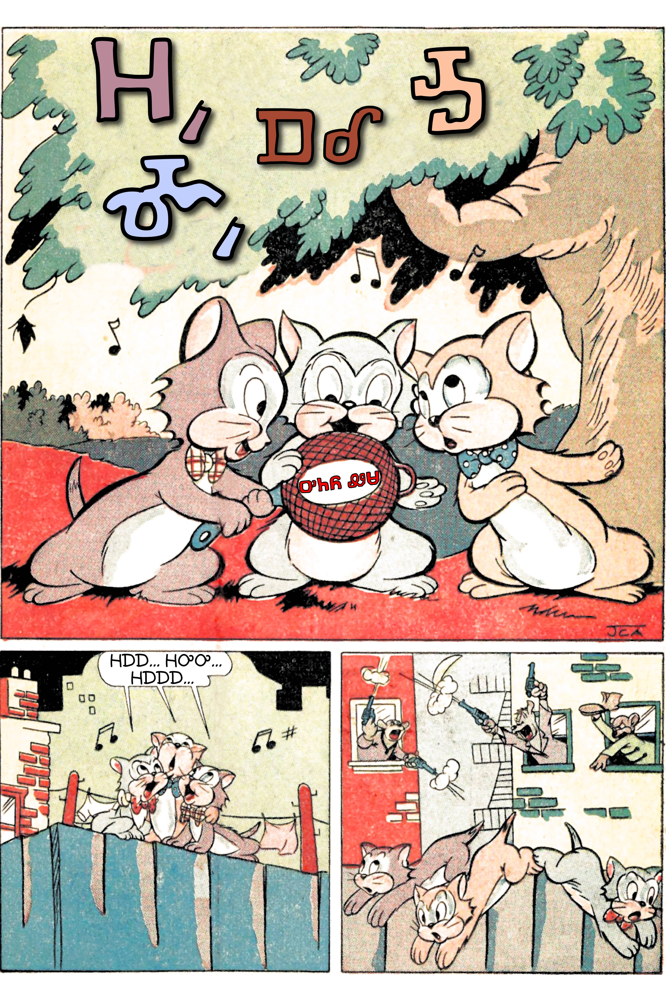
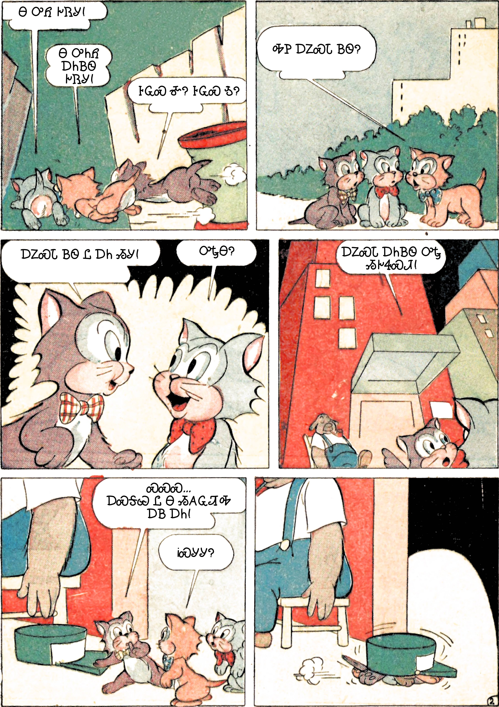
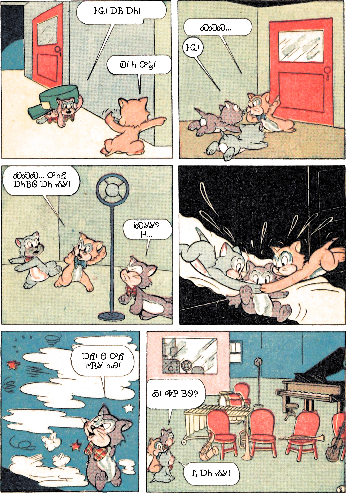
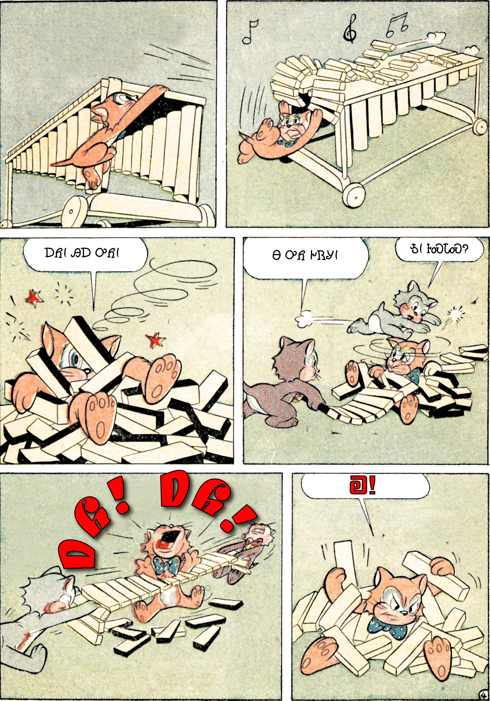
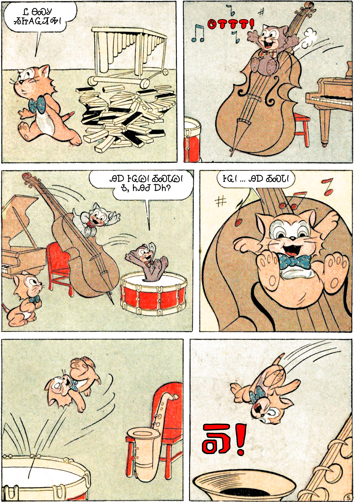
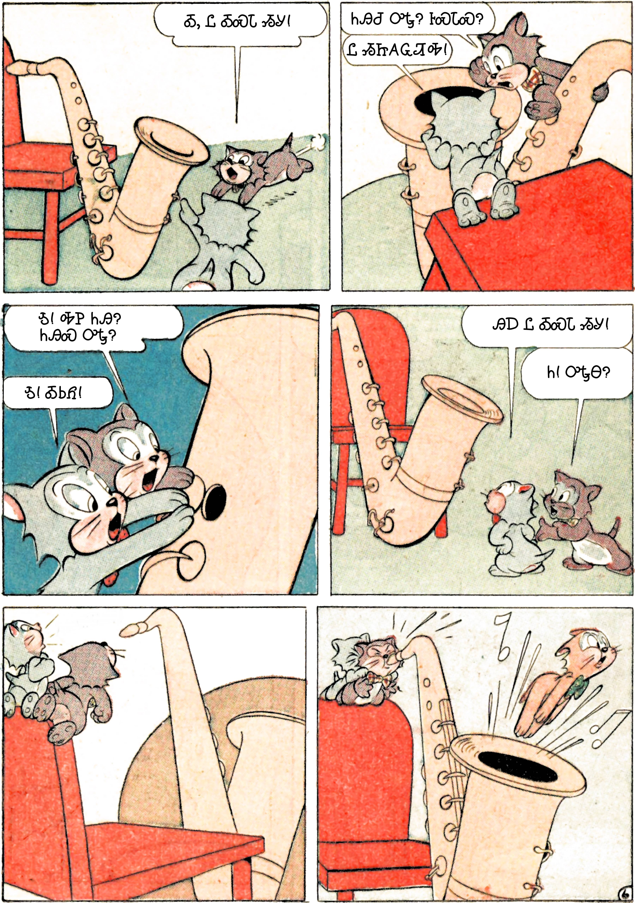
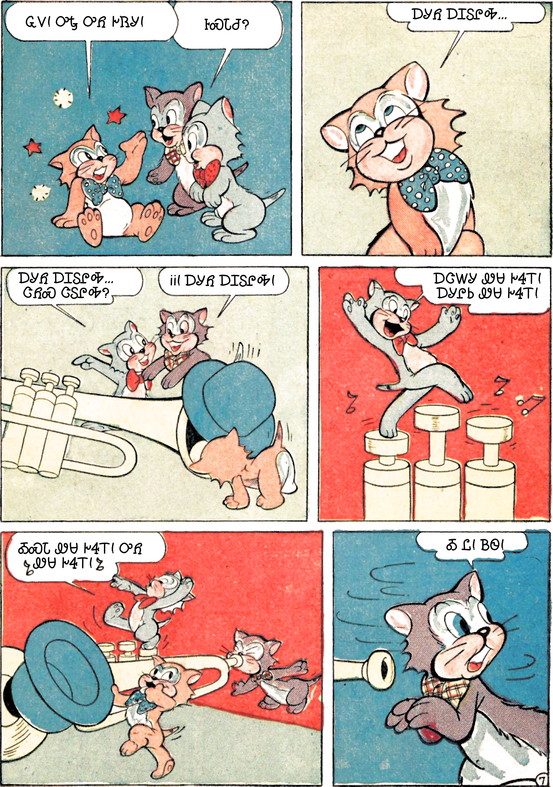
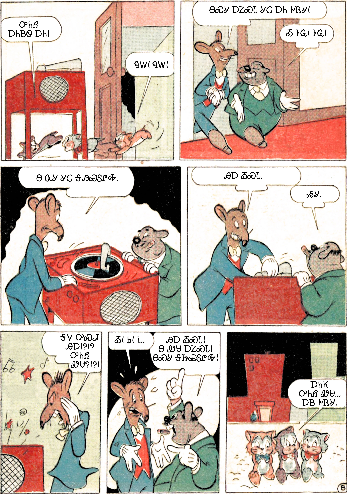

+++
draft = false
date = 2020-03-26T18:16:08Z
title = "ᏔᎵᏍᎪ ᏔᎵᏁᎢ ᎠᏕᎶᏆᏍᏗ"
weight = 1585246560

[taxonomies]
authors = ["Michael Conrad"]
categories = ["Lessons", "Grammar"]
tags = []

[extra]
zulma_title="Cherokee Language Lessons 1"
featured_image = "lessons/Cherokee-Language-Lessons-Volume-1/ᏔᎵᏍᎪ-ᏔᎵᏁᎢ-ᎠᏕᎶᏆᏍᏗ---Cherokee-Language-Lessons-1/comics-mi-ma-ale-mo-uniyo-wesa-pages.jpg-001.jpg"

+++
## ᏘᎪᎵᏯ (Read them)

  - Ꭷ  
    \[ka\] “Hey now\! Enough already\! Hey\!” ☞ *Also used as a greeting
    to indicate a “Hey\!” kind of “Hi\!”.*

  - ᏄᎳ  
    \[nu⁴la\] “Hurry.”

<!-- end list -->

  - ᎢᏯᏂ  
    \[ị²yạ³ni\] “Count of animate.”

  - ᎢᎦ  
    \[i²³ga⁴\] “Count of inanimate.”

  - ᎦᏍᎩᎸᎢ  
    \[ga²sgị²lv⁴ɂi\] “On a chair or on a table.”

  - ᏂᎦᏓ, ᏂᎦᏛ  
    \[nị²ga⁴da, nị²ga⁴dv\] “All. Everyone.”

  - ᎤᎵᏑᏫᏓ  
    \[ul²su²³hwị²da\] “Color.”
    
      - ᎤᎾᎵᏑᏫᏓ  
        \[u²nal²su²³hwị²da\] “Color (them-animate).”
    
      - ᏧᎵᏑᏫᏓ  
        \[jul²su²³hwị²da\] “Color (them-inanimate).”
<!-- more -->
## ᎤᏬᎵᏗ ᎪᏪᎵ (Funny Paper)

Read the following comic.

## ᏙᏪᎸᎦ (Write them)

Write out each of the following Cherokee sentences from the comic
followed by an English translation. Compare your answers to the answers
in the ᎩᎵᏏ section. ☞ *Refer back to the comic as needed to be sure your
translation fits the scene the dialogue is taken from.*

### ᏣᎳᎩ

#### Page 1

  -    
    ᎤᏂᏲ ᏪᏌ

  - ᏪᏌ  
    ᎻᎠᎠ... ᎻᎤᎤ... ᎻᎠᎠᎠ...

#### Page 2

  - Ꮉ  
    Ꮎ ᎤᏲ ᎨᏒᎩ\!

  - Ꮌ  
    Ꮎ ᎤᏂᏲ ᎠᏂᏴᏫ ᎨᏒᎩ\!

  - Ꮋ  
    ᎰᏩᏍ Ꮉ? ᎰᏩᏍ Ꮌ?

  - Ꮌ  
    ᎭᏢ ᎠᏃᏍ��� ᏴᏫ?

  - Ꮋ  
    ᎠᏃᏍᏓ ᏴᏫ Ꮭ ᎠᏂ ᏱᎩ\!

  - Ꮉ  
    ᎤᎿᎾ?

  - Ꮋ  
    ᎠᏃᏍᏓ ᎠᏂᏴᏫ ᎤᎿ ᏱᎨᏎᏍᏗ\!

  - Ꮋ  
    ᏍᏍᏍ... ᎠᏍᎦᏯ Ꮭ Ꮎ ᏱᎪᏩᏘᎭ ᎠᏴ ᎠᏂ\!

  - Ꮌ  
    ᎥᏍᎩᎩ?

#### Page 3

  - Ꮋ  
    ᎰᏩ\! ᎠᏴ ᎠᏂ\!

  - Ꮌ  
    ᏍᏍᏍ...

  - Ꮋ  
    ᎰᏩ\!

  - Ꮌ  
    ᏍᏍᏍ... ᎤᏂᏲ ᎠᏂᏴᏫ ᎠᏂ ᏱᎩ\!

  - Ꮋ  
    ᎥᏍᎩᎩ? Ꮋ...

  - Ꮋ  
    ᎠᏲ\! Ꮎ ᎤᏲ ᎨᏒᎩ ᏂᎯ\!

  - Ꮋ  
    Ꭳ\! ᎭᏢ ᏴᏫ?

  - Ꮉ  
    Ꮭ ᎠᏂ ᏱᎩ\!

#### Page 4

  - Ꮌ  
    ᎠᏲ\! ᎯᎠ ᎤᏲ\!

  - Ꮋ  
    Ꮎ ᎤᏲ ᎨᏒᎩ\!

  - Ꮉ  
    Ꮌ\! ᎰᏍᏓᏍ?

  - Ꮌ  
    ᎠᏲ\! ᎠᏲ\!

  - Ꮌ  
    Ꭷ\!

#### Page 5

  - Ꮌ  
    Ꮭ ᎾᏍᎩ ᏱᏥᎪᏩᏘᎭ\!

  - Ꮋ  
    ᎯᎠ ᎰᏩᏊ\! ᎣᏍᏓᏊ\! Ꮌ, ᏂᎯᏧ ᎠᏂ?

  - Ꮌ  
    ᎰᏩ\! ... ᎯᎠ ᎣᏍᏓ\!

#### Page 6

  - Ꮋ  
    Ꭳ, Ꮭ ᎣᏍᏓ ᏱᎩ\!

  - Ꮋ  
    ᏂᎯᏧ ᎤᎿ? ᎰᏍᏓᏍ?

  - Ꮉ  
    Ꮭ ᏱᏥᎪᏩᏘᎭ\!

  - Ꮋ  
    Ꮌ\! ᎭᏢ ᏂᎯ? ᏂᎯᏍ ᎤᎿ?

  - Ꮉ  
    Ꮌ\! ᎣᏏᏲ\!

  - Ꮉ  
    ᎯᎠ Ꮭ ᎣᏍᏓ ᏱᎩ\!

  - Ꮋ  
    Ꮒ\! ᎤᎿᎾ?

#### Page 7

  - Ꮌ  
    ᏩᏙ\! ᎤᎿ ᎤᏲ ᎨᏒᎩ\!

  - Ꮋ ᎠᎴ Ꮉ  
    ᎰᏍᏓᏧ?

  - Ꮌ  
    ᎠᎩᏲ ᎠᏆᏚᎵᎭ...

  - Ꮉ  
    ᎠᎩᏲ ᎠᏆᏚᎵᎭ... ᏣᏲᏍ ᏣᏚᎵᎭ?

  - Ꮋ  
    ᎥᎥ\! ᎠᎩᏲ ᎠᏆᏚᎵᎭ\!

  - Ꮉ  
    ᎠᏣᎳᎩ ᏪᏌ ᎨᏎᎢ\! ᎠᎩᎵᏏ ᏪᏌ ᎨᏎᎢ\!

  - Ꮉ  
    ᎣᏍᏓ ᏪᏌ ᎨᏎᎢ\! ᎤᏲ ᏪᏌ ᎨᏎᎢ\!

  - Ꮋ  
    Ꭳ Ꮭ\! ᏴᏫ\!

#### Page 8

  - Ꮋ  
    ᎤᏂᏲ ᎠᏂᏴᏫ ᎠᏂ\!

  - Ꮌ  
    ᏄᎳ\! ᏄᎳ\!

  - ᎢᎬᏱ ᏴᏫ  
    ᎾᏍᎩ ᎠᏃᏍᏓ ᎩᏟ ᎠᏂ ᎨᏒᎩ\!

  - ᏔᎵᏁ ᏴᏫ  
    Ꭳ ᎰᏩ\! ᎰᏩ\!

  - ᎢᎬᏱ ᏴᏫ  
    Ꮎ ᏅᎩ ᎩᏟ ᎦᎯᏯᏚᎵᎭ.

  - ᎢᎬᏱ ᏴᏫ  
    ᎯᎠ ᎣᏍᏓ.

  - ᏔᎵᏁ ᏴᏫ  
    ᏱᎩ.

  - ᎢᎬᏱ ᏴᏫ  
    ᎦᏙ ᎤᏍᏗ ᎯᎠ\!?\!? ᎤᏂᏲ ᏪᏌ?\!?\!

  - ᎢᎬᏱ ᏴᏫ  
    Ꭳ\! Ꮟ\! Ꭵ...

  - ᏔᎵᏁ ᏴᏫ  
    ᎯᎠ ᎣᏍᏓ\! Ꮎ ᏪᏌ ᎠᏃᏍᏓ\! ᎾᏍᎩ ᎦᏥᏯᏚᎵᎭ\!

  - Ꮋ  
    ᎠᏂᏦ ᎤᏂᏲ ᏪᏌ... ᎠᏴ ᎨᏒᎩ.

### ᎩᎵᏏ

☞ *Your answers are not expected to exactly match the answers provided
here. Just be close.*

#### Page 1

  -    
    ᎤᏂᏲ ᏪᏌ

  -    
    Bad cats

  - ᏪᏌ  
    ᎻᎠᎠ... ᎻᎤᎤ... ᎻᎠᎠᎠ...

  - Cats  
    Meaaah... Meooo... Meaaaah...

#### Page 2

  - Ꮉ  
    Ꮎ ᎤᏲ ᎨᏒᎩ\!

  - Ma  
    That was bad\!

  - Ꮌ  
    Ꮎ ᎤᏂᏲ ᎠᏂᏴᏫ ᎨᏒᎩ\!

  - Mo  
    Those were bad people\!

  - Ꮋ  
    ᎰᏩᏍ Ꮉ? ᎰᏩᏍ Ꮌ?

  - Mi  
    Are you good Ma? Are you good Mo?

  - Ꮌ  
    ᎭᏢ ᎠᏃᏍᏓ ᏴᏫ?

  - Mo  
    Where are good people?

  - Ꮋ  
    ᎠᏃᏍᏓ ᏴᏫ Ꮭ ᎠᏂ ᏱᎩ\!

  - Mi  
    Good people aren’t here\!

  - Ꮉ  
    ᎤᎿᎾ?

  - Ma  
    What about there?

  - Ꮋ  
    ᎠᏃᏍᏓ ᎠᏂᏴᏫ ᎤᎿ ᏱᎨᏎᏍᏗ\!

  - Mi  
    Maybe good people will be there\!

  - Ꮋ  
    ᏍᏍᏍ... ᎠᏍᎦᏯ Ꮭ Ꮎ ᏱᎪᏩᏘᎭ ᎠᏴ ᎠᏂ\!

  - Mi  
    Shh.... The man doesn’t see that we are here\!

  - Ꮌ  
    ᎥᏍᎩᎩ?

  - Mo  
    Really?

#### Page 3

  - Ꮋ  
    ᎰᏩ\! ᎠᏴ ᎠᏂ\!

  - Mi  
    Alright\! Here we are\!

  - Ꮌ  
    ᏍᏍᏍ...

  - Mo  
    Shh...

  - Ꮋ  
    ᎰᏩ\!

  - Mi  
    Ok\!

  - Ꮌ  
    ᏍᏍᏍ... ᎤᏂᏲ ᎠᏂᏴᏫ ᎠᏂ ᏱᎩ\!

  - Mo  
    Shh... Bad people might be here\!

  - Ꮋ  
    ᎥᏍᎩᎩ? Ꮋ...

  - Mi  
    Really? Meee...

  - Ꮋ  
    ᎠᏲ\! Ꮎ ᎤᏲ ᎨᏒᎩ ᏂᎯ\!

  - Mi  
    Ow\! That was bad y’all\!

  - Ꮋ  
    Ꭳ\! ᎭᏢ ᏴᏫ?

  - Mi  
    Oh\! Where are the people?

  - Ꮉ  
    Ꮭ ᎠᏂ ᏱᎩ\!

  - Ma  
    Not here\!

#### Page 4

  - Ꮌ  
    ᎠᏲ\! ᎯᎠ ᎤᏲ\!

  - Mo  
    Ow\! This is bad\!

  - Ꮋ  
    Ꮎ ᎤᏲ ᎨᏒᎩ\!

  - Mi  
    That was bad\!

  - Ꮉ  
    Ꮌ\! ᎰᏍᏓᏍ?

  - Ma  
    Mo\! Are you good?

  - Ꮌ  
    Ꭷ\!

  - Mo  
    Enough\!

#### Page 5

  - Ꮌ  
    Ꮭ ᎾᏍᎩ ᏱᏥᎪᏩᏘᎭ\!

  - Mo  
    I don’t see that\!

  - Ꮋ  
    ᎯᎠ ᎰᏩᏊ\! ᎣᏍᏓᏊ\! Ꮌ, ᏂᎯᏧ ᎠᏂ?

  - Mi  
    This is just alright\! Just good\! Mo, you here, right?

  - Ꮌ  
    ᎰᏩ\! ... ᎯᎠ ᎣᏍᏓ\!

  - Mo  
    Alright\! ... This is good\!

#### Page 6

  - Ꮋ  
    Ꭳ, Ꮭ ᎣᏍᏓ ᏱᎩ\!

  - Mi  
    Oh, not good\!

  - Ꮋ  
    ᏂᎯᏧ ᎤᎿ? ᎰᏍᏓᏍ?

  - Mi  
    You’re there, aren’t you? Are you good?

  - Ꮉ  
    Ꮭ ᏱᏥᎪᏩᏘᎭ\!

  - Ma  
    I don’t see him\!

  - Ꮋ  
    Ꮌ\! ᎭᏢ ᏂᎯ? ᏂᎯᏍ ᎤᎿ?

  - Mi  
    Mo\! Where are you? Are you there?

  - Ꮉ  
    Ꮌ\! ᎣᏏᏲ\!

  - Ma  
    Mo\! Hello\!

  - Ꮉ  
    ᎯᎠ Ꮭ ᎣᏍᏓ ᏱᎩ\!

  - Ma  
    This isn’t good\!

  - Ꮋ  
    Ꮒ\! ᎤᎿᎾ?

  - Mi  
    Look\! What about there?

#### Page 7

  - Ꮌ  
    ᏩᏙ\! ᎤᎿ ᎤᏲ ᎨᏒᎩ\!

  - Mo  
    Thanks\! It was bad there\!

  - Ꮋ ᎠᎴ Ꮉ  
    ᎰᏍᏓᏧ?

  - Mi and Ma  
    You’re good, right?

  - Ꮌ  
    ᎠᎩᏲ ᎠᏆᏚᎵᎭ...

  - Mo  
    I want to be bad...

  - Ꮉ  
    ᎠᎩᏲ ᎠᏆᏚᎵᎭ... ᏣᏲᏍ ᏣᏚᎵᎭ?

  - Ma  
    I want to be bad... Are you wanting to be bad?

  - Ꮋ  
    ᎥᎥ\! ᎠᎩᏲ ᎠᏆᏚᎵᎭ\!

  - Mi  
    Yes\! I want to be bad\!

  - Ꮉ  
    ᎠᏣᎳᎩ ᏪᏌ ᎨᏎᎢ\! ᎠᎩᎵᏏ ᏪᏌ ᎨᏎᎢ\!

  - Ma  
    There was a Cherokee cat\! There was a English cat\!

  - Ꮉ  
    ᎣᏍᏓ ᏪᏌ ᎨᏎᎢ\! ᎤᏲ ᏪᏌ ᎨᏎᎢ\!

  - Ma  
    There was a good cat\! There was a bad cat\!

  - Ꮋ  
    Ꭳ Ꮭ\! ᏴᏫ\!

  - Mi  
    Oh no\! People\!

#### Page 8

  - Ꮋ  
    ᎤᏂᏲ ᎠᏂᏴᏫ ᎠᏂ\!

  - Mi  
    Bad people are here\!

  - Ꮌ  
    ᏄᎳ\! ᏄᎳ\!

  - Mo  
    Hurry\! Hurry\!

  - ᎢᎬᏱ ᏴᏫ  
    ᎾᏍᎩ ᎠᏃᏍᏓ ᎩᏟ ᎠᏂ ᎨᏒᎩ\!

  - First Person  
    Those good dogs were here\!

  - ᏔᎵᏁ ᏴᏫ  
    Ꭳ ᎰᏩ\! ᎰᏩ\!

  - Second Person  
    Oh ok\! Ok\!

  - ᎢᎬᏱ ᏴᏫ  
    Ꮎ ᏅᎩ ᎩᏟ ᎦᎯᏯᏚᎵᎭ.

  - First Person  
    You are wanting those four dogs.

  - ᎢᎬᏱ ᏴᏫ  
    ᎯᎠ ᎣᏍᏓ.

  - First Person  
    This is good.

  - ᏔᎵᏁ ᏴᏫ  
    ᏱᎩ.

  - Second person  
    Maybe.

  - ᎢᎬᏱ ᏴᏫ  
    ᎦᏙ ᎤᏍᏗ ᎯᎠ\!?\!? ᎤᏂᏲ ᏪᏌ?\!?\!

  - First Person  
    What’s this\!?\!? Bad cats?\!?\!

  - ᎢᎬᏱ ᏴᏫ  
    Ꭳ\! Ꮟ\! Ꭵ...

  - First Person  
    Oh\! Wait\! uh...

  - ᏔᎵᏁ ᏴᏫ  
    ᎯᎠ ᎣᏍᏓ\! Ꮎ ᏪᏌ ᎠᏃᏍᏓ\! ᎾᏍᎩ ᎦᏥᏯᏚᎵᎭ\!

  - Second Person  
    This is good\! Those cats are good\! I want them\!

  - Ꮋ  
    ᎠᏂᏦ ᎤᏂᏲ ᏪᏌ... ᎠᏴ ᎨᏒᎩ.

  - Mi  
    Three bad cats.... we were.

## Congratulations\! You are ready to move on to the next book.