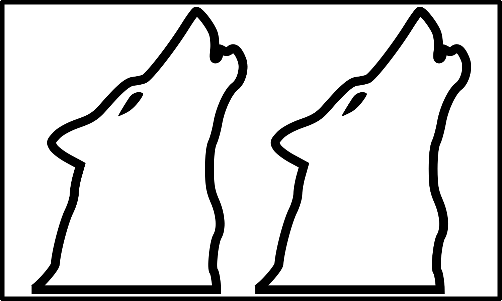
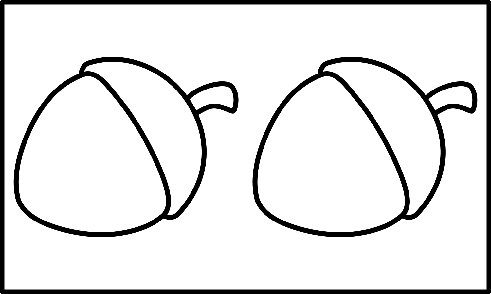

+++
draft = false
date = 2020-03-26T18:08:11Z
title = "ᏔᎵᏍᎪᎯᏁᎢ ᎠᏕᎶᏆᏍᏗ"
weight = 1585246090

[taxonomies]
authors = ["Michael Conrad"]
categories = ["Lessons", "Grammar"]
tags = []

[extra]
zulma_title="Cherokee Language Lessons 1"
featured_image = "lessons/Cherokee-Language-Lessons-Volume-1/Cherokee-Language-Lessons-Volume-1.png"

+++
## ᎦᏬᏂᏍᎬᎢ ᎠᎦᏔᎲᎢ (Grammar)

☞ *Remember that it is through the exercises in the lesson material that
you will learn how to understand and speak Cherokee, not by memorizing
rules and word parts.*

The Cherokee words for “is”, “was”, and “will be” work a little
differently than they do in English. The words have special forms to
indicate just now, now and on going, usually, a while ago, first hand
knowledge, and second hand knowledge.

The special first hand and second hand knowledge forms will be indicated
by references to “*with personal knowledge*” and “*without personal
knowledge*”. “*With personal knowledge*” indicates being a first hand
witness. “*Without personal knowledge”* indicates being told something
by someone else making your information second hand.

☞ *In some materials you will see these words grouped together as one
and referred to as “the copula”.*
<!-- more -->
## ᏘᎪᎵᏯ (Read them)

  - ᎢᎩ  
    \[i⁴gi\] “Is.” ☞ *Is now or was just now.*

  - ᎢᎦ  
    \[i⁴ga\] “Is.” ☞ *Now and ongoing.*

  - ᎨᏐᎢ  
    \[ge¹so³ɂi\] “Is.” ☞ *Usually, habitually, or on certain occasions.*

  - ᎨᏒᎢ  
    \[ge¹sv²³ɂi\] “Being.”

  - ᎨᏒᎩ  
    \[ge¹sv²³gi\] “Was being.” ☞ *With personal knowledge, or
    consciousness.*

  - ᎨᏎᎢ  
    \[ge¹se³ɂi\] “Was being.” ☞ *Without personal knowledge, or
    consciousness.*

  - ᎨᎲᎢ  
    \[ge¹hv²³ɂi\] “Been (a while ago).”

  - ᎨᎲᎩ  
    \[ge¹hv²³gi\] “Was (a while ago).” ☞ *With personal knowledge, or
    consciousness.*

  - ᎨᎮᎢ  
    \[ge¹he³ɂi\] “Was (a while ago).” ☞ *Without personal knowledge, or
    consciousness.*

  - ᎨᏎᏍᏗ  
    \[ge¹se³sdi\] “Will be being.”

When looking at the previous vocabulary, it should be easy to see a
pattern that indicates some common endings are in use.

“*Being*” is indicated by the -ᎥᎢ (-v²³i) ending. In English we indicate
this by phrases such as “His act of …”, “His being …”, “His …ness”.

“*With personal knowledge*” is indicated by the -ᎥᎩ (-v²³gi) ending. In
English we indicate this by phrases such as “I know for a fact that …”.

“*Without personal knowledge”* is indicated by the -ᎡᎢ (-e²³ɂi) ending.
In English we indicate this by phrases such as “Reportedly …”,
“Supposedly …”.

“*Usually*” is indicated by the -ᎣᎢ (-o³ɂi) ending. In English we
indicate this by phrases such as “Usually …”, “Often …”.

“*Will be*” is indicated by the -ᎡᏍᏗ (-e³sdi) ending.

☞ *In the preceding vocabulary you saw words ending in both -ᎥᎩ (with
personal knowledge) and -ᎥᎢ (being). Some dialects of Cherokee do not
use the -ᎥᎩ ending and instead use -ᎥᎢ for both “being” and “was with
personal knowledge”. Such dialects use context to keep the two different
meanings separate. As many historical documents use the -ᎥᎩ ending
extensively and its use appears in some modern publications such as “The
Cherokee Phoenix”, this material will be teaching the use of both -ᎥᎩ
and -ᎥᎢ.*

The various words for “is” can be combined with Ꮭ and Ᏹ- to create the
standard not forms:

  - Ꮭ ᏱᎩ  
    \[hla yi⁴gi\] “Isn’t.”

  - Ꮭ ᏱᎦ  
    \[hla yi⁴ga\] “Isn’t.”

  - Ꮭ ᏱᎨᏐᎢ  
    \[hla yi²ge¹so³ɂi\] “Isn’t usually.”

  - Ꮭ ᏱᎨᏒᎢ  
    \[hla yi²ge¹sv²³ɂi\] “Not being.”

  - Ꮭ ᏱᎨᏎᎢ  
    \[hla yi²ge¹se³ɂi\] “Wasn’t being.” ☞ *Without personal knowledge,
    or consciousness.*

  - Ꮭ ᏱᎨᎲᎢ  
    \[hla yi²ge¹hv²³ɂi\] “Had not been (a while ago).”

  - Ꮭ ᏱᎨᎮᎢ  
    \[hla yi²ge¹he³ɂi\] “Wasn’t (a while ago).” ☞ *Without personal
    knowledge, or consciousness.*

  - Ꮭ ᏱᎨᏎᏍᏗ  
    \[hla yi²ge¹se³sdi\] “Will not be being.”

☞ *When using the Ᏹ- prefix you should use the -ᎡᎢ “without personal
knowledge” ending instead of the -ᎥᎩ “with personal knowledge” ending.
This also applies when asking questions.*

### Examples

  - ᎢᎩ  
     

<!-- end list -->

  - ᎯᎠ ᎠᏴᏫ ᎣᏍᏓ ᎢᎩ. “This person is good.” or “This person just now was
    good.”
    
      - ᎯᎠ ᎠᏴᏫ ᎣᏍᏓ. “This person is good.”

  - Ꮎ ᎠᏴᏫ ᎤᏲ ᎢᎩ. “That person is bad.” or “That person just now was
    bad.”
    
      - Ꮎ ᎠᏴᏫ ᎤᏲᎢ. “That person is bad.”

  - ᎠᏂᏣᎳᎩ ᎠᏂ ᎢᎩ. “Cherokee people are here.” or “Cherokee people were
    just here.”
    
      - ᎠᏂᏣᎳᎩ ᎠᏂ. “Cherokee people are here.”

  - ᎣᏍᏓ ᎢᎩ. “It is good.” or “It just now was good.”
    
      - ᎣᏍᏓ “It is good.”

☞ *The word “ᎢᎩ” is rarely spoken or written.*

  - Ꮭ ᏱᎩ  
     

<!-- end list -->

  - ᎯᎠ ᎠᎩᎵᏏ. “This is an English person.”
    
      - ᎯᎠ Ꮭ ᎠᎩᎵᏏ ᏱᎩ. “This is not an English person.”

  - ᏅᎩ ᎠᏂ ᎢᎦ. “There are four here.”
    
      - Ꮭ ᏅᎩ ᎢᎦ ᎠᏂ ᏱᎩ. “There aren’t four here.” or “Just now there
        weren’t four here.”

  - ᎠᏂᏣᎳᎩᏊ. “It is only the Cherokee people.”
    
      - ᎥᏝᏊ ᎠᏂᏣᎳᎩ ᏱᎩ. “It is not only the Cherokee people.” ☞ *Notice
        how the “-Ꮚ” was add to “ᎥᏝ” to form “not only”?*

  - Ꮭ ᎣᏍᏓ ᏱᎩ. ᎤᏲᎢ. “It is not good. It is bad.”
    
      - Ꮭ ᎤᏲ ᏱᎩ. ᎣᏍᏓ. “It is not bad. It is good.”

<!-- end list -->

  - ᎢᎦ  
     

<!-- end list -->

  - ᎯᎠ ᎠᏴᏫ ᎣᏍᏓ ᎢᎦ. “This person is good.” - *An ongoing goodness.*

  - Ꮎ ᎠᏴᏫ ᎤᏲ ᎢᎦ. “That person is bad.” - *An ongoing badness.*

  - ᎠᏂᏣᎳᎩ ᎠᏂ ᎢᎦ. “Cherokee people are here.” - *An ongoing habitation of
    “here”.*

  - ᎣᏍᏓ ᎢᎦ. “It is good.” - *It is an ongoing good.*

<!-- end list -->

  - ᎨᏐᎢ  
     

<!-- end list -->

  - ᎯᎠ ᎠᏴᏫ ᎣᏍᏓ ᎨᏐᎢ. “This person is often being good.” ☞ *This does not
    mean the person isn’t bad sometimes.*

  - Ꮎ ᎠᏴᏫ ᎤᏲ ᎨᏐᎢ “That person is often being bad.” ☞ *This does not mean
    the person isn’t good sometimes.*

  - ᎠᏂᏣᎳᎩ ᎠᏂ ᎨᏐᎢ. “Cherokee people are often here.” ☞ *This does not
    mean they are always here.*

  - ᏣᏂ ᎤᏲ ᏱᎨᏐ ᎹᏫᎠ ᎤᏲ ᎨᏐᎢ. “If John is bad Maria is usually bad.” ☞ *This
    is an example of “on certain occasions”.*

<!-- end list -->

  - ᎨᏒᎩ  
     

<!-- end list -->

  - ᎯᎠ ᎠᏴᏫ ᎣᏍᏓ ᎨᏒᎩ. “This person was being good.”

  - Ꮎ ᎠᏴᏫ ᎤᏲ ᎨᏒᎩ. “That person was being bad.”

<!-- end list -->

  - ᎨᏎᎢ  
     

<!-- end list -->

  - ᎯᎠ ᎠᏴᏫ ᎣᏍᏓ ᎨᏎᎢ. “Reportedly this person was being good.”

  - Ꮎ ᎠᏴᏫ ᎤᏲ ᎨᏎᎢ. “Supposedly that person was being bad.”

<!-- end list -->

  - ᎨᎲᎩ  
     

<!-- end list -->

  - ᎯᎠ ᎠᏴᏫ ᎣᏍᏓ ᎨᎲᎩ. “This person was good a while ago.”

  - Ꮎ ᎠᏴᏫ ᎤᏲ ᎨᎲᎩ. “That person was bad a while ago.”

  - ᎠᏂ ᎠᏂᏣᎳᎩ ᎨᎲᎩ. “Cherokee people were here a while ago.”

<!-- end list -->

  - ᎨᎮᎢ  
     

<!-- end list -->

  - ᎯᎠ ᎠᏴᏫ ᎣᏍᏓ ᎨᎮᎢ. “Reportedly this person was good a while ago.”

  - Ꮎ ᎠᏴᏫ ᎤᏲ ᎨᎮᎢ. “Supposedly that person was bad a while ago.”

<!-- end list -->

  - ᎨᏎᏍᏗ  
     

<!-- end list -->

  - ᎯᎠ ᎠᏴᏫ ᎣᏍᏓ ᎨᏎᏍᏗ. “This person will be good.”

  - Ꮎ ᎠᏴᏫ ᎤᏲ ᎨᏎᏍᏗ “That person will be bad.”

  - ᎠᏂ ᎠᏂᏣᎳᎩ ᎨᏎᏍᏗ “Cherokee people will be here.”

  - ᎣᏍᏓ ᎨᏎᏍᏗ. “It will be good.”

## ᏂᏔᏛᎦ (Do them)

You will need to reuse the following white cards from the previous
chapter.

 

You will need to reuse the following people index cards:

 

You will need to add 9 each of the following card. Color the first 8
cards in each square as ᎢᏤᎢᏳᏍᏗ, ᎤᏬᏗᎨᎢ, ᎩᎦᎨᎢ, ᎬᎿᎨᎢ, ᏌᎪᏂᎨᎢ, ᏓᎭᎵᎨᎢ, ᏓᎶᏂᎨᎢ,
and ᏓᎶᏂᎨ ᎤᏍᎪᎸᎢ.

Label the reverse of each as ᎢᏤᎢᏳᏍᏗ, ᎤᏬᏗᎨᎢ, ᎠᎩᎦᎨᎢ / ᎩᎦᎨᎢ, ᎠᎬᎿᎨᎢ / ᎬᎿᎨᎢ,
ᎠᏌᎪᏂᎨᎢ / ᏌᎪᏂᎨᎢ, ᎠᏓᎭᎵᎨᎢ / ᏓᎭᎵᎨᎢ, ᎠᏓᎶᏂᎨᎢ / ᏓᎶᏂᎨᎢ, and ᎠᏓᎶᏂᎨ ᎤᏍᎪᎸᎢ / ᏓᎶᏂᎨ
ᎤᏍᎪᎸᎢ, and ᎤᏁᎦ.

You will need to add 9 each of the following card. Color the first 8
cards in each square as ᏗᏤᎢᏳᏍᏗ, ᏧᏬᏗᎨᎢ, ᏗᎩᎦᎨᎢ, ᏗᎬᎿᎨᎢ, ᏗᏌᎪᏂᎨᎢ, ᏗᏓᎭᎵᎨᎢ,
ᏗᏓᎶᏂᎨᎢ, and ᏗᏓᎶᏂᎨ ᏧᏍᎪᎸᎢ.

Label the reverse of each as ᎠᏂᏤᎢᏳᏍᏗ / ᏗᏤᎢᏳᏍᏗ, ᏧᏃᏗᎨᎢ / ᏧᏬᏗᎨᎢ, ᎠᏂᎩᎦᎨᎢ /
ᏗᎩᎦᎨᎢ, ᎠᏂᎬᎿᎨᎢ / ᏗᎬᎿᎨᎢ, ᎠᏂᏌᎪᏂᎨᎢ / ᏗᏌᎪᏂᎨᎢ, ᎠᏂᏓᎭᎵᎨᎢ / ᏗᏓᎭᎵᎨᎢ, ᎠᏂᏓᎶᏂᎨᎢ /
ᏗᏓᎶᏂᎨᎢ, and ᎠᏂᏓᎶᏂᎨ ᎤᏂᏍᎪᎸᎢ / ᏗᏓᎶᏂᎨ ᏧᏍᎪᎸᎢ, and ᎤᏂᏁᎦ / ᏧᏁᎦ.

Divide up into groups of four to seven. If necessary, add enough pretend
study partners to make your group a size of four.

### Groups

For each group the first person is designated “Ꭰ”. The second person is
designated “Ꭱ”. The third person is designated “Ꭲ”. Any remaining people
are grouped together and are designated “Ꭳ”. After each set, rotate
positions so that “Ꭰ” becomes the “Ꭱ”, the “Ꭱ” becomes the “Ꭲ”, the “Ꭲ”
becomes one of the “Ꭳ” and one of the “Ꭳ” becomes the “Ꭰ”.

☞ *Keep rotating until everyone has been in position “Ꭰ”, starting over
with the first set of challenges as needed.*

☞ *The “Ꭰ” responses should be read from the book. The “Ꭱ” and “Ꭲ”
responses should be done without reading the book. The “Ꭰ” person should
help as needed.*

Each challenge-response should be done as in the following examples:

1.  \[Ꭰ→Ꭱ\] ᏂᎯᏊ.  
    “Ꭰ” says to “Ꭱ”: Just you.
    
    1.  \[Ꭰ→Ꭱ\] ᏌᎪᏂᎨ ᏅᏯ ᎨᏎᏍᏗ.  
        “Ꭰ” says to “Ꭱ”: It will be a blue rock.
    
    2.  \[Ꭰ\] cards → \[Ꭱ\].  
        “Ꭰ” passes to “Ꭱ” a single blue color card and a single rock
        card.
    
    3.  \[Ꭱ→Ꭲ\] ᏌᎪᏂᎨ ᏅᏯ.  
        Only “Ꭱ” looks at the cards.  
        “Ꭱ” says to “Ꭲ”: It’s a blue rock.
    
    4.  \[Ꭲ→Ꭳ\] ᏌᎪᏂᎨ ᏅᏯ.  
        “Ꭲ” says to “Ꭳ”: It’s a blue rock.
    
    5.  \[Ꭰ\] ← cards \[Ꭱ\].  
        “Ꭰ” retrieves the cards from “Ꭱ”.
    
    6.  \[Ꭰ→Ꭱ\] ᎰᏩ.  
        “Ꭰ” says to “Ꭱ”: Alright.
    
    7.  \[Ꭱ→Ꭲ\] ᏌᎪᏂᎨ ᏅᏯ ᎨᏒᎩ.  
        “Ꭱ” says to “Ꭲ”: It was a blue rock.
    
    8.  \[Ꭲ→Ꭳ\] ᏌᎪᏂᎨ ᏅᏯ ᎨᏎᎢ.  
        “Ꭲ” says to “Ꭳ”: Reportedly it was a blue rock.

2.  \[Ꭰ→Ꭱ\] ᏂᎯᏊ.  
    “Ꭰ” says to “Ꭱ”: Just you.
    
    1.  \[Ꭰ→Ꭱ\] ᎤᏁᎦ ᎫᎴ ᎨᏎᏍᏗ.  
        “Ꭰ” says to “Ꭱ”: It will be a white acorn.
    
    2.  \[Ꭰ\] cards → \[Ꭱ\].  
        “Ꭰ” passes to “Ꭱ” a single white color card and a single acorn
        card.
    
    3.  \[Ꭱ→Ꭲ\] ᎤᏁᎦ ᎫᎴ.  
        Only “Ꭱ” looks at the cards.  
        “Ꭱ” says to “Ꭲ”: It’s a white acorn.
    
    4.  \[Ꭲ→Ꭳ\] ᎤᏁᎦ ᎫᎴ.  
        “Ꭲ” says to “Ꭳ”: It’s a white acorn.
    
    5.  \[Ꭰ\] ← cards \[Ꭱ\].  
        “Ꭰ” retrieves the cards from “Ꭱ”.
    
    6.  \[Ꭰ→Ꭱ\] Ꮠ ᎢᎦ.  
        “Ꭰ” says to “Ꭱ”: Another day. (To indicate a day’s passing.)
    
    7.  \[Ꭱ→Ꭲ\] ᎤᏁᎦ ᎫᎴ ᎨᎲᎩ.  
        “Ꭱ” says to “Ꭲ”: It was a white acorn a while ago.
    
    8.  \[Ꭲ→Ꭳ\] ᎤᏁᎦ ᎫᎴ ᎨᎮᎢ.  
        “Ꭲ” says to “Ꭳ”: Reportedly it was a white acorn a while ago.

3.  ᏩᎭᏯ, ᏐᏈᎵ, ᏅᏯ, ᏄᎾ.  
    “Ꭰ” places a wolf card, a horse card, a rock card, and a potato card
    in a row.
    
    1.  \[Ꭰ→Ꭱ\] ᏅᏯ ᏱᎨᏐ Ꮭ ᏄᎾ ᏱᎨᏐᎢ.  
        “Ꭰ” says to “Ꭱ”: If there is a rock, there isn’t a potato.
    
    2.  ✗ ᏄᎾ.  
        “Ꭱ” turns the potato card over to indicate it doesn’t belong.

4.  ᎤᏁᎦ ᎩᏟ.  
    “Ꭰ” picks up a single white color card and a single dog card up and
    shows them to “Ꭱ”.
    
    1.  \[Ꭰ→Ꭱ\] ᎯᎠᏍ ᎠᏓᎭᎵᎨ ᏌᎶᎵ?  
        “Ꭰ” ask “Ꭱ”: Is this a purple squirrel?
    
    2.  \[Ꭱ→Ꭰ\] Ꮎ Ꮭ ᎠᏓᎭᎵᎨ ᏌᎶᎵ ᏱᎩ.  
        “Ꭱ” says to “Ꭰ”: That isn’t a purple squirrel.

5.  ᎠᏓᎭᎵᎨ ᏩᎭᏯ.  
    “Ꭰ” picks up a single purple color card and a single wolf card up
    and shows them to “Ꭱ”.
    
    1.  \[Ꭰ→Ꭱ\] ᎯᎠᏍ ᎠᏓᎭᎵᎨ ᏩᎭᏯ?  
        “Ꭰ” ask “Ꭱ”: Is this a purple wolf?
    
    2.  \[Ꭱ→Ꭰ\] ᎥᎥ, Ꮎ ᎠᏓᎭᎵᎨ ᏩᎭᏯ.  
        “Ꭱ” says to “Ꭰ”: Yes, that is a purple wolf.
    
    3.  \[Ꭰ\] Cards ↓.  
        “Ꭰ” lays the cards picture down.
    
    4.  \[Ꭰ→Ꭱ\] ᎰᏩ, ᎥᏍᎩᎾᏍ ᎠᏓᎭᎵᎨ ᏩᎭᏯ ᎨᏎᎢ?  
        “Ꭰ” says to “Ꭱ”: Alright, was it a purple wolf?
    
    5.  \[Ꭱ→Ꭰ\] ᎥᎥ, ᎥᏍᎩᎾ ᎠᏓᎭᎵᎨ ᏩᎭᏯ ᎨᏒᎩ.  
        “Ꭱ” says to “Ꭰ”: Yes, it was a purple wolf.

6.  ᏪᏌ, ᏐᏈᎵ, ᏌᏛᏗ, ᏚᏯ.  
    “Ꭰ” places a cat card, a horse card, a trap card, and a bean card in
    a row.
    
    1.  \[Ꭰ→Ꭱ\] ᏌᏛᏗ ᏱᎨᏐ ᏚᏯ ᎨᏐᎢ.  
        “Ꭰ” says to “Ꭱ”: If there is a trap, there is a bean.
    
    2.  ✓ ᏌᏛᏗ, ✓ ᏚᏯ.  
        “Ꭱ” places the trap and bean cards together.  
        “Ꭱ” turns the other cards picture down to indicate they don’t
        belong.

7.  \[Ꭰ→Ꭱ\] ᎦᏙ ᏧᎾᏍᏗ ᏓᏂᎪᏩᏘᎭ?  
    “Ꭰ” says to “Ꭱ”: What are they seeing?
    
    1.  \[Ꭰ→Ꭱ\] ᎤᏂᏁᎦ ᎠᏂᏴᏫ ᎠᏂᎬᎿᎨ ᏪᏌ ᏓᏂᎪᏩᏘᎭ.  
        “Ꭰ” says to “Ꭱ”: The white people see black cats.  
        “Ꭱ” selects and places the plural white card with the people
        card.  
        “Ꭱ” selects and places the plural black card with the plural
        cats card.  
        “Ꭱ” positions the cards to indicate that the white people are
        seeing the black cats.  
        (Turn the cards over to be sure both the correct color and
        object cards were picked.)

8.  ᏓᎭᎵᎨ ᏅᏯ.  
    “Ꭰ” picks up a single purple color card and a single rock card up
    and shows them to “Ꭱ”.
    
    1.  \[Ꭰ→Ꭱ\] ᎯᎠᏍ ᏓᎭᎵᎨ ᏅᏯ?  
        “Ꭰ” ask “Ꭱ”: Is this a purple rock?
    
    2.  \[Ꭱ→Ꭰ\] ᎥᎥ, Ꮎ ᏓᎭᎵᎨ ᏅᏯ.  
        “Ꭱ” says to “Ꭰ”: Yes, that is a purple rock.
    
    3.  \[Ꭰ\] Cards ↓.  
        “Ꭰ” lays the cards picture down.
    
    4.  \[Ꭰ→Ꭱ\] ᎰᏩ, ᎥᏍᎩᏍ ᎤᏁᎦ ᎫᎴ ᎨᏎᎢ?  
        “Ꭰ” says to “Ꭱ”: Alright, was it a white acorn?
    
    5.  \[Ꭱ→Ꭰ\] ᎥᏍᎩ Ꮭ ᎤᏁᎦ ᎫᎴ ᏱᎨᏎᎢ.  
        “Ꭱ” says to “Ꭰ”: It wasn’t a white acorn.

### Someone Alone

Add three pretend study partners and follow the instructions for Groups.

☞ *Use an index card and hide the “Ꭱ” and “Ꭲ” responses when reading the
“Ꭰ” challenges. Until you know the exercises steps, you will have to
periodcally check the “Ꭱ” and “Ꭲ” responses before doing them while they
are covered.*

☞ *Remember to speak and act the responses out\!*

### Sets

☞ *Take a short break if needed after every two to three sets.*

#### Set 1

1.  \[Ꭰ→Ꭱ\] ᏂᎯᏊ.
    
    1.  \[Ꭰ→Ꭱ\] ᎠᏓᎶᏂᎨ ᎤᏍᎪᎸ ᏥᏍᏚ ᎨᏎᏍᏗ.
    
    2.  \[Ꭰ\] cards → \[Ꭱ\].
    
    3.  \[Ꭱ→Ꭲ\] ᎠᏓᎶᏂᎨ ᎤᏍᎪᎸ ᏥᏍᏚ.
    
    4.  \[Ꭲ→Ꭳ\] ᎠᏓᎶᏂᎨ ᎤᏍᎪᎸ ᏥᏍᏚ.
    
    5.  \[Ꭰ\] ← cards \[Ꭱ\].
    
    6.  \[Ꭰ→Ꭱ\] ᎰᏩ.
    
    7.  \[Ꭱ→Ꭲ\] ᎠᏓᎶᏂᎨ ᎤᏍᎪᎸ ᏥᏍᏚ ᎨᏒᎩ.
    
    8.  \[Ꭲ→Ꭳ\] ᎠᏓᎶᏂᎨ ᎤᏍᎪᎸ ᏥᏍᏚ ᎨᏎᎢ.

2.  \[Ꭰ→Ꭱ\] ᏂᎯᏊ.
    
    1.  \[Ꭰ→Ꭱ\] ᎤᏬᏗᎨ ᎫᎴ ᎨᏎᏍᏗ.
    
    2.  \[Ꭰ\] cards → \[Ꭱ\].
    
    3.  \[Ꭱ→Ꭲ\] ᎤᏬᏗᎨ ᎫᎴ.
    
    4.  \[Ꭲ→Ꭳ\] ᎤᏬᏗᎨ ᎫᎴ.
    
    5.  \[Ꭰ\] ← cards \[Ꭱ\].
    
    6.  \[Ꭰ→Ꭱ\] ᎰᏩ.
    
    7.  \[Ꭱ→Ꭲ\] ᎤᏬᏗᎨ ᎫᎴ ᎨᏒᎩ.
    
    8.  \[Ꭲ→Ꭳ\] ᎤᏬᏗᎨ ᎫᎴ ᎨᏎᎢ.

3.  \[Ꭰ→Ꭱ\] ᏂᎯᏊ.
    
    1.  \[Ꭰ→Ꭱ\] ᎠᏓᎶᏂᎨ ᎠᏫ ᎨᏎᏍᏗ.
    
    2.  \[Ꭰ\] cards → \[Ꭱ\].
    
    3.  \[Ꭱ→Ꭲ\] ᎠᏓᎶᏂᎨ ᎠᏫ.
    
    4.  \[Ꭲ→Ꭳ\] ᎠᏓᎶᏂᎨ ᎠᏫ.
    
    5.  \[Ꭰ\] ← cards \[Ꭱ\].
    
    6.  \[Ꭰ→Ꭱ\] ᎰᏩ.
    
    7.  \[Ꭱ→Ꭲ\] ᎠᏓᎶᏂᎨ ᎠᏫ ᎨᏒᎩ.
    
    8.  \[Ꭲ→Ꭳ\] ᎠᏓᎶᏂᎨ ᎠᏫ ᎨᏎᎢ.

4.  \[Ꭰ→Ꭱ\] ᏂᎯᏊ.
    
    1.  \[Ꭰ→Ꭱ\] ᎬᎿᎨ ᏚᏯ ᎨᏎᏍᏗ.
    
    2.  \[Ꭰ\] cards → \[Ꭱ\].
    
    3.  \[Ꭱ→Ꭲ\] ᎬᎿᎨ ᏚᏯ.
    
    4.  \[Ꭲ→Ꭳ\] ᎬᎿᎨ ᏚᏯ.
    
    5.  \[Ꭰ\] ← cards \[Ꭱ\].
    
    6.  \[Ꭰ→Ꭱ\] ᎰᏩ.
    
    7.  \[Ꭱ→Ꭲ\] ᎬᎿᎨ ᏚᏯ ᎨᏒᎩ.
    
    8.  \[Ꭲ→Ꭳ\] ᎬᎿᎨ ᏚᏯ ᎨᏎᎢ.

5.  \[Ꭰ→Ꭱ\] ᏂᎯᏊ.
    
    1.  \[Ꭰ→Ꭱ\] ᎠᏌᎪᏂᎨ ᏪᏌ ᎨᏎᏍᏗ.
    
    2.  \[Ꭰ\] cards → \[Ꭱ\].
    
    3.  \[Ꭱ→Ꭲ\] ᎠᏌᎪᏂᎨ ᏪᏌ.
    
    4.  \[Ꭲ→Ꭳ\] ᎠᏌᎪᏂᎨ ᏪᏌ.
    
    5.  \[Ꭰ\] ← cards \[Ꭱ\].
    
    6.  \[Ꭰ→Ꭱ\] Ꮠ ᎢᎦ.
    
    7.  \[Ꭱ→Ꭲ\] ᎠᏌᎪᏂᎨ ᏪᏌ ᎨᎲᎩ.
    
    8.  \[Ꭲ→Ꭳ\] ᎠᏌᎪᏂᎨ ᏪᏌ ᎨᎮᎢ.

6.  \[Ꭰ→Ꭱ\] ᏂᎯᏊ.
    
    1.  \[Ꭰ→Ꭱ\] ᎢᏤᎢᏳᏍᏗ ᏄᎾ ᎨᏎᏍᏗ.
    
    2.  \[Ꭰ\] cards → \[Ꭱ\].
    
    3.  \[Ꭱ→Ꭲ\] ᎢᏤᎢᏳᏍᏗ ᏄᎾ.
    
    4.  \[Ꭲ→Ꭳ\] ᎢᏤᎢᏳᏍᏗ ᏄᎾ.
    
    5.  \[Ꭰ\] ← cards \[Ꭱ\].
    
    6.  \[Ꭰ→Ꭱ\] Ꮠ ᎢᎦ.
    
    7.  \[Ꭱ→Ꭲ\] ᎢᏤᎢᏳᏍᏗ ᏄᎾ ᎨᎲᎩ.
    
    8.  \[Ꭲ→Ꭳ\] ᎢᏤᎢᏳᏍᏗ ᏄᎾ ᎨᎮᎢ.

7.  \[Ꭰ→Ꭱ\] ᏂᎯᏊ.
    
    1.  \[Ꭰ→Ꭱ\] ᎤᏬᏗᎨ ᏌᎶᎵ ᎨᏎᏍᏗ.
    
    2.  \[Ꭰ\] cards → \[Ꭱ\].
    
    3.  \[Ꭱ→Ꭲ\] ᎤᏬᏗᎨ ᏌᎶᎵ.
    
    4.  \[Ꭲ→Ꭳ\] ᎤᏬᏗᎨ ᏌᎶᎵ.
    
    5.  \[Ꭰ\] ← cards \[Ꭱ\].
    
    6.  \[Ꭰ→Ꭱ\] Ꮠ ᎢᎦ.
    
    7.  \[Ꭱ→Ꭲ\] ᎤᏬᏗᎨ ᏌᎶᎵ ᎨᎲᎩ.
    
    8.  \[Ꭲ→Ꭳ\] ᎤᏬᏗᎨ ᏌᎶᎵ ᎨᎮᎢ.

8.  \[Ꭰ→Ꭱ\] ᏂᎯᏊ.
    
    1.  \[Ꭰ→Ꭱ\] ᏓᎶᏂᎨ ᎤᏍᎪᎸ ᏌᏛᏗ ᎨᏎᏍᏗ.
    
    2.  \[Ꭰ\] cards → \[Ꭱ\].
    
    3.  \[Ꭱ→Ꭲ\] ᏓᎶᏂᎨ ᎤᏍᎪᎸ ᏌᏛᏗ.
    
    4.  \[Ꭲ→Ꭳ\] ᏓᎶᏂᎨ ᎤᏍᎪᎸ ᏌᏛᏗ.
    
    5.  \[Ꭰ\] ← cards \[Ꭱ\].
    
    6.  \[Ꭰ→Ꭱ\] Ꮠ ᎢᎦ.
    
    7.  \[Ꭱ→Ꭲ\] ᏓᎶᏂᎨ ᎤᏍᎪᎸ ᏌᏛᏗ ᎨᎲᎩ.
    
    8.  \[Ꭲ→Ꭳ\] ᏓᎶᏂᎨ ᎤᏍᎪᎸ ᏌᏛᏗ ᎨᎮᎢ.

9.  ᎢᏤᎢᏳᏍᏗ ᎩᏟ.
    
    1.  \[Ꭰ→Ꭱ\] ᎯᎠᏍ ᎢᏤᎢᏳᏍᏗ ᎩᏟ?
    
    2.  \[Ꭱ→Ꭰ\] ᎥᎥ, Ꮎ ᎢᏤᎢᏳᏍᏗ ᎩᏟ.
    
    3.  \[Ꭰ\] Cards ↓.
    
    4.  \[Ꭰ→Ꭱ\] ᎰᏩ, ᎥᏍᎩᏍ ᎢᏤᎢᏳᏍᏗ ᎩᏟ ᎨᏎᎢ?
    
    5.  \[Ꭱ→Ꭰ\] ᎥᎥ, ᎥᏍᎩ ᎢᏤᎢᏳᏍᏗ ᎩᏟ ᎨᏒᎩ.

10. \[Ꭰ→Ꭱ\] ᏂᎯᏊ.
    
    1.  \[Ꭰ→Ꭱ\] ᎠᏓᎭᎵᎨ ᏐᏈᎵ ᎨᏎᏍᏗ.
    
    2.  \[Ꭰ\] cards → \[Ꭱ\].
    
    3.  \[Ꭱ→Ꭲ\] ᎠᏓᎭᎵᎨ ᏐᏈᎵ.
    
    4.  \[Ꭲ→Ꭳ\] ᎠᏓᎭᎵᎨ ᏐᏈᎵ.
    
    5.  \[Ꭰ\] ← cards \[Ꭱ\].
    
    6.  \[Ꭰ→Ꭱ\] ᎰᏩ.
    
    7.  \[Ꭱ→Ꭲ\] ᎠᏓᎭᎵᎨ ᏐᏈᎵ ᎨᏒᎩ.
    
    8.  \[Ꭲ→Ꭳ\] ᎠᏓᎭᎵᎨ ᏐᏈᎵ ᎨᏎᎢ.

#### Set 2

1.  \[Ꭰ→Ꭱ\] ᏂᎯᏊ.
    
    1.  \[Ꭰ→Ꭱ\] ᏌᎪᏂᎨ ᏅᏯ ᎨᏎᏍᏗ.
    
    2.  \[Ꭰ\] cards → \[Ꭱ\].
    
    3.  \[Ꭱ→Ꭲ\] ᏌᎪᏂᎨ ᏅᏯ.
    
    4.  \[Ꭲ→Ꭳ\] ᏌᎪᏂᎨ ᏅᏯ.
    
    5.  \[Ꭰ\] ← cards \[Ꭱ\].
    
    6.  \[Ꭰ→Ꭱ\] ᎰᏩ.
    
    7.  \[Ꭱ→Ꭲ\] ᏌᎪᏂᎨ ᏅᏯ ᎨᏒᎩ.
    
    8.  \[Ꭲ→Ꭳ\] ᏌᎪᏂᎨ ᏅᏯ ᎨᏎᎢ.

2.  ᎤᏁᎦ ᎩᏟ.
    
    1.  \[Ꭰ→Ꭱ\] ᎯᎠᏍ ᎤᏁᎦ ᎩᏟ?
    
    2.  \[Ꭱ→Ꭰ\] ᎥᎥ, Ꮎ ᎤᏁᎦ ᎩᏟ.
    
    3.  \[Ꭰ\] Cards ↓.
    
    4.  \[Ꭰ→Ꭱ\] ᎰᏩ, ᎥᏍᎩᎾᏍ ᎠᎬᎿᎨ ᎠᏫ ᎨᏎᎢ?
    
    5.  \[Ꭱ→Ꭰ\] ᎥᏍᎩᎾ Ꮭ ᎠᎬᎿᎨ ᎠᏫ ᏱᎨᏎᎢ.

3.  \[Ꭰ→Ꭱ\] ᏂᎯᏊ.
    
    1.  \[Ꭰ→Ꭱ\] ᎠᎬᎿᎨ ᏩᎭᏯ ᎨᏎᏍᏗ.
    
    2.  \[Ꭰ\] cards → \[Ꭱ\].
    
    3.  \[Ꭱ→Ꭲ\] ᎠᎬᎿᎨ ᏩᎭᏯ.
    
    4.  \[Ꭲ→Ꭳ\] ᎠᎬᎿᎨ ᏩᎭᏯ.
    
    5.  \[Ꭰ\] ← cards \[Ꭱ\].
    
    6.  \[Ꭰ→Ꭱ\] Ꮠ ᎢᎦ.
    
    7.  \[Ꭱ→Ꭲ\] ᎠᎬᎿᎨ ᏩᎭᏯ ᎨᎲᎩ.
    
    8.  \[Ꭲ→Ꭳ\] ᎠᎬᎿᎨ ᏩᎭᏯ ᎨᎮᎢ.

4.  \[Ꭰ→Ꭱ\] ᏂᎯᏊ.
    
    1.  \[Ꭰ→Ꭱ\] ᎤᏁᎦ ᎫᎴ ᎨᏎᏍᏗ.
    
    2.  \[Ꭰ\] cards → \[Ꭱ\].
    
    3.  \[Ꭱ→Ꭲ\] ᎤᏁᎦ ᎫᎴ.
    
    4.  \[Ꭲ→Ꭳ\] ᎤᏁᎦ ᎫᎴ.
    
    5.  \[Ꭰ\] ← cards \[Ꭱ\].
    
    6.  \[Ꭰ→Ꭱ\] Ꮠ ᎢᎦ.
    
    7.  \[Ꭱ→Ꭲ\] ᎤᏁᎦ ᎫᎴ ᎨᎲᎩ.
    
    8.  \[Ꭲ→Ꭳ\] ᎤᏁᎦ ᎫᎴ ᎨᎮᎢ.

5.  ᎠᏌᎪᏂᎨ ᏪᏌ.
    
    1.  \[Ꭰ→Ꭱ\] ᎯᎠᏍᎪ ᎠᏌᎪᏂᎨ ᏪᏌ?
    
    2.  \[Ꭱ→Ꭰ\] ᎥᎥ, Ꮎ ᎠᏌᎪᏂᎨ ᏪᏌ.
    
    3.  \[Ꭰ\] Cards ↓.
    
    4.  \[Ꭰ→Ꭱ\] ᎰᏩ, ᎾᏍᎩᏍᎪ ᎠᏓᎭᎵᎨ ᏐᏈᎵ ᎨᏎᎢ?
    
    5.  \[Ꭱ→Ꭰ\] ᎾᏍᎩ Ꮭ ᎠᏓᎭᎵᎨ ᏐᏈᎵ ᏱᎨᏎᎢ.

6.  ᎤᏁᎦ ᏲᎾ.
    
    1.  \[Ꭰ→Ꭱ\] ᎯᎠᏍ ᎤᏁᎦ ᏲᎾ?
    
    2.  \[Ꭱ→Ꭰ\] ᎥᎥ, Ꮎ ᎤᏁᎦ ᏲᎾ.
    
    3.  \[Ꭰ\] Cards ↓.
    
    4.  \[Ꭰ→Ꭱ\] ᎰᏩ, ᏍᎩᎾᏍ ᎤᏁᎦ ᏲᎾ ᎨᏎᎢ?
    
    5.  \[Ꭱ→Ꭰ\] ᎥᎥ, ᏍᎩᎾ ᎤᏁᎦ ᏲᎾ ᎨᏒᎩ.

7.  ᎠᏓᎶᏂᎨ ᏥᏍᏚ.
    
    1.  \[Ꭰ→Ꭱ\] ᎯᎠᏍᎪ ᎢᏤᎢᏳᏍᏗ ᏌᎶᎵ?
    
    2.  \[Ꭱ→Ꭰ\] Ꮎ Ꮭ ᎢᏤᎢᏳᏍᏗ ᏌᎶᎵ ᏱᎩ.

8.  ᏓᎭᎵᎨ ᏅᏯ.
    
    1.  \[Ꭰ→Ꭱ\] ᎯᎠᏍ ᏓᎭᎵᎨ ᏅᏯ?
    
    2.  \[Ꭱ→Ꭰ\] ᎥᎥ, Ꮎ ᏓᎭᎵᎨ ᏅᏯ.
    
    3.  \[Ꭰ\] Cards ↓.
    
    4.  \[Ꭰ→Ꭱ\] ᎰᏩ, ᎾᏍᎩᏍ ᏓᎭᎵᎨ ᏅᏯ ᎨᏎᎢ?
    
    5.  \[Ꭱ→Ꭰ\] ᎥᎥ, ᎾᏍᎩ ᏓᎭᎵᎨ ᏅᏯ ᎨᏒᎩ.

9.  ᎤᏬᏗᎨ ᏩᎭᏯ.
    
    1.  \[Ꭰ→Ꭱ\] ᎯᎠᏍᎪ ᎤᏬᏗᎨ ᏩᎭᏯ?
    
    2.  \[Ꭱ→Ꭰ\] ᎥᎥ, Ꮎ ᎤᏬᏗᎨ ᏩᎭᏯ.
    
    3.  \[Ꭰ\] Cards ↓.
    
    4.  \[Ꭰ→Ꭱ\] ᎰᏩ, ᏍᎩᎾᏍᎪ ᎠᏓᎶᏂᎨ ᎤᏍᎪᎸ ᏲᎾ ᎨᏎᎢ?
    
    5.  \[Ꭱ→Ꭰ\] ᏍᎩᎾ Ꮭ ᎠᏓᎶᏂᎨ ᎤᏍᎪᎸ ᏲᎾ ᏱᎨᏎᎢ.

10. ᏓᎶᏂᎨ ᏚᏯ.
    
    1.  \[Ꭰ→Ꭱ\] ᎯᎠᏍ ᏓᎶᏂᎨ ᏚᏯ?
    
    2.  \[Ꭱ→Ꭰ\] ᎥᎥ, Ꮎ ᏓᎶᏂᎨ ᏚᏯ.
    
    3.  \[Ꭰ\] Cards ↓.
    
    4.  \[Ꭰ→Ꭱ\] ᎰᏩ, ᎥᏍᎩᎾᏍ ᏓᎶᏂᎨ ᏚᏯ ᎨᏎᎢ?
    
    5.  \[Ꭱ→Ꭰ\] ᎥᎥ, ᎥᏍᎩᎾ ᏓᎶᏂᎨ ᏚᏯ ᎨᏒᎩ.

#### Set 3

1.  \[Ꭰ→Ꭱ\] ᎦᏙ ᎤᏍᏗ ᎠᎪᏩᏘᎭ?
    
    1.  \[Ꭰ→Ꭱ\] ᎠᏓᎶᏂᎨ ᎠᏴᏫ ᏓᎶᏂᎨ ᏌᏛᏗ ᎠᎪᏩᏘᎭ.

2.  ᎤᏁᎦ ᎩᏟ.
    
    1.  \[Ꭰ→Ꭱ\] ᎯᎠᏍ ᎠᎬᎿᎨ ᏐᏈᎵ?
    
    2.  \[Ꭱ→Ꭰ\] Ꮎ Ꮭ ᎠᎬᎿᎨ ᏐᏈᎵ ᏱᎩ.

3.  \[Ꭰ→Ꭱ\] ᎦᏙ ᎤᏍᏗ ᎠᎪᏩᏘᎭ?
    
    1.  \[Ꭰ→Ꭱ\] ᎠᏌᎪᏂᎨ ᎠᏴᏫ ᏓᎭᎵᎨ ᏄᎾ ᎠᎪᏩᏘᎭ.

4.  \[Ꭰ→Ꭱ\] ᎦᏙ ᎤᏍᏗ ᎠᎪᏩᏘᎭ?
    
    1.  \[Ꭰ→Ꭱ\] ᎤᏬᏗᎨ ᎠᏴᏫ ᎠᏓᎭᎵᎨ ᏐᏈᎵ ᎠᎪᏩᏘᎭ.

5.  ᏓᎶᏂᎨ ᎤᏍᎪᎸ ᏌᏛᏗ.
    
    1.  \[Ꭰ→Ꭱ\] ᎯᎠᏍᎪ ᏓᎶᏂᎨ ᎤᏍᎪᎸ ᏌᏛᏗ?
    
    2.  \[Ꭱ→Ꭰ\] ᎥᎥ, Ꮎ ᏓᎶᏂᎨ ᎤᏍᎪᎸ ᏌᏛᏗ.
    
    3.  \[Ꭰ\] Cards ↓.
    
    4.  \[Ꭰ→Ꭱ\] ᎰᏩ, ᎥᏍᎩᏍᎪ ᏓᎶᏂᎨ ᎤᏍᎪᎸ ᏌᏛᏗ ᎨᏎᎢ?
    
    5.  \[Ꭱ→Ꭰ\] ᎥᎥ, ᎥᏍᎩ ᏓᎶᏂᎨ ᎤᏍᎪᎸ ᏌᏛᏗ ᎨᏒᎩ.

6.  \[Ꭰ→Ꭱ\] ᎦᏙ ᎤᏍᏗ ᎠᎪᏩᏘᎭ?
    
    1.  \[Ꭰ→Ꭱ\] ᎤᏬᏗᎨ ᎠᏴᏫ ᎠᏓᎶᏂᎨ ᎤᏍᎪᎸ ᏌᎶᎵ ᎠᎪᏩᏘᎭ.

7.  \[Ꭰ→Ꭱ\] ᎦᏙ ᏧᏍᏗ ᏓᎪᏩᏘᎭ?
    
    1.  \[Ꭰ→Ꭱ\] ᎤᏁᎦ ᎠᏴᏫ ᏗᏓᎶᏂᎨ ᏗᏌᏛᏗ ᏓᎪᏩᏘᎭ.

8.  \[Ꭰ→Ꭱ\] ᎦᏙ ᎤᏍᏗ ᎠᎪᏩᏘᎭ?
    
    1.  \[Ꭰ→Ꭱ\] ᎠᏌᎪᏂᎨ ᎠᏴᏫ ᎢᏤᎢᏳᏍᏗ ᏅᏯ ᎠᎪᏩᏘᎭ.

9.  \[Ꭰ→Ꭱ\] ᎦᏙ ᏧᏍᏗ ᏓᎪᏩᏘᎭ?
    
    1.  \[Ꭰ→Ꭱ\] ᎠᏓᎶᏂᎨ ᎠᏴᏫ ᏗᎬᎿᎨ ᎫᎴ ᏓᎪᏩᏘᎭ.

10. ᎢᏤᎢᏳᏍᏗ ᏌᏛᏗ.
    
    1.  \[Ꭰ→Ꭱ\] ᎯᎠᏍ ᎢᏤᎢᏳᏍᏗ ᏌᏛᏗ?
    
    2.  \[Ꭱ→Ꭰ\] ᎥᎥ, Ꮎ ᎢᏤᎢᏳᏍᏗ ᏌᏛᏗ.
    
    3.  \[Ꭰ\] Cards ↓.
    
    4.  \[Ꭰ→Ꭱ\] ᎰᏩ, ᏍᎩᎾᏍ ᎤᏁᎦ ᏄᎾ ᎨᏎᎢ?
    
    5.  \[Ꭱ→Ꭰ\] ᏍᎩᎾ Ꮭ ᎤᏁᎦ ᏄᎾ ᏱᎨᏎᎢ.

#### Set 4

1.  \[Ꭰ→Ꭱ\] ᎦᏙ ᎤᏍᏗ ᎠᎪᏩᏘᎭ?
    
    1.  \[Ꭰ→Ꭱ\] ᎤᏬᏗᎨ ᎠᏴᏫ ᎢᏤᎢᏳᏍᏗ ᏪᏌ ᎠᎪᏩᏘᎭ.

2.  ᎬᎿᎨ ᏅᏯ.
    
    1.  \[Ꭰ→Ꭱ\] ᎯᎠᏍ ᎬᎿᎨ ᏅᏯ?
    
    2.  \[Ꭱ→Ꭰ\] ᎥᎥ, Ꮎ ᎬᎿᎨ ᏅᏯ.
    
    3.  \[Ꭰ\] Cards ↓.
    
    4.  \[Ꭰ→Ꭱ\] ᎰᏩ, ᎾᏍᎩᏍ ᎤᏬᏗᎨ ᎫᎴ ᎨᏎᎢ?
    
    5.  \[Ꭱ→Ꭰ\] ᎾᏍᎩ Ꮭ ᎤᏬᏗᎨ ᎫᎴ ᏱᎨᏎᎢ.

3.  ᏓᎶᏂᎨ ᎤᏍᎪᎸ ᏌᏛᏗ.
    
    1.  \[Ꭰ→Ꭱ\] ᎯᎠᏍ ᏓᎶᏂᎨ ᏚᏯ?
    
    2.  \[Ꭱ→Ꭰ\] Ꮎ Ꮭ ᏓᎶᏂᎨ ᏚᏯ ᏱᎩ.

4.  \[Ꭰ→Ꭱ\] ᎦᏙ ᏧᏍᏗ ᏓᎪᏩᏘᎭ?
    
    1.  \[Ꭰ→Ꭱ\] ᎠᏌᎪᏂᎨ ᎠᏴᏫ ᏧᏬᏗᎨ ᏅᏯ ᏓᎪᏩᏘᎭ.

5.  ᏓᎭᎵᎨ ᏅᏯ.
    
    1.  \[Ꭰ→Ꭱ\] ᎯᎠᏍᎪ ᏌᎪᏂᎨ ᏄᎾ?
    
    2.  \[Ꭱ→Ꭰ\] Ꮎ Ꮭ ᏌᎪᏂᎨ ᏄᎾ ᏱᎩ.

6.  \[Ꭰ→Ꭱ\] ᎦᏙ ᎤᏍᏗ ᎠᏂᎪᏩᏘᎭ?
    
    1.  \[Ꭰ→Ꭱ\] ᎤᏂᏁᎦ ᎠᏂᏴᏫ ᎤᏬᏗᎨ ᏚᏯ ᎠᏂᎪᏩᏘᎭ.

7.  ᏓᎭᎵᎨ ᏅᏯ.
    
    1.  \[Ꭰ→Ꭱ\] ᎯᎠᏍ ᏓᎭᎵᎨ ᏅᏯ?
    
    2.  \[Ꭱ→Ꭰ\] ᎥᎥ, Ꮎ ᏓᎭᎵᎨ ᏅᏯ.
    
    3.  \[Ꭰ\] Cards ↓.
    
    4.  \[Ꭰ→Ꭱ\] ᎰᏩ, ᎥᏍᎩᏍ ᎤᏁᎦ ᎫᎴ ᎨᏎᎢ?
    
    5.  \[Ꭱ→Ꭰ\] ᎥᏍᎩ Ꮭ ᎤᏁᎦ ᎫᎴ ᏱᎨᏎᎢ.

8.  \[Ꭰ→Ꭱ\] ᎦᏙ ᎤᏍᏗ ᎠᏂᎪᏩᏘᎭ?
    
    1.  \[Ꭰ→Ꭱ\] ᎠᏂᏌᎪᏂᎨ ᎠᏂᏴᏫ ᎬᎿᎨ ᎫᎴ ᎠᏂᎪᏩᏘᎭ.

9.  \[Ꭰ→Ꭱ\] ᎦᏙ ᎤᏍᏗ ᎠᏂᎪᏩᏘᎭ?
    
    1.  \[Ꭰ→Ꭱ\] ᏧᏃᏗᎨ ᎠᏂᏴᏫ ᎢᏤᎢᏳᏍᏗ ᎩᏟ ᎠᏂᎪᏩᏘᎭ.

10. ᎬᎿᎨ ᏌᏛᏗ.
    
    1.  \[Ꭰ→Ꭱ\] ᎯᎠᏍᎪ ᎤᏬᏗᎨ ᏚᏯ?
    
    2.  \[Ꭱ→Ꭰ\] Ꮎ Ꮭ ᎤᏬᏗᎨ ᏚᏯ ᏱᎩ.

#### Set 5

1.  \[Ꭰ→Ꭱ\] ᎦᏙ ᎤᏍᏗ ᎠᏂᎪᏩᏘᎭ?
    
    1.  \[Ꭰ→Ꭱ\] ᎠᏂᏓᎶᏂᎨ ᎠᏂᏴᏫ ᎠᎬᎿᎨ ᏩᎭᏯ ᎠᏂᎪᏩᏘᎭ.

2.  \[Ꭰ→Ꭱ\] ᎦᏙ ᏧᎾᏍᏗ ᏓᎪᏩᏘᎭ?
    
    1.  \[Ꭰ→Ꭱ\] ᎠᏓᎶᏂᎨ ᎠᏴᏫ ᎠᏂᏓᎶᏂᎨ ᎤᏂᏍᎪᎸ ᏥᏍᏚ ᏓᎪᏩᏘᎭ.

3.  \[Ꭰ→Ꭱ\] ᎦᏙ ᎤᏍᏗ ᎠᏂᎪᏩᏘᎭ?
    
    1.  \[Ꭰ→Ꭱ\] ᎤᏂᏁᎦ ᎠᏂᏴᏫ ᏌᎪᏂᎨ ᏄᎾ ᎠᏂᎪᏩᏘᎭ.

4.  \[Ꭰ→Ꭱ\] ᎦᏙ ᏧᎾᏍᏗ ᏓᎪᏩᏘᎭ?
    
    1.  \[Ꭰ→Ꭱ\] ᎤᏁᎦ ᎠᏴᏫ ᎠᏂᎬᎿᎨ ᎠᏫ ᏓᎪᏩᏘᎭ.

5.  \[Ꭰ→Ꭱ\] ᎦᏙ ᏧᏍᏗ ᏓᏂᎪᏩᏘᎭ?
    
    1.  \[Ꭰ→Ꭱ\] ᎠᏂᏌᎪᏂᎨ ᎠᏂᏴᏫ ᏗᏤᎢᏳᏍᏗ ᏄᎾ ᏓᏂᎪᏩᏘᎭ.

6.  \[Ꭰ→Ꭱ\] ᎦᏙ ᎤᏍᏗ ᎠᏂᎪᏩᏘᎭ?
    
    1.  \[Ꭰ→Ꭱ\] ᏧᏃᏗᎨ ᎠᏂᏴᏫ ᎠᏓᎶᏂᎨ ᎤᏍᎪᎸ ᏲᎾ ᎠᏂᎪᏩᏘᎭ.

7.  \[Ꭰ→Ꭱ\] ᎦᏙ ᏧᏍᏗ ᏓᏂᎪᏩᏘᎭ?
    
    1.  \[Ꭰ→Ꭱ\] ᎠᏂᏓᎶᏂᎨ ᎠᏂᏴᏫ ᏧᏁᎦ ᏚᏯ ᏓᏂᎪᏩᏘᎭ.

8.  \[Ꭰ→Ꭱ\] ᎦᏙ ᏧᎾᏍᏗ ᏓᏂᎪᏩᏘᎭ?
    
    1.  \[Ꭰ→Ꭱ\] ᎠᏂᏌᎪᏂᎨ ᎠᏂᏴᏫ ᎠᏂᏓᎭᎵᎨ ᏐᏈᎵ ᏓᏂᎪᏩᏘᎭ.

9.  \[Ꭰ→Ꭱ\] ᎦᏙ ᏧᎾᏍᏗ ᏓᎪᏩᏘᎭ?
    
    1.  \[Ꭰ→Ꭱ\] ᎠᏓᎶᏂᎨ ᎠᏴᏫ ᎠᏂᏤᎢᏳᏍᏗ ᏌᎶᎵ ᏓᎪᏩᏘᎭ.

10. \[Ꭰ→Ꭱ\] ᎦᏙ ᏧᎾᏍᏗ ᏓᏂᎪᏩᏘᎭ?
    
    1.  \[Ꭰ→Ꭱ\] ᎠᏂᏓᎶᏂᎨ ᎠᏂᏴᏫ ᎠᏂᏓᎭᎵᎨ ᏲᎾ ᏓᏂᎪᏩᏘᎭ.

#### Set 6

1.  \[Ꭰ→Ꭱ\] ᎦᏙ ᏧᏍᏗ ᏓᏂᎪᏩᏘᎭ?
    
    1.  \[Ꭰ→Ꭱ\] ᏧᏃᏗᎨ ᎠᏂᏴᏫ ᏗᏓᎶᏂᎨ ᏧᏍᎪᎸ ᏅᏯ ᏓᏂᎪᏩᏘᎭ.

2.  ᏪᏌ, ᎠᏫ, ᏌᏛᏗ, ᏄᎾ.
    
    1.  \[Ꭰ→Ꭱ\] ᏪᏌ ᏱᎨᏐ ᎠᏫ ᎨᏐᎢ.
    
    2.  ✓ ᏪᏌ, ✓ ᎠᏫ.

3.  \[Ꭰ→Ꭱ\] ᎦᏙ ᏧᎾᏍᏗ ᏓᏂᎪᏩᏘᎭ?
    
    1.  \[Ꭰ→Ꭱ\] ᎤᏂᏁᎦ ᎠᏂᏴᏫ ᎠᏂᎬᎿᎨ ᏪᏌ ᏓᏂᎪᏩᏘᎭ.

4.  ᏩᎭᏯ, ᏌᎶᎵ, ᏅᏯ, ᏚᏯ.
    
    1.  \[Ꭰ→Ꭱ\] ᏩᎭᏯ ᏱᎨᏐ ᏌᎶᎵ ᎨᏐᎢ.
    
    2.  ✓ ᏩᎭᏯ, ✓ ᏌᎶᎵ.

5.  ᏥᏍᏚ, ᏲᎾ, ᏌᏛᏗ, ᎫᎴ.
    
    1.  \[Ꭰ→Ꭱ\] ᏥᏍᏚ ᏱᎨᏐ ᏌᏛᏗ ᎨᏐᎢ.
    
    2.  ✓ ᏥᏍᏚ, ✓ ᏌᏛᏗ.

6.  ᏥᏍᏚ, ᏐᏈᎵ, ᏅᏯ, ᎫᎴ.
    
    1.  \[Ꭰ→Ꭱ\] ᏥᏍᏚ ᏱᎨᏐ ᏐᏈᎵ ᎨᏐᎢ.
    
    2.  ✓ ᏥᏍᏚ, ✓ ᏐᏈᎵ.

7.  ᎩᏟ, ᏌᎶᎵ, ᏅᏯ, ᏄᎾ.
    
    1.  \[Ꭰ→Ꭱ\] ᎩᏟ ᏱᎨᏐ ᏅᏯ ᎨᏐᎢ.
    
    2.  ✓ ᎩᏟ, ✓ ᏅᏯ.

8.  ᏩᎭᏯ, ᎠᏫ, ᏌᏛᏗ, ᏚᏯ.
    
    1.  \[Ꭰ→Ꭱ\] ᏌᏛᏗ ᏱᎨᏐ ᎠᏫ ᎨᏐᎢ.
    
    2.  ✓ ᎠᏫ, ✓ ᏌᏛᏗ.

9.  ᏪᏌ, ᏲᎾ, ᏌᏛᏗ, ᏚᏯ.
    
    1.  \[Ꭰ→Ꭱ\] ᏪᏌ ᏱᎨᏐ ᏌᏛᏗ ᎨᏐᎢ.
    
    2.  ✓ ᏪᏌ, ✓ ᏌᏛᏗ.

10. ᏥᏍᏚ, ᏌᎶᎵ, ᏅᏯ, ᏄᎾ.
    
    1.  \[Ꭰ→Ꭱ\] ᏅᏯ ᏱᎨᏐ ᏌᎶᎵ ᎨᏐᎢ.
    
    2.  ✓ ᏌᎶᎵ, ✓ ᏅᏯ.

#### Set 7

1.  ᏪᏌ, ᏐᏈᎵ, ᏅᏯ, ᎫᎴ.
    
    1.  \[Ꭰ→Ꭱ\] ᏅᏯ ᏱᎨᏐ ᎫᎴ ᎨᏐᎢ.
    
    2.  ✓ ᏅᏯ, ✓ ᎫᎴ.

2.  ᏩᎭᏯ, ᎠᏫ, ᏌᏛᏗ, ᏄᎾ.
    
    1.  \[Ꭰ→Ꭱ\] ᏌᏛᏗ ᏱᎨᏐ ᎠᏫ ᎨᏐᎢ.
    
    2.  ✓ ᎠᏫ, ✓ ᏌᏛᏗ.

3.  ᎩᏟ, ᏲᎾ, ᏅᏯ, ᏚᏯ.
    
    1.  \[Ꭰ→Ꭱ\] ᏅᏯ ᏱᎨᏐ ᏚᏯ ᎨᏐᎢ.
    
    2.  ✓ ᏅᏯ, ✓ ᏚᏯ.

4.  ᏥᏍᏚ, ᏌᎶᎵ, ᏌᏛᏗ, ᎫᎴ.
    
    1.  \[Ꭰ→Ꭱ\] ᏥᏍᏚ ᏱᎨᏐ Ꮭ ᏌᎶᎵ ᏱᎨᏐᎢ.
    
    2.  ✗ ᏌᎶᎵ.

5.  ᏪᏌ, ᏐᏈᎵ, ᏌᏛᏗ, ᏚᏯ.
    
    1.  \[Ꭰ→Ꭱ\] ᏌᏛᏗ ᏱᎨᏐ ᏚᏯ ᎨᏐᎢ.
    
    2.  ✓ ᏌᏛᏗ, ✓ ᏚᏯ.

6.  ᏩᎭᏯ, ᏲᎾ, ᏅᏯ, ᏄᎾ.
    
    1.  \[Ꭰ→Ꭱ\] ᏩᎭᏯ ᏱᎨᏐ Ꮭ ᏲᎾ ᏱᎨᏐᎢ.
    
    2.  ✗ ᏲᎾ.

7.  ᎩᏟ, ᎠᏫ, ᏌᏛᏗ, ᎫᎴ.
    
    1.  \[Ꭰ→Ꭱ\] ᎩᏟ ᏱᎨᏐ Ꮭ ᏌᏛᏗ ᏱᎨᏐᎢ.
    
    2.  ✗ ᏌᏛᏗ.

8.  ᏪᏌ, ᎠᏫ, ᏅᏯ, ᏄᎾ.
    
    1.  \[Ꭰ→Ꭱ\] ᏪᏌ ᏱᎨᏐ Ꮭ ᎠᏫ ᏱᎨᏐᎢ.
    
    2.  ✗ ᎠᏫ.

9.  ᎩᏟ, ᏲᎾ, ᏌᏛᏗ, ᎫᎴ.
    
    1.  \[Ꭰ→Ꭱ\] ᎩᏟ ᏱᎨᏐ Ꮭ ᏌᏛᏗ ᏱᎨᏐᎢ.
    
    2.  ✗ ᏌᏛᏗ.

10. ᏩᎭᏯ, ᏌᎶᎵ, ᏅᏯ, ᏚᏯ.
    
    1.  \[Ꭰ→Ꭱ\] ᏅᏯ ᏱᎨᏐ Ꮭ ᏌᎶᎵ ᏱᎨᏐᎢ.
    
    2.  ✗ ᏌᎶᎵ.

#### Set 8

1.  ᏥᏍᏚ, ᏐᏈᎵ, ᏌᏛᏗ, ᏄᎾ.
    
    1.  \[Ꭰ→Ꭱ\] ᏥᏍᏚ ᏱᎨᏐ Ꮭ ᏌᏛᏗ ᏱᎨᏐᎢ.
    
    2.  ✗ ᏌᏛᏗ.

2.  ᏥᏍᏚ, ᏌᎶᎵ, ᏅᏯ, ᎫᎴ.
    
    1.  \[Ꭰ→Ꭱ\] ᏅᏯ ᏱᎨᏐ Ꮭ ᏌᎶᎵ ᏱᎨᏐᎢ.
    
    2.  ✗ ᏌᎶᎵ.

3.  ᏪᏌ, ᏲᎾ, ᏌᏛᏗ, ᏚᏯ.
    
    1.  \[Ꭰ→Ꭱ\] ᏌᏛᏗ ᏱᎨᏐ Ꮭ ᏚᏯ ᏱᎨᏐᎢ.
    
    2.  ✗ ᏚᏯ.

4.  ᏩᎭᏯ, ᎠᏫ, ᏅᏯ, ᎫᎴ.
    
    1.  \[Ꭰ→Ꭱ\] ᏅᏯ ᏱᎨᏐ Ꮭ ᎠᏫ ᏱᎨᏐᎢ.
    
    2.  ✗ ᎠᏫ.

5.  ᎩᏟ, ᏐᏈᎵ, ᏌᏛᏗ, ᏚᏯ.
    
    1.  \[Ꭰ→Ꭱ\] ᏌᏛᏗ ᏱᎨᏐ Ꮭ ᏚᏯ ᏱᎨᏐᎢ.
    
    2.  ✗ ᏚᏯ.

6.  ᎠᏓᎭᎵᎨ ᏩᎭᏯ.
    
    1.  \[Ꭰ→Ꭱ\] ᎯᎠᏍ ᎠᏓᎭᎵᎨ ᏩᎭᏯ?
    
    2.  \[Ꭱ→Ꭰ\] ᎥᎥ, Ꮎ ᎠᏓᎭᎵᎨ ᏩᎭᏯ.
    
    3.  \[Ꭰ\] Cards ↓.
    
    4.  \[Ꭰ→Ꭱ\] ᎰᏩ, ᎥᏍᎩᎾᏍ ᎠᏓᎭᎵᎨ ᏩᎭᏯ ᎨᏎᎢ?
    
    5.  \[Ꭱ→Ꭰ\] ᎥᎥ, ᎥᏍᎩᎾ ᎠᏓᎭᎵᎨ ᏩᎭᏯ ᎨᏒᎩ.

7.  ᎤᏁᎦ ᎩᏟ.
    
    1.  \[Ꭰ→Ꭱ\] ᎯᎠᏍ ᎠᏓᎭᎵᎨ ᏌᎶᎵ?
    
    2.  \[Ꭱ→Ꭰ\] Ꮎ Ꮭ ᎠᏓᎭᎵᎨ ᏌᎶᎵ ᏱᎩ.

8.  ᏩᎭᏯ, ᏐᏈᎵ, ᏅᏯ, ᏄᎾ.
    
    1.  \[Ꭰ→Ꭱ\] ᏅᏯ ᏱᎨᏐ Ꮭ ᏄᎾ ᏱᎨᏐᎢ.
    
    2.  ✗ ᏄᎾ.