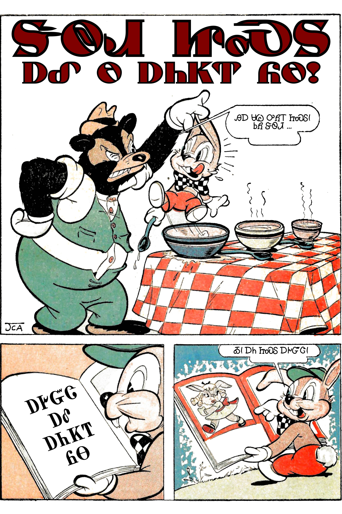
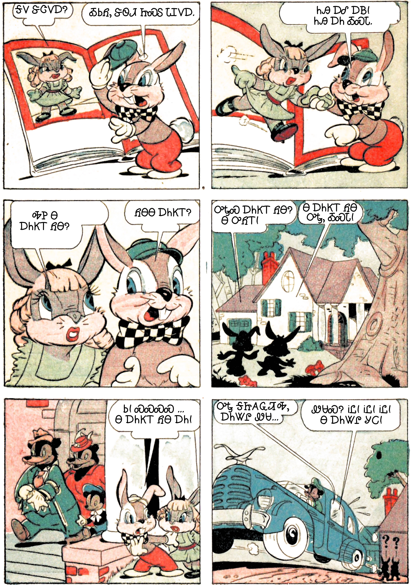
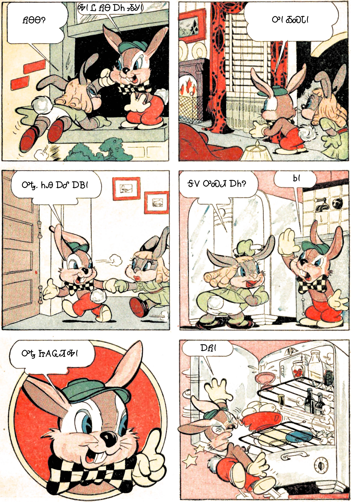
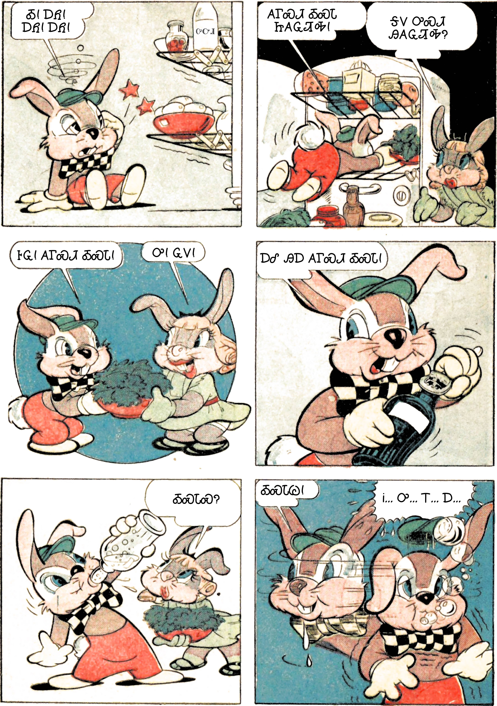
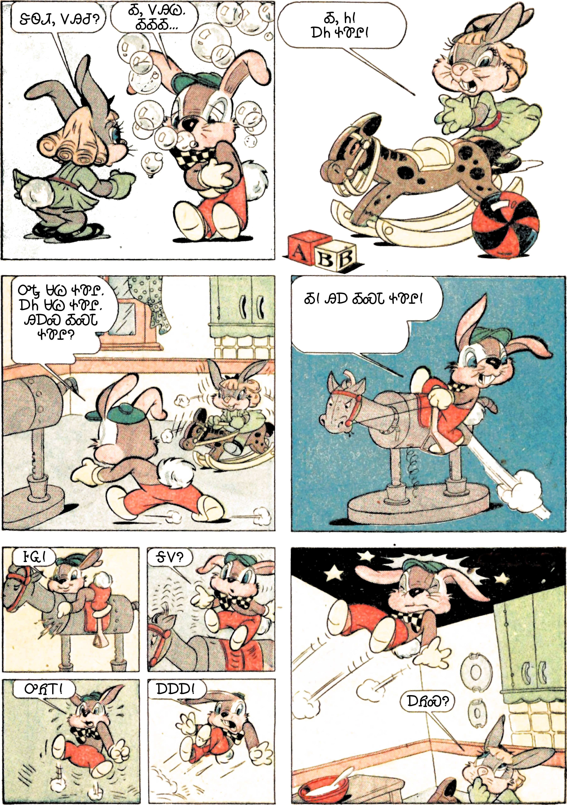
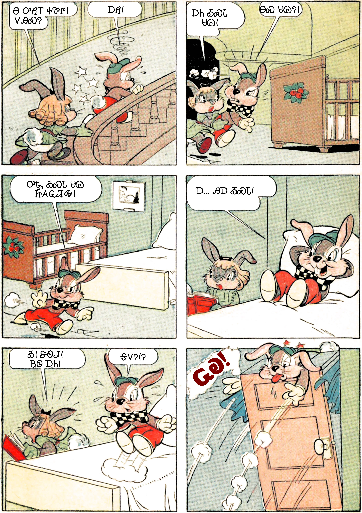
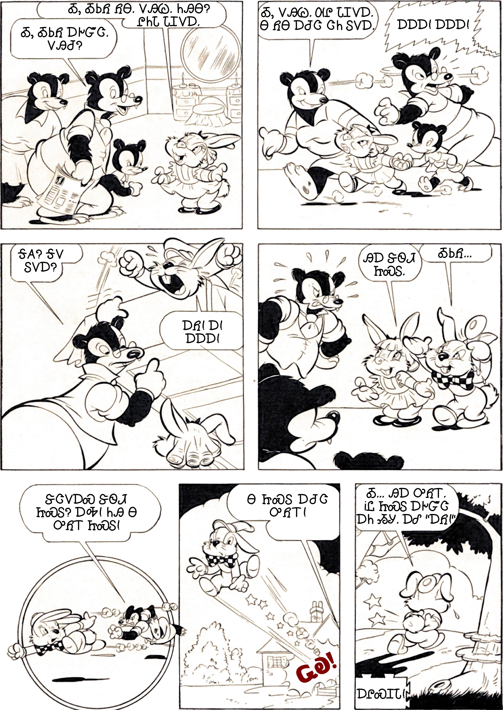

+++
draft = false
date = 2020-03-26T17:17:31Z
title = "ᏦᎦᏚᏏᏁᎢ ᎠᏕᎶᏆᏍᏗ"
weight = 1585243050

[taxonomies]
authors = ["Michael Conrad"]
categories = ["Lessons", "Grammar"]
tags = []

[extra]
zulma_title="Cherokee Language Lessons 1"
featured_image = "lessons/Cherokee-Language-Lessons-Volume-1/ᏦᎦᏚᏏᏁᎢ-ᎠᏕᎶᏆᏍᏗ---Cherokee-Language-Lessons-1/comics-dewidi-jisdu-pages.jpg-001.jpg"

+++
## ᏘᎪᎵᏯ (Read them)

  - Ꮟ  
    \[si\] “Wait\! All the same (*still)*. Even now (or then) as was
    formerly (*still)*.”
    
      - ᏝᏏ, ᎥᏝᏏ  
        \[hlạ³si, vhlạ³si\] “Not all the same (*not still)*. Not now as
        was formerly (*no longer still)*.”

  - ᎪᎱᏍᏗ, ᎪᏍᏗ  
    \[go²hu⁴sdi, go⁴sdi\] “Something. A thing. Things.”
    
      - Ꮭ ᎪᎱᏍᏗ  
        \[hla go²hu⁴sdi\] “Not anything. Nothing. No things.”

## ᎤᏬᎵᏗ ᎪᏪᎵ (Funny Paper)

Read the following comic aloud. ☞ *If you have partners, have one person
read aloud all the ᏕᏫᏗ ᏥᏍᏚ and ᏲᎾ ᎠᏍᎦᏯ parts and another the ᏥᏍᏚ ᎠᎨᏳᏣ
and ᏲᎾ ᎠᎨᏯ parts. Each person should read aloud both roles at least
once.*
<!-- more -->

## ᏙᏪᎸᎦ (Write them)

Write out each of the following Cherokee sentences from the comic
followed by an English translation. Compare your answers to the answers
in the ᎩᎵᏏ section. ☞ *Refer back to the comic as needed to be sure your
translation fits the scene the dialogue is taken from.*

### ᏣᎳᎩ

#### Page 1

  -    
    ᏕᏫᏗ ᏥᏍᏚ ᎠᎴ Ꮎ ᎠᏂᏦᎢ ᏲᎾ\!

  - ᏲᎾ  
    ᎯᎠ ᏌᏊ ᎤᏲᎢ ᏥᏍᏚ\! ᏏᏲ ᏕᏫᏗ …

  - ᏗᎪᏪᎵ  
    ᎠᎨᏳᏣ ᎠᎴ ᎠᏂᏦᎢ ᏲᎾ

  - ᏕᏫᏗ  
    Ꭳ\! ᎠᏂ ᏥᏍᏚ ᎠᎨᏳᏣ\!

#### Page 2

  - ᎠᎨᏳᏣ  
    ᎦᏙ ᏕᏣᏙᎠ?

  - ᏕᏫᏗ  
    ᎣᏏᏲ, ᏕᏫᏗ ᏥᏍᏚ ᏓᏆᏙᎠ.

  - ᏕᏫᏗ  
    ᏂᎯ ᎠᎴ ᎠᏴ\! ᏂᎯ ᎠᏂ ᎣᏍᏓ.

  - ᎠᎨᏳᏣ  
    ᎭᏢ Ꮎ ᎠᏂᏦᎢ ᏲᎾ?

  - ᏕᏫᏗ  
    ᏲᎾᎾ ᎠᏂᏦᎢ?

  - ᏕᏫᏗ  
    ᎤᎿᏍ ᎠᏂᏦᎢ ᏲᎾ? Ꮎ ᎤᏲᎢ\!

  - ᎠᎨᏳᏣ  
    Ꮎ ᎠᏂᏦᎢ ᏲᎾ ᎤᎿ, ᎣᏍᏓ\!

  - ᏕᏫᏗ  
    Ꮟ\! ᏍᏍᏍᏍ… Ꮎ ᎠᏂᏦᎢ ᏲᎾ ᎠᏂ\!

  - ᏲᎾ ᎠᏧᏣ  
    ᎤᎿ ᎦᏥᎪᏩᏘᎭ, ᎠᏂᏔᎵ ᏪᏌ…

  - ᏲᎾ ᎠᏍᎦᏯ  
    ᏪᏌᏍ? ᎥᏝ\! ᎥᏝ\! ᎥᏝ\! Ꮎ ᎠᏂᏔᎵ ᎩᏟ\!

#### Page 3

  - ᎠᎨᏳᏣ  
    ᏲᎾᎾ?

  - ᏕᏫᏗ  
    Ꭽ\! Ꮭ ᏲᎾ ᎠᏂ ᏱᎩ\!

  - ᏕᏫᏗ  
    Ꭳ\! ᎣᏍᏓ\!

  - ᏕᏫᏗ  
    ᎤᎿ. ᏂᎯ ᎠᎴ ᎠᏴ\!

  - ᎠᎨᏳᏣ  
    ᎦᏙ ᎤᏍᏗ ᎠᏂ?

  - ᏕᏫᏗ  
    Ꮟ\!

  - ᏕᏫᏗ  
    ᎤᎿ ᏥᎪᏩᏘᎭ\!

  - ᏕᏫᏗ  
    ᎠᏲ\!

#### Page 4

  - ᏕᏫᏗ  
    Ꭳ\! ᎠᏲ\! ᎠᏲ\! ᎠᏲ\!

  - ᏕᏫᏗ  
    ᎪᎱᏍᏗ ᎣᏍᏓ ᏥᎪᏩᏘᎭ\!

  - ᎠᎨᏳᏣ  
    ᎦᏙ ᎤᏍᏗ ᎯᎪᏩᏘᎭ?

  - ᏕᏫᏗ  
    ᎰᏩ\! ᎪᎱᏍᏗ ᎣᏍᏓ\!

  - ᎠᎨᏳᏣ  
    Ꭴ\! ᏩᏙ\!

  - ᏕᏫᏗ  
    ᎠᎴ ᎯᎠ ᎪᎱᏍᏗ ᎣᏍᏓ\!

  - ᎠᎨᏳᏣ  
    ᎣᏍᏓᏍ?

  - ᏕᏫᏗ  
    ᎣᏍᏓᏊ\!

  - ᏕᏫᏗ  
    Ꭵ… Ꭴ… Ꭲ… Ꭰ…

#### Page 5

  - ᎠᎨᏳᏣ  
    ᏕᏫᏗ, ᏙᎯᏧ?

  - ᏕᏫᏗ  
    Ꭳ, ᏙᎯᏊ. ᎣᎣᎣ…

  - ᎠᎨᏳᏣ  
    Ꭳ, Ꮒ\! ᎠᏂ ᏐᏈᎵ\!

  - ᏕᏫᏗ  
    ᎤᎿ ᏌᏊ ᏐᏈᎵ. ᎠᏂ ᏌᏊ ᏐᏈᎵ. ᎯᎠᏍ ᎣᏍᏓ ᏐᏈᎵ?

  - ᏕᏫᏗ  
    Ꭳ\! ᎯᎠ ᎣᏍᏓ ᏐᏈᎵ\!

  - ᏕᏫᏗ  
    ᎰᏩ\!

  - ᏕᏫᏗ  
    ᎦᏙ?

  - ᏕᏫᏗ  
    ᎤᏲᎢ\!

  - ᏕᏫᏗ  
    ᎠᎠᎠ\!

  - ᎠᎨᏳᏣ  
    ᎠᏲᏍ?

#### Page 6

  - ᎠᎨᏳᏣ  
    Ꮎ ᎤᏲᎢ ᏐᏈᎵ\! ᏙᎯᏍ?

  - ᏕᏫᏗ  
    ᎠᏲ\!

  - ᎠᎨᏳᏣ  
    ᎠᏂ ᎣᏍᏓ ᏌᏊ\!

  - ᏕᏫᏗ  
    ᎾᏍ ᏌᏊ?\!

  - ᏕᏫᏗ  
    ᎤᎿ, ᎣᏍᏓ ᏌᏊ ᏥᎪᏩᏘᎭ\!

  - ᏕᏫᏗ  
    Ꭰ… ᎯᎠ ᎣᏍᏓ\!

  - ᎠᎨᏳᏣ  
    Ꭳ\! ᏕᏫᏗ\! ᏴᏫ ᎠᏂ\!

  - ᏕᏫᏗ  
    ᎦᏙ?\!?

#### Page 7

  - ᏲᎾ ᎠᏍᎦᏯ  
    Ꭳ, ᎣᏏᏲ ᎠᎨᏳᏣ. ᏙᎯᏧ?

  - ᎠᎨᏳᏣ  
    Ꭳ, ᎣᏏᏲ ᏲᎾ. ᏙᎯᏊ. ᏂᎯᎾ? ᎵᏂᏓ ᏓᏆᏙᎠ.

  - ᏲᎾ ᎠᎨᏯ  
    Ꭳ, ᏙᎯᏊ. ᎺᎵ ᏓᏆᏙᎠ. Ꮎ ᏲᎾ ᎠᏧᏣ ᏣᏂ ᏚᏙᎠ.

  - ᏕᏫᏗ  
    ᎠᎠᎠ\! ᎠᎠᎠ\!

  - ᏲᎾ  
    ᎦᎪ? ᎦᏙ ᏚᏙᎠ?

  - ᏕᏫᏗ  
    ᎠᏲ\! Ꭰ\! ᎠᎠᎠ\!

  - ᎵᏂᏓ  
    ᎯᎠ ᏕᏫᏗ ᏥᏍᏚ.

  - ᏕᏫᏗ  
    ᎣᏏᏲ…

  - ᏲᎾ  
    ᏕᏣᏙᎠᏍ ᏕᏫᏗ ᏥᏍᏚ? ᎠᎭ\! ᏂᎯ Ꮎ ᎤᏲᎢ ᏥᏍᏚ\!

  - ᏲᎾ  
    Ꮎ ᏥᏍᏚ ᎠᏧᏣ ᎤᏲᎢ\!

  - ᏕᏫᏗ  
    Ꭳ… ᎯᎠ ᎤᏲᎢ. ᎥᏝ ᏥᏍᏚ ᎠᎨᏳᏣ ᎠᏂ ᏱᎩ. ᎠᎴ “ᎠᏲ\!”

### ᎩᎵᏏ

☞ *Your answers are not expected to exactly match the answers provided
here. Just be close.*

#### Page 1

  -    
    ᏕᏫᏗ ᏥᏍᏚ ᎠᎴ Ꮎ ᎠᏂᏦᎢ ᏲᎾ\!

  -    
    David Rabbit and Those Three Bears\!

  - ᏲᎾ  
    ᎯᎠ ᏌᏊ ᎤᏲᎢ ᏥᏍᏚ\! ᏏᏲ ᏕᏫᏗ…

  - Bear  
    This is one bad rabbit\! Hello David…

  - ᏗᎪᏪᎵ  
    ᎠᎨᏳᏣ ᎠᎴ ᎠᏂᏦᎢ ᏲᎾ

  - Book  
    A Girl and Three Bears

  - ᏕᏫᏗ  
    Ꭳ\! ᎠᏂ ᏥᏍᏚ ᎠᎨᏳᏣ\!

  - David  
    Oh\! Here is a rabbit girl\!

#### Page 2

  - ᎠᎨᏳᏣ  
    ᎦᏙ ᏕᏣᏙᎠ?

  - Girl  
    What are you called?

  - ᏕᏫᏗ  
    ᎣᏏᏲ, ᏕᏫᏗ ᏥᏍᏚ ᏓᏆᏙᎠ.

  - David  
    Hello, I’m called David Rabbit.

  - ᏕᏫᏗ  
    ᏂᎯ ᎠᎴ ᎠᏴ\! ᏂᎯ ᎠᏂ ᎣᏍᏓ.

  - David  
    You and me\! You (being) here is good.

  - ᎠᎨᏳᏣ  
    ᎭᏢ Ꮎ ᎠᏂᏦᎢ ᏲᎾ?

  - Girl  
    Where are those three bears?

  - ᏕᏫᏗ  
    ᏲᎾᎾ ᎠᏂᏦᎢ?

  - David  
    What about bears, three of them?

  - ᏕᏫᏗ  
    ᎤᎿᏍ ᎠᏂᏦᎢ ᏲᎾ? Ꮎ ᎤᏲᎢ\!

  - David  
    Are the three bears there? That’s bad\!

  - ᎠᎨᏳᏣ  
    Ꮎ ᎠᏂᏦᎢ ᏲᎾ ᎤᎿ, ᎣᏍᏓ\!

  - Girl  
    Those three bears are there, it’s good\!

  - ᏕᏫᏗ  
    Ꮟ\! ᏍᏍᏍᏍ… Ꮎ ᎠᏂᏦᎢ ᏲᎾ ᎠᏂ\!

  - David  
    Wait\! Shhhhh… Those three bears are here\!

  - ᏲᎾ ᎠᏧᏣ  
    ᎤᎿ ᎦᏥᎪᏩᏘᎭ, ᎠᏂᏔᎵ ᏪᏌ…

  - Bear boy  
    I saw them there, two cats…

  - ᏲᎾ ᎠᏍᎦᏯ  
    ᏪᏌᏍ? ᎥᏝ\! ᎥᏝ\! ᎥᏝ\! Ꮎ ᎠᏂᏔᎵ ᎩᏟ\!

  - Bear man  
    Cats? No\! No\! No\! Those are two dogs\!

#### Page 3

  - ᎠᎨᏳᏣ  
    ᏲᎾᎾ?

  - Girl  
    What about the bears?

  - ᏕᏫᏗ  
    Ꭽ\! Ꮭ ᏲᎾ ᎠᏂ ᏱᎩ\!

  - David  
    Ha\! No bears are here\!

  - ᏕᏫᏗ  
    Ꭳ\! ᎣᏍᏓ\!

  - David  
    O\! Good\!

  - ᏕᏫᏗ  
    ᎤᎿ. ᏂᎯ ᎠᎴ ᎠᏴ\!

  - David  
    There. You and me\!

  - ᎠᎨᏳᏣ  
    ᎦᏙ ᎤᏍᏗ ᎠᏂ?

  - Girl  
    What is here?

  - ᏕᏫᏗ  
    Ꮟ\!

  - David  
    Wait\!

  - ᏕᏫᏗ  
    ᎤᎿ ᏥᎪᏩᏘᎭ\!

  - David  
    I’m looking there\!

  - ᏕᏫᏗ  
    ᎠᏲ\!

  - David  
    Ouch\!

#### Page 4

  - ᏕᏫᏗ  
    Ꭳ\! ᎠᏲ\! ᎠᏲ\! ᎠᏲ\!

  - David  
    Oh\! Ow\! Ow\! Ow\!

  - ᏕᏫᏗ  
    ᎪᎱᏍᏗ ᎣᏍᏓ ᏥᎪᏩᏘᎭ\!

  - David  
    I see something good\!

  - ᎠᎨᏳᏣ  
    ᎦᏙ ᎤᏍᏗ ᎯᎪᏩᏘᎭ?

  - Girl  
    What do you see?

  - ᏕᏫᏗ  
    ᎰᏩ\! ᎪᎱᏍᏗ ᎣᏍᏓ\!

  - David  
    Alright\! Something good\!

  - ᎠᎨᏳᏣ  
    Ꭴ\! ᏩᏙ\!

  - Girl  
    Ooo\! Thanks\!

  - ᏕᏫᏗ  
    ᎠᎴ ᎯᎠ ᎪᎱᏍᏗ ᎣᏍᏓ\!

  - David  
    And this something good\!

  - ᎠᎨᏳᏣ  
    ᎣᏍᏓᏍ?

  - Girl  
    Is it good?

  - ᏕᏫᏗ  
    ᎣᏍᏓᏊ\!

  - David  
    Just fine\!

  - ᏕᏫᏗ  
    Ꭵ… Ꭴ… Ꭲ… Ꭰ…

  - David  
    Uh… Oo… Ee… Ah…

#### Page 5

  - ᎠᎨᏳᏣ  
    ᏕᏫᏗ, ᏙᎯᏧ?

  - Girl  
    David, it’s well, right?

  - ᏕᏫᏗ  
    Ꭳ, ᏙᎯᏊ. ᎣᎣᎣ…

  - David  
    Oh, just well. Oh…

  - ᎠᎨᏳᏣ  
    Ꭳ, Ꮒ\! ᎠᏂ ᏐᏈᎵ\!

  - Girl  
    Oh, look\! Here is a horse\!

  - ᏕᏫᏗ  
    ᎤᎿ ᏌᏊ ᏐᏈᎵ. ᎠᏂ ᏌᏊ ᏐᏈᎵ. ᎯᎠᏍ ᎣᏍᏓ ᏐᏈᎵ?

  - David  
    There is one horse. Here is one horse. Is this a good horse?

  - ᏕᏫᏗ  
    Ꭳ\! ᎯᎠ ᎣᏍᏓ ᏐᏈᎵ\!

  - David  
    Oh\! This is a good horse\!

  - ᏕᏫᏗ  
    ᎰᏩ\!

  - David  
    Alright\!

  - ᏕᏫᏗ  
    ᎦᏙ?

  - David  
    What?

  - ᏕᏫᏗ  
    ᎤᏲᎢ\!

  - David  
    Bad\!

  - ᏕᏫᏗ  
    ᎠᎠᎠ\!

  - David  
    Ahhh\!

  - ᎠᎨᏳᏣ  
    ᎠᏲᏍ?

  - Girl  
    Ouchies?

#### Page 6

  - ᎠᎨᏳᏣ  
    Ꮎ ᎤᏲᎢ ᏐᏈᎵ\! ᏙᎯᏍ?

  - Girl  
    That bad horse\! Are things well?

  - ᏕᏫᏗ  
    ᎠᏲ\!

  - David  
    Ouch\!

  - ᎠᎨᏳᏣ  
    ᎠᏂ ᎣᏍᏓ ᏌᏊ\!

  - Girl  
    Here is a good one\!

  - ᏕᏫᏗ  
    ᎾᏍ ᏌᏊ?\!

  - David  
    That one?\!

  - ᏕᏫᏗ  
    ᎤᎿ, ᎣᏍᏓ ᏌᏊ ᏥᎪᏩᏘᎭ\!

  - David  
    There, I see a good one\!

  - ᏕᏫᏗ  
    Ꭰ… ᎯᎠ ᎣᏍᏓ\!

  - David  
    Ah… This is good\!

  - ᎠᎨᏳᏣ  
    Ꭳ\! ᏕᏫᏗ\! ᏴᏫ ᎠᏂ\!

  - Girl  
    Oh\! David\! People are here\!

  - ᏕᏫᏗ  
    ᎦᏙ?\!?

  - David  
    What?\!?

#### Page 7

  - ᏲᎾ ᎠᏍᎦᏯ  
    Ꭳ, ᎣᏏᏲ ᎠᎨᏳᏣ. ᏙᎯᏧ?

  - Bear man  
    Oh, hello girl. Things are well, right?

  - ᎠᎨᏳᏣ  
    Ꭳ, ᎣᏏᏲ ᏲᎾ. ᏙᎯᏊ. ᏂᎯᎾ? ᎵᏂᏓ ᏓᏆᏙᎠ.

  - Girl  
    Oh, hello Bear. Things are just well. What about you all? I’m called
    Linda.

  - ᏲᎾ ᎠᎨᏯ  
    Ꭳ, ᏙᎯᏊ. ᎺᎵ ᏓᏆᏙᎠ. Ꮎ ᏲᎾ ᎠᏧᏣ ᏣᏂ ᏚᏙᎠ.

  - Bear woman  
    Oh, Things are just well. I’m called Mary. The bear boy is called
    John.

  - ᏕᏫᏗ  
    ᎠᎠᎠ\! ᎠᎠᎠ\!

  - David  
    Ahhh\! Ahhh\!

  - ᏲᎾ  
    ᎦᎪ? ᎦᏙ ᏚᏙᎠ?

  - Bear  
    Who? What’s he called?

  - ᏕᏫᏗ  
    ᎠᏲ\! Ꭰ\! ᎠᎠᎠ\!

  - David  
    Ouch\! Ah\! Ahhh\!

  - ᎵᏂᏓ  
    ᎯᎠ ᏕᏫᏗ ᏥᏍᏚ.

  - Linda  
    This is David Rabbit.

  - ᏕᏫᏗ  
    ᎣᏏᏲ…

  - David  
    Hello…

  - ᏲᎾ  
    ᏕᏣᏙᎠᏍ ᏕᏫᏗ ᏥᏍᏚ? ᎠᎭ\! ᏂᎯ Ꮎ ᎤᏲᎢ ᏥᏍᏚ\!

  - Bear  
    You are called David Rabbit? Aha\! You are that bad rabbit\!

  - ᏲᎾ  
    Ꮎ ᏥᏍᏚ ᎠᏧᏣ ᎤᏲᎢ\!

  - Bear  
    That rabbit boy is bad\!

  - ᏕᏫᏗ  
    Ꭳ… ᎯᎠ ᎤᏲᎢ. ᎥᏝ ᏥᏍᏚ ᎠᎨᏳᏣ ᎠᏂ ᏱᎩ. ᎠᎴ “ᎠᏲ\!”

  - David  
    Oh… This is bad. No girl rabbit is here. And “Ouch\!”