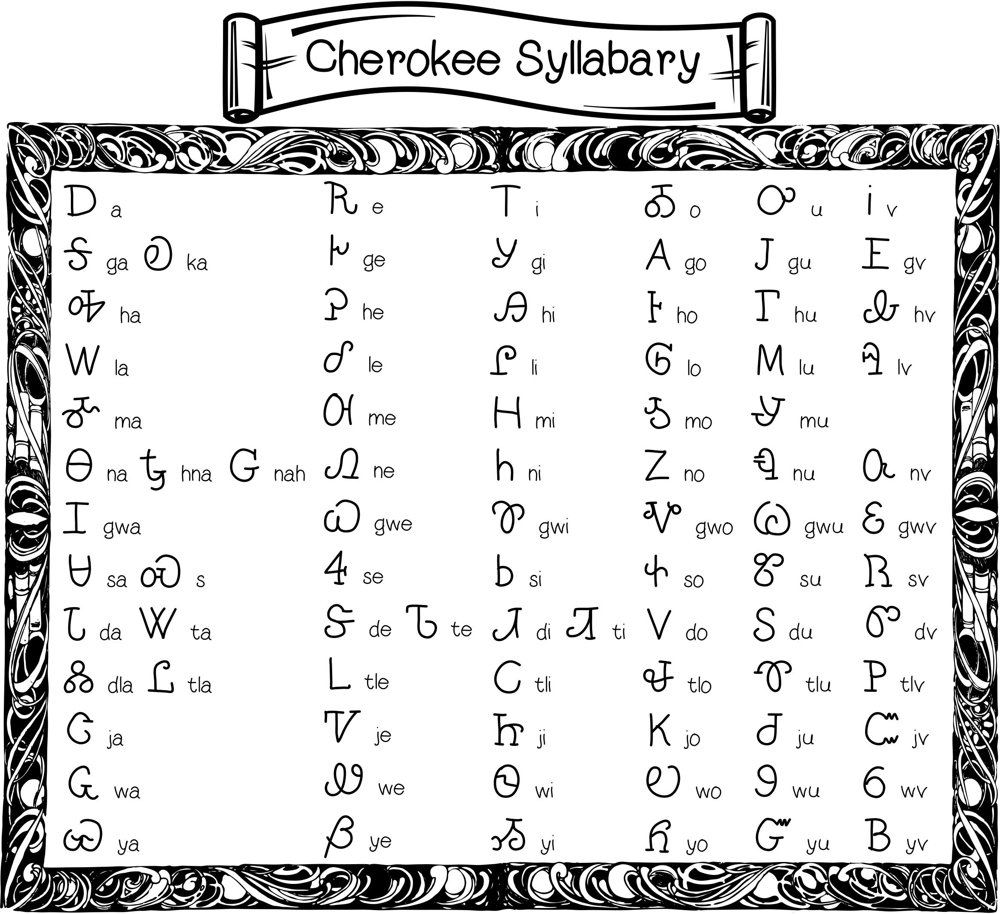

+++
draft = false
date = 2020-03-22T15:29:44Z
title = "The Syllabary"
weight = 1584890980

[taxonomies]
authors = ["Michael Conrad"]
categories = ["Grammar", "Syllabary"]
tags = ["Syllabary", "Dictation"]

[extra]

featured_image = "lessons/Syllabary-Dictation/The-Syllabary/syllabary_chart.jpg"

+++

> The Cherokee syllabary was invented by a single individual named
> Sequoyah (ᏍᏏᏉᏯ) to write the Cherokee language in 1819. He is credited
> as the only known person in history to create an alphabet from scratch
> without knowing how to read or write.
>
> Around 1809, impressed by the “talking leaves” of European written
> languages, Sequoyah began work to create a writing system for the
> Cherokee language. After attempting to create a character for each
> word, Sequoyah realized this would be too difficult and eventually
> created characters to represent syllables… He worked on the syllabary
> for twelve years before completion… The rapid dissemination of the
> syllabary is notable, and by 1824, most Cherokees could read and write
> in the newly developed writing system.
>
> In 1828, the ordering of the Syllabary and each letter’s shape were
> modified by Cherokee author and editor Elias Boudinot to adapt the
> Syllabary to the printing press… for the creation of the “Cherokee
> Phoenix (ᏣᎳᎩ ᏧᎴᎯᏌᏅᎯ)”, the first newspaper published in a Native
> American language… A digitized, searchable version of the paper is
> available through the University of Georgia Libraries and the Digital
> Library of Georgia.
<!-- more -->
<http://en.wikipedia.org/wiki/Cherokee_alphabet>

<http://en.wikipedia.org/wiki/Cherokee_Phoenix>

### The importance of writing in learning the Cherokee Syllabary.

Learning the Cherokee Syllabary is not difficult if the right technique
is used. ☞ *You should be able to learn the Cherokee Syllabary with
three to five days of dedicated study.*

The best way to learn any writing system is by writing it. Unless you
learn to write the Syllabary, you will be spending a lot of effort just
to learn to read Cherokee. The physical act of writing will dramatically
reduce the amount of time it takes for you to learn the Cherokee
Syllabary. You need to associate a physical response with each letter’s
shape.

Simply starting out by writing each letter over and over will not work.
Your brain will quickly become numb to the information you are trying to
learn and you will encounter great difficulty going beyond a dozen or so
letters. Instead you need to use challenge and response exercises that
have been crafted using a pattern that prevents this numbness from
occurring. Such an approach will give you the ability to learn many
words in very short order with a much longer retention time. One such
solution is to use a pattern based on the “Graduated Interval Recall”
method pioneered by Dr. Paul Pimsleur:

> Graduated-interval recall is a specific method of spaced repetition,
> published by Paul Pimsleur in 1967… Graduated Interval Recall is a
> complex name for a very simple theory about memory. No aspect of
> learning a foreign language is more important than memory, yet before
> Dr. Pimsleur’s work, no one had explored more effective ways for
> building language memory…
>
> <http://en.wikipedia.org/wiki/Graduated_interval_recall>

After studying Dr. Pimsleur’s Graduated Interval Recall methodology,
specially ordered exercises were created for different groupings of the
Cherokee Syllabary letters that indicate when each letter should be
written down.

The writing exercises have been broken out into seven sessions. One
session per day. The first sessions are learning new letters. The final
session is a comprehensive review exercise.

It works out best if you do each session twice per day. Once in the
morning and once in the evening.

During your later lessons, if you are having problems recognizing any of
the Syllabary, simply do the final session as a refresher.